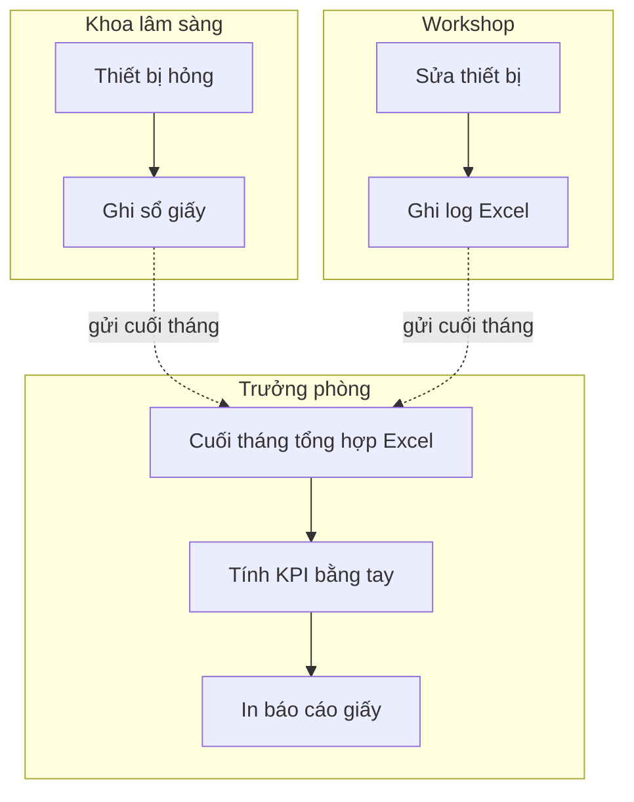
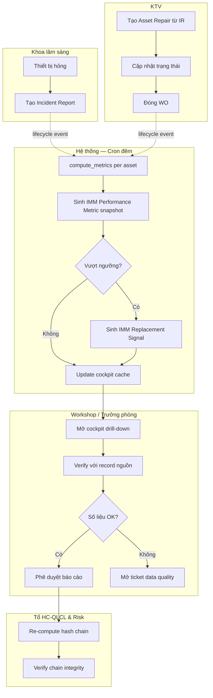
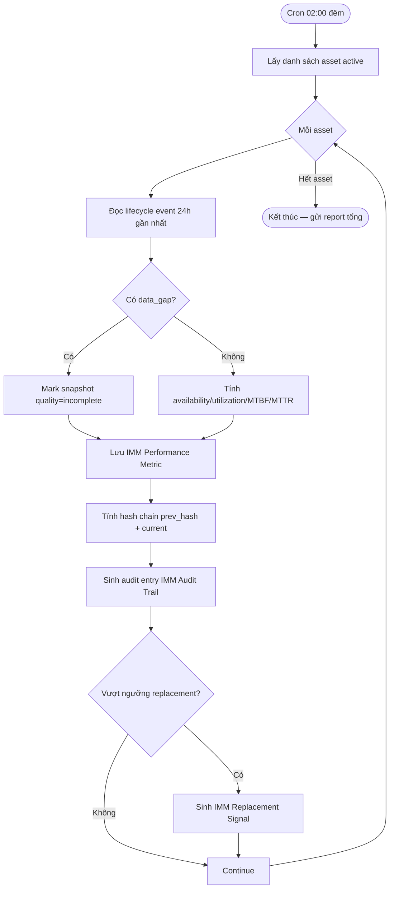
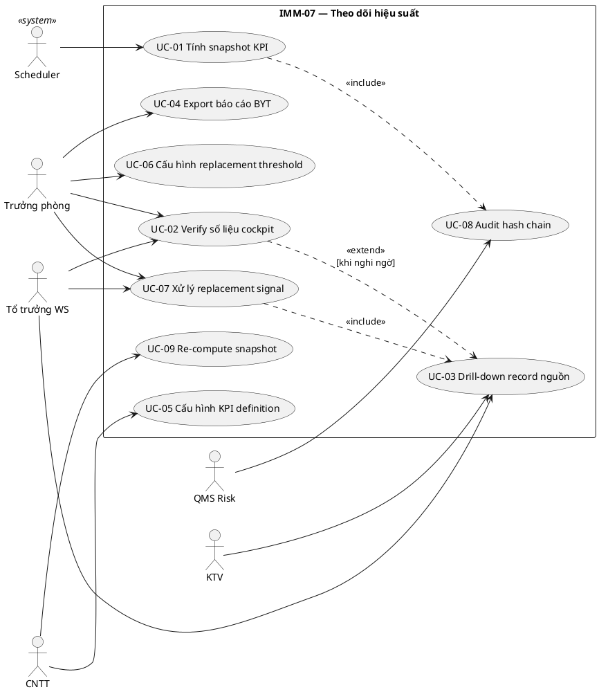
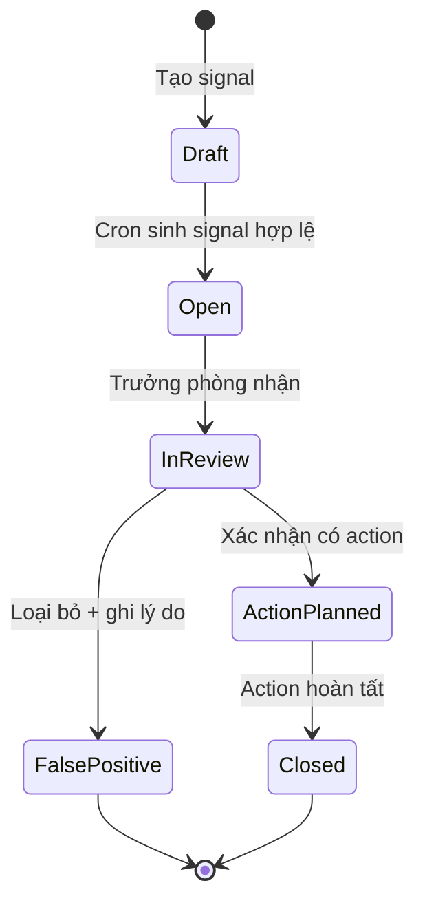

# 02 — Phân tích thiết kế nghiệp vụ (Analysis & Design)

| Mục | Giá trị |
|---|---|
| Module | IMM-07 — Theo dõi hiệu suất |
| Phạm vi | Per-module |
| Owner | BA + System Analyst (PTP Khối 2) |
| Liên kết | [03 Diagrams](./03_Diagrams.md) · [04 Backend](./04_Backend_Design.md) · [05 API](./05_API_Specification.md) · [06 Frontend](./06_Frontend_Design.md) |

> **Mục đích**: Phân tích nghiệp vụ end-to-end — module overview, quy trình BPMN, use case UML, functional specs cho việc đo lường hiệu suất thiết bị y tế (availability — utilization — downtime — replacement signal). Đây là hợp đồng giữa BA và Dev cho IMM-07.

---

# Phần I — Module Overview

## I.0. Khảo sát hiện trạng

Hiện trạng bệnh viện công Việt Nam (theo WHO HTM khảo sát + báo cáo nội bộ Phòng VT-TBYT):

- KPI vận hành thiết bị (availability, utilization, downtime) thường được tính **thủ công cuối tháng** trên Excel, từ logbook giấy của khoa lâm sàng và nhật ký bảo trì của Workshop. Mỗi nguồn dữ liệu nằm rời rạc; không có cơ chế cross-check.
- Thông tin downtime hay bị **đếm sót** vì khoa lâm sàng không ghi đầy đủ thời điểm bắt đầu/kết thúc sự cố. KTV chỉ biết thiết bị hỏng khi đã ảnh hưởng dịch vụ.
- "Replacement signal" (thiết bị cần thay thế) hiện được **đánh giá định tính** bởi tổ trưởng Workshop dựa trên kinh nghiệm — không có ngưỡng định lượng (vd MTBF < X giờ → cảnh báo).
- Báo cáo điều hành được dán trên giấy hoặc chia sẻ qua email, **không** drill-down về record nguồn để kiểm tra.

So sánh nhanh As-Is vs giải pháp tham chiếu:

| Tính năng | Excel + giấy (As-Is) | CMMS thương mại điển hình | IMM-07 (To-Be) |
|---|---|---|---|
| Tự động tính KPI | Không | Có | Có (cron đêm) |
| Verify nguồn | Không | Một phần | Có (hash chain + drill-down) |
| Replacement signal | Định tính | Cảnh báo cứng | Cảnh báo có tham số config |
| Tích hợp lifecycle | Không | Một phần | Có (lifecycle event) |

*(Ghi chú: số liệu compete chi tiết — `*(BA bổ sung trong sprint kế tiếp)*`.)*

## I.1. Pitch (1 đoạn)

Quản lý thiết bị y tế của bệnh viện hiện không có "đồng hồ đo" thống nhất — mỗi tổ giữ một bảng Excel khác nhau, KPI cuối tháng không khớp giữa khoa lâm sàng và Workshop, và tín hiệu thiết bị cần thay thế chỉ phát hiện khi đã quá muộn. **IMM-07 chuẩn hoá KPI/KRI vận hành** — availability, utilization, downtime, MTBF, MTTR — tính tự động từ dữ liệu nguồn của các module Khối 3 (PM, sửa chữa, calibration), xác minh tính toàn vẹn qua hash chain, và phát hiện tín hiệu thay thế theo ngưỡng cấu hình. Lãnh đạo có cockpit drill-down về tận record chứng minh; KTV và Workshop có cảnh báo sớm để hành động kịp thời.

## I.2. Vị trí trong WHO HTM lifecycle

Phase chạm: ☐ Needs · ☐ Procurement · ☐ Install · ☑ **Operation** · ☑ **Maintenance** · ☐ Decommission

IMM-07 nằm trong giai đoạn **Operation + Maintenance** — không tạo dữ liệu nghiệp vụ gốc mà **đo lường** dữ liệu sinh ra bởi các module khác:

- Input từ: IMM-04 (asset registry, baseline kỹ thuật), IMM-08 (PM Work Order + compliance), IMM-09 (Asset Repair downtime), IMM-11 (Calibration result + certificate hiệu lực), IMM-12 (Corrective MTTR + RCA), IMM-15 (Spare consumption rate).
- Output cho: IMM-10 (post-market signal khi thiết bị quá downtime threshold), IMM-13 (replacement review trigger), IMM-17 (feature input cho predictive model), Lớp Analytics (cockpit điều hành).

## I.3. Stakeholders & Actors

| Vai trò | Người dùng thực | Quan tâm chính | Tần suất dùng | Loại |
|---|---|---|---|---|
| Trưởng phòng VT-TBYT | 1 người | Cockpit hiệu suất tổng, replacement signal | Hàng ngày | Primary |
| Tổ trưởng Workshop | 1–2 người | KPI per asset, MTBF/MTTR, root cause | Hàng ngày | Primary |
| KTV thiết bị y tế | 5–15 người | Verify số liệu downtime của ca trực | Tuần | Secondary |
| Trưởng khoa lâm sàng | 10–30 người | Availability thiết bị khoa mình | Tuần | Secondary |
| Nhóm CNTT (CMMS/IMMIS) | 1–2 người | Job tính KPI chạy đúng, data lineage | Theo cảnh báo | System owner |
| Tổ HC-QLCL & Risk | 1–2 người | Verify hash chain, audit số liệu KPI dùng cho báo cáo BYT | Hàng tháng | Auditor |
| Ban giám đốc | 1–3 người | Dashboard điều hành cấp cao | Tuần / tháng | Approver |

## I.4. Scope

**In-scope:**
- Định nghĩa và quản trị catalog KPI/KRI (DocType `IMM Performance Metric`).
- Snapshot KPI per asset / per khoa / per loại thiết bị, theo chu kỳ ngày — tuần — tháng.
- Job cron đêm thu thập dữ liệu nguồn từ các module Khối 3 và tính toán.
- Cảnh báo replacement signal (`IMM Replacement Signal`) khi vượt ngưỡng config.
- Cockpit FE drill-down về record nguồn.
- Hash chain xác minh tính toàn vẹn snapshot (re-compute + diff).

**Out-of-scope:**
- Phân tích dự đoán / mô hình ML (thuộc IMM-17).
- Quyết định mua sắm thay thế thật sự (thuộc IMM-13/14 + IMM-01).
- KPI chất lượng dịch vụ lâm sàng (thuộc HIS, ngoài AssetCore).

**Assumptions:**
- IMM-04, 08, 09 đã ổn định và phát sinh đủ lifecycle event để tính toán.
- Mỗi asset có `working_hours_target_per_day` đã set ở IMM-04 hoặc tại Department config.
- Đồng hồ hệ thống và timezone của tất cả site là Asia/Ho_Chi_Minh.

**Dependencies:**
- DocType: `AC Asset` (IMM-04), `AC PM Work Order` (IMM-08), `Asset Repair` (IMM-09), `IMM Asset Calibration` (IMM-11), `IMM Audit Trail` (cross-cutting).
- Module: IMM-04, 08, 09, 11, 12 phải release trước (Đợt 1) — IMM-07 thuộc Đợt 3.
- Integration ngoài: *(Roadmap)* HIS để lấy số ca sử dụng thật (utilization mẫu thực).

## I.5. KPI mục tiêu

| KPI | Định nghĩa | Baseline | Target | Đo ở đâu |
|---|---|---|---|---|
| Asset Availability % | (Total uptime hours) / (Total scheduled hours) per asset per chu kỳ | *(Cần khảo sát baseline)* | ≥ 95% (thiết bị critical) | Snapshot `IMM Performance Metric` |
| Utilization % | (Actual usage hours) / (Available hours) per asset | *(Cần khảo sát baseline)* | ≥ 60% (thiết bị critical) | Snapshot + dữ liệu HIS *(roadmap)* |
| MTBF (giờ) | Mean Time Between Failures = uptime / số failure event | *(Cần khảo sát baseline)* | Tăng QoQ ≥ 5% | Tính từ `Asset Repair` |
| MTTR (giờ) | Mean Time To Repair = tổng thời gian sửa / số WO sửa chữa | *(Cần khảo sát baseline)* | ≤ 24h (non-critical), ≤ 4h (critical) | Tính từ `Asset Repair` |
| Downtime (giờ/tháng) | Tổng giờ thiết bị không sẵn sàng phục vụ | *(Cần khảo sát baseline)* | Giảm 20% YoY | Snapshot |
| % asset có replacement signal | Số asset vượt ngưỡng KRI / tổng asset đang vận hành | *(Cần khảo sát baseline)* | < 5% | Aggregation `IMM Replacement Signal` |
| KPI computation latency | Thời gian job cron đêm hoàn tất | *(Cần khảo sát baseline)* | < 30 phút cho 10k asset | Scheduler log |

## I.6. Ràng buộc Compliance

| Quy định | Yêu cầu áp lên module | Doc tham chiếu |
|---|---|---|
| NĐ98/2021/NĐ-CP | Lưu hồ sơ vận hành thiết bị y tế ≥ 5 năm; báo cáo định kỳ chỉ số sử dụng và downtime cho cơ quan quản lý khi yêu cầu | NĐ98/2021 §lưu trữ hồ sơ |
| WHO HTM — Maintenance programme overview | Theo dõi availability, downtime, MTBF, MTTR là tối thiểu cho HTM trưởng thành | WHO HTM §Performance metrics |
| WHO HTM — CMMS guideline | Dữ liệu KPI phải truy nguyên về record nguồn (drill-down) | WHO CMMS §Reporting |
| ISO 13485 (nếu áp tại site) | Document control + change control cho KPI definition | QMS QC-IMMIS-03 |
| Nội bộ — QMS PR-IMMIS-07-01..03 | PR/SOP cho thu thập, tính toán, verify, báo cáo KPI | Architecture line 342–346 |

GMDN: *(Không áp dụng trực tiếp — module dùng asset đã được IMM-04/05 phân loại.)*

## I.7. Risk & Open questions

**Risks:**

| Risk | Likelihood | Impact | Giảm thiểu |
|---|---|---|---|
| Số liệu nguồn (PM/repair log) thiếu / sai → KPI sai | Cao | Cao | Hash chain verify + alert "data gap" trên cockpit; bắt buộc IMM-08/09 sạch trước khi snapshot |
| Cron job quá tải khi >10k asset | Trung bình | Trung bình | Batch + index trên `(asset, period_start)`; chia job theo loại thiết bị |
| User mất niềm tin vào KPI khi thấy sai 1 lần | Cao | Cao | Drill-down về record nguồn ngay trên dashboard; nút "report data issue" |
| Replacement threshold chỉnh tay không qua governance | Trung bình | Cao | Threshold là DocType riêng có workflow approval (IMM-07 + IMM-16) |

**Open questions:**

| Open question | Owner | Deadline |
|---|---|---|
| Định nghĩa "scheduled hours" cho thiết bị 24/7 vs theo ca làm việc của khoa | BA + Trưởng khoa | Sprint 1 Wave 3 |
| Có cần lấy utilization từ HIS hay đủ với log thủ công của khoa? | BA + CNTT | Sprint 2 Wave 3 |
| Ngưỡng replacement default cho từng GMDN class | HTM Domain Expert | Trước UAT |

## I.8. Roadmap thực thi

| Sprint | Hạng mục | Owner | Status |
|---|---|---|---|
| Wave 3 — Sprint 1 | Khảo sát baseline KPI 5 site pilot | BA | Planned |
| Wave 3 — Sprint 1 | Thiết kế DocType `IMM Performance Metric` + `IMM Replacement Signal` | Tech Lead | Planned |
| Wave 3 — Sprint 2 | BE service `imm07.compute_metrics()` + cron | BE Dev | Planned |
| Wave 3 — Sprint 2 | API catalog + envelope | BE Dev | Planned |
| Wave 3 — Sprint 3 | Cockpit FE + drill-down | FE Dev | Planned |
| Wave 3 — Sprint 3 | Replacement signal alert + threshold workflow | BE + BA | Planned |
| Wave 3 — Sprint 4 | UAT 2 site pilot + audit hash chain | QA + QMS | Planned |
| Wave 3 — Sprint 5 | Roll-out toàn bệnh viện + training | PM | Planned |

---

# Phần II — Quy trình nghiệp vụ (Business Process / BPMN)

## II.1. Phân biệt 3 khái niệm
- **Business Process** = tổ chức làm thế nào (file này)
- **Use Case** = actor + system + goal (Phần III)
- **Workflow** = DocType state + transition (file 04 §III)

## II.2. As-Is process (chưa có hệ thống)

KTV ghi sổ giấy về sự cố và downtime. Cuối tháng, Workshop tổng hợp lên Excel. Trưởng phòng đối chiếu với báo cáo của khoa lâm sàng (cũng Excel). Tự tay tính availability và downtime theo công thức nhớ trong đầu. Báo cáo điều hành in ra giấy.

## II.3. Pain points

| # | Pain | Tác động |
|---|---|---|
| 1 | Số liệu downtime đếm sót do khoa LS không ghi đủ | KPI availability over-estimate, BG hiểu sai năng lực |
| 2 | KPI cuối tháng giữa khoa LS và Workshop không khớp | Họp giao ban tốn 2–3 tiếng đối soát |
| 3 | Replacement signal phát hiện muộn | Thiết bị critical hỏng đột xuất, ảnh hưởng dịch vụ |
| 4 | Không drill-down về record nguồn | Auditor BYT không tin được số liệu báo cáo |
| 5 | Tính KPI thủ công | Trưởng phòng tốn 1–2 ngày/tháng |

## II.4. To-Be process (với AssetCore)

## II.5. Decision points

| Điểm | Câu hỏi | Quy tắc |
|---|---|---|
| C3 | Asset có vượt ngưỡng replacement? | MTBF < `replacement_threshold.mtbf_min` HOẶC downtime tháng > `replacement_threshold.downtime_max` HOẶC tuổi thiết bị > expected_life × 0.9 |
| D3 | Số liệu cockpit có đúng? | Hash chain verify pass + drill-down về record nguồn không có flag `data_gap` |

## II.6. Process metrics

| Metric | Mục tiêu | Đo ở đâu |
|---|---|---|
| Thời gian tính KPI tháng | < 30 phút (tự động) | Scheduler log |
| % cockpit drill-down thành công | 100% | FE telemetry |
| Số "data quality ticket" / tháng | ≤ 5 | Ticket system |
| Time-to-detect replacement signal | ≤ 24h kể từ khi đạt ngưỡng | So sánh ngày sinh signal vs ngày event nguồn |

## II.7. RACI matrix

| Hoạt động | Trưởng phòng | Tổ trưởng WS | KTV | Khoa LS | CNTT | QMS Risk |
|---|---|---|---|---|---|---|
| Định nghĩa KPI/threshold | A | C | I | C | I | C |
| Vận hành cron job | I | I | I | I | R/A | I |
| Verify số liệu cockpit | A | R | C | C | I | C |
| Audit hash chain | I | I | I | I | C | R/A |
| Quyết định action từ replacement signal | A | R | I | C | I | C |

## II.8. Exception flow

**Exception 1 — Job cron fail giữa chừng:** Hệ thống resume từ checkpoint asset cuối cùng đã tính. Sinh `IMM Audit Trail` log với mức ERROR. CNTT nhận alert qua email/Slack.

**Exception 2 — Số liệu nguồn có flag data_gap:** Snapshot vẫn được sinh nhưng đánh dấu `quality = "incomplete"`. Cockpit hiển thị badge cảnh báo và disable approve report.

**Exception 3 — Hash chain verify fail:** Khoá toàn bộ snapshot của chu kỳ đó về trạng thái `under_review`. QMS Risk + CNTT vào điều tra trước khi unlock.

## II.9. So sánh As-Is vs To-Be

| Khía cạnh | As-Is | To-Be |
|---|---|---|
| Tần suất cập nhật | Tháng | Ngày (cron đêm) |
| Nguồn dữ liệu | Sổ giấy + Excel rời rạc | Lifecycle event tự động |
| Verify | Không | Hash chain + drill-down |
| Replacement signal | Định tính cuối năm | Tự động theo ngưỡng |
| Báo cáo BYT | In giấy | Export PDF + dữ liệu nguồn |

## II.10. Activity diagram per UC chính

**UC-01 — Tính snapshot KPI hằng ngày**

*(Activity diagrams cho UC-02 verify, UC-03 drill-down, UC-04 export — `*(BA bổ sung trong sprint kế tiếp)*`.)*

---

# Phần III — Use Case Specification (UML)

## III.1. Use Case Diagram

### III.1.a. Biểu đồ use case tổng quát

### III.1.b. Biểu đồ use case phân rã

**Nhóm 1 — Computation (background):** UC-01, UC-09 — actor SCH, IT.
**Nhóm 2 — Consumption (cockpit user):** UC-02, UC-03, UC-04 — actor MGR, WSM, TECH.
**Nhóm 3 — Governance (config + audit):** UC-05, UC-06, UC-07, UC-08 — actor MGR, IT, AUD.

*(Plantuml chi tiết cho từng nhóm — `*(BA bổ sung trong sprint kế tiếp)*`.)*

## III.2. Actor catalog

| Actor | Loại | Mô tả | Goal chính |
|---|---|---|---|
| Trưởng phòng | Primary | Lãnh đạo Phòng VT-TBYT | Có cockpit hiệu suất tin cậy để ra quyết định |
| Tổ trưởng Workshop | Primary | Quản lý nhóm KTV | Xác minh KPI per asset và xử lý replacement signal |
| KTV | Secondary | Người vận hành sửa chữa | Drill-down để hiểu vì sao asset được flag |
| QMS Risk Auditor | Auditor | Tổ HC-QLCL & Risk | Verify hash chain, xác nhận audit-readiness |
| Scheduler | System | Cron Frappe | Kích hoạt compute_metrics đêm |
| CNTT (System owner) | System | Nhóm IMMIS | Vận hành job, cấu hình KPI definition |

## III.3. Use Case Specifications

### UC-01: Tính snapshot KPI

| Mục | Giá trị |
|---|---|
| ID | UC-IMM07-01 |
| Brief | Cron tính snapshot KPI per asset hằng ngày dựa trên lifecycle event |
| Primary actor | Scheduler |
| Pre-condition | – Job hôm trước đã hoàn tất hoặc không tồn tại; – DocType `IMM Performance Metric Definition` đã có ≥ 1 record active |
| Post-condition | – Mỗi asset active có 1 snapshot ngày hôm nay; – Audit chain entry sinh ra |
| Trigger | Cron `0 2 * * *` (02:00 hằng đêm) |

#### Main flow
| Bước | Actor | System |
|---|---|---|
| 1 | Scheduler | Gọi `imm07.compute_metrics(date=yesterday)` |
| 2 |  | Service lấy asset list active |
| 3 |  | Cho mỗi asset, repository đọc lifecycle event window 24h |
| 4 |  | Service tính các KPI definition active |
| 5 |  | Repository ghi `IMM Performance Metric` |
| 6 |  | Service tính hash chain (prev_hash + current_hash) |
| 7 |  | Service ghi audit trail |
| 8 |  | Service kiểm tra replacement threshold; nếu vượt, sinh `IMM Replacement Signal` |
| 9 |  | Service publish notify to cockpit cache |

#### Alternative A1 — Resume sau crash
- 1.a. Scheduler đọc `last_processed_asset` từ checkpoint, tiếp tục từ asset kế tiếp.

#### Exception E1 — Data gap trên 1 asset
- 4.a. Repository báo flag `data_gap=True`. Service vẫn tạo snapshot với `quality="incomplete"` và log warning.

#### Special requirements
- Performance: ≤ 30 phút cho 10k asset.
- Audit: mọi snapshot có hash chain SHA-256 với prev.

### UC-02..UC-09 — *(Spec đầy đủ — `*(BA bổ sung trong sprint kế tiếp)*` sau khi BE scaffold để biết endpoint thật.)*

## III.4. Use Case relationships

| Quan hệ | Caller | Callee | Loại |
|---|---|---|---|
| UC-01 → UC-08 | UC-01 Tính snapshot | UC-08 Audit hash chain | `<<include>>` |
| UC-07 → UC-03 | UC-07 Xử lý replacement signal | UC-03 Drill-down | `<<include>>` |
| UC-02 → UC-03 | UC-02 Verify | UC-03 Drill-down | `<<extend>>` (khi nghi ngờ) |

## III.5. UC ↔ User Story mapping

| Use Case | US ID | Note |
|---|---|---|
| UC-01 | IMM07-US-01, IMM07-US-02 | Cron + data gap |
| UC-02 | IMM07-US-03 | Verify cockpit |
| UC-03 | IMM07-US-04 | Drill-down |
| UC-04 | IMM07-US-05 | Export PDF báo cáo |
| UC-05 | IMM07-US-06 | KPI definition CRUD |
| UC-06 | IMM07-US-07 | Threshold config |
| UC-07 | IMM07-US-08 | Replacement workflow |
| UC-08 | IMM07-US-09 | Hash chain audit |
| UC-09 | IMM07-US-10 | Re-compute |

## III.6. UC ↔ Sequence Diagram mapping

| Use Case | Sequence ID trong 03 Diagrams | Note |
|---|---|---|
| UC-01 | SEQ-IMM07-01 | Cron compute path |
| UC-03 | SEQ-IMM07-02 | Drill-down call chain |
| UC-07 | SEQ-IMM07-03 | Replacement signal lifecycle |

---

# Phần IV — Functional Specifications

## IV.1. User Stories & Acceptance Criteria

**IMM07-US-01** — Là **Scheduler**, tôi muốn **chạy job tính KPI 02:00 đêm**, để **dữ liệu cockpit sáng hôm sau là mới**.
- Priority: Must · Estimate: 5
- AC1: Given cron đến 02:00, When job khởi động, Then job đọc danh sách asset active và xử lý từng asset.
- AC2: Given job hoàn tất, When tổng thời gian, Then ≤ 30 phút cho 10k asset.
- Edge: Job đang chạy thì service restart → resume từ checkpoint.

**IMM07-US-02** — Là **Scheduler**, tôi muốn **bỏ qua asset thiếu dữ liệu nguồn nhưng vẫn ghi flag data_gap**, để **cockpit hiển thị cảnh báo thay vì im lặng**.
- Priority: Must · Estimate: 3
- AC1: Given asset không có lifecycle event 24h, When tính snapshot, Then snapshot có `quality="incomplete"`.
- AC2: Given quality=incomplete, When cockpit render, Then badge cảnh báo hiện thị.

**IMM07-US-03** — Là **Trưởng phòng**, tôi muốn **xem cockpit hiệu suất tổng**, để **ra quyết định điều hành hằng ngày**.
- Priority: Must · Estimate: 8
- AC1: Cockpit hiển thị 6 KPI tổng (availability, utilization, MTBF, MTTR, downtime, # replacement signal) với so sánh tuần trước.
- AC2: Mỗi KPI có drill-down về danh sách asset đóng góp.

**IMM07-US-04..US-10** — *(Chi tiết — `*(BA bổ sung trong sprint kế tiếp)*`.)*

## IV.2. Business Rules

| ID | Rule | Implement ở | Liên kết test |
|---|---|---|---|
| IMM07-BR-01 | Snapshot không thể bị xoá; chỉ "supersede" bằng snapshot re-compute mới có lý do | DocType controller `IMM Performance Metric` | TC-IMM07-BR-01 |
| IMM07-BR-02 | Hash chain phải tăng dần và không bị break | Service `imm07.audit_chain` | TC-IMM07-BR-02 |
| IMM07-BR-03 | Replacement signal chỉ được Close bởi Trưởng phòng + ghi action_taken | Workflow `IMM Replacement Signal` | TC-IMM07-BR-03 |
| IMM07-BR-04 | KPI definition active không được edit công thức; phải clone version mới | Validator | TC-IMM07-BR-04 |
| IMM07-BR-05 | Threshold replacement đổi phải qua approval (1 maker + 1 checker) | Workflow `IMM Replacement Threshold` | TC-IMM07-BR-05 |

## IV.3. State Machine

| State | Mô tả | Role có quyền chuyển | Action button |
|---|---|---|---|
| Draft | Mới tạo bởi cron | System | (auto → Open) |
| Open | Sẵn sàng review | System | — |
| InReview | Trưởng phòng đang xem xét | Trưởng phòng | "Plan Action" / "Mark False Positive" |
| ActionPlanned | Có hành động (vd schedule replacement) | Trưởng phòng | "Close" |
| FalsePositive | Loại bỏ | Trưởng phòng | — |
| Closed | Đã giải quyết | Trưởng phòng | — |

## IV.4. Input — Output

**(a) Input fields chính (tại UI cấu hình KPI definition):**
- `kpi_code` — required, unique, format `^[A-Z][A-Z0-9_]{2,30}$`.
- `category` — required, link → Performance Category (depends on nothing).
- `formula_expr` — required, sandbox Python expression.
- `period_type` — required, select [daily, weekly, monthly].
- `applies_to_asset_class` — link → GMDN class. **Cascade**: khi `category` đổi, reset `applies_to_asset_class`.

**(b) Output records sinh ra:**
- `IMM Performance Metric` (snapshot) — 1 record / asset / period / KPI.
- `IMM Replacement Signal` (khi vượt threshold).
- `IMM Audit Trail` entry cho mỗi compute run + mỗi signal lifecycle.

**(c) Notification / side effect:**
- Email/Slack alert tới Trưởng phòng + Workshop khi có signal mới mức "high".
- Update cockpit cache (Redis hoặc Frappe cache).
- Lifecycle event `performance_snapshot_created` gắn vào asset.

## IV.5. Edge cases & Errors

| ID | Edge case | Hành vi mong đợi | Error code (BE) |
|---|---|---|---|
| EC-01 | Cron trùng nhau (chạy 2 instance) | Lock advisory; instance sau exit gracefully | `IMM07_JOB_ALREADY_RUNNING` |
| EC-02 | Asset bị retire (IMM-13) ở giữa chu kỳ | Tính snapshot cho phần thời gian active, đánh dấu partial | `IMM07_ASSET_RETIRED_MIDPERIOD` |
| EC-03 | KPI definition vừa update khi cron đang chạy | Dùng version snapshot tại thời điểm bắt đầu job | `IMM07_KPI_DEFINITION_LOCKED` |
| EC-04 | Hash chain verify mismatch | Block snapshot mới, alert QMS Risk | `IMM07_AUDIT_CHAIN_BROKEN` |
| EC-05 | User không quyền xem cross-department drill-down | 403 + log security event | `IMM07_PERMISSION_DENIED` |
| EC-06 | Threshold rỗng (chưa cấu hình) | Skip replacement signal, log info | `IMM07_THRESHOLD_NOT_CONFIGURED` |

*(Error code phải có entry trong `assetcore/services/shared/constants.py:ErrorCode` — `*(Sprint Wave 3 — sau khi BE scaffold)*`.)*

## IV.6. Out of scope & Open issues

**Out-of-scope confirm:**
- Không train ML model (IMM-17).
- Không quyết định thay thế thật (IMM-13).
- Không tích hợp HIS giai đoạn này.

**Open issues:**
- Có cần real-time KPI (streaming) hay daily snapshot là đủ? — Owner: BA, Deadline: trước Sprint 2.
- Multi-site rollup KPI — design separately?

---

# Phần V — Yêu cầu phi chức năng (Non-Functional Requirements)

## V.1. Hiệu năng (Performance)

| Metric | Target | Đo ở đâu |
|---|---|---|
| API `get_metric` p95 latency | ≤ 300ms | APM |
| Cockpit page TTI | ≤ 2s với 100 asset | Lighthouse |
| Cron compute_metrics 10k asset | ≤ 30 phút | Scheduler log |
| DB query lookup snapshot per asset/period p95 | ≤ 100ms | DB profiler |
| Throughput drill-down API | ≥ 50 req/s | Load test |

## V.2. Bảo mật (Security)

- **Authentication**: Frappe session + API key cho integration.
- **Authorization**: RBAC 3 cấp; KTV chỉ xem asset thuộc khoa được phân; Trưởng phòng xem toàn site; QMS Risk read-only audit.
- **Audit trail**: Hash chain SHA-256 mọi snapshot + mọi signal lifecycle.
- **Compliance**: NĐ98/2021 lưu hồ sơ ≥ 5 năm + WHO HTM verify.
- **Data sensitivity**: Không lưu patient data; chỉ dữ liệu thiết bị.
- **OWASP Top 10**: Đáp ứng (cụ thể tại file 07 §III).

## V.3. Khả dụng (Availability)

| Metric | Target |
|---|---|
| Uptime cockpit | ≥ 99.5% giờ làm việc 7×12 |
| MTBF (ứng dụng IMM-07) | ≥ 720 giờ |
| RPO | ≤ 4 giờ (snapshot DB) |
| RTO | ≤ 1 giờ |

## V.4. Khả mở rộng (Scalability)

- ≥ 50 concurrent user trên cockpit.
- Dataset: ≥ 500k snapshot record/site/năm.
- Multi-site: 1 codebase, N site độc lập.

## V.5. Khả dụng UX (Usability)

- WCAG 2.1 AA (contrast, keyboard nav).
- Browser: Chrome ≥ 120, Edge ≥ 120, Firefox ≥ 122.
- Tiếng Việt primary; English secondary.
- Responsive: desktop-first ≥ 1280, tablet ≥ 768.
- Onboarding: Trưởng phòng dùng được sau < 30 phút training.

## V.6. Bảo trì (Maintainability)

- Coverage: service ≥ 85%, DocType ≥ 70%, API ≥ 60%.
- Docstring bắt buộc cho public service.
- Lint: ruff/black/eslint pass 100%.
- Tech debt budget ≤ 20% sprint capacity.

## V.7. Tuân thủ (Compliance)

- Lưu hồ sơ ≥ 5 năm (NĐ98).
- Hash chain audit cho mọi compute run.
- Phân tách trách nhiệm: System (tính) ≠ Trưởng phòng (verify) ≠ QMS (audit chain).
- Document control workflow cho KPI definition + Threshold (Effective/Obsolete).
