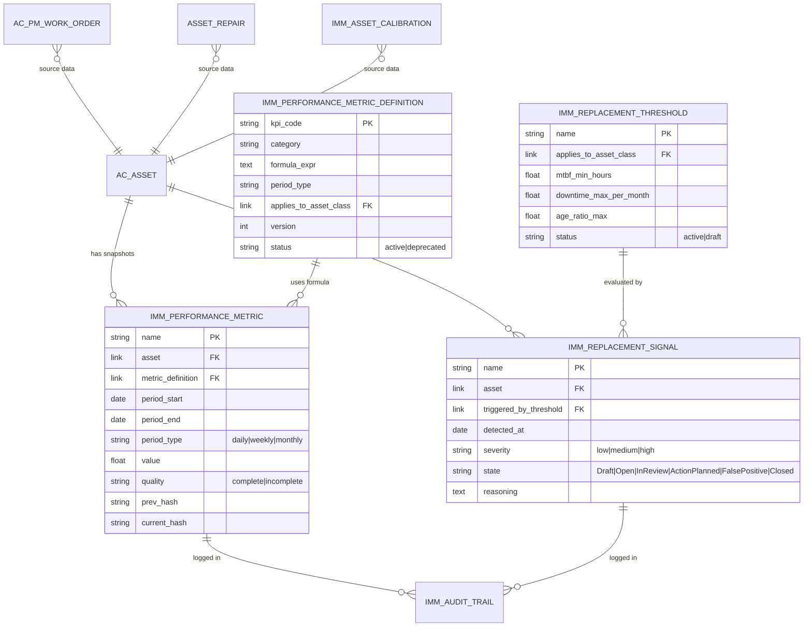
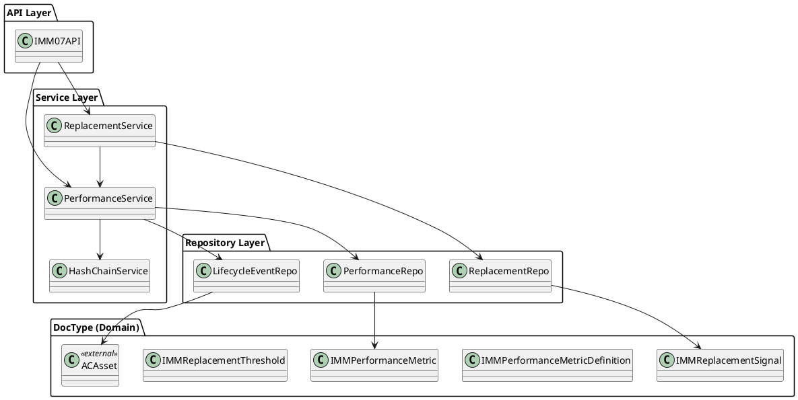
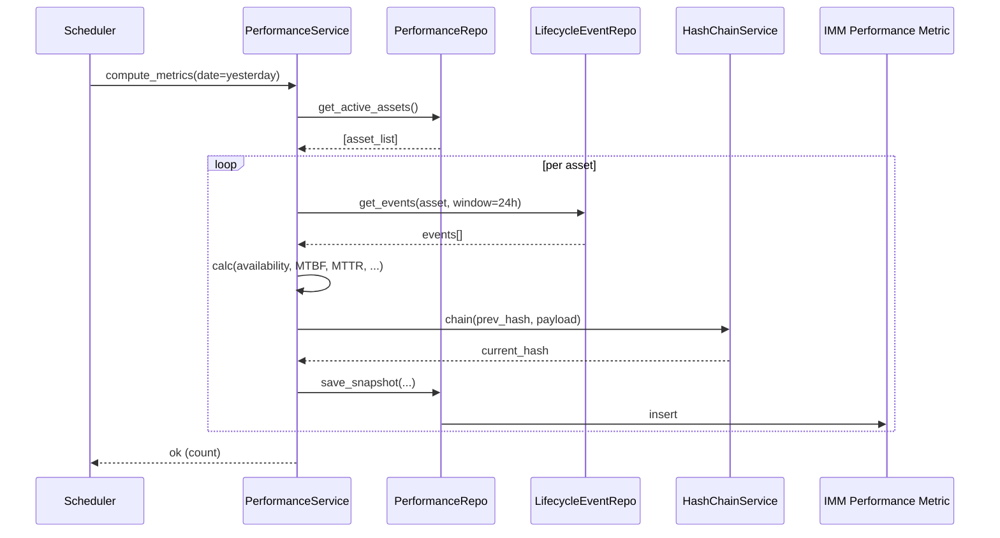
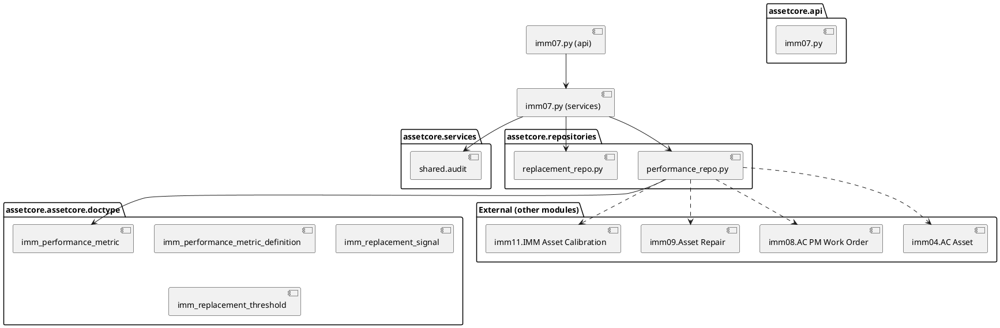

# 03 — Biểu đồ kỹ thuật (UML Diagrams)

| Mục | Giá trị |
|---|---|
| Module | IMM-07 — Theo dõi hiệu suất |
| Phạm vi | ERD · Class · Sequence · Communication · Package |
| Owner | Tech Lead + BA |
| Liên kết | [02 Analysis](./02_Analysis_Design.md) · [04 Backend](./04_Backend_Design.md) |

---

# Phần I — Entity Relationship Diagram (ERD)

## I.1. ERD logic

## I.2. Cardinality cheatsheet

- 1 asset — N snapshot per period.
- 1 KPI definition — N snapshot.
- 1 asset — 0..N replacement signal (typically 0 or 1 active at a time).
- 1 threshold — N signal evaluations.

## I.3. Entity catalog

| Entity | DocType | Owner module | Mô tả |
|---|---|---|---|
| AC Asset | `AC Asset` | IMM-04 | Thiết bị y tế |
| IMM Performance Metric | `IMM Performance Metric` | IMM-07 | Snapshot KPI |
| IMM Performance Metric Definition | `IMM Performance Metric Definition` | IMM-07 | Catalog công thức |
| IMM Replacement Signal | `IMM Replacement Signal` | IMM-07 | Cảnh báo thay thế |
| IMM Replacement Threshold | `IMM Replacement Threshold` | IMM-07 | Ngưỡng cấu hình |
| IMM Audit Trail | `IMM Audit Trail` | Cross-cutting | Hash chain |

## I.4. Data dictionary (Schema CSDL chi tiết)

### Bảng I.4.1: IMM Performance Metric

| Field | Type | Mandatory | Link / Options | Mô tả |
|---|---|---|---|---|
| `name` | Data (autoname) | Yes | `IMM-07-PM-.YYYY.-.MM.-.####` | PK |
| `asset` | Link | Yes | AC Asset | Thiết bị |
| `metric_definition` | Link | Yes | IMM Performance Metric Definition | KPI nào |
| `period_start` | Date | Yes | — | Đầu chu kỳ |
| `period_end` | Date | Yes | — | Cuối chu kỳ |
| `period_type` | Select | Yes | daily / weekly / monthly | Chu kỳ |
| `value` | Float | Yes | — | Giá trị KPI |
| `quality` | Select | Yes | complete / incomplete | Cờ data gap |
| `source_records` | Long Text (JSON) | No | — | Danh sách record nguồn |
| `prev_hash` | Data | No | — | Hash chain trước |
| `current_hash` | Data | Yes | SHA-256 hex 64 | Hash hiện tại |

*(Bảng I.4.2..I.4.5 cho 4 DocType còn lại — `*(Sprint Wave 3 — sau khi BE scaffold)*`.)*

## I.5. Constraints & indexes

- Unique key: `(asset, metric_definition, period_start, period_type)`.
- Index: `(asset, period_start DESC)` cho query drill-down.
- Index: `current_hash` cho hash chain verify.

## I.6. Naming conventions

- DocType: `IMM Performance Metric*` (prefix module).
- Fieldname: snake_case.
- Autoname: `IMM-07-<TYPE>-.YYYY.-.MM.-.####`.

## I.7. Mapping ERD → DocType

| Entity | DocType file | Note |
|---|---|---|
| IMM Performance Metric | `assetcore/assetcore/doctype/imm_performance_metric/` | *(Sprint Wave 3)* |
| IMM Performance Metric Definition | `.../imm_performance_metric_definition/` | *(Sprint Wave 3)* |
| IMM Replacement Signal | `.../imm_replacement_signal/` | *(Sprint Wave 3)* |
| IMM Replacement Threshold | `.../imm_replacement_threshold/` | *(Sprint Wave 3)* |

## I.8. Volume & retention

- Snapshot: 10k asset × 5 KPI × 365 ngày = ~18M record/năm/site.
- Retention: ≥ 5 năm (NĐ98). Sau 2 năm có thể archive sang cold storage.

## I.9. Data classification & PII

Không có PII. Phân loại nội bộ: "Operational — sensitive cho audit".

---

# Phần II — Class Diagram

## II.1. Class Diagram — 2 cấp

### II.1.a. Biểu đồ lớp tổng quát

### II.1.b. Biểu đồ lớp chi tiết per major class

*(Plantuml chi tiết cho `PerformanceService` và `ReplacementService` — `*(Sprint Wave 3 — sau khi BE scaffold)*`.)*

## II.2. Layer mapping

| Class | Layer | File |
|---|---|---|
| `IMM07API` | API | `assetcore/api/imm07.py` |
| `PerformanceService` | Service | `assetcore/services/imm07.py` |
| `HashChainService` | Service (shared) | `assetcore/services/shared/audit.py` |
| `PerformanceRepo` | Repository | `assetcore/repositories/performance_repo.py` |

## II.3. Class catalog

*(Bảng đầy đủ — `*(Sprint Wave 3)*`.)*

## II.4. Relationships glossary

- API → Service: dependency (call).
- Service → Repository: dependency.
- Repository → DocType: ORM via Frappe.

## II.5. Stereotypes

- `<<external>>` — DocType thuộc module khác.
- `<<system>>` — Scheduler.

## II.6. Class design principles

- 3-tier strict (theo `.claude/skills/CONVENTIONS.md` §2).
- Service không gọi DocType trực tiếp, phải qua Repository.
- API thin, mọi logic ở Service.

## II.7. Sub-feature class diagrams

*(Sẽ vẽ riêng cho compute pipeline và signal workflow — `*(BA bổ sung trong sprint kế tiếp)*`.)*

---

# Phần III — Sequence Diagram

## III.1. Khi nào vẽ sequence?

Cho UC có ≥ 3 actor/component tương tác async.

## III.2. Convention

- Lifeline: actor + boundary + control + entity.
- `note over`: ràng buộc nghiệp vụ.

## III.3. Sequence diagrams chính

### SEQ-IMM07-01 — Cron compute snapshot (UC-01)

### SEQ-IMM07-02 — Drill-down (UC-03)

*(Mermaid — `*(BA bổ sung trong sprint kế tiếp)*`.)*

### SEQ-IMM07-03 — Replacement signal lifecycle (UC-07)

*(Mermaid — `*(BA bổ sung trong sprint kế tiếp)*`.)*

## III.4. Checklist tránh sót

- [ ] Mỗi UC chính có ≥ 1 sequence.
- [ ] Lifeline có boundary/control/entity rõ.
- [ ] Note ràng buộc audit trail.

## III.5. Cross-reference

| Sequence | Use Case | File 04 service | File 05 endpoint |
|---|---|---|---|
| SEQ-IMM07-01 | UC-01 | `PerformanceService.compute_metrics` | (cron, no API) |
| SEQ-IMM07-02 | UC-03 | `PerformanceService.drill_down` | `imm07.drill_down` |
| SEQ-IMM07-03 | UC-07 | `ReplacementService.transition` | `imm07.transition_signal` |

---

# Phần IV — Communication Diagram

## IV.1. Khi nào dùng?

Khi cần show topology giữa nhiều component cùng lúc (vs sequence — show theo thời gian).

## IV.2. Convention

Numbering scheme `1.1`, `1.2`, ... thể hiện thứ tự tương tác.

## IV.3. Numbering scheme

`<UC>.<step>.<sub-step>`.

## IV.4. Communication diagrams chính

*(Vẽ sau khi BE scaffold — `*(Sprint Wave 3)*`.)*

## IV.5. Cross-reference

*(Bảng — `*(Sprint Wave 3)*`.)*

---

# Phần V — Package / Dependency Diagram

## V.1. Khi nào vẽ?

Khi module có > 5 file Python hoặc cross-module dep.

## V.2. Backend package diagram

## V.3. Frontend package diagram

*(Sẽ thêm khi FE scaffold — `*(Sprint Wave 3)*`.)*

## V.4. Cross-module dependency

IMM-07 phụ thuộc read-only vào IMM-04, 08, 09, 11, 12, 15. Không có module nào phụ thuộc ngược lại IMM-07 (loose coupling — IMM-10/13/17 đọc snapshot qua API).

## V.5. Anti-patterns

- ❌ Service IMM-07 ghi vào DocType của IMM-08/09 — chỉ đọc.
- ❌ Repository IMM-07 import service module khác — chỉ qua API hoặc DocType layer.
