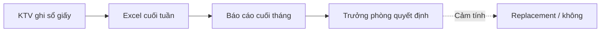
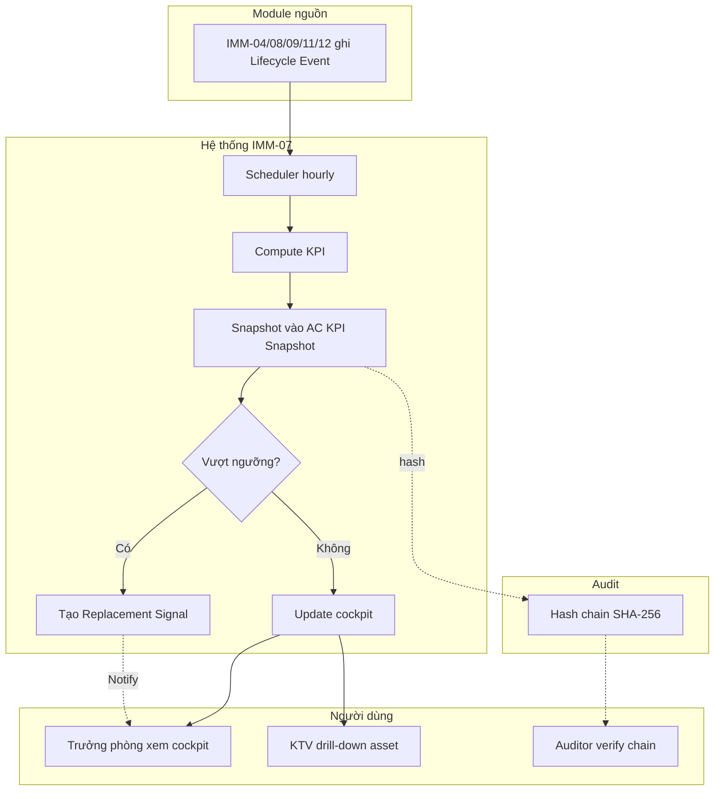
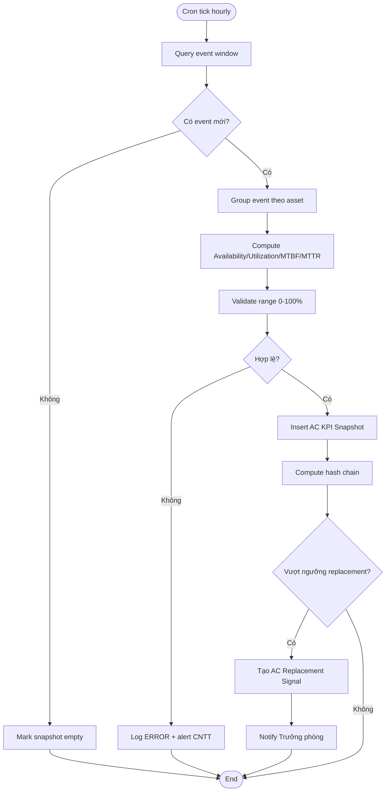
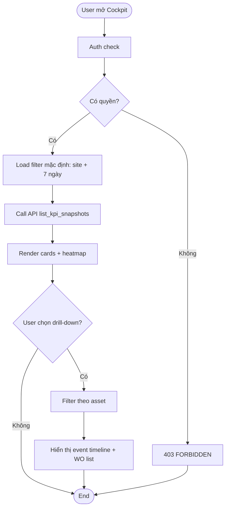
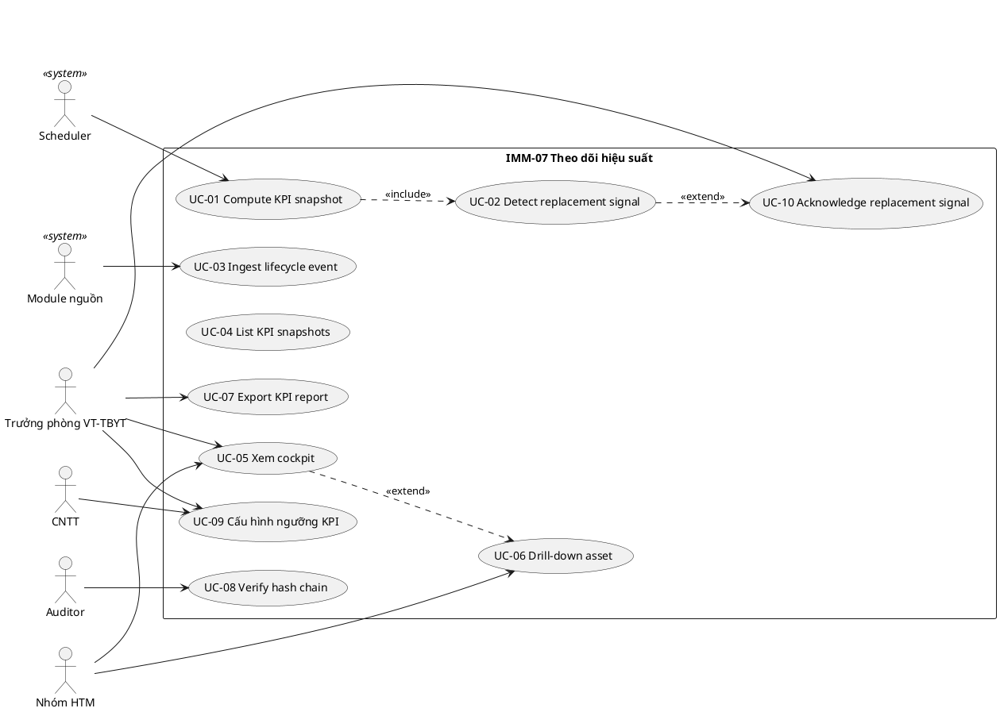
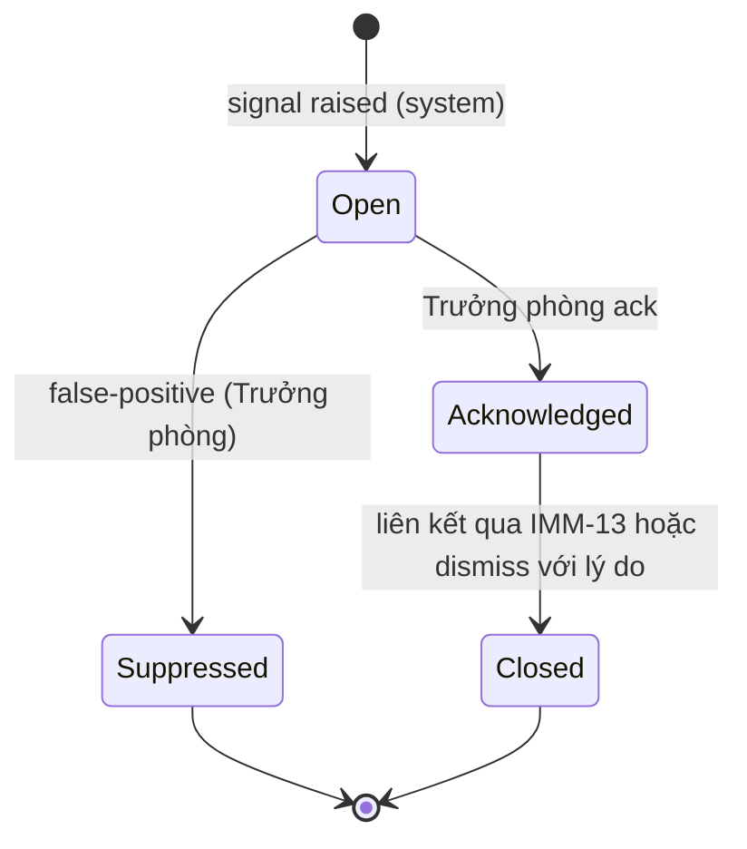

# 02 — Phân tích thiết kế nghiệp vụ (Analysis & Design)

| Mục | Giá trị |
|---|---|
| Module | IMM-07 — Theo dõi hiệu suất (Performance Monitoring) |
| Phạm vi | Per-module |
| Owner | BA + System Analyst |
| Liên kết | 03 Diagrams · 04 Backend · 05 API · 06 Frontend |

> **Mục đích**: Phân tích nghiệp vụ end-to-end cho module Theo dõi hiệu suất — chuẩn hóa KPI/KRI, đo availability/utilization/downtime, phát hiện replacement signal.

---

# Phần I — Module Overview

## I.0. Khảo sát hiện trạng

**As-Is** (theo điều tra ban đầu — `[BA cần bổ sung]` minh chứng phỏng vấn):

- Bệnh viện hiện theo dõi hiệu suất thiết bị bằng **Excel + sổ giấy**: KTV ghi giờ chạy / giờ dừng cuối ca, tổng hợp tay theo tuần / tháng. Số liệu downtime thường không khớp giữa khoa lâm sàng (đo theo dịch vụ gián đoạn) và Workshop (đo theo WO). Báo cáo KPI cho lãnh đạo phải tổng hợp nhiều file → trễ 7–14 ngày so với event thực tế.
- Một số bệnh viện có CMMS đơn thuần (vd Maximo, MP2) nhưng **không tích hợp Lifecycle Event**: KPI chỉ tính từ WO close, không phản ánh được downtime gối đầu (pending parts, vendor delay). Replacement decision do đó dựa cảm tính, không có signal định lượng.
- Compete reference:

| Tính năng | Excel hiện tại | CMMS chuẩn (vd Maximo) | AssetCore IMM-07 (target) |
|---|---|---|---|
| KPI auto từ event | Không | Một phần | **Có** (event-driven) |
| Drill-down asset → WO | Không | Có | Có |
| Replacement signal | Không | Không | **Có** (rule-based + ngưỡng) |
| Multi-site cockpit | Không | Tùy bản | Có |
| Audit trail KPI snapshot | Không | Hạn chế | **Có** (hash chain) |

`[BA cần bổ sung]`: dẫn chứng cụ thể bệnh viện đã khảo sát + ảnh chụp file Excel hiện hành.

## I.1. Pitch

Trưởng phòng vật tư cần biết **thiết bị nào đang kéo hiệu suất xuống** mà không phải đợi báo cáo tháng. IMM-07 thu thập sự kiện vòng đời từ IMM-04/08/09/11/12 → tự tính availability, utilization, MTBF, MTTR theo asset / khoa / model → hiển thị dashboard real-time + sinh **replacement signal** khi thiết bị vượt ngưỡng. Mục tiêu: rút thời gian phát hiện sự cố hệ thống từ 14 ngày xuống < 24 giờ và đưa quyết định thay thế dựa trên dữ liệu định lượng.

## I.2. Vị trí trong WHO HTM lifecycle

- [ ] Needs · [ ] Procurement · [ ] Install · [x] **Operation** · [x] **Maintenance** (đo kết quả) · [ ] Decommission (cấp signal)

**Input**: lifecycle event từ IMM-04 (commissioned), IMM-08 (PM done), IMM-09 (repair done), IMM-11 (cal pass/fail), IMM-12 (incident open/close).
**Output**: KPI snapshot record (DocType `AC KPI Snapshot`) + replacement signal feed cho IMM-13, scorecard feed cho IMM-16, time-series feed cho IMM-17.

## I.3. Stakeholders & Actors

| Vai trò | Người dùng thực | Quan tâm chính | Tần suất | Loại |
|---|---|---|---|---|
| Trưởng phòng VT-TBYT | 1 người / site | KPI tổng hợp, replacement signal | Hằng ngày | Primary |
| PTP Khối 2 | 1 người / site | Cockpit Operations, downtime hot list | Hằng ngày | Primary |
| Nhóm HTM | 3–5 KTV | Drill-down per asset, root-cause hint | Hằng ngày | Primary |
| Trưởng khoa lâm sàng | N người | Availability thiết bị khoa mình | Hằng tuần | Secondary |
| Nhóm CNTT | 1–2 người | Data pipeline, scheduler health | On-demand | Secondary |
| Tổ HC-QLCL & Risk | 1–2 người | KPI feed cho compliance scorecard | Hằng tháng | Auditor |
| Lãnh đạo BV | 1 người | Báo cáo điều hành | Hằng tháng | Approver |

`[BA cần bổ sung]`: khớp tên vai trò chính xác theo cơ cấu tổ chức BV cụ thể.

## I.4. Scope

**In-scope**:
- Thu thập lifecycle event từ các module operation
- Tính toán KPI: Availability, Utilization, Downtime (planned/unplanned), MTBF, MTTR, PM compliance %, Calibration pass rate
- Snapshot KPI hằng giờ / ngày / tháng
- Cockpit dashboard + drill-down asset / khoa / model / loại thiết bị
- Replacement signal rule (ngưỡng configurable)
- Export KPI ra CSV / PDF cho QMS

**Out-of-scope**:
- Tạo work order (thuộc IMM-08/09/12)
- Predictive ML (thuộc IMM-17)
- Compliance scorecard chính thức (thuộc IMM-16) — IMM-07 chỉ feed dữ liệu
- Capture clinical outcome (không thuộc HTM)

**Assumptions**:
- Mọi event đã được module nguồn ghi chính xác timestamp + asset link
- Site có ≤ 5000 asset đang vận hành
- Lịch giờ vận hành chuẩn theo BV (`[BA cần bổ sung]`: lịch khoa cấp cứu 24/7 vs khoa khám 8h)

**Dependencies**:
- DocType `AC Lifecycle Event` (IMM-04 base) — bắt buộc tồn tại
- DocType `AC Asset` — tồn tại từ Wave 1
- Module IMM-08, IMM-09, IMM-11, IMM-12 đã ghi event đúng schema

## I.5. KPI mục tiêu

| KPI | Định nghĩa | Baseline | Target | Đo ở đâu |
|---|---|---|---|---|
| Availability | (Total time − Unplanned downtime) / Total time | `[BA bổ sung]` ~85% | ≥ 95% (critical) / ≥ 90% (non-critical) | `AC KPI Snapshot.availability` |
| Utilization | Used time / Available time | `[BA bổ sung]` | ≥ 60% | `AC KPI Snapshot.utilization` |
| MTBF | Total operating time / số lần failure | `[BA bổ sung]` | ≥ ngưỡng theo loại thiết bị | `AC KPI Snapshot.mtbf_hours` |
| MTTR | Total repair time / số lần repair | `[BA bổ sung]` ~48h | ≤ 24h (critical) | `AC KPI Snapshot.mttr_hours` |
| PM compliance % | PM done on-time / PM scheduled | `[BA bổ sung]` ~70% | ≥ 95% | KPI feed từ IMM-08 |
| Replacement signal count | Số asset vượt ngưỡng MTBF/age | 0 (chưa đo) | Theo dõi xu hướng | `AC Replacement Signal` |
| Time-to-detect issue | Lag từ event xảy ra đến cockpit hiển thị | 7–14 ngày | ≤ 1 giờ | Cron health log |

`[BA cần bổ sung]`: thay thế baseline bằng số thực từ 3–6 tháng đầu vận hành.

## I.6. Ràng buộc Compliance

| Quy định | Yêu cầu áp lên module | Doc tham chiếu |
|---|---|---|
| NĐ98/2021 | Lưu hồ sơ vận hành ≥ 5 năm; truy xuất audit | `docs/gmdn/Quyết định 3107_QĐ-BYT.md` |
| WHO HTM | Đo MTBF/MTTR/Availability theo chuẩn maintenance programme | `docs/WHO/WHO - Medical equipment maintenance programme overview.md` |
| WHO Inventory & Maintenance 2025 | KPI inventory phải có baseline + audit trail | `docs/WHO/WHO - Inventory and maintenance 2025.md` |
| ISO 13485 (nếu áp) | Document control PR/WI/BM/HS theo QMS | `[BA cần bổ sung]` mã QMS thực tế |

## I.7. Risk & Open questions

| Risk | Likelihood | Impact | Giảm thiểu |
|---|---|---|---|
| Event source thiếu / sai timestamp | Cao | KPI lệch | Validate ở tier service + alert nếu module nguồn ngừng feed > 1h |
| Định nghĩa downtime không thống nhất giữa khoa và Workshop | Trung | KPI gây tranh cãi | BA chốt định nghĩa trước go-live + tài liệu hóa BR |
| Snapshot quá nhiều → DB lớn | Trung | Truy vấn chậm | Snapshot theo bậc (hourly 30d, daily 1y, monthly forever) + index |
| Replacement signal false-positive | Trung | Mất niềm tin | Rule có cooldown + cần KTV xác nhận trước khi vào IMM-13 |

| Open question | Owner | Deadline |
|---|---|---|
| Định nghĩa "operating hours" cho khoa cấp cứu vs khoa khám | BA + Trưởng phòng VT-TBYT | `[BA cần bổ sung]` |
| Ngưỡng MTBF cho từng nhóm thiết bị (theo GMDN) | Nhóm HTM | `[BA cần bổ sung]` |
| KPI có cần tách theo ca (sáng/chiều/đêm) không? | BA | `[BA cần bổ sung]` |

## I.8. Roadmap thực thi

| Sprint | Hạng mục | Owner | Status |
|---|---|---|---|
| S1 | DocType `AC KPI Snapshot` + `AC Replacement Signal` | BE Lead | Planned |
| S2 | Service compute KPI từ Lifecycle Event | BE | Planned |
| S3 | Scheduler hourly/daily + retention policy | BE | Planned |
| S4 | API catalog + envelope `{success,data}` | BE | Planned |
| S5 | FE cockpit + drill-down | FE | Planned |
| S6 | UAT + tinh chỉnh ngưỡng + đào tạo | BA + QMS | Planned |

---

# Phần II — Quy trình nghiệp vụ (Business Process / BPMN)

## II.1. Phân biệt 3 khái niệm

- **Business Process** = "Cuối ngày Trưởng phòng xem cockpit + xử lý replacement signal" — file này
- **Use Case** = actor + system + goal — Phần III
- **Workflow** = state machine cho `AC Replacement Signal` — file 04 §III

## II.2. As-Is

KTV ghi sổ giấy giờ chạy / giờ dừng → cuối tuần tổng hợp Excel → cuối tháng Trưởng phòng nhận file → quyết định replacement dựa kinh nghiệm.

## II.3. Pain points

| # | Pain | Tác động |
|---|---|---|
| 1 | Số liệu downtime không thống nhất giữa khoa LS và Workshop | KPI sai → quyết định sai |
| 2 | Lag 14 ngày từ event đến báo cáo | Phát hiện trễ sự cố hệ thống |
| 3 | Replacement quyết cảm tính | Lãng phí ngân sách hoặc vận hành thiết bị quá hạn |
| 4 | Không drill-down từ KPI tổng → asset cụ thể | Mất thời gian root-cause |

## II.4. To-Be process

## II.5. Decision points

| Điểm | Câu hỏi | Quy tắc |
|---|---|---|
| D1 — Replacement signal | Có sinh signal không? | MTBF < ngưỡng AND age > 7 năm AND repair_count_12m ≥ 3. `[BA cần bổ sung]`: chốt ngưỡng |
| D2 — Alert downtime | Có alert real-time? | Asset critical AND downtime_consecutive > 4h |
| D3 — Snapshot retention | Giữ snapshot bao lâu? | Hourly 30d → Daily 1y → Monthly forever |

## II.6. Process metrics

| Metric | Mục tiêu | Đo ở đâu |
|---|---|---|
| Time-to-detect issue | ≤ 1h | Cron log + event timestamp delta |
| % asset có KPI snapshot mỗi ngày | 100% | DB query daily |
| KPI computation duration | ≤ 5 phút / 1000 asset | Scheduler log |
| Audit chain integrity | 100% pass | Verify endpoint hằng tuần |

## II.7. RACI

`[BA cần bổ sung]`: chốt với cơ cấu tổ chức thực tế. Khung gợi ý:

| Hoạt động | Trưởng phòng VT | PTP Khối 2 | Nhóm HTM | CNTT | Auditor |
|---|---|---|---|---|---|
| Định nghĩa KPI | A | C | C | I | I |
| Cấu hình ngưỡng | A | R | C | I | I |
| Vận hành scheduler | I | C | I | R/A | I |
| Xem cockpit hằng ngày | R | R | R | I | I |
| Xử lý replacement signal | A | R | C | I | I |
| Verify hash chain | I | I | I | C | R/A |

## II.8. Exception flow

- **E1 — Module nguồn ngừng feed event > 1h**: Scheduler phát hiện gap → ghi log WARNING + gửi email CNTT. KPI snapshot vẫn chạy nhưng đánh cờ `data_quality = "Stale"`.
- **E2 — KPI computation timeout**: Scheduler retry 1 lần với batch nhỏ hơn. Nếu vẫn fail → ghi ERROR + Slack/email PTP.
- **E3 — Conflict definition giữa khoa và Workshop về downtime**: Service ưu tiên timestamp từ IMM-12 (incident open/close) làm canonical; chênh lệch ghi vào field `note` để audit.

## II.9. So sánh As-Is vs To-Be

| Khía cạnh | As-Is | To-Be |
|---|---|---|
| Nguồn dữ liệu | Sổ giấy + Excel | Lifecycle Event auto |
| Tần suất KPI | Tuần/tháng | Hourly/daily snapshot |
| Drill-down | Không | Có (asset/khoa/model) |
| Replacement decision | Cảm tính | Rule + signal định lượng |
| Audit | Không | Hash chain SHA-256 |

## II.10. Activity diagram per UC chính

### UC-01 — Compute KPI snapshot (cron)

### UC-05 — User xem cockpit

`[BA cần bổ sung]`: vẽ thêm activity diagram cho UC verify chain + UC handle replacement signal.

---

# Phần III — Use Case Specification (UML)

## III.1. Use Case Diagram

### III.1.a. Tổng quát

### III.1.b. Phân rã

**Nhóm A — Pipeline tự động (system actors)**: UC-01, UC-02, UC-03
**Nhóm B — Cockpit & Reporting (user)**: UC-04, UC-05, UC-06, UC-07
**Nhóm C — Quản trị & Audit**: UC-08, UC-09, UC-10

## III.2. Actor catalog

| Actor | Loại | Mô tả | Goal chính |
|---|---|---|---|
| Trưởng phòng VT-TBYT | Primary | Người ra quyết định | Theo dõi sức khỏe danh mục thiết bị |
| Nhóm HTM | Primary | KTV vận hành | Drill-down sự cố asset |
| Auditor | Auditor | QLCL/QMS | Verify trail, đối chiếu KPI |
| CNTT | Secondary | DevOps | Vận hành scheduler |
| Scheduler | System | Frappe cron | Trigger compute |
| Module nguồn | System | IMM-04/08/09/11/12 | Ghi event |

## III.3. Use Case Specifications (key UC)

### UC-01: Compute KPI snapshot

| Mục | Giá trị |
|---|---|
| ID | UC-IMM07-01 |
| Brief | Hằng giờ tính KPI cho mọi asset đang vận hành và lưu snapshot |
| Primary actor | Scheduler (system) |
| Pre-condition | Event source feed hoạt động ≤ 1h trễ |
| Post-condition | Có ≥ 1 record `AC KPI Snapshot` cho mỗi asset hoạt động trong cửa sổ |
| Trigger | Cron hourly tick |

#### Main flow
| Bước | Actor | System |
|---|---|---|
| 1 | Scheduler | Tick → gọi `imm07.compute_kpi_snapshot(window="1h")` |
| 2 | | Service query event window từ `AC Lifecycle Event` |
| 3 | | Group theo asset, compute KPI |
| 4 | | Insert `AC KPI Snapshot`, compute hash |
| 5 | | Trigger UC-02 (replacement detection) |

#### Alternative A1 — Window rỗng
- 2.a. Không có event mới → ghi snapshot `data_quality = "Empty"`.

#### Exception E1 — Source stale
- 2.a. Module nguồn ngừng feed > 1h → đánh `data_quality = "Stale"` + alert CNTT.

#### Exception E2 — Compute fail
- 3.a. ServiceError(`INTERNAL`) → log + retry 1 lần; vẫn fail → escalate.

### UC-02: Detect replacement signal

| Mục | Giá trị |
|---|---|
| ID | UC-IMM07-02 |
| Brief | Sau snapshot, kiểm tra mỗi asset có vượt ngưỡng → tạo signal |
| Primary actor | Scheduler (system) |
| Pre-condition | Snapshot UC-01 vừa hoàn tất |
| Post-condition | Nếu vượt ngưỡng → record `AC Replacement Signal` (state Open) |
| Trigger | UC-01 finish |

#### Main flow
1. Đọc snapshot mới + lịch sử 12 tháng
2. Apply rule: `MTBF < threshold AND age > 7y AND repair_count_12m ≥ 3` (`[BA cần bổ sung]`)
3. Nếu match → tạo signal + notify Trưởng phòng (Lifecycle Event `replacement_signal_raised`)

### UC-05: Xem cockpit

| Mục | Giá trị |
|---|---|
| ID | UC-IMM07-05 |
| Brief | User mở dashboard hiệu suất, lọc theo site/khoa/model |
| Primary actor | Trưởng phòng / Nhóm HTM |
| Pre-condition | Đăng nhập + có role `IMM07 User` |

`[BA cần bổ sung]`: viết spec đầy đủ cho UC-03, UC-04, UC-06, UC-07, UC-08, UC-09, UC-10 theo cùng template.

## III.4. Use Case relationships

**`<<include>>`**:
| Caller | Callee | Note |
|---|---|---|
| UC-01 | UC-02 | Sau mỗi snapshot luôn check signal |

**`<<extend>>`**:
| Base | Extension | Điều kiện |
|---|---|---|
| UC-05 | UC-06 | User click drill-down |
| UC-02 | UC-10 | Khi signal được Trưởng phòng acknowledge |

## III.5. UC ↔ User Story mapping

| UC | US ID | Note |
|---|---|---|
| UC-01 | IMM07-US-01 | Cron compute |
| UC-02 | IMM07-US-02 | Replacement detection |
| UC-05 | IMM07-US-05 | Cockpit |
| UC-06 | IMM07-US-06 | Drill-down |
| UC-08 | IMM07-US-08 | Audit verify |
| UC-09 | IMM07-US-09 | Cấu hình ngưỡng |

## III.6. UC ↔ Sequence mapping

| UC | Sequence (file 03) |
|---|---|
| UC-01 | SEQ-01 Compute KPI |
| UC-02 | SEQ-02 Replacement signal |
| UC-05 | SEQ-03 Load cockpit |
| UC-08 | SEQ-04 Verify chain |

---

# Phần IV — Functional Specifications

## IV.1. User Stories & Acceptance Criteria

### IMM07-US-01 — Compute KPI snapshot
**Là** hệ thống, **tôi muốn** tự động tính KPI mỗi giờ, **để** Trưởng phòng có dữ liệu real-time.
**Priority**: Must · **Estimate**: 5
**AC**:
- *Given* có event trong cửa sổ 1h, *When* cron tick, *Then* tạo ≥ 1 snapshot per asset có event.
- *Given* không có event, *When* cron tick, *Then* không insert snapshot rỗng (giảm noise).

### IMM07-US-02 — Replacement signal
**Là** Trưởng phòng, **tôi muốn** nhận signal khi thiết bị vượt ngưỡng MTBF, **để** lập kế hoạch thay thế kịp thời.
**Priority**: Must · **Estimate**: 5
**AC**:
- *Given* asset MTBF < ngưỡng + age > 7y + repair_count_12m ≥ 3, *When* compute xong, *Then* tạo `AC Replacement Signal` state `Open` + notify.
- *Given* signal đã Open chưa ack, *When* compute lần kế, *Then* KHÔNG tạo signal mới (cooldown).

### IMM07-US-05 — Cockpit
**Là** Trưởng phòng, **tôi muốn** xem cockpit hiệu suất theo site/khoa, **để** ra quyết định trong ngày.
**Priority**: Must
**AC**:
- *Given* có ≥ 1 snapshot trong 7 ngày, *When* mở cockpit, *Then* render ≤ 2s.

`[BA cần bổ sung]`: bổ sung US-03, US-04, US-06–US-10.

## IV.2. Business Rules

| ID | Rule | Implement | Test |
|---|---|---|---|
| IMM07-BR-01 | Availability = (T_total − T_unplanned_down) / T_total | `services/imm07.py:_compute_availability` | TC-IMM07-BR-01 |
| IMM07-BR-02 | MTTR tính trên repair done có timestamp đầy đủ | `services/imm07.py:_compute_mttr` | TC-IMM07-BR-02 |
| IMM07-BR-03 | Snapshot empty không insert | service guard | TC-IMM07-BR-03 |
| IMM07-BR-04 | Replacement signal có cooldown 30 ngày | service rule | TC-IMM07-BR-04 |
| IMM07-BR-05 | KPI > 100% → flag DATA_ANOMALY | validator | TC-IMM07-BR-05 |
| IMM07-BR-06 | Snapshot retention: hourly 30d, daily 1y, monthly forever | scheduler purge | TC-IMM07-BR-06 |
| IMM07-BR-07 | Hash chain prev_hash mọi snapshot | service compute hash | TC-IMM07-BR-07 |

`[BA cần bổ sung]`: chốt công thức chính xác (đặc biệt cho khoa cấp cứu 24/7 vs khoa khám 8h).

## IV.3. State Machine — `AC Replacement Signal`

| State | docstatus | Editable | Allow_edit role |
|---|---|---|---|
| Open | 0 | Yes | System Manager |
| Acknowledged | 1 | No | – |
| Suppressed | 2 | No | – |
| Closed | 1 | No | – |

## IV.4. Input — Output

**Input** (system-fed, không user nhập):
- `event_window_start`, `event_window_end` (timestamp, required)
- `asset_filter` (Link AC Asset, optional — null = all)

**Cascade**: Cockpit FE — chọn `site` → reload `khoa` → reload `model` → reload `asset list`.

**Output records**:
- `AC KPI Snapshot` (1 record / asset / window)
- `AC Replacement Signal` (0–1 record / asset)
- `AC Lifecycle Event` (`kpi_snapshot_created`, `replacement_signal_raised`, `replacement_signal_acknowledged`)

**Notification**:
- Email + in-app: Trưởng phòng khi signal raised
- Email CNTT khi data_quality = Stale > 2h liên tục

## IV.5. Edge cases & Errors

| ID | Edge case | Hành vi | ErrorCode |
|---|---|---|---|
| E-01 | Concurrent compute trùng window | DB unique key (asset, window) → bỏ qua duplicate | DUPLICATE |
| E-02 | User không có role IMM07 | API trả 200 + envelope error | FORBIDDEN |
| E-03 | Event timestamp tương lai | Skip + log | VALIDATION |
| E-04 | Asset đã decommissioned | Snapshot bỏ qua | BAD_STATE |
| E-05 | Hash chain broken khi verify | Trả về `broken_at` | INTERNAL |
| E-06 | Filter JSON malformed | Reject ngay tier API | INVALID_PARAMS |

## IV.6. Out of scope & Open issues

**Out**: predictive ML, auto-create replacement WO, integration với hệ thống tài chính.

**Open**: `[BA cần bổ sung]` — định nghĩa "operating hours" theo loại khoa; ngưỡng MTBF theo nhóm GMDN.

---

# Phần V — Yêu cầu phi chức năng (NFR)

## V.1. Hiệu năng

| Metric | Target | Đo |
|---|---|---|
| API `list_kpi_snapshots` p95 | ≤ 400ms (page 50) | APM |
| Cockpit FCP | ≤ 1.5s | Lighthouse |
| Cron compute (1000 asset) | ≤ 5 phút | Scheduler log |
| DB query KPI 7d | p95 ≤ 200ms | slow query log |

## V.2. Bảo mật

- Frappe session + API key; (roadmap) 2FA cho role Trưởng phòng
- RBAC: `IMM07 User` (read), `IMM07 Manager` (cấu hình ngưỡng, ack signal)
- Audit chain SHA-256 mọi mutation `AC KPI Snapshot` + `AC Replacement Signal`
- Không lưu dữ liệu bệnh nhân — chỉ asset metadata
- OWASP Top 10 đáp ứng tier API

## V.3. Khả dụng

| Metric | Target |
|---|---|
| Uptime | ≥ 99.5% giờ làm việc |
| Cron success rate | ≥ 99% |
| RPO / RTO | 1h / 4h |

## V.4. Khả mở rộng

- ≥ 100 user đồng thời cockpit
- ≤ 5000 asset / site, snapshot hourly 30d → ≤ 3.6M record (index theo `asset`, `window_start`)
- Multi-site: 1 codebase, N site

## V.5. Usability

- WCAG 2.1 AA cho cockpit
- Browser: Chrome/Edge ≥ 120, Firefox ≥ 122
- Tiếng Việt 100% UI
- Onboarding KTV < 30 phút

## V.6. Bảo trì

- Coverage: service ≥ 85%, repository ≥ 80%, API ≥ 60%
- Linting ruff/black/ESLint 100%
- Tech debt ≤ 20% sprint capacity

## V.7. Compliance

- Lưu KPI snapshot ≥ 5 năm (NĐ98)
- Audit truy xuất qua hash chain
- Phân tách: Nhóm HTM compute ≠ Trưởng phòng ack ≠ Auditor verify
- Document control PR-IMMIS-07-01..03 / WI-IMMIS-07-01..04 / BM-IMMIS-07-01

---

## DoD — File 02

- [ ] Khảo sát có dẫn chứng cụ thể `[BA bổ sung]`
- [ ] Pitch ≤ 5 câu
- [ ] Lifecycle position rõ
- [ ] ≥ 1 Primary + 1 Auditor
- [ ] Scope đầy đủ
- [ ] ≥ 3 KPI có target số (cần BA chốt baseline)
- [ ] Compliance NĐ98 + WHO HTM
- [ ] As-Is + ≥ 3 pain
- [ ] To-Be swimlane ≥ 4 lane
- [ ] RACI đầy đủ `[BA cần bổ sung]`
- [ ] ≥ 2 exception flow
- [ ] ≥ 4 activity diagram (đã có 2, cần thêm)
- [ ] Use case diagram tổng + phân rã
- [ ] ≥ 4 actor
- [ ] Mọi UC có spec đầy đủ `[BA cần bổ sung] cho UC còn lại`
- [ ] ≥ 1 include + 1 extend
- [ ] User Story có AC ≥ 2 case
- [ ] Business Rules có ID + nơi implement
- [ ] State machine vẽ rõ
- [ ] ≥ 5 edge case
- [ ] 7 nhóm NFR đầy đủ
