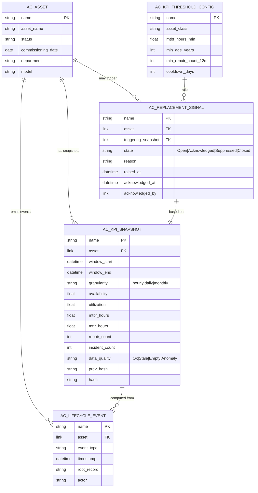
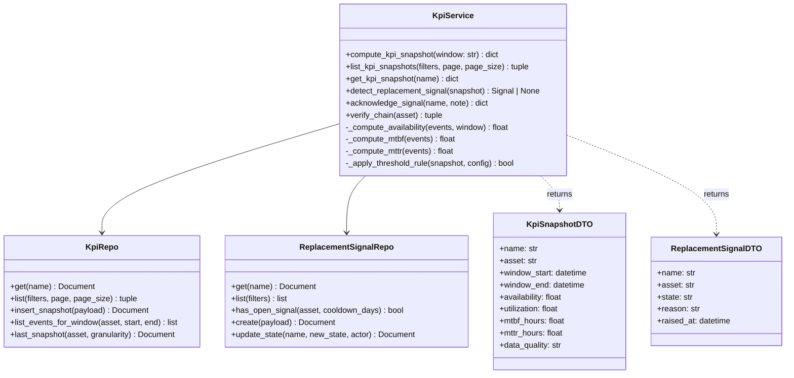
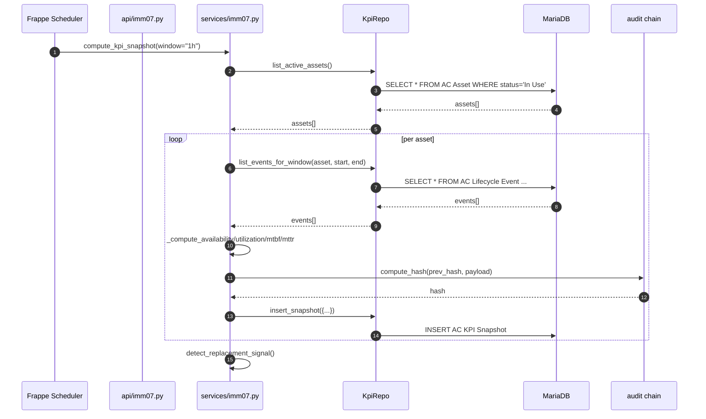
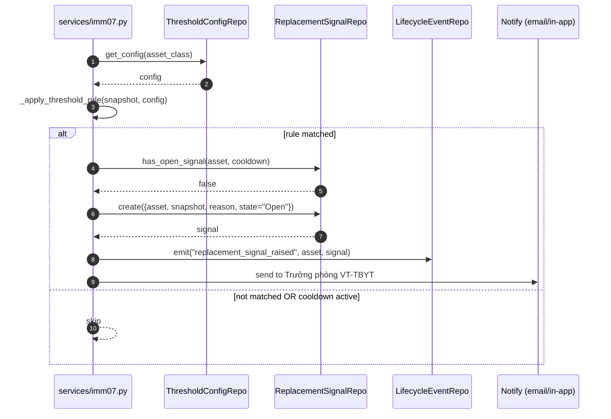
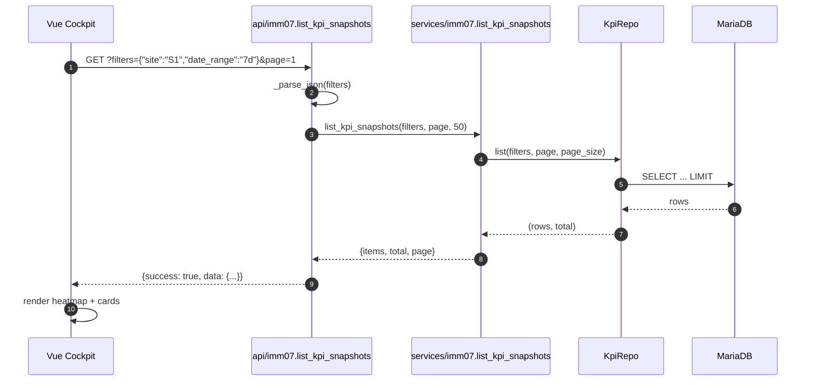
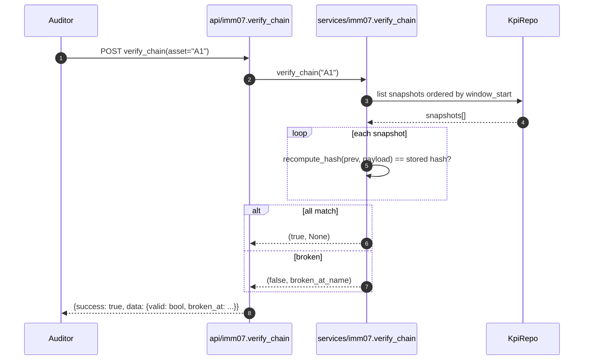
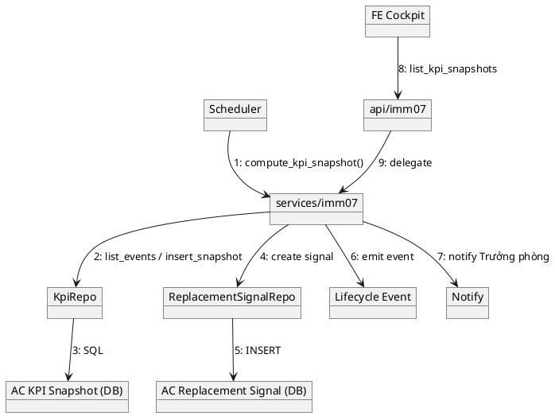
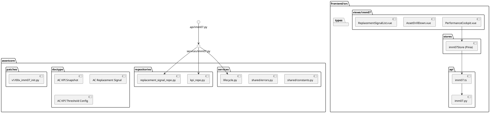

# 03 — Biểu đồ UML (Diagrams)

| Mục | Giá trị |
|---|---|
| Module | IMM-07 — Theo dõi hiệu suất |
| Phạm vi | Per-module |
| Owner | System Analyst + Tech Lead |
| Liên kết | 02 Analysis · 04 Backend · 05 API |

> Bộ biểu đồ UML cho module IMM-07: ERD · Class · Sequence · Communication · Package. Render bằng Mermaid (mặc định) hoặc PlantUML (khi Mermaid không hỗ trợ native).

---

## I. ERD — Entity Relationship Diagram

**Indexes** (đề xuất):
- `AC_KPI_SNAPSHOT (asset, window_start, granularity)` — UNIQUE
- `AC_KPI_SNAPSHOT (window_start)` — range query
- `AC_REPLACEMENT_SIGNAL (asset, state)`
- `AC_LIFECYCLE_EVENT (asset, timestamp)`

---

## II. Class Diagram (service + repo + DTO)

---

## III. Sequence Diagrams

### SEQ-01 — Compute KPI snapshot (UC-01)

### SEQ-02 — Replacement signal raised (UC-02)

### SEQ-03 — Load cockpit (UC-05)

### SEQ-04 — Verify hash chain (UC-08)

---

## IV. Communication Diagram

---

## V. Package Diagram

---

## DoD — File 03

- [x] ERD vẽ đủ entity + index đề xuất
- [x] Class diagram service + repo + DTO
- [x] ≥ 1 sequence per UC chính (đã có 4)
- [x] Communication diagram tổng quan
- [x] Package diagram FE + BE
- [ ] Reviewed bởi Tech Lead + System Analyst
