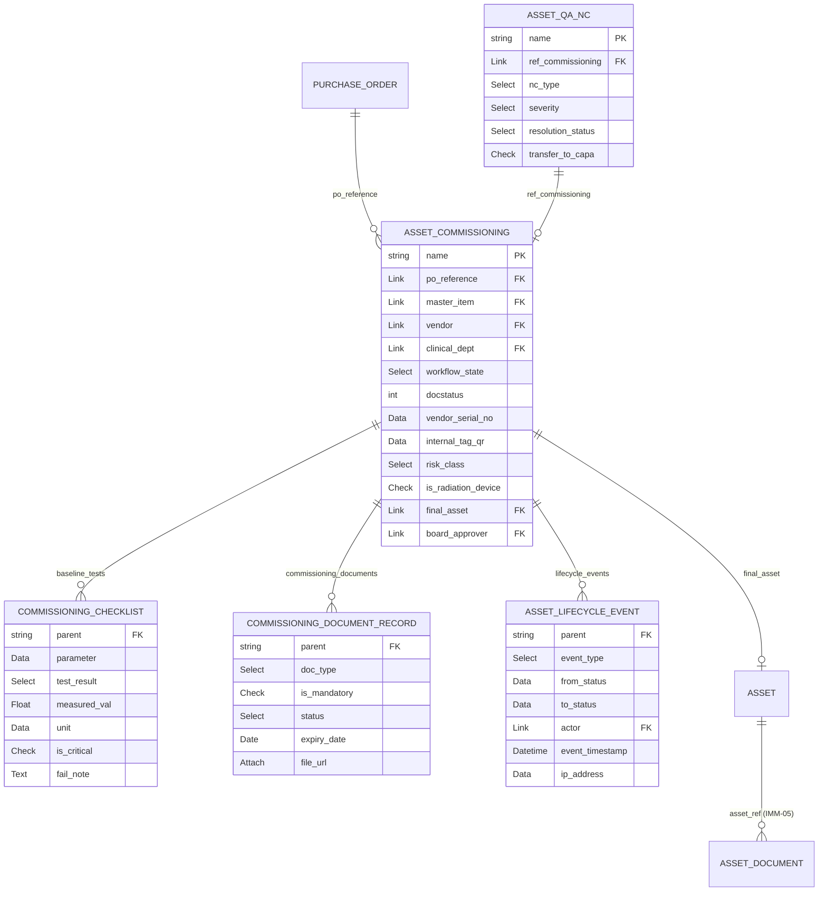
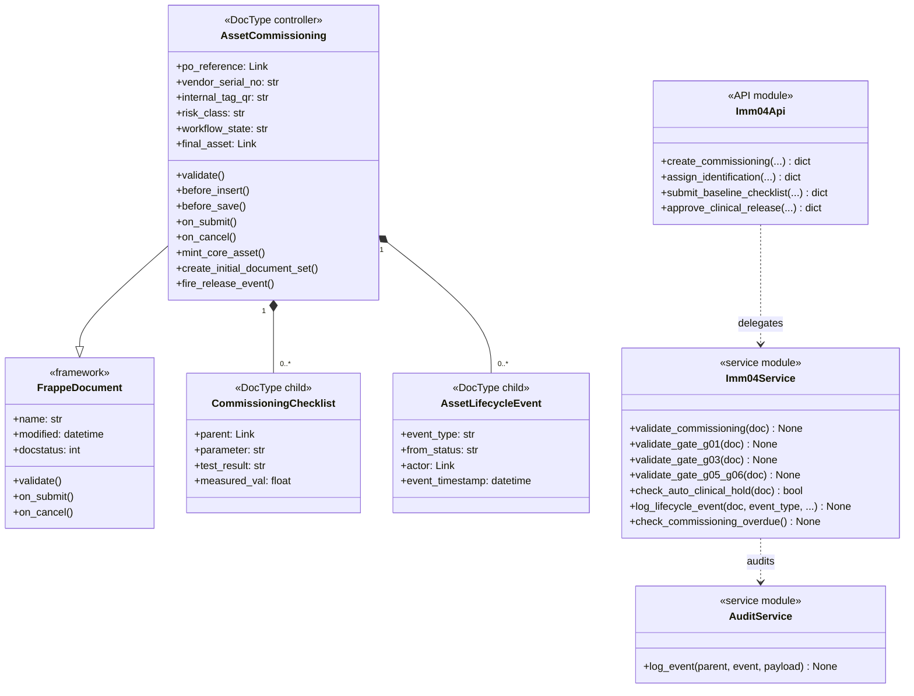
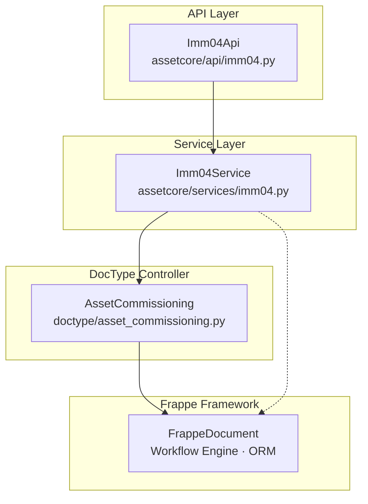
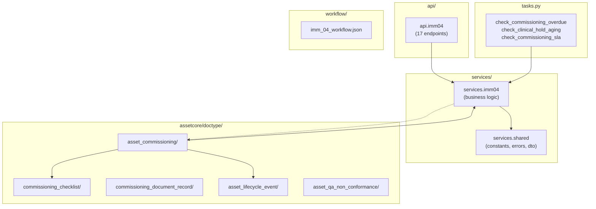
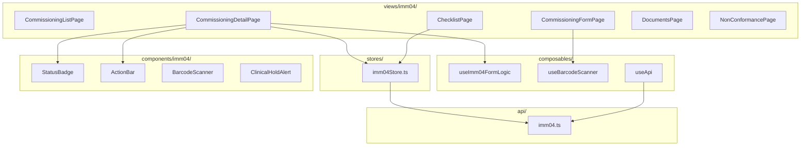
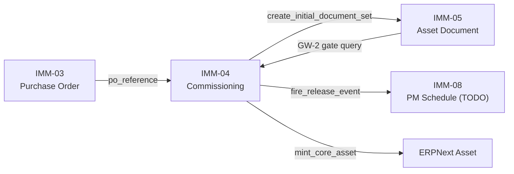

# 03 — Biểu đồ kỹ thuật (UML Diagrams)

| Mục | Giá trị |
|---|---|
| Module | IMM-04 — Lắp đặt, Định danh & Kiểm tra Ban đầu |
| Phạm vi | Per-module |
| Owner | System Analyst / Tech Lead / DBA |
| Liên kết | 02 Analysis & Design (Use Case) · 04 Backend Design (impl) |

---

# Phần I — Entity Relationship Diagram (ERD)

## I.1. ERD logic



## I.2. Cardinality cheatsheet

| Ký hiệu | Nghĩa |
|---|---|
| `||--o{` | 1 bắt buộc — N tùy chọn (1 to zero-or-many) |
| `}o--||` | N tùy chọn — 1 bắt buộc |
| `||--||` | 1-1 bắt buộc hai phía |
| `}o--o{` | M-N tùy chọn |
| `||--o|` | 1 bắt buộc — 0 hoặc 1 |

## I.3. Entity catalog

**(a) Entities module sở hữu:**

| Entity | DocType path | Naming series | Lifecycle | Volume/năm |
|---|---|---|---|---|
| Asset Commissioning | `doctype/asset_commissioning/` | `ACC-.YY.-.MM.-.#####` | Draft → Clinical Release (submit) hoặc Return To Vendor | ~200 phiếu/site |
| Commissioning Checklist | Child của Asset Commissioning | idx | Tồn tại trong phiếu | ~10 rows/phiếu |
| Commissioning Document Record | Child của Asset Commissioning | idx | Tồn tại trong phiếu | ~5 rows/phiếu |
| Asset Lifecycle Event | Child của Asset Commissioning (immutable) | idx | Append-only, không sửa/xóa | ~15 events/phiếu |
| Asset QA Non Conformance | `doctype/asset_qa_non_conformance/` | `NC-.YY.-.MM.-.#####` | Open → Closed/Return To Vendor | ~20/năm |

**(b) Entities tham chiếu cross-module:**

| Entity | Owner module | Vai trò ở IMM-04 |
|---|---|---|
| Purchase Order | ERPNext (IMM-03) | Nguồn đầu vào, `po_reference` link |
| Asset (ERPNext) | ERPNext core | Output — tạo qua `mint_core_asset()` |
| Asset Document | IMM-05 | Output — auto-import `create_initial_document_set()` |
| User | Frappe core | `actor`, `commissioned_by`, `board_approver` |
| Department | Frappe/ERPNext | `clinical_dept` |
| Item | ERPNext | `master_item`, source `risk_class`, `is_radiation` |

## I.4. Data dictionary

### Bảng 1.1: Asset Commissioning

| Field | Type | Length | Required | Default | PII | Validation | Mô tả |
|---|---|---|---|---|---|---|---|
| name | varchar | 30 | ✓ | autoname ACC-YY-MM-##### | — | format regex | PK |
| workflow_state | Link | 140 | — | Draft | — | valid state | State machine |
| po_reference | Link | 140 | ✓ | — | — | PO exists | FK Purchase Order |
| master_item | Link | 140 | ✓ | — | — | Item exists | FK Item |
| vendor | Link | 140 | ✓ | — | — | Supplier exists | FK Supplier |
| clinical_dept | Link | 140 | ✓ | — | — | Dept exists | Khoa lắp đặt |
| vendor_serial_no | Data | 140 | ✓ (Identification) | — | — | UNIQUE app-layer | SN từ NSX |
| internal_tag_qr | Data | 140 | — | auto-sinh | — | BV-{DEPT}-{YYYY}-{SEQ} | Mã QR nội bộ |
| risk_class | Select | 140 | — | — | — | A/B/C/D/Radiation | Phân loại rủi ro |
| is_radiation_device | Check | 1 | — | 0 | — | — | Flag bức xạ |
| board_approver | Link | 140 | ✓ (before Submit) | — | — | User exists | G06 |
| final_asset | Link | 140 | — | — | — | set on_submit | FK Asset (output) |
| docstatus | Int | 1 | — | 0 | — | 0/1/2 | 1=submitted |
| reception_date | Date | — | — | today() | — | ≤ today | Ngày nhận hàng |
| qa_license_doc | Attach | — | COND | — | — | reqd nếu radiation | Giấy phép bức xạ |

### Bảng 1.2: Commissioning Checklist (child)

| Field | Type | Length | Required | Default | PII | Validation | Mô tả |
|---|---|---|---|---|---|---|---|
| parent | Link | 140 | ✓ | — | — | — | FK Asset Commissioning |
| parameter | Data | 140 | ✓ | — | — | not empty | Tên tiêu chí |
| is_critical | Check | 1 | — | 0 | — | — | Flag quan trọng |
| test_result | Select | 140 | ✓ | — | — | Pass/Fail/N/A | Kết quả |
| measured_val | Float | — | — | — | — | numeric | Giá trị đo |
| unit | Data | 140 | — | — | — | — | Đơn vị (mA, V…) |
| fail_note | Text | — | COND | — | — | reqd nếu Fail | Ghi chú lỗi |

### Bảng 1.3: Asset Lifecycle Event (child, immutable)

| Field | Type | Length | Required | Default | PII | Validation | Mô tả |
|---|---|---|---|---|---|---|---|
| parent | Link | 140 | ✓ | — | — | — | FK Asset Commissioning |
| event_type | Select | 140 | ✓ | — | — | valid type | Loại sự kiện |
| from_status | Data | 140 | — | — | — | — | Trạng thái nguồn |
| to_status | Data | 140 | — | — | — | — | Trạng thái đích |
| actor | Link | 140 | ✓ | — | ⚠️ PII | User exists | Người thực hiện |
| event_timestamp | Datetime | — | ✓ | now() | — | — | Thời điểm |
| ip_address | Data | 140 | — | — | — | read_only | IP request |

## I.5. Constraints & indexes

**Unique constraints:**
- `vendor_serial_no` — app-layer check (VR-01); DB UNIQUE index chưa có (tech-debt)

**FK logic (Frappe Link):**
- `po_reference` → `Purchase Order`
- `master_item` → `Item`
- `final_asset` → `Asset` (set on_submit)
- `ref_commissioning` (trên Asset QA NC) → `Asset Commissioning`

**Indexes:**
- `tabAsset Commissioning.po_reference` — search_index B-tree
- `tabAsset Commissioning.vendor_serial_no` — search_index B-tree
- `tabAsset Commissioning.workflow_state` — in_standard_filter B-tree
- `tabAsset QA Non Conformance.ref_commissioning` — search_index B-tree
- Khuyến nghị composite: `(workflow_state, docstatus, reception_date)` cho scheduler/dashboard

## I.6. Naming conventions

| Object | Convention | Ví dụ |
|---|---|---|
| DocType | PascalCase | `AssetCommissioning` |
| DB table | `tab` + DocType | `tabAsset Commissioning` |
| Field | snake_case | `vendor_serial_no` |
| FK field | `_ref` hoặc domain suffix | `po_reference`, `final_asset` |
| Boolean | `is_` prefix | `is_radiation_device` |
| Datetime | `_at` suffix | `event_timestamp` (hoặc `_date`) |
| Naming series | UPPERCASE-. | `ACC-.YY.-.MM.-.#####` |

## I.7. Mapping ERD → DocType

| Concept ERD | DocType JSON |
|---|---|
| Asset Commissioning | `asset_commissioning/asset_commissioning.json` |
| Commissioning Checklist | `commissioning_checklist/commissioning_checklist.json` |
| Commissioning Document Record | `commissioning_document_record/commissioning_document_record.json` |
| Asset Lifecycle Event | `asset_lifecycle_event/asset_lifecycle_event.json` |
| Asset QA Non Conformance | `asset_qa_non_conformance/asset_qa_non_conformance.json` |

## I.8. Volume & retention

| Entity | Volume/năm/site | Retention | Archive policy |
|---|---|---|---|
| Asset Commissioning | ~200 phiếu | ≥ 5 năm (NĐ98) | Không xóa; cancel thành docstatus=2 |
| Asset Lifecycle Event | ~3,000 events | ≥ 5 năm (NĐ98, immutable) | Append-only, không archive |
| Asset QA NC | ~20 NC | ≥ 5 năm | Closed/Resolved, không xóa |
| Commissioning Checklist | ~2,000 rows | Cùng parent phiếu | — |

## I.9. Data classification & PII

| Loại data | Trường | Sensitivity | Storage/Transport |
|---|---|---|---|
| Actor identity | `actor` (Lifecycle Event) | Medium | DB encrypted at rest, HTTPS transport |
| Thiết bị serial | `vendor_serial_no` | Low | Standard DB |
| File đính kèm | `qa_license_doc` | Medium | Private files Frappe |
| Patient data | — | — | **KHÔNG lưu patient data** |

---

# Phần II — Class Diagram

## II.1. Class Diagram — 2 cấp

Theo pattern đồ án: cấp 1 là biểu đồ lớp tổng quát ở mức module, cấp 2 là biểu đồ lớp chi tiết per major class (entity chính của module).

## II.1.a. Biểu đồ lớp tổng quát



## II.1.b. Biểu đồ lớp chi tiết — AssetCommissioning

```mermaid
classDiagram
    class AssetCommissioning {
        <<DocType controller>>
        +name: str
        +po_reference: Link Purchase_Order
        +master_item: Link Item
        +vendor: Link Supplier
        +clinical_dept: Link Department
        +workflow_state: str
        +docstatus: int
        +vendor_serial_no: str
        +internal_tag_qr: str
        +risk_class: str{A|B|C|D|Radiation}
        +is_radiation_device: bool
        +board_approver: Link User
        +final_asset: Link Asset
        +reception_date: date
        +commissioning_date: date
        +qa_license_doc: Attach
        +baseline_tests: List~CommissioningChecklist~
        +commissioning_documents: List~CommissioningDocumentRecord~
        +lifecycle_events: List~AssetLifecycleEvent~
        +validate() None
        +before_insert() None
        +before_save() None
        +on_submit() None
        +on_cancel() None
        +mint_core_asset() None
        +create_initial_document_set() None
        +fire_release_event() None
        -_gw2_check_document_compliance() None
        -_generate_internal_qr() str
        -validate_unique_serial() None
        -validate_checklist_completion() None
        -validate_radiation_hold() None
        -block_release_if_nc_open() None
        -validate_backdate() None
    }
```

## II.2. Layer mapping



## II.3. Class catalog

**DocType controllers:**
- `AssetCommissioning` — `doctype/asset_commissioning/asset_commissioning.py` — inherits FrappeDocument; hooks: before_insert, before_save, validate, on_submit, on_cancel
- `CommissioningChecklist` — child, no custom controller
- `AssetLifecycleEvent` — child, append-only, VR-06 enforce trong parent controller

**Service modules:**
- `assetcore/services/imm04.py` — public functions: `validate_commissioning`, `validate_gate_g01/g03/g05_g06`, `check_auto_clinical_hold`, `log_lifecycle_event`, `check_commissioning_overdue`
- Dependencies: `services.shared.constants.ErrorCode`, `services.shared.errors.ServiceError`

**API modules:**
- `assetcore/api/imm04.py` — 17 whitelisted endpoints; thin wrapper dùng `_handle/_ok/_err`

**Enum / Constants:**
- `CommissioningStatus` (class constants hoặc workflow JSON): Draft, Pending Doc Verify, To Be Installed, Installing, Identification, Initial Inspection, Non Conformance, Clinical Hold, Re Inspection, Clinical Release, Return To Vendor
- `ErrorCode` — trong `services/shared/constants.py`

## II.4. Relationships glossary

| Symbol | Mermaid syntax | Ý nghĩa |
|---|---|---|
| Inheritance | `--|>` | Kế thừa (is-a) |
| Composition | `*--` | Phụ thuộc vòng đời (has-a, child table) |
| Dependency | `..>` | Sử dụng (delegates to) |
| Association | `-->` | Tham chiếu nhẹ |

---

# Phần III — Sequence Diagram

## III.1. Khi nào vẽ sequence?

Vẽ sequence diagram cho:
- Use case có nhiều thành phần phối hợp (FE → API → Service → Repo → DB → Realtime)
- Luồng có timing/order quan trọng (gate, validation cascade, rollback)
- Negative path đáng tài liệu hóa (VR-01 SN trùng → block)

KHÔNG vẽ cho: CRUD đơn giản, luồng đã được mô tả đầy đủ trong Activity diagram.

## III.2. Convention

**Participants chuẩn:**

| Participant | Ký hiệu |
|---|---|
| User (actor) | `actor KTV` / `actor BIO` |
| Browser / Vue SPA | `participant Browser` |
| API module | `participant API as api.imm04` |
| Service | `participant Svc as services.imm04` |
| DocType Controller | `participant Doc as AssetCommissioning` |
| Frappe ORM / DB | `database DB` |
| Realtime | `participant RT as frappe.realtime` |

## III.3. Sequence diagrams chính

### SD-04-01: Tạo phiếu từ PO — Happy path

```mermaid
sequenceDiagram
    actor KTV
    participant Browser
    participant API as api.imm04
    participant Svc as services.imm04
    participant Doc as AssetCommissioning
    database DB

    KTV->>Browser: Chọn PO + điền form
    Browser->>API: POST create_commissioning {po_reference, ...}
    API->>Svc: validate inputs
    Svc->>DB: SELECT Purchase Order WHERE name=po_reference
    DB-->>Svc: PO row

    alt PO không tồn tại
        Svc-->>API: ServiceError(NOT_FOUND, "Không tìm thấy PO")
        API-->>Browser: {success: false, error: "...", code: "NOT_FOUND"}
    else PO hợp lệ
        Svc->>Doc: insert {po_reference, vendor, master_item, ...}
        Doc->>DB: INSERT tabAsset Commissioning
        Svc->>Svc: log_lifecycle_event(commissioning_created)
        Svc->>DB: INSERT Asset Lifecycle Event
        Svc-->>API: {name, workflow_state: "Draft"}
        API-->>Browser: {success: true, data: {name, workflow_state}}
        Browser-->>KTV: Redirect to detail page
    end
```

### SD-04-02: Submit phiếu → Mint Asset — Happy path

```mermaid
sequenceDiagram
    actor WH as Workshop Head
    participant Browser
    participant API as api.imm04
    participant Svc as services.imm04
    participant Doc as AssetCommissioning
    participant IMM05 as IMM-05 (create_initial_document_set)
    participant RT as frappe.realtime
    database DB

    WH->>Browser: Nhấn Submit
    Browser->>API: POST submit_commissioning {name}
    API->>DB: Check role Workshop Head / VP Block2
    DB-->>API: role confirmed

    API->>Svc: validate pre-submit
    Svc->>DB: COUNT Asset QA NC WHERE resolution_status=Open
    DB-->>Svc: count = 0

    alt workflow_state != Clinical_Release
        Svc-->>API: ServiceError(BAD_STATE, "Phiếu chưa ở trạng thái Clinical Release")
        API-->>Browser: {success: false, code: "BAD_STATE"}
    else state hợp lệ
        Svc->>Doc: doc.submit()
        Doc->>DB: UPDATE docstatus=1
        Doc->>DB: INSERT Asset (mint_core_asset)
        Doc->>IMM05: create_initial_document_set()
        IMM05->>DB: INSERT Asset Document × N
        Doc->>Svc: log lifecycle event Release
        Svc->>DB: INSERT lifecycle_events
        Doc->>RT: publish_realtime imm04_asset_released
        Svc-->>API: {name, docstatus:1, final_asset}
        API-->>Browser: {success: true, data: {final_asset, ...}}
    end
```

### SD-04-03: VR-01 — Assign Identification với SN trùng

```mermaid
sequenceDiagram
    actor BIO as Biomed Engineer
    participant Browser
    participant API as api.imm04
    participant Svc as services.imm04
    database DB

    BIO->>Browser: Nhập vendor_serial_no = "SN-12345" (blur)
    Browser->>API: GET check_sn_unique?vendor_sn=SN-12345&exclude_name=ACC-B
    API->>DB: SELECT Asset Commissioning WHERE vendor_serial_no=SN-12345 AND name!=ACC-B
    DB-->>API: row ACC-A found

    API-->>Browser: {success: true, data: {is_unique: false, existing_commissioning: "ACC-A"}}
    Browser-->>BIO: Inline error "VR-01: Serial đã được gán cho phiếu ACC-A"
    Note over BIO,Browser: User sửa SN trước khi proceed
```

## III.4. Checklist tránh sót

- [x] Activation bar hiển thị cho mỗi participant
- [x] Error path có `alt/else/end`
- [x] DB round-trip hiển thị
- [x] Lifecycle event log trong mọi mutation diagram
- [x] Permission check (role) trước khi thực hiện action

## III.5. Cross-reference

| Sequence | Use Case | Service function | Test case |
|---|---|---|---|
| SD-04-01 | UC-01 | `create_commissioning` | TC-04-01 |
| SD-04-02 | UC-07 | `submit_commissioning`, `mint_core_asset` | TC-04-26, 27 |
| SD-04-03 | UC-04 | `check_sn_unique`, `assign_identification` | TC-04-03, 04 |

---

# Phần IV — Communication Diagram

## IV.1. Khi nào dùng?

Communication diagram bổ sung cho sequence khi cần nhấn mạnh **topology component** (ai gọi ai) hơn là **timeline thời gian**. Module IMM-04 dùng 1 communication diagram duy nhất cho luồng Submit (luồng phức tạp nhất, có nhiều actor backend).

## IV.2. Convention

- Mỗi node là 1 component/instance (không phải class).
- Mũi tên có nhãn `<số>: <tên message>` — số biểu thị thứ tự gọi.
- Số lồng (`2.1`, `3.1`) biểu thị message con trong cùng activation.

## IV.3. Numbering scheme

Format `<top-level-step>.<sub-step>`:
- `1`, `2`, `3` — bước chính theo luồng nghiệp vụ
- `2.1`, `3.1`, `3.2` — message phụ phát sinh từ bước cha

## IV.4. Communication diagrams chính

### Comm-04-01: Submit flow — tổng quan component topology

```
browser:VueSPA ──1: POST submit_commissioning──► :ApiImm04
                                                     │
                                                     │ 2: validate_pre_submit
                                                     ▼
                                                :ServiceImm04
                                                     │ 2.1: COUNT NC Open
                                                     ▼
                                                 :MariaDB
:ServiceImm04 ──3: doc.submit()──► :AssetCommissioning
:AssetCommissioning ──3.1: INSERT Asset──► :MariaDB
:AssetCommissioning ──3.2: create_initial_document_set──► :IMM05_Module
:IMM05_Module ──3.3: INSERT Asset Document × N──► :MariaDB
:ServiceImm04 ──4: log_lifecycle_event──► :AssetCommissioning
:AssetCommissioning ──4.1: INSERT lifecycle_events──► :MariaDB
:AssetCommissioning ──5: publish_realtime──► frappe.realtime
:ApiImm04 ──6: return {final_asset}──► browser:VueSPA
```

---

# Phần V — Package / Dependency Diagram

## V.1. Khi nào vẽ?

Vẽ package diagram khi cần thể hiện ranh giới giữa các tầng (api / services / repositories / doctype) và giữa các module (IMM-04 ↔ IMM-03 / IMM-05 / IMM-08). Mục tiêu: phát hiện sớm circular dependency, đảm bảo hướng phụ thuộc đúng (api → services → repositories → frappe ORM).

## V.2. Backend package diagram



## V.3. Frontend package diagram



## V.4. Cross-module dependency



## V.5. Anti-patterns

1. **Circular dependency**: `services.imm04` KHÔNG được import từ `api.imm04` — chỉ API → Service, không ngược lại
2. **Import service chéo module**: `services.imm04` KHÔNG import `services.imm05` — dùng `frappe.get_doc` trực tiếp nếu cần cross-module query
3. **God-class controller**: Controller `asset_commissioning.py` chỉ delegate sang `services.imm04`, không chứa logic phức tạp
4. **FE component import store module khác**: Component IMM-04 KHÔNG import `imm05Store` — dùng API call độc lập
5. **Inline SQL trong service**: `services.imm04` KHÔNG dùng `frappe.db.sql` raw — dùng `frappe.get_all` với whitelist filters

---

## DoD — File 03 hoàn chỉnh

### I. ERD
- [x] ERD diagram render Mermaid
- [x] Entity sở hữu có catalog entry
- [x] Data dictionary chi tiết — 3 bảng riêng
- [x] Unique constraint + index liệt kê
- [x] Volume + retention
- [x] Data classification + PII

### II. Class Diagram
- [x] Diagram tổng quát đủ 4 layer + framework
- [x] Diagram chi tiết AssetCommissioning (đầy đủ attributes + methods)
- [x] Stereotype gắn đúng
- [x] Relationship đa số composition / dependency

### III. Sequence Diagram
- [x] SD-04-01 Create (happy + error path)
- [x] SD-04-02 Submit + mint Asset (happy + error path)
- [x] SD-04-03 VR-01 SN duplicate (error path)
- [x] Audit log line trong mutation diagram

### IV. Communication Diagram
- [x] Comm-04-01 Submit flow topology
- [x] Messages numbered

### V. Package Diagram
- [x] BE package diagram
- [x] FE package diagram
- [x] Cross-module dependency
- [x] Anti-patterns liệt kê
