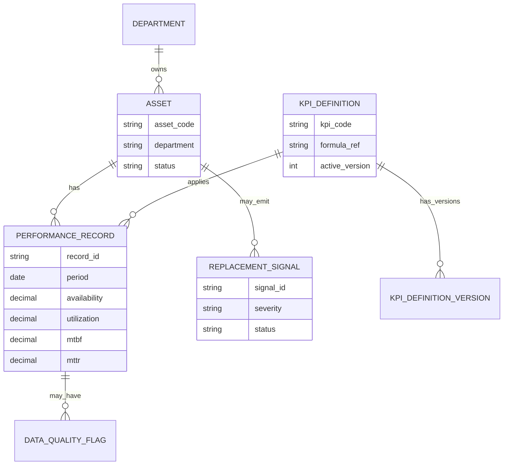
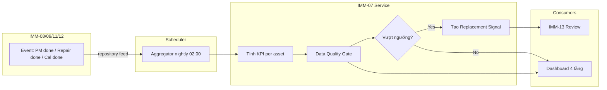
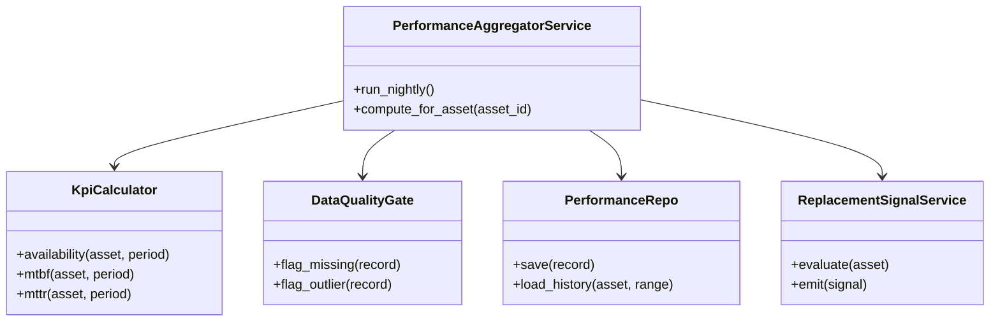
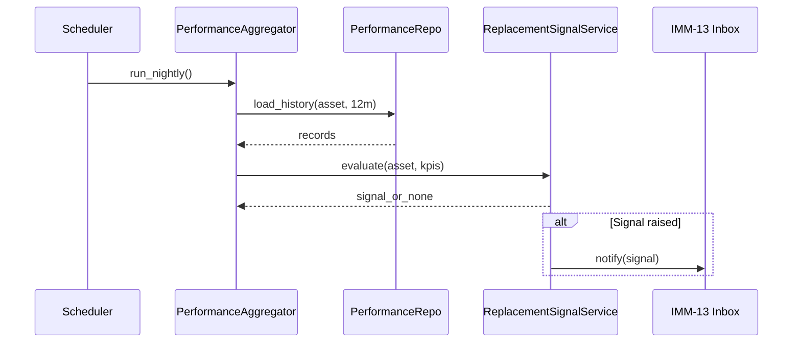
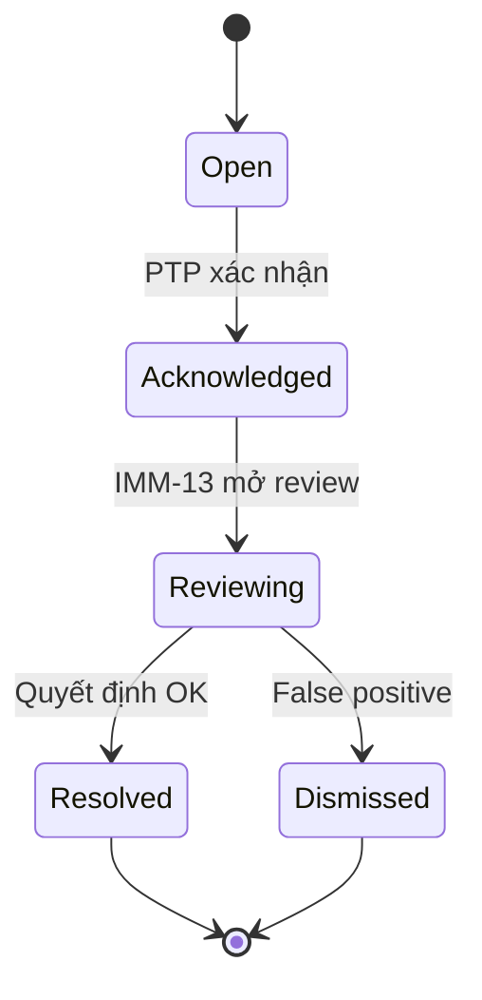

# IMM-07 — Sơ đồ (Diagrams)

| Mục | Giá trị |
|---|---|
| Module | IMM-07 — Theo dõi hiệu suất |
| Trạng thái | Skeleton (BE chưa scaffold — diagram chi tiết bổ sung sau Sprint Wave 3.1) |

## I. ERD (Entity Relationship)

Sơ đồ overview các entity dự kiến của IMM-07. Field detail *(Thiết kế trong Sprint Wave 3)*.

*Hình 3.1 — ERD overview IMM-07. Field chi tiết và link tới `AC Asset`, `Department` thực tế xem `04_Backend_Design.md`.*

## II. BPMN — To-Be (swimlane)

*Hình 3.2 — BPMN To-Be IMM-07.*

## III. Class diagram (overview)

*Hình 3.3 — Class diagram tầng service. Method signature cụ thể *(Thiết kế trong Sprint Wave 3.1)*.*

## IV. Sequence — UC-07-05 Replacement Signal

*Hình 3.4 — Sequence UC-07-05.*

## V. State machine — Replacement Signal

*Hình 3.5 — State machine Replacement Signal. Workflow JSON chi tiết *(Sprint Wave 3.2)*.*

*(Sequence cho UC-07-01..04, 06 bổ sung khi service được scaffold thật.)*
