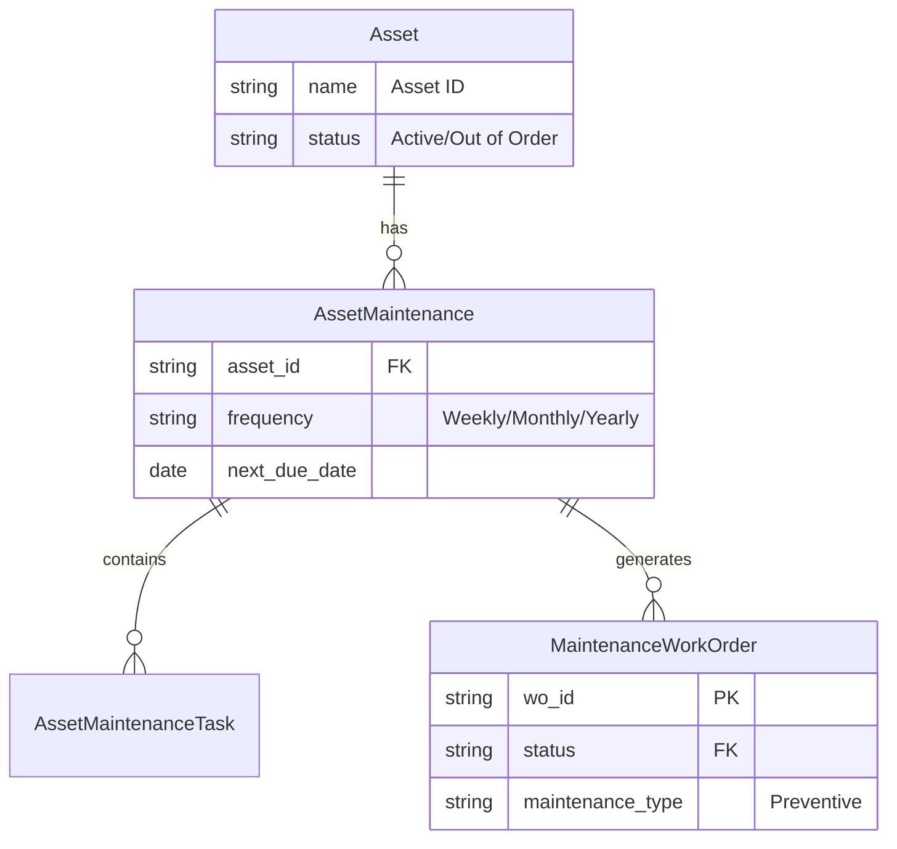
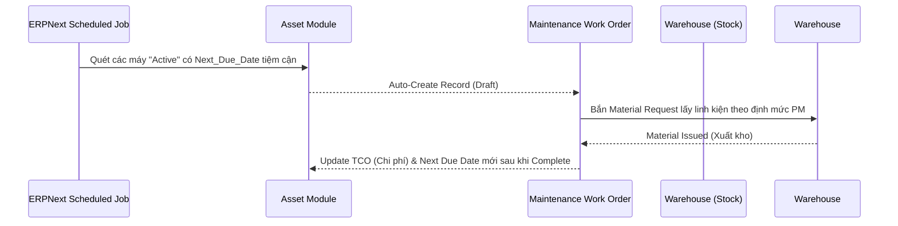

# Technical Architecture: Preventive Maintenance (Bảo trì dự phòng)

**Hệ thống:** AssetCore (Built on ERPNext)
**Domain:** Medical Device Lifecycle Management
**Arch Pattern:** Event-Driven Architecture (EDA) & Scheduled Jobs

Tiến trình Bảo trì dự phòng đòi hỏi sự tích hợp sâu giữa Lịch bảo trì tĩnh và Trạng thái máy móc động. Do đó kiến trúc kỹ thuật yêu cầu tuân thủ tính nhất quán dữ liệu của ERPNext.

---

## 1. ERD (Entities & Relationships)

Sự kết nối giữa các thực thể bảng biểu nội bộ Frappe:

---

## 2. Event Model (Động cơ sự kiện)

Cấu trúc luồng chạy không phụ thuộc con người (Robotic Process Automation):

| Event Name | Trigger Context | Payload (JSON Form) |
|---|---|---|
| `pm.schedule.due` | Chạy Script `Daily Scheduled Job`. Nếu `cur_date >= next_due_date - N days` VÀ `Asset.status == 'Active'` | `{"asset": "MÁY-THỞ-01", "task": "Thay Lọc Gió", "due_date": "2026-05-01"}` |
| `pm.wo.created` | Kích hoạt ngay khi System tạo xong 1 phiếu `Maintenance Work Order` dạng Draft/Reported. | `{"wo_id": "WO-26-0001", "assigned_to": "kỹ-sư-A"}` |
| `pm.wo.completed`| Kích hoạt khi Kỹ sư Submit hoàn thành Work Order PM. | `{"wo_id": "WO-26-0001", "status": "Completed", "cost": 500000}` |

---

## 3. State Machine (Vòng đời của lệnh PM)

| State | Role in Charge | Next Valid Transitions |
|---|---|---|
| `Draft` | *System Scheduled Job* | -> `Assigned` (Auto-routed based on Category) |
| `Assigned` | Asset Manager | -> `In Progress` |
| `In Progress` | Technician | -> `Pending Spares`, -> `Pending Vendor`, -> `Completed` |
| `Pending Spares`| Technician | -> `In Progress` (Khi Stock gửi Receipt API) |
| `Completed` | *System* | Tính toán Next Due Date = Current Date + Frequency. |

---

## 4. Mapping: ERPNext Core ↔ Custom DocType

Thay vì build mới 100%, AssetCore sẽ Extend (thừa kế) module Core của Frappe.

- **Master Data:** Dùng bảng gốc `Asset` của tài chính để kế toán dễ dàng khấu hao. Thêm các Custom Fields `Technical Specs` vào form có sẵn.
- **Maintenance Schedule:** Dùng DocType `Asset Maintenance` có sẵn của ERPNext.
- **Execution Log:** Mặc định bằng bảng `Asset Maintenance Log`. AssetCore sẽ **Override** DocType này bằng **`Maintenance Work Order`** tự Custom khắt khe hơn để đáp ứng 8 chỉ tiêu QMS (như Log, Checklist, TCO...).
- **Inventory/Spares:** Sử dụng hàm `frappe.new_doc('Stock Entry')` (Purpose = Material Issue) kết nối với lõi quản trị tồn kho.

---

## 5. Data Flow (Luồng dữ liệu tích hợp)

---

## 6. Integration points (API/Webhook)

- **Webhook Hướng ra (Outbound):** `Zalo ZNS API / SMS Brandname`
  - *Trigger Event:* Khi Work Order chuyển thành `Assigned` hoặc lọt vào ngưỡng báo động đỏ `Overdue`.
  - *Action:* System gửi API POST Call sang Zalo/SMS kèm Payload chứa Tên kỹ sư, Tên máy và Vị trí Khoa.
- **Webhook Hướng vào (Inbound):** `Mobile App Call`
  - Kỹ sư dùng Tablet dưới hiện trường bắn API `PUT /api/resource/Maintenance Work Order/WO-1` kèm field Status = `In Progress`.

---

## 7. Reporting metrics (KPI)

Truy xuất SQL/Report Builder trả về màn hình Dashboard TBYT:

1. **PM Compliance Rate:** Phải đạt > 95% (SL PM hoàn thành đúng hạn / Tổng số mốc PM phải làm trong tháng).
2. **Mean Time to Maintain (MTTM):** Tuổi thọ trung bình của một phiếu PM (Từ Assigned đến Completed) xem mất mấy giờ?
3. **Mismatched Parts Variance:** Lượng linh kiện yêu cầu vượt định mức trong dự phòng tĩnh, nhằm quản lý Rủi ro thất thoát trong đội ngũ Kỹ sư.
