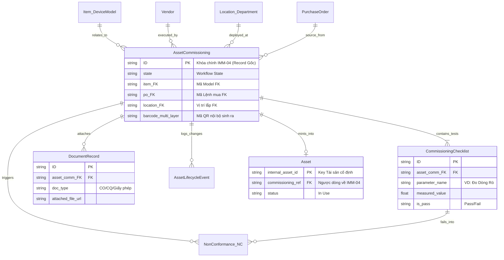

# Thiết kế ERD Logic Triển khai: IMM-04

Tài liệu này họa đồ hóa các thực thể (Entity) tạo thành lõi cơ sở dữ liệu cho quá trình Lắp đặt, định danh và kiểm tra ban đầu (IMM-04). Bóc tách đúng trọng tâm ranh giới 3 lớp dữ liệu: Master, Operational, và Governance QMS.

---

## A. Danh sách các Entity (Thực thể hệ thống)

| Tên Thực thể (Entity) | Vai trò phân loại | Định nghĩa |
|---|---|---|
| `Item / Device Model` | Master Data | Danh mục từ điển cấu hình máy (Model, Brand, Specs). Của chung hệ thống ERP. |
| `Location / Department` | Master Data | Sơ đồ khoa phòng bệnh viện (VD: Phòng X-Quang 1, Khoa Hồi Sức). |
| `Vendor` | Master Data | Hồ sơ đơn vị cung cấp, kỹ sư hãng. |
| `Purchase Order (PO)` | Reference Data | Đơn hàng gốc chứa giá cả, điều khoản. |
| **`Asset Commissioning`** | **Operational / Gốc** | **Record Mẹ** điều phối toàn bộ IMM-04 (Ngày lắp, ai lắp, status). |
| `Commissioning Checklist`| Governance (Child) | Bảng kiểm QMS chi tiết (Test điện, test dòng, test móp/mép). |
| `Document Record` | Governance (Child) | Lưu trữ bản mềm CO, CQ, HDSD... gắn liền với đợt Commissioning. |
| `Non-Conformance (NC)` | Governance | Record ngoại lệ (Lỗ hổng). Khởi tạo khi dính DOA hoặc rớt Test. |
| `Asset Lifecycle Event` | Governance | Bảng Log vĩnh viễn ghi nhận dấu vết Audit đổi State. |
| **`Asset`** | **Master Asset** | Cục tài sản trị giá thực tế (Đứa con sinh ra khi Release thành công IMM-04). |

---

## B. Sơ đồ ERD Logic (Dạng Text Diagram)

Sử dụng cấu trúc Mermaid (Text-based ERD):

---

## C. Bảng Relationship Chi tiết (Cardinality Breakdown)

| Từ Entity | Cardinality | Đến Entity | Ràng buộc (Constraint Constraint) |
|---|---|---|---|
| `Asset Commissioning` `(1)` | **1 : Many** | `(N)` `Commissioning Checklist` | Xóa Commissioning -> Xóa luôn Checklist con (Cascading Delete, dù Frappe cấm Delete cứng). |
| `Asset Commissioning` `(1)` | **1 : Many** | `(N)` `Document Record` | Tương tự bảng Child. |
| `Commissioning Checklist` `(N)` | **0 : 1** | `(1)` `Non-Conformance (NC)`| 1 bước Test rớt (Fail) chọc thẳng ra 1 Phiếu NC. 1 NC có thể do nhiều bước Fail tạo thành. |
| `Purchase Order` `(1)` | **1 : Many** | `(N)` `Asset Commissioning` | 1 Lệnh mua 10 máy, sinh ra 10 phiếu IMM-04 độc lập để quản riêng từng số Serial. |
| `Asset Commissioning` `(1)` | **0 : 1** | `(1)` `Asset` | Đây là ràng buộc thiêng liêng nhất! Bắt đầu = `0` (Chưa sinh Asset). Khi qua Release Gate = `1` (Mỗi tờ Commissioning chỉ đẻ ra đúng 1 cái máy vật lý). |

---

## D. Danh sách Khóa Traceability (Móc nối truy xuất nguồn gốc)

Đường đi của Dữ liệu (Truy ngược 100%):

1. **Khóa truy ngược từ `Asset` gốc (Mạch đích):**
   - Trên bảng `Asset` -> Có field FK: `commissioning_ref`. Bác sĩ click vào đây sẽ mở bung ra tờ hồ sơ chứa chỉ số Baseline từ thời cởi truồng bóc Seal của 10 năm trước.
2. **Khóa truy ngược từ `Asset Commissioning` (Mạch dọc):**
   - Field `po_reference` FK -> Trả về tờ sớ Đấu thầu/Mua sắm. Kế toán click vào để chốt Công nợ trả nhà thầu.
3. **Khóa truy từ `NC Record` (Mạch lỗi):**
   - Field `source_commissioning_form_FK` -> Đưa Kỹ sư về thẳng phiếu Lắp đặt bị DOA để truy chứng nhà thầu nào làm hỏng.
4. **Khóa truy `Asset Lifecycle Event` (Audit):**
   - Bảng này lưu field `reference_name` (Là ID của phiếu Asset Commissioning). Mọi lần có chữ ký Giám Đốc đè lên đều bóc được IP và Tọa Tộ.

---

## E. Các rủi ro (Pitfalls) nếu Thiết kế ERD bị cắm sai

- **Nguy cơ 1: Trộn lẫn `Item` và `Asset`:** Nếu Dev code form lắp đặt chỉ cắm khóa ngoại vào bảng `Item` mà quên việc tạo thực thể tách biệt `Asset` làm đích đến -> Hệ thống chỉ đếm được Tồn Kho (Stock) chứ KHÔNG quản lý nổi Dòng đời Từng Số Serial Lẻ của 10 máy dập giống hệt nhau. Vi phạm luật định danh Đa lớp!
- **Nguy cơ 2: Nhồi Checklist vào Field thẳng hàng (Flat Fields):** Nếu Dev tiếc công viết Child-Table `CommissioningChecklist`, mà lại nhồi 30 cái field T/F (Tick Box) đo điện vào thẳng bảng mẹ `AssetCommissioning` -> Sau này không thể làm Report Query thống kê "Có bao nhiêu thiết bị bị rò rỉ điện > 2.0mA trong năm nay". Nó chết dữ liệu.
- **Nguy cơ 3: Cắt đứt sợi dây NC (Non-Conformance Trôi Nổi):** Nếu Record thẻ NC tạo ra không chứa ForeignKey móc ngược về `Checklist Item ID` đã đánh trượt nó, QA Officer không thể nào biết Kỹ sư lập NC vì lý do gì (móp méo hộp hay đo rò điện sai lệch).
