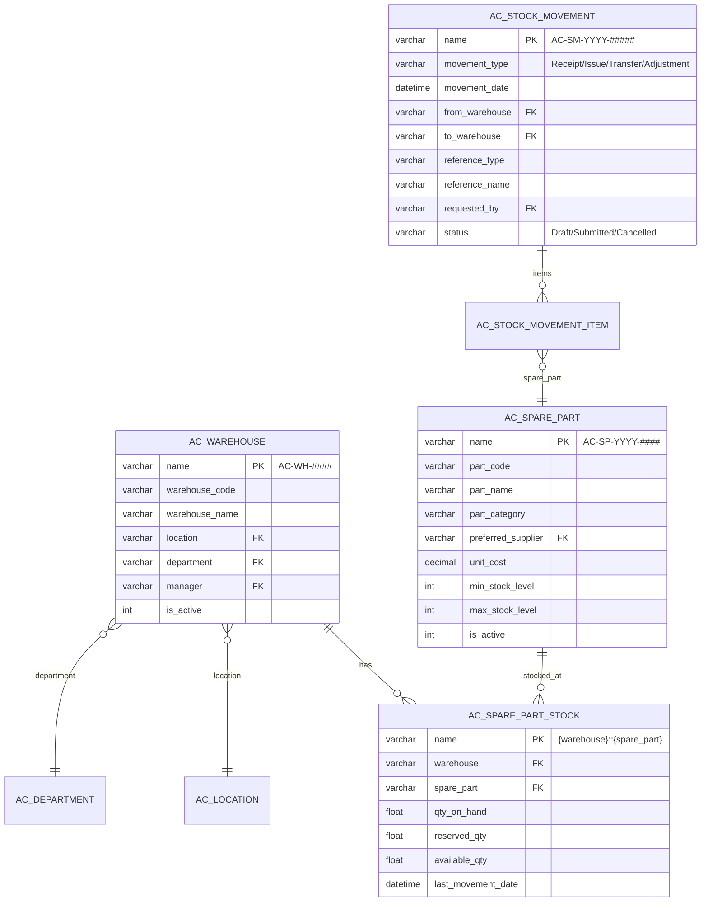
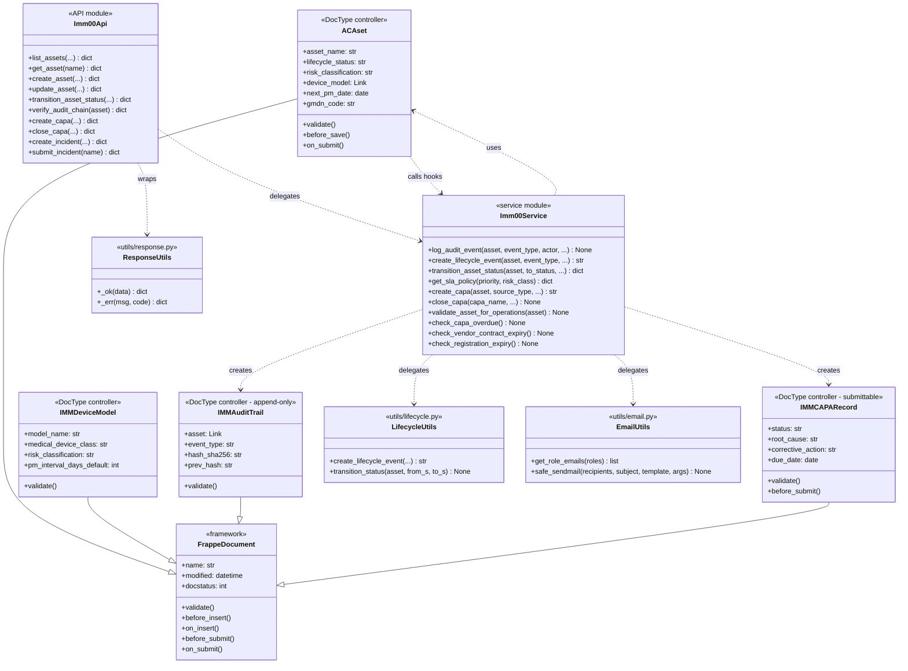
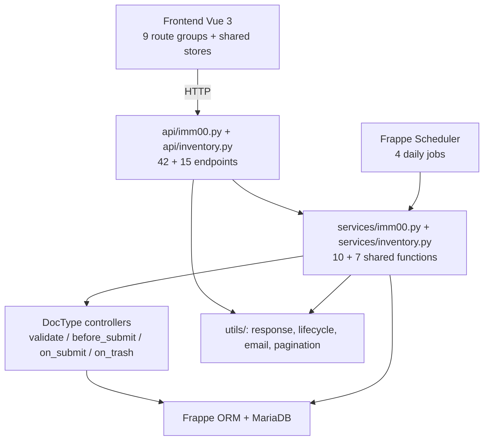
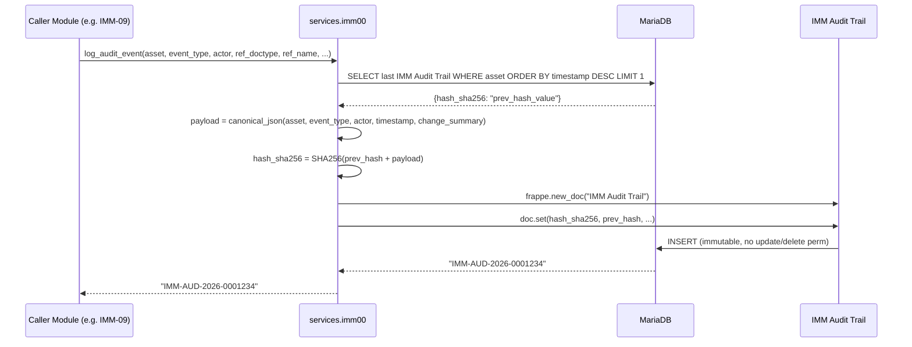
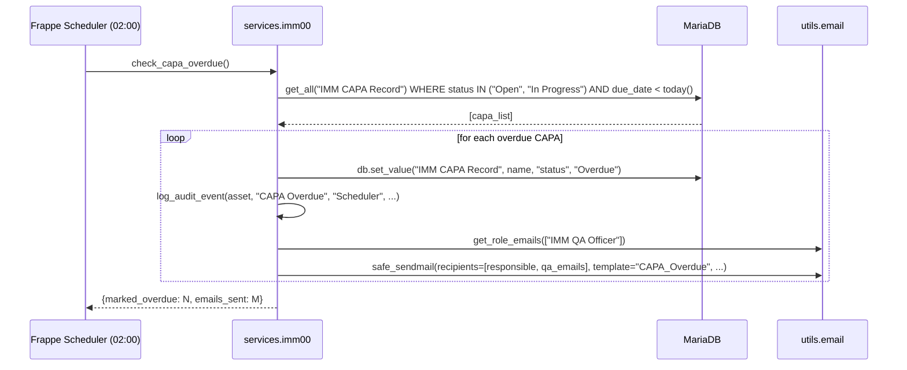
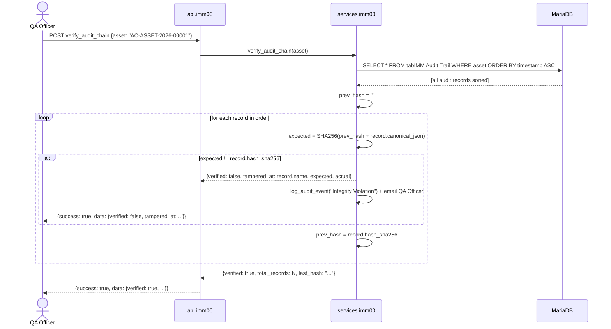
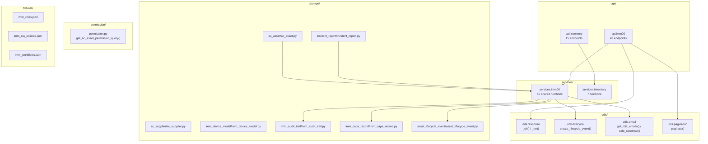
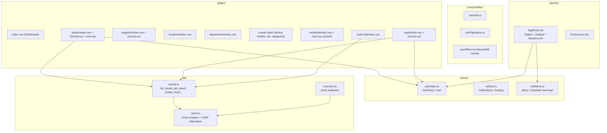
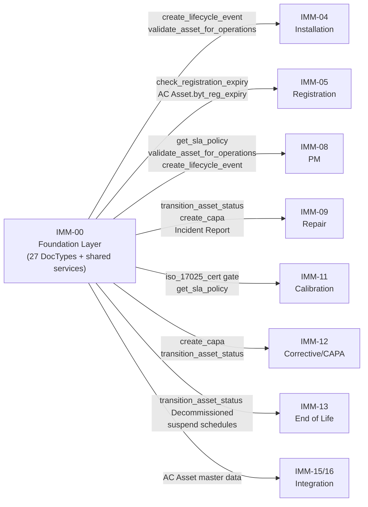

# 03 — Biểu đồ kỹ thuật — IMM-00 Foundation (Master / Cross-cutting)

| Mục | Giá trị |
|---|---|
| Module | IMM-00 — Foundation / Master Cross-cutting |
| Phạm vi | Foundation — cross-cutting |
| Owner | System Architect / Tech Lead / DBA |
| Liên kết | [02 Analysis & Design](./02_Analysis_Design.md) · [04 Backend Design](./04_Backend_Design.md) |

---

# Phần I — Entity Relationship Diagram (ERD)

## I.1. ERD — Foundation DocTypes (Core + Governance)

```mermaid
erDiagram
    AC_ASSET_CATEGORY ||--o{ IMM_DEVICE_MODEL : "asset_category → inherit gmdn_code + pm_defaults"
    IMM_DEVICE_MODEL ||--o{ AC_ASSET : "device_model → inherit gmdn_code + pm_intervals"
    AC_ASSET }o--|| AC_ASSET_CATEGORY : "asset_category (direct link)"
    AC_ASSET }o--|| AC_LOCATION : "location"
    AC_ASSET }o--|| AC_DEPARTMENT : "department"
    AC_ASSET }o--|| AC_SUPPLIER : "supplier"
    AC_ASSET ||--o{ ASSET_LIFECYCLE_EVENT : "emits"
    AC_ASSET ||--o{ IMM_AUDIT_TRAIL : "logged_by"
    AC_ASSET ||--o{ INCIDENT_REPORT : "reported_on"
    INCIDENT_REPORT ||--o| IMM_CAPA_RECORD : "linked_capa"
    IMM_DEVICE_MODEL ||--o{ IMM_DEVICE_SPARE_PART : "spare_parts_list"
    IMM_DEVICE_SPARE_PART }o--|| AC_SPARE_PART : "spare_part"
    AC_SUPPLIER ||--o{ AC_AUTHORIZED_TECHNICIAN : "authorized_technicians"
    AC_LOCATION ||--o| AC_LOCATION : "parent_location (tree)"
    AC_DEPARTMENT ||--o| AC_DEPARTMENT : "parent_department (tree)"
    AC_WAREHOUSE ||--o{ AC_SPARE_PART_STOCK : "has stock"
    AC_SPARE_PART ||--o{ AC_SPARE_PART_STOCK : "stocked at"
    AC_STOCK_MOVEMENT ||--o{ AC_STOCK_MOVEMENT_ITEM : "items"
    AC_STOCK_MOVEMENT_ITEM }o--|| AC_SPARE_PART : "spare_part"

    AC_ASSET {
        varchar name PK "AC-ASSET-YYYY-#####"
        varchar asset_name
        varchar asset_code
        varchar device_model FK
        varchar asset_category FK
        varchar location FK
        varchar department FK
        varchar supplier FK
        varchar responsible_technician FK
        varchar lifecycle_status "8 states"
        varchar risk_classification "Low/Medium/High/Critical"
        varchar udi_code
        varchar gmdn_code "inherit từ device_model.gmdn_code — trục lọc/quản lý"
        varchar byt_reg_no
        date byt_reg_expiry
        date next_pm_date
        date next_calibration_date
        date commissioning_date
    }

    IMM_AUDIT_TRAIL {
        varchar name PK "IMM-AUD-YYYY-#######"
        varchar asset FK
        varchar event_type
        varchar actor
        datetime timestamp
        varchar from_status
        varchar to_status
        varchar ref_doctype
        varchar ref_name
        varchar hash_sha256
        varchar prev_hash
    }

    ASSET_LIFECYCLE_EVENT {
        varchar name PK "ALE-YYYY-#######"
        varchar asset FK
        varchar event_type
        datetime timestamp
        varchar actor
        varchar from_status
        varchar to_status
        varchar root_doctype
        varchar root_record
        text notes
    }

    IMM_CAPA_RECORD {
        varchar name PK "CAPA-YYYY-#####"
        varchar asset FK
        varchar source_type
        varchar source_ref
        varchar severity
        varchar status "Open/InProgress/Overdue/Closed"
        varchar responsible FK
        date due_date
        text root_cause
        text corrective_action
        text preventive_action
        varchar linked_incident FK
        date closed_date
    }

    INCIDENT_REPORT {
        varchar name PK "IR-YYYY-####"
        varchar asset FK
        varchar severity
        varchar status
        datetime incident_datetime
        varchar reporter FK
        int patient_affected
        int reported_to_byt
        date byt_report_date
        varchar linked_capa FK
    }

    AC_ASSET_CATEGORY {
        varchar name PK "by category_name"
        varchar category_name
        varchar gmdn_code "Nguồn GMDN — kế thừa xuống Device Model"
        int default_pm_required
        int default_pm_interval_days
        int default_calibration_required
        int default_calibration_interval_days
        varchar default_depreciation_method
        int total_depreciation_months
    }

    IMM_DEVICE_MODEL {
        varchar name PK "IMM-MDL-YYYY-####"
        varchar model_name
        varchar manufacturer
        varchar asset_category FK "→ AC Asset Category"
        varchar medical_device_class "I/II/III"
        varchar risk_classification "auto từ class"
        varchar gmdn_code "inherit từ asset_category.gmdn_code; có thể override"
        varchar emdn_code
        int pm_interval_days
        int calibration_interval_days
    }

    IMM_SLA_POLICY {
        varchar name PK
        varchar policy_name
        varchar priority "P1/P2/P3/P4"
        varchar risk_class
        int response_time_minutes
        float resolution_time_hours
        int is_default
    }
```



### Chuỗi kế thừa GMDN / PM Defaults

```
AC Asset Category          (nguồn dữ liệu — gmdn_code + pm/calibration defaults)
        │  before_insert (IMMDeviceModel)
        ▼
IMM Device Model           (kế thừa gmdn_code từ category; có thể override thủ công)
        │  before_insert (ACAsset — via fetch_from + on_insert hook nếu cần)
        ▼
AC Asset                   (nhận gmdn_code từ device_model — trục lọc/quản lý thiết bị)
```

- **`gmdn_code`**: mã phân loại thiết bị y tế toàn cầu (5–6 chữ số). Sống ở `AC Asset Category` vì một GMDN code tương ứng với một *loại* thiết bị (không phải từng model cụ thể). Model kế thừa để có thể tra nhanh mà không cần join qua category.
> **Note (2026-05-19):** Field trạng thái sử dụng GMDN (cũ) trên Asset đã bị loại bỏ — trùng ngữ nghĩa với `lifecycle_status`. Lọc/quản lý nhóm thiết bị nay dùng `gmdn_code`. Xem [analysis §6](../res/gmdn-asset-category-analysis.md).

---

## I.2. ERD — Inventory Sub-domain (v4)



## I.3. Entity catalog

**Foundation DocTypes (IMM-00 sở hữu):**

| Entity | DocType name | Naming | Volume/năm |
|---|---|---|---|
| AC Asset | tabAC Asset | AC-ASSET-.YYYY.-.##### | ~1000 assets/site |
| AC Supplier | tabAC Supplier | AC-SUP-.YYYY.-.#### | ~100 NCC/site |
| AC Location | tabAC Location | AC-LOC-.YYYY.-.#### | ~200 locations/site |
| AC Department | tabAC Department | AC-DEPT-.#### | ~50 departments/site |
| AC Asset Category | tabAC Asset Category | by category_name | ~20 categories |
| IMM Device Model | tabIMM Device Model | IMM-MDL-.YYYY.-.#### | ~500 models |
| IMM SLA Policy | tabIMM SLA Policy | by policy_name | ~20 policies |
| IMM Audit Trail | tabIMM Audit Trail | IMM-AUD-.YYYY.-.####### | ~5M records |
| IMM CAPA Record | tabIMM CAPA Record | CAPA-.YYYY.-.##### | ~200/năm |
| Asset Lifecycle Event | tabAsset Lifecycle Event | ALE-.YYYY.-.####### | ~10k/năm |
| Incident Report | tabIncident Report | IR-.YYYY.-.#### | ~300/năm |

**Child DocTypes:**

| Child DocType | Parent | Mục đích |
|---|---|---|
| IMM Device Spare Part | IMM Device Model | BOM phụ tùng đề xuất |
| AC Authorized Technician | AC Supplier | KTV ủy quyền của NCC |
| AC Stock Movement Item | AC Stock Movement | Chi tiết từng phụ tùng |

---

# Phần II — Class Diagram

## II.1. Shared utility classes



## II.2. Layer mapping



---

# Phần III — Sequence Diagrams

## III.1. Sequence — log_audit_event (SHA-256 chain)



## III.2. Sequence — transition_asset_status

```mermaid
sequenceDiagram
    actor Actor as Actor (Workshop Lead / Ops Manager)
    participant API as api.imm00
    participant SVC as services.imm00
    participant Asset as AC Asset
    participant ALE as Asset Lifecycle Event
    participant AUD as IMM Audit Trail
    database DB

    Actor->>API: POST transition_asset_status {name, new_status, reason}
    API->>SVC: transition_asset_status(asset_name, to_status, actor, reason, root_doctype, root_record)

    alt to_status = lifecycle_status (no change)
        SVC-->>API: ServiceError(VALIDATION, "Trạng thái không thay đổi")
        API-->>Actor: {success: false, ...}
    else Invalid transition (e.g. Decommissioned → Active)
        SVC-->>API: ServiceError(AC-E002, "Transition không hợp lệ")
        API-->>Actor: {success: false, ...}
    else Happy path
        SVC->>Asset: db.set_value("lifecycle_status", to_status)
        Asset->>DB: UPDATE tabAC Asset
        SVC->>ALE: create_lifecycle_event(asset, event_type, from_s, to_s, root, notes)
        ALE->>DB: INSERT (append-only)
        SVC->>SVC: log_audit_event(asset, "State Change", actor, ...)
        SVC->>DB: INSERT IMM Audit Trail
        alt to_status = "Decommissioned"
            SVC->>Asset: db.set_value is_pm_required=0, next_pm_date=NULL (BR-00-04)
            Asset->>DB: UPDATE
        end
        SVC-->>API: {asset, from_status, to_status, lifecycle_event, audit_trail}
        API-->>Actor: {success: true, data: {...}}
    end
```

## III.3. Sequence — check_capa_overdue (Daily scheduler)



## III.4. Sequence — verify_audit_chain



---

# Phần IV — Communication Diagram

## IV.1. Communication — create_asset (full flow)

```plantuml
@startuml
object "browser:VueSPA" as B
object ":Imm00Api" as API
object ":Imm00Service" as SVC
object ":ACAssetDoc" as DOC
object ":IMMDeviceModel" as MDL
object ":AuditTrail" as AUD
database ":MariaDB" as DB

B    --> API  : 1: POST create_asset {payload}
API  --> SVC  : 2: validate inputs
SVC  --> MDL  : 3: frappe.get_doc(device_model) → fetch risk_class, pm_interval
MDL  --> DB   : 3.1: SELECT
SVC  --> DOC  : 4: frappe.new_doc("AC Asset")
SVC  --> DOC  : 4.1: set all fields
DOC  --> DB   : 5: INSERT tabAC Asset
SVC  --> AUD  : 6: log_audit_event("Asset Created")
AUD  --> DB   : 6.1: INSERT tabIMM Audit Trail
API  --> B    : 7: 200 {success: true, data: {name: "AC-ASSET-2026-00001"}}
@enduml
```

## IV.2. Communication — close_capa

```plantuml
@startuml
object "browser:VueSPA" as B
object ":Imm00Api" as API
object ":Imm00Service" as SVC
object ":CAPADoc" as CAPA
object ":AuditTrail" as AUD
database ":MariaDB" as DB

B    --> API  : 1: POST close_capa {name, root_cause, corrective_action, preventive_action, effectiveness_check}
API  --> SVC  : 2: close_capa(capa_name, ...)
SVC  --> CAPA : 3: frappe.get_doc("IMM CAPA Record", name)
CAPA --> DB   : 3.1: SELECT
SVC  --> SVC  : 4: validate root_cause + corrective_action + preventive_action (BR-00-08)
alt Missing required fields
    SVC  --> API  : 5a: ServiceError(AC-E005, "Thiếu thông tin CAPA")
    API  --> B    : 5b: {success: false, code: "AC-E005"}
else Happy path
    SVC  --> CAPA : 5: set status="Closed", closed_date=today()
    CAPA --> DB   : 5.1: UPDATE
    SVC  --> CAPA : 6: doc.submit() → docstatus=1
    CAPA --> DB   : 6.1: UPDATE docstatus
    SVC  --> AUD  : 7: log_audit_event("CAPA Closed")
    AUD  --> DB   : 7.1: INSERT
    API  --> B    : 8: {success: true, data: {name, status: "Closed", closed_at}}
end
@enduml
```

---

# Phần V — Package / Dependency Diagram

## V.1. Backend package diagram



## V.2. Frontend package diagram



## V.3. Cross-module dependency



---

## DoD — File 03 hoàn chỉnh

### I. ERD
- [x] Foundation DocTypes ERD (Core + Governance)
- [x] Inventory sub-domain ERD
- [x] Entity catalog + naming + volume
- [x] Child DocTypes

### II. Class Diagram
- [x] Shared utility classes (Imm00Service, ResponseUtils, LifecycleUtils)
- [x] DocType controllers (ACAset, IMMDeviceModel, IMMAuditTrail, IMMCAPARecord)
- [x] Layer mapping flowchart

### III. Sequence Diagrams
- [x] log_audit_event (SHA-256 chain)
- [x] transition_asset_status (happy + error paths)
- [x] check_capa_overdue (daily scheduler)
- [x] verify_audit_chain (integrity check)

### IV. Communication Diagrams
- [x] create_asset (full flow)
- [x] close_capa

### V. Package Diagrams
- [x] Backend package (api → services → utils → doctype)
- [x] Frontend package (pages → stores → api → composables)
- [x] Cross-module dependency (IMM-00 → all downstream)
