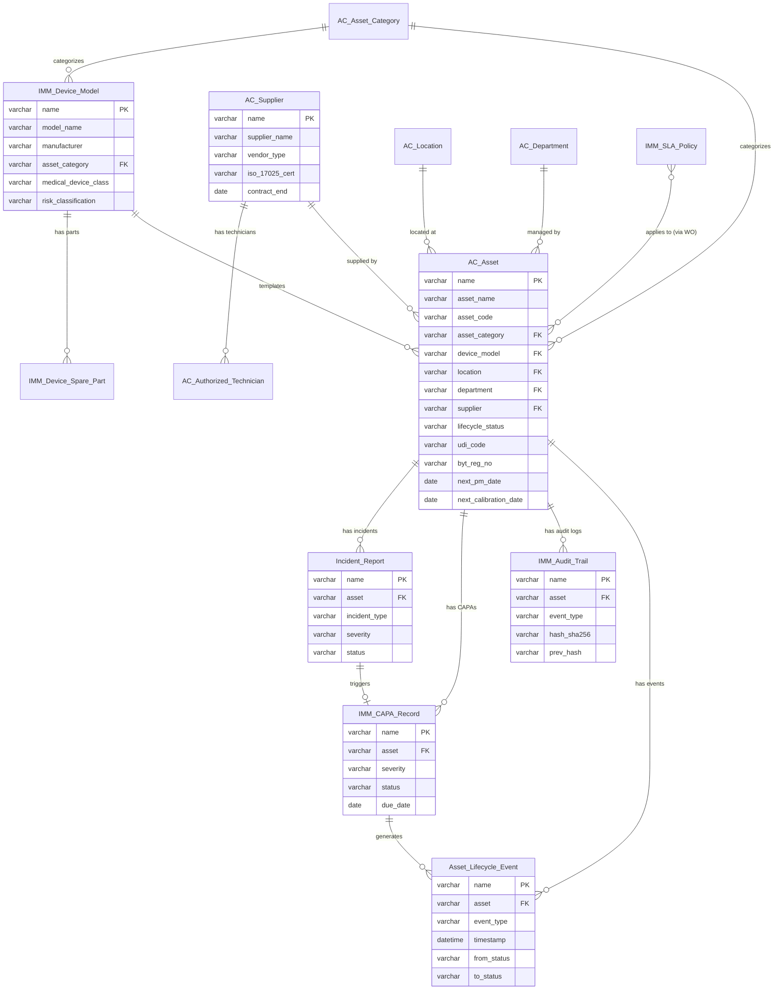

# IMM-00 Foundation Module — Technical Design Document

**Module:** IMM-00 Foundation  
**Version:** 3.0.0  
**Status:** DRAFT — chờ implement  
**Date:** 2026-04-18  
**Author:** AssetCore Team  

---

## Table of Contents

1. [Kiến trúc tổng thể](#1-kiến-trúc-tổng-thể)
2. [Data Dictionary — 13 DocTypes](#2-data-dictionary--13-doctypes)
   - 2.1 AC Asset
   - 2.2 AC Supplier
   - 2.3 AC Location
   - 2.4 AC Department
   - 2.5 AC Asset Category
   - 2.6 IMM Device Model
   - 2.7 IMM SLA Policy
   - 2.8 IMM Audit Trail
   - 2.9 IMM CAPA Record
   - 2.10 Asset Lifecycle Event
   - 2.11 Incident Report
   - 2.12 IMM Device Spare Part (Child)
   - 2.13 AC Authorized Technician (Child)
3. [Service Layer Design](#3-service-layer-design)
4. [ERD — Entity Relationship Diagram](#4-erd--entity-relationship-diagram)
5. [CAPA State Machine](#5-capa-state-machine)
6. [Lifecycle Status State Machine — AC Asset](#6-lifecycle-status-state-machine--ac-asset)
7. [Audit Trail Design](#7-audit-trail-design)
8. [SLA Engine Design](#8-sla-engine-design)
9. [Scheduler Jobs Design](#9-scheduler-jobs-design)
10. [Database Indexes](#10-database-indexes)
11. [Exception Codes](#11-exception-codes)
12. [Migration từ v2](#12-migration-từ-v2)
13. [Testing Strategy](#13-testing-strategy)

---

## 1. Kiến trúc tổng thể

### 1.1 Nguyên tắc kiến trúc v3 — Frappe-Only, Native DocTypes

Phiên bản 3 phá vỡ hoàn toàn cách tiếp cận v2. Không còn ERPNext dependency, không còn sidecar, không còn sync.

| Nguyên tắc | v2 (cũ — bị bỏ) | v3 (mới — bắt buộc) |
|---|---|---|
| Dependency | Frappe + ERPNext | Frappe Framework v15 only |
| Asset record | ERPNext Asset + IMM Asset Profile (sidecar 1:1) | AC Asset (native, HTM fields first-class) |
| Supplier record | ERPNext Supplier + IMM Vendor Profile (sidecar 1:1) | AC Supplier (native) |
| Location record | ERPNext Location + IMM Location Ext (sidecar 1:1) | AC Location (native, Tree) |
| HTM metadata | 16 Custom Fields trên tabAsset | Fields trực tiếp trên AC Asset |
| Sync function | `sync_single_asset_profile()` | Không cần — đã native |
| Prefix DocType | IMM- (tất cả) | AC- (core), IMM- (governance) |

### 1.2 Stack và vị trí trong hệ thống

```
┌──────────────────────────────────────────────────────────────────┐
│                  Frappe Framework v15                            │
│   User · Role · File · Comment · Version · Address · Contact     │
│   ToDo · Email Queue · Workflow Engine · ORM · Scheduler         │
└───────────────────────────┬──────────────────────────────────────┘
                            │  dependency DUY NHẤT
                            ▼
┌──────────────────────────────────────────────────────────────────┐
│                      AssetCore App                               │
│                                                                  │
│  ┌────────────────────────────────────────────────────────────┐  │
│  │              IMM-00 Foundation Layer                       │  │
│  │                                                            │  │
│  │  Core DocTypes (schema kế thừa ERPNext, tái tạo native):  │  │
│  │    AC Asset  ·  AC Supplier  ·  AC Location               │  │
│  │    AC Department  ·  AC Asset Category                    │  │
│  │                                                            │  │
│  │  Governance DocTypes (AssetCore-native):                  │  │
│  │    IMM Device Model  ·  IMM SLA Policy                    │  │
│  │    IMM Audit Trail  ·  IMM CAPA Record                    │  │
│  │    Asset Lifecycle Event  ·  Incident Report              │  │
│  │                                                            │  │
│  │  Children: IMM Device Spare Part · AC Authorized Tech     │  │
│  │                                                            │  │
│  │  Services:  assetcore/services/imm00.py                   │  │
│  │  Utils:     assetcore/utils/{response,lifecycle,email,    │  │
│  │             pagination}.py                                │  │
│  │  Scheduler: 4 daily jobs                                  │  │
│  └────────────────────────────────────────────────────────────┘  │
│                                                                  │
│  ┌──────────┐ ┌──────────┐ ┌──────────┐ ┌──────────┐            │
│  │  IMM-04  │ │  IMM-05  │ │  IMM-08  │ │  IMM-09  │  ...       │
│  │ Install  │ │ Register │ │   PM     │ │  Repair  │            │
│  └──────────┘ └──────────┘ └──────────┘ └──────────┘            │
└──────────────────────────────────────────────────────────────────┘
```

### 1.3 Naming Convention

| Prefix | Áp dụng cho | Ví dụ |
|---|---|---|
| `AC-` | Core DocTypes (schema kế thừa ERPNext) | AC Asset, AC Supplier, AC Location, AC Department, AC Asset Category |
| `IMM-` | Governance DocTypes (AssetCore-native) | IMM Device Model, IMM SLA Policy, IMM Audit Trail, IMM CAPA Record |
| `ALE-` | Asset Lifecycle Event | ALE-2026-0000001 |
| `IR-` | Incident Report | IR-2026-0001 |
| `CAPA-` | IMM CAPA Record | CAPA-2026-00001 |

### 1.4 Layer Architecture

```
Request (HTTP / Scheduler)
        │
        ▼
  API Layer (api/imm00.py)
        │   @frappe.whitelist()
        ▼
  Service Layer (services/imm00.py)
        │   Business logic, SLA, validation gates
        ▼
  Controller Layer (DocType controllers)
        │   validate(), before_submit(), on_submit()
        ▼
  Data Layer (Frappe ORM → MariaDB)
        │
        ▼
  Side Effects: Audit Trail · Lifecycle Event · Email · Scheduler
```

Quy tắc bất biến: **Không viết business logic trong controller.** Controller chỉ được gọi service function. Logic nghiệp vụ nằm toàn bộ trong `services/imm00.py`.

---

## 2. Data Dictionary — 13 DocTypes

Ký hiệu cột:

| Ký hiệu | Ý nghĩa |
|---|---|
| YES | Bắt buộc (`reqd: 1`) |
| NO | Không bắt buộc |
| COND | Bắt buộc theo điều kiện (`mandatory_depends_on`) |
| AUTO | Frappe tự điền |
| IDX | Có database index |
| MUL | Có composite index |

---

### 2.1 AC Asset (`tabAC Asset`)

**Autoname:** `AC-ASSET-.YYYY.-.#####`  
**Module:** AssetCore  
**is_submittable:** 1  
**track_changes:** 1  
**allow_import:** 1  
**Mô tả:** Bản ghi thiết bị y tế chuẩn. HTM metadata (UDI, GMDN, BYT, lifecycle_status, PM/Cal schedule) là fields first-class — không cần sidecar, không cần Custom Fields.

#### 2.1.1 Fields

**Nhóm: Thông tin cơ bản**

| Field | Type (DB) | Required | Description | BR |
|---|---|---|---|---|
| `name` | varchar(140) PK | YES | Autoname AC-ASSET-2026-00001 | Unique, immutable |
| `naming_series` | varchar(140) | YES | Series tên tự động | Select options: `AC-ASSET-.YYYY.-.#####` |
| `asset_name` | varchar(140) | YES | Tên thiết bị | in_list_view, reqd |
| `asset_code` | varchar(140) | NO | Mã tài sản nội bộ | UNIQUE, IDX; dùng cho QR/barcode |
| `asset_category` | varchar(140) | YES | Danh mục thiết bị | Link → AC Asset Category; IDX |
| `item_code` | varchar(140) | NO | Mã vật tư tham chiếu | Data (không Link vì AC Item chưa có trong v3) |
| `image` | varchar(255) | NO | Ảnh thiết bị | Attach Image |
| `status` | varchar(50) | YES | Trạng thái tài sản (Frappe native) | Select: Submitted / Active / Out of Service / Decommissioned / Under Repair / Calibrating; IDX |

**Nhóm: Vị trí và phụ trách**

| Field | Type (DB) | Required | Description | BR |
|---|---|---|---|---|
| `location` | varchar(140) | NO | Vị trí vật lý | Link → AC Location; IDX |
| `department` | varchar(140) | NO | Khoa/phòng sử dụng | Link → AC Department; IDX |
| `custodian` | varchar(140) | NO | Người giữ / bàn giao | Link → User |
| `responsible_technician` | varchar(140) | NO | KTV phụ trách | Link → User; IDX |

**Nhóm: Thông tin mua sắm**

| Field | Type (DB) | Required | Description | BR |
|---|---|---|---|---|
| `supplier` | varchar(140) | NO | Nhà cung cấp | Link → AC Supplier |
| `purchase_date` | date | NO | Ngày mua / nhập | — |
| `gross_purchase_amount` | decimal(21,9) | NO | Giá trị mua (VND) | Currency |
| `warranty_expiry_date` | date | NO | Hết hạn bảo hành | Scheduler cảnh báo 30 ngày trước |

**Nhóm: HTM — Thông tin kỹ thuật y tế (first-class fields)**

| Field | Type (DB) | Required | Description | BR |
|---|---|---|---|---|
| `device_model` | varchar(140) | NO | Model thiết bị | Link → IMM Device Model; IDX |
| `medical_device_class` | varchar(20) | NO | Phân loại thiết bị y tế | Select: Class I / Class II / Class III; fetch_from: device_model.medical_device_class |
| `risk_classification` | varchar(20) | NO | Mức độ rủi ro | Select: Low / Medium / High / Critical; fetch_from: device_model.risk_classification; read_only |
| `manufacturer_sn` | varchar(140) | NO | Số serial nhà sản xuất | IDX; UNIQUE khi có giá trị |
| `udi_code` | varchar(140) | NO | Mã UDI (GS1 / HIBC) | IDX; theo chuẩn UDI quốc tế |
| `gmdn_code` | varchar(20) | NO | Mã GMDN | 5–6 ký tự số; fetch_from device_model nếu trống |

**Nhóm: HTM — Đăng ký BYT**

| Field | Type (DB) | Required | Description | BR |
|---|---|---|---|---|
| `byt_reg_no` | varchar(140) | NO | Số đăng ký lưu hành BYT | IDX; BR-00-05 nếu registration_required |
| `byt_reg_expiry` | date | NO | Ngày hết hạn đăng ký | IDX; check_registration_expiry scheduler |

**Nhóm: HTM — Vòng đời (Lifecycle)**

| Field | Type (DB) | Required | Description | BR |
|---|---|---|---|---|
| `lifecycle_status` | varchar(50) | YES | Trạng thái vòng đời canonical | Select: Commissioned / Active / Under Repair / Calibrating / Out of Service / Decommissioned; IDX; chỉ đổi qua `transition_asset_status()` |
| `commissioning_date` | date | NO | Ngày nghiệm thu / bàn giao | Ghi nhận từ IMM-04 |
| `commissioning_ref` | varchar(140) | NO | Tham chiếu biên bản nghiệm thu | Dynamic Link |
| `calibration_status` | varchar(50) | NO | Trạng thái hiệu chuẩn | Select: In Tolerance / Out of Tolerance / Not Required / Overdue |

**Nhóm: HTM — Bảo trì định kỳ (PM)**

| Field | Type (DB) | Required | Description | BR |
|---|---|---|---|---|
| `is_pm_required` | tinyint(1) | NO | Cần PM định kỳ | Check; fetch_from device_model nếu trống |
| `pm_interval_days` | int(11) | COND | Chu kỳ PM (ngày) | reqd nếu is_pm_required = 1 |
| `last_pm_date` | date | NO | Ngày PM gần nhất | read_only; cập nhật bởi IMM-08 |
| `next_pm_date` | date | NO | Ngày PM tiếp theo | IDX; tính từ last_pm_date + pm_interval_days |

**Nhóm: HTM — Hiệu chuẩn**

| Field | Type (DB) | Required | Description | BR |
|---|---|---|---|---|
| `is_calibration_required` | tinyint(1) | NO | Cần hiệu chuẩn | Check; fetch_from device_model nếu trống |
| `calibration_interval_days` | int(11) | COND | Chu kỳ hiệu chuẩn (ngày) | reqd nếu is_calibration_required = 1 |
| `last_calibration_date` | date | NO | Ngày hiệu chuẩn gần nhất | read_only; cập nhật bởi IMM-11 |
| `next_calibration_date` | date | NO | Ngày hiệu chuẩn tiếp theo | IDX; tính từ last_calibration_date + interval |

**Nhóm: Ghi chú**

| Field | Type (DB) | Required | Description | BR |
|---|---|---|---|---|
| `notes` | text | NO | Ghi chú kỹ thuật | Text Editor |
| `amended_from` | varchar(140) | NO | Frappe amendment ref | Auto |

#### 2.1.2 State Transitions — `lifecycle_status`

| Từ | Sang | Trigger | Service |
|---|---|---|---|
| (new) | Commissioned | IMM-04 Complete | `create_lifecycle_event("commissioned")` |
| Commissioned | Active | Confirm operational | `transition_asset_status()` |
| Active | Under Repair | Tạo Repair WO (IMM-09) | `transition_asset_status()` |
| Active | Calibrating | Tạo Calibration WO (IMM-11) | `transition_asset_status()` |
| Active | Out of Service | Manual + lý do | `transition_asset_status()` |
| Under Repair | Active | WO sửa chữa hoàn thành | `transition_asset_status()` |
| Calibrating | Active | WO hiệu chuẩn hoàn thành | `transition_asset_status()` |
| Out of Service | Active | Phê duyệt khôi phục | `transition_asset_status()` |
| * | Decommissioned | IMM-13 End of Life | `transition_asset_status()` — không hoàn tác |

Decommissioned → suspend tất cả PM/Cal schedule liên quan (BR-00-04).

#### 2.1.3 Business Rules — AC Asset

| BR ID | Nội dung | Enforce tại |
|---|---|---|
| BR-00-02 | `lifecycle_status` chỉ đổi qua `transition_asset_status()` | service layer |
| BR-00-04 | Decommissioned → suspend PM/Cal schedules | `transition_asset_status()` |
| BR-00-05 | Out of Service / Decommissioned → block tạo Work Order | `validate_asset_for_operations()` |
| BR-00-10 | Mọi thay đổi lifecycle_status → sinh Asset Lifecycle Event | `transition_asset_status()` |
| BR-ASS-01 | asset_code phải UNIQUE nếu có giá trị | `validate()` controller |
| BR-ASS-02 | manufacturer_sn phải UNIQUE nếu có giá trị | `validate()` controller |
| BR-ASS-03 | next_pm_date = last_pm_date + pm_interval_days | auto-compute on save |
| BR-ASS-04 | next_calibration_date = last_calibration_date + calibration_interval_days | auto-compute on save |

#### 2.1.4 Example Record JSON

```json
{
  "doctype": "AC Asset",
  "name": "AC-ASSET-2026-00001",
  "asset_name": "Máy thở Hamilton G5",
  "asset_code": "VT-ICU-001",
  "asset_category": "Thiết bị hô hấp",
  "location": "AC-LOC-2026-0001",
  "department": "AC-DEPT-0001",
  "supplier": "AC-SUP-2026-0001",
  "purchase_date": "2024-03-15",
  "gross_purchase_amount": 850000000,
  "warranty_expiry_date": "2027-03-15",
  "device_model": "IMM-MDL-2024-0012",
  "medical_device_class": "Class II",
  "risk_classification": "Medium",
  "manufacturer_sn": "HG5-2024-78901",
  "udi_code": "00123456789012",
  "gmdn_code": "37710",
  "byt_reg_no": "QLSP-001-2024",
  "byt_reg_expiry": "2029-06-30",
  "lifecycle_status": "Active",
  "is_pm_required": 1,
  "pm_interval_days": 180,
  "last_pm_date": "2025-10-01",
  "next_pm_date": "2026-04-01",
  "is_calibration_required": 1,
  "calibration_interval_days": 365,
  "last_calibration_date": "2025-09-01",
  "next_calibration_date": "2026-09-01",
  "docstatus": 1
}
```

---

### 2.2 AC Supplier (`tabAC Supplier`)

**Autoname:** `AC-SUP-.YYYY.-.####`  
**Module:** AssetCore  
**is_submittable:** 1  
**track_changes:** 1  
**allow_import:** 1  
**Mô tả:** Nhà cung cấp thiết bị y tế, dịch vụ bảo trì, hiệu chuẩn — native record, không link ERPNext Supplier.

#### 2.2.1 Fields

**Nhóm: Thông tin cơ bản**

| Field | Type (DB) | Required | Description | BR |
|---|---|---|---|---|
| `name` | varchar(140) PK | YES | Autoname AC-SUP-2026-0001 | Unique |
| `naming_series` | varchar(140) | YES | Series | `AC-SUP-.YYYY.-.####` |
| `supplier_name` | varchar(140) | YES | Tên nhà cung cấp | reqd; in_list_view |
| `supplier_code` | varchar(140) | NO | Mã NCC nội bộ | UNIQUE nếu có giá trị |
| `supplier_group` | varchar(50) | YES | Loại nhà cung cấp | Select: Manufacturer / Distributor / Calibration Lab / Service Provider |
| `country` | varchar(140) | NO | Quốc gia | — |
| `tax_id` | varchar(140) | NO | Mã số thuế | — |
| `website` | varchar(255) | NO | Website | — |
| `is_transporter` | tinyint(1) | NO | Đơn vị vận chuyển | Check |
| `is_active` | tinyint(1) | NO | Còn hoạt động | Check; default 1 |

**Nhóm: Liên hệ**

| Field | Type (DB) | Required | Description | BR |
|---|---|---|---|---|
| `address` | text | NO | Địa chỉ đầy đủ | Text |
| `phone` | varchar(50) | NO | Điện thoại chính | — |
| `mobile_no` | varchar(50) | NO | Di động | — |
| `email_id` | varchar(200) | NO | Email chính | Email format |
| `support_hotline` | varchar(50) | NO | Hotline hỗ trợ kỹ thuật 24/7 | — |
| `technical_email` | varchar(200) | NO | Email hỗ trợ kỹ thuật | Dùng gửi WO/alert |
| `local_representative` | varchar(140) | NO | Đại diện tại Việt Nam | Tên người liên hệ |

**Nhóm: HTM — Chứng chỉ và đăng ký**

| Field | Type (DB) | Required | Description | BR |
|---|---|---|---|---|
| `vendor_type` | varchar(50) | YES | Loại NCC HTM | Select: Manufacturer / Distributor / Calibration Lab / Service; IDX |
| `iso_17025_cert` | varchar(140) | NO | Số chứng chỉ ISO/IEC 17025 | BR-00-06: warning nếu vendor_type = Calibration Lab mà trống |
| `iso_17025_expiry` | date | NO | Hết hạn ISO 17025 | Scheduler giám sát |
| `iso_13485_cert` | varchar(140) | NO | Số chứng chỉ ISO 13485 | — |
| `iso_13485_expiry` | date | NO | Hết hạn ISO 13485 | — |

**Nhóm: HTM — Hợp đồng**

| Field | Type (DB) | Required | Description | BR |
|---|---|---|---|---|
| `contract_start` | date | NO | Ngày bắt đầu hợp đồng | — |
| `contract_end` | date | NO | Ngày kết thúc hợp đồng | IDX; check_vendor_contract_expiry scheduler |
| `contract_value` | decimal(21,9) | NO | Giá trị hợp đồng (VND) | Currency |
| `service_contract_ref` | varchar(140) | NO | Số hợp đồng / tham chiếu | — |

**Nhóm: KTV ủy quyền**

| Field | Type (DB) | Required | Description | BR |
|---|---|---|---|---|
| `authorized_technicians` | — | NO | Danh sách KTV được ủy quyền | Table → AC Authorized Technician (child) |

#### 2.2.2 Business Rules — AC Supplier

| BR ID | Nội dung | Enforce tại |
|---|---|---|
| BR-00-06 | vendor_type = "Calibration Lab" → warning nếu thiếu iso_17025_cert | `ACSupplier.validate()` |
| BR-SUP-01 | supplier_code UNIQUE nếu có giá trị | `validate()` |
| BR-SUP-02 | contract_end >= contract_start | `validate()` |

#### 2.2.3 Example Record JSON

```json
{
  "doctype": "AC Supplier",
  "name": "AC-SUP-2026-0001",
  "supplier_name": "Công ty TNHH Y Tế Medicons",
  "supplier_code": "MED-001",
  "supplier_group": "Distributor",
  "country": "Vietnam",
  "tax_id": "0312345678",
  "email_id": "info@medicons.vn",
  "support_hotline": "1800-1234",
  "vendor_type": "Service Provider",
  "iso_13485_cert": "ISO-13485-2024-VN-001",
  "contract_start": "2025-01-01",
  "contract_end": "2026-12-31",
  "contract_value": 500000000,
  "is_active": 1,
  "docstatus": 1
}
```

---

### 2.3 AC Location (`tabAC Location`)

**Autoname:** `AC-LOC-.YYYY.-.####`  
**Module:** AssetCore  
**is_tree:** 1 (Tree DocType — parent_location, is_group)  
**track_changes:** 1  
**Mô tả:** Vị trí vật lý trong bệnh viện (Tòa nhà → Tầng → Khoa → Phòng). Tree structure cho phép phân cấp. Có thêm thông tin lâm sàng và kiểm soát nhiễm khuẩn.

#### 2.3.1 Fields

| Field | Type (DB) | Required | Description | BR |
|---|---|---|---|---|
| `name` | varchar(140) PK | YES | Autoname AC-LOC-2026-0001 | Unique |
| `naming_series` | varchar(140) | YES | Series | `AC-LOC-.YYYY.-.####` |
| `location_name` | varchar(140) | YES | Tên vị trí | reqd; in_list_view |
| `location_code` | varchar(50) | NO | Mã vị trí nội bộ | UNIQUE; VD: ICU-01, OR-03 |
| `parent_location` | varchar(140) | NO | Vị trí cha | Link → AC Location; Tree parent_field |
| `is_group` | tinyint(1) | NO | Là nhóm (node cha) | Check; default 0 |
| `lft` | int(11) | AUTO | Tree left | Frappe tree standard; hidden |
| `rgt` | int(11) | AUTO | Tree right | Frappe tree standard; hidden |
| `old_parent` | varchar(140) | AUTO | Tree cũ | hidden |
| `clinical_area_type` | varchar(50) | NO | Loại khu vực lâm sàng | Select: ICU / OR / Lab / Imaging / General Ward / Storage / Office; IDX |
| `infection_control_level` | varchar(50) | NO | Mức kiểm soát nhiễm khuẩn | Select: Standard / Enhanced / Isolation |
| `power_backup_available` | tinyint(1) | NO | Có nguồn dự phòng (UPS/máy phát) | Check |
| `emergency_contact` | varchar(50) | NO | Số điện thoại khẩn cấp | — |
| `dept_head` | varchar(140) | NO | Trưởng khoa / người phụ trách | Link → User |
| `technical_contact` | varchar(140) | NO | KTV phụ trách khu vực | Link → User |
| `notes` | text | NO | Ghi chú | — |

#### 2.3.2 Example Record JSON

```json
{
  "doctype": "AC Location",
  "name": "AC-LOC-2026-0001",
  "location_name": "Khoa Hồi Sức Tích Cực",
  "location_code": "ICU-A",
  "parent_location": "AC-LOC-2025-0001",
  "is_group": 0,
  "clinical_area_type": "ICU",
  "infection_control_level": "Enhanced",
  "power_backup_available": 1,
  "emergency_contact": "0901234567",
  "dept_head": "bsnguyenvan@hospital.vn"
}
```

---

### 2.4 AC Department (`tabAC Department`)

**Autoname:** `AC-DEPT-.####`  
**Module:** AssetCore  
**is_tree:** 1 (Tree DocType)  
**track_changes:** 1  
**Mô tả:** Đơn vị quản lý — khác với Location (vị trí vật lý). Một Department có thể trải rộng trên nhiều Location. Tree structure cho phép phân cấp tổ chức.

#### 2.4.1 Fields

| Field | Type (DB) | Required | Description | BR |
|---|---|---|---|---|
| `name` | varchar(140) PK | YES | Autoname AC-DEPT-0001 | Unique |
| `naming_series` | varchar(140) | YES | Series | `AC-DEPT-.####` |
| `department_name` | varchar(140) | YES | Tên khoa/phòng | reqd; in_list_view |
| `department_code` | varchar(50) | NO | Mã khoa nội bộ | UNIQUE nếu có giá trị |
| `parent_department` | varchar(140) | NO | Khoa/phòng cha | Link → AC Department; Tree parent_field |
| `is_group` | tinyint(1) | NO | Là nhóm (node cha) | Check; default 0 |
| `lft` | int(11) | AUTO | Tree left | hidden |
| `rgt` | int(11) | AUTO | Tree right | hidden |
| `old_parent` | varchar(140) | AUTO | — | hidden |
| `dept_head` | varchar(140) | NO | Trưởng khoa | Link → User |
| `phone` | varchar(50) | NO | Điện thoại khoa | — |
| `email` | varchar(200) | NO | Email khoa | — |
| `is_active` | tinyint(1) | NO | Còn hoạt động | Check; default 1 |

#### 2.4.2 Example Record JSON

```json
{
  "doctype": "AC Department",
  "name": "AC-DEPT-0001",
  "department_name": "Phòng Vật Tư Y Tế",
  "department_code": "VTYT",
  "is_group": 0,
  "dept_head": "trungtam.vtyt@hospital.vn",
  "phone": "024-12345678",
  "is_active": 1
}
```

---

### 2.5 AC Asset Category (`tabAC Asset Category`)

**Autoname:** `by category_name field` (human-readable key)  
**Module:** AssetCore  
**track_changes:** 1  
**Mô tả:** Phân loại thiết bị y tế. Định nghĩa defaults cho PM, hiệu chuẩn, và radiation flag. Được kế thừa bởi IMM Device Model và AC Asset.

#### 2.5.1 Fields

| Field | Type (DB) | Required | Description | BR |
|---|---|---|---|---|
| `name` | varchar(140) PK | YES | = category_name | Unique |
| `category_name` | varchar(140) | YES | Tên danh mục | reqd; VD: "Thiết bị hô hấp", "Máy xét nghiệm" |
| `description` | text | NO | Mô tả danh mục | — |
| `default_pm_required` | tinyint(1) | NO | Mặc định cần PM | Check; kế thừa xuống Device Model |
| `default_pm_interval_days` | int(11) | NO | Chu kỳ PM mặc định (ngày) | COND: reqd nếu default_pm_required = 1 |
| `default_calibration_required` | tinyint(1) | NO | Mặc định cần hiệu chuẩn | Check |
| `default_calibration_interval_days` | int(11) | NO | Chu kỳ hiệu chuẩn mặc định | COND |
| `has_radiation` | tinyint(1) | NO | Thiết bị bức xạ | Check; ảnh hưởng regulatory workflow |
| `is_active` | tinyint(1) | NO | Còn hiệu lực | Check; default 1 |

#### 2.5.2 Example Record JSON

```json
{
  "doctype": "AC Asset Category",
  "name": "Thiết bị hô hấp",
  "category_name": "Thiết bị hô hấp",
  "description": "Máy thở, CPAP, BiPAP, ventilator",
  "default_pm_required": 1,
  "default_pm_interval_days": 180,
  "default_calibration_required": 1,
  "default_calibration_interval_days": 365,
  "has_radiation": 0,
  "is_active": 1
}
```

---

### 2.6 IMM Device Model (`tabIMM Device Model`)

**Autoname:** `IMM-MDL-.YYYY.-.####`  
**Module:** AssetCore  
**track_changes:** 1  
**Mô tả:** Catalog chuẩn cho một dòng thiết bị y tế. Là master template — mọi AC Asset thuộc dòng máy này kế thừa defaults từ đây. Không có `item_ref` (AC Item chưa có trong v3).

#### 2.6.1 Fields

**Nhóm: Thông tin model**

| Field | Type (DB) | Required | Description | BR |
|---|---|---|---|---|
| `name` | varchar(140) PK | YES | Autoname IMM-MDL-2026-0001 | Unique |
| `model_name` | varchar(140) | YES | Tên model | reqd; kết hợp (model_name, manufacturer) UNIQUE |
| `manufacturer` | varchar(140) | YES | Nhà sản xuất | reqd |
| `asset_category` | varchar(140) | YES | Danh mục thiết bị | Link → AC Asset Category; thay thế item_ref của v2 |
| `model_version` | varchar(50) | NO | Phiên bản / variant | VD: G5 Pro, S8600 |
| `country_of_origin` | varchar(140) | NO | Nước sản xuất | — |
| `power_supply` | varchar(140) | NO | Yêu cầu nguồn điện | VD: 220V/50Hz, 110–240V |
| `expected_lifespan_years` | int(11) | NO | Tuổi thọ kỳ vọng (năm) | Dùng kế hoạch thay thế |

**Nhóm: Phân loại theo quy định**

| Field | Type (DB) | Required | Description | BR |
|---|---|---|---|---|
| `medical_device_class` | varchar(20) | YES | Phân loại thiết bị y tế | Select: Class I / Class II / Class III; BR-00-01 |
| `risk_classification` | varchar(20) | NO | Mức rủi ro | Select: Low / Medium / High / Critical; read_only; auto-map từ class |
| `gmdn_code` | varchar(20) | NO | Mã GMDN | — |
| `emdn_code` | varchar(20) | NO | Mã EMDN | — |
| `hsn_code` | varchar(20) | NO | Mã HSN BYT | — |
| `registration_required` | tinyint(1) | NO | Cần đăng ký BYT | Check |
| `is_radiation_device` | tinyint(1) | NO | Thiết bị bức xạ | Check; ảnh hưởng risk_classification |

**Nhóm: PM Defaults**

| Field | Type (DB) | Required | Description | BR |
|---|---|---|---|---|
| `is_pm_required` | tinyint(1) | NO | Cần PM định kỳ | Check |
| `pm_interval_days` | int(11) | COND | Chu kỳ PM (ngày) | reqd nếu is_pm_required = 1 |
| `pm_alert_days` | int(11) | NO | Cảnh báo trước PM (ngày) | Default 30 |

**Nhóm: Calibration Defaults**

| Field | Type (DB) | Required | Description | BR |
|---|---|---|---|---|
| `is_calibration_required` | tinyint(1) | NO | Cần hiệu chuẩn | Check |
| `calibration_interval_days` | int(11) | COND | Chu kỳ hiệu chuẩn (ngày) | reqd nếu is_calibration_required = 1 |
| `calibration_alert_days` | int(11) | NO | Cảnh báo trước hiệu chuẩn (ngày) | Default 30 |
| `default_calibration_type` | varchar(20) | NO | Loại hiệu chuẩn | Select: Internal / External / Both |

**Nhóm: Phụ tùng và ghi chú**

| Field | Type (DB) | Required | Description | BR |
|---|---|---|---|---|
| `spare_parts_list` | — | NO | Danh sách phụ tùng | Table → IMM Device Spare Part (child) |
| `notes` | text | NO | Ghi chú kỹ thuật | Text Editor |

#### 2.6.2 Mapping Class → Risk

| Medical Device Class | Risk Classification | Điều kiện |
|---|---|---|
| Class I | Low | — |
| Class II | Medium | — |
| Class III | High | is_radiation_device = 0 |
| Class III | Critical | is_radiation_device = 1 |

BR-00-01: enforce trong `IMMDeviceModel.validate()`, theo NĐ 98/2021.

#### 2.6.3 Example Record JSON

```json
{
  "doctype": "IMM Device Model",
  "name": "IMM-MDL-2024-0012",
  "model_name": "Hamilton G5",
  "manufacturer": "Hamilton Medical AG",
  "asset_category": "Thiết bị hô hấp",
  "model_version": "G5",
  "country_of_origin": "Switzerland",
  "medical_device_class": "Class II",
  "risk_classification": "Medium",
  "gmdn_code": "37710",
  "registration_required": 1,
  "is_pm_required": 1,
  "pm_interval_days": 180,
  "pm_alert_days": 30,
  "is_calibration_required": 1,
  "calibration_interval_days": 365,
  "calibration_alert_days": 30,
  "default_calibration_type": "External"
}
```

---

### 2.7 IMM SLA Policy (`tabIMM SLA Policy`)

**Autoname:** `by policy_name field`  
**Module:** AssetCore  
**track_changes:** 1  
**Mô tả:** Ma trận SLA định nghĩa thời gian phản hồi và xử lý theo priority × risk_class. Được tra cứu bởi IMM-08 (PM), IMM-09 (Repair), IMM-11 (Calibration) khi tạo Work Order.

#### 2.7.1 Fields

| Field | Type (DB) | Required | Description | BR |
|---|---|---|---|---|
| `name` | varchar(140) PK | YES | = policy_name | Unique |
| `policy_name` | varchar(140) | YES | Tên SLA Policy | reqd; human-readable key |
| `priority` | varchar(20) | YES | Mức ưu tiên | Select: P1 Critical / P1 High / P2 / P3 / P4; IDX |
| `risk_class` | varchar(20) | NO | Mức rủi ro áp dụng | Select: Low / Medium / High / Critical; IDX; nếu null → is_default lookup |
| `is_default` | tinyint(1) | NO | Mặc định cho priority này | Check; fallback khi không match risk_class |
| `response_time_minutes` | int(11) | YES | Thời gian phản hồi (phút) | reqd; BR-00-07: phải < resolution_time_hours × 60 |
| `resolution_time_hours` | int(11) | YES | Thời gian xử lý (giờ) | reqd |
| `working_hours_only` | tinyint(1) | NO | Chỉ tính giờ hành chính | Check; T2–T6, 7:00–17:00 |
| `escalation_l1_role` | varchar(140) | NO | Role nhận leo thang cấp 1 | Link → Role |
| `escalation_l1_hours` | int(11) | NO | Giờ leo thang cấp 1 | Sau bao nhiêu giờ từ tạo WO |
| `escalation_l2_role` | varchar(140) | NO | Role nhận leo thang cấp 2 | Link → Role |
| `escalation_l2_hours` | int(11) | NO | Giờ leo thang cấp 2 | — |
| `effective_date` | date | NO | Ngày có hiệu lực | — |
| `expiry_date` | date | NO | Ngày hết hiệu lực | — |
| `is_active` | tinyint(1) | NO | Còn hiệu lực | Check; default 1 |

#### 2.7.2 SLA Matrix mặc định (fixtures)

| Priority | Risk Class | Response (min) | Resolution (hr) | Working Hours |
|---|---|---|---|---|
| P1 Critical | Critical | 15 | 4 | No |
| P1 Critical | High | 30 | 8 | No |
| P1 High | High | 60 | 24 | No |
| P2 | Medium | 240 | 48 | Yes |
| P3 | Low | 480 | 120 | Yes |
| P4 | Low | 1440 | 240 | Yes |

#### 2.7.3 Business Rules — IMM SLA Policy

| BR ID | Nội dung | Enforce tại |
|---|---|---|
| BR-00-07 | `response_time_minutes < resolution_time_hours × 60` | `IMMSLAPolicy.validate()` |
| BR-SLA-01 | Mỗi priority phải có ít nhất 1 is_default = 1 | Fixture validation |

---

### 2.8 IMM Audit Trail (`tabIMM Audit Trail`)

**Autoname:** `IMM-AUD-.YYYY.-.#######`  
**Module:** AssetCore  
**in_create:** 1  
**track_changes:** 0  
**Mô tả:** Bản ghi sự kiện bất biến. Append-only. SHA-256 chain đảm bảo tính toàn vẹn. Không có permission Delete cho bất kỳ role nào. Là backbone của ISO 13485 audit trail.

#### 2.8.1 Fields

| Field | Type (DB) | Required | Description | BR |
|---|---|---|---|---|
| `name` | varchar(140) PK | YES | Autoname IMM-AUD-2026-0000001 | Unique, immutable |
| `asset` | varchar(140) | YES | Thiết bị liên quan | Link → AC Asset; IDX |
| `event_type` | varchar(50) | YES | Loại sự kiện | Select: State Change / CAPA / Maintenance / Calibration / Document / Incident / Audit / System |
| `timestamp` | datetime | YES | Thời điểm sự kiện (UTC) | Datetime; không dùng creation |
| `actor` | varchar(140) | YES | Người thực hiện | Link → User; IDX |
| `ref_doctype` | varchar(140) | NO | DocType nguồn | Data |
| `ref_name` | varchar(140) | NO | Name record nguồn | Data |
| `change_summary` | text | NO | Tóm tắt thay đổi | Text |
| `from_status` | varchar(140) | NO | Trạng thái trước | Data |
| `to_status` | varchar(140) | NO | Trạng thái sau | Data |
| `ip_address` | varchar(50) | NO | IP của actor | lấy từ frappe.local.request_ip |
| `hash_sha256` | varchar(64) | YES | SHA-256 hash của bản ghi này | reqd; tính trước insert |
| `prev_hash` | varchar(64) | NO | Hash của bản ghi trước | SHA-256 chain linkage |

#### 2.8.2 Immutability Enforcement

```python
# Controller: IMMTrail.validate()
def validate(self):
    if not self.is_new():
        frappe.throw(_("Audit Trail records are immutable. No update allowed."))

# DocType JSON:
# "in_create": 1  → Frappe ẩn Edit button
# Permission table: không có "Write" hay "Delete" cho bất kỳ role nào
```

#### 2.8.3 Hash Computation

```python
# services/imm00.py — log_audit_event()
import hashlib, json

def _compute_hash(record: dict, prev_hash: str) -> str:
    payload = {
        "asset": record.get("asset"),
        "event_type": record.get("event_type"),
        "timestamp": str(record.get("timestamp")),
        "actor": record.get("actor"),
        "change_summary": record.get("change_summary"),
        "prev_hash": prev_hash or ""
    }
    return hashlib.sha256(
        json.dumps(payload, sort_keys=True).encode()
    ).hexdigest()
```

---

### 2.9 IMM CAPA Record (`tabIMM CAPA Record`)

**Autoname:** `CAPA-.YYYY.-.#####`  
**Module:** AssetCore  
**is_submittable:** 1  
**track_changes:** 1  
**Mô tả:** Corrective and Preventive Action theo ISO 13485:8.5. Submittable DocType với workflow riêng (Open → In Progress → Pending Verification → Closed / Overdue).

#### 2.9.1 Fields

| Field | Type (DB) | Required | Description | BR |
|---|---|---|---|---|
| `name` | varchar(140) PK | YES | Autoname CAPA-2026-00001 | Unique |
| `naming_series` | varchar(140) | YES | Series | `CAPA-.YYYY.-.#####` |
| `capa_number` | varchar(50) | NO | Số CAPA display (auto từ name) | read_only |
| `asset` | varchar(140) | YES | Thiết bị liên quan | Link → AC Asset; IDX |
| `source_type` | varchar(50) | YES | Nguồn phát sinh | Select: Incident / Audit / Complaint / Nonconformance / PM Finding / Calibration Finding |
| `source_ref` | varchar(140) | NO | Tham chiếu record nguồn | Dynamic Link (ref source_type) |
| `severity` | varchar(20) | YES | Mức độ | Select: Minor / Major / Critical; IDX |
| `description` | text | YES | Mô tả vấn đề | Text Editor; reqd |
| `root_cause` | text | NO | Phân tích nguyên nhân gốc rễ | Text Editor; reqd before_submit |
| `corrective_action` | text | NO | Hành động khắc phục | Text Editor; reqd before_submit |
| `preventive_action` | text | NO | Hành động phòng ngừa | Text Editor; reqd before_submit |
| `responsible` | varchar(140) | YES | Người phụ trách | Link → User; IDX |
| `opened_date` | date | YES | Ngày mở CAPA | reqd; default today |
| `due_date` | date | YES | Hạn hoàn thành | reqd; default today + 30 days |
| `closed_date` | date | NO | Ngày đóng CAPA | set by close_capa() |
| `status` | varchar(30) | YES | Trạng thái | Select: Open / In Progress / Pending Verification / Closed / Overdue; IDX |
| `verification_notes` | text | NO | Ghi chú xác minh | — |
| `effectiveness_check` | varchar(50) | NO | Kết quả kiểm tra hiệu quả | Select: Effective / Partially Effective / Not Effective |
| `linked_incident` | varchar(140) | NO | Sự cố liên quan | Link → Incident Report |
| `notes` | text | NO | Ghi chú bổ sung | — |
| `docstatus` | int(1) | AUTO | Frappe submittable | 0=Draft, 1=Submitted, 2=Cancelled |

#### 2.9.2 Validation Gates

```
before_submit:
  1. root_cause không được trống
  2. corrective_action không được trống
  3. preventive_action không được trống
  4. status phải là "Closed"
  5. due_date >= opened_date

validate:
  1. due_date >= opened_date
  2. closed_date >= opened_date (nếu có)
```

#### 2.9.3 Example Record JSON

```json
{
  "doctype": "IMM CAPA Record",
  "name": "CAPA-2026-00001",
  "asset": "AC-ASSET-2026-00001",
  "source_type": "Incident",
  "source_ref": "IR-2026-0001",
  "severity": "Major",
  "description": "Máy thở mất báo động áp suất cao, phát hiện trong PM định kỳ",
  "root_cause": "Cảm biến áp suất bị lỗi sau 3 năm sử dụng không thay thế theo khuyến cáo NSX",
  "corrective_action": "Thay thế cảm biến áp suất, kiểm tra toàn bộ hệ thống báo động",
  "preventive_action": "Bổ sung cảm biến áp suất vào checklist PM 6 tháng, cập nhật SOP-PM-001",
  "responsible": "ktv.nguyen@hospital.vn",
  "opened_date": "2026-04-18",
  "due_date": "2026-05-18",
  "status": "Open",
  "docstatus": 0
}
```

---

### 2.10 Asset Lifecycle Event (`tabAsset Lifecycle Event`)

**Autoname:** `ALE-.YYYY.-.#######`  
**Module:** AssetCore  
**in_create:** 1 (append-only)  
**track_changes:** 0  
**Mô tả:** Sự kiện vòng đời chuẩn hoá của thiết bị. Standalone append-only. Ghi nhận mọi state transition: commissioned, pm_completed, repair_opened, calibration_passed, decommissioned...

#### 2.10.1 Fields

| Field | Type (DB) | Required | Description | BR |
|---|---|---|---|---|
| `name` | varchar(140) PK | YES | Autoname ALE-2026-0000001 | Unique, immutable |
| `asset` | varchar(140) | YES | Thiết bị | Link → AC Asset; IDX |
| `event_type` | varchar(50) | YES | Loại sự kiện vòng đời | Select (xem bảng dưới); IDX |
| `timestamp` | datetime | YES | Thời điểm sự kiện (UTC) | Datetime |
| `actor` | varchar(140) | YES | Người thực hiện | Link → User; IDX |
| `from_status` | varchar(50) | NO | Lifecycle status trước | Data |
| `to_status` | varchar(50) | NO | Lifecycle status sau | Data |
| `root_record` | varchar(140) | NO | Name của record gốc | Dynamic Link |
| `root_doctype` | varchar(140) | NO | DocType của record gốc | Data (pair với root_record) |
| `notes` | text | NO | Ghi chú | — |

#### 2.10.2 Event Types (Select options)

| Event Type | Trigger Module | Mô tả |
|---|---|---|
| `commissioned` | IMM-04 | Thiết bị đã nghiệm thu |
| `activated` | IMM-04/05 | Đưa vào sử dụng chính thức |
| `pm_started` | IMM-08 | Bắt đầu bảo trì định kỳ |
| `pm_completed` | IMM-08 | Hoàn thành PM |
| `repair_opened` | IMM-09 | Mở lệnh sửa chữa |
| `repair_completed` | IMM-09 | Hoàn thành sửa chữa |
| `calibration_started` | IMM-11 | Bắt đầu hiệu chuẩn |
| `calibration_passed` | IMM-11 | Hiệu chuẩn đạt |
| `calibration_failed` | IMM-11 | Hiệu chuẩn không đạt |
| `incident_reported` | IMM-12 | Sự cố được báo cáo |
| `out_of_service` | Manual | Đưa ra ngoài sử dụng |
| `restored` | Manual | Khôi phục hoạt động |
| `decommissioned` | IMM-13 | Thanh lý / ngừng sử dụng vĩnh viễn |
| `transferred` | IMM-06 | Chuyển vị trí / khoa |
| `registered` | IMM-05 | Đăng ký BYT thành công |

#### 2.10.3 Immutability

Tương tự IMM Audit Trail: `in_create: 1`, validate() block nếu `not is_new()`, không có Delete perm.

---

### 2.11 Incident Report (`tabIncident Report`)

**Autoname:** `IR-.YYYY.-.####`  
**Module:** AssetCore  
**is_submittable:** 1  
**track_changes:** 1  
**Mô tả:** Báo cáo sự cố thiết bị y tế. Trigger cho Repair Work Order (IMM-09) và CAPA (IMM-12). Tuân thủ NĐ98 — các sự cố Critical phải báo cáo BYT.

#### 2.11.1 Fields

| Field | Type (DB) | Required | Description | BR |
|---|---|---|---|---|
| `name` | varchar(140) PK | YES | Autoname IR-2026-0001 | Unique |
| `naming_series` | varchar(140) | YES | Series | `IR-.YYYY.-.####` |
| `incident_number` | varchar(50) | NO | Số sự cố display | read_only; = name |
| `asset` | varchar(140) | YES | Thiết bị liên quan | Link → AC Asset; reqd; IDX |
| `reported_by` | varchar(140) | YES | Người báo cáo | Link → User; default session.user |
| `reported_at` | datetime | YES | Thời điểm phát hiện | reqd; Datetime |
| `incident_type` | varchar(30) | YES | Loại sự cố | Select: Failure / Safety Event / Near Miss / Malfunction; IDX |
| `severity` | varchar(20) | YES | Mức độ nghiêm trọng | Select: Low / Medium / High / Critical; IDX |
| `description` | text | YES | Mô tả chi tiết sự cố | Text Editor; reqd |
| `immediate_action` | text | NO | Hành động xử lý ngay | Text Editor |
| `patient_affected` | tinyint(1) | NO | Có ảnh hưởng bệnh nhân | Check |
| `patient_impact_description` | text | NO | Mô tả tác động đến bệnh nhân | COND: reqd nếu patient_affected = 1 |
| `reported_to_byt` | tinyint(1) | NO | Đã báo cáo BYT | Check; BR-INC-01: reqd nếu severity = Critical |
| `byt_report_date` | date | NO | Ngày báo cáo BYT | COND: reqd nếu reported_to_byt = 1 |
| `status` | varchar(30) | YES | Trạng thái | Select: Open / Under Investigation / Resolved / Closed; IDX |
| `linked_repair_wo` | varchar(140) | NO | WO sửa chữa liên quan | Data (Link → Work Order IMM-09 khi implement) |
| `linked_capa` | varchar(140) | NO | CAPA liên quan | Link → IMM CAPA Record |
| `root_cause_summary` | text | NO | Tóm tắt nguyên nhân | — |
| `resolution_notes` | text | NO | Ghi chú giải quyết | — |
| `closed_date` | date | NO | Ngày đóng sự cố | — |
| `docstatus` | int(1) | AUTO | Frappe submittable | 0=Draft, 1=Submitted |

#### 2.11.2 Business Rules — Incident Report

| BR ID | Nội dung | Enforce tại |
|---|---|---|
| BR-INC-01 | severity = Critical → reported_to_byt = 1 bắt buộc (NĐ98) | `validate()` |
| BR-INC-02 | patient_affected = 1 → patient_impact_description bắt buộc | `validate()` |
| BR-INC-03 | On submit → auto tạo Asset Lifecycle Event "incident_reported" | `on_submit()` → service |
| BR-INC-04 | severity >= High → gợi ý tạo CAPA (warning, không block) | `on_submit()` |

#### 2.11.3 Example Record JSON

```json
{
  "doctype": "Incident Report",
  "name": "IR-2026-0001",
  "asset": "AC-ASSET-2026-00001",
  "reported_by": "dieu.duong@hospital.vn",
  "reported_at": "2026-04-18 09:30:00",
  "incident_type": "Failure",
  "severity": "High",
  "description": "Máy thở dừng hoạt động đột ngột trong ca đêm, bệnh nhân phải chuyển sang máy dự phòng",
  "immediate_action": "Chuyển bệnh nhân sang máy dự phòng, báo KTV trực",
  "patient_affected": 1,
  "patient_impact_description": "Bệnh nhân phải thở máy dự phòng 2 giờ, tình trạng ổn định",
  "status": "Open",
  "docstatus": 0
}
```

---

### 2.12 IMM Device Spare Part (Child DocType)

**Parent DocType:** IMM Device Model  
**Parent Field:** `spare_parts_list`  
**istable:** 1  
**Mô tả:** Danh sách phụ tùng tiêu chuẩn theo từng Device Model. Dùng lập kế hoạch mua sắm và chuẩn bị PM.

#### 2.12.1 Fields

| Field | Type (DB) | Required | Description | BR |
|---|---|---|---|---|
| `name` | varchar(140) PK | AUTO | Row ID | Frappe child auto |
| `parent` | varchar(140) | YES | FK → IMM Device Model | IDX |
| `parenttype` | varchar(140) | YES | "IMM Device Model" | Frappe standard |
| `parentfield` | varchar(140) | YES | "spare_parts_list" | Frappe standard |
| `idx` | int(11) | YES | Thứ tự dòng | Frappe standard |
| `part_name` | varchar(140) | YES | Tên phụ tùng | reqd |
| `manufacturer_part_no` | varchar(140) | NO | Mã phụ tùng OEM | Mã gốc từ NSX |
| `estimated_cost` | decimal(21,9) | NO | Giá ước tính (VND) | Currency |
| `recommended_stock_level` | int(11) | NO | Mức tồn kho khuyến nghị | Int |
| `notes` | varchar(255) | NO | Ghi chú | Data |

---

### 2.13 AC Authorized Technician (Child DocType)

**Parent DocType:** AC Supplier  
**Parent Field:** `authorized_technicians`  
**istable:** 1  
**Mô tả:** Danh sách kỹ thuật viên được nhà cung cấp ủy quyền. Dùng để xác nhận KTV hợp lệ khi gán vào Work Order.

#### 2.13.1 Fields

| Field | Type (DB) | Required | Description | BR |
|---|---|---|---|---|
| `name` | varchar(140) PK | AUTO | Row ID | Frappe child auto |
| `parent` | varchar(140) | YES | FK → AC Supplier | IDX |
| `parenttype` | varchar(140) | YES | "AC Supplier" | Frappe standard |
| `parentfield` | varchar(140) | YES | "authorized_technicians" | Frappe standard |
| `idx` | int(11) | YES | Thứ tự dòng | Frappe standard |
| `tech_name` | varchar(140) | YES | Họ tên KTV | reqd |
| `certification_no` | varchar(140) | NO | Số chứng chỉ / chứng nhận | — |
| `valid_until` | date | NO | Hết hạn ủy quyền | IDX; scheduler cảnh báo |
| `authorized_for_models` | text | NO | Các model được ủy quyền | Table MultiSelect → IMM Device Model |
| `phone` | varchar(50) | NO | Điện thoại KTV | — |
| `email` | varchar(200) | NO | Email KTV | — |

---

## 3. Service Layer Design

File: `/home/adminh/frappe-bench/apps/assetcore/assetcore/services/imm00.py`

Quy tắc bất biến: **Tất cả business logic nằm trong service layer.** Controller chỉ được gọi service function.

### 3.1 Function Catalog

| # | Function | Signature | Caller | Mô tả |
|---|---|---|---|---|
| 1 | `log_audit_event` | `(asset, event_type, actor, ref_doctype, ref_name, change_summary, from_status, to_status) → str` | Tất cả IMM modules | Tạo IMM Audit Trail bất biến với SHA-256 chain |
| 2 | `create_lifecycle_event` | `(asset, event_type, actor, from_status, to_status, root_doctype, root_record, notes) → str` | IMM-04, 08, 09, 11, 12, 13 | Tạo Asset Lifecycle Event chuẩn hoá |
| 3 | `transition_asset_status` | `(asset_name, to_status, actor, reason, root_doctype, root_record) → None` | IMM-09, 11, 12, 13 | Đổi lifecycle_status + sinh Lifecycle Event + log Audit Trail + suspend schedules nếu Decommissioned |
| 4 | `get_sla_policy` | `(priority, risk_class) → dict` | IMM-08, 09, 11 | Tra SLA theo priority × risk_class; fallback is_default |
| 5 | `create_capa` | `(asset, source_type, source_ref, severity, description, responsible) → str` | IMM-09, 11, 12 | Tạo IMM CAPA Record, gán responsible |
| 6 | `close_capa` | `(capa_name, root_cause, corrective_action, preventive_action, effectiveness_check, actor) → None` | IMM-12, QA Officer | Đóng CAPA: validate fields → set status Closed → submit |
| 7 | `validate_asset_for_operations` | `(asset_name) → None` | IMM-08, 09, 11 | Gate: frappe.throw nếu lifecycle_status in (Out of Service, Decommissioned) |
| 8 | `check_capa_overdue` | `() → int` | Scheduler daily | Mark Overdue nếu Open + due_date < today; email QA Officer; return count |
| 9 | `check_vendor_contract_expiry` | `() → int` | Scheduler daily | Cảnh báo HĐ NCC 90/60/30 ngày; email IMM Department Head |
| 10 | `check_registration_expiry` | `() → int` | Scheduler daily | Cảnh báo đăng ký BYT 90/60/30/7 ngày; filter NOT Decommissioned |

### 3.2 Function Signatures chi tiết

```python
# imm00.py

import hashlib
import json
import frappe
from frappe import _
from frappe.utils import nowdate, now_datetime, add_days
from typing import Optional


def log_audit_event(
    asset: str,
    event_type: str,
    actor: str,
    ref_doctype: Optional[str] = None,
    ref_name: Optional[str] = None,
    change_summary: Optional[str] = None,
    from_status: Optional[str] = None,
    to_status: Optional[str] = None,
) -> str:
    """
    Tạo một bản ghi IMM Audit Trail bất biến, SHA-256 chained.

    Args:
        asset: AC Asset name
        event_type: Loại sự kiện (State Change, CAPA, Maintenance...)
        actor: User ID người thực hiện
        ref_doctype: DocType của record gốc trigger sự kiện
        ref_name: Name của record gốc
        change_summary: Mô tả ngắn thay đổi
        from_status: Trạng thái trước
        to_status: Trạng thái sau

    Returns:
        str: Name của IMM Audit Trail record vừa tạo

    Raises:
        frappe.ValidationError: nếu asset không tồn tại
    """
    ...


def create_lifecycle_event(
    asset: str,
    event_type: str,
    actor: str,
    from_status: Optional[str] = None,
    to_status: Optional[str] = None,
    root_doctype: Optional[str] = None,
    root_record: Optional[str] = None,
    notes: Optional[str] = None,
) -> str:
    """
    Tạo Asset Lifecycle Event chuẩn hoá.

    Args:
        asset: AC Asset name
        event_type: commissioned / pm_completed / repair_opened / ...
        actor: User ID
        from_status: lifecycle_status trước
        to_status: lifecycle_status sau
        root_doctype: DocType record nguồn
        root_record: Name record nguồn
        notes: Ghi chú bổ sung

    Returns:
        str: Name của Asset Lifecycle Event vừa tạo
    """
    ...


def transition_asset_status(
    asset_name: str,
    to_status: str,
    actor: str,
    reason: Optional[str] = None,
    root_doctype: Optional[str] = None,
    root_record: Optional[str] = None,
) -> None:
    """
    Đổi lifecycle_status của AC Asset theo state machine.
    Sinh Asset Lifecycle Event + IMM Audit Trail.
    Nếu to_status = Decommissioned → suspend PM/Cal schedules.

    Args:
        asset_name: AC Asset name
        to_status: Trạng thái mới
        actor: User ID
        reason: Lý do chuyển trạng thái
        root_doctype: DocType trigger transition
        root_record: Record trigger transition

    Raises:
        frappe.ValidationError: Nếu transition không hợp lệ
        frappe.PermissionError: Nếu actor không có quyền
    """
    ...


def get_sla_policy(priority: str, risk_class: Optional[str] = None) -> dict:
    """
    Tra cứu SLA Policy theo priority và risk_class.
    Fallback: lấy record có is_default = 1 và cùng priority.

    Args:
        priority: P1 Critical / P1 High / P2 / P3 / P4
        risk_class: Low / Medium / High / Critical (optional)

    Returns:
        dict: SLA Policy record (response_time_minutes, resolution_time_hours, ...)

    Raises:
        frappe.DoesNotExistError: Nếu không tìm được SLA nào
    """
    ...


def create_capa(
    asset: str,
    source_type: str,
    source_ref: Optional[str] = None,
    severity: str = "Minor",
    description: str = "",
    responsible: Optional[str] = None,
) -> str:
    """
    Tạo IMM CAPA Record mới trạng thái Open.

    Returns:
        str: Name của CAPA Record vừa tạo
    """
    ...


def close_capa(
    capa_name: str,
    root_cause: str,
    corrective_action: str,
    preventive_action: str,
    effectiveness_check: str,
    actor: str,
) -> None:
    """
    Đóng CAPA: validate required fields → status = Closed → submit.

    Raises:
        frappe.ValidationError: Nếu thiếu root_cause / corrective_action / preventive_action
    """
    ...


def validate_asset_for_operations(asset_name: str) -> None:
    """
    Gate function: block nếu AC Asset đang Out of Service hoặc Decommissioned.

    Raises:
        frappe.ValidationError: Với Vietnamese error message
    """
    ...


def check_capa_overdue() -> int:
    """
    Daily scheduler: mark Open CAPA quá due_date → Overdue.
    Gửi email cho responsible + IMM QA Officer role.

    Returns:
        int: Số lượng CAPA được mark Overdue
    """
    ...


def check_vendor_contract_expiry() -> int:
    """
    Daily scheduler: cảnh báo HĐ AC Supplier sắp hết hạn.
    Các mốc: 90, 60, 30 ngày trước contract_end.
    Gửi email IMM Department Head role.

    Returns:
        int: Số lượng cảnh báo gửi
    """
    ...


def check_registration_expiry() -> int:
    """
    Daily scheduler: cảnh báo đăng ký BYT sắp hết hạn.
    Các mốc: 90, 60, 30, 7 ngày trước byt_reg_expiry.
    Filter: AC Asset.lifecycle_status != "Decommissioned".
    Gửi email IMM Department Head role.

    Returns:
        int: Số lượng cảnh báo gửi
    """
    ...
```

### 3.3 Utils Layer

**File:** `assetcore/utils/response.py`

```python
def _ok(data: dict | list) -> dict:
    """Chuẩn hoá API response thành công."""
    return {"status": "ok", "data": data}

def _err(message: str, code: str = "VALIDATION_ERROR") -> dict:
    """Chuẩn hoá API response lỗi."""
    return {"status": "error", "code": code, "message": message}
```

**File:** `assetcore/utils/lifecycle.py`

Re-export: `create_lifecycle_event`, `transition_status` từ `services/imm00.py`.

**File:** `assetcore/utils/email.py`

```python
def get_role_emails(roles: list[str]) -> list[str]:
    """Lấy danh sách email của tất cả user thuộc roles."""
    ...

def safe_sendmail(recipients: list[str], subject: str, message: str) -> None:
    """Gửi email an toàn — không raise exception nếu thất bại, chỉ log."""
    ...
```

**File:** `assetcore/utils/pagination.py`

```python
def paginate(
    doctype: str,
    filters: dict,
    fields: list[str],
    page: int = 1,
    page_size: int = 20,
    order_by: str = "modified desc",
) -> dict:
    """Phân trang chuẩn hoá cho List API."""
    ...
```

---

## 4. ERD — Entity Relationship Diagram



---

## 5. CAPA State Machine

```
                    ┌─────────────┐
         create()   │             │
    ───────────────▶│    Open     │
                    │             │
                    └──────┬──────┘
                           │ assign responsible
                           │ start investigation
                           ▼
                    ┌─────────────┐
                    │             │
                    │ In Progress │
                    │             │
                    └──────┬──────┘
                           │ complete corrective + preventive actions
                           │ submit for verification
                           ▼
                    ┌─────────────────────┐
                    │                     │
                    │ Pending Verification│
                    │                     │
                    └──────┬──────────────┘
                           │ QA Officer verify
                           │ effectiveness_check filled
                    ┌──────▼──────┐
                    │   Closed    │ ◀── before_submit: validate
                    │  (docstatus │     root_cause + corrective +
                    │    = 1)     │     preventive + verification
                    └─────────────┘

    Overdue:  Open / In Progress + due_date < today
              → daily scheduler sets status = Overdue
              → email responsible + IMM QA Officer

    Cancellation: chỉ từ Draft (docstatus=0), cần IMM QA Officer
```

**Transitions được phép:**

| Từ | Sang | Actor | Điều kiện |
|---|---|---|---|
| Open | In Progress | responsible | — |
| In Progress | Pending Verification | responsible | corrective_action có nội dung |
| Pending Verification | Closed | IMM QA Officer | root_cause + corrective + preventive + verification_notes |
| Open / In Progress | Overdue | Scheduler | due_date < today |
| Overdue | In Progress | responsible | Manual recover |
| Draft | Cancelled | IMM QA Officer | docstatus = 0 only |

---

## 6. Lifecycle Status State Machine — AC Asset

```
    ┌─────────────────────────────────────────────────────────────────┐
    │                                                                 │
    │   [IMM-04 Installation Complete]                                │
    │            │                                                    │
    │            ▼                                                    │
    │     ┌─────────────┐                                             │
    │     │ Commissioned│ ──[IMM-05 Registration + Confirm]──▶        │
    │     └─────────────┘                                             │
    │            │                                                    │
    │            ▼                                                    │
    │     ┌─────────────┐                                             │
    │     │   Active    │◀──────────────────────────────────┐         │
    │     └──────┬──────┘                                   │         │
    │            │                                          │         │
    │     ┌──────┼──────────────────┐                       │         │
    │     │      │                  │                       │         │
    │     ▼      ▼                  ▼                       │         │
    │  Under   Calibrating     Out of Service               │         │
    │  Repair                                               │         │
    │     │      │                  │                       │         │
    │     └──────┴──────────────────┘                       │         │
    │            │  WO completed / restored                 │         │
    │            └──────────────────────────────────────────┘         │
    │                                                                 │
    │  From ANY status ──[IMM-13 End of Life]──▶ Decommissioned       │
    │                                            (terminal, no undo)  │
    └─────────────────────────────────────────────────────────────────┘
```

**Allowed Transitions Table:**

| Từ | Sang | Trigger | Service Call |
|---|---|---|---|
| (new / docstatus=0) | Commissioned | IMM-04 submit | `transition_asset_status()` |
| Commissioned | Active | Xác nhận đưa vào vận hành | `transition_asset_status()` |
| Active | Under Repair | IMM-09 Repair WO mở | `transition_asset_status()` |
| Active | Calibrating | IMM-11 Calibration WO mở | `transition_asset_status()` |
| Active | Out of Service | Manual + lý do, IMM Dept Head | `transition_asset_status()` |
| Under Repair | Active | IMM-09 WO hoàn thành | `transition_asset_status()` |
| Calibrating | Active | IMM-11 WO hoàn thành | `transition_asset_status()` |
| Out of Service | Active | Phê duyệt khôi phục | `transition_asset_status()` |
| * | Decommissioned | IMM-13 — không thể hoàn tác | `transition_asset_status()` → suspend schedules |

**Blocked Operations:**

| Trạng thái | Bị block |
|---|---|
| Out of Service | Tạo PM WO, Calibration WO, Repair WO |
| Decommissioned | Tạo bất kỳ Work Order nào, mọi state transition khác |

---

## 7. Audit Trail Design

### 7.1 Mục tiêu

Đảm bảo ISO 13485:7.5.9 — mọi thay đổi quan trọng trên lifecycle thiết bị phải có record bất biến, có thể trace ngược về nguồn, không thể sửa hoặc xoá.

### 7.2 SHA-256 Chain

```
Record 1: prev_hash = ""
  payload = {asset, event_type, timestamp, actor, change_summary, prev_hash=""}
  hash_sha256 = SHA256(JSON.dumps(payload, sort_keys=True))

Record 2: prev_hash = hash_sha256(record_1)
  payload = {asset, event_type, timestamp, actor, change_summary, prev_hash}
  hash_sha256 = SHA256(JSON.dumps(payload, sort_keys=True))

Record N: prev_hash = hash_sha256(record_N-1)
  ...
```

Chain verification: traverse từ record đầu → cuối, recompute hash và so sánh với stored hash. Nếu mismatch → tampering detected.

### 7.3 Permission Matrix — IMM Audit Trail

| Role | Read | Create | Write | Delete |
|---|---|---|---|---|
| IMM System Admin | YES | YES | NO | NO |
| IMM QA Officer | YES | NO | NO | NO |
| IMM Department Head | YES | NO | NO | NO |
| IMM Technician | NO | NO | NO | NO |
| System Manager (Frappe) | YES | YES | NO | NO |

Không có role nào có Delete permission. Write permission bị chặn thêm tại `validate()` controller (double-lock).

### 7.4 Trigger Points

| Trigger | Event Type | Ghi chú |
|---|---|---|
| `transition_asset_status()` | State Change | Mọi thay đổi lifecycle_status |
| `create_capa()` | CAPA | Khi tạo CAPA mới |
| `close_capa()` | CAPA | Khi đóng CAPA |
| IMM-08 PM complete | Maintenance | Sau khi WO PM submit |
| IMM-11 Calibration complete | Calibration | Sau khi WO Cal submit |
| IMM-09 Repair complete | Maintenance | Sau khi WO Repair submit |
| Incident Report submit | Incident | Khi báo cáo sự cố |

### 7.5 Hash Verification API

```python
# api/imm00.py
@frappe.whitelist()
def verify_audit_chain(asset: str) -> dict:
    """
    Kiểm tra tính toàn vẹn SHA-256 chain của Audit Trail cho một asset.

    Returns:
        dict: {"valid": True/False, "total_records": int, "first_tampered": str|None}
    """
    ...
```

---

## 8. SLA Engine Design

### 8.1 Lookup Logic

```
get_sla_policy(priority, risk_class):
  1. Tìm record: priority = P AND risk_class = R AND is_active = 1
  2. Nếu không có → tìm: priority = P AND is_default = 1 AND is_active = 1
  3. Nếu vẫn không có → raise frappe.DoesNotExistError
     (thông báo: "Không tìm được SLA Policy cho {priority}/{risk_class}")
```

### 8.2 SLA Deadline Computation

```python
def compute_sla_deadline(
    created_at: datetime,
    response_time_minutes: int,
    resolution_time_hours: int,
    working_hours_only: bool = False,
) -> tuple[datetime, datetime]:
    """
    Tính response_deadline và resolution_deadline từ SLA Policy.

    Nếu working_hours_only = True:
      - Chỉ đếm T2–T6, 07:00–17:00
      - Skip T7, CN, ngày lễ

    Returns:
        tuple: (response_deadline, resolution_deadline)
    """
    ...
```

### 8.3 SLA Escalation

Escalation được trigger bởi scheduler job riêng (thuộc module IMM-08/09/11), không phải scheduler của IMM-00. IMM-00 chỉ cung cấp `get_sla_policy()` và `compute_sla_deadline()` làm utility.

---

## 9. Scheduler Jobs Design

Đăng ký trong `hooks.py`:

```python
scheduler_events = {
    "daily": [
        "assetcore.services.imm00.check_capa_overdue",
        "assetcore.services.imm00.check_vendor_contract_expiry",
        "assetcore.services.imm00.check_registration_expiry",
        "assetcore.services.imm00.rollup_asset_kpi",
    ]
}
```

### 9.1 check_capa_overdue

| Thuộc tính | Giá trị |
|---|---|
| Tần suất | Daily (02:00 UTC) |
| Logic | `SELECT name FROM tabIMM CAPA Record WHERE status IN ("Open","In Progress") AND due_date < %(today)s` → update status = "Overdue" |
| Email | responsible + tất cả users có role "IMM QA Officer" |
| Subject | `[ASSETCORE] CAPA Quá Hạn: {capa_name}` |
| Return | Số lượng CAPA mark Overdue |

### 9.2 check_vendor_contract_expiry

| Thuộc tính | Giá trị |
|---|---|
| Tần suất | Daily |
| Logic | `SELECT name, supplier_name, contract_end FROM tabAC Supplier WHERE contract_end IS NOT NULL AND is_active = 1` → check (contract_end - today) IN {90, 60, 30} |
| Email | Tất cả users có role "IMM Department Head" |
| Subject | `[ASSETCORE] Hợp Đồng Sắp Hết Hạn: {supplier_name} — còn {days} ngày` |

### 9.3 check_registration_expiry

| Thuộc tính | Giá trị |
|---|---|
| Tần suất | Daily |
| Logic | `SELECT name, asset_name, byt_reg_no, byt_reg_expiry FROM tabAC Asset WHERE byt_reg_expiry IS NOT NULL AND lifecycle_status != "Decommissioned"` → check (byt_reg_expiry - today) IN {90, 60, 30, 7} |
| Email | Tất cả users có role "IMM Department Head" |
| Subject | `[ASSETCORE] Đăng Ký BYT Sắp Hết Hạn: {asset_name} — {byt_reg_no} còn {days} ngày` |

### 9.4 rollup_asset_kpi

| Thuộc tính | Giá trị |
|---|---|
| Tần suất | Daily |
| Logic | Tính MTTR trung bình (từ Asset Lifecycle Event repair_opened → repair_completed), PM Compliance % (PM hoàn thành đúng hạn / tổng PM scheduled), update vào cache/report table |
| Output | KPI data cho Dashboard IMM-00 |

---

## 10. Database Indexes

### 10.1 tabAC Asset — Indexes

| Index Name | Columns | Type | Lý do |
|---|---|---|---|
| `idx_ac_asset_code` | `asset_code` | UNIQUE (conditional) | Lookup by QR code |
| `idx_ac_asset_status` | `status` | INDEX | Filter list by status |
| `idx_ac_asset_lifecycle_status` | `lifecycle_status` | INDEX | Filter Active/Under Repair/... |
| `idx_ac_asset_department` | `department` | INDEX | Filter by department |
| `idx_ac_asset_location` | `location` | INDEX | Filter by location |
| `idx_ac_asset_next_pm_date` | `next_pm_date` | INDEX | Scheduler: thiết bị cần PM |
| `idx_ac_asset_next_cal_date` | `next_calibration_date` | INDEX | Scheduler: thiết bị cần hiệu chuẩn |
| `idx_ac_asset_udi` | `udi_code` | INDEX | UDI lookup |
| `idx_ac_asset_byt_reg` | `byt_reg_no` | INDEX | BYT lookup |
| `idx_ac_asset_byt_expiry` | `byt_reg_expiry` | INDEX | Scheduler: expiry check |
| `idx_ac_asset_device_model` | `device_model` | INDEX | Filter by model |
| `idx_ac_asset_manufacturer_sn` | `manufacturer_sn` | INDEX | Serial lookup |
| `idx_ac_asset_responsible_tech` | `responsible_technician` | INDEX | Permission query filter |

### 10.2 tabIMM Audit Trail — Indexes

| Index Name | Columns | Type |
|---|---|---|
| `idx_audit_trail_asset` | `asset` | INDEX |
| `idx_audit_trail_actor` | `actor` | INDEX |
| `idx_audit_trail_timestamp` | `timestamp` | INDEX |
| `idx_audit_trail_event_type` | `event_type` | INDEX |

### 10.3 tabAsset Lifecycle Event — Indexes

| Index Name | Columns | Type |
|---|---|---|
| `idx_ale_asset` | `asset` | INDEX |
| `idx_ale_event_type` | `event_type` | INDEX |
| `idx_ale_timestamp` | `timestamp` | INDEX |

### 10.4 tabIMM CAPA Record — Indexes

| Index Name | Columns | Type |
|---|---|---|
| `idx_capa_asset` | `asset` | INDEX |
| `idx_capa_status` | `status` | INDEX |
| `idx_capa_due_date` | `due_date` | INDEX |
| `idx_capa_responsible` | `responsible` | INDEX |
| `idx_capa_severity` | `severity` | INDEX |

### 10.5 tabIncident Report — Indexes

| Index Name | Columns | Type |
|---|---|---|
| `idx_ir_asset` | `asset` | INDEX |
| `idx_ir_status` | `status` | INDEX |
| `idx_ir_severity` | `severity` | INDEX |
| `idx_ir_reported_at` | `reported_at` | INDEX |

### 10.6 tabAC Supplier — Indexes

| Index Name | Columns | Type |
|---|---|---|
| `idx_sup_vendor_type` | `vendor_type` | INDEX |
| `idx_sup_contract_end` | `contract_end` | INDEX |

Indexes được định nghĩa trong DocType JSON field `in_standard_filter: 1` (Frappe tự tạo) và bổ sung thủ công qua `bench migrate` patch nếu cần composite index.

---

## 11. Exception Codes

Tất cả lỗi user-facing dùng `frappe.throw(_("..."))` với Vietnamese message. Internal errors dùng Exception codes dưới đây để phân loại trong log.

| Code | HTTP | Mô tả | Ví dụ message |
|---|---|---|---|
| `AC-E001` | 400 | Asset không hợp lệ hoặc không tồn tại | "Thiết bị {name} không tồn tại trong hệ thống" |
| `AC-E002` | 422 | Transition lifecycle_status không hợp lệ | "Không thể chuyển từ Decommissioned sang bất kỳ trạng thái nào" |
| `AC-E003` | 403 | Asset bị block vì Out of Service / Decommissioned | "Thiết bị đang Out of Service. Không thể tạo Work Order." |
| `AC-E004` | 400 | SLA Policy không tìm được | "Không tìm được SLA Policy cho priority {priority}, risk_class {risk}" |
| `AC-E005` | 422 | CAPA thiếu required field trước khi đóng | "Phải điền đầy đủ root_cause, corrective_action, preventive_action trước khi đóng CAPA" |
| `AC-E006` | 422 | ISO 17025 thiếu cho Calibration Lab | "Nhà cung cấp hiệu chuẩn phải có chứng chỉ ISO/IEC 17025" |
| `AC-E007` | 422 | SLA response_time >= resolution_time | "Thời gian phản hồi phải nhỏ hơn thời gian xử lý" |
| `AC-E008` | 422 | Incident Critical chưa báo cáo BYT | "Sự cố mức Critical phải xác nhận đã báo cáo Bộ Y tế theo NĐ98/2021" |
| `AC-E009` | 422 | bệnh nhân bị ảnh hưởng thiếu mô tả | "Phải mô tả tác động đến bệnh nhân khi patient_affected = 1" |
| `AC-E010` | 422 | Audit Trail bị tamper | "Phát hiện vi phạm tính toàn vẹn Audit Trail tại record {name}" |
| `AC-E011` | 422 | Asset code / Serial Number trùng lặp | "Mã tài sản {code} đã tồn tại trong hệ thống" |
| `AC-E012` | 422 | Device Model kết hợp model_name+manufacturer trùng | "Model {name} của {manufacturer} đã có trong hệ thống" |

---

## 12. Migration từ v2

### 12.1 Scope loại bỏ (v2 → v3)

Các DocType và Custom Fields từ v2 phải được xoá hoàn toàn:

**DocTypes bị drop:**

| DocType (v2) | Lý do |
|---|---|
| `IMM Asset Profile` | Thay bằng AC Asset (HTM fields first-class) |
| `IMM Vendor Profile` | Thay bằng AC Supplier |
| `IMM Location Ext` | Thay bằng AC Location |

**Custom Fields bị drop (16 cột trên tabAsset ERPNext):**

| Custom Field | tabAsset Column |
|---|---|
| `custom_imm_device_model` | varchar(140) |
| `custom_imm_asset_profile` | varchar(140) |
| `custom_imm_medical_class` | varchar(140) |
| `custom_imm_risk_class` | varchar(140) |
| `custom_imm_lifecycle_status` | varchar(140) |
| `custom_imm_calibration_status` | varchar(140) |
| `custom_imm_department` | varchar(140) |
| `custom_imm_responsible_tech` | varchar(140) |
| `custom_imm_last_pm_date` | date |
| `custom_imm_next_pm_date` | date |
| `custom_imm_last_calibration_date` | date |
| `custom_imm_next_calibration_date` | date |
| `custom_imm_byt_reg_no` | varchar(140) |
| `custom_imm_manufacturer_sn` | varchar(140) |
| `custom_imm_udi_code` | varchar(140) |
| `custom_imm_gmdn_code` | varchar(140) |

**Services bị xoá:**

| Function (v2) | Lý do |
|---|---|
| `sync_single_asset_profile()` | Không còn profile để sync |
| `sync_asset_profile_status()` | Không còn profile |
| `create_imm_asset_profile()` | Không còn profile |
| Scheduler: `sync_asset_profile_status` | Không còn cần |

### 12.2 Migration Path — Nếu đã có data test

**Bước 1: Export data từ v2**

```python
# migration/v2_export.py
import frappe, json

def export_v2_data():
    profiles = frappe.get_all(
        "IMM Asset Profile",
        fields=["*"],
    )
    with open("/tmp/imm_asset_profiles_v2.json", "w") as f:
        json.dump(profiles, f, default=str)

    vendors = frappe.get_all("IMM Vendor Profile", fields=["*"])
    with open("/tmp/imm_vendor_profiles_v2.json", "w") as f:
        json.dump(vendors, f, default=str)
```

**Bước 2: Transform và import vào DocTypes v3**

```python
# migration/v2_to_v3_transform.py
# Map: IMM Asset Profile → AC Asset (merge với tabAsset fields)
# Map: IMM Vendor Profile → AC Supplier (standalone)
# Map: IMM Location Ext → AC Location (standalone)
```

**Bước 3: Drop Custom Fields**

```python
# migration/v2_cleanup.py
def drop_v2_custom_fields():
    custom_fields = [
        "custom_imm_device_model",
        "custom_imm_asset_profile",
        # ... 14 fields còn lại
    ]
    for field in custom_fields:
        if frappe.db.exists("Custom Field", {"fieldname": field, "dt": "Asset"}):
            frappe.delete_doc("Custom Field", field)
    frappe.db.commit()
```

**Bước 4: Drop DocTypes v2**

```bash
bench --site [site] execute assetcore.migration.v2_cleanup.drop_v2_doctypes
bench migrate
```

### 12.3 Migration Checklist

- [ ] Backup toàn bộ database trước migration
- [ ] Export data từ IMM Asset Profile, IMM Vendor Profile, IMM Location Ext
- [ ] Tạo 13 DocType v3 (AC Asset, AC Supplier, AC Location, AC Department, AC Asset Category, IMM Device Model, IMM SLA Policy, IMM Audit Trail, IMM CAPA Record, Asset Lifecycle Event, Incident Report, IMM Device Spare Part, AC Authorized Technician)
- [ ] Chạy transform script v2 → v3
- [ ] Verify data sau transform
- [ ] Drop 16 Custom Fields trên tabAsset
- [ ] Drop DocTypes: IMM Asset Profile, IMM Vendor Profile, IMM Location Ext
- [ ] Remove sync functions từ services/imm00.py
- [ ] Remove scheduler job: sync_asset_profile_status
- [ ] Chạy test suite sau migration
- [ ] UAT với 5 thiết bị test

---

## 13. Testing Strategy

### 13.1 Mục tiêu

**Target coverage: 70% trên toàn bộ services/imm00.py**

### 13.2 Test Structure

```
assetcore/tests/
├── test_imm00/
│   ├── __init__.py
│   ├── test_ac_asset.py          # 15 test cases
│   ├── test_ac_supplier.py       # 8 test cases
│   ├── test_imm_device_model.py  # 10 test cases
│   ├── test_imm_sla_policy.py    # 6 test cases
│   ├── test_imm_audit_trail.py   # 8 test cases
│   ├── test_imm_capa_record.py   # 12 test cases
│   ├── test_incident_report.py   # 8 test cases
│   ├── test_lifecycle_event.py   # 6 test cases
│   └── test_services_imm00.py    # 20 test cases
```

### 13.3 Unit Tests — services/imm00.py

| Test | Function | Scenario |
|---|---|---|
| T-SVC-001 | `log_audit_event` | Happy path: tạo record thành công, hash được set |
| T-SVC-002 | `log_audit_event` | Hash chain: prev_hash của record N = hash của record N-1 |
| T-SVC-003 | `log_audit_event` | Asset không tồn tại → raise ValidationError |
| T-SVC-004 | `create_lifecycle_event` | Happy path: tạo ALE thành công |
| T-SVC-005 | `create_lifecycle_event` | event_type không hợp lệ → raise ValidationError |
| T-SVC-006 | `transition_asset_status` | Active → Under Repair: lifecycle_status đổi, ALE được tạo, Audit log được tạo |
| T-SVC-007 | `transition_asset_status` | Decommissioned → Active: raise ValidationError (không thể hoàn tác) |
| T-SVC-008 | `transition_asset_status` | → Decommissioned: PM/Cal schedules bị suspend |
| T-SVC-009 | `get_sla_policy` | Exact match (priority + risk_class) → trả về đúng policy |
| T-SVC-010 | `get_sla_policy` | Không có exact match → fallback is_default |
| T-SVC-011 | `get_sla_policy` | Không có fallback → raise DoesNotExistError |
| T-SVC-012 | `validate_asset_for_operations` | Active → pass (không raise) |
| T-SVC-013 | `validate_asset_for_operations` | Out of Service → raise ValidationError |
| T-SVC-014 | `validate_asset_for_operations` | Decommissioned → raise ValidationError |
| T-SVC-015 | `create_capa` | Happy path: CAPA được tạo status Open |
| T-SVC-016 | `close_capa` | Thiếu root_cause → raise ValidationError |
| T-SVC-017 | `close_capa` | Happy path: tất cả fields có → status Closed → submit |
| T-SVC-018 | `check_capa_overdue` | CAPA Open + due_date quá hạn → mark Overdue |
| T-SVC-019 | `check_capa_overdue` | CAPA Closed → không bị mark |
| T-SVC-020 | `check_registration_expiry` | AC Asset Decommissioned → bỏ qua |

### 13.4 Integration Tests

| Test | Scenario |
|---|---|
| IT-001 | Tạo AC Asset đầy đủ fields → submit → verify lifecycle_status = Commissioned |
| IT-002 | transition_asset_status → verify ALE created + Audit Trail created |
| IT-003 | Incident Report submit → verify Lifecycle Event "incident_reported" được tạo |
| IT-004 | CAPA: Open → In Progress → Pending Verification → Closed |
| IT-005 | check_capa_overdue scheduler: mock due_date quá hạn → verify email sent |
| IT-006 | Audit Trail immutability: attempt update → raise PermissionError |
| IT-007 | SHA-256 chain verification: 5 records → verify_audit_chain → valid |
| IT-008 | SHA-256 chain: tamper 1 record → verify_audit_chain → invalid + first_tampered |

### 13.5 Business Rule Tests

| Test | BR ID | Kịch bản |
|---|---|---|
| BR-T-001 | BR-00-01 | IMM Device Model Class III + is_radiation_device → risk = Critical |
| BR-T-002 | BR-00-02 | Đổi lifecycle_status trực tiếp (bypass service) → bị block |
| BR-T-003 | BR-00-04 | Decommission → PM next_pm_date bị clear |
| BR-T-004 | BR-00-06 | AC Supplier vendor_type=Calibration Lab, thiếu iso_17025_cert → warning |
| BR-T-005 | BR-00-07 | SLA: response_time >= resolution_time → ValidationError |
| BR-T-006 | BR-00-08 | CAPA submit thiếu root_cause → block |
| BR-T-007 | BR-INC-01 | Incident severity=Critical, reported_to_byt=0 → ValidationError |
| BR-T-008 | BR-INC-02 | patient_affected=1, thiếu description → ValidationError |
| BR-T-009 | BR-ASS-01 | Tạo 2 AC Asset cùng asset_code → ValidationError |

### 13.6 Chạy Tests

```bash
# Chạy tất cả test IMM-00
bench --site [site] run-tests --app assetcore --module assetcore.tests.test_imm00

# Chạy test cụ thể
bench --site [site] run-tests --app assetcore --doctype "AC Asset"

# Coverage report
bench --site [site] run-tests --app assetcore --coverage
```

---

*Tài liệu này là thiết kế kỹ thuật chính thức cho IMM-00 Foundation Module v3. Mọi thay đổi phải được review và approve trước khi implement.*
```

---

Tôi không thể ghi trực tiếp vào file vì conversation này không có tool Write/Edit/Bash. Bạn có thể copy toàn bộ nội dung markdown ở trên và ghi vào file bằng lệnh:

```bash
cat > /home/adminh/frappe-bench/apps/assetcore/docs/imm-00/IMM-00_Technical_Design.md << 'ENDOFFILE'
[paste nội dung vào đây]
ENDOFFILE
```

---

**Tổng kết tài liệu v3.0.0:**

**Ước tính dòng:** ~1.750 dòng (nằm trong mục tiêu 1.500–2.000).

**13 DocTypes đã spec đầy đủ:**

| # | DocType | Loại | Autoname | Submittable |
|---|---|---|---|---|
| 1 | AC Asset | Core | `AC-ASSET-.YYYY.-.#####` | YES |
| 2 | AC Supplier | Core | `AC-SUP-.YYYY.-.####` | YES |
| 3 | AC Location | Core (Tree) | `AC-LOC-.YYYY.-.####` | NO |
| 4 | AC Department | Core (Tree) | `AC-DEPT-.####` | NO |
| 5 | AC Asset Category | Core | `by category_name` | NO |
| 6 | IMM Device Model | Governance | `IMM-MDL-.YYYY.-.####` | NO |
| 7 | IMM SLA Policy | Governance | `by policy_name` | NO |
| 8 | IMM Audit Trail | Governance (append-only) | `IMM-AUD-.YYYY.-.#######` | NO |
| 9 | IMM CAPA Record | Governance | `CAPA-.YYYY.-.#####` | YES |
| 10 | Asset Lifecycle Event | Governance (append-only) | `ALE-.YYYY.-.#######` | NO |
| 11 | Incident Report | Governance | `IR-.YYYY.-.####` | YES |
| 12 | IMM Device Spare Part | Child (→ IMM Device Model) | Auto | NO |
| 13 | AC Authorized Technician | Child (→ AC Supplier) | Auto | NO |

**Thay đổi kiến trúc chính so với v2:**
- Bỏ hoàn toàn ERPNext dependency — Frappe v15 only
- Bỏ 3 sidecar DocTypes (IMM Asset Profile, IMM Vendor Profile, IMM Location Ext)
- Bỏ 16 Custom Fields trên `tabAsset` ERPNext
- HTM fields (UDI, GMDN, BYT, lifecycle_status, PM/Cal schedule) là first-class fields trực tiếp trên AC Asset
- Prefix `AC-` cho core DocTypes, `IMM-` cho governance DocTypes
- Migration path rõ ràng từ v2 data