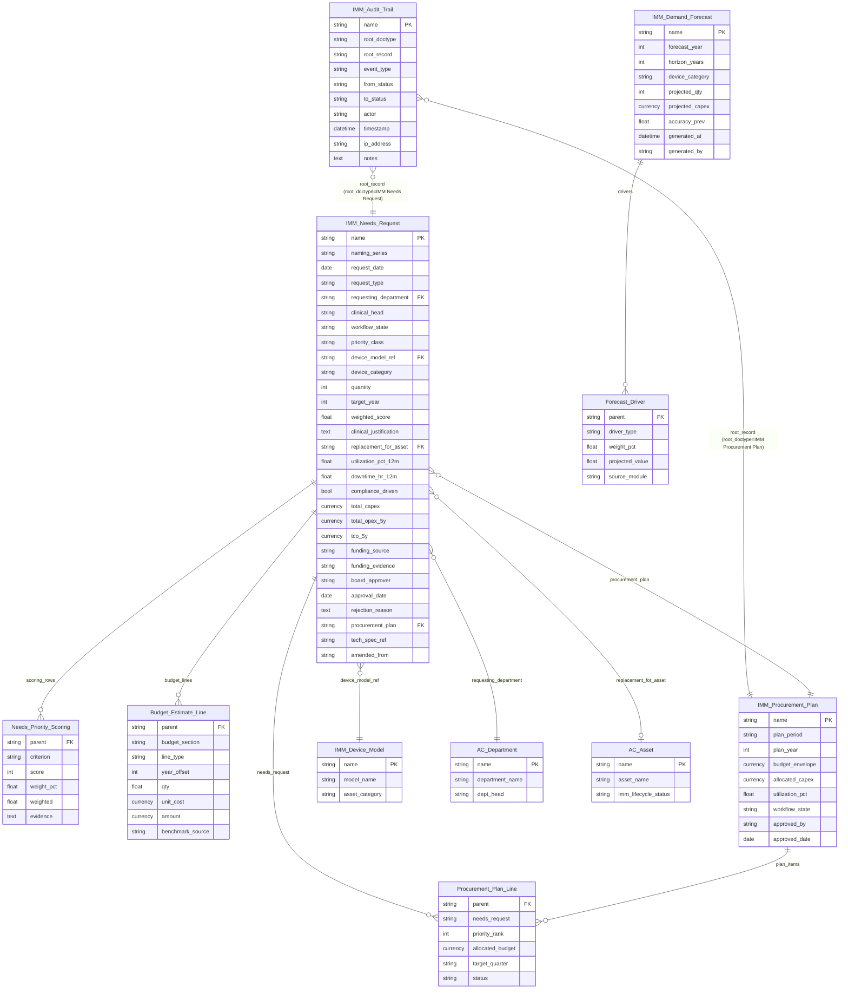
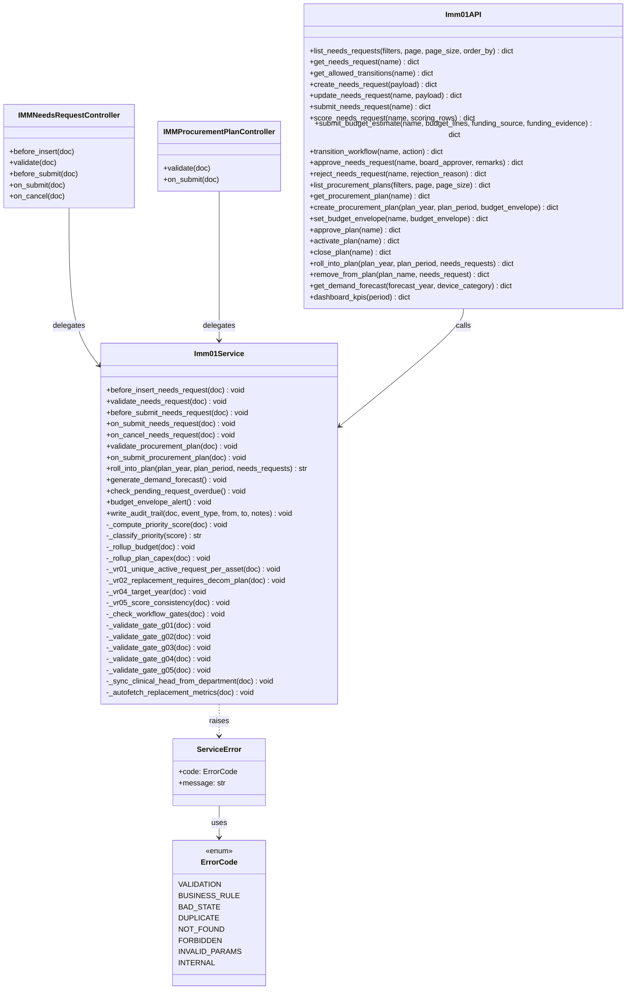
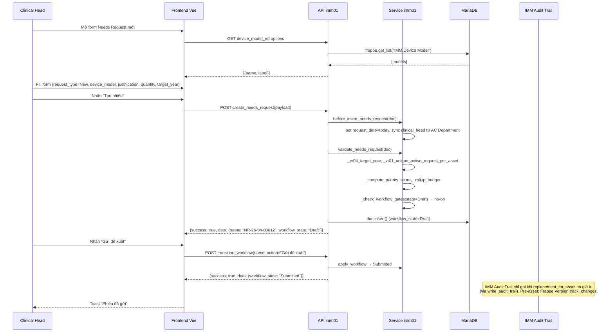
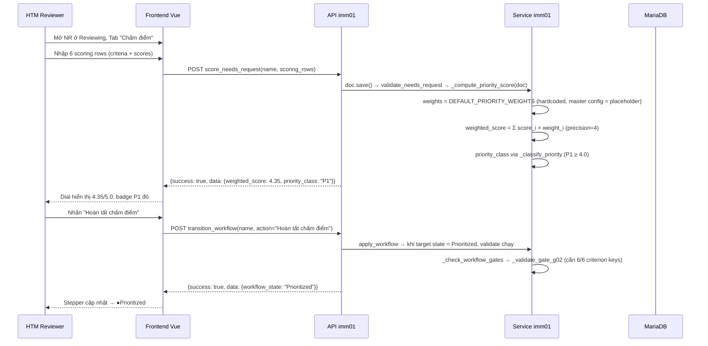
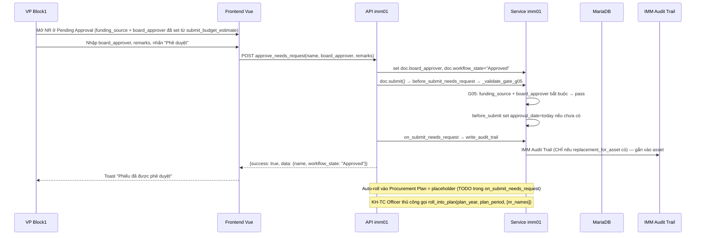

# 03 — Diagrams — IMM-01 Đánh giá Nhu cầu & Dự toán

> **Wave 2 — Live.** Các diagram phản ánh code thực tế. Các phần đánh dấu `(planned)` là roadmap chưa wire.

| Mục | Giá trị |
|---|---|
| Module | IMM-01 — Đánh giá nhu cầu và dự toán |
| Cập nhật | 2026-05-14 |
| Liên kết | [02 Analysis](./02_Analysis_Design.md) · [04 Backend](./04_Backend_Design.md) · [05 API](./05_API_Specification.md) |

---

## §I ERD (Entity Relationship Diagram)



---

## §II Class Diagram



---

## §III Sequence Diagrams

### SD-01: Tạo và Submit Needs Request (Happy Path)



### SD-02: Chấm điểm ưu tiên và chuyển Prioritized



### SD-03: BGĐ Approve và Roll into Procurement Plan



---

## §IV Communication Diagram (Cross-module)

```
IMM-01 (Needs Assessment)
    │
    ├── INPUT ← IMM-07 (Performance Tracking)
    │           API: imm07.get_asset_kpi_12m(asset)
    │           Trả về: utilization_pct, downtime_hr_12m
    │
    ├── INPUT ← IMM-13 (Decommission)
    │           API: imm13.get_active_decom_plan(asset)
    │           Trả về: plan_name, status (Pending/Approved)
    │
    ├── INPUT ← IMM-10 (Compliance)
    │           Hook: on_compliance_gap_new → compliance_driven=1
    │
    ├── OUTPUT → IMM-02 (Tech Spec)
    │           API: imm02.draft_from_plan(plan, plan_items)
    │           Trigger: Procurement Plan action "Generate Tech Spec Drafts"
    │
    ├── OUTPUT → IMM-03 (Vendor / PO)
    │           API: imm03.create_vendor_eval_from_plan(plan)
    │           Trigger: Sau khi Tech Spec lock
    │
    ├── OUTPUT → IMM-15 (Spare Parts)
    │           Event: imm01_demand_forecast_published
    │           Payload: {forecast_year, horizon_years, device_category}
    │
    └── OUTPUT → IMM-17 (Predictive)
                Event: imm01_demand_forecast_published
                Payload: {forecast_year, matrix[]}
```

---

## §V Package Diagram (File layout)

```
assetcore/
├── assetcore/
│   ├── doctype/
│   │   ├── imm_needs_request/         ✅
│   │   │   ├── imm_needs_request.json
│   │   │   └── imm_needs_request.py
│   │   ├── imm_procurement_plan/      ✅
│   │   │   ├── imm_procurement_plan.json
│   │   │   └── imm_procurement_plan.py
│   │   ├── imm_demand_forecast/       ✅
│   │   ├── needs_priority_scoring/    ✅ (child)
│   │   ├── budget_estimate_line/      ✅ (child)
│   │   ├── procurement_plan_line/     ✅ (child)
│   │   └── forecast_driver/           ✅ (child)
│   └── workflow/
│       ├── imm_01_needs_workflow.json ✅
│       └── imm_01_plan_workflow.json  ✅
├── services/
│   └── imm01.py                       ✅ (~500 LOC)
├── api/
│   └── imm01.py                       ✅ (~430 LOC, 22 endpoints)
├── patches/v3_1/
│   └── 001_install_imm01.py           ✅ (idempotent — workflow upsert)
└── tests/
    └── test_imm01.py                  ✅ (scoring + classification — `TestPriorityClassification`, `TestComputePriorityScore`)

frontend/src/
├── views/needs/                       ✅ (5 files)
│   ├── NeedsRequestListView.vue
│   ├── NeedsRequestCreateView.vue
│   ├── NeedsRequestDetailView.vue
│   ├── ProcurementPlanListView.vue
│   └── ProcurementPlanDetailView.vue
├── stores/
│   └── imm01.ts                       ✅
├── api/
│   └── imm01.ts                       ✅
└── types/
    └── imm01.ts                       ✅
```

> Dashboard view chuyên biệt `Imm01Dashboard.vue` chưa tách riêng — `dashboard_kpis` được hiển thị ngay trên `NeedsRequestListView.vue` (xem 06 §I). Demand Forecast heatmap = roadmap.
