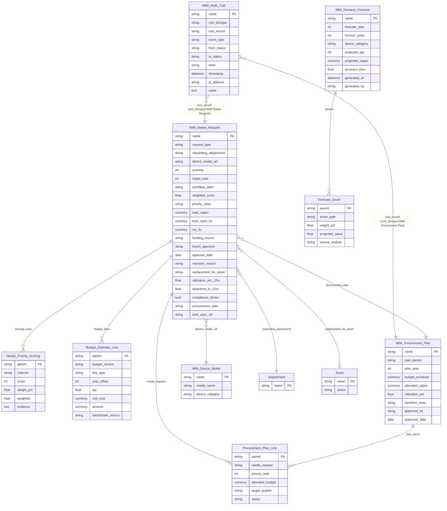
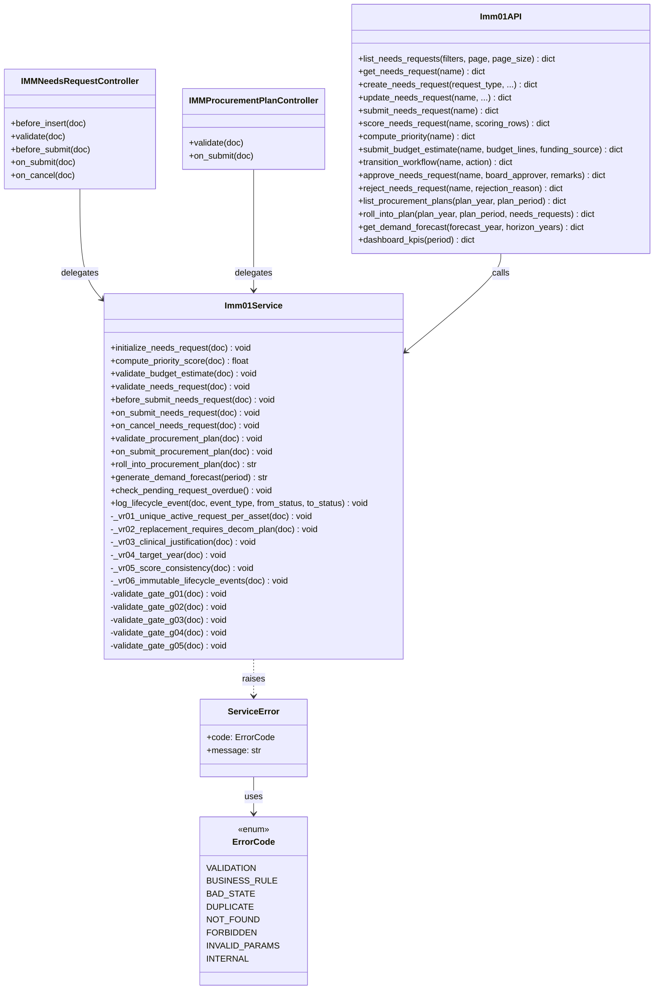
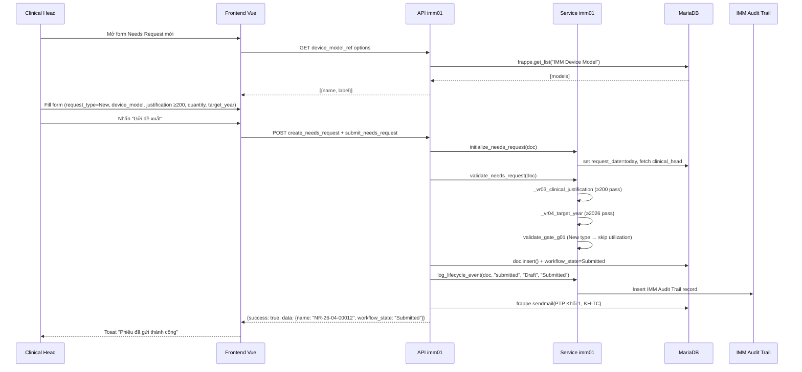
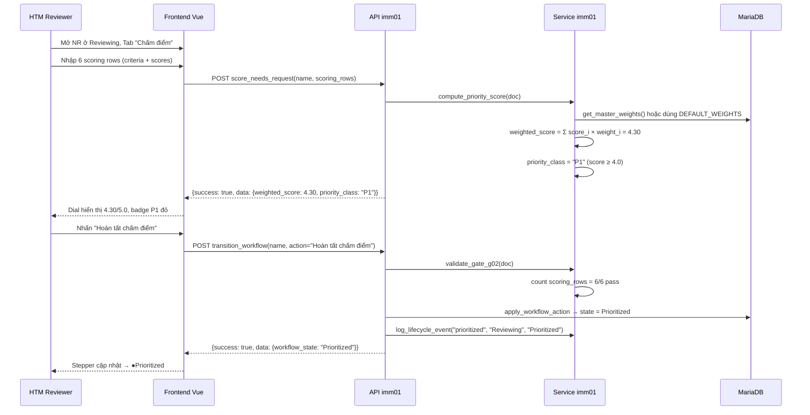
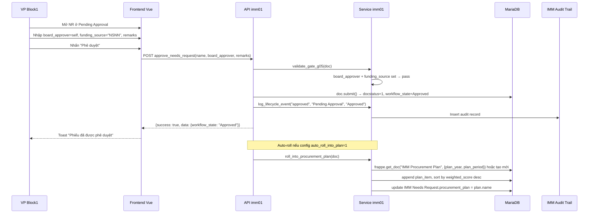

# 03 — Diagrams — IMM-01 Đánh giá Nhu cầu & Dự toán

> ⚠️ Pending implementation — Wave 2. Các diagram dưới đây là thiết kế dự kiến, chưa có code.

| Mục | Giá trị |
|---|---|
| Module | IMM-01 — Đánh giá nhu cầu và dự toán |
| Liên kết | [02 Analysis](./02_Analysis_Design.md) · [04 Backend](./04_Backend_Design.md) · [05 API](./05_API_Specification.md) |

---

## §I ERD (Entity Relationship Diagram)



---

## §II Class Diagram



---

## §III Sequence Diagrams

### SD-01: Tạo và Submit Needs Request (Happy Path)



### SD-02: Chấm điểm ưu tiên và chuyển Prioritized



### SD-03: BGĐ Approve và Roll into Procurement Plan



---

## §IV Communication Diagram (Cross-module)

```
IMM-01 (Needs Assessment)
    │
    ├── INPUT ← IMM-07 (Performance Tracking)
    │           API: imm07.get_asset_kpi_12m(asset)
    │           Trả về: utilization_pct, downtime_hr_12m
    │
    ├── INPUT ← IMM-13 (Decommission)
    │           API: imm13.get_active_decom_plan(asset)
    │           Trả về: plan_name, status (Pending/Approved)
    │
    ├── INPUT ← IMM-10 (Compliance)
    │           Hook: on_compliance_gap_new → compliance_driven=1
    │
    ├── OUTPUT → IMM-02 (Tech Spec)
    │           API: imm02.draft_from_plan(plan, plan_items)
    │           Trigger: Procurement Plan action "Generate Tech Spec Drafts"
    │
    ├── OUTPUT → IMM-03 (Vendor / PO)
    │           API: imm03.create_vendor_eval_from_plan(plan)
    │           Trigger: Sau khi Tech Spec lock
    │
    ├── OUTPUT → IMM-15 (Spare Parts)
    │           Event: imm01_demand_forecast_published
    │           Payload: {forecast_year, horizon_years, device_category}
    │
    └── OUTPUT → IMM-17 (Predictive)
                Event: imm01_demand_forecast_published
                Payload: {forecast_year, matrix[]}
```

---

## §V Package Diagram (File layout)

```
assetcore/
├── assetcore/
│   ├── doctype/
│   │   ├── imm_needs_request/         ⚠️ PLANNED
│   │   │   ├── imm_needs_request.json
│   │   │   ├── imm_needs_request.py
│   │   │   └── test_imm_needs_request.py
│   │   ├── imm_procurement_plan/      ⚠️ PLANNED
│   │   │   ├── imm_procurement_plan.json
│   │   │   └── imm_procurement_plan.py
│   │   ├── imm_demand_forecast/       ⚠️ PLANNED
│   │   ├── needs_priority_scoring/    ⚠️ PLANNED (child)
│   │   ├── budget_estimate_line/      ⚠️ PLANNED (child)
│   │   ├── procurement_plan_line/     ⚠️ PLANNED (child)
│   │   └── forecast_driver/           ⚠️ PLANNED (child)
│   └── workflow/
│       └── imm_01_needs_workflow.json ⚠️ PLANNED
├── services/
│   └── imm01.py                       ⚠️ PLANNED
├── api/
│   └── imm01.py                       ⚠️ PLANNED
├── tasks_imm01.py                     ⚠️ PLANNED
└── tests/
    ├── test_imm01_service.py          ⚠️ PLANNED
    ├── test_imm_needs_request.py      ⚠️ PLANNED
    ├── test_imm01_workflow.py         ⚠️ PLANNED
    └── test_imm01_api.py              ⚠️ PLANNED

frontend/src/
├── views/imm01/
│   ├── NeedsRequestList.vue           ⚠️ PLANNED
│   ├── NeedsRequestCreate.vue         ⚠️ PLANNED
│   ├── NeedsRequestDetail.vue         ⚠️ PLANNED
│   ├── ProcurementPlanList.vue        ⚠️ PLANNED
│   ├── ProcurementPlanDetail.vue      ⚠️ PLANNED
│   ├── DemandForecastView.vue         ⚠️ PLANNED
│   └── Imm01Dashboard.vue             ⚠️ PLANNED
├── stores/
│   └── imm01.ts                       ⚠️ PLANNED
└── api/
    └── imm01.ts                       ⚠️ PLANNED
```
