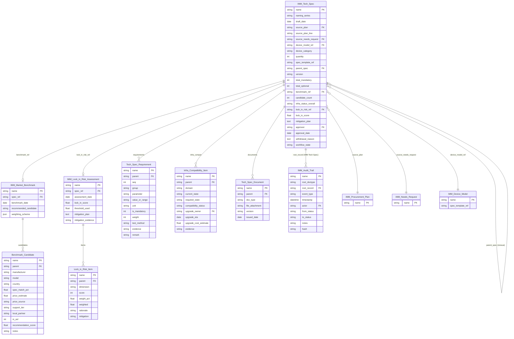
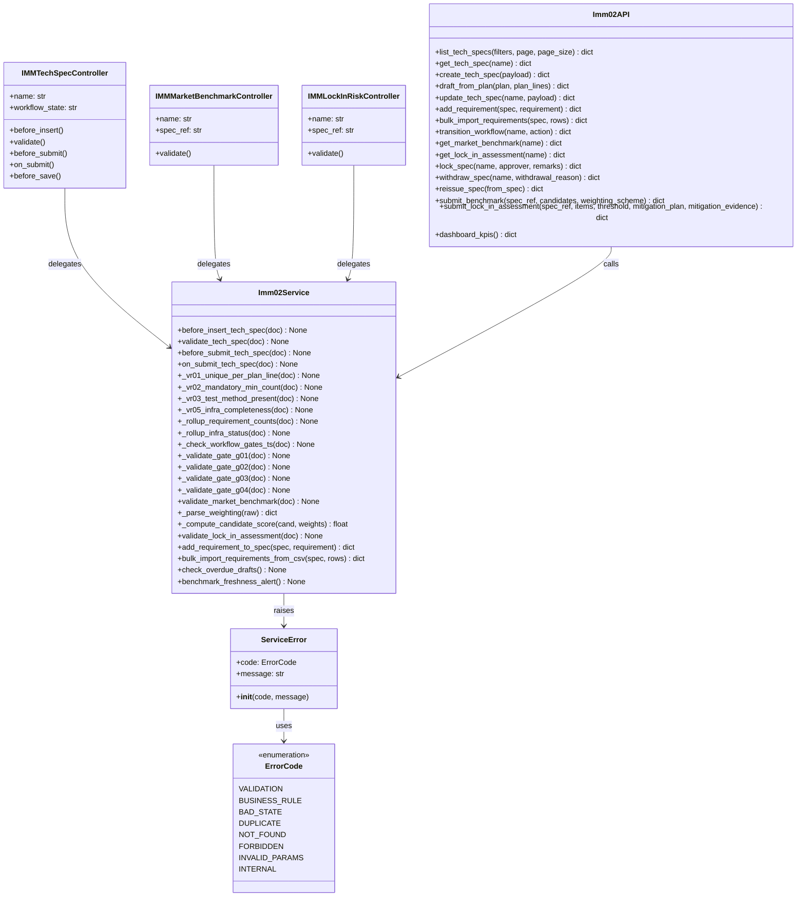

# IMM-02 — Sơ đồ Kiến trúc (Diagrams)

> **Wave 2 — Live.** Diagrams được verify lại theo DocType JSON, workflow JSON và source code thực tế.

| Mục | Giá trị |
|---|---|
| Module | **IMM-02 — Thông số Kỹ thuật & Phân tích Thị trường** |
| Phiên bản | 1.0.1 |
| Ngày cập nhật | 2026-05-14 |
| Owner | Tech Lead |
| Liên kết | [02 Analysis Design](./02_Analysis_Design.md) · [04 Backend Design](./04_Backend_Design.md) |

---

# Phần I — Entity Relationship Diagram (ERD)



---

# Phần II — Class Diagram



---

# Phần III — Sequence Diagrams

## SD-01: Tạo Tech Spec từ Procurement Plan

```
KH-TC Officer    Imm02API        Imm02Service     Frappe DB       IMM-01
     │               │                │                │               │
     │─draft_from_plan(plan, lines)──►│                │               │
     │               │─validate PP exists──────────────►               │
     │               │◄─PP doc────────────────────────────             │
     │               │─draft_from_plan()──►            │               │
     │               │                │─_vr01 check─────►              │
     │               │                │◄─no conflict──────             │
     │               │                │─get Device Model──►            │
     │               │                │◄─spec_template_ref─            │
     │               │                │─create Tech Spec───►           │
     │               │                │─seed_default_requirements()    │
     │               │                │─insert()────────────►          │
     │               │                │─log_lifecycle_event()──►       │
     │               │                │─update plan_line status────────►│
     │               │◄─{success, created:[TS names]}──               │
     │◄─response─────│                │                │               │
```

## SD-02: Gate G01 — Gửi Rà Soát (Draft → Reviewing)

```
HTM Engineer     Imm02API        Imm02Service     Frappe WF
     │               │                │                │
     │─transition(G01 action)────────►│                │
     │               │─validate_tech_spec()──►         │
     │               │                │─_vr02 mandatory ≥1 ✓          │
     │               │                │─_vr03 test_method ✓           │
     │               │─validate_gate_g01()──►          │
     │               │                │─count mandatory────►           │
     │               │                │  < 8? → ServiceError(BUSINESS_RULE)
     │               │                │  ≥ 8? continue                │
     │               │                │─check test_method 100%──►     │
     │               │                │  missing? → ServiceError      │
     │               │─apply_workflow("Gửi rà soát")──►│               │
     │               │                │◄─state=Reviewing──             │
     │               │─log_lifecycle_event("Reviewing")───►            │
     │◄─{success, data:{state: "Reviewing"}}                           │
```

## SD-03: Lock Spec + Trigger IMM-03

```
VP Block1        Imm02API        Imm02Service     Frappe DB    IMM-03 Service
     │               │                │                │               │
     │─lock_spec(name)───────────────►│                │               │
     │               │─before_submit_tech_spec()──►    │               │
     │               │                │─validate_gate_g04()──►         │
     │               │                │─lock_in_score check──►         │
     │               │                │  > threshold + no mit? → Error │
     │               │─frappe.submit()─────────────────►               │
     │               │─lock_spec() on_submit──────►    │               │
     │               │                │─set Locked state──►            │
     │               │                │─log audit trail───►            │
     │               │                │─publish_realtime "imm02_spec_locked"────►
     │               │                │                │          seed Vendor Eval
     │               │                │─update IMM-01 plan_line status─►
     │               │                │─create IMM-10 Risk entry (if high lock-in)
     │◄─{success, data:{state: "Locked"}}                              │
```

---

# Phần IV — Communication Diagram (Cross-Module)

```
                        IMM-02 Tech Spec
                               │
          ┌────────────────────┼────────────────────┐
          │                    │                    │
          ▼                    ▼                    ▼
    IMM-01 Plan          IMM-04 Prep          IMM-10 Risk
    (Input trigger)    (Infra upgrade tasks) (Lock-in register)
    plan_line link     Need Major Upgrade     lock_in_score > threshold
          │                    │                    │
          │             IMM-03 Vendor         IMM-17 Predictive
          │             (Output trigger)      (Market data mart)
          │             imm02_spec_locked     benchmark export
          │
    IMM Device Model
    (spec_template_ref seed)

Cross-module calls:
─────────────────────────────────────────────────────────────────
IMM-01 → IMM-02:  draft_from_plan() triggered by PP.on_submit
IMM-02 → IMM-01:  set plan_line.status = "In Procurement" after Lock
IMM-02 → IMM-03:  publish_realtime("imm02_spec_locked") → seed vendor eval
IMM-02 → IMM-04:  auto-create IMM-04 Prep Item when infra "Need Upgrade"
IMM-02 → IMM-10:  create Risk Register entry when lock_in_score > threshold
IMM-02 → IMM-17:  export benchmark data to market trend data mart
```

---

# Phần V — Package Diagram (File Layout)

```
assetcore/                                    ✅ Live (Wave 2)
├── assetcore/
│   ├── doctype/
│   │   ├── imm_tech_spec/
│   │   │   ├── imm_tech_spec.json
│   │   │   └── imm_tech_spec.py              (controller — delegate sang services.imm02)
│   │   ├── imm_market_benchmark/
│   │   │   ├── imm_market_benchmark.json
│   │   │   └── imm_market_benchmark.py
│   │   ├── imm_lock_in_risk_assessment/
│   │   │   ├── imm_lock_in_risk_assessment.json
│   │   │   └── imm_lock_in_risk_assessment.py
│   │   ├── tech_spec_requirement/            (child)
│   │   ├── tech_spec_document/               (child)
│   │   ├── benchmark_candidate/              (child)
│   │   ├── infra_compatibility_item/         (child)
│   │   └── lock_in_risk_item/                (child)
│   └── workflow/
│       └── imm_02_spec_workflow.json         (7 states, 9 transitions)
├── services/
│   └── imm02.py                              (validators, gates, rollup, scheduler)
├── api/
│   └── imm02.py                              (16 whitelisted endpoints)
├── tests/
│   └── test_imm02.py                         (7 TestClass — rollup, gates, scoring, lock-in)
└── patches/
    └── v3_1/
        └── 002_install_imm02.py              (reload doctypes + upsert workflow, idempotent)

frontend/src/
├── views/tech-specs/
│   ├── TechSpecListView.vue
│   ├── TechSpecCreateView.vue
│   └── TechSpecDetailView.vue
├── stores/
│   └── imm02.ts                              (Pinia: fetchList, fetchOne, fetchKpis, transition, lock, withdraw, reissue)
├── api/
│   └── imm02.ts                              (16 wrappers tương ứng api/imm02.py)
└── types/
    └── imm02.ts                              (TechSpec, BenchmarkCandidate, LockInRiskAssessment, ...)
```

> Chưa có Vue riêng cho `MarketBenchmarkDetail`, `LockInRiskDetail`, `Imm02Dashboard` — các thao tác này được embed trong `TechSpecDetailView.vue` hoặc gọi API trực tiếp.
