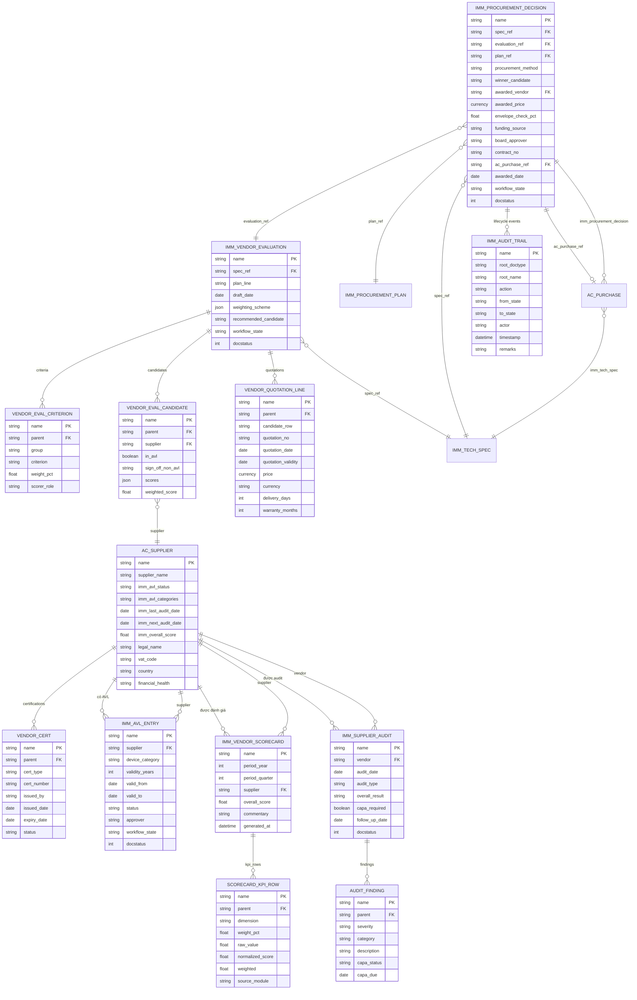
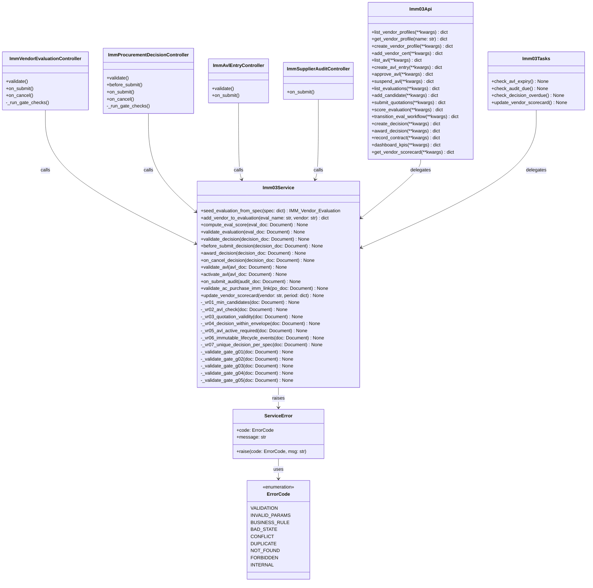

# 03 — Sơ đồ kỹ thuật — IMM-03 Đánh giá Nhà cung cấp & Quyết định Mua sắm

> ✅ Module LIVE — Wave 2. Backend và Frontend đã triển khai.

| Thuộc tính | Giá trị |
|---|---|
| Module | IMM-03 — Vendor Evaluation & Procurement Decision |
| Phiên bản | 0.1.0 |
| Ngày | 2026-05-08 |
| Trạng thái | LIVE — Wave 2 |

---

## I. Entity-Relationship Diagram



---

## II. Class Diagram



---

## III. Sequence Diagrams

### III.1 Luồng Award Decision → Mint AC Purchase

```mermaid
sequenceDiagram
    actor VP as VP Block1
    participant UI as Frontend
    participant API as imm03.py API
    participant SVC as Imm03Service
    participant CTRL as Decision Controller
    participant DB as MariaDB
    participant RT as Frappe Realtime

    VP->>UI: Click "Awarded" trên PD-26-00045
    UI->>API: POST award_decision {name, winner_candidate, awarded_price, ...}
    API->>SVC: validate_decision(doc)
    SVC->>SVC: _vr05_avl_active_required(doc)
    SVC->>SVC: _vr04_decision_within_envelope(doc)
    SVC->>SVC: _validate_gate_g05(doc)
    alt Gate G05 fail
        SVC-->>API: raise ServiceError(BUSINESS_RULE, "G05: Thiếu contract_doc")
        API-->>UI: {success: false, error: "G05...", code: "BUSINESS_RULE"}
    end
    SVC->>CTRL: before_submit_decision(doc)
    CTRL->>DB: frappe.workflow.apply_transition("Awarded")
    CTRL->>SVC: award_decision(doc)
    SVC->>DB: frappe.new_doc("AC Purchase") → insert
    DB-->>SVC: po.name = "AC-PUR-2026-00112"
    SVC->>DB: doc.ac_purchase_ref = po.name; doc.save()
    SVC->>DB: write_audit_trail(doc, "PO Created", ...)
    SVC->>DB: update_plan_line_status(plan_ref, plan_line, "Awarded")
    SVC->>RT: frappe.publish_realtime("imm03_decision_awarded", {...})
    RT-->>UI: event imm03_decision_awarded
    API-->>UI: {success: true, data: {ac_purchase_ref: "AC-PUR-2026-00112", envelope_check_pct: 80.0}}
    UI->>VP: Toast "Awarded — PO AC-PUR-2026-00112 đã tạo"
```

### III.2 Luồng AVL Approval

```mermaid
sequenceDiagram
    actor PROCUREMENT as ĐT-HĐ-NCC Officer
    actor VP as VP Block1
    participant API as imm03.py API
    participant SVC as Imm03Service
    participant DB as MariaDB
    participant SCHED as Scheduler (Daily)

    PROCUREMENT->>API: POST create_avl_entry {vendor, device_category, validity_years, valid_from}
    API->>SVC: validate_avl(doc)
    SVC->>DB: insert AVL Entry (status=Draft)
    API-->>PROCUREMENT: {success: true, data: {name: "AVL-2026-00045"}}

    VP->>API: POST approve_avl {name, approver, approval_doc}
    API->>SVC: activate_avl(doc)
    SVC->>DB: doc.status = "Approved"
    SVC->>DB: doc.valid_to = valid_from + validity_years (years)
    SVC->>DB: AC_Supplier.imm_avl_status = "Approved"
    SVC->>DB: AC_Supplier.imm_avl_categories += device_category
    DB-->>SVC: saved
    API-->>VP: {success: true, data: {name: "AVL-2026-00045", valid_to: "2028-04-30"}}

    Note over SCHED,DB: Scheduler daily check_avl_expiry()
    SCHED->>DB: SELECT * FROM imm_avl_entry WHERE valid_to <= today
    DB-->>SCHED: [AVL-2026-00045 (if expired)]
    SCHED->>DB: avl.status = "Expired"; supplier.imm_avl_status update
    SCHED->>DB: frappe.sendmail(ĐT-HĐ-NCC, "AVL hết hạn")
```

### III.3 Luồng Vendor Evaluation — Scoring

```mermaid
sequenceDiagram
    actor HTM as HTM Engineer
    actor KHTC as KH-TC Officer
    actor QA as QA Risk Team
    participant API as imm03.py API
    participant SVC as Imm03Service
    participant DB as MariaDB

    Note over HTM,DB: Evaluation VE-26-00120 ở state Quotation Received

    HTM->>API: POST score_evaluation {name, scorer_role: "HTM", scores_by_candidate: {...}}
    API->>SVC: validate scorer_role vs criteria.group
    SVC->>DB: update candidate.scores (Technical criteria)
    SVC->>SVC: compute_eval_score(eval_doc) — partial
    DB-->>API: partial weighted scores

    KHTC->>API: POST score_evaluation {name, scorer_role: "KH-TC", scores_by_candidate: {...}}
    SVC->>DB: update candidate.scores (Commercial criteria)

    QA->>API: POST score_evaluation {name, scorer_role: "QA Risk", scores_by_candidate: {...}}
    SVC->>DB: update candidate.scores (Compliance criteria)
    SVC->>SVC: compute_eval_score(eval_doc) — all 5 groups complete
    SVC->>DB: eval_doc.recommended_candidate = top_candidate.name

    HTM->>API: POST transition_eval_workflow {name, action: "Hoàn tất chấm điểm"}
    API->>SVC: _validate_gate_g01(doc)
    alt G01 fail — Compliance chưa đủ
        SVC-->>API: raise ServiceError(BUSINESS_RULE, "G01: Thiếu scoring nhóm Compliance")
        API-->>HTM: {success: false, error: "G01:..."}
    else G01 pass
        SVC->>DB: workflow_state = "Evaluated"; docstatus = 1
        API-->>HTM: {success: true, data: {recommended: "abc123", weighted_score: 4.32}}
    end
```

---

## IV. Communication Diagram (Cross-module)

```
┌──────────────────────────────────────────────────────────────────────┐
│                     IMM-03 Cross-module Dependencies                 │
└──────────────────────────────────────────────────────────────────────┘

  IMM-02 (Tech Spec)
    │  [event] imm02_spec_locked → seed_evaluation_from_spec()
    └──────────────────────────────────► IMM-03 Vendor Evaluation (Draft)

  IMM-01 (Procurement Plan)
    │  [data] plan_line.allocated_budget → envelope check (VR-04)
    │  [write] update plan_line.status = "Awarded" on award_decision()
    └──────────────────────────────────► IMM-03 Procurement Decision

  IMM-03 Procurement Decision (Awarded)
    │  [event] imm03_decision_awarded → commissioning prep
    └──────────────────────────────────► IMM-04 (Commissioning)

  IMM-03 AC Purchase (minted)
    │  [link] imm_procurement_decision back-reference
    └──────────────────────────────────► AC Purchase (Wave 1 DocType)

  IMM-04 (Commissioning feedback)
    │  [data] delivery KPI, quality rejection → scorecard Delivery + Quality
    └──────────────────────────────────► IMM-03 Vendor Scorecard (quarterly)

  IMM-09 (Repair)
    │  [data] MTTR, response time per vendor → scorecard After-sales
    └──────────────────────────────────► IMM-03 Vendor Scorecard (quarterly)

  IMM-15 (Spare Parts)
    │  [data] spare fill rate, lead time per vendor → scorecard Spare
    └──────────────────────────────────► IMM-03 Vendor Scorecard (quarterly)

  IMM-10 (Compliance)
    │  [data] NC count, recall, FSCA per vendor → scorecard Compliance
    └──────────────────────────────────► IMM-03 Vendor Scorecard (quarterly)

  IMM-16 (Compliance Monitoring)
    │  [data] read Vendor Scorecard → compliance risk dashboard
    └──────────────────────────────────► IMM-03 (read-only dependency)

  AC Supplier (Wave 1)
    │  [extend] custom fields imm_avl_status/categories/score patch
    └──────────────────────────────────► IMM-03 (enriches, does NOT replace)
```

---

## V. Package Diagram

```
assetcore/
│
├── api/
│   └── imm03.py                   ← 18 whitelisted endpoints
│                                     (list_vendor_profiles, create_vendor_profile,
│                                      create_avl_entry, approve_avl, suspend_avl,
│                                      add_candidate, submit_quotations,
│                                      score_evaluation, transition_eval_workflow,
│                                      create_decision, award_decision,
│                                      record_contract, dashboard_kpis,
│                                      get_vendor_scorecard, ...)
│
├── services/
│   └── imm03.py                   ← Business logic (NO logic in controller)
│                                     (VR-01..07, Gate G01..G05,
│                                      award_decision, compute_eval_score,
│                                      update_vendor_scorecard, check_avl_expiry)
│
├── tasks_imm03.py                 ← Scheduler jobs
│                                     (check_avl_expiry — daily)
│                                     (check_audit_due — daily)
│                                     (check_decision_overdue — daily)
│                                     (update_vendor_scorecard — cron quarterly)
│
├── assetcore/
│   ├── doctype/
│   │   ├── imm_vendor_evaluation/
│   │   │   ├── imm_vendor_evaluation.json
│   │   │   └── imm_vendor_evaluation.py   ← thin controller
│   │   ├── imm_procurement_decision/
│   │   │   ├── imm_procurement_decision.json
│   │   │   └── imm_procurement_decision.py
│   │   ├── imm_avl_entry/
│   │   │   ├── imm_avl_entry.json
│   │   │   └── imm_avl_entry.py
│   │   ├── imm_vendor_scorecard/
│   │   │   ├── imm_vendor_scorecard.json
│   │   │   └── imm_vendor_scorecard.py
│   │   ├── imm_supplier_audit/
│   │   │   ├── imm_supplier_audit.json
│   │   │   └── imm_supplier_audit.py
│   │   └── [child doctypes]/
│   │       ├── vendor_eval_criterion.json
│   │       ├── vendor_eval_candidate.json
│   │       ├── vendor_quotation_line.json
│   │       ├── vendor_cert.json
│   │       ├── audit_finding.json
│   │       └── scorecard_kpi_row.json
│   │
│   ├── workflow/
│   │   ├── imm_03_vendor_eval_workflow.json     ← 5 states
│   │   ├── imm_03_decision_workflow.json         ← 9 states
│   │   └── imm_03_avl_workflow.json              ← 4 states
│   │
│   └── custom/
│       ├── custom_field_ac_supplier_imm03.json   ← imm_avl_*, certifications
│       └── custom_field_ac_purchase_imm03.json   ← imm_procurement_decision, imm_tech_spec
│
├── patches/
│   ├── v0_1_0/
│   │   ├── create_imm03_doctypes.py
│   │   ├── add_supplier_imm_fields.py
│   │   ├── add_po_imm_fields.py
│   │   ├── install_imm03_workflows.py
│   │   ├── seed_eval_criteria_default.py
│   │   └── seed_procurement_method_config.py
│
└── tests/
    └── test_imm03.py               ← Unit + integration tests
```
