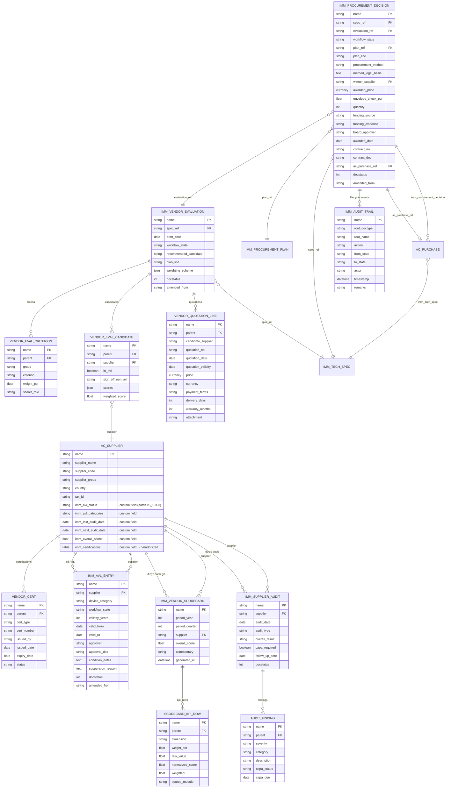
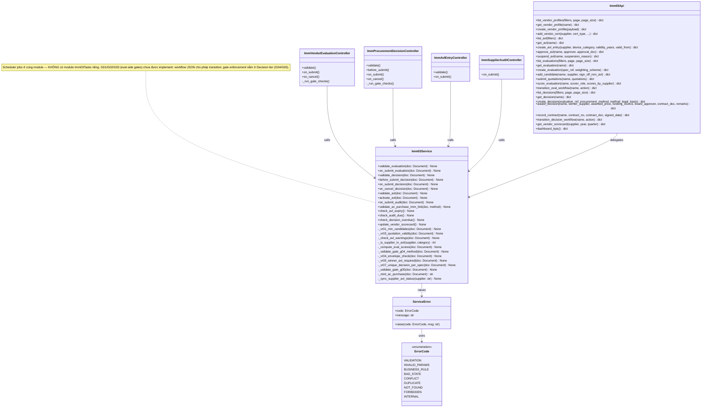
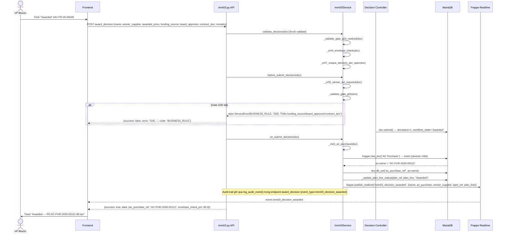

# 03 — Sơ đồ kỹ thuật — IMM-03 Đánh giá Nhà cung cấp & Quyết định Mua sắm

> ✅ Module LIVE — Wave 2. Backend và Frontend đã triển khai.

| Thuộc tính | Giá trị |
|---|---|
| Module | IMM-03 — Vendor Evaluation & Procurement Decision |
| Phiên bản | 0.1.0 |
| Ngày | 2026-05-14 |
| Trạng thái | LIVE — Wave 2 |

---

## I. Entity-Relationship Diagram



---

## II. Class Diagram



---

## III. Sequence Diagrams

### III.1 Luồng Award Decision → Mint AC Purchase



### III.2 Luồng AVL Approval

```mermaid
sequenceDiagram
    actor PROCUREMENT as ĐT-HĐ-NCC Officer
    actor VP as VP Block1
    participant API as imm03.py API
    participant SVC as Imm03Service
    participant DB as MariaDB
    participant SCHED as Scheduler (Daily)

    PROCUREMENT->>API: POST create_avl_entry {supplier, device_category, validity_years, valid_from}
    API->>SVC: validate_avl(doc) [auto-compute valid_to]
    SVC->>DB: insert AVL Entry (workflow_state=Draft, docstatus=0)
    API-->>PROCUREMENT: {success: true, data: {name: "AVL-2026-00045", valid_to: "2028-04-30"}}

    VP->>API: POST approve_avl {name, approver, approval_doc}
    API->>SVC: _approve_avl: doc.workflow_state="Approved"; doc.submit()
    SVC->>SVC: activate_avl(doc) [on_submit hook]
    SVC->>SVC: _sync_supplier_avl_status(supplier)
    SVC->>DB: db.set_value AC Supplier.imm_avl_status, imm_avl_categories
    DB-->>SVC: saved (docstatus=1)
    API-->>VP: {success: true, data: {name: "AVL-2026-00045", workflow_state: "Approved"}}

    Note over SCHED,DB: Scheduler daily check_avl_expiry()
    SCHED->>DB: SELECT name,supplier FROM tabIMM AVL Entry WHERE docstatus=1 AND workflow_state IN ('Approved','Conditional') AND valid_to < CURDATE()
    DB-->>SCHED: [AVL-2026-00045]
    SCHED->>DB: db.set_value workflow_state="Expired" (bypass re-submit)
    SCHED->>SVC: _sync_supplier_avl_status(supplier)
    Note over SCHED: V1: chỉ update state; chưa wire frappe.sendmail cho cảnh báo 60/30d (TODO)
```

### III.3 Luồng Vendor Evaluation — Scoring

```mermaid
sequenceDiagram
    actor HTM as HTM Engineer
    actor KHTC as KH-TC Officer
    actor QA as QA Risk Team
    participant API as imm03.py API
    participant SVC as Imm03Service
    participant DB as MariaDB

    Note over HTM,DB: Evaluation VE-26-00120 ở state Quotation Received

    HTM->>API: POST score_evaluation {name, scorer_role: "HTM", scores_by_supplier: {supplier_name: {criterion: score}}}
    API->>SVC: _score_evaluation: merge scores vào candidate.scores (JSON)
    SVC->>DB: ve.save() → trigger validate_evaluation → _compute_eval_scores
    DB-->>API: partial weighted_scores + recommended_candidate

    KHTC->>API: POST score_evaluation {name, scorer_role: "KH-TC", scores_by_supplier: {...}}
    SVC->>DB: merge Commercial scores; recompute weighted

    QA->>API: POST score_evaluation {name, scorer_role: "QA Risk", scores_by_supplier: {...}}
    SVC->>DB: merge Compliance scores; recompute weighted; set recommended_candidate = top supplier name

    HTM->>API: POST transition_eval_workflow {name, action: "Hoàn tất chấm điểm"}
    API->>DB: frappe.model.workflow.apply_workflow(doc, action)
    Note over SVC: V1: gate enforcement Eval-side (G01/G02) chưa implement trong service; workflow JSON cho phép transition. Gate Decision-side (G04/G05) được enforce ở Decision tier.
    DB-->>API: workflow_state="Evaluated", docstatus=1
    API->>SVC: log_audit_event(event_type=imm03_eval_workflow_transition)
    API-->>HTM: {success: true, data: {workflow_state: "Evaluated", docstatus: 1}}
```

---

## IV. Communication Diagram (Cross-module)

```
┌──────────────────────────────────────────────────────────────────────┐
│                     IMM-03 Cross-module Dependencies                 │
└──────────────────────────────────────────────────────────────────────┘

  IMM-02 (Tech Spec)
    │  [data] spec_ref pull-mode (V1: KHÔNG có event listener)
    │  create_evaluation(spec_ref) → đọc IMM Tech Spec.device_category, source_plan, source_plan_line, quantity
    └──────────────────────────────────► IMM-03 Vendor Evaluation (Draft)

  IMM-01 (Procurement Plan)
    │  [data] plan_line.allocated_budget → envelope check (VR-04)
    │  [write] update plan_line.status = "Awarded" on award_decision()
    └──────────────────────────────────► IMM-03 Procurement Decision

  IMM-03 Procurement Decision (Awarded)
    │  [event] imm03_decision_awarded → commissioning prep
    └──────────────────────────────────► IMM-04 (Commissioning)

  IMM-03 AC Purchase (minted)
    │  [link] imm_procurement_decision back-reference
    └──────────────────────────────────► AC Purchase (Wave 1 DocType)

  IMM-04 (Commissioning feedback)
    │  [data] delivery KPI, quality rejection → scorecard Delivery + Quality
    └──────────────────────────────────► IMM-03 Vendor Scorecard (quarterly)

  IMM-09 (Repair)
    │  [data] MTTR, response time per vendor → scorecard After-sales
    └──────────────────────────────────► IMM-03 Vendor Scorecard (quarterly)

  IMM-15 (Spare Parts)
    │  [data] spare fill rate, lead time per vendor → scorecard Spare
    └──────────────────────────────────► IMM-03 Vendor Scorecard (quarterly)

  IMM-10 (Compliance)
    │  [data] NC count, recall, FSCA per vendor → scorecard Compliance
    └──────────────────────────────────► IMM-03 Vendor Scorecard (quarterly)

  IMM-16 (Compliance Monitoring)
    │  [data] read Vendor Scorecard → compliance risk dashboard
    └──────────────────────────────────► IMM-03 (read-only dependency)

  AC Supplier (Wave 1)
    │  [extend] custom fields imm_avl_status/categories/score patch
    └──────────────────────────────────► IMM-03 (enriches, does NOT replace)
```

---

## V. Package Diagram

```
assetcore/
│
├── api/
│   └── imm03.py                   ← 22 whitelisted endpoints
│                                     (list_vendor_profiles, create_vendor_profile,
│                                      create_avl_entry, approve_avl, suspend_avl,
│                                      add_candidate, submit_quotations,
│                                      score_evaluation, transition_eval_workflow,
│                                      create_decision, award_decision,
│                                      record_contract, dashboard_kpis,
│                                      get_vendor_scorecard, ...)
│
├── services/
│   └── imm03.py                   ← Business logic (NO logic in controller)
│                                     (VR-01..07, Gate G01..G05,
│                                      award_decision, compute_eval_score,
│                                      update_vendor_scorecard, check_avl_expiry)
│
│                                     (Scheduler jobs gộp ở cùng module:
│                                      check_avl_expiry / check_audit_due /
│                                      check_decision_overdue — daily;
│                                      update_vendor_scorecard — cron `0 2 1 1,4,7,10 *`)
│                                     [KHÔNG có module tasks_imm03.py riêng]
│
├── assetcore/
│   ├── doctype/
│   │   ├── imm_vendor_evaluation/
│   │   │   ├── imm_vendor_evaluation.json
│   │   │   └── imm_vendor_evaluation.py   ← thin controller
│   │   ├── imm_procurement_decision/
│   │   │   ├── imm_procurement_decision.json
│   │   │   └── imm_procurement_decision.py
│   │   ├── imm_avl_entry/
│   │   │   ├── imm_avl_entry.json
│   │   │   └── imm_avl_entry.py
│   │   ├── imm_vendor_scorecard/
│   │   │   ├── imm_vendor_scorecard.json
│   │   │   └── imm_vendor_scorecard.py
│   │   ├── imm_supplier_audit/
│   │   │   ├── imm_supplier_audit.json
│   │   │   └── imm_supplier_audit.py
│   │   └── [child doctypes]/
│   │       ├── vendor_eval_criterion.json
│   │       ├── vendor_eval_candidate.json
│   │       ├── vendor_quotation_line.json
│   │       ├── vendor_cert.json
│   │       ├── audit_finding.json
│   │       └── scorecard_kpi_row.json
│   │
│   ├── workflow/
│   │   ├── imm_03_vendor_eval_workflow.json     ← 5 states (Draft, Open RFQ, Quotation Received, Evaluated, Cancelled)
│   │   ├── imm_03_decision_workflow.json         ← 9 states (Draft→Method Selected→Negotiation→Award Recommended→Pending Approval→Awarded→Contract Signed→PO Issued + Cancelled)
│   │   └── imm_03_avl_workflow.json              ← 5 states (Draft, Approved, Conditional, Suspended, Expired)
│
├── patches/
│   └── v3_1/
│       └── 003_install_imm03.py                  ← Bootstrap: reload DocTypes + AC Supplier/AC Purchase custom fields (qua create_custom_fields) + upsert 3 Workflow
│
└── tests/
    └── test_imm03.py                              ← Unit tests (TestParseWeighting, TestParseJsonField, TestComputeEvalScores, TestGateG04Method, TestMethodRules)
```
