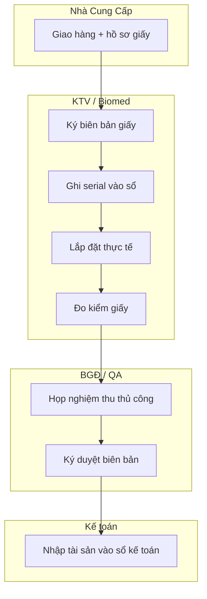
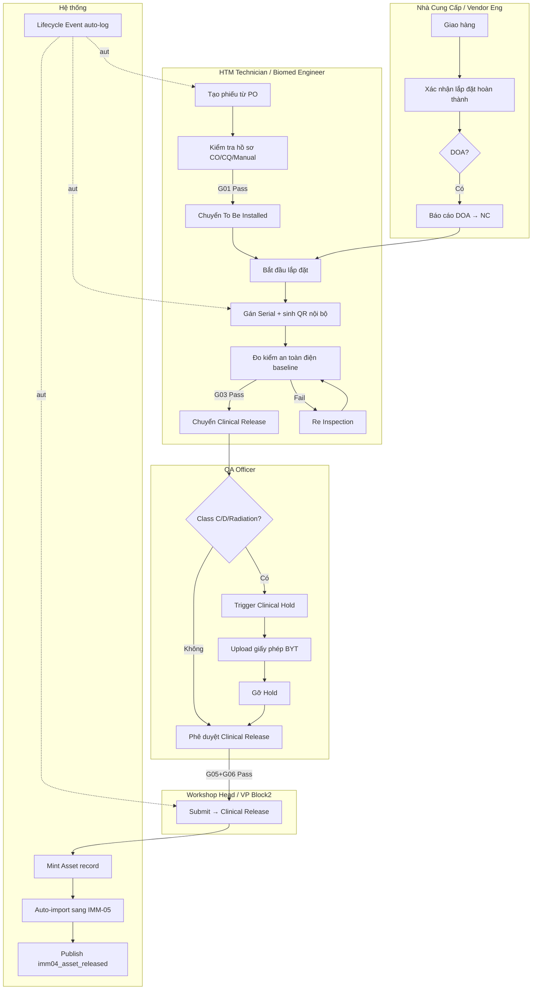
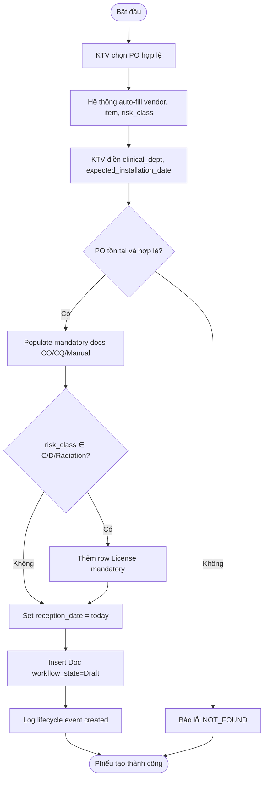
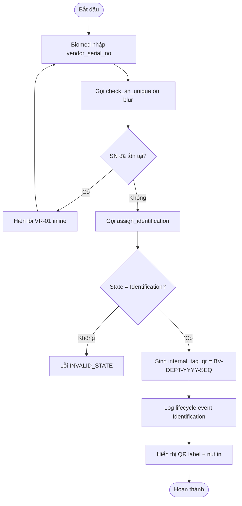
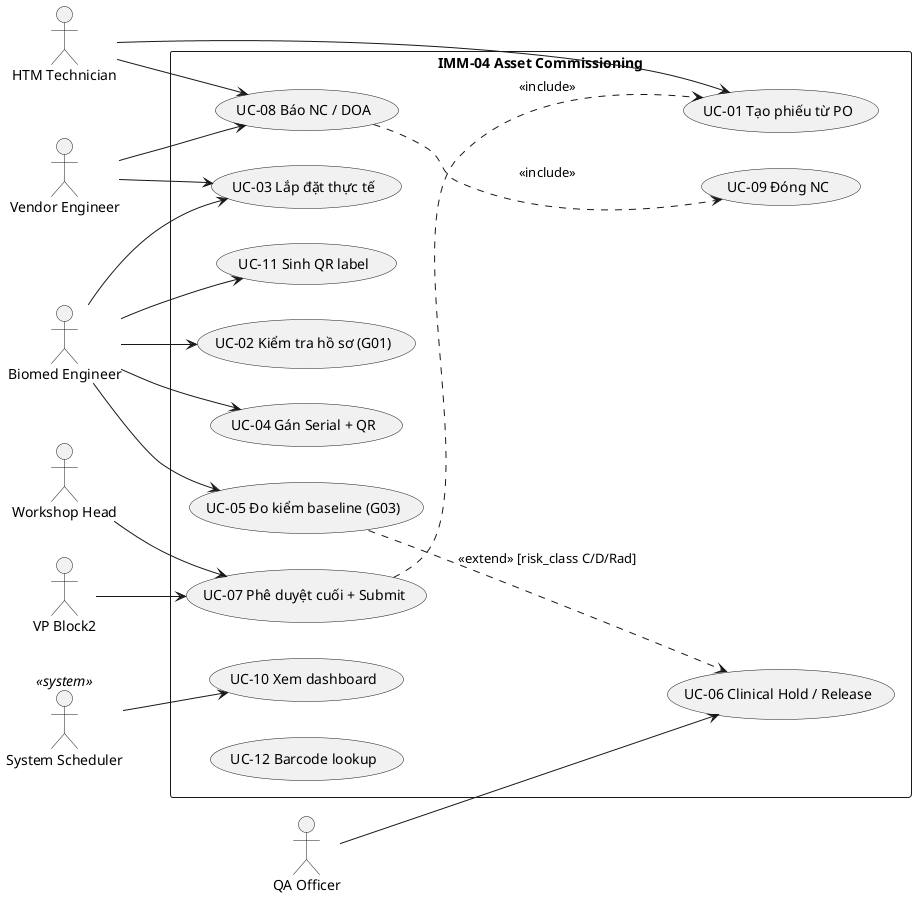
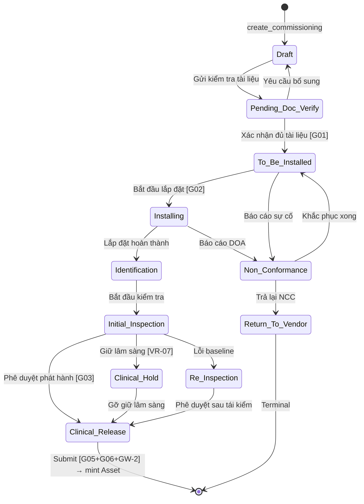

# 02 — Phân tích thiết kế nghiệp vụ (Analysis & Design)

| Mục | Giá trị |
|---|---|
| Module | IMM-04 — Lắp đặt, Định danh & Kiểm tra Ban đầu |
| Phạm vi | Per-module |
| Owner | BA + System Analyst |
| Liên kết | 03 Diagrams · 04 Backend · 05 API · 06 Frontend |

> **Mục đích**: Phân tích nghiệp vụ end-to-end — module overview, quy trình BPMN, use case UML, functional specs (user stories + AC + business rules). Đây là hợp đồng giữa BA và Dev.

---

# Phần I — Module Overview

## I.0. Khảo sát hiện trạng

**As-Is — Trước khi có hệ thống:** Tại phần lớn bệnh viện Việt Nam, quá trình lắp đặt và nghiệm thu thiết bị y tế được thực hiện qua sổ giấy, file Excel hoặc email rời rạc. KTV nhận máy từ kho vật tư, tự photo hồ sơ CO/CQ, ghi số serial bằng tay vào sổ tài sản. Không có quy trình định danh nội bộ chuẩn hóa (mã QR / mã nội bộ). Kết quả đo kiểm an toàn điện ghi vào biên bản giấy, dễ thất lạc. Thiếu gate kiểm soát bắt buộc trước khi thiết bị đưa vào sử dụng lâm sàng — Class C/D không nhất thiết qua QA sign-off.

**Hạn chế chính:** (1) Không audit trail — không biết ai đã phê duyệt gì, khi nào. (2) Không ràng buộc pháp lý tự động — thiết bị bức xạ vào vận hành mà chưa có giấy phép. (3) Serial number không kiểm tra unique — trùng lặp phát sinh gây nhầm lẫn tài sản. (4) Không có kết nối sang hệ thống tài chính / bảo trì — asset record phải nhập tay sau đó.

## I.1. Pitch

IMM-04 là **deployment gateway** bắt buộc trong vòng đời thiết bị y tế tại AssetCore. Mọi thiết bị từ khi nhận hàng từ nhà cung cấp đều phải đi qua pipeline 11 bước: tiếp nhận → kiểm tra hồ sơ → lắp đặt → định danh (QR + serial) → đo kiểm an toàn điện → kiểm duyệt lâm sàng → phê duyệt BGĐ → tạo Asset chính thức. Không có phiếu IMM-04 ở trạng thái `Clinical Release` thì thiết bị không được phép sử dụng và không có bản ghi Asset trên hệ thống — đảm bảo 100% traceability từ ngày đầu.

## I.2. Vị trí trong WHO HTM lifecycle

| Phase | Có liên quan? | Ghi chú |
|---|---|---|
| Needs Assessment | — | Đầu vào từ IMM-01/02 |
| Procurement | ✅ INPUT | Nhận PO từ IMM-03 (`po_reference`) |
| Installation & Commissioning | ✅ CORE | Toàn bộ pipeline lắp đặt, định danh, kiểm tra |
| Operation | ✅ OUTPUT | Tạo Asset record, auto-import sang IMM-05 |
| Maintenance | ✅ OUTPUT | `fire_release_event` trigger IMM-08 PM schedule |
| Decommission | — | Asset record được tạo ở đây, kết thúc ở IMM-13 |

IMM-04 nhận input từ **IMM-03** (PO), sản xuất output cho **IMM-05** (hồ sơ tài liệu), **IMM-08** (lịch PM), và toàn bộ các module operation thông qua `Asset` record.

## I.3. Stakeholders & Actors

| Vai trò | Người dùng thực | Quan tâm chính | Tần suất | Loại |
|---|---|---|---|---|
| HTM Technician | KTV HTM phòng kỹ thuật | Tạo phiếu nhanh, điền đủ hồ sơ | Hàng tuần | Primary |
| Biomed Engineer | Kỹ sư Biomedical | Gán serial/QR, đo kiểm baseline | Hàng tuần | Primary |
| Vendor Engineer | KTV NCC (Philips, GE…) | Xác nhận lắp đặt, khai báo DOA | Theo dự án | Primary |
| QA Officer | Tổ HC-QLCL | Cấp phép bức xạ, Clinical Hold | Khi có thiết bị nguy cơ cao | Approver |
| Workshop Head | Trưởng phân xưởng | Submit/Cancel, quản lý overdue | Hàng tuần | Approver |
| VP Block2 | Phó Trưởng Khối 2 | Ký duyệt cuối, nhận báo cáo | Theo sự vụ | Approver |
| CMMS Admin | IT/CMMS | Override workflow, cấu hình | Khi cần | Secondary |
| Purchase User | Kế toán tài sản | Nhận thông báo kích hoạt khấu hao | Passive | Secondary |
| System Auditor | Kiểm toán nội bộ / BYT | Xem lịch sử bất biến, kiểm tra compliance | Định kỳ | Auditor |

## I.4. Scope

**In-scope:**
- DocType `Asset Commissioning` + 4 child tables + `Asset QA Non Conformance`
- Workflow 11 states + 22 transitions + 6 Gates (G01–G06) + 7 Validation Rules (VR-01 → VR-07)
- 31 REST endpoint (`assetcore/api/imm04.py`) — bao gồm gate status, approval flow, purchase linkage
- Auto-mint `Asset` record khi Submit (`mint_core_asset`)
- Auto-import sang IMM-05 (`create_initial_document_set`)
- GW-2 compliance gate (BR-07)
- Sinh QR data nội bộ (`BV-{DEPT}-{YYYY}-{SEQ}`)
- Dashboard KPIs, scheduler cảnh báo phiếu overdue

**Out-of-scope:**
- PM Schedule auto-create (IMM-08 — `fire_release_event` đã bắn, listener chưa cài)
- PDF Print Format Biên bản Bàn giao (stub trả URL)
- QR label PDF template server-side
- Auto-detect Clinical Hold sau Initial Inspection (QA Officer trigger thủ công)
- SLA email tự động (dashboard hiện overdue)

**Assumptions:**
- PO từ IMM-03 đã tồn tại và hợp lệ trước khi tạo phiếu
- `Item.custom_risk_class` và `Item.custom_is_radiation` đã được điền trên master data
- Role và User Permission đã được cấu hình đúng trước khi go-live

**Dependencies:**
- IMM-03 (Purchase Order): `po_reference` Link
- ERPNext Asset DocType: custom fields `custom_vendor_serial`, `custom_internal_qr`, `custom_comm_ref`
- IMM-05 (Asset Document): GW-2 gate query
- IMM-08 (PM Schedule): listener chưa implement
- Frappe Workflow Engine, `frappe.publish_realtime`

## I.5. KPI mục tiêu

| KPI | Định nghĩa | Baseline | Target | Đo ở đâu |
|---|---|---|---|---|
| KPI-04-01: Tỷ lệ phiếu hoàn thành đúng hạn | % phiếu đạt Clinical Release trong `OVERDUE_DAYS`=30 ngày từ `reception_date` (anchor chốt — xem BR-04-10) | Không đo được (As-Is) | ≥ 85% | `get_dashboard_stats().kpis.overdue_sla` = `count(overdue_commissioning_filter())` |
| KPI-04-02: Tỷ lệ serial không trùng | % phiếu vào Identification mà `vendor_serial_no` unique ngay lần đầu | N/A | 100% | VR-01 block count |
| KPI-04-03: Tỷ lệ baseline test Pass lần đầu | % phiếu Initial Inspection không cần Re Inspection | Không đo được | ≥ 90% | Lifecycle event counter |
| KPI-04-04: Thời gian xử lý trung bình | Trung bình ngày từ Draft → Clinical Release | ~15 ngày (ước tính) | ≤ 10 ngày | Calculated field |
| KPI-04-05: % audit trail đầy đủ | Phiếu có đủ lifecycle event cho mọi transition | 0% (sổ giấy) | 100% | VR-06 + lifecycle_events count |
| KPI-04-06: Throughput bàn giao tháng ("Bàn giao tháng này") | Số phiếu đạt Clinical Release (docstatus=1) có `commissioning_date` trong tháng hiện tại (anchor chốt = `commissioning_date`, KHÔNG `modified` — xem BR-04-11) | *(Cần khảo sát baseline)* | — (đo throughput, không có ngưỡng pass/fail) | `get_dashboard_stats().kpis.released_this_month` = `count({workflow_state=Clinical Release, docstatus=1, commissioning_date ∈ [first_day, today]})` |

## I.6. Ràng buộc Compliance

| Quy định | Yêu cầu áp lên module | Doc tham chiếu |
|---|---|---|
| NĐ 98/2021/NĐ-CP | Thiết bị Y tế phải có Chứng nhận ĐK lưu hành trước khi sử dụng lâm sàng (GW-2 gate) | Điều 28-32 |
| NĐ 142/2020/NĐ-CP | Thiết bị bức xạ phải có Giấy phép trước khi đưa vào hoạt động (VR-07, Clinical Hold) | Điều 25-27 |

> ⚠️ **Hai dòng trên là HAI nghĩa vụ ĐỘC LẬP — cấm gộp** (AC-CR-85, xem BR-04-05 + BR-04-17 + `04 §5.7`).
> Nhóm nguy cơ (Class C/D) ⇒ hồ sơ **NĐ98** «Chứng nhận đăng ký lưu hành», gác bởi **GW-2 / BR-04-08** qua IMM-05.
> Phát bức xạ ion hoá ⇒ hồ sơ **NĐ 142/2020** «Giấy phép Cục An toàn Bức xạ Hạt nhân» (`qa_license_doc`), gác bởi **VR-07 / BR-04-05**.
> Bắt một thiết bị Class C/D không phát bức xạ nộp Giấy phép ATBXHN là **đòi giấy tờ không thể tồn tại** ⇒ deadlock, và lối thoát duy nhất của người dùng là nộp **giấy tờ sai** vào hồ sơ pháp lý — tức làm hỏng chính hồ sơ NĐ98 mà hệ thống phải bảo vệ.
| WHO HTM 2025 | Commissioning checklist, document receipt, clinical sign-off bắt buộc | §3.4, §5.1.2 |
| ISO 13485:2016 | Device record phải có audit trail, NC phải closed trước release (G05) | §7.5, §8.3 |
| TT 46/2017/TT-BYT | Đăng ký lưu hành TBYT (Chứng nhận ĐKLH `Active` hoặc Exempt) | Điều 5-7 |

## I.7. Risk & Open questions

**Risk:**

| Risk | Likelihood | Impact | Giảm thiểu |
|---|---|---|---|
| Race condition trên `vendor_serial_no` | Low | Medium | Thêm DB UNIQUE constraint (tech-debt) |
| `mint_core_asset` không rollback khi IMM-05 import fail | Medium | Medium | Wrap try/except + savepoint (tech-debt) |
| PM auto-create không hoạt động (UAT TC-32 FAIL) | High | Medium | Track in backlog; IMM-08 implement listener |
| ~~Mixed naming `Clinical Release` vs `Clinical_Release`~~ ✅ Resolved (Wave-2) | — | — | Workflow JSON + service constants + types đều dùng space. |
| Print Format Biên bản chưa config | Medium | Low | Config Frappe Print Format trước go-live |

**Open questions:**

| Câu hỏi | Owner | Deadline |
|---|---|---|
| IMM-08 listener cho `imm04_asset_released` — sprint nào? | Tech Lead IMM-08 | Sprint 8 |
| ~~Chuẩn hóa `Clinical Release` (space) vs `Clinical_Release` (underscore)~~ ✅ DONE — space là chuẩn duy nhất. | Tech Lead | DONE (Wave-2) |
| PDF Biên bản Bàn giao — cần config Print Format trong Frappe? | Workshop Head + BA | Sprint 7 |

## I.8. Roadmap thực thi

| Sprint | Hạng mục | Owner | Status |
|---|---|---|---|
| Sprint 4 | DocType schema + Workflow 11 states | BE Dev | ✅ DONE |
| Sprint 5 | Service layer VR-01 → VR-07 + Gates G01-G06 | BE Dev | ✅ DONE |
| Sprint 5 | API layer 17 endpoints (nay 31) | BE Dev | ✅ DONE |
| Sprint 6 | Frontend Vue 3 list/detail/form | FE Dev | ✅ DONE |
| Sprint 6 | QR data generation + barcode lookup | BE Dev | ✅ DONE |
| Sprint 7 | Print Format Biên bản Bàn giao | BA + BE Dev | ⚠️ TODO |
| Sprint 7 | Chuẩn hóa workflow state naming | Tech Lead | ⚠️ TODO |
| Sprint 7 | DB UNIQUE constraint cho `vendor_serial_no` | DBA | ⚠️ TODO |
| Sprint 8 | IMM-08 listener `imm04_asset_released` | BE Dev IMM-08 | ❌ TODO |
| Sprint 9 | Rollback transaction `mint_core_asset` | BE Dev | ❌ TODO |

---

# Phần II — Quy trình nghiệp vụ (Business Process / BPMN)

## II.2. As-Is process

Trước khi có IMM-04, bệnh viện tiếp nhận thiết bị theo quy trình thủ công: nhận hàng → ký biên bản giấy → KTV tự ghi sổ serial → lắp đặt → điền form đo kiểm giấy → họp nghiệm thu → nhập tay vào sổ tài sản. Không có gate check bắt buộc, không có audit trail tự động.

## II.3. Pain points

| # | Pain | Tác động |
|---|---|---|
| 1 | Serial number ghi tay dễ nhầm / trùng lặp | Nhầm tài sản, không truy xuất được lịch sử bảo trì |
| 2 | Không gate cho thiết bị bức xạ | Rủi ro pháp lý nghiêm trọng (NĐ 142/2020) |
| 3 | Không audit trail — không biết ai ký gì, khi nào | Không đáp ứng kiểm toán nội bộ / BYT |
| 4 | Hồ sơ CO/CQ/Manual thất lạc sau nghiệm thu | Không có tài liệu khi bảo hành / bảo trì |
| 5 | Tạo tài sản trong hệ thống kế toán phụ thuộc con người | Trễ, sai sót, không đồng bộ |

## II.4. To-Be process (với AssetCore)

## II.5. Decision points

| Điểm | Câu hỏi | Quy tắc |
|---|---|---|
| G01 — Doc gate | CO/CQ/Manual đã đủ? | 100% `is_mandatory=1` docs phải Received hoặc Waived |
| G02 — Facility gate | Cơ sở hạ tầng đạt? | `facility_checklist_pass=1` trước Installing |
| G03 — Baseline gate | Kết quả đo kiểm đạt? | 100% Pass/N/A; nếu Fail → Re Inspection |
| G04 — Giấy phép bức xạ | Thiết bị **có phát bức xạ** không? | ⚠️ **Self-Correction AC-CR-85** (dòng cũ ghi "Class nguy cơ cao? risk_class ∈ {C,D,Radiation}" — chính là chỗ spec **gộp sai 2 domain**, và code đã hiện thực đúng câu sai đó): cổng áp dụng ⟺ `gate_g04_applies(doc)` = `is_radiation_device` ∨ `risk_class == 'Radiation'` → QA phải upload Giấy phép **Cục ATBXHN** (`qa_license_doc`). Class C/D **không** phát bức xạ ⇒ cổng **KHÔNG áp dụng** (nghĩa vụ NĐ98 của chúng do **G/GW-2** gác — xem BR-04-08). Xem BR-04-17 + `04 §5.7` |
| G05 — NC gate | Còn NC chưa đóng? | resolution_status="Open" bất kỳ → block Release |
| G06 — Board approver | Đã chỉ định BGĐ ký? | `board_approver` bắt buộc để **vào** Clinical Release — cấp **atomic** qua `transition_state(…, board_approver=…)` khi transition CR-bound (BR-04-12, gỡ deadlock); giữ 4-mắt NĐ98 (`board_approver` ≠ owner/clinical_head/qa_officer/pending_approver). Thiếu ⇒ ServiceError `IMM04-GATE-G06-APPROVER` (Decision-B HTTP-200), KHÔNG 417 thô. Xem `04 §5.4` |

## II.6. Process metrics

| Metric | Mục tiêu | Đo ở đâu |
|---|---|---|
| Thời gian Draft → Clinical Release | ≤ 10 ngày | `reception_date` → `commissioning_date` |
| % phiếu overdue (>`OVERDUE_DAYS`=30 ngày từ `reception_date`) | ≤ 5% | Dashboard `overdue_sla` = `count(overdue_commissioning_filter())`; drill = `list_commissioning({overdue:1})` (cùng SoT, BR-04-10) |
| % audit trail coverage | 100% | Lifecycle event count per phiếu |
| % baseline pass lần đầu | ≥ 90% | Count Re Inspection occurrences |

## II.7. RACI matrix

| Hoạt động | HTM Tech | Biomed | Vendor Eng | QA Officer | Workshop Head | VP Block2 | CMMS Admin |
|---|---|---|---|---|---|---|---|
| Tạo phiếu từ PO | R | A | — | — | C | — | C |
| Kiểm tra hồ sơ (G01) | R | A | — | — | C | — | — |
| Gán serial/QR | — | R/A | C | — | — | — | — |
| Đo kiểm baseline | — | R/A | C | — | — | — | — |
| Clinical Hold | — | I | — | R/A | C | — | C |
| Upload giấy phép | — | C | — | R/A | — | — | — |
| Phê duyệt cuối | — | — | — | C | R | A | — |
| Submit phiếu | — | — | — | — | R | A | — |
| Kiểm toán | I | I | — | I | I | I | I |

## II.8. Exception flow

**Exception 1 — DOA (Dead-on-Arrival):** KTV phát hiện máy hỏng khi khui hộp ở trạng thái Installing. KTV gọi `report_doa()` → tạo NC với `nc_type=DOA`, severity=Critical → phiếu chuyển Non Conformance → nếu không sửa được → Return To Vendor. NCC phải xác nhận trước khi đóng case.

**Exception 2 — Amend sau Cancel:** Nếu phiếu bị Cancel (chỉ cho phép ở Draft, Non Conformance, Return To Vendor), Workshop Head amend bản mới. Lưu ý: không cancel được nếu `final_asset` đã tồn tại.

**Exception 3 — Risk class change:** Nếu KTV thay đổi `risk_class` sau trạng thái Initial Inspection, hệ thống báo VR-05 warning nhưng không block. QA Officer cần xem xét lại việc có cần Clinical Hold hay không.

## II.9. So sánh As-Is vs To-Be

| Khía cạnh | As-Is | To-Be (AssetCore) |
|---|---|---|
| Audit trail | Sổ giấy, email | Lifecycle Event bất biến, tự động per transition |
| Serial unique | Không kiểm tra | VR-01 enforce cross-table |
| Gate bức xạ | Không có | VR-07 + Clinical Hold + G04 |
| Tạo Asset record | Nhập tay kế toán | Auto-mint on Submit |
| Hồ sơ tài liệu | Thất lạc | Auto-import sang IMM-05 |
| Thời gian xử lý | ~15 ngày (ước tính) | Target ≤ 10 ngày |

## II.10. Activity diagram per UC chính

### UC-04-01: Tạo phiếu từ PO

### UC-04-05: Gán Serial + sinh QR

---

# Phần III — Use Case Specification (UML)

## III.1. Use Case Diagram

### III.1.a. Biểu đồ use case tổng quát

## III.2. Actor catalog

| Actor | Loại | Mô tả | Goal chính |
|---|---|---|---|
| HTM Technician | Primary | KTV phòng kỹ thuật HTM | Tạo và theo dõi phiếu, upload hồ sơ |
| Biomed Engineer | Primary | Kỹ sư Biomedical | Lắp đặt, định danh, đo kiểm |
| Vendor Engineer | Primary | KTV nhà cung cấp | Xác nhận lắp đặt, khai báo DOA |
| QA Officer | Approver | Tổ HC-QLCL | Clinical Hold, cấp phép bức xạ |
| Workshop Head | Approver | Trưởng phân xưởng | Submit, quản lý overdue |
| VP Block2 | Approver | Phó Trưởng Khối 2 | Phê duyệt cuối cùng |
| System Scheduler | System | Frappe scheduler | Check overdue, SLA alert |

## III.3. Use Case Specifications

### UC-01: Tạo phiếu Commissioning từ PO

| Mục | Giá trị |
|---|---|
| ID | UC-IMM04-01 |
| Brief | Tạo phiếu Asset Commissioning mới từ 1 PO hợp lệ |
| Primary actor | HTM Technician / Biomed Engineer |
| Pre-condition | PO tồn tại, user có role HTM Technician hoặc Biomed Engineer |
| Post-condition | Phiếu ở Draft, mandatory docs pre-populated, lifecycle event ghi nhận |
| Trigger | KTV nhấn "Tạo phiếu mới" và chọn PO |

#### Main flow
| Bước | Actor | System |
|---|---|---|
| 1 | Chọn PO từ dropdown | Gọi `get_po_details` auto-fill vendor, item |
| 2 | Điền clinical_dept, expected_installation_date | Validate date không là quá khứ xa |
| 3 | Nhấn Lưu / Tạo | Gọi `create_commissioning`, set `reception_date=today`, populate docs |
| 4 | — | Trả `name = ACC-YY-MM-#####`, `workflow_state=Draft` |
| 5 | — | Log lifecycle event `commissioning_created` |

#### Alternative A1 — PO có nhiều item
- 1a. Hệ thống hiện dropdown chọn item từ PO items list
- 1b. KTV chọn 1 item; phiếu tạo cho item đó

#### Exception E1 — PO không tồn tại
- 3a. Hệ thống trả `NOT_FOUND` — "Không tìm thấy PO. Vui lòng kiểm tra lại."

### UC-04: Gán Serial Number + sinh QR

| Mục | Giá trị |
|---|---|
| ID | UC-IMM04-04 |
| Brief | Biomed Engineer gán vendor serial và sinh mã QR nội bộ |
| Primary actor | Biomed Engineer |
| Pre-condition | Phiếu ở state `Identification` |
| Post-condition | `vendor_serial_no` unique, `internal_tag_qr` được sinh |
| Trigger | Phiếu vào state Identification sau khi lắp đặt xong |

#### Main flow
| Bước | Actor | System |
|---|---|---|
| 1 | Quét barcode hoặc nhập SN | Gọi `check_sn_unique` on-blur |
| 2 | — | Kiểm tra UNIQUE (VR-01) trả `is_unique=true/false` |
| 3 | Nhấn "Xác nhận định danh" | Gọi `assign_identification` |
| 4 | — | Sinh `internal_tag_qr = BV-{DEPT}-{YYYY}-{SEQ}` |
| 5 | — | Log lifecycle event `identification_assigned` |
| 6 | — | Hiển thị nút "Sinh QR label" → `generate_qr_label` |

#### Exception E1 — Serial trùng
- 2a. Hệ thống hiện inline error "VR-01: Serial đã được gán cho phiếu ACC-..."

## III.4. Use Case relationships

**`<<include>>`:**
| Caller UC | Included UC | Lý do |
|---|---|---|
| UC-07 Phê duyệt cuối | UC-01 Tạo phiếu | Phiếu phải tồn tại |
| UC-08 Báo NC/DOA | UC-09 Đóng NC | NC tạo ra phải được đóng |

**`<<extend>>`:**
| Base UC | Extension UC | Điều kiện |
|---|---|---|
| UC-05 Đo kiểm baseline | UC-06 Clinical Hold | risk_class ∈ {C, D, Radiation} |

## III.5. UC ↔ User Story mapping

| Use Case | US ID | Note |
|---|---|---|
| UC-01 | US-04-01 | Tạo từ PO hợp lệ |
| UC-04 | US-04-02 | VR-01 block SN trùng |
| UC-02 (G01) | US-04-03 | Block khi thiếu CO |
| UC-05 (G03) | US-04-04 | Baseline Fail → Re Inspection |
| UC-06 (VR-07) | US-04-05 | Auto Clinical Hold |
| UC-07 (G05+G06) | US-04-06, US-04-07 | Block release + Submit sinh Asset |
| UC-08 (DOA) | US-04-08 | Khai báo DOA |

---

# Phần IV — Functional Specifications

## IV.1. User Stories & Acceptance Criteria

### US-04-01 — Tạo phiếu từ PO
**Là HTM Technician, tôi muốn tạo phiếu nghiệm thu từ PO, để bắt đầu quy trình lắp đặt có kiểm soát.**
- Priority: Must | Estimate: 3 SP

**AC-01 (Given-When-Then):**
- Given: tôi có role HTM Technician, PO-2026-00023 tồn tại
- When: tôi POST `create_commissioning` với `{po_reference, master_item, vendor, clinical_dept, expected_installation_date}`
- Then: response.success=true, data.name khớp `ACC-\d{2}-\d{2}-\d{5}`, workflow_state=Draft, mandatory docs pre-populated

**AC-02:**
- Given: risk_class=C trên Item
- When: phiếu tạo
- Then: row "License" mandatory xuất hiện trong `commissioning_documents`

### US-04-02 — VR-01 block serial trùng
**Là Biomed Engineer, tôi muốn hệ thống cảnh báo ngay khi nhập serial trùng, để tránh nhầm lẫn tài sản.**
- Priority: Must | Estimate: 2 SP

**AC-01:**
- Given: ACC-A đã có `vendor_serial_no = "SN-12345"`
- When: tôi nhập "SN-12345" vào ACC-B và blur khỏi field
- Then: inline error "VR-01: Serial 'SN-12345' đã được gán cho phiếu ACC-A"

**AC-02:**
- Given: SN mới chưa có trong hệ thống
- When: tôi blur
- Then: không có lỗi, field valid

## IV.2. Business Rules

| ID | Rule | Implement ở | Liên kết test |
|---|---|---|---|
| BR-04-01 | Asset chỉ tạo qua `mint_core_asset()` trong `on_submit` | `AssetCommissioning.on_submit()` | TC-04-02 |
| BR-04-02 (G01) | CO/CQ/Manual mandatory phải Received/Waived trước rời Pending Doc Verify | `validate_gate_g01()` | TC-04-05, 06 |
| BR-04-03 (VR-01) | `vendor_serial_no` UNIQUE trên Asset + Commissioning | `_vr01_unique_serial_number()` | TC-04-03, 04 |
| BR-04-04 (G03 — baseline verdict · silent-completion guard) | **Nghiệm thu Initial Inspection chỉ `Pass` khi có phép đo THỰC.** 4 vế: **(a)** 0 phép đo (`results` rỗng AND `baseline_tests` rỗng — hoặc sau upsert 0 row có `test_result`) → **BLOCK** `VALIDATION`, `overall_inspection_result` KHÔNG set `Pass` (đóng auto-Pass câm). **(b)** UPSERT-by-parameter — `result` cho parameter chưa có row → **APPEND row mới** + persist thực (KHÔNG drop câm). ~~**(c)** bất kỳ `test_result=='Fail'` (kể cả row vừa append) → `VALIDATION` liệt kê parameter fail, KHÔNG set `Pass`.~~ **⛔ SUPERSEDED bởi (e) — 2026-07-24** (vế c chặn persist ⇒ **mất bằng chứng KHÔNG ĐẠT** + kẹt `Re Inspection`). **(d)** `overall_inspection_result='Pass'` ⟺ `tests_recorded > 0` (số row THỰC ghi `test_result`, KHÔNG `len(results)` mù). **(e) MỚI — verdict DẪN XUẤT, KHÔNG raise:** sau upsert, `failed_parameters` = danh sách `parameter` của các dòng có `test_result == 'Fail'`; `overall_inspection_result = 'Fail'` nếu `failed_parameters` khác rỗng, ngược lại `'Pass'`. **Luôn `doc.save()`** ⇒ dòng `Fail` (kèm `measured_val` + `fail_note`) **PERSIST**. Endpoint **KHÔNG** đụng `workflow_state`. **(f)** Response **5-key**: `{name, overall_result: 'Pass'\|'Fail', tests_recorded, failed_parameters[], clinical_hold_required}`. Chi tiết + ADR-IMM-04-02 ở `04_Backend_Design.md §5.3`; vế (e)/(f) + ADR-IMM-04-04 ở **§5.5** | `submit_baseline_checklist()` (`services/imm04.py`) | TC-04-15..18 · TC-04-BASELINE-01..06 (07 §III.4b) · TC-04-BLFAIL-01..10 (07 §III.4d) |
| BR-04-13 (G03 — cổng phát hành lâm sàng, structured 422) | **Cổng an toàn KHÔNG nới.** Khi transition đang thực thi có `next_state == Clinical Release` (phủ **cả 3 cạnh**: `Phê duyệt phát hành` từ `Initial Inspection`, `Phê duyệt sau tái kiểm` từ `Re Inspection`, `Gỡ giữ lâm sàng` từ `Clinical Hold`) → chặn nếu **checklist rỗng** HOẶC còn dòng `test_result ∉ {Pass, N/A}`. Raise **TRƯỚC `apply_workflow`** bằng `ServiceError(VALIDATION, http_status=422, message_code='IMM04-GATE-G03-BASELINE', context={'failed': [...]})` ⇒ **HTTP-200 + Error envelope** (Decision-B — `http_status` là field body, KHÔNG status-line), **hết 417 câm**. `workflow_state` + `docstatus` + `board_approver` KHÔNG đổi. **Thứ tự: G03 TRƯỚC G06.** Hook save-time `validate_checklist_completion()` VR-03b giữ nguyên = defense-in-depth. Chi tiết + ADR-IMM-04-05 ở `04_Backend_Design.md §5.5.2` | `transition_state()` (`services/imm04.py`) pre-check | TC-04-BLFAIL-05..08 (07 §III.4d) |
| BR-04-14 (Tái kiểm mở lại được — anti-dead-end) | `submit_baseline_checklist` chấp nhận state ∈ **{`Initial Inspection`, `Re Inspection`}** (bản cũ chỉ `Initial Inspection` ⇒ phiếu vào Tái kiểm là **kẹt vĩnh viễn**, không endpoint nào sửa được `baseline_tests`). UPSERT-by-parameter (BR-04-04b) cho phép **đổi dòng `Fail` → `Pass`** ở lượt đo lại; mọi dòng `Pass`/`N/A` ⇒ `overall_result == 'Pass'`; `workflow_state` giữ `Re Inspection` cho tới khi user bấm `Phê duyệt sau tái kiểm`. Ngoài 2 state trên vẫn raise `INVALID_PARAMS` | `submit_baseline_checklist()` (`services/imm04.py`) | TC-04-BLFAIL-03..04 (07 §III.4d) |
| BR-04-05 (VR-07) | **Thiết bị PHÁT BỨC XẠ** → `qa_license_doc` (Giấy phép Cục ATBXHN) bắt buộc trước Release. ⚠️ **Cải chính AC-CR-85:** rule này gác **hiện tượng vật lý bức xạ** (NĐ 142/2020 Điều 25-27), **KHÔNG** gác nhóm nguy cơ Class C/D — nghĩa vụ hồ sơ của Class C/D là NĐ98 Điều 28-32 («Chứng nhận đăng ký lưu hành») và đã có cổng riêng **BR-04-08 / GW-2**. Việc `check_auto_clinical_hold` bơm `is_radiation_device=1` cho mọi Class C/D là **lỗi thiết kế đã gỡ** (04 §5.7.0) | `validate_radiation_hold()` qua predicate SSoT `gate_g04_applies()` | TC-04-19..21, TC-04-G04-01..12 |
| BR-04-06 (VR-04/G05) | No Open NC trước Release | `validate_gate_g05_g06()` | TC-04-22..24 |
| BR-04-07 (G06) | `board_approver` bắt buộc trước Submit | `validate_gate_g05_g06()` | TC-04-25 |
| BR-04-08 (BR-07/GW-2) | Asset có CN ĐK lưu hành Active hoặc Exempt trước Submit | `_gw2_check_document_compliance()` | TC-04-26 |
| BR-04-09 (Gate 5 ↔ IMM-16) | Commissioning Submit bị block nếu asset có **Critical CAPA mở** — gọi chung `imm16.check_asset_compliance_status()` (SoT `imm00._open_capa_filter`: status NOT IN Closed, gồm `'Overdue'`). Cùng hành vi **invariant dưới cron** với gate WO IMM-08/09 (BR-16-09). Block → `ServiceError(COMPLIANCE_BLOCKED)`. KHÔNG nhân bản predicate inline trong imm04 | `services/imm04.py` commissioning gate → `check_asset_compliance_status()` | *(Cần khảo sát test ID)* |
| BR-04-10 (Overdue SoT — drillable) | "Phiếu quá hạn SLA" định nghĩa bởi **MỘT** predicate duy nhất, dùng chung cho scheduler-alert + KPI count + list drill. **Date-anchor chốt = `reception_date`** (theo KPI-04-01 §I.5 + §II.6 — "trong 30 ngày từ `reception_date`"). Ngưỡng `OVERDUE_DAYS = 30` là **module-constant** (KHÔNG inline literal 30). Helper SoT: `overdue_commissioning_filter(today=None)` trả filter dict `{reception_date < today − OVERDUE_DAYS, workflow_state NOT IN _TERMINAL_STATES, docstatus != 2}`. **INVARIANT đo được:** `get_dashboard_stats().kpis.overdue_sla == list_commissioning({overdue:1}).pagination.total` (card count == drill rows). Self-Correction: KPI code trước đây dùng `expected_installation_date` → **sai anchor** so với Core Doc → hợp nhất về `reception_date` | `overdue_commissioning_filter()` gọi bởi `check_commissioning_overdue()`, `get_dashboard_stats()`, `list_commissioning(overdue=1)` | *(Cần khảo sát test ID — đề xuất TC-04-30..32)* |
| BR-04-11 (Commissioning-date stamp — KPI "Bàn giao tháng này" SoT) | **(a) Stamp:** khi phiếu chuyển sang `Clinical Release` qua **bất kỳ** trong 3 write-path (`transition_state` action→Clinical Release · `submit_commissioning` · `approve_clinical_release`), helper SoT `_stamp_commissioning_date(doc)` set `commissioning_date = nowdate()` (= ngày vào Clinical Release). **Idempotent:** chỉ set khi `commissioning_date` đang NULL — KHÔNG ghi đè giá trị đã có (re-submit/re-approve/edit-sau giữ nguyên ngày commissioning gốc). **(b) KPI re-anchor:** `released_this_month` đếm theo `commissioning_date ∈ [get_first_day(nowdate()), nowdate()]` thay cho `modified` — kill anchor sai: phiếu Released tháng-trước bị edit (sửa note/upload doc) trong tháng này KHÔNG còn bị `modified` kéo vào count. **INVARIANT đo được (SoT-aligned, cùng kiểu BR-04-10):** `released_this_month == count({workflow_state==Clinical Release, docstatus==1, commissioning_date ∈ [first_day, today]})` == số drill list `Clinical Release` lọc cùng cửa sổ tháng. **(c) NULL-safe legacy:** phiếu Clinical Release tồn-tại-trước-fix có `commissioning_date` NULL → bị loại khỏi count cửa sổ tháng (KHÔNG crash, KHÔNG over/under-count ngẫu nhiên qua `modified`); backfill là **optional, ngoài scope** task này. **Self-Correction:** KPI code trước đây đếm theo `modified` → **sai anchor** (re-count phiếu cũ khi edit) → hợp nhất về `commissioning_date` (mirror pattern BR-04-10 đã chuẩn cho `overdue_sla`). KHÔNG schema migration (field `commissioning_date` Date read_only ĐÃ tồn tại trên DocType). | `_stamp_commissioning_date()` gọi bởi `transition_state()`, `submit_commissioning()`, `approve_clinical_release()`; KPI `released_this_month` trong `get_dashboard_stats()` | TC-04-33..38 (xem 07 §commissioningKpi) |
| BR-04-15 (Thẻ cổng G01–G06 nói ĐÚNG cổng thật — display ⟺ enforcement parity · CR-76) | **Thẻ cổng KHÔNG được có logic riêng.** Mỗi cổng CÓ enforcement (**G01 · G03 · G04 · G05 · G06**) hiển thị bằng **CHÍNH predicate** mà server dùng để chặn, trích xuất thành hàm SSoT trong `services/imm04.py` và gọi từ **cả hai** phía: (1) *enforcement* (`validate_gate_g01` · pre-check BR-04-13 trong `transition_state` · `validate_radiation_hold` VR-07 · `validate_gate_g05_g06`), (2) *display* (`evaluate_gate_status` → `api.imm04.get_gate_status`). **Ngữ nghĩa thẻ = BLOCKING-parity**: `gXX == true` nghĩa là "cổng KHÔNG chặn phiếu", **KHÔNG** phải "đã hoàn tất/đã ký". **Bất biến 2 chiều:** `true ⇒ enforcement không raise` **VÀ** `false ⇒ enforcement raise` (xét ở trạng thái mà cổng được gác — xem `04 §5.6.2`). **3 báo oan đã chốt phải hết:** (a) phiếu **0 dòng hồ sơ bắt buộc** ⇒ `g01_docs = true` (trước đây hằng `false` do `all(...) if mandatory else False` — trong khi `validate_gate_g01` CHO QUA); (b) thiếu hồ sơ **NHƯNG** có giải trình hợp lệ (`documents_incomplete=1` ∧ `documents_incomplete_note` không rỗng) ⇒ `g01_docs = true` + khoá **additive** `g01_waived = true` (thẻ phải nói "đạt **có giải trình**", KHÔNG nói "đã xác nhận đủ hồ sơ"); (c) `g03_baseline` tính bằng hằng SSoT `_G03_PASSING` (`services/imm04.py:49`), **cấm literal `("Pass","N/A")` lặp ở tầng api**, baseline rỗng ⇒ `false`. **`g02_facility` là cổng THAM KHẢO** — `facility_checklist_pass` hiện **KHÔNG** có bất kỳ enforcement nào chặn theo nó (verify @source 2026-07-26: 0 hit ngoài card + `_EDITABLE_FIELDS`); UI phải ghi rõ tính chất tham khảo, KHÔNG dùng để gate CTA. Chi tiết + ADR-IMM-04-06 ở `04_Backend_Design.md §5.6` | `gate_g01_blockers()` · `g01_waiver_granted()` · `gate_g03_blockers()` · `gate_g04_ok()` · `_count_open_ncs()` · `gate_g06_ok()` · `evaluate_gate_status()` (`services/imm04.py`) | TC-04-GATE-01..14 (07 §III.4e) |
| BR-04-16 (Quyền đọc thẻ cổng == quyền đọc phiếu — khuôn 3 lớp CR-74) | `get_gate_status` là **bề mặt đọc chi tiết** (bộc lộ tình trạng hồ sơ/đo kiểm/NC/người ký của 1 phiếu) ⇒ phải gác **CÙNG predicate** với `get_form_context`/list, theo khuôn **ROLE → EXISTS → ROW** của ADR-IMM00-DETAIL-READ-02: **L0** `assert_doctype_read_permission("Asset Commissioning")` chạy **TRƯỚC** `exists` (⇒ 0 existence-oracle trên naming-series); **L1** `exists` → `NOT_FOUND` (`MSG.IMM04_NOT_FOUND`, http_status 404 **trong body**); **L2** `assert_can_read_doc("Asset Commissioning", doc)` kích hoạt hook `asset_commissioning_has_permission` (`hooks.py:454`) trên doc ĐÃ load (0 query thêm). Service bọc `@rowscoped` ⇒ `frappe.PermissionError` → Error envelope `{success:false, code:"FORBIDDEN", http_status:403}` **trên HTTP-200** (in-handler cap-403: còn phiên, thiếu quyền ⇒ FE hiển thị thông báo, **KHÔNG logout**; khác dispatcher-403 của guest/hết token). **Payload lỗi TUYỆT ĐỐI không chứa khoá `g01_..g06_`** (không rò tình trạng cổng cho người không được đọc phiếu) | `evaluate_gate_status()` (`services/imm04.py`) + `api/imm04.py::get_gate_status` → `handle()` | TC-04-GATE-15..19 (07 §III.4e) |
| BR-04-24 (Workflow-Surface Integrity — silent-CTA-loss guard, CR-WF-04-SURFACE) | Bề mặt CTA nghiệm thu (`allowed_transitions`) do service `_get_workflow_transitions()` sinh, resolve workflow qua **hằng lookup literal** `"IMM-04 Workflow"` (`services/imm04.py:727`) trong khối `try … except frappe.DoesNotExistError: return []`. Nếu rename workflow (JSON/fixtures), đổi hằng lookup, hoặc drift `_DT` khỏi `document_type` → `get_doc` raise → `return []` **CÂM** → mất toàn bộ CTA nghiệm thu, không test nào bắt. Guard toàn cục `test_workflow_admin_override` **KHÔNG** phủ (nó glob file JSON theo `name` bất kỳ, không kiểm hằng-lookup service). **4 invariant module-local** khoá lỗ: INV-04-WF-1 (resolve + `document_type == _DT`), INV-04-WF-2 (mọi cạnh có `AssetCore Super Admin`), INV-04-WF-3 (live-emit ⊆ file cho phiếu Draft), INV-04-WF-4 (role-nghèo → subset chặt, không false-permissive). Chi tiết + Boundaries + ADR-IMM-04-01 ở `04_Backend_Design.md §3.1`. **Test-only** — 0 chạm runtime, 0 reload/migrate. | Guard test `assetcore.tests.imm04.test_imm04` (`TestImm04WorkflowSurfaceGuard`) — KHÔNG đổi `services/imm04.py:723-736` | TC-04-WF-SURFACE-01..05 (xem 07 §III.4a) |
| BR-04-17 (Cổng G04 gác ĐÚNG 1 domain — predicate SSoT `gate_g04_applies` · AC-CR-85) | **Cổng G04 chỉ áp dụng khi thiết bị THỰC SỰ phát bức xạ.** `gate_g04_applies(doc) ⟺ bool(is_radiation_device) ∨ risk_class == 'Radiation'` — **một** predicate, dùng chung bởi **(1)** enforcement VR-07 (`validate_radiation_hold`), **(2)** verdict `gate_g04_ok = not gate_g04_applies ∨ bool(qa_license_doc)`, **(3)** display `evaluate_gate_status` (khoá additive `g04_applicable`). **Cấm** mọi diễn giải bức xạ thứ hai trong vùng cổng G04 (đo bằng AST, không phải grep — 04 §5.7.3). **Bất biến INV-G04-1 (2 chiều):** `g04_applicable = false` ⇒ `g04_radiation = true` **và** VR-07 KHÔNG BAO GIỜ chặn; `g04_applicable = true` ⇒ `g04_radiation ⟺ bool(qa_license_doc)` **và** VR-07 chặn đúng khi thiếu giấy phép ở `Clinical Release`/`Pending Release` ⇒ advertise == enforce trên ma trận 5 `risk_class` × 2 `qa_license_doc`. **3 trạng thái hiển thị** (client KHÔNG suy từ `is_radiation_device` của payload phiếu): «Không áp dụng» / «Đã có giấy phép» / «Chưa có giấy phép — đang chặn»; hiển thị **«Đạt» khi cổng không áp dụng là CẤM** (khẳng định một hồ sơ pháp lý không thể tồn tại). **Không suy giảm an toàn:** `check_auto_clinical_hold` giữ nguyên giá trị trả về ở **12/12** ô (6 `risk_class` kể cả rỗng × 2 cờ — 04 §5.7.5) ⇒ Clinical Hold routing bất biến. Chi tiết + ADR-IMM-04-08/09 ở `04_Backend_Design.md §5.7`, hợp đồng đọc ở `05 §24.6` | `gate_g04_applies()` · `gate_g04_ok()` · `evaluate_gate_status()` (`services/imm04.py`) · `validate_radiation_hold()` (`asset_commissioning.py`) | TC-04-G04-01..12 (07 §XIII) |
| BR-04-25 (Ô đếm == nhánh drill cho MỌI persona — MỘT ENGINE row-scoped · AC-CR-98 / AC-CR-106) | **Con số người dùng bấm và danh sách họ nhận được phải sinh ra từ CÙNG MỘT predicate, dưới CÙNG MỘT phiên.** Danh sách phiếu nghiệm thu (`list_commissioning`) trước 2026-07-30 đếm bằng `frappe.db.count` và đọc bằng `frappe.get_all` — **cả hai bỏ qua** `permission_query_conditions` (`hooks.py:444`) nên hai con số *khớp nhau* mà **cùng là tổng toàn bảng** ⇒ kỹ thuật viên nhà cung cấp (kiêm `Commissioning User`) đọc được phiếu **ngoài phạm vi** — đây là **rò dữ liệu**, không chỉ lệch số. Sau vòng này: `total` **và** `items` đều qua `frappe.get_list` (SSoT `count_with_or`) ⇒ **áp** row-scope + DocPerm, `total == len(items)` cho **cả 3 persona** (`AssetCore Super Admin` · `Commissioning User` · `Vendor Engineer` + `Commissioning User`). Song song, phạm vi nhà cung cấp là **PHÉP GIAO** chứ không phải phép gán: bộ lọc theo một thiết bị do người dùng bấm từ tab «Bản ghi liên quan» **không bị ghi đè** bởi tập thiết bị được giao; thiết bị ngoài phạm vi ⇒ **0 dòng**, KHÔNG phải "mọi thiết bị của tôi". Dung sai DUY NHẤT được phép giữa ô đếm và nhánh drill: số phiếu **đã hủy** (`docstatus == 2`) mà danh sách tự loại (nợ có tên `AC-CR-99`). Hậu quả nếu sai: quyết định nghiệm thu/bàn giao dựa trên phiếu của cơ sở khác ⇒ vi phạm nguyên tắc phân tách phạm vi nhà cung cấp (NĐ98 — hồ sơ thiết bị phải truy được đúng chủ thể chịu trách nhiệm). Hợp đồng + đại số + acceptance: `../imm-00/ADR-IMM00-LIST-SCOPE.md §10` · BE `04 §11` · FE `06 §11` | `list_commissioning()` (`services/imm04.py:1053`) · `count_with_or()` (`services/shared/filters.py:236`) · `apply_vendor_scope()` (`services/shared/scope.py:150`) · `asset_commissioning_query()` (`permissions.py:137`) | TC-IMM04-SCOPE-01..10 · TC-VSCOPE-01..15 (07 §VIII) · TC-FE-COMM-SE-01..06 (06 §11.4) |
| BR-04-25b (Bất biến ô-đếm==drill áp cho **MỌI SHAPE** predicate, kể cả bộ lọc «Quá hạn» · AC-CR-112) | **Người dùng bấm thẻ «Quá hạn SLA» cũng phải nhận đúng một sự thật như mọi bộ lọc khác.** Bộ lọc «Quá hạn» là **tham số ảo** (`overdue=1`, BR-04-10): server tự dựng điều kiện quá hạn từ SoT rồi **đổi hình dạng** bộ điều kiện (dict → dạng danh sách, để cùng một cột mang được nhiều ràng buộc mà không ghi đè nhau), sau đó mới đi vào **cùng một** đường đếm và đường đọc. Trước 2026-07-30 bất biến `tổng == số dòng` chỉ được chứng minh cho hình dạng **thứ nhất**: mọi kiểm thử của nhánh «Quá hạn» đều chạy dưới **quản trị viên** — vai đọc-tất-cả nên **không** quan sát được sai lệch do giới hạn theo dòng. Hệ quả nếu sai: kỹ thuật viên nhà cung cấp bấm «Quá hạn SLA» có thể đọc **tổng của toàn bảng** (kể cả phiếu ngoài phạm vi) trong khi danh sách chỉ trả phần được phép ⇒ vừa **rò thông tin tồn tại** của phiếu cơ sở khác, vừa khiến báo cáo quá hạn sai (NĐ98 — hồ sơ thiết bị phải truy được đúng chủ thể chịu trách nhiệm). Chốt: bất biến thuộc **hàm**, không thuộc một hình dạng; **mọi** tham số ảo mở nhánh hình dạng mới **bắt buộc** kèm kiểm thử dưới đúng vai bị giới hạn theo dòng, và bộ lọc «Quá hạn» phải **AND** (không ghi đè) với bộ lọc trạng thái do người dùng chọn. Kèm luật chứng minh: **kiểm thử chưa chạy = chưa có bất biến** (phải có bằng chứng chạy + một phép đột biến mã làm kiểm thử đó ĐỎ). Hợp đồng + nghi thức chấm: `../imm-00/ADR-IMM00-LIST-SCOPE.md §11` · BE `04 §11.1` · FE `06 §11.5` | `list_commissioning()` nhánh ảo (`services/imm04.py:1101-1105` → `:1113` → `:1116`) · `count_with_or(filters: dict \| list \| None)` (`services/shared/filters.py:236`) · `overdue_commissioning_filter()` (`services/imm04.py:67`) · `asset_commissioning_query()` (`permissions.py:137`) | TC-IMM04-OVD-01/02 (07 §IX.2) · TC-FE-COMM-SE-07/08 (06 §11.5) · mutation M1–M4 (07 §IX.3) |

## IV.3. State Machine

**Bảng State:**

| State | docstatus | Role chuyển trạng thái | Action button |
|---|---|---|---|
| Draft | 0 | HTM Tech / Biomed / CMMS Admin | Gửi kiểm tra tài liệu |
| Pending Doc Verify | 0 | Biomed Engineer | Xác nhận đủ tài liệu / Trả về Draft |
| To Be Installed | 0 | Biomed / Vendor Eng | Bắt đầu lắp đặt |
| Installing | 0 | Biomed / Vendor Eng | Lắp đặt hoàn thành / Báo DOA |
| Identification | 0 | Biomed Engineer | Bắt đầu kiểm tra |
| Initial Inspection | 0 | Biomed / QA / System Manager | Phê duyệt / Giữ lâm sàng / Báo lỗi |
| Clinical Hold | 0 | QA Officer / CMMS Admin | Gỡ giữ lâm sàng |
| Re Inspection | 0 | Biomed / System Manager | Phê duyệt sau tái kiểm |
| Clinical Release | 1 (submit) | Workshop Head / VP Block2 | Submit → Mint Asset |
| Non Conformance | 0 | Biomed / Workshop Head | Khắc phục / Trả NCC |
| Return To Vendor | 1 | — | Terminal |

## IV.4. Input — Output

**(a) Input fields chính và validation:**

| Field | Type | Required | Validation | Cascade |
|---|---|---|---|---|
| `po_reference` | Link PO | YES | PO tồn tại + không Cancelled | Auto-fill: vendor, master_item |
| `master_item` | Link Item | YES | `is_fixed_asset=1` | Auto-fill: risk_class |
| `vendor` | Link Supplier | YES | Tồn tại | — |
| `clinical_dept` | Link Dept | YES | Active | — |
| `vendor_serial_no` | Data | YES (Identification) | UNIQUE (VR-01) | — |
| `risk_class` | Select A/B/C/D/Radiation | — | Auto-fetch từ Item; warning nếu đổi sau Initial Inspection | Cascade: is_radiation_device, License row |
| `board_approver` | Link User | YES (before Submit) | role = Board / VP Block2 | — |
| `baseline_tests` | Child Table | YES | 100% result điền; Fail → `fail_note` | — |

**(b) Output records:**
- `Asset Commissioning` DocType (auto naming `ACC-YY-MM-#####`)
- `Asset` ERPNext record (khi Submit)
- `Asset Document` × N (auto-import sang IMM-05)
- `Asset Lifecycle Event` rows (immutable)
- `Asset QA Non Conformance` (khi báo NC/DOA)
- Realtime event `imm04_asset_released`

**(c) Notification / side effects:**
- Email Workshop Head khi phiếu overdue >30 ngày (scheduler daily)
- Email QA Officer khi Clinical Hold aging (daily)
- Realtime push Purchase User khi Asset released

## IV.5. Edge cases & Errors

| ID | Edge case | Hành vi mong đợi | Error code (BE) |
|---|---|---|---|
| EC-04-01 | Hai KTV nhập cùng SN trong 1 giây (race condition) | App-layer check VR-01 bắt được; DB UNIQUE (TODO) cần thêm | `VALIDATION` |
| EC-04-02 | Cancel phiếu khi `final_asset` đã tồn tại | Block với message "Không thể Cancel khi Asset đã được tạo" | `BAD_STATE` |
| EC-04-03 | Submit khi `workflow_state` ≠ `"Clinical Release"` | Block với `WRONG_STATE` | `BAD_STATE` |
| EC-04-04 | Upload doc có `expiry_date < today` | Block với VR-DocExpiry message | `VALIDATION` |
| EC-04-05 | Đổi `risk_class` sau Initial Inspection | Warning msgprint (không block) — VR-05 | `BUSINESS_RULE` (cảnh báo) |
| EC-04-06 *(Self-Correction 2026-07-19)* | `submit_baseline_checklist` với **0 phép đo** (`results` rỗng AND `baseline_tests` rỗng — hoặc 0 row nào có `test_result`) | **BLOCK** — raise `VALIDATION` (BR-04-04a); `overall_inspection_result` KHÔNG được set `Pass`. FE cảnh báo "chưa nhập phép đo nào". ⚠️ Spec cũ ghi "*không block submit nếu không có test nào*" = **lỗi thiết kế gốc** đã tạo auto-Pass câm (Pass với 0 đo) — nay ĐẢO lại: 0 đo ⇒ tuyệt đối KHÔNG Pass. | `VALIDATION` |
| EC-04-07 | PO đã được dùng cho phiếu khác (concurrent) | Không block — 1 PO có thể nhiều phiếu (nhiều item) | — |
| EC-04-08 *(UPSERT-by-parameter)* | `result` gửi parameter **chưa có** row trong `baseline_tests` (phiếu tạo KHÔNG pre-seed child, đo phát sinh tại hiện trường) | **UPSERT** — append row mới từ payload (`parameter`+`measured_val`+`test_result`+`fail_note`) + persist; re-get phải thấy row. KHÔNG drop câm (bản cũ chỉ update in-place các row seeded sẵn). | — |
| EC-04-09 *(Self-Correction 2026-07-24 — Fail-path)* | `submit_baseline_checklist` với ≥1 dòng `test_result='Fail'` (kèm `fail_note`) ở `Initial Inspection` | **GHI NHẬN, KHÔNG raise** (BR-04-04e). Sau `doc.reload()`: dòng `Fail` **TỒN TẠI** kèm `measured_val` + `fail_note`; `overall_inspection_result == 'Fail'`; `workflow_state` giữ `Initial Inspection`. ⚠️ Bản cũ raise trước `doc.save()` ⇒ **0 dòng persist** = mất bằng chứng KHÔNG ĐẠT (vi phạm nghĩa vụ lưu hồ sơ incoming inspection). | — (success) |
| EC-04-10 *(Tái kiểm)* | `submit_baseline_checklist` khi `workflow_state == 'Re Inspection'` | **CHO PHÉP** (BR-04-14). Upsert-by-`parameter` đổi dòng `Fail`→`Pass`; khi mọi dòng ∈ {Pass, N/A} ⇒ `overall_result == 'Pass'`. `workflow_state` giữ `Re Inspection`. Bản cũ raise `INVALID_PARAMS` ⇒ dead-end vĩnh viễn. | — (success) |
| EC-04-11 *(Cổng G03 — KHÔNG nới)* | `transition_state` tới `Clinical Release` (bất kỳ 3 cạnh) khi còn dòng `test_result ∉ {Pass, N/A}` | **BLOCK** — `ServiceError(VALIDATION, http_status=422, message_code='IMM04-GATE-G03-BASELINE', context={'failed':[...]})` raise TRƯỚC `apply_workflow`. Envelope Decision-B trên **HTTP-200** (KHÔNG 417). `workflow_state`/`docstatus`/`board_approver` KHÔNG đổi. | `VALIDATION` |
| EC-04-12 *(Checklist rỗng ở cổng G03)* | `transition_state` tới `Clinical Release` khi `baseline_tests` rỗng | **BLOCK** — cùng `message_code='IMM04-GATE-G03-BASELINE'`, `context={'failed': []}`, message dùng nhãn "(chưa có phép đo nào)". | `VALIDATION` |
| EC-04-13 *(residual known — [ROADMAP])* | `transition_state('Báo cáo lỗi baseline')` khi checklist còn dòng **chưa ghi** `test_result`, hoặc dòng `Fail` **thiếu** `fail_note` | Vẫn rơi vào `validate_checklist_completion()` VR-03a → `frappe.throw` ⇒ **417 thô** (ngoài envelope). **Ngoài scope vòng này** (sửa sẽ phá `test_imm04_baseline_silent_completion`, AC5). FE phải chặn ở form (bắt buộc chọn verdict mỗi dòng + ghi chú khi `Fail`). Backlog: chuyển VR-03/VR-03a sang envelope structured. | 417 *(legacy)* |

## IV.6. Out of scope & Open issues

**Out of scope confirm:**
- PM Schedule auto-create → IMM-08
- PDF Print Format Biên bản Bàn giao
- Electronic signature (chữ ký số)

**Open issues:**
- DB UNIQUE constraint cho `vendor_serial_no` (Owner: DBA, Deadline: Sprint 7)
- ~~Chuẩn hóa naming `Clinical Release` vs `Clinical_Release`~~ ✅ DONE (Wave-2 — space là chuẩn duy nhất)

---

# Phần V — Yêu cầu phi chức năng (Non-Functional Requirements)

## V.1. Hiệu năng

| Metric | Target | Đo ở đâu |
|---|---|---|
| Tải form đầy đủ (50+ field, 3 child table) | P95 < 2s | Browser DevTools / Lighthouse |
| `check_sn_unique` on-blur | < 500ms | API response time |
| `get_dashboard_stats` | < 1s | API response time |
| List 100 phiếu với filter | P95 < 1.5s | API response time |
| Scheduler `check_commissioning_overdue` | Chạy trong 5 phút | Frappe scheduler log |

## V.2. Bảo mật

- Authentication: Frappe session cookie + API key (token)
- Authorization: RBAC 3 cấp — Role (HTM Technician / Biomed Engineer…) + DocPerm + workflow allow_edit role
- Audit trail: `lifecycle_events` child table immutable (VR-06), `track_changes=1` trên DocType
- Submit chỉ VP Block2 / Workshop Head (whitelist kiểm tra trong API layer)
- Không lưu patient data trên phiếu này
- CSRF: `X-Frappe-CSRF-Token` cho mọi POST từ browser

## V.3. Khả dụng

| Metric | Target |
|---|---|
| Uptime giờ hành chính | ≥ 99.5% |
| RTO (Recovery Time Objective) | ≤ 4 giờ |
| RPO (Recovery Point Objective) | ≤ 24 giờ (daily backup) |

## V.4. Khả mở rộng

- ≥ 50 user đồng thời không degradation
- Dataset: 10,000 phiếu/site — không ảnh hưởng performance
- Multi-site: 1 codebase, N site độc lập hoàn toàn

## V.5. Khả dụng UX

- WCAG 2.1 AA contrast, keyboard navigation
- Browser: Chrome ≥ 120, Edge ≥ 120, Firefox ≥ 122; Safari ≥ 17 best-effort
- Ngôn ngữ: tiếng Việt primary
- Responsive: desktop-first ≥ 1280px, tablet ≥ 768px
- KTV mới dùng được trong < 30 phút training

## V.6. Bảo trì

- Code coverage: service ≥ 85%, API ≥ 60%
- Mọi public service function có docstring + AC
- Linting: ruff/black 100% pass
- Tech debt budget: ≤ 20% sprint

## V.7. Tuân thủ

- Lifecycle event lưu ≥ 5 năm (NĐ98), không xóa được
- Audit trail truy xuất qua `lifecycle_events` immutable (VR-06)
- Phân tách trách nhiệm: HTM Tech tạo ≠ Workshop Head submit ≠ VP Block2 ký duyệt
- Document control: CO/CQ/Manual phải Received/Waived trước rời Pending Doc Verify (G01)
- Thiết bị bức xạ: Clinical Hold bắt buộc có giấy phép BYT (NĐ 142/2020)

---

## DoD — File 02 hoàn chỉnh

### I. Module Overview
- [x] Khảo sát hiện trạng As-Is + bảng pain points
- [x] Pitch ≤ 5 câu
- [x] Lifecycle phase + position rõ
- [x] ≥ 1 Primary + 1 Auditor stakeholder
- [x] Scope In + Out + Assumption + Dependency
- [x] ≥ 3 KPI có target số
- [x] ≥ 1 ràng buộc compliance

### II. Business Process
- [x] As-Is + ≥ 3 pain point
- [x] To-Be swimlane ≥ 4 lane
- [x] Decision points có quy tắc
- [x] RACI matrix
- [x] ≥ 2 exception flow
- [x] Activity diagram cho UC-01, UC-04

### III. Use Case Spec
- [x] Use case diagram tổng quát
- [x] Actor catalog ≥ 4 actor
- [x] UC-01, UC-04 có textual spec đầy đủ
- [x] ≥ 1 include + ≥ 1 extend

### IV. Functional Specs
- [x] User Stories có ID + AC Given-When-Then
- [x] Business Rules đánh số + nơi implement
- [x] State machine vẽ rõ
- [x] ≥ 5 edge case
- [x] Error code khai báo

### V. Non-Functional Requirements
- [x] 7 nhóm NFR đủ
- [x] Mỗi NFR có target đo được
- [x] Compliance section đối chiếu NĐ98 + WHO HTM
