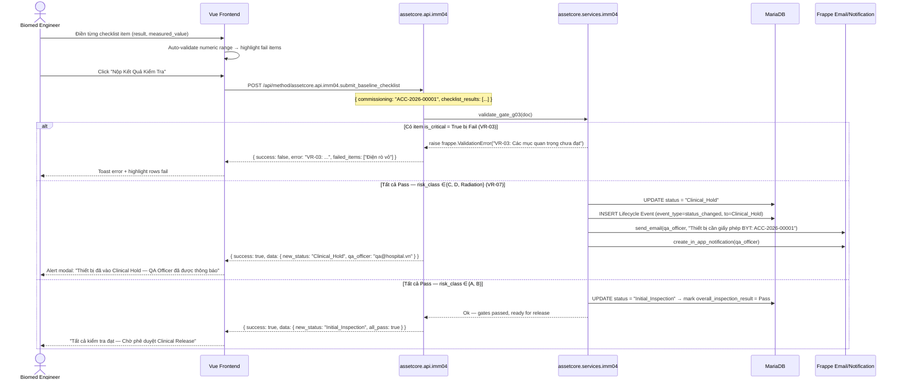
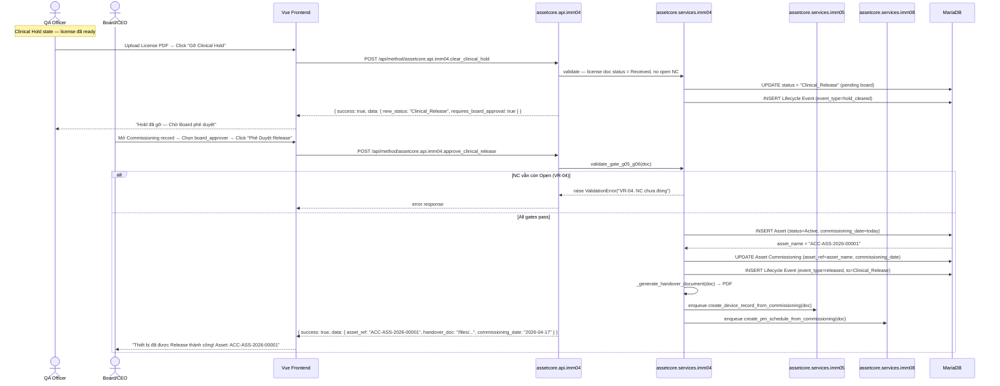

# IMM-04 — API Interface
## Endpoints, Sequence Diagrams & Payload Contracts

**Module:** IMM-04  
**Version:** 1.0  
**Ngày:** 2026-04-17  
**Trạng thái:** Draft

---

## 1. Sequence Diagrams

### 1.1 Tạo Commissioning + Upload Tài Liệu

```mermaid
sequenceDiagram
    actor TBYT as TBYT Officer
    participant UI as Vue Frontend
    participant API as assetcore.api.imm04
    participant SVC as assetcore.services.imm04
    participant DB as MariaDB
    participant FS as Frappe File System

    TBYT->>UI: Chọn PO, Item, Location → Click "Tạo Phiếu"
    UI->>API: POST /api/method/assetcore.api.imm04.create_commissioning
    API->>SVC: initialize_commissioning(doc)
    SVC->>DB: Get Item.risk_class, asset_category
    DB-->>SVC: risk_class = "C", category = "X-Ray"
    SVC->>SVC: _populate_mandatory_documents() → CO, CQ, Manual, License
    SVC->>DB: INSERT Asset Commissioning (status=Draft_Reception)
    DB-->>SVC: name = "ACC-2026-00001"
    SVC->>DB: INSERT Asset Lifecycle Event (event_type=status_changed, to=Draft_Reception)
    API-->>UI: { success: true, data: { name: "ACC-2026-00001", status: "Draft_Reception", documents: [...] } }
    UI-->>TBYT: Redirect → /imm-04/ACC-2026-00001/documents

    TBYT->>UI: Click "Upload CO" → Chọn file
    UI->>API: POST /api/method/assetcore.api.imm04.upload_document
    Note over UI,API: multipart/form-data: { commissioning: "ACC-2026-00001", doc_index: 0, file: <binary> }
    API->>FS: frappe.get_doc("File").save() → /private/files/ACC-2026-00001/co.pdf
    FS-->>API: file_url = "/private/files/..."
    API->>SVC: update_document_record(doc, index=0, status=Received, file_url)
    SVC->>DB: UPDATE Document Record row 0 (status=Received, file_url, uploaded_by, uploaded_at)
    SVC->>DB: INSERT Lifecycle Event (event_type=doc_uploaded, remarks="CO uploaded")
    API-->>UI: { success: true, data: { updated_document: {...}, all_mandatory_received: false } }
    UI-->>TBYT: Document row updated; progress indicator updated
```

---

### 1.2 Baseline Inspection + Gate G03 Check



---

### 1.3 Clinical Release Flow (Board Approval)



---

## 2. Endpoints Table

Tất cả endpoints đều là `@frappe.whitelist()` trong `assetcore/api/imm04.py`.  
Base URL: `/api/method/assetcore.api.imm04.<method_name>`

| Method Name | HTTP | Actor | Description | Key Validations |
|---|---|---|---|---|
| `create_commissioning` | POST | TBYT Officer | Tạo Commissioning record mới từ PO | PO tồn tại; Item is_fixed_asset |
| `get_commissioning_detail` | GET | All (role-filtered) | Lấy toàn bộ chi tiết một Commissioning | Record tồn tại; quyền đọc |
| `get_commissioning_list` | GET | All (role-filtered) | Danh sách với filter và phân trang | |
| `save_commissioning` | POST | TBYT Officer, Biomed | Lưu thay đổi trên form | VR-01, VR-05, VR-06 |
| `upload_document` | POST | TBYT Officer, QA | Upload file tài liệu kèm metadata | File size ≤ 20MB; type PDF/image |
| `assign_identification` | POST | Biomed Engineer | Gán SN + Internal Tag + generate QR | VR-01: unique SN |
| `submit_baseline_checklist` | POST | Biomed Engineer | Nộp kết quả baseline test | VR-03, VR-07; tất cả items phải có result |
| `clear_clinical_hold` | POST | QA Officer | Gỡ Clinical Hold sau khi có giấy phép | License doc status = Received; VR-04 |
| `report_nonconformance` | POST | Vendor Tech, Biomed, TBYT | Tạo NC record | Severity, description bắt buộc |
| `close_nonconformance` | POST | Biomed Engineer, Workshop Manager | Đóng NC với evidence | root_cause + corrective_action bắt buộc |
| `approve_clinical_release` | POST | Board/CEO | Ký duyệt Clinical Release | VR-04 (no open NC); G06 (board_approver) |
| `report_doa` | POST | Vendor Tech, Biomed | Khai báo DOA → chuyển Return_To_Vendor | Severity = Critical; description bắt buộc |
| `check_sn_unique` | GET | Frontend (real-time) | Kiểm tra SN có trùng không | |
| `get_commissioning_stats` | GET | Workshop Manager, PTP | KPI summary dashboard | |
| `generate_handover_pdf` | POST | Biomed Engineer, Clinical Head | Tạo lại Biên Bản Bàn Giao PDF | status = Clinical_Release |

---

## 3. JSON Payloads

### 3.1 `create_commissioning`

**Request:**
```json
{
  "purchase_order": "PO-2026-00023",
  "item_ref": "ITM-XRAY-PHILIPS-001",
  "vendor": "Philips Healthcare VN",
  "location": "Khoa Chẩn Đoán Hình Ảnh",
  "commissioned_by": "biomed.nguyen@hospital.vn",
  "clinical_head": "dr.tran@hospital.vn",
  "reception_date": "2026-04-17",
  "vendor_contact": "Nguyễn Văn Kỹ Thuật - 0901234567",
  "notes": "Máy X-Ray di động Philips MobileDiagnost wDR"
}
```

**Response (201):**
```json
{
  "success": true,
  "data": {
    "name": "ACC-2026-00001",
    "status": "Draft_Reception",
    "risk_class": "C",
    "asset_category": "Medical Imaging",
    "documents": [
      { "idx": 1, "doc_type": "CO", "doc_label": "Chứng Nhận Xuất Xứ (CO)", "is_mandatory": true, "status": "Pending" },
      { "idx": 2, "doc_type": "CQ", "doc_label": "Chứng Nhận Chất Lượng (CQ)", "is_mandatory": true, "status": "Pending" },
      { "idx": 3, "doc_type": "Manual", "doc_label": "Hướng Dẫn Sử Dụng / Service Manual", "is_mandatory": true, "status": "Pending" },
      { "idx": 4, "doc_type": "License", "doc_label": "Giấy Phép Lưu Hành (Bộ Y Tế)", "is_mandatory": true, "status": "Pending" }
    ],
    "lifecycle_events": [
      { "event_type": "status_changed", "from_status": null, "to_status": "Draft_Reception", "actor": "tbyt.le@hospital.vn", "timestamp": "2026-04-17T08:30:00" }
    ]
  }
}
```

---

### 3.2 `get_commissioning_detail`

**Request (GET params):**
```
?name=ACC-2026-00001
```

**Response (200):**
```json
{
  "success": true,
  "data": {
    "name": "ACC-2026-00001",
    "purchase_order": "PO-2026-00023",
    "item_ref": "ITM-XRAY-PHILIPS-001",
    "vendor": "Philips Healthcare VN",
    "asset_category": "Medical Imaging",
    "location": "Khoa Chẩn Đoán Hình Ảnh",
    "status": "Pending_Doc_Verify",
    "risk_class": "C",
    "vendor_sn": null,
    "internal_tag": null,
    "reception_date": "2026-04-17",
    "commissioning_date": null,
    "commissioned_by": "biomed.nguyen@hospital.vn",
    "clinical_head": "dr.tran@hospital.vn",
    "qa_officer": "qa.pham@hospital.vn",
    "board_approver": null,
    "facility_checklist_pass": false,
    "overall_inspection_result": null,
    "asset_ref": null,
    "notes": "Máy X-Ray di động Philips MobileDiagnost wDR",
    "documents": [
      {
        "idx": 1, "doc_type": "CO", "doc_label": "Chứng Nhận Xuất Xứ (CO)",
        "is_mandatory": true, "status": "Received",
        "file_url": "/private/files/ACC-2026-00001/co.pdf",
        "expiry_date": null, "uploaded_by": "tbyt.le@hospital.vn",
        "uploaded_at": "2026-04-17T09:15:00"
      }
    ],
    "checklist_items": [],
    "non_conformances": [],
    "lifecycle_events": [
      { "event_type": "status_changed", "from_status": null, "to_status": "Draft_Reception", "actor": "tbyt.le@hospital.vn", "timestamp": "2026-04-17T08:30:00", "ip_address": "192.168.1.45" },
      { "event_type": "status_changed", "from_status": "Draft_Reception", "to_status": "Pending_Doc_Verify", "actor": "tbyt.le@hospital.vn", "timestamp": "2026-04-17T08:45:00", "ip_address": "192.168.1.45" },
      { "event_type": "doc_uploaded", "from_status": null, "to_status": null, "actor": "tbyt.le@hospital.vn", "timestamp": "2026-04-17T09:15:00", "remarks": "CO uploaded" }
    ]
  }
}
```

---

### 3.3 `upload_document`

**Request (multipart/form-data):**
```
commissioning=ACC-2026-00001
doc_index=1
doc_type=CO
file=<binary PDF>
expiry_date=2028-12-31
doc_number=CO-2026-PHILIPS-001
```

**Response (200):**
```json
{
  "success": true,
  "data": {
    "updated_document": {
      "idx": 1,
      "doc_type": "CO",
      "status": "Received",
      "file_url": "/private/files/ACC-2026-00001/co_philips_2026.pdf",
      "uploaded_by": "tbyt.le@hospital.vn",
      "uploaded_at": "2026-04-17T09:15:33"
    },
    "all_mandatory_received": false,
    "pending_mandatory_count": 2
  }
}
```

---

### 3.4 `assign_identification`

**Request:**
```json
{
  "commissioning": "ACC-2026-00001",
  "vendor_sn": "PHI-XRAY-2026-SN98765",
  "internal_tag": "BVNK-CDHA-2026-001",
  "radiation_license_no": "GPBX-2026-00034"
}
```

**Response (200):**
```json
{
  "success": true,
  "data": {
    "commissioning": "ACC-2026-00001",
    "vendor_sn": "PHI-XRAY-2026-SN98765",
    "internal_tag": "BVNK-CDHA-2026-001",
    "barcode_url": "/files/qr/ACC-2026-00001-qr.png",
    "new_status": "Initial_Inspection"
  }
}
```

**Error — SN trùng (409):**
```json
{
  "success": false,
  "error_code": "VR-01-DUPLICATE-SN",
  "message": "VR-01: Serial Number 'PHI-XRAY-2026-SN98765' đã được gán cho Tài Sản ACC-ASS-2025-00041.",
  "existing_record": "ACC-ASS-2025-00041"
}
```

---

### 3.5 `submit_baseline_checklist`

**Request:**
```json
{
  "commissioning": "ACC-2026-00001",
  "checklist_results": [
    { "idx": 1, "item_code": "CHK-001", "result": "Pass", "measured_value": 220.5, "notes": "Điện áp đầu vào ổn định" },
    { "idx": 2, "item_code": "CHK-002", "result": "Pass", "measured_value": 0.08, "notes": "Dòng rò trong giới hạn" },
    { "idx": 3, "item_code": "CHK-003", "result": "Pass", "measured_value": null, "notes": "Màn hình hiển thị bình thường" },
    { "idx": 4, "item_code": "CHK-004", "result": "Pass", "measured_value": null, "notes": "Phần mềm khởi động không lỗi" }
  ],
  "overall_notes": "Kiểm tra baseline hoàn thành — tất cả thông số trong giới hạn"
}
```

**Response — Auto-hold (Class C) (200):**
```json
{
  "success": true,
  "data": {
    "commissioning": "ACC-2026-00001",
    "new_status": "Clinical_Hold",
    "auto_hold_reason": "VR-07: risk_class=C — Thiết bị phải có Giấy Phép Lưu Hành BYT",
    "qa_officer_notified": "qa.pham@hospital.vn",
    "overall_inspection_result": "Pass",
    "missing_licenses": [
      { "doc_type": "License", "doc_label": "Giấy Phép Lưu Hành (Bộ Y Tế)" }
    ]
  }
}
```

**Error — Baseline fail (422):**
```json
{
  "success": false,
  "error_code": "VR-03-BASELINE-FAIL",
  "message": "VR-03 (Gate G03): Có 1 mục kiểm tra quan trọng chưa đạt.",
  "new_status": "Re_Inspection",
  "failed_items": [
    { "idx": 2, "item_code": "CHK-002", "description": "Dòng rò vỏ máy (IEC 60601-1)", "result": "Fail", "measured_value": 3.5, "expected_max": 2.0, "unit": "mA", "is_critical": true }
  ]
}
```

---

### 3.6 `clear_clinical_hold`

**Request:**
```json
{
  "commissioning": "ACC-2026-00001",
  "license_doc_index": 4,
  "remarks": "Giấy phép BYT số 1234/QĐ-BYT đã nhận ngày 2026-04-17"
}
```

**Response (200):**
```json
{
  "success": true,
  "data": {
    "commissioning": "ACC-2026-00001",
    "new_status": "Clinical_Release",
    "requires_board_approval": true,
    "board_approver_required": true
  }
}
```

**Error — License chưa upload (422):**
```json
{
  "success": false,
  "error_code": "VR-02-MISSING-DOC",
  "message": "VR-02: Giấy Phép Lưu Hành (Bộ Y Tế) chưa được upload. Vui lòng upload file trước khi gỡ Hold."
}
```

---

### 3.7 `report_nonconformance`

**Request:**
```json
{
  "commissioning": "ACC-2026-00001",
  "nc_type": "Technical",
  "severity": "Major",
  "description": "Detector phát hiện nhiễu ảnh bất thường ở góc trên bên phải — ảnh hưởng đến chất lượng chẩn đoán",
  "evidence_files": ["/tmp/evidence_01.jpg", "/tmp/evidence_02.jpg"]
}
```

**Response (201):**
```json
{
  "success": true,
  "data": {
    "commissioning": "ACC-2026-00001",
    "nc_code": "NC-ACC-2026-00001-01",
    "new_status": "Non_Conformance",
    "nc": {
      "nc_code": "NC-ACC-2026-00001-01",
      "nc_type": "Technical",
      "severity": "Major",
      "status": "Open",
      "reported_by": "biomed.nguyen@hospital.vn",
      "reported_date": "2026-04-17"
    }
  }
}
```

---

### 3.8 `approve_clinical_release`

**Request:**
```json
{
  "commissioning": "ACC-2026-00001",
  "board_approver": "ceo.nguyen@hospital.vn",
  "approval_remarks": "Đã xem xét đầy đủ hồ sơ — phê duyệt đưa thiết bị vào sử dụng"
}
```

**Response (200):**
```json
{
  "success": true,
  "data": {
    "commissioning": "ACC-2026-00001",
    "new_status": "Clinical_Release",
    "asset_ref": "ACC-ASS-2026-00001",
    "commissioning_date": "2026-04-17",
    "handover_doc": "/private/files/handover/ACC-2026-00001-handover.pdf",
    "pm_schedule_created": true,
    "device_record_queued": true
  }
}
```

**Error — Open NC (422):**
```json
{
  "success": false,
  "error_code": "VR-04-OPEN-NC",
  "message": "VR-04 (Gate G05): Còn 1 Phiếu Không Phù Hợp chưa đóng: NC-ACC-2026-00001-01. Vui lòng giải quyết trước khi Release.",
  "open_ncs": ["NC-ACC-2026-00001-01"]
}
```

---

### 3.9 `get_commissioning_list`

**Request (GET params):**
```
?filters={"status":"Pending_Doc_Verify","location":"Khoa Chẩn Đoán Hình Ảnh"}&page=1&page_size=20
```

**Response (200):**
```json
{
  "success": true,
  "data": {
    "items": [
      {
        "name": "ACC-2026-00001",
        "item_name": "Philips MobileDiagnost wDR",
        "vendor": "Philips Healthcare VN",
        "location": "Khoa Chẩn Đoán Hình Ảnh",
        "status": "Pending_Doc_Verify",
        "risk_class": "C",
        "reception_date": "2026-04-17",
        "days_open": 0,
        "pending_doc_count": 3,
        "open_nc_count": 0,
        "commissioned_by_name": "Nguyễn Văn Biomed"
      }
    ],
    "total": 1,
    "page": 1,
    "page_size": 20
  }
}
```

---

### 3.10 `check_sn_unique`

**Request (GET params):**
```
?sn=PHI-XRAY-2026-SN98765&exclude_commissioning=ACC-2026-00001
```

**Response (200):**
```json
{
  "success": true,
  "data": {
    "sn": "PHI-XRAY-2026-SN98765",
    "is_unique": true,
    "existing_asset": null,
    "existing_commissioning": null
  }
}
```

---

## 4. curl Examples

### 4.1 Tạo Commissioning

```bash
curl -X POST \
  'https://hospital.erpnext.com/api/method/assetcore.api.imm04.create_commissioning' \
  -H 'Authorization: token <api_key>:<api_secret>' \
  -H 'Content-Type: application/json' \
  -d '{
    "purchase_order": "PO-2026-00023",
    "item_ref": "ITM-XRAY-PHILIPS-001",
    "vendor": "Philips Healthcare VN",
    "location": "Khoa Chẩn Đoán Hình Ảnh",
    "commissioned_by": "biomed.nguyen@hospital.vn",
    "clinical_head": "dr.tran@hospital.vn",
    "reception_date": "2026-04-17"
  }'
```

---

### 4.2 Lấy Chi Tiết Commissioning

```bash
curl -X GET \
  'https://hospital.erpnext.com/api/method/assetcore.api.imm04.get_commissioning_detail?name=ACC-2026-00001' \
  -H 'Authorization: token <api_key>:<api_secret>'
```

---

### 4.3 Upload Tài Liệu

```bash
curl -X POST \
  'https://hospital.erpnext.com/api/method/assetcore.api.imm04.upload_document' \
  -H 'Authorization: token <api_key>:<api_secret>' \
  -F 'commissioning=ACC-2026-00001' \
  -F 'doc_index=1' \
  -F 'doc_type=CO' \
  -F 'expiry_date=2028-12-31' \
  -F 'doc_number=CO-2026-PHILIPS-001' \
  -F 'file=@/path/to/certificate_of_origin.pdf'
```

---

### 4.4 Gán Định Danh (Assign Identification)

```bash
curl -X POST \
  'https://hospital.erpnext.com/api/method/assetcore.api.imm04.assign_identification' \
  -H 'Authorization: token <api_key>:<api_secret>' \
  -H 'Content-Type: application/json' \
  -d '{
    "commissioning": "ACC-2026-00001",
    "vendor_sn": "PHI-XRAY-2026-SN98765",
    "internal_tag": "BVNK-CDHA-2026-001",
    "radiation_license_no": "GPBX-2026-00034"
  }'
```

---

### 4.5 Nộp Kết Quả Baseline

```bash
curl -X POST \
  'https://hospital.erpnext.com/api/method/assetcore.api.imm04.submit_baseline_checklist' \
  -H 'Authorization: token <api_key>:<api_secret>' \
  -H 'Content-Type: application/json' \
  -d '{
    "commissioning": "ACC-2026-00001",
    "checklist_results": [
      { "idx": 1, "item_code": "CHK-001", "result": "Pass", "measured_value": 220.5 },
      { "idx": 2, "item_code": "CHK-002", "result": "Pass", "measured_value": 0.08 },
      { "idx": 3, "item_code": "CHK-003", "result": "Pass" }
    ],
    "overall_notes": "Baseline test passed"
  }'
```

---

### 4.6 Gỡ Clinical Hold

```bash
curl -X POST \
  'https://hospital.erpnext.com/api/method/assetcore.api.imm04.clear_clinical_hold' \
  -H 'Authorization: token <api_key>:<api_secret>' \
  -H 'Content-Type: application/json' \
  -d '{
    "commissioning": "ACC-2026-00001",
    "license_doc_index": 4,
    "remarks": "Giấy phép BYT số 1234/QĐ-BYT đã nhận"
  }'
```

---

### 4.7 Báo Cáo Non-Conformance

```bash
curl -X POST \
  'https://hospital.erpnext.com/api/method/assetcore.api.imm04.report_nonconformance' \
  -H 'Authorization: token <api_key>:<api_secret>' \
  -H 'Content-Type: application/json' \
  -d '{
    "commissioning": "ACC-2026-00001",
    "nc_type": "Technical",
    "severity": "Major",
    "description": "Detector phát hiện nhiễu ảnh bất thường"
  }'
```

---

### 4.8 Phê Duyệt Clinical Release (Board)

```bash
curl -X POST \
  'https://hospital.erpnext.com/api/method/assetcore.api.imm04.approve_clinical_release' \
  -H 'Authorization: token <api_key>:<api_secret>' \
  -H 'Content-Type: application/json' \
  -d '{
    "commissioning": "ACC-2026-00001",
    "board_approver": "ceo.nguyen@hospital.vn",
    "approval_remarks": "Phê duyệt đưa thiết bị vào sử dụng"
  }'
```

---

### 4.9 Danh Sách Commissioning với Bộ Lọc

```bash
curl -X GET \
  'https://hospital.erpnext.com/api/method/assetcore.api.imm04.get_commissioning_list' \
  -H 'Authorization: token <api_key>:<api_secret>' \
  -G \
  --data-urlencode 'filters={"status":"Clinical_Hold"}' \
  --data-urlencode 'page=1' \
  --data-urlencode 'page_size=20'
```

---

### 4.10 Kiểm Tra Serial Number Unique

```bash
curl -X GET \
  'https://hospital.erpnext.com/api/method/assetcore.api.imm04.check_sn_unique?sn=PHI-XRAY-2026-SN98765&exclude_commissioning=ACC-2026-00001' \
  -H 'Authorization: token <api_key>:<api_secret>'
```

---

## 5. Response Format Convention

Tất cả API trong IMM-04 tuân thủ pattern `_ok()` / `_err()`:

```python
# assetcore/api/imm04.py

from assetcore.utils.response import _ok, _err

@frappe.whitelist()
def create_commissioning(**kwargs) -> dict:
    """
    Tạo Asset Commissioning record mới từ PO.
    Actor: TBYT Officer
    """
    try:
        from assetcore.services.imm04 import create_commissioning_service
        result = create_commissioning_service(**kwargs)
        return _ok(result)
    except frappe.ValidationError as e:
        return _err(str(e), 422)
    except frappe.DuplicateEntryError as e:
        return _err(str(e), 409)
    except Exception as e:
        frappe.log_error(frappe.get_traceback(), "IMM-04 create_commissioning error")
        return _err("Lỗi hệ thống. Vui lòng liên hệ CMMS Admin.", 500)
```

```python
# assetcore/utils/response.py

def _ok(data: dict, message: str = "") -> dict:
    return {"success": True, "data": data, "message": message}

def _err(message: str, http_status: int = 400, error_code: str = "") -> dict:
    frappe.local.response["http_status_code"] = http_status
    return {"success": False, "message": message, "error_code": error_code}
```

---

## 6. Permissions Matrix

| Endpoint | TBYT Officer | Vendor Tech | Biomed Engineer | Clinical Head | QA Officer | Board/CEO | Workshop Manager |
|---|---|---|---|---|---|---|---|
| `create_commissioning` | W | — | R | — | — | — | R |
| `get_commissioning_detail` | R | R (own) | R | R | R | R | R |
| `get_commissioning_list` | R | — | R | R | R | R | R |
| `upload_document` | W | — | W | — | W | — | R |
| `assign_identification` | — | — | W | — | — | — | — |
| `submit_baseline_checklist` | — | — | W | — | — | — | — |
| `clear_clinical_hold` | — | — | — | — | W | — | — |
| `report_nonconformance` | W | W | W | — | — | — | W |
| `close_nonconformance` | — | — | W | — | W | — | W |
| `approve_clinical_release` | — | — | — | — | — | W | — |
| `report_doa` | W | W | W | — | — | — | — |
| `check_sn_unique` | W | — | W | — | — | — | — |
| `get_commissioning_stats` | — | — | R | — | R | R | R |
| `generate_handover_pdf` | R | — | W | W | — | R | R |
