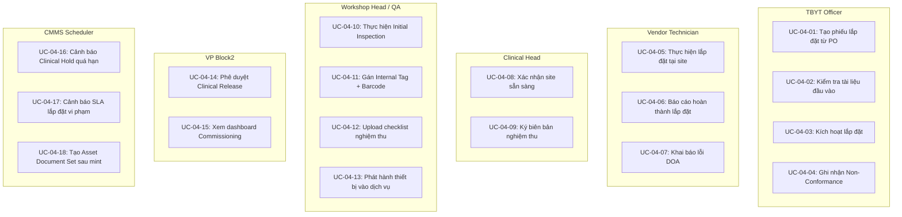

# IMM-04 — Lắp đặt, Định danh & Kiểm tra Ban đầu
## Functional Specification

**Module:** IMM-04  
**Version:** 1.0  
**Ngày:** 2026-04-17  
**Trạng thái:** Draft — Chờ phê duyệt  
**Tác giả:** AssetCore Team

---

## 1. Vị trí trong Asset Lifecycle

```
IMM-03 (Inventory/Stock)
  └─ Rút kho → Asset Commissioning
                     │
          ┌──────────▼──────────┐
          │      IMM-04          │
          │  Nhận thiết bị       │
          │  → Kiểm tra tài liệu │
          │  → Lắp đặt           │
          │  → Định danh         │
          │  → Kiểm tra ban đầu  │
          │  → Bàn giao / Release│
          └──────────┬──────────┘
                     │
        ┌────────────┴────────────┐
        │                         │
  [Clinical Release]         [Return to Vendor]
  Asset → "Active"           DOA / Hỏng nặng
  → IMM-05 (Hồ sơ)
  → IMM-08 (PM Schedule)
```

**Quan hệ ngang:**
- **IMM-03** → cung cấp `item_ref` và `purchase_order` làm điểm khởi đầu  
- **IMM-05** → nhận `commissioning_date` + baseline test parameters làm dữ liệu gốc  
- **IMM-08** → nhận `commissioning_date` để tính `first_pm_date`  
- **IMM-12** → nhận DOA/NC nếu lỗi nghiêm trọng cần CM khẩn

---

## 2. Workflow Chính (BPMN)

```
START
  │
  ▼ [S01 — Draft Reception]
  Nhận thiết bị, tạo Commissioning record
  Actor: TBYT Officer
  Output: Asset Commissioning (Draft)
  │
  ▼ [S02 — Pending Doc Verify] ← GATE G01
  Kiểm tra tài liệu CO/CQ/Manual
  Actor: TBYT Officer
  Condition: 100% mandatory docs = "Received"
  │
  ├─── Thiếu tài liệu → quay lại Draft
  └─── Đủ tài liệu ──────────────────┐
                                      │
  ▼ [S03 — To_Be_Installed]          │
  Clinical Head xác nhận site        │
  Actor: Clinical Head               │
  Condition: Facility checklist pass │
  │                                   │
  ├─── Site fail → S07 Non_Conformance│
  └─── Site pass ─────────────────────┤
                                      │
  ▼ [S04 — Installing]               │
  Vendor lắp đặt phần cứng/phần mềm │
  Actor: Vendor Tech                 │
  │                                   │
  ├─── DOA / lỗi nghiêm trọng → S07 NC
  └─── Setup hoàn thành ──────────────┤
                                      │
  ▼ [S05 — Identification]           │
  Gán Internal Tag, Barcode, SN      │
  Actor: Biomed Engineer             │
  Validation: VR-01 (No Duplicate SN)│
  │                                   │
  ▼ [S06 — Initial Inspection] ← GATE G03
  Đo thông số baseline (điện, cơ lý, an toàn)
  Actor: Biomed Engineer
  │
  ├─── Class C/D/Radiation → Auto → S08 Clinical Hold (G04)
  ├─── Fail baseline → S09 Re_Inspection
  └─── Pass all ────────────────────────────────────┐
                                                     │
  ▼ [S10 — Clinical Release Success] ← GATE G05+G06 │
  Board phê duyệt, Asset activated                  │
  Actor: Board/CEO                                   │
  Output: Asset "Active" + Handover Document         │
  │                                                  │◄─ S08 Clinical Hold cleared
  END ──────────────────────────────────────────────┘
       (hoặc S11 Return_To_Vendor nếu DOA không khắc phục được)
```

---

## 3. Actors & Roles

| Actor | Vai trò | Quyền hệ thống | Trách nhiệm |
|---|---|---|---|
| TBYT Officer | Tạo và theo dõi | Create/Edit Commissioning | Tạo record, kiểm tra tài liệu, ghi nhận thông tin nhận hàng |
| Vendor Tech | Báo cáo tiến độ | Edit (Installing state) | Thực hiện lắp đặt, báo cáo hoàn thành, khai báo DOA |
| Biomed Engineer | Kiểm tra QA | Execute Inspection, Assign Tags | Đo thông số baseline, gán định danh, quyết định Pass/Fail |
| Clinical Head | Phê duyệt nhận hàng | Approve site gate | Xác nhận thiết bị có mặt tại khoa, ký biên bản bàn giao |
| QA Officer | Gỡ Clinical Hold | Upload License, Clear Hold | Xác nhận giấy phép BYT đã nhận, gỡ trạng thái Hold |
| Board/CEO | Release cuối | Approve Clinical Release | Ký duyệt đưa thiết bị vào sử dụng (tài sản vốn) |

---

## 4. Input / Output

### INPUT

| Đầu vào | Nguồn |
|---|---|
| Purchase Order + Item (Device Model) | IMM-03 / Procurement |
| Danh sách tài liệu bắt buộc (CO, CQ, Manual) | Contract / Vendor |
| Thông số baseline chuẩn theo Asset Category | `PM Checklist Template` |
| Giấy phép BYT / Chứng chỉ kiểm định (Class C/D) | QA Officer upload |
| Thông tin site: điện, nước, khí (hạ tầng khoa) | Clinical Head |

### OUTPUT

| Đầu ra | DocType / Artifact |
|---|---|
| Asset Commissioning record (đầy đủ lịch sử) | `Asset Commissioning` |
| Active Asset record (kích hoạt tài sản) | ERPNext `Asset` |
| Baseline Test Report (PDF, locked) | Print Format |
| Handover Document — Biên bản Bàn giao (PDF) | Print Format |
| Multi-layer ID Tag (Internal Tag + Barcode + SN) | `Asset.internal_tag` |
| DOA Incident Report (nếu có) | `Non-Conformance` |
| Asset Lifecycle Event log (immutable) | `Asset Lifecycle Event` |

---

## 5. Workflow States

| Code | Trạng thái | Là Gate? | Điều kiện vào | Điều kiện thoát | Evidence |
|---|---|---|---|---|---|
| S01 | Draft Reception | Không | PO từ Procurement | Submit form | — |
| S02 | Pending Doc Verify | **G01** | Sau Submit | 100% mandatory docs tick | Scanned CO/CQ |
| S03 | To Be Installed | G02 | Doc gate pass | Facility checklist pass | Delivery sheet |
| S04 | Installing | Không | Site pass | Hardware/software setup complete | Install log |
| S05 | Identification | Không | Setup done | UID/SN/Barcode gán không trùng | ID record |
| S06 | Initial Inspection | **G03** | After ID assign | 100% baseline params = Pass | Baseline test form |
| S07 | Non_Conformance | Không | DOA / site fail | Issue resolved hoặc Return to Vendor | NC report |
| S08 | Clinical Hold | **G04** | Class C/D/Radiation | License/permit PDF uploaded | Ministry license |
| S09 | Re_Inspection | Không | Fail baseline | All params re-pass | Retest log |
| S10 | Clinical Release | **G05+G06** | All gates pass | Board ký duyệt → **TERMINAL** | Handover doc + signed |
| S11 | Return To Vendor | Không | DOA không khắc phục | **TERMINAL** | Return notice |

---

## 6. Business Rules

| Mã | Nội dung Rule | Hậu quả vi phạm | Kiểm soát |
|---|---|---|---|
| **BR-04-01** | Không được tạo Asset trực tiếp trong ERPNext — phải qua pipeline IMM-04 | Asset không có baseline, không có audit trail | Block direct Asset creation; `Asset Commissioning` là điểm duy nhất |
| **BR-04-02** | Tài liệu CO/CQ bắt buộc phải attached trước khi chuyển sang To_Be_Installed | Thiết bị không có chứng minh xuất xứ | VR-02: Validate mandatory docs on transition |
| **BR-04-03** | Serial Number (SN) phải duy nhất toàn hệ thống — không trùng với bất kỳ Asset nào | Lẫn lộn thiết bị, audit trail sai | VR-01: `frappe.db.exists("Asset", {"vendor_sn": sn})` block on save |
| **BR-04-04** | 100% baseline test params phải = Pass trước khi Release | Thiết bị lỗi vào phòng lâm sàng | VR-03: Block transition if any `is_pass = Fail` |
| **BR-04-05** | Thiết bị Class C/D hoặc có phóng xạ tự động vào Clinical Hold cho đến khi có giấy phép BYT | Vi phạm quy định NĐ98/2021 | VR-07: Auto-transition if `item.risk_class IN ('C','D','Radiation')` |
| **BR-04-06** | Mọi NC (Non-Conformance) phải được đóng trước khi Release | Thiết bị lỗi chưa xử lý vào sử dụng | VR-04: `db.count("NC", {"ref": name, "status": "Open"}) > 0` → block |
| **BR-04-07** | Dữ liệu baseline test không được xóa — chỉ được Amend với lý do | Mất bằng chứng audit, vi phạm ISO 13485 §7.5 | Rule 03: Lock after Submit; Amend requires reason dialog |
| **BR-04-08** | Board/CEO phải ký duyệt Clinical Release (thiết bị vốn) | Sử dụng tài sản chưa được phê duyệt | G06: Workflow condition; digital signature token required |

---

## 7. User Stories (INVEST)

| ID | Story | SP |
|---|---|---|
| US-04-01 | Với tư cách là **TBYT Officer**, tôi muốn tạo Commissioning record từ PO và kiểm tra tài liệu CO/CQ ngay trong form, để không cần dùng giấy tờ thủ công và đảm bảo đủ hồ sơ trước khi cho nhà cung cấp lắp đặt. | 5 |
| US-04-02 | Với tư cách là **Biomed Engineer**, tôi muốn nhập thông số baseline (điện an toàn, điện trở đất, điện rò) trực tiếp vào checklist trong WO và hệ thống tự block release nếu có thông số Fail, để không có thiết bị lỗi nào đến tay bệnh nhân. | 8 |
| US-04-03 | Với tư cách là **QA Officer**, tôi muốn hệ thống tự động đưa thiết bị Class C/D vào Clinical Hold và chỉ cho gỡ khi tôi upload giấy phép BYT, để đảm bảo tuân thủ NĐ98/2021. | 5 |
| US-04-04 | Với tư cách là **Biomed Engineer**, tôi muốn gán Internal Tag + Barcode + SN cho thiết bị và hệ thống kiểm tra trùng lặp tức thì, để mỗi thiết bị có định danh duy nhất trong suốt vòng đời. | 3 |
| US-04-05 | Với tư cách là **Vendor Tech**, tôi muốn khai báo lỗi DOA và mở NC record với ảnh đính kèm, để có bằng chứng yêu cầu bảo hành/thay thế từ nhà sản xuất. | 3 |

---

## 8. Acceptance Criteria (Gherkin)

```gherkin
Scenario: Kiểm tra tài liệu thành công và chuyển sang To_Be_Installed
  Given Commissioning record ở trạng thái "Pending Doc Verify"
    And CO = "No" (chưa nhận)
  When TBYT Officer cố chuyển sang To_Be_Installed
  Then Hệ thống block transition với message "VR-02: Thiếu CO/CQ"
  When TBYT Officer upload CO và đặt status = "Received"
    And Click "Proceed to Installation"
  Then Trạng thái chuyển sang "To_Be_Installed"
    And Asset Lifecycle Event ghi lại user + timestamp

Scenario: Gán Serial Number trùng bị block
  Given Commissioning ở trạng thái "Identification"
    And Asset khác đã có SN = "SN-12345"
  When Biomed Engineer nhập SN = "SN-12345" và Save
  Then Hệ thống throw VR-01: "Serial đã gán cho thiết bị [Asset ID]"
    And Record không được lưu

Scenario: Thiết bị Class C tự động vào Clinical Hold
  Given Commissioning ở trạng thái "Initial Inspection"
    And Item.risk_class = "C"
  When Biomed Engineer submit Initial Inspection
  Then Trạng thái tự động chuyển sang "Clinical Hold"
    And Alert gửi QA Officer yêu cầu upload giấy phép BYT
    And Nút "Release" bị disabled cho đến khi clearance

Scenario: PM phát hiện baseline fail → Re_Inspection
  Given Biomed Engineer điền checklist baseline
    And "Leakage Current" = 5.2 mA (Fail, spec < 2.0 mA)
  When Submit Initial Inspection
  Then VR-03 block transition
    And Trạng thái = "Re_Inspection"
    And Fail Reason field bắt buộc
    And Baseline form khóa lại (immutable)

Scenario: Release thành công — tạo Active Asset
  Given Tất cả gates G01–G06 đã pass
    And Không có NC Open
    And Board đã ký duyệt
  When Clinical Release được submit
  Then Asset record tạo với status = "Active"
    And Asset.commissioning_date = today
    And Handover Document PDF được generate
    And IMM-08 scheduler tính first_pm_date
```

---

## 9. Exception Handling

| Tình huống | Điều kiện kích hoạt | Xử lý hệ thống | Xử lý nghiệp vụ |
|---|---|---|---|
| Thiếu tài liệu CO/CQ | Mandatory doc field = "No" | Block transition (VR-02) | TBYT Officer liên hệ vendor yêu cầu gửi lại |
| DOA phát hiện khi lắp đặt | Vendor click "Report DOA" | Tạo NC record, chuyển S07 | Biomed Engineer + Vendor họp, quyết định fix hoặc trả |
| Baseline test fail | Param `is_pass = Fail` | Block release, chuyển S09 (VR-03) | Biomed Engineer ghi fail reason, yêu cầu vendor điều chỉnh |
| Thiết bị cần kiểm định 3rd-party | Class C/D/Radiation | Auto-hold S08 (VR-07) | QA Officer liên hệ tổ chức kiểm định, upload PDF khi có |
| Giấy phép BYT hết hạn | Document expiry < today | Alert QA Officer | Gia hạn hoặc Block release cho đến khi có giấy phép mới |
| NC chưa đóng khi release | NC.status = "Open" > 0 | Block Release (VR-04) | Biomed Engineer/Vendor giải quyết từng NC, đóng với evidence |
| Serial Number trùng | `db.exists("Asset", {"vendor_sn": sn})` | Block save (VR-01) | Biomed Engineer kiểm tra lại SN thực tế với thiết bị |
| Board không có mặt để ký | Executive absence | WO ở pending state | Workshop Manager escalate; tìm người ủy quyền |

---

## 10. WHO HTM & QMS Mapping

| Yêu cầu IMM-04 | WHO Reference | ISO 13485:2016 | NĐ98/2021 | Ghi chú |
|---|---|---|---|---|
| Kiểm tra ban đầu trước sử dụng | WHO HTM §4.2 (Acceptance Testing) | §7.5.1 | Điều 25 | Baseline test bắt buộc trước commissioning |
| Tài liệu CO/CQ bắt buộc | WHO HTM §3.4 | §4.2.4 | Điều 8 | Chứng nhận xuất xứ, chất lượng |
| Unique identifier per device | WHO HTM §5.1.2 | §7.5.8 (UDI) | Điều 11 | Internal Tag + SN + Barcode |
| Hồ sơ bàn giao immutable | WHO HTM §5.3.5 | §4.2.5 | Điều 26 | Asset Lifecycle Event locked |
| Class C/D regulatory clearance | WHO HTM §6.1 | §7.4 | Điều 35-37 | Giấy phép BYT bắt buộc |
| Audit trail mọi hành động | WHO HTM §6.4 | §4.2.5 | Điều 28 | Timestamp + user + IP mọi transition |

---

## Biểu đồ Use Case Phân Rã — IMM-04

### Phân rã theo Actor: TBYT Officer



---

## Đặc Tả Use Case — IMM-04

### UC-04-01: Tạo phiếu lắp đặt từ PO

| Thuộc tính | Nội dung |
|---|---|
| **UC ID** | UC-04-01 |
| **Tên** | Tạo phiếu lắp đặt từ Purchase Order |
| **Actor chính** | TBYT Officer |
| **Actor phụ** | — |
| **Tiền điều kiện** | Purchase Order đã được duyệt và tồn tại trong hệ thống; Item có asset_category hợp lệ |
| **Hậu điều kiện** | Asset Commissioning được tạo với status = Draft_Reception; số ACC-YYYY-##### được gán |
| **Luồng chính** | 1. TBYT Officer mở màn hình New Commissioning<br>2. Chọn Purchase Order từ danh sách<br>3. Hệ thống tự điền: vendor, item_ref, asset_category, clinical_dept<br>4. Officer điền thêm: expected_installation_date, location, risk_class<br>5. Officer nhấn Save → hệ thống tạo ACC-YYYY-#####<br>6. Hệ thống gửi notification cho Workshop Head |
| **Luồng thay thế** | 4a. Location không tồn tại → hệ thống báo lỗi, yêu cầu chọn lại<br>4b. risk_class chưa điền → hệ thống block Submit |
| **Luồng ngoại lệ** | 2a. PO đã có Commissioning → hệ thống cảnh báo duplicate |
| **Business Rule** | BR-04-01: Mỗi PO line item tạo 1 phiếu Commissioning độc lập |

---

### UC-04-10: Thực hiện Initial Inspection

| Thuộc tính | Nội dung |
|---|---|
| **UC ID** | UC-04-10 |
| **Tên** | Thực hiện Initial Inspection và gán định danh thiết bị |
| **Actor chính** | Workshop Head / QA Officer |
| **Actor phụ** | Vendor Technician (hỗ trợ) |
| **Tiền điều kiện** | Phiếu ở trạng thái Identification; vendor_sn đã được nhập |
| **Hậu điều kiện** | Internal Tag và Barcode URL được gán; checklist inspection hoàn thành; chuyển sang Clinical_Hold (Class C/D) hoặc Clinical_Release (Class A/B) |
| **Luồng chính** | 1. QA Officer mở phiếu ở bước Identification<br>2. Nhập Serial Number từ thiết bị<br>3. Hệ thống verify SN unique (VR-01)<br>4. Hệ thống auto-generate Internal Tag (HOSP-YYYY-####)<br>5. Hệ thống generate Barcode URL<br>6. QA điền từng mục Initial Inspection Checklist<br>7. Submit checklist → hệ thống đánh giá kết quả<br>8a. risk_class = C/D/Radiation → auto-transition Clinical_Hold<br>8b. All Pass + risk_class A/B → transition Clinical_Release |
| **Luồng thay thế** | 3a. SN trùng → block, yêu cầu kiểm tra lại<br>6a. ≥1 critical item Fail → transition Re_Inspection |
| **Luồng ngoại lệ** | 4a. Internal Tag pattern chưa cấu hình → alert Admin |
| **Business Rule** | BR-04-03: SN phải unique toàn hệ thống; VR-07: Class C/D/Radiation auto Clinical_Hold |

---

### UC-04-14: Phê duyệt Clinical Release

| Thuộc tính | Nội dung |
|---|---|
| **UC ID** | UC-04-14 |
| **Tên** | Phê duyệt phát hành thiết bị vào dịch vụ lâm sàng |
| **Actor chính** | VP Block2 |
| **Actor phụ** | QA Officer (chuẩn bị hồ sơ) |
| **Tiền điều kiện** | Phiếu ở trạng thái Clinical_Release; Radiation License đã upload (nếu Class Radiation) |
| **Hậu điều kiện** | Asset được tạo trong hệ thống ERPNext; Asset.status = Active; commissioning_date ghi nhận; IMM-05 tạo Document Set; IMM-08 tạo PM Schedule |
| **Luồng chính** | 1. VP Block2 nhận notification phiếu chờ duyệt<br>2. Mở phiếu, review toàn bộ hồ sơ<br>3. Xác nhận đủ điều kiện<br>4. Nhấn "Approve Release"<br>5. Hệ thống tạo ERPNext Asset với internal_tag làm asset_name<br>6. Hệ thống set commissioning_date = today<br>7. Trigger IMM-05: tạo Document Set từ commissioning_documents<br>8. Trigger IMM-08: tạo PM Schedule theo manufacturer interval |
| **Luồng thay thế** | 3a. Thiếu Radiation License → block, yêu cầu upload<br>3b. VP từ chối → nhập rejection_reason, phiếu về Draft |
| **Luồng ngoại lệ** | 5a. ERPNext Asset creation fail → rollback, alert Admin |
| **Business Rule** | BR-04-06: commissioning_date phải được set chính xác (baseline PM); BR-04-08: Asset mint phải trigger IMM-05 và IMM-08 |

---

## Yêu Cầu Phi Chức Năng — IMM-04

| ID | Loại | Yêu cầu | Chỉ tiêu | Phương pháp kiểm tra |
|---|---|---|---|---|
| NFR-04-01 | Performance | Tải form Commissioning với 50 fields | < 2s | Load test |
| NFR-04-02 | Performance | Generate Barcode URL | < 500ms | Unit test |
| NFR-04-03 | Reliability | Scheduler alert Clinical Hold | Chạy đúng 00:30 hàng ngày, độ trễ < 5 phút | Monitor log |
| NFR-04-04 | Security | Chỉ TBYT Officer mới tạo được Commissioning | Permission test | Permission test |
| NFR-04-05 | Security | VP Block2 mới được Approve Release | Role permission check | Permission test |
| NFR-04-06 | Audit | Mọi state transition ghi Lifecycle Event | 100% coverage | DB audit check |
| NFR-04-07 | Usability | Form điền trên tablet 768px | Responsive, không scroll ngang | Manual test |
| NFR-04-08 | Data integrity | Serial Number unique toàn hệ thống | Duplicate check khi nhập SN | Integration test |
| NFR-04-09 | Availability | Module hoạt động trong giờ hành chính | 99.5% uptime | Uptime monitor |
| NFR-04-10 | Compliance | Audit trail immutable sau Submit | Không thể xóa/sửa Lifecycle Event | DB constraint test |
