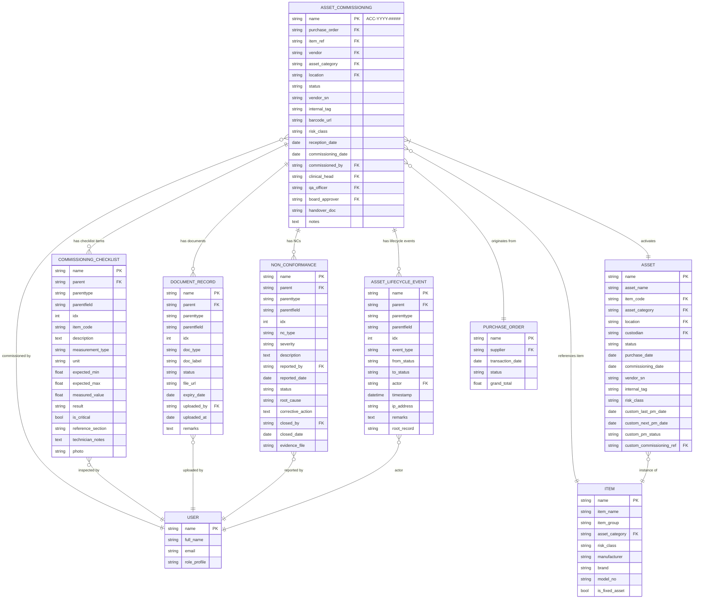

# IMM-04 — Technical Design
## Data Model, Automation & State Machine

**Module:** IMM-04  
**Version:** 1.0  
**Ngày:** 2026-04-17  
**Trạng thái:** Draft

---

## 1. ERD — Entity Relationship Diagram



---

## 2. Data Dictionary

### 2.1 `Asset Commissioning` (Phiếu Nghiệm Thu & Bàn Giao Thiết Bị)

**Mục đích:** Trục trung tâm của IMM-04 — ghi lại toàn bộ quá trình từ nhận hàng đến đưa thiết bị vào sử dụng lâm sàng.  
**Naming Series:** `ACC-YYYY-#####`  
**DocType type:** Submittable

| field_name | Label | Type | Mandatory | Description | Constraints |
|---|---|---|---|---|---|
| `purchase_order` | Đơn Mua Hàng | Link → Purchase Order | Yes | PO từ IMM-03/Procurement | Phải tồn tại; status ≠ Cancelled |
| `item_ref` | Thiết Bị (Item) | Link → Item | Yes | Device Model từ Item master | `item.is_fixed_asset = True` |
| `vendor` | Nhà Cung Cấp | Link → Supplier | Yes | Đơn vị giao hàng/lắp đặt | Phải tồn tại |
| `asset_category` | Loại Thiết Bị | Link → Asset Category | Yes | Danh mục tài sản ERPNext | Auto-filled từ Item |
| `location` | Địa Điểm Lắp Đặt | Link → Location | Yes | Khoa/phòng nhận thiết bị | Phải là Location active |
| `status` | Trạng Thái | Select | Yes (system) | Trạng thái hiện tại trong workflow | Xem State Machine §3 |
| `vendor_sn` | Serial Number (Nhà Sản Xuất) | Data | Yes | SN in trên thân máy | Unique toàn hệ thống (VR-01) |
| `internal_tag` | Mã Nội Bộ | Data | No (set at S05) | Mã gắn nội bộ bệnh viện (vd: BVXX-2026-001) | Unique; auto-generated nếu blank |
| `barcode_url` | Barcode / QR URL | Data | No | URL file QR code / barcode | Read-only sau khi generate |
| `risk_class` | Phân Loại Rủi Ro | Select | Yes | A / B / C / D / Radiation | Auto-filled từ Item; quyết định VR-07 |
| `reception_date` | Ngày Nhận Hàng | Date | Yes | Ngày thiết bị được giao về | Không được là tương lai |
| `commissioning_date` | Ngày Commissioning | Date | No (set at S10) | Ngày Release lâm sàng | Set on Clinical Release |
| `commissioned_by` | Kỹ Thuật Viên Phụ Trách | Link → User | Yes | Biomed Engineer thực hiện kiểm tra | Phải có role Biomed Engineer |
| `clinical_head` | Trưởng Khoa | Link → User | Yes | Clinical Head xác nhận site | Phải có role Clinical Head |
| `qa_officer` | Nhân Viên QA | Link → User | No | Bắt buộc nếu risk_class ∈ {C, D, Radiation} | Required khi risk_class IN ('C','D','Radiation') |
| `board_approver` | Người Phê Duyệt (Ban Giám Đốc) | Link → User | No | Board ký duyệt Clinical Release (G06) | Required at S10 |
| `handover_doc` | Biên Bản Bàn Giao | Attach | No | PDF biên bản bàn giao đã ký | Set on Clinical Release |
| `vendor_contact` | Người Liên Hệ Vendor | Data | No | Tên + SĐT kỹ thuật viên vendor | |
| `vendor_install_ref` | Mã Installation (Vendor) | Data | No | Số biên bản lắp đặt của vendor | |
| `facility_checklist_pass` | Site Facility Pass | Check | No | Xác nhận cơ sở hạ tầng đạt (điện, khí) | Required trước khi → To_Be_Installed |
| `radiation_license_no` | Số Giấy Phép Phóng Xạ | Data | No | Số giấy phép bức xạ BYT | Bắt buộc nếu Radiation |
| `overall_inspection_result` | Kết Quả Kiểm Tra Tổng Thể | Select | No | Pass / Pass with Minor / Fail | Computed từ Checklist |
| `asset_ref` | Tài Sản (Asset) | Link → Asset | No (set at S10) | Liên kết đến Asset ERPNext được tạo | Read-only; set by system on Release |
| `notes` | Ghi Chú | Text | No | Ghi chú tự do | |
| `checklist_items` | Danh Sách Kiểm Tra | Table | No | Child table: Commissioning Checklist | Xem §2.2 |
| `documents` | Tài Liệu Kèm Theo | Table | No | Child table: Document Record | Xem §2.3 |
| `non_conformances` | Phiếu Không Phù Hợp | Table | No | Child table: Non-Conformance | Xem §2.4 |
| `lifecycle_events` | Sự Kiện Vòng Đời | Table | No | Child table: Asset Lifecycle Event | Xem §2.5; immutable |

---

### 2.2 `Commissioning Checklist` (Child Table — Danh Sách Kiểm Tra Baseline)

**Mục đích:** Ghi lại từng thông số đo lường trong kiểm tra ban đầu (điện an toàn, cơ lý, chức năng).

| field_name | Label | Type | Mandatory | Description | Constraints |
|---|---|---|---|---|---|
| `item_code` | Mã Mục | Data | Yes | Mã định danh mục kiểm tra (vd: CHK-001) | Auto-generate; read-only |
| `description` | Mô Tả Công Việc | Text | Yes | Nội dung kiểm tra (vd: "Kiểm tra điện rò vỏ máy") | |
| `measurement_type` | Loại Đo Lường | Select | Yes | Pass/Fail / Numeric / Text | |
| `unit` | Đơn Vị | Data | No | Vd: V, mA, Ω, mmHg | Bắt buộc nếu Numeric |
| `expected_min` | Giá Trị Tối Thiểu | Float | No | Ngưỡng dưới theo spec | Chỉ khi Numeric |
| `expected_max` | Giá Trị Tối Đa | Float | No | Ngưỡng trên theo spec | Chỉ khi Numeric |
| `measured_value` | Giá Trị Đo Được | Float | No | Kết quả đo thực tế | Chỉ khi Numeric |
| `result` | Kết Quả | Select | Yes | Pass / Fail / N/A | Mandatory trước Submit |
| `is_critical` | Mục Quan Trọng | Check | No | Nếu Fail → block Release (VR-03) | |
| `is_pass` | Đạt | Check | No | Computed: result = Pass | Read-only; computed |
| `reference_section` | Tham Chiếu Tài Liệu | Data | No | Vd: "Service Manual §3.2.1" | |
| `technician_notes` | Ghi Chú KTV | Text | No | Ghi chú của kỹ thuật viên | |
| `photo` | Ảnh Minh Chứng | Attach | No | Ảnh đo lường / trạng thái thiết bị | |

---

### 2.3 `Document Record` (Child Table — Hồ Sơ Tài Liệu)

**Mục đích:** Tracking các tài liệu pháp lý và kỹ thuật bắt buộc (CO, CQ, Manual, Giấy phép BYT).

| field_name | Label | Type | Mandatory | Description | Constraints |
|---|---|---|---|---|---|
| `doc_type` | Loại Tài Liệu | Select | Yes | CO / CQ / Manual / License / Warranty / Other | |
| `doc_label` | Tên Tài Liệu | Data | Yes | Tên mô tả (vd: "Chứng Nhận Xuất Xứ") | |
| `status` | Trạng Thái | Select | Yes | Pending / Received / Rejected / Waived | Default: Pending |
| `is_mandatory` | Bắt Buộc | Check | Yes | Tài liệu bắt buộc theo quy định | VR-02 kiểm tra field này |
| `file_url` | File Đính Kèm | Attach | No | PDF / scan tài liệu | Bắt buộc khi status = Received |
| `expiry_date` | Ngày Hết Hạn | Date | No | Ngày hết hạn tài liệu (license) | Alert nếu < today + 30 days |
| `doc_number` | Số Tài Liệu | Data | No | Số hiệu tài liệu (vd: số giấy phép) | |
| `issued_by` | Cơ Quan Cấp | Data | No | Vd: "Bộ Y Tế", "Nhà Sản Xuất" | |
| `issue_date` | Ngày Cấp | Date | No | Ngày cấp tài liệu | Phải ≤ today |
| `uploaded_by` | Người Upload | Link → User | No | User upload file | Read-only; auto-set |
| `uploaded_at` | Thời Gian Upload | Datetime | No | Timestamp upload | Read-only; auto-set |
| `remarks` | Ghi Chú | Text | No | Ghi chú bổ sung | |

---

### 2.4 `Non-Conformance` (Child Table — Phiếu Không Phù Hợp)

**Mục đích:** Ghi lại mọi vấn đề phát sinh (DOA, lỗi kỹ thuật, thiếu tài liệu) trong quá trình commissioning.

| field_name | Label | Type | Mandatory | Description | Constraints |
|---|---|---|---|---|---|
| `nc_code` | Mã NC | Data | Yes | Auto-generated: NC-{parent}-{idx} | Read-only |
| `nc_type` | Loại NC | Select | Yes | DOA / Technical / Documentation / Site / Other | |
| `severity` | Mức Độ | Select | Yes | Critical / Major / Minor | Critical → có thể dẫn đến S11 |
| `description` | Mô Tả Vấn Đề | Text | Yes | Mô tả chi tiết vấn đề phát sinh | |
| `reported_by` | Người Báo Cáo | Link → User | Yes | Actor phát hiện vấn đề | Read-only; auto-set = current user |
| `reported_date` | Ngày Phát Hiện | Date | Yes | Ngày ghi nhận NC | Auto-set = today |
| `status` | Trạng Thái | Select | Yes | Open / Under Review / Resolved / Closed / Transferred | |
| `root_cause` | Nguyên Nhân Gốc Rễ | Text | No | Phân tích nguyên nhân (bắt buộc khi Close) | Bắt buộc khi status → Closed |
| `corrective_action` | Hành Động Khắc Phục | Text | No | Biện pháp đã thực hiện | Bắt buộc khi status → Closed |
| `closed_by` | Người Đóng | Link → User | No | User đóng NC | Read-only; auto-set |
| `closed_date` | Ngày Đóng | Date | No | Ngày NC được đóng | Read-only; auto-set |
| `evidence_file` | Bằng Chứng | Attach Multiple | No | Ảnh / tài liệu minh chứng | |
| `transfer_to_capa` | Chuyển CAPA | Check | No | Nếu cần CAPA → tick | Tạo CAPA doc từ IMM-12 |
| `return_to_vendor_ref` | Phiếu Trả Hàng | Data | No | Số biên bản trả hàng nếu S11 | |

---

### 2.5 `Asset Lifecycle Event` (Child Table — Nhật Ký Vòng Đời — Immutable)

**Mục đích:** Audit trail bất biến ghi lại mọi thay đổi trạng thái và hành động quan trọng.

| field_name | Label | Type | Mandatory | Description | Constraints |
|---|---|---|---|---|---|
| `event_type` | Loại Sự Kiện | Select | Yes | status_changed / doc_uploaded / nc_reported / nc_closed / tag_assigned / hold_cleared / released | |
| `from_status` | Từ Trạng Thái | Data | No | Trạng thái trước chuyển | |
| `to_status` | Đến Trạng Thái | Data | No | Trạng thái sau chuyển | |
| `actor` | Người Thực Hiện | Link → User | Yes | User thực hiện hành động | Read-only; auto-set = frappe.session.user |
| `timestamp` | Thời Gian | Datetime | Yes | Timestamp UTC | Read-only; auto-set = now() |
| `ip_address` | Địa Chỉ IP | Data | No | IP của client | Auto-capture từ request |
| `remarks` | Ghi Chú | Text | No | Lý do / mô tả thêm | Bắt buộc khi Amend |
| `root_record` | Record Gốc | Data | No | Tên record cha (ACC-...) | Auto-set |

**Lưu ý:** Không có nút Edit / Delete trên child table này. Controller `validate` sẽ block mọi thay đổi row đã tồn tại (BR-04-07).

---

## 3. State Machine

```mermaid
stateDiagram-v2
    [*] --> Draft_Reception : Tạo mới từ PO

    Draft_Reception --> Pending_Doc_Verify : [Submit] TBYT Officer\nkích hoạt kiểm tra tài liệu

    Pending_Doc_Verify --> To_Be_Installed : [G01 Pass]\n100% mandatory docs = Received\nVR-02 satisfied
    Pending_Doc_Verify --> Draft_Reception : [Thiếu tài liệu]\nSend back với ghi chú

    To_Be_Installed --> Installing : [G02 Pass]\nfacility_checklist_pass = True\nClinical Head xác nhận
    To_Be_Installed --> Non_Conformance : [Site Fail]\nHạ tầng không đạt\n(điện, khí, phòng)

    Installing --> Identification : [Setup Complete]\nVendor Tech báo hoàn thành
    Installing --> Non_Conformance : [DOA / Lỗi]\nVendor khai báo lỗi

    Identification --> Initial_Inspection : [ID Assigned]\nVR-01: SN unique\nInternal Tag gán

    Initial_Inspection --> Clinical_Hold : [Auto — VR-07]\nrisk_class ∈ {C, D, Radiation}\nAuto-transition ngay
    Initial_Inspection --> Re_Inspection : [Baseline Fail]\nVR-03: ≥1 critical item Fail
    Initial_Inspection --> Clinical_Release : [G03 Pass]\nAll items Pass\nrisk_class ∈ {A, B}\nkhông có NC Open

    Clinical_Hold --> Clinical_Release : [G04 Cleared]\nQA Officer upload license\nVR-04: no open NC
    Clinical_Hold --> Non_Conformance : [License Rejected]\nGiấy phép không hợp lệ

    Re_Inspection --> Initial_Inspection : [Re-test]\nSau khi vendor điều chỉnh
    Re_Inspection --> Non_Conformance : [Re-test Fail]\nVẫn fail sau re-test

    Non_Conformance --> Installing : [NC Resolved]\nSeverity ≤ Major; fix tại chỗ
    Non_Conformance --> Return_To_Vendor : [NC Critical / DOA]\nKhông thể fix; trả hàng
    Non_Conformance --> Initial_Inspection : [NC Closed]\nNC severity Minor

    Clinical_Release --> [*] : [G05+G06 Pass]\nBoard ký duyệt\nAsset.status = Active\nHandover Doc generated

    Return_To_Vendor --> [*] : TERMINAL\nReturn notice gửi vendor

    note right of Clinical_Hold
        G04 = Giấy phép BYT\nphải còn hiệu lực
        Radiation: cần giấy\nphép phóng xạ riêng
    end note

    note right of Clinical_Release
        G05 = All gates passed\nG06 = Board/CEO signed\nTạo Asset + PM Schedule\nSend notification IMM-05
    end note
```



---

## 4. Backend Automation

### 4.1 Frappe Controller Hooks

**File:** `assetcore/doctype/asset_commissioning/asset_commissioning.py`

```python
class AssetCommissioning(Document):
    def before_insert(self):
        """
        Khởi tạo dữ liệu trước khi insert lần đầu.
        - Set status = Draft_Reception
        - Tạo mandatory document list từ Item category
        - Set reception_date = today nếu blank
        """
        from assetcore.services.imm04 import initialize_commissioning
        initialize_commissioning(self)

    def validate(self):
        """
        Validation chạy mọi lần Save.
        - VR-01: Unique Serial Number
        - VR-05: Manual warning nếu risk_class thay đổi
        - VR-06: Block edit lifecycle_events đã tồn tại
        - Validate expiry dates của documents
        """
        from assetcore.services.imm04 import validate_commissioning
        validate_commissioning(self)

    def on_submit(self):
        """
        Chạy khi Submit (chuyển trạng thái chính thức).
        - Ghi Asset Lifecycle Event
        - Nếu status = Clinical_Release → tạo Asset ERPNext
        - Trigger create_pm_schedule (IMM-08)
        - Trigger create_device_record (IMM-05)
        - Generate Handover Document PDF
        - Send notifications
        """
        from assetcore.services.imm04 import finalize_commissioning
        finalize_commissioning(self)

    def on_cancel(self):
        """
        Block cancel nếu Asset đã được tạo (status = Clinical_Release).
        Cho phép cancel khi còn ở Draft hoặc Non_Conformance / Return_To_Vendor.
        """
        from assetcore.services.imm04 import handle_commissioning_cancel
        handle_commissioning_cancel(self)
```

---

### 4.2 Service Functions — `assetcore/services/imm04.py`

```python
def initialize_commissioning(doc: "AssetCommissioning") -> None:
    """
    Khởi tạo record mới: set status, ngày nhận, populate mandatory docs từ Item category.
    Trigger: before_insert
    """
    if not doc.status:
        doc.status = "Draft_Reception"
    if not doc.reception_date:
        doc.reception_date = frappe.utils.today()
    if not doc.risk_class and doc.item_ref:
        doc.risk_class = frappe.db.get_value("Item", doc.item_ref, "risk_class")
    _populate_mandatory_documents(doc)


def _populate_mandatory_documents(doc: "AssetCommissioning") -> None:
    """
    Điền sẵn danh sách Document Record bắt buộc dựa trên Asset Category.
    CO, CQ luôn bắt buộc. License bắt buộc nếu risk_class ∈ {C, D, Radiation}.
    """
    mandatory_docs = [
        {"doc_type": "CO", "doc_label": "Chứng Nhận Xuất Xứ (CO)", "is_mandatory": 1},
        {"doc_type": "CQ", "doc_label": "Chứng Nhận Chất Lượng (CQ)", "is_mandatory": 1},
        {"doc_type": "Manual", "doc_label": "Hướng Dẫn Sử Dụng / Service Manual", "is_mandatory": 1},
        {"doc_type": "Warranty", "doc_label": "Giấy Bảo Hành", "is_mandatory": 0},
    ]
    if doc.risk_class in ("C", "D", "Radiation"):
        mandatory_docs.append({
            "doc_type": "License",
            "doc_label": "Giấy Phép Lưu Hành (Bộ Y Tế)",
            "is_mandatory": 1,
        })
    if doc.risk_class == "Radiation":
        mandatory_docs.append({
            "doc_type": "License",
            "doc_label": "Giấy Phép Phóng Xạ (Cục ATBXHN)",
            "is_mandatory": 1,
        })
    # Chỉ thêm nếu chưa có rows
    if not doc.documents:
        for d in mandatory_docs:
            doc.append("documents", {**d, "status": "Pending"})


def validate_commissioning(doc: "AssetCommissioning") -> None:
    """
    Chạy tất cả validation rules (VR-01 đến VR-07).
    Trigger: validate (mọi lần Save)
    """
    _vr01_unique_serial_number(doc)
    _vr06_immutable_lifecycle_events(doc)
    _vr05_risk_class_change_warning(doc)
    _validate_document_expiry(doc)


def _vr01_unique_serial_number(doc: "AssetCommissioning") -> None:
    """
    VR-01: Serial Number phải duy nhất toàn hệ thống.
    Kiểm tra trong cả Asset lẫn Asset Commissioning khác.
    """
    if not doc.vendor_sn:
        return
    # Kiểm tra trong Asset đã activated
    existing_asset = frappe.db.get_value("Asset", {"vendor_sn": doc.vendor_sn}, "name")
    if existing_asset:
        frappe.throw(
            _("VR-01: Serial Number '{0}' đã được gán cho Tài Sản {1}. Vui lòng kiểm tra lại.").format(
                doc.vendor_sn, existing_asset
            ),
            frappe.DuplicateEntryError,
        )
    # Kiểm tra trong Commissioning khác chưa release
    existing_comm = frappe.db.get_value(
        "Asset Commissioning",
        {"vendor_sn": doc.vendor_sn, "name": ("!=", doc.name or ""), "docstatus": ("!=", 2)},
        "name",
    )
    if existing_comm:
        frappe.throw(
            _("VR-01: Serial Number '{0}' đã tồn tại trong Phiếu Nghiệm Thu {1}.").format(
                doc.vendor_sn, existing_comm
            ),
            frappe.DuplicateEntryError,
        )


def _vr06_immutable_lifecycle_events(doc: "AssetCommissioning") -> None:
    """
    VR-06: Không cho phép sửa / xóa lifecycle events đã lưu.
    So sánh với version trong DB.
    """
    if doc.is_new():
        return
    existing_events = frappe.db.get_all(
        "Asset Lifecycle Event",
        filters={"parent": doc.name, "parenttype": "Asset Commissioning"},
        fields=["name", "timestamp", "actor", "event_type"],
    )
    existing_map = {e["name"]: e for e in existing_events}
    for row in doc.lifecycle_events:
        if row.name and row.name in existing_map:
            orig = existing_map[row.name]
            if (
                str(row.timestamp) != str(orig["timestamp"])
                or row.actor != orig["actor"]
                or row.event_type != orig["event_type"]
            ):
                frappe.throw(
                    _("VR-06: Nhật ký sự kiện vòng đời không được chỉnh sửa. "
                      "Dữ liệu audit trail bất biến theo quy định ISO 13485 §4.2.5.")
                )


def _vr05_risk_class_change_warning(doc: "AssetCommissioning") -> None:
    """
    VR-05: Cảnh báo nếu risk_class bị thay đổi sau khi đã qua Initial Inspection.
    """
    if doc.is_new() or doc.status in ("Draft_Reception", "Pending_Doc_Verify"):
        return
    original_class = frappe.db.get_value("Asset Commissioning", doc.name, "risk_class")
    if original_class and original_class != doc.risk_class:
        frappe.msgprint(
            _("VR-05: Phân loại rủi ro đã thay đổi từ '{0}' sang '{1}'. "
              "Thay đổi này sẽ được ghi vào nhật ký audit và cần phê duyệt của QA Officer.").format(
                original_class, doc.risk_class
            ),
            alert=True,
            indicator="orange",
        )


def _validate_document_expiry(doc: "AssetCommissioning") -> None:
    """
    Cảnh báo nếu document sắp hết hạn (< 30 ngày) hoặc đã hết hạn.
    """
    today = getdate()
    for d in doc.documents:
        if d.expiry_date and d.status == "Received":
            days_to_expiry = date_diff(d.expiry_date, today)
            if days_to_expiry < 0:
                frappe.throw(
                    _("Tài liệu '{0}' đã hết hạn vào ngày {1}. Vui lòng cập nhật.").format(
                        d.doc_label, d.expiry_date
                    )
                )
            elif days_to_expiry < 30:
                frappe.msgprint(
                    _("Cảnh báo: Tài liệu '{0}' sẽ hết hạn sau {1} ngày ({2}).").format(
                        d.doc_label, days_to_expiry, d.expiry_date
                    ),
                    alert=True,
                    indicator="yellow",
                )


def validate_gate_g01(doc: "AssetCommissioning") -> None:
    """
    VR-02: Gate G01 — 100% mandatory documents phải có status = Received.
    Trigger: trước khi chuyển sang To_Be_Installed.
    """
    missing = [
        d.doc_label for d in doc.documents
        if d.is_mandatory and d.status != "Received"
    ]
    if missing:
        frappe.throw(
            _("VR-02 (Gate G01): Chưa đủ tài liệu bắt buộc. Còn thiếu: {0}").format(
                ", ".join(missing)
            )
        )


def validate_gate_g03(doc: "AssetCommissioning") -> None:
    """
    VR-03: Gate G03 — 100% checklist items phải = Pass.
    VR-07: Nếu risk_class ∈ {C, D, Radiation} → auto-transition sang Clinical_Hold.
    Trigger: trước khi chuyển sang Clinical_Release / Clinical_Hold.
    """
    failed_critical = [
        row.description for row in doc.checklist_items
        if row.is_critical and row.result != "Pass"
    ]
    if failed_critical:
        frappe.throw(
            _("VR-03 (Gate G03): Các mục kiểm tra quan trọng chưa đạt: {0}. "
              "Phiếu sẽ chuyển sang Re_Inspection.").format(", ".join(failed_critical))
        )
    failed_any = [
        row.description for row in doc.checklist_items
        if row.result == "Fail"
    ]
    if failed_any:
        frappe.throw(
            _("VR-03: Có {0} mục kiểm tra chưa đạt. Không thể Release.").format(len(failed_any))
        )


def validate_gate_g05_g06(doc: "AssetCommissioning") -> None:
    """
    Gate G05: Tất cả NC phải Closed.
    Gate G06: board_approver phải được chọn (xác nhận Board đã ký).
    VR-04: Không có NC Open.
    """
    open_ncs = [
        row.nc_code for row in doc.non_conformances
        if row.status in ("Open", "Under Review")
    ]
    if open_ncs:
        frappe.throw(
            _("VR-04 (Gate G05): Còn {0} Phiếu Không Phù Hợp chưa đóng: {1}. "
              "Vui lòng giải quyết trước khi Release.").format(len(open_ncs), ", ".join(open_ncs))
        )
    if not doc.board_approver:
        frappe.throw(
            _("Gate G06: Cần chọn Người Phê Duyệt Ban Giám Đốc để hoàn thành Clinical Release.")
        )


def check_auto_clinical_hold(doc: "AssetCommissioning") -> bool:
    """
    VR-07: Kiểm tra xem thiết bị có cần vào Clinical Hold không.
    Trả về True nếu cần auto-hold.
    """
    return doc.risk_class in ("C", "D", "Radiation")


def finalize_commissioning(doc: "AssetCommissioning") -> None:
    """
    Xử lý khi Submit và status = Clinical_Release:
    - Tạo ERPNext Asset record
    - Trigger IMM-05 (Device Record)
    - Trigger IMM-08 (PM Schedule)
    - Generate Handover PDF
    - Ghi lifecycle event
    Trigger: on_submit
    """
    if doc.status != "Clinical_Release":
        return
    from assetcore.services.imm04 import (
        create_erpnext_asset,
        log_lifecycle_event,
    )
    asset_name = create_erpnext_asset(doc)
    doc.asset_ref = asset_name
    doc.commissioning_date = frappe.utils.today()
    frappe.db.set_value("Asset Commissioning", doc.name, {
        "asset_ref": asset_name,
        "commissioning_date": doc.commissioning_date,
    })
    log_lifecycle_event(
        doc=doc,
        event_type="released",
        from_status="Clinical_Hold" if doc.risk_class in ("C","D","Radiation") else "Initial_Inspection",
        to_status="Clinical_Release",
        remarks=f"Asset {asset_name} activated. Approver: {doc.board_approver}",
    )
    # Trigger downstream modules
    frappe.enqueue(
        "assetcore.services.imm08.create_pm_schedule_from_commissioning",
        commissioning_doc=doc,
        queue="default",
    )
    frappe.enqueue(
        "assetcore.services.imm05.create_device_record_from_commissioning",
        commissioning_doc=doc,
        queue="default",
    )
    _generate_handover_document(doc)
    _send_release_notifications(doc)


def create_erpnext_asset(doc: "AssetCommissioning") -> str:
    """
    Tạo Asset trong ERPNext từ thông tin Commissioning.
    Đây là điểm duy nhất tạo Asset — BR-04-01.
    """
    asset = frappe.get_doc({
        "doctype": "Asset",
        "item_code": doc.item_ref,
        "asset_name": frappe.db.get_value("Item", doc.item_ref, "item_name"),
        "asset_category": doc.asset_category,
        "location": doc.location,
        "purchase_date": doc.reception_date,
        "vendor_sn": doc.vendor_sn,
        "custom_internal_tag": doc.internal_tag,
        "custom_risk_class": doc.risk_class,
        "custom_commissioning_ref": doc.name,
        "status": "Active",
        "is_existing_asset": 0,
    })
    asset.insert(ignore_permissions=True)
    asset.submit()
    return asset.name


def log_lifecycle_event(
    doc: "AssetCommissioning",
    event_type: str,
    from_status: str,
    to_status: str,
    remarks: str = "",
) -> None:
    """
    Thêm một dòng immutable vào lifecycle_events child table.
    Gọi mỗi khi có state transition hoặc hành động quan trọng.
    """
    import socket
    doc.append("lifecycle_events", {
        "event_type": event_type,
        "from_status": from_status,
        "to_status": to_status,
        "actor": frappe.session.user,
        "timestamp": frappe.utils.now(),
        "ip_address": frappe.local.request.environ.get("REMOTE_ADDR", "") if frappe.local.request else "",
        "remarks": remarks,
        "root_record": doc.name,
    })


def handle_commissioning_cancel(doc: "AssetCommissioning") -> None:
    """
    Block cancel nếu Asset đã được tạo.
    Cho phép cancel ở Draft hoặc Return_To_Vendor.
    Trigger: on_cancel
    """
    if doc.asset_ref:
        frappe.throw(
            _("Không thể hủy Phiếu Nghiệm Thu '{0}' vì Tài Sản '{1}' đã được kích hoạt. "
              "Liên hệ CMMS Admin để xử lý.").format(doc.name, doc.asset_ref)
        )
    if doc.status not in ("Draft_Reception", "Non_Conformance", "Return_To_Vendor"):
        frappe.throw(
            _("Chỉ có thể hủy Phiếu Nghiệm Thu ở trạng thái Draft, Không Phù Hợp "
              "hoặc Trả Hàng. Trạng thái hiện tại: {0}").format(doc.status)
        )
```

---

### 4.3 Frappe Hooks Configuration

**File:** `assetcore/hooks.py` (phần liên quan IMM-04)

```python
doc_events = {
    "Asset Commissioning": {
        "before_insert": "assetcore.services.imm04.initialize_commissioning",
        "validate": "assetcore.services.imm04.validate_commissioning",
        "on_submit": "assetcore.services.imm04.finalize_commissioning",
        "on_cancel": "assetcore.services.imm04.handle_commissioning_cancel",
        "on_trash": "assetcore.services.imm04.block_trash_if_asset_exists",
    },
}

scheduler_events = {
    "daily": [
        "assetcore.services.imm04.check_commissioning_overdue",
    ],
    "cron": {
        "0 7 * * *": [
            "assetcore.services.imm04.send_daily_commissioning_summary",
        ],
    },
}
```

---

### 4.4 Scheduler — Daily Jobs

```python
def check_commissioning_overdue() -> None:
    """
    Kiểm tra các Commissioning đang mở > 30 ngày không tiến triển.
    Gửi cảnh báo leo thang cho Workshop Manager và PTP.
    Chạy: daily
    """
    open_comms = frappe.get_all(
        "Asset Commissioning",
        filters={
            "docstatus": 0,
            "status": ("not in", ["Clinical_Release", "Return_To_Vendor"]),
            "reception_date": ("<", frappe.utils.add_days(frappe.utils.today(), -30)),
        },
        fields=["name", "vendor", "status", "reception_date", "commissioned_by"],
    )
    for comm in open_comms:
        days_open = frappe.utils.date_diff(frappe.utils.today(), comm["reception_date"])
        _send_overdue_alert(comm, days_open)
        if days_open > 60:
            _escalate_to_board(comm, days_open)


def send_daily_commissioning_summary() -> None:
    """
    Gửi báo cáo tổng hợp buổi sáng cho TBYT Officer và Workshop Manager.
    Nội dung: số lượng commissioning theo trạng thái, quá hạn, chờ phê duyệt.
    Chạy: 07:00 daily
    """
    summary = _build_commissioning_summary()
    _send_summary_email(summary)
```

---

## 5. Exception Catalog

| Error Code | HTTP Status | Trigger Condition | Handler |
|---|---|---|---|
| `VR-01-DUPLICATE-SN` | 409 Conflict | `vendor_sn` đã tồn tại trong Asset hoặc Commissioning khác | `frappe.throw` + `DuplicateEntryError`; UI hiển thị link đến record trùng |
| `VR-02-MISSING-DOC` | 422 Unprocessable | Mandatory document có `status != Received` khi transition → G01 | Block transition; list tên tài liệu còn thiếu |
| `VR-03-BASELINE-FAIL` | 422 Unprocessable | Checklist item có `result = Fail` khi transition qua G03 | Block Release; chuyển → Re_Inspection; list items fail |
| `VR-04-OPEN-NC` | 422 Unprocessable | Có NC với `status ∈ {Open, Under Review}` khi Release | Block; list NC codes cần đóng |
| `VR-05-RISK-CLASS-CHANGE` | 200 Warning | `risk_class` thay đổi sau Initial Inspection | `frappe.msgprint` với `indicator=orange`; ghi audit log |
| `VR-06-IMMUTABLE-EVENT` | 403 Forbidden | Người dùng cố edit/xóa row trong `lifecycle_events` | `frappe.throw` + `PermissionError` |
| `VR-07-AUTO-HOLD` | 200 Info | `risk_class ∈ {C, D, Radiation}` khi pass G03 | Auto-transition → Clinical_Hold; notify QA Officer qua email + in-app |
| `G06-NO-APPROVER` | 422 Unprocessable | `board_approver` trống khi Clinical Release | Block submit; yêu cầu chọn người phê duyệt |
| `CANCEL-ASSET-EXISTS` | 403 Forbidden | Cố cancel Commissioning sau khi Asset đã được tạo | Block cancel; hiển thị Asset name; hướng dẫn liên hệ Admin |
| `DOC-EXPIRED` | 422 Unprocessable | `document.expiry_date < today` | Block save; thông báo tên tài liệu và ngày hết hạn |
| `DOC-EXPIRY-WARN` | 200 Warning | `document.expiry_date - today < 30 ngày` | `frappe.msgprint` với `indicator=yellow` |
| `INTERNAL-TAG-DUPLICATE` | 409 Conflict | `internal_tag` đã được gán cho record khác | Block save; hiển thị conflicting record |
| `CANCEL-WRONG-STATUS` | 403 Forbidden | Cancel khi status không phải Draft / NC / Return_To_Vendor | Block cancel; thông báo trạng thái hiện tại |
| `ASSET-CREATE-FAIL` | 500 Internal | ERPNext Asset insert thất bại (validation ERPNext) | Rollback; log error; notify CMMS Admin; không block user |
| `NC-CLOSE-MISSING-EVIDENCE` | 422 Unprocessable | NC close mà thiếu `root_cause` hoặc `corrective_action` | Block NC close; yêu cầu điền đủ thông tin |

---

## Biểu Đồ Giao Tiếp (Communication Diagram) — IMM-04

```mermaid
graph TD
    subgraph Frontend["Vue 3 Frontend"]
        UI_FORM[CommissioningForm.vue]
        UI_LIST[CommissioningList.vue]
        UI_DETAIL[CommissioningDetail.vue]
        STORE_04[useImm04Store]
    end

    subgraph API["Frappe API Layer (imm04.py)"]
        EP1[POST /create_commissioning]
        EP2[GET /get_commissioning]
        EP3[POST /transition_state]
        EP4[POST /approve_release]
        EP5[GET /list_commissionings]
    end

    subgraph Service["Business Logic"]
        SVC_COMM[CommissioningService]
        SVC_ASSET[AssetMintService]
        SVC_NOTIFY[NotificationService]
    end

    subgraph DocTypes["Frappe DocTypes (MariaDB)"]
        DT_COMM[Asset Commissioning]
        DT_EVENT[Lifecycle Event]
        DT_ASSET[Asset ERPNext]
        DT_CHECK[Commissioning Checklist]
    end

    subgraph External["External Triggers"]
        SCHED[Frappe Scheduler]
        IMM05[IMM-05 on_mint hook]
        IMM08[IMM-08 on_mint hook]
    end

    UI_FORM --> STORE_04
    UI_LIST --> STORE_04
    UI_DETAIL --> STORE_04
    STORE_04 -->|HTTP REST| EP1
    STORE_04 -->|HTTP REST| EP2
    STORE_04 -->|HTTP REST| EP3
    STORE_04 -->|HTTP REST| EP4
    STORE_04 -->|HTTP REST| EP5

    EP1 --> SVC_COMM
    EP2 --> SVC_COMM
    EP3 --> SVC_COMM
    EP4 --> SVC_ASSET

    SVC_COMM -->|frappe.get_doc / db.set_value| DT_COMM
    SVC_COMM -->|insert| DT_EVENT
    SVC_COMM -->|insert| DT_CHECK
    SVC_ASSET -->|frappe.get_doc("Asset").insert| DT_ASSET
    SVC_COMM --> SVC_NOTIFY
    SVC_NOTIFY -->|frappe.sendmail| External

    SCHED -->|check_clinical_hold_aging| SVC_COMM
    SCHED -->|check_commissioning_sla| SVC_COMM
    SVC_ASSET -->|doc_event on_submit| IMM05
    SVC_ASSET -->|doc_event on_submit| IMM08
```
