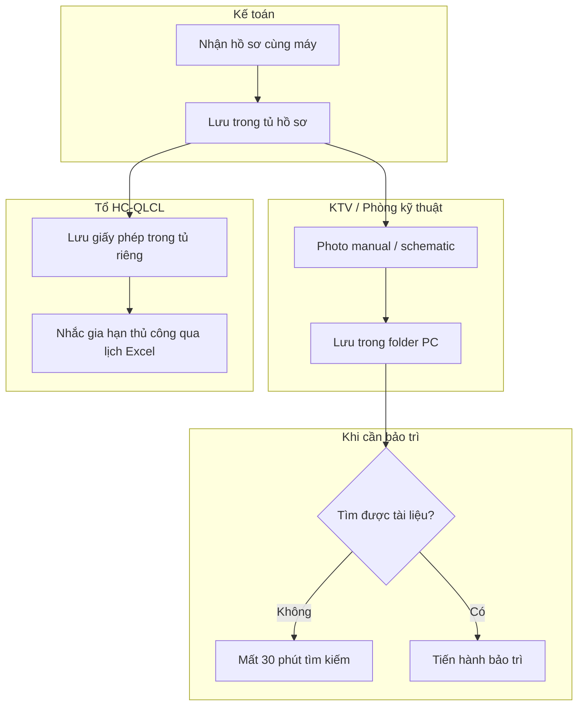
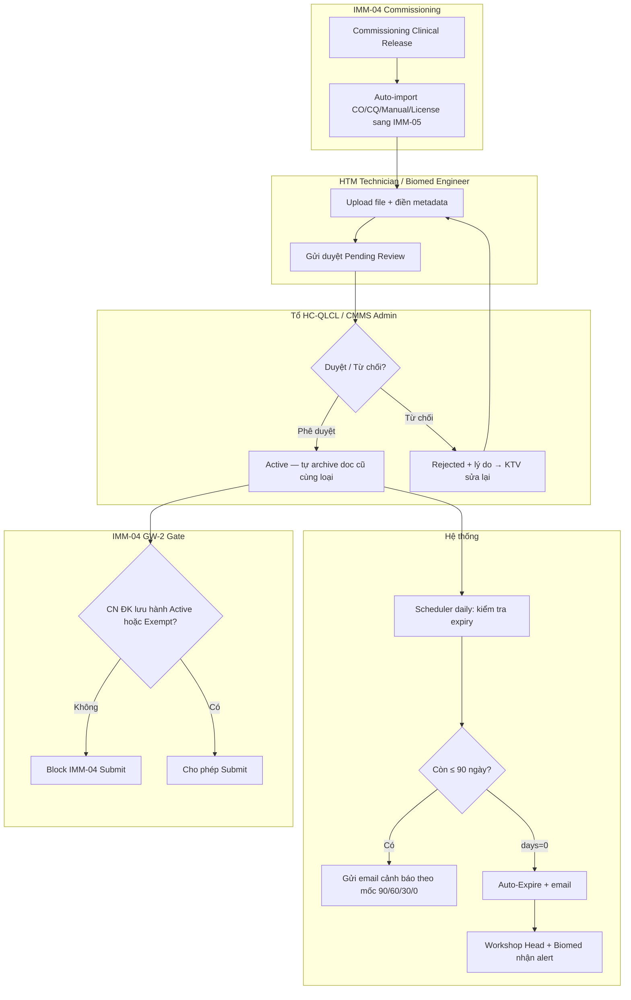
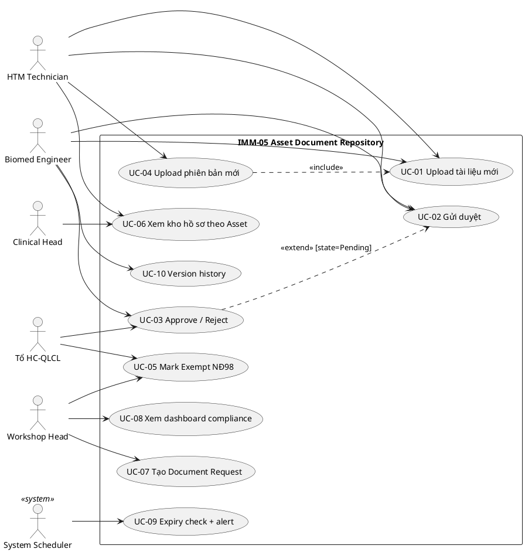
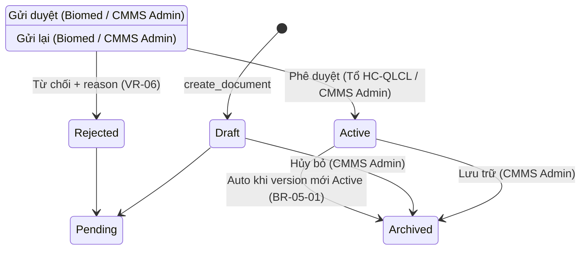

# 02 — Phân tích thiết kế nghiệp vụ (Analysis & Design)

| Mục | Giá trị |
|---|---|
| Module | IMM-05 — Hồ sơ Thiết bị (Asset Document Repository) |
| Phạm vi | Per-module |
| Owner | BA + System Analyst |
| Liên kết | 03 Diagrams · 04 Backend · 05 API · 06 Frontend |

> **Mục đích**: Phân tích nghiệp vụ end-to-end — module overview, quy trình BPMN, use case UML, functional specs. Đây là hợp đồng giữa BA và Dev.

---

# Phần I — Module Overview

## I.0. Khảo sát hiện trạng

**As-Is — Trước khi có hệ thống:** Tại phần lớn bệnh viện Việt Nam, hồ sơ thiết bị y tế được lưu trữ theo mô hình phân tán: CO/CQ trong bộ hồ sơ mua hàng (kế toán giữ), user manual trong phòng kỹ thuật (đôi khi photocopy), giấy phép bức xạ/đăng ký lưu hành trong tủ văn phòng HC-QLCL. Không có hệ thống liên kết hồ sơ theo từng thiết bị cụ thể. Khi cần bảo trì, KTV tìm tài liệu mất 15-30 phút. Khi có đoàn kiểm tra BYT, xuất trình đầy đủ hồ sơ có thể mất hàng ngày.

**Hạn chế chính:** (1) Hồ sơ thất lạc sau khi thiết bị chuyển vị trí hoặc nhân viên nghỉ việc. (2) Không theo dõi hạn hiệu lực — giấy phép hết hạn mà không ai biết cho đến khi bị thanh tra. (3) Không kiểm soát phiên bản — nhiều bản user manual khác nhau lưu tản mát. (4) Không tích hợp với quy trình commissioning — hồ sơ nhận cùng máy không được lưu hệ thống.

## I.1. Pitch

IMM-05 là **Document Repository tập trung** cho toàn bộ hồ sơ kỹ thuật, pháp lý, kiểm định và đào tạo gắn với từng thiết bị trong suốt vòng đời. Thay vì hồ sơ phân tán theo phòng ban, IMM-05 tổ chức theo từng `Asset` (per-instance) hoặc `Item` (per-model), có kiểm soát phiên bản, workflow duyệt, cảnh báo hết hạn tự động và compliance gate bắt buộc trước khi thiết bị đưa vào vận hành. Kết quả đo được: 0 hồ sơ thất lạc, 100% cảnh báo hết hạn trước 90 ngày, rút ngắn thời gian tìm tài liệu từ 30 phút xuống < 1 phút.

## I.2. Vị trí trong WHO HTM lifecycle

| Phase | Có liên quan? | Ghi chú |
|---|---|---|
| Procurement | ✅ INPUT | Nhận CO/CQ/Manual từ IMM-04 auto-import |
| Installation | ✅ OUTPUT | GW-2 gate — cung cấp điều kiện đầu vào cho IMM-04 Submit |
| Operation | ✅ CROSS-CUTTING | Cung cấp manual, schematic cho IMM-08/09/11 |
| Maintenance | ✅ OUTPUT | KTV xem manual khi bảo trì / hiệu chuẩn |
| Calibration | ✅ BOTH | Nhận chứng chỉ hiệu chuẩn sau mỗi cycle (IMM-11) |
| Decommission | ✅ OUTPUT | Auto-archive toàn bộ doc khi Asset decommissioned (IMM-13) |

IMM-05 là module **cross-cutting xuyên suốt từ Procurement → Decommission** theo WHO HTM Documentation §3.2. Vận hành song song với mọi module IMM-xx.

## I.3. Stakeholders & Actors

| Vai trò | Người dùng thực | Quan tâm chính | Tần suất | Loại |
|---|---|---|---|---|
| HTM Technician | KTV HTM | Upload hồ sơ, điền metadata | Hàng ngày | Primary |
| Biomed Engineer | Kỹ sư Biomedical | Review tài liệu kỹ thuật, gửi duyệt | Hàng tuần | Primary |
| Tổ HC-QLCL | Tổ Hành chính - QLCL | Duyệt hồ sơ pháp lý, mark exempt | Hàng tuần | Approver |
| Workshop Head | Trưởng phân xưởng | Quản lý kho hồ sơ, escalation | Hàng ngày | Approver |
| VP Block2 | Phó Trưởng Khối 2 | Nhận escalation, báo cáo compliance | Hàng tuần | Approver |
| Clinical Head | Trưởng Khoa | Xem hồ sơ Public của thiết bị tại khoa | Theo yêu cầu | Secondary |
| System (Scheduler) | Frappe scheduler | Auto-expire, expiry alert, completeness | Daily 00:30, 01:00 | System |
| Kiểm toán nội bộ | Auditor QLCL | Xem version history, compliance report | Định kỳ | Auditor |

## I.4. Scope

**In-scope:**
- DocType `Asset Document` (per-instance + per-model level)
- DocType `Document Request` (task quản lý doc thiếu, deadline, escalation)
- DocType `Required Document Type` (master config bộ hồ sơ bắt buộc)
- Workflow 6 states + 10 transitions
- 14 REST endpoints (`assetcore/api/imm05.py`)
- Version control: auto-archive version cũ khi version mới Active
- Auto-import từ IMM-04 khi commissioning submit
- Expiry alert scheduler 90/60/30/0 ngày
- GW-2 Compliance Gate cho IMM-04
- Visibility control (Public / Internal_Only)
- Mark Exempt NĐ98 flow

**Out-of-scope:**
- Quản lý hợp đồng vendor (IMM-02)
- Lịch đào tạo nhân viên (IMM-06)
- Lịch hiệu chuẩn định kỳ (IMM-11 — chỉ nhận chứng chỉ kết quả)
- CAPA management (IMM-12/16)
- Electronic signature / chữ ký số (v3.0)
- FHIR/HIS integration (Phase 2)

**Assumptions:**
- `Asset` record đã tồn tại (do IMM-04 mint hoặc import)
- `Required Document Type` master đã được seed (CO, CQ, Manual, CN ĐK lưu hành…)
- File upload qua Frappe File API thông thường (max 25MB)

**Dependencies:**
- IMM-04 (Asset Commissioning): `on_submit` trigger `create_initial_document_set`; ngược lại GW-2 query
- IMM-11 (Calibration): lưu chứng chỉ sau mỗi cycle
- IMM-13 (Decommission): auto-archive toàn bộ khi Asset retired
- Frappe `Version` DocType: audit trail mọi thay đổi

## I.5. KPI mục tiêu

| KPI | Định nghĩa | Baseline | Target | Đo ở đâu |
|---|---|---|---|---|
| KPI-05-01: Tỷ lệ Asset có đủ hồ sơ bắt buộc | % Asset có `completeness_pct ≥ 100%` theo Required Document Type | Không đo được | ≥ 90% | `get_compliance_by_dept` |
| KPI-05-02: Tỷ lệ hồ sơ sắp hết hạn được gia hạn | % doc `Expiring_Soon` được upload phiên bản mới trước ngày hết hạn | 0% (as-is) | ≥ 95% | `get_expiring_documents` tracking |
| KPI-05-03: Thời gian upload → Active | Trung bình ngày từ Draft → Active | N/A | ≤ 3 ngày làm việc | Frappe Version timestamp delta |
| KPI-05-04: Tỷ lệ GW-2 block tháo gỡ trong SLA | % GW-2 block được giải quyết (upload/exempt) trong 5 ngày | N/A | ≥ 85% | Document Request tracking |
| KPI-05-05: % alert idempotent | Không có Expiry Alert Log trùng per (asset_document, alert_date) | — | 100% | Scheduler log |
| KPI-05-06: Số ĐKLH BYT sắp/đã hết hạn | # thiết bị có `AC Asset.byt_reg_expiry ∈ [today, today+30]` (sắp) và `< today` (đã hết). Loại bản ghi chưa khai ĐKLH (NULL/''). DRILLABLE: tile → `/assets?byt_status=expiring\|expired` | *(Cần khảo sát baseline)* | → 0 thiết bị đang khai thác lâm sàng có ĐKLH hết hạn | `dashboard.get_overview().assets.byt_expiring_30d/byt_expired` (count) + `list_assets(byt_status=…)` (drill) — SoT `byt_expiry_filter` (BR-00-17) |

> **Quan hệ IMM-05 ↔ IMM-00 (NĐ98/2021):** Số ĐKLH lưu hành (`AC Asset.byt_reg_no` + `byt_reg_expiry`) là **điều kiện pháp lý lưu hành** của thiết bị y tế theo NĐ98/2021 — khác với hồ sơ tài liệu (Asset Document) do IMM-05 quản lý nội dung. Predicate "sắp/đã hết hạn ĐKLH" là SoT DUY NHẤT `byt_expiry_filter(bucket)` tại IMM-00 (field + endpoint `list_assets`/`get_overview` cư trú ở IMM-00), tiêu thụ bởi 2 tile compliance NĐ98 trên dashboard quản trị thiết bị. KPI-05-06 đo cùng SoT đó. Chi tiết: BR-00-17 + [imm-00/04 §III.1a](../imm-00/04_Backend_Design.md); FE: [imm-00/06 §III.10c](../imm-00/06_Frontend_Design.md).
>
> **Self-Correction (Vòng 31):** Thiết kế gốc đếm ĐKLH bằng **literal inline** (`api/dashboard.py:62-63`) + `list_assets` thiếu param `byt_status` → ô KPI NĐ98 không drill & không có tile/chip tiêu thụ. Fix giống BR-05-15: rút về **một** SoT `byt_expiry_filter`, gọi từ cả count + drill → tile == danh sách byte-for-byte.

## I.6. Ràng buộc Compliance

| Quy định | Yêu cầu áp lên module | Doc tham chiếu |
|---|---|---|
| NĐ 98/2021/NĐ-CP | Thiết bị Y tế phải có Chứng nhận ĐK lưu hành — GW-2 gate; lưu hồ sơ ≥ 10 năm | Điều 28-32, Điều 41 |
| WHO HTM Annex 7 | Documentation & record keeping; cảnh báo expiry | WHO HTM §3.2, Annex 7 |
| ISO 13485:2016 | Document control: version, approval, DHF/DMR per asset | §4.2, §4.2.4, §4.2.5 |
| NĐ 142/2020/NĐ-CP | Giấy phép bức xạ phải lưu và theo dõi hiệu lực | Điều 25 |

## I.7. Risk & Open questions

**Risk:**

| Risk | Likelihood | Impact | Giảm thiểu |
|---|---|---|---|
| Service layer `services/imm05.py` chưa tồn tại — logic trong controller | High | Medium | Refactor kế hoạch Sprint 10 |
| Email notification template inline string trong tasks.py | Medium | Low | Tạo Email Template Frappe DocType |
| Dashboard frontend KPI panel chưa build | Medium | Medium | Sprint 9 |
| Auto-import IMM-04 → IMM-05 chưa có E2E test đầy đủ | Medium | High | UAT sprint kế tiếp |
| Compliance tính on-the-fly bằng SQL EXISTS — performance khi >10k docs | Low | Medium | Thêm composite index nếu cần |

**Open questions:**

| Câu hỏi | Owner | Deadline |
|---|---|---|
| Refactor service layer `services/imm05.py` — Sprint nào? | Tech Lead | Sprint 10 |
| Email template DocType cho expiry notification? | BA + Tech | Sprint 9 |
| Dashboard frontend component? | FE Dev | Sprint 9 |
| Retention policy — archive sau 10 năm hay indefinite? | Legal + QLCL | Sprint 8 |

## I.8. Roadmap thực thi

| Sprint | Hạng mục | Owner | Status |
|---|---|---|---|
| Sprint 4 | DocType schema 3 DocTypes | BE Dev | ✅ DONE |
| Sprint 5 | Workflow 6 states + VR-01 → VR-11 | BE Dev | ✅ DONE |
| Sprint 5 | API layer 14 endpoints | BE Dev | ✅ DONE |
| Sprint 6 | Scheduler 3 jobs + expiry alert | BE Dev | ✅ DONE |
| Sprint 6 | Frontend List / Detail / Create | FE Dev | ✅ DONE |
| Sprint 7 | Asset Documents tab | FE Dev | ✅ DONE |
| Sprint 8 | Retention policy definition | BA + Legal | ⚠️ TODO |
| Sprint 9 | Dashboard frontend KPI panel | FE Dev | ❌ TODO |
| Sprint 9 | Email template DocType | BE Dev | ❌ TODO |
| Sprint 10 | Refactor → `services/imm05.py` | Tech Lead | ❌ TODO |

---

# Phần II — Quy trình nghiệp vụ (Business Process / BPMN)

## II.2. As-Is process

Hồ sơ thiết bị được quản lý thủ công: CO/CQ lưu tại kế toán, user manual tại phòng kỹ thuật, giấy phép tại HC-QLCL. Không có hệ thống liên kết, không theo dõi hết hạn, không kiểm soát phiên bản.



## II.3. Pain points

| # | Pain | Tác động |
|---|---|---|
| 1 | Hồ sơ thất lạc khi nhân viên nghỉ việc hoặc thiết bị di chuyển | Không có tài liệu khi bảo trì khẩn cấp |
| 2 | Không theo dõi hạn hiệu lực tự động | Vi phạm pháp lý không phát hiện cho đến khi bị kiểm tra |
| 3 | Không kiểm soát phiên bản — nhiều bản doc khác nhau tản mát | KTV dùng tài liệu lỗi thời, dẫn đến sai thao tác |
| 4 | Không có compliance gate bắt buộc | Thiết bị đưa vào vận hành mà chưa có CN ĐK lưu hành |
| 5 | Không audit trail — không biết ai upload, ai duyệt gì | Không đáp ứng kiểm toán ISO 13485 |

## II.4. To-Be process (với AssetCore)



## II.5. Decision points

| Điểm | Câu hỏi | Quy tắc |
|---|---|---|
| Approve / Reject | Doc đúng chuẩn? | Tổ HC-QLCL / CMMS Admin duyệt; reject yêu cầu lý do (VR-06) |
| Auto-archive | Đã có doc Active cùng (asset + doc_type_detail)? | Archive cũ khi doc mới được Active (BR-05-01) |
| Expiry alert | days_until_expiry ∈ {90, 60, 30, 0}? | Sinh Expiry Alert Log idempotent; days=0 → auto-Expire |
| GW-2 | Có CN ĐK lưu hành Active hoặc is_exempt=1? | Block IMM-04 Submit nếu không (BR-05-07) |
| Visibility | doc.visibility == Internal_Only? | Ẩn với Clinical Head và non-internal roles |
| Exempt | doc_type_detail ∈ EXEMPT_DOC_TYPES? | Chỉ "CN ĐK lưu hành" và "Giấy phép NK" được exempt (VR-11) |

## II.6. Process metrics

| Metric | Mục tiêu | Đo ở đâu |
|---|---|---|
| Thời gian Draft → Active | ≤ 3 ngày | Frappe Version timestamp delta |
| % doc Active có expiry cảnh báo kịp thời | 100% (không miss mốc 90d) | Expiry Alert Log |
| % Asset completeness ≥ 100% | ≥ 90% | `get_compliance_by_dept` |
| GW-2 block tháo gỡ trong 5 ngày | ≥ 85% | Document Request status |

## II.7. RACI matrix

| Hoạt động | HTM Tech | Biomed | Tổ HC-QLCL | Workshop Head | VP Block2 | Scheduler |
|---|---|---|---|---|---|---|
| Upload doc | R/A | R/A | C | C | — | — |
| Submit review | R/A | R/A | C | C | — | — |
| Approve | — | — | R/A | — | — | — |
| Reject | — | — | R/A | — | — | — |
| Mark Exempt | — | — | R/A | R/A | — | — |
| Escalation | I | I | C | R/A | I | Auto |
| Audit trail | I | I | I | I | I | I |

## II.8. Exception flow

**Exception 1 — Upload doc có expiry đã hết hạn:** VR-01/VR-07 kiểm tra expiry_date > issued_date. Nếu expiry < today → block với thông báo "VR-01: Ngày hết hạn phải sau ngày cấp". Reviewer phải xác nhận trước khi approve (thường chỉ cho doc legacy khi backfill).

**Exception 2 — Reject sau approve:** Sau khi doc đã Active, nếu phát hiện sai sót → không reject được (VR-05 block). Cách xử lý đúng: upload phiên bản mới → submit review → approve → doc cũ auto-archive.

**Exception 3 — GW-2 block khi không có CN ĐK lưu hành:** Thiết bị Exempt NĐ98 → Tổ HC-QLCL gọi `mark_exempt` với văn bản chứng minh. Tạo Asset Document `is_exempt=1`, workflow_state=Active → GW-2 unblock.

## II.9. So sánh As-Is vs To-Be

| Khía cạnh | As-Is | To-Be (AssetCore) |
|---|---|---|
| Lưu trữ hồ sơ | Phân tán theo phòng ban | Tập trung per-Asset, searchable |
| Kiểm soát phiên bản | Không có | Auto-archive version cũ khi mới Active |
| Theo dõi hết hạn | Excel thủ công | Scheduler daily, alert 90/60/30/0 ngày |
| Compliance gate | Không có | GW-2 block IMM-04 nếu thiếu CN ĐK lưu hành |
| Audit trail | Không có | Frappe Version tự động per thao tác |
| Thời gian tìm hồ sơ | 15-30 phút | < 1 phút (search by asset/category/type) |

## II.10. Activity diagram per UC chính

### UC-05-03: Approve tài liệu


### UC-05-06: Scheduler Expiry Alert

```mermaid
flowchart TD
    Start([Scheduler Daily 00:30]) --> A[Loop milestone: 90, 60, 30, 0 ngày]
    A --> B[target_date = today + milestone]
    B --> C[Query Asset Document Active có expiry_date = target_date]
    C --> D{Doc nào?}
    D -->|Không| A
    D -->|Có| E{Expiry Alert Log đã có (doc, today)?}
    E -->|Có| A
    E -->|Không| F[Tạo Expiry Alert Log]
    F --> G{milestone = 0 (đã quá hạn)?}
    G -->|Có| H[Set is_expired=1 cờ derived — KHÔNG đổi workflow_state, BR-05-16]
    G -->|Không| I[Send email theo mức]
    H --> I
    I --> A
    A -->|Xong tất cả milestone| End([Kết thúc])
```

---

# Phần III — Use Case Specification (UML)

## III.1. Use Case Diagram

### III.1.a. Biểu đồ use case tổng quát



## III.2. Actor catalog

| Actor | Loại | Mô tả | Goal chính |
|---|---|---|---|
| HTM Technician | Primary | KTV HTM | Upload và maintain hồ sơ |
| Biomed Engineer | Primary | Kỹ sư Biomedical | Review, submit, xem doc kỹ thuật |
| Tổ HC-QLCL | Approver | Tổ HC-QLCL | Duyệt hồ sơ pháp lý, exempt |
| Workshop Head | Approver | Trưởng phân xưởng | Quản lý kho hồ sơ, escalation |
| Clinical Head | Secondary | Trưởng Khoa | Xem hồ sơ Public của khoa |
| System Scheduler | System | Frappe | Auto-expire, alert, completeness |
| Auditor | Auditor | Kiểm toán QLCL | Version history, compliance audit |

## III.3. Use Case Specifications

### UC-01: Upload tài liệu mới

| Mục | Giá trị |
|---|---|
| ID | UC-IMM05-01 |
| Brief | HTM Technician upload file tài liệu cho 1 Asset + điền metadata |
| Primary actor | HTM Technician / Biomed Engineer |
| Pre-condition | Asset tồn tại; user có role upload |
| Post-condition | `Asset Document` ở Draft, version="1.0" |
| Trigger | KTV click "Upload tài liệu mới" |

#### Main flow
| Bước | Actor | System |
|---|---|---|
| 1 | Chọn Asset | Gọi `get_asset_documents` để xem doc đã có |
| 2 | Chọn doc_category, doc_type_detail, điền metadata | Validate VR-04 (legal → issuing_authority) |
| 3 | Upload file | Validate VR-08 (extension) |
| 4 | Nhấn "Lưu Draft" | Gọi `create_document` |
| 5 | — | Trả name `DOC-{asset}-{YYYY}-{#####}`, workflow_state=Draft |

#### Exception E1 — File format không hợp lệ
- 3a. Hệ thống block với "VR-08: Định dạng file không hợp lệ (.xlsx)"

### UC-03: Approve / Reject tài liệu

| Mục | Giá trị |
|---|---|
| ID | UC-IMM05-03 |
| Brief | Reviewer phê duyệt hoặc từ chối doc đang Pending Review |
| Primary actor | Tổ HC-QLCL / CMMS Admin |
| Pre-condition | Doc ở Pending Review; user thuộc _APPROVE_ROLES |
| Post-condition | Doc ở Active (version cũ Archived) hoặc Rejected |
| Trigger | Reviewer nhấn Approve hoặc Reject |

#### Main flow — Approve
| Bước | Actor | System |
|---|---|---|
| 1 | Click Approve | Gọi `approve_document(name)` |
| 2 | — | Validate role thuộc _APPROVE_ROLES |
| 3 | — | Query Active docs cùng (asset + doc_type_detail) |
| 4 | — | Archive doc cũ (superseded_by = new doc, archive_date = today) |
| 5 | — | Set Active, approved_by, approval_date |

#### Alternative A1 — Reject
- 1a. Reviewer click Reject → modal yêu cầu rejection_reason
- 2a. POST `reject_document(name, rejection_reason)` → Doc chuyển Rejected
- 3a. KTV nhận thông báo và sửa lại (VR-06 enforce rejection_reason)

## III.4. Use Case relationships

**`<<include>>`:**
| Caller UC | Included UC | Lý do |
|---|---|---|
| UC-04 Upload phiên bản mới | UC-01 Upload tài liệu mới | Tạo doc mới (version N+1) |

**`<<extend>>`:**
| Base UC | Extension | Điều kiện |
|---|---|---|
| UC-03 Approve | UC-10 Version history | Sau approve, tự động log via Frappe Version |

## III.5. UC ↔ User Story mapping

| Use Case | US ID | Note |
|---|---|---|
| UC-01 | US-05-01 | Upload tài liệu mới |
| UC-03 | US-05-02 | Approve / Reject |
| Auto-import | US-05-03 | System auto-import từ IMM-04 |
| UC-09 | US-05-04 | Cảnh báo hết hạn |
| UC-08 | US-05-05 | Dashboard |
| UC-06 | US-05-06 | Xem kho hồ sơ theo Asset |
| UC-04 | US-05-07 | Version control |
| UC-07 | US-05-08 | Document Request |
| UC-05 | US-05-09 | Mark Exempt |

---

# Phần IV — Functional Specifications

## IV.1. User Stories & Acceptance Criteria

### US-05-01 — Upload tài liệu mới
**Là HTM Technician, tôi muốn upload hồ sơ cho thiết bị với metadata đầy đủ, để tài liệu được lưu trữ tập trung và sẵn sàng cho người duyệt.**
- Priority: Must | Estimate: 2 SP

**AC-01:**
- Given: tôi có role HTM Technician, Asset "AC-ASSET-2026-0001" tồn tại
- When: POST `create_document` với `{asset_ref, doc_category="Legal", doc_type_detail, doc_number, issued_date, file_attachment}`
- Then: response.success=true, name khớp `DOC-AC-ASSET-2026-0001-2026-\d{5}`, workflow_state=Draft, version=1.0

**AC-02 — VR-08 file format:**
- Given: tôi upload file .xlsx
- When: POST
- Then: response.success=false, error chứa "VR-08: Định dạng file không hợp lệ (.xlsx)"

### US-05-02 — Approve auto-archive version cũ
**Là Tổ HC-QLCL, tôi muốn phê duyệt tài liệu và hệ thống tự archive phiên bản cũ, để chỉ có 1 Active doc per loại.**
- Priority: Must | Estimate: 3 SP

**AC-01:**
- Given: doc cũ DOC-001 ở Active, doc mới DOC-002 ở Pending Review (cùng asset + doc_type_detail)
- When: `approve_document("DOC-002")`
- Then: DOC-002.workflow_state=Active; DOC-001.workflow_state=Archived; DOC-001.superseded_by=DOC-002

**AC-02 — Reject thiếu reason:**
- Given: doc ở Pending Review
- When: `reject_document(name)` thiếu `rejection_reason`
- Then: response.success=false, code="VALIDATION_ERROR" (VR-06)

## IV.2. Business Rules

| ID | Rule | Implement ở | Chuẩn |
|---|---|---|---|
| BR-05-01 | 1 Active doc per (asset_ref + doc_type_detail) | `archive_old_versions()` on `on_update` + `approve_document` | Internal |
| BR-05-02 | Không xóa cứng — chỉ archive | `on_trash()` throw | NĐ98 |
| BR-05-03 | Expiry alert 90/60/30/0 idempotent | `check_document_expiry` daily | WHO HTM |
| BR-05-04 | Auto-import từ IMM-04 khi `Clinical Release` (state space) | IMM-04 `on_submit` hook | Internal |
| BR-05-05 | Bộ hồ sơ bắt buộc qua `Required Document Type` | `update_asset_completeness` | ISO 13485 |
| BR-05-06 | `is_model_level=1` áp dụng toàn bộ asset cùng model | UI filter + report | Internal |
| BR-05-07 | GW-2: Block IMM-04 Submit nếu thiếu CN ĐK lưu hành + không exempt | IMM-04 `validate()` | NĐ98 |
| BR-05-08 | Exempt → `document_status = "Compliant (Exempt)"` | `_compute_document_status()` | NĐ98 |
| BR-05-09 | `change_summary` bắt buộc khi version ≠ "1.0" | VR-09 trong `validate()` | ISO 13485 |
| BR-05-10 | `Internal_Only` ẩn với non-internal roles | `_apply_visibility_filter()` | Internal |
| BR-05-11 | Khấu hao thực thi KHÔNG sàn book value tại 0 — sàn tại `residual_value` (INV-DEP-1) | `run_due_depreciation()` `new_book = max(gross − new_acc, residual)` | NĐ98 / Kế toán VN |
| BR-05-12 | Lũy kế khấu hao KHÔNG vượt `depreciable_base = gross − residual` (INV-DEP-2) | `run_due_depreciation()` `new_acc = min(prev + inc, base)` | Kế toán VN |
| BR-05-13 | Book value header (Executor) == `remaining_value` dòng cuối (Planner) sau kỳ cuối, chênh ≤ 0.01 (INV-DEP-3) | `run_due_depreciation()` ↔ `generate_schedule()` đồng công thức sàn | Internal |
| BR-05-14 | Idempotent: chạy lại Executor khi hết Pending tới hạn → header không đổi, `executed_rows=0` (INV-DEP-4) | `run_due_depreciation()` chỉ cộng dòng Pending | Internal |
| BR-05-15 | "Hết khấu hao" (`fully_depreciated`) có **một** predicate SoT: `is_fully_depreciated(row)` = `configured ∧ current_book_value ≤ residual_value + 1`, với `configured = method ∧ method≠'None' ∧ gross>0 ∧ months>0`. KPI count == drill rows (INV-DEP-5) | `services/depreciation.py::is_fully_depreciated`; gọi bởi `get_depreciation_stats` (count) **và** `list_assets_depreciation(depreciation_filter='fully_depreciated')` (drill) | Internal |
| BR-05-16 | "Đã hết hạn" (`expired`) có **một** predicate SoT `EXPIRED_FILTER` = `expiry_date IS NOT NULL ∧ expiry_date < today ∧ workflow_state NOT IN ('Archived','Rejected')`. Dùng **Y HỆT** cho KPI count (`get_dashboard_stats().kpis.expired_not_renewed`) **và** drill (`list_documents`). KPI count == drill `len(items)`, chênh = 0 cho mọi tập dữ liệu (INV-EXP-1). Predicate KHÔNG dùng `workflow_state='Expired'` (dead-state, không transition nào dẫn vào) | `services/imm05.py::EXPIRED_FILTER` (dict filter Frappe-style) gọi bởi `get_dashboard_stats` (count) **và** mở rộng filter trong `list_documents` khi FE gửi marker `expired`; FE `documentFilters.ts::buildKpiFilter('expired')` + `buildExpiryFilter('expired')` cùng emit `{expiry_status:'expired'}` | NĐ98 Điều 41 |
| BR-05-17 | **Mẫu số ÁP DỤNG:** `required_total` của 1 asset = số `Required Document Type.is_mandatory=1` **áp dụng cho asset đó**: `applies_to_asset_category` rỗng/NULL ⇒ áp mọi nhóm; có giá trị ⇒ chỉ khi `== AC Asset.asset_category`. `required_total == 0 ⇒ completeness_pct = 100` (không chia 0) và UI phải nói rõ "không có loại bắt buộc áp dụng" thay vì khoe 100% | `services/imm05.py::get_asset_documents` | ISO 13485 / NĐ98 |
| BR-05-18 | **Đủ hồ sơ = CÓ MẶT ∧ CÒN HIỆU LỰC:** một loại bắt buộc chỉ `satisfied` khi có ≥1 bản `workflow_state='Active'` **và** KHÔNG quá hạn theo đúng predicate SSoT BR-05-16. Loại có bản Active nhưng đã quá hạn ⇒ `expired_required[]` (KHÔNG phải `missing_required[]`). `missing ∩ expired = ∅`; `|missing| + |expired| = required_total − required_satisfied` (INV-DOC-2) | `services/imm05.py::is_expired_row` (song sinh Python của `expired_filter()`, INV-EXP-2) | NĐ98 Điều 41 |
| BR-05-19 | **Một bộ từ vựng trạng thái:** `document_status` chỉ nhận 5 giá trị SSoT của `_compute_document_status()` (`Compliant` / `Compliant (Exempt)` / `Expiring_Soon` / `Non-Compliant` / `Incomplete`) — cấm phát `Complete`/`Incomplete` song song. Kèm khoá máy-đọc `is_compliant ∈ {0,1}` để consumer KHÔNG so chuỗi; `is_compliant == int(required_satisfied == required_total)` (INV-DOC-3). `Expiring_Soon` (ngưỡng 30 ngày = tier `Critical` của `_ALERT_THRESHOLDS`) KHÔNG kéo `is_compliant` xuống 0 | `_compute_document_status()` gọi từ `get_asset_documents` với đối số `is_exempt` **đã thu hẹp** (ADR-IMM05-02) | NĐ98 |
| BR-05-20 | **Tỷ lệ tuân thủ là sự thật của TỔ CHỨC, không phải của người xem:** `required_*` / `completeness_pct` / 3 mảng / `document_status` tính trên **toàn bộ** hồ sơ của asset (bỏ `_apply_visibility_filter`); riêng danh sách hiển thị `documents` vẫn lọc theo visibility, kèm `hidden_count` = số bản bị ẩn. Truy vấn hiển thị chạy TRƯỚC truy vấn tính toán để giữ nguyên role-gate/row-scope (403 in-envelope) | `get_asset_documents` — query V `scope="user"` rồi query C `scope="internal"` | Internal / NĐ98 |
| BR-05-21 | **Cờ hết hạn do SERVER dẫn xuất lúc đọc:** mỗi dòng tài liệu trả `is_expired ∈ {0,1}` tính tại thời điểm đọc theo predicate BR-05-16 (bản `Archived`/`Rejected` dù quá hạn ⇒ `0`); `days_until_expiry` cũng dẫn xuất theo server clock. Cấm trả cột đã lưu `Asset Document.is_expired` (chỉ đúng tới lần save cuối), cấm client so ngày bằng đồng hồ máy | `get_asset_documents` (dẫn xuất) — cột DB giữ nguyên cho scheduler | WHO HTM / NĐ98 Điều 41 |
| BR-05-22 | **Hồ sơ phải MỞ ĐƯỢC, không chỉ LIỆT KÊ ĐƯỢC:** mỗi dòng trong `documents[]` của `get_asset_documents` LUÔN có 5 khoá tệp `file_url` (str, rỗng = `""`), `file_name` (str), `file_size` (int BYTE), `is_private` (int 0\|1), `has_file` (int 0\|1) — kể cả dòng chưa đính tệp. Cờ dùng **int**, KHÔNG boolean (quirk CR-01) | `services/imm05.py::get_asset_documents` (nhánh hiển thị V) | NĐ98 Điều 41 (bằng chứng phải truy xuất được) |
| BR-05-23 | **KHÔNG phát LINK CHẾT:** `has_file = 1` ⟺ `file_attachment` non-empty **∧** File doc tương ứng TỒN TẠI. Link mồ côi (trỏ URL không còn `File`) ⇒ `has_file = 0` ∧ 4 khoá còn lại rỗng; `file_attachment` **thô** không bao giờ ra response. Nút «Mở tệp» dẫn tới 404 khiến người dùng tin bệnh viện MẤT hồ sơ — nhãn «Chưa đính kèm tệp» nói đúng việc phải làm | `_resolve_file_meta()` + `pop("file_attachment")` trong `get_asset_documents` | NĐ98 Điều 41 |
| BR-05-24 | **Metadata tệp resolve theo LÔ, 1 truy vấn:** toàn payload dùng ĐÚNG 1 query `File` theo tập `file_url` đã dedup (0 query khi tập rỗng) — số truy vấn KHÔNG tăng theo số dòng hồ sơ (INV-FILE-4) | `_resolve_file_meta(urls)` gọi **ngoài** vòng lặp dòng | Internal (hiệu năng) |
| BR-05-25 | **Metadata tệp KHÔNG được nới quyền:** tập URL đưa vào resolve CHỈ lấy từ các dòng ĐƯỢC XEM (đã qua `_apply_visibility_filter`) ⇒ `file_url` của dòng bị ẩn KHÔNG bao giờ ra response; `hidden_count` vẫn đếm đúng. Query `File` chạy system-scope và chỉ đọc 4 field metadata (không đọc nội dung tệp) để tránh dead-gate với persona không có DocPerm `File` | `get_asset_documents` (tập V) + `_resolve_file_meta(..., ignore_permissions=True)` | Internal / NĐ98 |

> **Self-Correction (Vòng 2):** BR-05-11..14 vá lỗi thiết kế gốc — Executor cũ sàn tại `0.0` (`depreciation.py:252`) và không chặn trần lũy kế (`:251`), lệch với Planner (sàn tại residual, `:174`). Chi tiết invariant + công thức: [04 Backend §2.5](./04_Backend_Design.md).
>
> **Self-Correction (Vòng 30):** BR-05-15 vá lỗi thiết kế gốc của read-path "Hết khấu hao" — biểu thức `book ≤ residual + 1` được **inline** trong `get_depreciation_stats` (`api/imm00.py:2242`) cho card count, nhưng `list_assets_depreciation` **không có** predicate này nên ô KPI không drill được (FE `DepreciationView.vue:189` là text câm; status-filter `:271` thiếu lựa chọn "Hết khấu hao"). Fix: rút predicate về **một** hàm SoT module-level `is_fully_depreciated(row)`, gọi từ cả 2 read-path → card count == drill rows (đo bằng INV-DEP-5). Chi tiết: [04 Backend §2.5](./04_Backend_Design.md); API: [imm-00/05 §III.18](../imm-00/05_API_Specification.md); FE: [imm-00/06 §III.10b](../imm-00/06_Frontend_Design.md).
>
> **Self-Correction (Vòng 19):** BR-05-16 vá lỗi thiết kế gốc count-vs-drill divergence của KPI "Đã hết hạn". **Root cause = 2 nguồn sự thật ≠ + 1 dead-state.** (1) State machine §IV.3 *khai báo* transition `Active --> Expired: Auto khi days_until_expiry=0 (Scheduler)` NHƯNG scheduler `check_document_expiry` (`imm05.py:82`) CHỈ set `is_expired=1`, KHÔNG đổi `workflow_state` → `Expired` là **dead-state**: workflow JSON `imm_05_document_workflow.json` không có transition nào dẫn vào (xác nhận: 9 transition, không có cái nào `next_state=Expired`). (2) Count `get_dashboard_stats` (`imm05.py:342`) đếm `{expiry_date < today}` thuần — gồm CẢ Archived/Rejected (over-count compliance, vi phạm NĐ98: doc đã thu hồi/lưu trữ không phải gap còn sống). (3) Drill FE `buildKpiFilter('expired')`/`buildExpiryFilter('expired')` (`documentFilters.ts:62,85`) emit `{workflow_state:'Expired'}` → BE query 0 dòng → tile báo N nhưng list rỗng → **che giấu hồ sơ quá hạn còn hiệu lực** (Active/Draft/Pending Review quá hạn = thiết bị vận hành với giấy phép hết hạn, NĐ98 Điều 41 BẮT BUỘC hiện). Fix: (a) rút về **một** SoT `EXPIRED_FILTER` dùng cho cả count + drill; (b) FE đổi marker `expired` thành `{expiry_status:'expired'}` (semantic flag, không phải literal state), BE `list_documents` dịch marker này thành `EXPIRED_FILTER`; (c) loại dead-state khỏi mọi filter builder (grep-guard: không còn literal `{workflow_state:'Expired'}`); (d) sửa state machine §IV.3 — gỡ transition phantom `Active→Expired`, ghi rõ "hết hạn" là **derived attribute** (`is_expired` + `EXPIRED_FILTER`), KHÔNG phải workflow_state. Đo bằng INV-EXP-1 (count == drill, chênh=0). Chi tiết: [04 Backend §2.6](./04_Backend_Design.md); API: [05 §2.1 + §2.8](./05_API_Specification.md); FE: [06 §3](./06_Frontend_Design.md).
>
> **Self-Correction (CR-75):** BR-05-17..21 vá lỗi thiết kế gốc của **read-path asset-centric** `get_asset_documents` — cùng họ lỗi với BR-05-15/16 (một khái niệm, nhiều nguồn sự thật) nhưng ở màn "Hồ sơ thiết bị". **Ba lỗi cộng dồn:** (1) `completeness_pct` là **literal `0`** trong `services/imm05.py` ⇒ thẻ "Trạng thái Hồ sơ" của IMM-04 (`CommissioningForm.vue`) luôn vẽ thanh 0% và mobile Spec 61 phải tự chế guard "chỉ render khi > 0" — **consumer đọc mù**; (2) `document_status` chỉ đo **SỰ-CÓ-MẶT** (`missing` rỗng ⇒ `Complete`) nên hồ sơ bắt buộc **đã quá hạn** vẫn báo xanh — dương-tính-giả đúng vào loại rủi ro NĐ98 Điều 41 (thiết bị chạy với giấy phép hết hiệu lực), trong khi predicate SSoT `expired_filter()` đã tồn tại ngay trong CÙNG file mà endpoint này không dùng; (3) từ vựng `Complete|Incomplete` **phân kỳ** với enum 5 giá trị `_compute_document_status()` mà 02/07/09 đang trace (BR-05-08) — bản thân hàm SSoT có **0 lời gọi runtime** (dead), còn FE thì so chuỗi `status === 'Compliant'` nên nhánh `Expiring_Soon` là **dead-branch** không bao giờ đúng. **Fix:** (a) mẫu số theo loại **áp dụng** cho nhóm thiết bị (BR-05-17); (b) `satisfied` xét hiệu lực qua **cùng** predicate BR-05-16, tách `expired_required[]` khỏi `missing_required[]` (BR-05-18); (c) một bộ từ vựng + khoá máy-đọc `is_compliant` (BR-05-19); (d) aggregate tính trên tập đầy đủ, hiển thị vẫn lọc quyền + `hidden_count` (BR-05-20); (e) `is_expired`/`days_until_expiry` dẫn xuất lúc đọc, khử stale + khử so-ngày-phía-client (BR-05-21). Đo bằng INV-DOC-2 / INV-DOC-3 / INV-EXP-2. Chi tiết: [04 §4.3 + §4.4](./04_Backend_Design.md); API: [05 §2.7 + §2.7.a](./05_API_Specification.md); OAS mobile: [05 §2.7.b](./05_API_Specification.md); FE: [06 §4.4](./06_Frontend_Design.md).

## IV.2.a. ADR — CR-75 "Mức đầy đủ hồ sơ pháp lý nói thật"

### ADR-IMM05-01: Mẫu số theo loại ÁP DỤNG + tử số xét hiệu lực

- **Status:** Accepted — **Date:** 2026-07-25 — **Supersedes:** hợp đồng `completeness_pct = 0` / `document_status ∈ {Complete, Incomplete}` ([05 §2.7](./05_API_Specification.md) bản trước).
- **Context:** NĐ98 Điều 41 buộc hồ sơ pháp lý của thiết bị đang vận hành phải **còn hiệu lực**, không chỉ **tồn tại**. `Required Document Type` có sẵn `is_mandatory` + `applies_to_asset_category`, nhưng endpoint asset-centric đếm mẫu số **toàn cục** và không xét `expiry_date` ⇒ vừa over-report thiếu (loại chỉ áp dụng cho nhóm khác) vừa under-report vi phạm (bản Active quá hạn).
- **Decision:** `required_total` = loại bắt buộc **áp dụng** cho asset (category rỗng ⇒ áp mọi nhóm); `required_satisfied` chỉ đếm loại có bản `Active` **không quá hạn** theo predicate SSoT `expired_filter()`; loại quá hạn đi vào mảng riêng `expired_required[]`.
- **Alternatives:**
  - *Giữ nguyên, để scheduler chuyển `Active → Expired`* — loại: `Expired` là **dead-state** (BR-05-16, không transition nào dẫn vào) và trạng thái đúng/sai sẽ phụ thuộc scheduler đã chạy hay chưa ⇒ sự thật phụ thuộc thời điểm cron, không phải dữ liệu.
  - *Dùng cột đã lưu `Asset Document.is_expired`* — loại: chỉ đúng tới lần save cuối; hôm nay đọc, hôm qua lưu ⇒ nói dối im lặng.
  - *Thêm `applies_when_radiation` vào mẫu số ngay* — hoãn: dữ liệu bức xạ nằm ở `AC Asset Category.has_radiation` (không có trên `AC Asset`), mở rộng làm đổi mẫu số ngoài phạm vi đã chốt ⇒ backlog **CR-75b** ([05 §2.7.a B1](./05_API_Specification.md)).
- **Consequences:** +1 query nội bộ/lượt đọc; `missing_required` **đổi nghĩa** (đã trừ phần quá hạn) ⇒ consumer hiển thị phải bổ sung dòng "Hết hạn: …"; không đổi schema DB ⇒ **không migrate**.

### ADR-IMM05-02: Thu hẹp đối số `is_exempt` tại call-site, KHÔNG sửa hàm SSoT

- **Status:** Accepted — **Date:** 2026-07-25.
- **Context:** `_compute_document_status()` đặt `is_exempt` ở nhánh **đầu tiên** ⇒ nếu truyền "asset có ≥1 tài liệu miễn đăng ký" thì một hồ sơ thiếu 3 loại vẫn ra `Compliant (Exempt)` — đúng class-of-bug mà CR-75 đang khử. Nhưng hàm là SSoT được BR-05-08 + [09 Traceability](./09_Release.md) trace theo tên.
- **Decision:** giữ hàm **nguyên vẹn** (thứ tự nhánh, tên `_compute_document_status`); call-site truyền `is_exempt` đã thu hẹp = *hồ sơ đủ ∧ không quá hạn ∧ không sắp hết hạn ∧ có ít nhất một bản miễn đăng ký còn sống phủ một loại bắt buộc*.
- **Alternatives:** *đảo thứ tự nhánh trong hàm* — loại: blast-radius sang BR-05-08 + trace + rot cite `@file:line` cho một lợi ích mà call-site giải quyết được; *viết hàm mới trong service* — loại: đẻ ra nguồn sự thật thứ hai, đúng thứ CR-75 đang xoá.
- **Consequences:** hồ sơ vừa miễn-đăng-ký vừa sắp hết hạn sẽ báo `Expiring_Soon` (tín hiệu khẩn thắng nhãn miễn trừ); cần test chống hồi quy "1 exempt + 1 loại thiếu ⇒ `Incomplete`".

### ADR-IMM05-03: Tỷ lệ tuân thủ tính trên tập ĐẦY ĐỦ, danh sách vẫn lọc quyền

- **Status:** Accepted — **Date:** 2026-07-25.
- **Context:** `_apply_visibility_filter` giới hạn user thiếu capability `document.read` chỉ thấy tài liệu `Public`. Nếu tính completeness trên tập đã lọc, KTV sẽ thấy "40% — thiếu 3 hồ sơ" cho thiết bị thực tế đủ 100% (mọi bản là `Internal_Only`) ⇒ báo động giả, và hai người xem cùng một thiết bị nhận hai con số khác nhau cho **một** sự thật tổ chức.
- **Decision:** aggregate (`required_*`, `completeness_pct`, 3 mảng, `document_status`, `is_compliant`) tính trên tập đầy đủ (`scope="internal"`); `documents` vẫn lọc visibility; thêm `hidden_count` để UI giải thích chênh lệch. Truy vấn hiển thị chạy **trước** ⇒ role-gate/row-scope không bị nới.
- **Alternatives:** *giữ nguyên (tính trên tập thấy được)* — loại: vi phạm mục tiêu "nói thật"; *trả cờ `filtered_by_visibility` mà vẫn tính trên tập lọc* — loại: đẩy việc suy diễn sang client, mỗi consumer tự chế một cách.
- **Consequences:** `expired_required[]`/`missing_required[]` có thể nêu **tên loại** hồ sơ mà người xem không được xem nội dung (chỉ lộ tên loại — master data, không phải nội dung/file); đây là đánh đổi có chủ ý, ghi rõ tại [07 §VI.5](./07_Testing_QA.md).

## IV.2.b. ADR — AC-CR-81 "Hồ sơ pháp lý phải MỞ ĐƯỢC"

> **Self-Correction (AC-CR-81):** BR-05-22..25 vá **lỗi thiết kế gốc của chính CR-75** — hợp đồng CR-75 *cố ý* loại `file_url` (ghi "CR-61(b) họ G6, ngoài phạm vi") nên màn "Hồ sơ pháp lý thiết bị" trở thành **state chết**: liệt kê được tên hồ sơ + hạn + trạng thái nhưng **không mở được tờ giấy**. Với NĐ98 Điều 41, *bằng chứng không truy xuất được* thì gần như *không có bằng chứng* — thanh tra hỏi giấy phép nhập khẩu, người dùng vẫn phải rời màn hình đi tìm nơi khác. Phần **metadata** của CR-61(b) đóng tại đây (5 khoá tệp); phần **stream/proxy tệp riêng tư** (họ G6) giữ mở. Chi tiết: [05 §2.7.c](./05_API_Specification.md); thực thi: [04 §4.4-bis](./04_Backend_Design.md); FE: [06 §4.4-bis](./06_Frontend_Design.md); test: [07 §VIII.2](./07_Testing_QA.md).

### ADR-IMM05-04: Metadata tệp đi CÙNG dòng hồ sơ, batch 1 truy vấn — KHÔNG endpoint riêng

- **Status:** Accepted — **Date:** 2026-07-27 — **Supersedes:** boundary "Never thêm `file_url`" của CR-75 ([04 §4.4](./04_Backend_Design.md) bản trước).
- **Context:** client (mobile Spec 61 + web `DocumentDossierCard.vue`) cần biết **có tệp hay không** ngay lúc render danh sách để chọn nhánh nút. Một thiết bị đủ hồ sơ có 15–30 dòng.
- **Decision:** 5 khoá **phẳng** trên `AssetDossierDocItem`, resolve theo **lô** đúng 1 query `File` cho toàn payload (tập `file_url` đã dedup của các dòng ĐƯỢC XEM).
- **Alternatives:** *endpoint riêng `get_document_file(name)`* — loại: N round-trip cho 1 màn, đúng thứ mạng bệnh viện/4G chịu không nổi, và vẫn phải gọi để biết có nên vẽ nút hay không; *resolve từng dòng trong vòng lặp* — loại: N+1; *trả `file_attachment` thô để client tự thử* — loại: phát link chết (xem ADR-IMM05-05).
- **Consequences:** `AssetDossierDocItem` 13→18 khoá (closed-schema OAS phải cập + counters guard); +1 query/lượt; client cũ **không vỡ** (thay đổi additive).

### ADR-IMM05-05: `has_file` là cờ MÁY-ĐỌC — link mồ côi bị KHỬ ở server

- **Status:** Accepted — **Date:** 2026-07-27.
- **Context:** `Asset Document.file_attachment` là `Attach` free-text; dữ liệu thật gồm cả URL gõ tay thời chưa có upload SSoT (`memory/file_attachment_upload_ssot.md`) và URL của `File` đã bị xoá. Chuỗi non-empty **không** đồng nghĩa có tệp.
- **Decision:** `has_file = 1 ⟺ file_attachment non-empty ∧ File doc tồn tại`; ngược lại 5 khoá về rỗng (`""`/0) và **không** phát URL. Client route theo `has_file`, không suy từ độ dài chuỗi.
- **Alternatives:** *phát nguyên `file_attachment`, client tự thử mở* — loại: nút 404 giữa ca trực đọc như "bệnh viện mất hồ sơ NĐ98"; *`has_file = int(bool(file_attachment))`* — loại: không phân biệt mồ côi ⇒ vẫn vẽ nút chết, chỉ khác là nói dối sớm hơn.
- **Consequences:** FE có **hai** nhánh tường minh («Mở tệp» / «Chưa đính kèm tệp»); fixture test cũ (`/files/dummy-test.pdf`, không có `File` doc) tự động rơi vào nhánh mồ côi ⇒ 0 sửa fixture; dữ liệu hỏng **hiện ra** thay vì ẩn sau nút chết.

### ADR-IMM05-06: Resolve `File` ở SYSTEM-SCOPE nhưng CHỈ cho dòng đã qua lọc hiển thị

- **Status:** Accepted — **Date:** 2026-07-27.
- **Context:** DocType `File` có mô hình quyền riêng (theo `attached_to_*`). Persona KTV/kỹ thuật viên **không** có DocPerm `File` ⇒ query permission-aware trả 0 dòng và **mọi** hồ sơ hiện "chưa đính tệp" cho đúng nhóm dùng chính — **dead-gate**, lặp lại đúng class-of-bug ADR-IMM09-SPARE-02 (resolve tên phụ tùng).
- **Decision:** query `File` chạy `ignore_permissions=True`, nhưng **tập vào** là URL của tập **V** (đã `_apply_visibility_filter`), chỉ đọc 4 field metadata, không đọc nội dung tệp.
- **Alternatives:** *resolve permission-aware* — loại: dead-gate như trên; *resolve trên tập C (org-truth)* — loại: rò `file_url` của hồ sơ `Internal_Only` mà người xem không được thấy (vi phạm BR-05-25); *cấp DocPerm `File` cho mọi persona* — loại: mở bề mặt quyền toàn hệ thống để giải quyết một màn hình.
- **Consequences:** rò rỉ = 0 vì tập vào đã bị lọc (INV-FILE-6, có test persona); quyền **mở** tệp vẫn do Frappe kiểm ở tầng phục vụ `/private/files/…` — `file_url` không phải bí mật, nội dung mới là.

### ADR-IMM05-07: `file_name` lấy từ `File` (SSoT), KHÔNG dùng cột denorm `file_name_display`

- **Status:** Accepted — **Date:** 2026-07-27.
- **Context:** `Asset Document.file_name_display` được tính lúc save từ chuỗi URL (`asset_document.py:198-199`) ⇒ stale khi tệp bị thay và không phân biệt mồ côi. Mobile CR-61(b) xin đúng cột này.
- **Decision:** phát `file_name` lấy từ `File.file_name` (fallback basename của `file_url`); `file_name_display` **không** tham gia response.
- **Alternatives:** *trả `file_name_display`* — loại: nguồn sự thật thứ hai, stale-by-design; *trả cả hai* — loại: hai khoá cho một khái niệm, client phải đoán tin cái nào.
- **Consequences:** mobile CR-61(b) phải map `file_name_display → file_name` (đã ghi trong OAS `description`); cột denorm giữ nguyên cho màn chi tiết cũ (không xoá — ngoài phạm vi).

## IV.3. State Machine



> **⚠️ "Đã hết hạn" KHÔNG phải workflow_state (BR-05-16).** Không có transition `→ Expired`: scheduler `check_document_expiry` chỉ set cờ derived `is_expired=1` (không đổi `workflow_state`). "Hết hạn" là **thuộc tính dẫn xuất** đo bằng predicate SoT `EXPIRED_FILTER` (`expiry_date < today ∧ state ∉ {Archived,Rejected}`) — áp song song lên MỌI state còn-sống (Active/Draft/Pending Review/Rejected*). Một doc Active quá hạn vẫn ở state `Active` (vẫn đếm/hiện trong KPI "Đã hết hạn"). Dead-state `Expired` đã được loại khỏi **mọi filter builder / read-path** (không route vào, không tham chiếu); state-def vẫn **khai báo như terminal declared-dead** trong fixture (ADR-IMM-05-02) — không gỡ. *(Rejected loại khỏi predicate vì không phải gap còn sống — đã bị từ chối.)*

**Bảng State:**

| State | docstatus | Mô tả | Role chuyển | Action button |
|---|---|---|---|---|
| Draft | 0 | Vừa tạo, chưa duyệt | Biomed / CMMS Admin | Gửi duyệt |
| Pending Review | 0 | Chờ duyệt | Tổ HC-QLCL / CMMS Admin | Phê duyệt / Từ chối |
| Active | 1 | Đang hiệu lực | CMMS Admin | Lưu trữ |
| Rejected | 0 | Bị từ chối, cần sửa | Biomed / CMMS Admin | Gửi lại |
| Archived | 2 | Đã lưu trữ (terminal) | — | Chỉ xem |

> **Lưu ý dữ liệu legacy + Expired (cập nhật ADR-IMM-05-02):** ngữ nghĩa "hết hạn = derived" giữ nguyên (scheduler chỉ set `is_expired`, KHÔNG route vào `Expired`). Tuy nhiên state-def `Expired` **vẫn được khai báo** trong cả 2 file workflow (cleanup gỡ-state Vòng 19 chưa từng áp) → quyết định GIỮ `Expired` như terminal declared-dead (0 inbound / 0 outbound), map `_DOC_VALID_TRANSITIONS` phủ `Expired → []`. Nếu DB có record `workflow_state='Expired'` (không xảy ra qua flow, chỉ dữ liệu cũ) → hiển thị read-only, predicate `EXPIRED_FILTER` đã loại Archived/Rejected nên không double-count.

VR-05: Không cho phép thoát khỏi Archived (terminal). "Hết hạn" không terminal — doc quá hạn vẫn có thể được Lưu trữ hoặc thay bằng phiên bản mới (upload Draft mới → Active → auto-archive bản cũ, BR-05-01).

### IV.3.a. ADR — Server-driven CTA cho Document Detail

#### ADR-IMM-05-01: Nút CTA workflow do SERVER lái (`allowed_transitions` + `can_approve`)
- **Status**: Accepted
- **Date**: 2026-07-09
- **Context**: `DocumentDetailView.vue` gate nút CTA (Gửi duyệt/Phê duyệt/Từ chối/Gửi lại/Lưu trữ) bằng `doc.workflow_state === 'X'` hardcode client-side. Sinh 2 lỗi: (a) **false-permissive** — user thiếu `doc.approve` vẫn thấy nút Phê duyệt/Từ chối ở Pending Review → bấm mới 403 (UX xấu + lộ ý định); (b) **drift** — sửa transition ở fixture mà quên sửa FE thì UI lệch state machine (anti-pattern dead-gate — cùng họ GATE-8/LL-FE-51 đã áp cho 4 màn *Detail khác).
- **Decision**: `get_document` phát 2 khóa server-driven: `allowed_transitions = _DOC_VALID_TRANSITIONS.get(workflow_state, [])` (list next-state hợp lệ, khớp EXACT fixture) và `can_approve = int(rbac.can('doc.approve'))`. FE render MỌI nút CTA transition theo `allowedTransitions.includes(<next_state>)`; nút Phê duyệt/Từ chối/Lưu trữ thêm `&& canApprove`. `workflow_state === '…'` chỉ còn ở NHÃN read-only (label Expired/Archived, hoặc label "Gửi duyệt"↔"Gửi lại", "Lưu trữ"↔"Hủy bỏ"), TUYỆT ĐỐI KHÔNG ở điều kiện render nút.
- **Alternatives**: (1) Chỉ ẩn nút bằng role-name FE — loại: RBAC dead-gate, role đổi/không tồn tại thì gate câm. (2) Thêm `can_edit`/`can_archive`... nhiều cờ — loại: map transition đã đủ diễn đạt; chỉ cần 1 cờ quyền `can_approve` cho nhánh duyệt.
- **Consequences**: SSoT = fixture workflow; invariant test (INV-CTA-1) chốt map↔fixture. BE vẫn enforce `_require_approve_role()` server-side (ẩn nút ≠ security). Thêm 2 khóa response (backward-compatible, optional ở FE type).

#### ADR-IMM-05-02: GIỮ state `Expired` như terminal declared-dead (supersede ý định gỡ ở Vòng 19)
- **Status**: Accepted — supersedes phần "gỡ state-def Expired" của Self-Correction Vòng 19 (BR-05-16 phần derived-expiry vẫn hiệu lực)
- **Date**: 2026-07-09
- **Context**: Vòng 19 (BR-05-16) quyết định "hết hạn = derived attribute" và ghi ý định GỠ state-def `Expired` khỏi workflow (04 §3.1 cũ nói "5 state", 07 §III.4 nói "min_states 5"). Thực tế cleanup đó CHƯA áp: cả `fixtures/workflow.json` lẫn `assetcore/workflow/imm_05_document_workflow.json` vẫn khai 6 state (gồm `Expired`); `tests/test_workflows.py` vẫn assert `min_states 6`. Task server-driven CTA cần map phủ đúng tập state của fixture.
- **Decision**: GIỮ `Expired` như terminal declared-dead (0 inbound / 0 outbound); `_DOC_VALID_TRANSITIONS` có key `Expired → []`; KHÔNG gỡ state-def trong change này.
- **Alternatives**: Hoàn tất gỡ `Expired` (sửa 2 workflow.json + `test_workflows.py` min_states 6→5) — loại KHỎI scope này: churn state-def rủi ro, tiếp tuyến CTA, và acceptance liệt kê `Expired→[]`. Để lại như backlog cleanup độc lập nếu muốn dọn dead-state.
- **Consequences**: Ngữ nghĩa derived-expiry (bản vá thật bug count-vs-drill) KHÔNG phụ thuộc state-def → giữ nguyên. Map + invariant vận hành trên fixture 6-state hiện tại → xanh ngay, không cần gỡ state.

### IV.3.b. Boundaries (Always / Never) cho server-driven CTA
- **Always**: `get_document` phát `allowed_transitions` (từ `_DOC_VALID_TRANSITIONS`) + `can_approve` (từ `rbac.can`); FE gate nút transition BẰNG `allowedTransitions.includes(<next_state>)`; nhánh duyệt (Phê duyệt/Từ chối/Lưu trữ) thêm `&& canApprove`; BE enforce `_require_approve_role()` ở endpoint duyệt (server-side, defense-in-depth); map khớp EXACT fixture (invariant test).
- **Never**: gate điều kiện render nút CTA bằng `workflow_state === '…'` hoặc role-name FE; để user thiếu `doc.approve` thấy nút Phê duyệt/Từ chối; sửa transition ở fixture mà quên cập nhật `_DOC_VALID_TRANSITIONS`; coi việc ẩn nút FE là kiểm soát bảo mật; bịa next-state không có trong fixture.

## IV.4. Input — Output

**(a) Input fields chính:**

| Field | Type | Required | Validation | Cascade |
|---|---|---|---|---|
| `asset_ref` | Link Asset | YES | Asset exists | Auto-fill model_ref, clinical_dept |
| `doc_category` | Select Legal/Technical/... | YES | one of 5 | — |
| `doc_type_detail` | Data | YES | not empty | — |
| `doc_number` | Data | YES | UNIQUE (asset + doc_type_detail) VR-02 | — |
| `version` | Data | YES | default "1.0" | If ≠ "1.0" → change_summary reqd |
| `issued_date` | Date | YES | ≤ expiry_date (VR-01) | — |
| `expiry_date` | Date | COND | reqd nếu Legal/Certification (VR-07) | — |
| `issuing_authority` | Data | COND | reqd nếu Legal (VR-04) | — |
| `file_attachment` | Attach | YES (Pending Review) | ext IN {pdf,jpg,jpeg,png,docx} VR-08 | — |
| `change_summary` | Small Text | COND | reqd nếu version ≠ "1.0" (VR-09) | — |
| `is_exempt` | Check | — | → exempt_reason + exempt_proof reqd (VR-10) | — |
| `visibility` | Select | YES | Public / Internal_Only | — |

**(b) Output records:**
- `Asset Document` record (naming `DOC-{asset_ref}-{YYYY}-{#####}`)
- `Expiry Alert Log` (từ scheduler)
- `Document Request` (tạo thủ công hoặc tự động)
- Frappe `Version` records (auto track_changes=1)

**(c) Notification:**
- Email Workshop Head / Biomed / VP Block2 khi expiry alert (90/60/30/0 ngày)
- Email Workshop Head + VP Block2 khi Document Request overdue

## IV.5. Edge cases & Errors

| ID | Edge case | Hành vi mong đợi | Error code (BE) |
|---|---|---|---|
| EC-05-01 | Hai user approve cùng lúc (race condition) | Idempotent: doc chỉ Archive 1 lần; second approve nhận INVALID_STATE | `BAD_STATE` |
| EC-05-02 | Xóa doc Active | Block với "Không được phép xóa tài liệu..." (BR-05-02) | `BUSINESS_RULE` |
| EC-05-03 | Thay đổi state từ Archived | Block với "VR-05: Không thể thay đổi trạng thái từ Archived" | `BAD_STATE` |
| EC-05-04 | Upload file >25MB | Frappe File API reject (không đến endpoint IMM-05) | HTTP 413 |
| EC-05-05 | Expiry Alert Log scheduler chạy 2 lần cùng ngày | Idempotent check (asset_document + alert_date) — bỏ qua lần 2 | — |
| EC-05-06 | Mark exempt với doc_type không hợp lệ | VR-11: "Miễn đăng ký NĐ98 chỉ áp dụng cho CN ĐK lưu hành, Giấy phép NK" | `VALIDATION` |
| EC-05-07 | get_compliance_by_dept khi custom field chưa sync | Graceful degradation: trả `dept_stats=[]` thay vì 500 | — |

## IV.6. Out of scope & Open issues

**Out of scope:**
- Electronic signature (chữ ký số) — v3.0
- FHIR/HIS integration — Phase 2
- Quản lý hợp đồng vendor → IMM-02

**Open issues:**
- Retention policy sau 10 năm (Owner: Legal + QLCL, Deadline: Sprint 8)
- Service layer refactor `services/imm05.py` (Owner: Tech Lead, Sprint 10)

---

# Phần V — Yêu cầu phi chức năng

## V.1. Hiệu năng

| Metric | Target | Đo ở đâu |
|---|---|---|
| `list_documents` với 10k records | P95 < 2s | API response time |
| `get_asset_documents` (group by category) | P95 < 1.5s | API response time |
| `get_dashboard_stats` | P95 < 2s | API response time |
| `get_compliance_by_dept` (SQL EXISTS) | P95 < 3s | API response time |
| Scheduler `check_document_expiry` | Chạy < 10 phút / run | Frappe scheduler log |

## V.2. Bảo mật

- Authentication: Frappe session + API key token
- Authorization: RBAC — role + visibility filter `_apply_visibility_filter()` per request
- `_INTERNAL_ONLY_ROLES` ẩn doc Internal_Only với non-internal roles (server-side)
- `_APPROVE_ROLES` kiểm tra trong `approve_document` + `reject_document`
- `_EXEMPT_ROLES` kiểm tra trong `mark_exempt`
- Audit trail: `track_changes=1` tự động Frappe Version per save
- `on_trash()` block xóa cứng (BR-05-02)
- Không lưu patient data

## V.3. Khả dụng

| Metric | Target |
|---|---|
| Uptime giờ hành chính | ≥ 99.5% |
| Scheduler idempotent | 100% (Expiry Alert Log unique per doc + alert_date) |
| File retention | ≥ 10 năm sau decommission (NĐ98 Điều 41) |

## V.4. Khả mở rộng

- ≥ 50 user đồng thời
- Dataset: 50k Asset Documents / site
- Multi-site: 1 codebase, N site độc lập

## V.5. Khả dụng UX

- File upload drag-and-drop + click
- Expiry countdown màu sắc: xanh >90d / vàng 30-90d / cam 0-30d / đỏ expired
- Browser: Chrome ≥ 120, Edge ≥ 120
- Responsive desktop-first ≥ 1280px

## V.6. Bảo trì

- Code coverage: service (sau refactor) ≥ 85%, API ≥ 60%
- Mọi public function có docstring + AC
- Scheduler idempotent và có log rõ ràng

## V.7. Tuân thủ

- Hồ sơ lưu ≥ 10 năm (NĐ98 Điều 41) — không xóa được (BR-05-02)
- Frappe Version track mọi thay đổi — truy xuất qua `get_document_history`
- Phân tách: KTV upload ≠ Tổ HC-QLCL approve ≠ CMMS Admin manage
- GW-2 gate bắt buộc CN ĐK lưu hành trước commissioning (NĐ98)
- Expiry alert đảm bảo tái lập hồ sơ trước khi hết hạn (WHO HTM Annex 7)

---

## DoD — File 02 hoàn chỉnh

### I. Module Overview
- [x] Khảo sát As-Is + pain points
- [x] Pitch ≤ 5 câu
- [x] Lifecycle phase rõ (cross-cutting)
- [x] ≥ 1 Primary + 1 Auditor
- [x] Scope In + Out + Assumption + Dependency
- [x] ≥ 3 KPI có target số
- [x] ≥ 1 compliance

### II. Business Process
- [x] As-Is + ≥ 3 pain point
- [x] To-Be swimlane ≥ 4 lane
- [x] Decision points có quy tắc
- [x] RACI matrix
- [x] ≥ 2 exception flow
- [x] Activity diagram UC-03, UC-09

### III. Use Case Spec
- [x] Use case diagram tổng quát
- [x] Actor catalog ≥ 5 actor
- [x] UC-01, UC-03 textual spec
- [x] ≥ 1 include + ≥ 1 extend

### IV. Functional Specs
- [x] User Stories US-05-01, US-05-02 với AC
- [x] Business Rules đánh số
- [x] State machine vẽ rõ
- [x] ≥ 5 edge case
- [x] Error code khai báo

### V. NFR
- [x] 7 nhóm NFR đủ
- [x] Mỗi NFR có target đo được
- [x] Compliance NĐ98 + WHO HTM + ISO 13485
