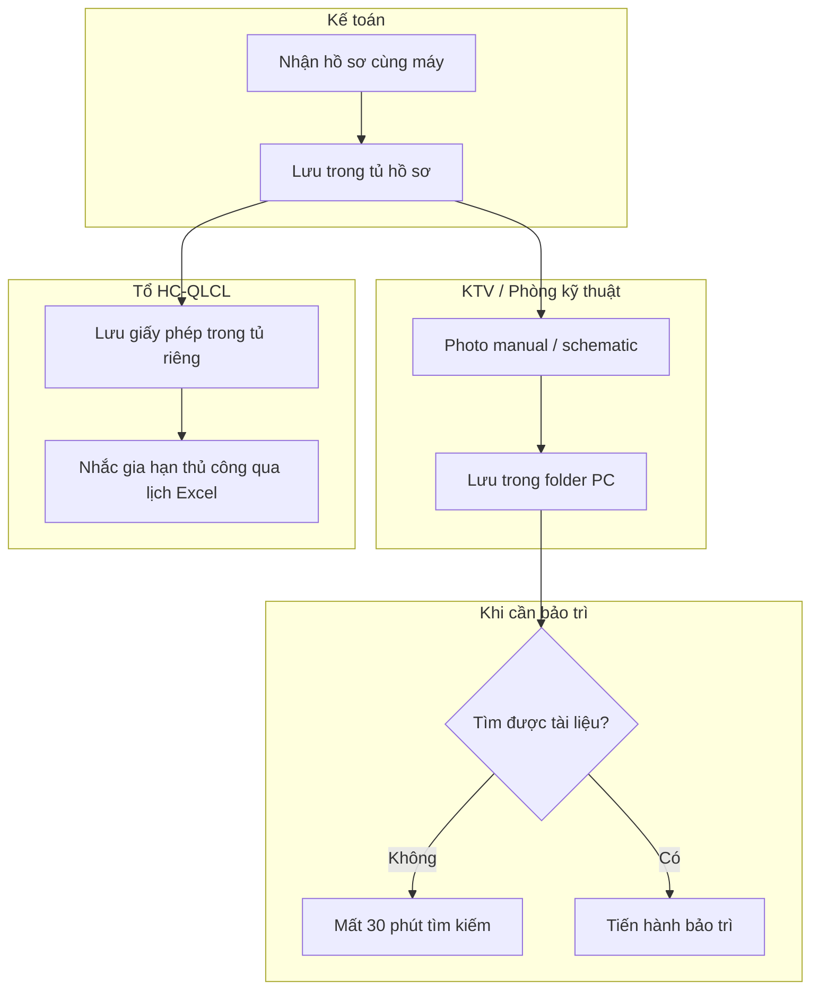
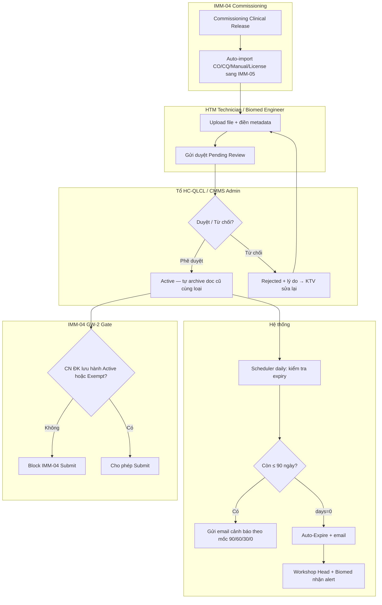
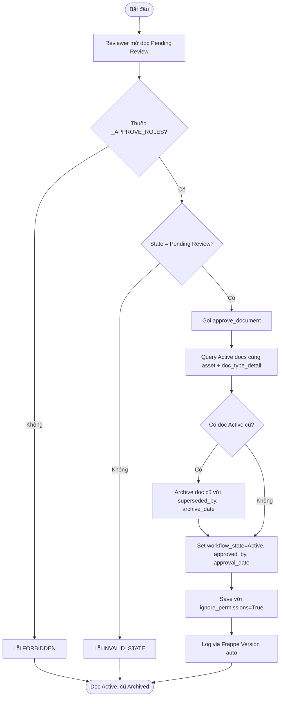
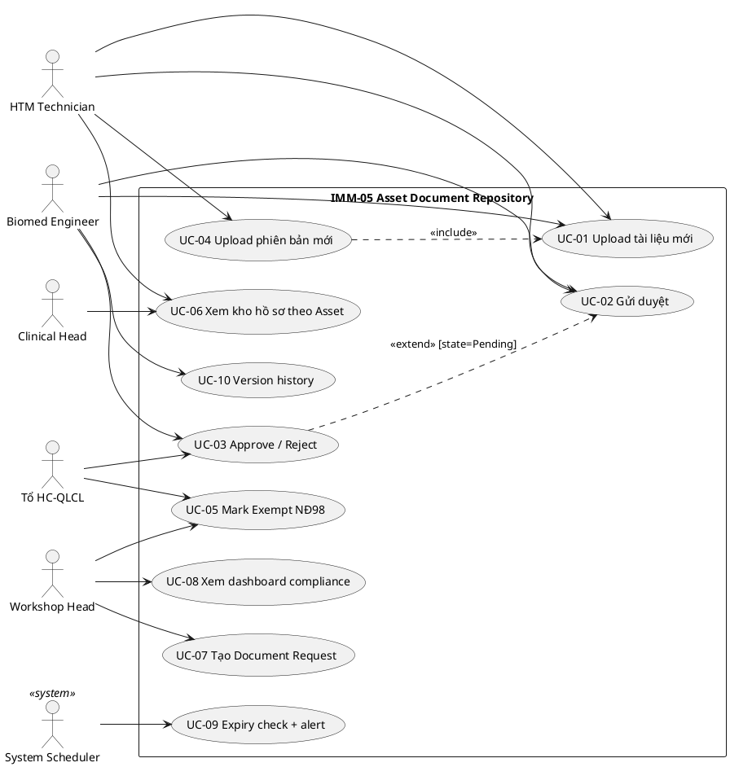
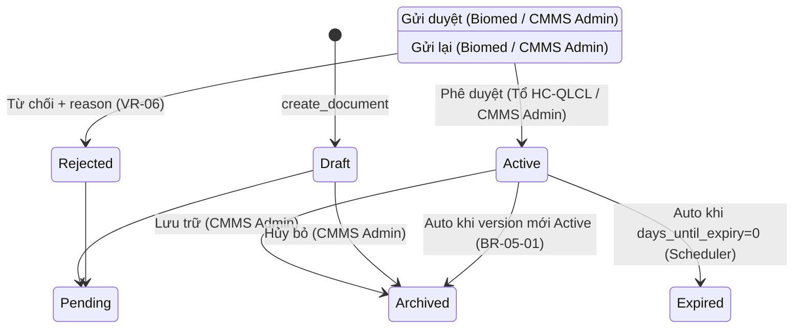

# 02 — Phân tích thiết kế nghiệp vụ (Analysis & Design)

| Mục | Giá trị |
|---|---|
| Module | IMM-05 — Hồ sơ Thiết bị (Asset Document Repository) |
| Phạm vi | Per-module |
| Owner | BA + System Analyst |
| Liên kết | 03 Diagrams · 04 Backend · 05 API · 06 Frontend |

> **Mục đích**: Phân tích nghiệp vụ end-to-end — module overview, quy trình BPMN, use case UML, functional specs. Đây là hợp đồng giữa BA và Dev.

---

# Phần I — Module Overview

## I.0. Khảo sát hiện trạng

**As-Is — Trước khi có hệ thống:** Tại phần lớn bệnh viện Việt Nam, hồ sơ thiết bị y tế được lưu trữ theo mô hình phân tán: CO/CQ trong bộ hồ sơ mua hàng (kế toán giữ), user manual trong phòng kỹ thuật (đôi khi photocopy), giấy phép bức xạ/đăng ký lưu hành trong tủ văn phòng HC-QLCL. Không có hệ thống liên kết hồ sơ theo từng thiết bị cụ thể. Khi cần bảo trì, KTV tìm tài liệu mất 15-30 phút. Khi có đoàn kiểm tra BYT, xuất trình đầy đủ hồ sơ có thể mất hàng ngày.

**Hạn chế chính:** (1) Hồ sơ thất lạc sau khi thiết bị chuyển vị trí hoặc nhân viên nghỉ việc. (2) Không theo dõi hạn hiệu lực — giấy phép hết hạn mà không ai biết cho đến khi bị thanh tra. (3) Không kiểm soát phiên bản — nhiều bản user manual khác nhau lưu tản mát. (4) Không tích hợp với quy trình commissioning — hồ sơ nhận cùng máy không được lưu hệ thống.

## I.1. Pitch

IMM-05 là **Document Repository tập trung** cho toàn bộ hồ sơ kỹ thuật, pháp lý, kiểm định và đào tạo gắn với từng thiết bị trong suốt vòng đời. Thay vì hồ sơ phân tán theo phòng ban, IMM-05 tổ chức theo từng `Asset` (per-instance) hoặc `Item` (per-model), có kiểm soát phiên bản, workflow duyệt, cảnh báo hết hạn tự động và compliance gate bắt buộc trước khi thiết bị đưa vào vận hành. Kết quả đo được: 0 hồ sơ thất lạc, 100% cảnh báo hết hạn trước 90 ngày, rút ngắn thời gian tìm tài liệu từ 30 phút xuống < 1 phút.

## I.2. Vị trí trong WHO HTM lifecycle

| Phase | Có liên quan? | Ghi chú |
|---|---|---|
| Procurement | ✅ INPUT | Nhận CO/CQ/Manual từ IMM-04 auto-import |
| Installation | ✅ OUTPUT | GW-2 gate — cung cấp điều kiện đầu vào cho IMM-04 Submit |
| Operation | ✅ CROSS-CUTTING | Cung cấp manual, schematic cho IMM-08/09/11 |
| Maintenance | ✅ OUTPUT | KTV xem manual khi bảo trì / hiệu chuẩn |
| Calibration | ✅ BOTH | Nhận chứng chỉ hiệu chuẩn sau mỗi cycle (IMM-11) |
| Decommission | ✅ OUTPUT | Auto-archive toàn bộ doc khi Asset decommissioned (IMM-13) |

IMM-05 là module **cross-cutting xuyên suốt từ Procurement → Decommission** theo WHO HTM Documentation §3.2. Vận hành song song với mọi module IMM-xx.

## I.3. Stakeholders & Actors

| Vai trò | Người dùng thực | Quan tâm chính | Tần suất | Loại |
|---|---|---|---|---|
| HTM Technician | KTV HTM | Upload hồ sơ, điền metadata | Hàng ngày | Primary |
| Biomed Engineer | Kỹ sư Biomedical | Review tài liệu kỹ thuật, gửi duyệt | Hàng tuần | Primary |
| Tổ HC-QLCL | Tổ Hành chính - QLCL | Duyệt hồ sơ pháp lý, mark exempt | Hàng tuần | Approver |
| Workshop Head | Trưởng phân xưởng | Quản lý kho hồ sơ, escalation | Hàng ngày | Approver |
| VP Block2 | Phó Trưởng Khối 2 | Nhận escalation, báo cáo compliance | Hàng tuần | Approver |
| Clinical Head | Trưởng Khoa | Xem hồ sơ Public của thiết bị tại khoa | Theo yêu cầu | Secondary |
| System (Scheduler) | Frappe scheduler | Auto-expire, expiry alert, completeness | Daily 00:30, 01:00 | System |
| Kiểm toán nội bộ | Auditor QLCL | Xem version history, compliance report | Định kỳ | Auditor |

## I.4. Scope

**In-scope:**
- DocType `Asset Document` (per-instance + per-model level)
- DocType `Document Request` (task quản lý doc thiếu, deadline, escalation)
- DocType `Required Document Type` (master config bộ hồ sơ bắt buộc)
- Workflow 6 states + 10 transitions
- 14 REST endpoints (`assetcore/api/imm05.py`)
- Version control: auto-archive version cũ khi version mới Active
- Auto-import từ IMM-04 khi commissioning submit
- Expiry alert scheduler 90/60/30/0 ngày
- GW-2 Compliance Gate cho IMM-04
- Visibility control (Public / Internal_Only)
- Mark Exempt NĐ98 flow

**Out-of-scope:**
- Quản lý hợp đồng vendor (IMM-02)
- Lịch đào tạo nhân viên (IMM-06)
- Lịch hiệu chuẩn định kỳ (IMM-11 — chỉ nhận chứng chỉ kết quả)
- CAPA management (IMM-12/16)
- Electronic signature / chữ ký số (v3.0)
- FHIR/HIS integration (Phase 2)

**Assumptions:**
- `Asset` record đã tồn tại (do IMM-04 mint hoặc import)
- `Required Document Type` master đã được seed (CO, CQ, Manual, CN ĐK lưu hành…)
- File upload qua Frappe File API thông thường (max 25MB)

**Dependencies:**
- IMM-04 (Asset Commissioning): `on_submit` trigger `create_initial_document_set`; ngược lại GW-2 query
- IMM-11 (Calibration): lưu chứng chỉ sau mỗi cycle
- IMM-13 (Decommission): auto-archive toàn bộ khi Asset retired
- Frappe `Version` DocType: audit trail mọi thay đổi

## I.5. KPI mục tiêu

| KPI | Định nghĩa | Baseline | Target | Đo ở đâu |
|---|---|---|---|---|
| KPI-05-01: Tỷ lệ Asset có đủ hồ sơ bắt buộc | % Asset có `completeness_pct ≥ 100%` theo Required Document Type | Không đo được | ≥ 90% | `get_compliance_by_dept` |
| KPI-05-02: Tỷ lệ hồ sơ sắp hết hạn được gia hạn | % doc `Expiring_Soon` được upload phiên bản mới trước ngày hết hạn | 0% (as-is) | ≥ 95% | `get_expiring_documents` tracking |
| KPI-05-03: Thời gian upload → Active | Trung bình ngày từ Draft → Active | N/A | ≤ 3 ngày làm việc | Frappe Version timestamp delta |
| KPI-05-04: Tỷ lệ GW-2 block tháo gỡ trong SLA | % GW-2 block được giải quyết (upload/exempt) trong 5 ngày | N/A | ≥ 85% | Document Request tracking |
| KPI-05-05: % alert idempotent | Không có Expiry Alert Log trùng per (asset_document, alert_date) | — | 100% | Scheduler log |

## I.6. Ràng buộc Compliance

| Quy định | Yêu cầu áp lên module | Doc tham chiếu |
|---|---|---|
| NĐ 98/2021/NĐ-CP | Thiết bị Y tế phải có Chứng nhận ĐK lưu hành — GW-2 gate; lưu hồ sơ ≥ 10 năm | Điều 28-32, Điều 41 |
| WHO HTM Annex 7 | Documentation & record keeping; cảnh báo expiry | WHO HTM §3.2, Annex 7 |
| ISO 13485:2016 | Document control: version, approval, DHF/DMR per asset | §4.2, §4.2.4, §4.2.5 |
| NĐ 142/2020/NĐ-CP | Giấy phép bức xạ phải lưu và theo dõi hiệu lực | Điều 25 |

## I.7. Risk & Open questions

**Risk:**

| Risk | Likelihood | Impact | Giảm thiểu |
|---|---|---|---|
| Service layer `services/imm05.py` chưa tồn tại — logic trong controller | High | Medium | Refactor kế hoạch Sprint 10 |
| Email notification template inline string trong tasks.py | Medium | Low | Tạo Email Template Frappe DocType |
| Dashboard frontend KPI panel chưa build | Medium | Medium | Sprint 9 |
| Auto-import IMM-04 → IMM-05 chưa có E2E test đầy đủ | Medium | High | UAT sprint kế tiếp |
| Compliance tính on-the-fly bằng SQL EXISTS — performance khi >10k docs | Low | Medium | Thêm composite index nếu cần |

**Open questions:**

| Câu hỏi | Owner | Deadline |
|---|---|---|
| Refactor service layer `services/imm05.py` — Sprint nào? | Tech Lead | Sprint 10 |
| Email template DocType cho expiry notification? | BA + Tech | Sprint 9 |
| Dashboard frontend component? | FE Dev | Sprint 9 |
| Retention policy — archive sau 10 năm hay indefinite? | Legal + QLCL | Sprint 8 |

## I.8. Roadmap thực thi

| Sprint | Hạng mục | Owner | Status |
|---|---|---|---|
| Sprint 4 | DocType schema 3 DocTypes | BE Dev | ✅ DONE |
| Sprint 5 | Workflow 6 states + VR-01 → VR-11 | BE Dev | ✅ DONE |
| Sprint 5 | API layer 14 endpoints | BE Dev | ✅ DONE |
| Sprint 6 | Scheduler 3 jobs + expiry alert | BE Dev | ✅ DONE |
| Sprint 6 | Frontend List / Detail / Create | FE Dev | ✅ DONE |
| Sprint 7 | Asset Documents tab | FE Dev | ✅ DONE |
| Sprint 8 | Retention policy definition | BA + Legal | ⚠️ TODO |
| Sprint 9 | Dashboard frontend KPI panel | FE Dev | ❌ TODO |
| Sprint 9 | Email template DocType | BE Dev | ❌ TODO |
| Sprint 10 | Refactor → `services/imm05.py` | Tech Lead | ❌ TODO |

---

# Phần II — Quy trình nghiệp vụ (Business Process / BPMN)

## II.2. As-Is process

Hồ sơ thiết bị được quản lý thủ công: CO/CQ lưu tại kế toán, user manual tại phòng kỹ thuật, giấy phép tại HC-QLCL. Không có hệ thống liên kết, không theo dõi hết hạn, không kiểm soát phiên bản.



## II.3. Pain points

| # | Pain | Tác động |
|---|---|---|
| 1 | Hồ sơ thất lạc khi nhân viên nghỉ việc hoặc thiết bị di chuyển | Không có tài liệu khi bảo trì khẩn cấp |
| 2 | Không theo dõi hạn hiệu lực tự động | Vi phạm pháp lý không phát hiện cho đến khi bị kiểm tra |
| 3 | Không kiểm soát phiên bản — nhiều bản doc khác nhau tản mát | KTV dùng tài liệu lỗi thời, dẫn đến sai thao tác |
| 4 | Không có compliance gate bắt buộc | Thiết bị đưa vào vận hành mà chưa có CN ĐK lưu hành |
| 5 | Không audit trail — không biết ai upload, ai duyệt gì | Không đáp ứng kiểm toán ISO 13485 |

## II.4. To-Be process (với AssetCore)



## II.5. Decision points

| Điểm | Câu hỏi | Quy tắc |
|---|---|---|
| Approve / Reject | Doc đúng chuẩn? | Tổ HC-QLCL / CMMS Admin duyệt; reject yêu cầu lý do (VR-06) |
| Auto-archive | Đã có doc Active cùng (asset + doc_type_detail)? | Archive cũ khi doc mới được Active (BR-05-01) |
| Expiry alert | days_until_expiry ∈ {90, 60, 30, 0}? | Sinh Expiry Alert Log idempotent; days=0 → auto-Expire |
| GW-2 | Có CN ĐK lưu hành Active hoặc is_exempt=1? | Block IMM-04 Submit nếu không (BR-05-07) |
| Visibility | doc.visibility == Internal_Only? | Ẩn với Clinical Head và non-internal roles |
| Exempt | doc_type_detail ∈ EXEMPT_DOC_TYPES? | Chỉ "CN ĐK lưu hành" và "Giấy phép NK" được exempt (VR-11) |

## II.6. Process metrics

| Metric | Mục tiêu | Đo ở đâu |
|---|---|---|
| Thời gian Draft → Active | ≤ 3 ngày | Frappe Version timestamp delta |
| % doc Active có expiry cảnh báo kịp thời | 100% (không miss mốc 90d) | Expiry Alert Log |
| % Asset completeness ≥ 100% | ≥ 90% | `get_compliance_by_dept` |
| GW-2 block tháo gỡ trong 5 ngày | ≥ 85% | Document Request status |

## II.7. RACI matrix

| Hoạt động | HTM Tech | Biomed | Tổ HC-QLCL | Workshop Head | VP Block2 | Scheduler |
|---|---|---|---|---|---|---|
| Upload doc | R/A | R/A | C | C | — | — |
| Submit review | R/A | R/A | C | C | — | — |
| Approve | — | — | R/A | — | — | — |
| Reject | — | — | R/A | — | — | — |
| Mark Exempt | — | — | R/A | R/A | — | — |
| Escalation | I | I | C | R/A | I | Auto |
| Audit trail | I | I | I | I | I | I |

## II.8. Exception flow

**Exception 1 — Upload doc có expiry đã hết hạn:** VR-01/VR-07 kiểm tra expiry_date > issued_date. Nếu expiry < today → block với thông báo "VR-01: Ngày hết hạn phải sau ngày cấp". Reviewer phải xác nhận trước khi approve (thường chỉ cho doc legacy khi backfill).

**Exception 2 — Reject sau approve:** Sau khi doc đã Active, nếu phát hiện sai sót → không reject được (VR-05 block). Cách xử lý đúng: upload phiên bản mới → submit review → approve → doc cũ auto-archive.

**Exception 3 — GW-2 block khi không có CN ĐK lưu hành:** Thiết bị Exempt NĐ98 → Tổ HC-QLCL gọi `mark_exempt` với văn bản chứng minh. Tạo Asset Document `is_exempt=1`, workflow_state=Active → GW-2 unblock.

## II.9. So sánh As-Is vs To-Be

| Khía cạnh | As-Is | To-Be (AssetCore) |
|---|---|---|
| Lưu trữ hồ sơ | Phân tán theo phòng ban | Tập trung per-Asset, searchable |
| Kiểm soát phiên bản | Không có | Auto-archive version cũ khi mới Active |
| Theo dõi hết hạn | Excel thủ công | Scheduler daily, alert 90/60/30/0 ngày |
| Compliance gate | Không có | GW-2 block IMM-04 nếu thiếu CN ĐK lưu hành |
| Audit trail | Không có | Frappe Version tự động per thao tác |
| Thời gian tìm hồ sơ | 15-30 phút | < 1 phút (search by asset/category/type) |

## II.10. Activity diagram per UC chính

### UC-05-03: Approve tài liệu



### UC-05-06: Scheduler Expiry Alert

```mermaid
flowchart TD
    Start([Scheduler Daily 00:30]) --> A[Loop milestone: 90, 60, 30, 0 ngày]
    A --> B[target_date = today + milestone]
    B --> C[Query Asset Document Active có expiry_date = target_date]
    C --> D{Doc nào?}
    D -->|Không| A
    D -->|Có| E{Expiry Alert Log đã có (doc, today)?}
    E -->|Có| A
    E -->|Không| F[Tạo Expiry Alert Log]
    F --> G{milestone = 0?}
    G -->|Có| H[Set workflow_state=Expired]
    G -->|Không| I[Send email theo mức]
    H --> I
    I --> A
    A -->|Xong tất cả milestone| End([Kết thúc])
```

---

# Phần III — Use Case Specification (UML)

## III.1. Use Case Diagram

### III.1.a. Biểu đồ use case tổng quát



## III.2. Actor catalog

| Actor | Loại | Mô tả | Goal chính |
|---|---|---|---|
| HTM Technician | Primary | KTV HTM | Upload và maintain hồ sơ |
| Biomed Engineer | Primary | Kỹ sư Biomedical | Review, submit, xem doc kỹ thuật |
| Tổ HC-QLCL | Approver | Tổ HC-QLCL | Duyệt hồ sơ pháp lý, exempt |
| Workshop Head | Approver | Trưởng phân xưởng | Quản lý kho hồ sơ, escalation |
| Clinical Head | Secondary | Trưởng Khoa | Xem hồ sơ Public của khoa |
| System Scheduler | System | Frappe | Auto-expire, alert, completeness |
| Auditor | Auditor | Kiểm toán QLCL | Version history, compliance audit |

## III.3. Use Case Specifications

### UC-01: Upload tài liệu mới

| Mục | Giá trị |
|---|---|
| ID | UC-IMM05-01 |
| Brief | HTM Technician upload file tài liệu cho 1 Asset + điền metadata |
| Primary actor | HTM Technician / Biomed Engineer |
| Pre-condition | Asset tồn tại; user có role upload |
| Post-condition | `Asset Document` ở Draft, version="1.0" |
| Trigger | KTV click "Upload tài liệu mới" |

#### Main flow
| Bước | Actor | System |
|---|---|---|
| 1 | Chọn Asset | Gọi `get_asset_documents` để xem doc đã có |
| 2 | Chọn doc_category, doc_type_detail, điền metadata | Validate VR-04 (legal → issuing_authority) |
| 3 | Upload file | Validate VR-08 (extension) |
| 4 | Nhấn "Lưu Draft" | Gọi `create_document` |
| 5 | — | Trả name `DOC-{asset}-{YYYY}-{#####}`, workflow_state=Draft |

#### Exception E1 — File format không hợp lệ
- 3a. Hệ thống block với "VR-08: Định dạng file không hợp lệ (.xlsx)"

### UC-03: Approve / Reject tài liệu

| Mục | Giá trị |
|---|---|
| ID | UC-IMM05-03 |
| Brief | Reviewer phê duyệt hoặc từ chối doc đang Pending Review |
| Primary actor | Tổ HC-QLCL / CMMS Admin |
| Pre-condition | Doc ở Pending Review; user thuộc _APPROVE_ROLES |
| Post-condition | Doc ở Active (version cũ Archived) hoặc Rejected |
| Trigger | Reviewer nhấn Approve hoặc Reject |

#### Main flow — Approve
| Bước | Actor | System |
|---|---|---|
| 1 | Click Approve | Gọi `approve_document(name)` |
| 2 | — | Validate role thuộc _APPROVE_ROLES |
| 3 | — | Query Active docs cùng (asset + doc_type_detail) |
| 4 | — | Archive doc cũ (superseded_by = new doc, archive_date = today) |
| 5 | — | Set Active, approved_by, approval_date |

#### Alternative A1 — Reject
- 1a. Reviewer click Reject → modal yêu cầu rejection_reason
- 2a. POST `reject_document(name, rejection_reason)` → Doc chuyển Rejected
- 3a. KTV nhận thông báo và sửa lại (VR-06 enforce rejection_reason)

## III.4. Use Case relationships

**`<<include>>`:**
| Caller UC | Included UC | Lý do |
|---|---|---|
| UC-04 Upload phiên bản mới | UC-01 Upload tài liệu mới | Tạo doc mới (version N+1) |

**`<<extend>>`:**
| Base UC | Extension | Điều kiện |
|---|---|---|
| UC-03 Approve | UC-10 Version history | Sau approve, tự động log via Frappe Version |

## III.5. UC ↔ User Story mapping

| Use Case | US ID | Note |
|---|---|---|
| UC-01 | US-05-01 | Upload tài liệu mới |
| UC-03 | US-05-02 | Approve / Reject |
| Auto-import | US-05-03 | System auto-import từ IMM-04 |
| UC-09 | US-05-04 | Cảnh báo hết hạn |
| UC-08 | US-05-05 | Dashboard |
| UC-06 | US-05-06 | Xem kho hồ sơ theo Asset |
| UC-04 | US-05-07 | Version control |
| UC-07 | US-05-08 | Document Request |
| UC-05 | US-05-09 | Mark Exempt |

---

# Phần IV — Functional Specifications

## IV.1. User Stories & Acceptance Criteria

### US-05-01 — Upload tài liệu mới
**Là HTM Technician, tôi muốn upload hồ sơ cho thiết bị với metadata đầy đủ, để tài liệu được lưu trữ tập trung và sẵn sàng cho người duyệt.**
- Priority: Must | Estimate: 2 SP

**AC-01:**
- Given: tôi có role HTM Technician, Asset "AC-ASSET-2026-0001" tồn tại
- When: POST `create_document` với `{asset_ref, doc_category="Legal", doc_type_detail, doc_number, issued_date, file_attachment}`
- Then: response.success=true, name khớp `DOC-AC-ASSET-2026-0001-2026-\d{5}`, workflow_state=Draft, version=1.0

**AC-02 — VR-08 file format:**
- Given: tôi upload file .xlsx
- When: POST
- Then: response.success=false, error chứa "VR-08: Định dạng file không hợp lệ (.xlsx)"

### US-05-02 — Approve auto-archive version cũ
**Là Tổ HC-QLCL, tôi muốn phê duyệt tài liệu và hệ thống tự archive phiên bản cũ, để chỉ có 1 Active doc per loại.**
- Priority: Must | Estimate: 3 SP

**AC-01:**
- Given: doc cũ DOC-001 ở Active, doc mới DOC-002 ở Pending Review (cùng asset + doc_type_detail)
- When: `approve_document("DOC-002")`
- Then: DOC-002.workflow_state=Active; DOC-001.workflow_state=Archived; DOC-001.superseded_by=DOC-002

**AC-02 — Reject thiếu reason:**
- Given: doc ở Pending Review
- When: `reject_document(name)` thiếu `rejection_reason`
- Then: response.success=false, code="VALIDATION_ERROR" (VR-06)

## IV.2. Business Rules

| ID | Rule | Implement ở | Chuẩn |
|---|---|---|---|
| BR-05-01 | 1 Active doc per (asset_ref + doc_type_detail) | `archive_old_versions()` on `on_update` + `approve_document` | Internal |
| BR-05-02 | Không xóa cứng — chỉ archive | `on_trash()` throw | NĐ98 |
| BR-05-03 | Expiry alert 90/60/30/0 idempotent | `check_document_expiry` daily | WHO HTM |
| BR-05-04 | Auto-import từ IMM-04 khi `Clinical Release` (state space) | IMM-04 `on_submit` hook | Internal |
| BR-05-05 | Bộ hồ sơ bắt buộc qua `Required Document Type` | `update_asset_completeness` | ISO 13485 |
| BR-05-06 | `is_model_level=1` áp dụng toàn bộ asset cùng model | UI filter + report | Internal |
| BR-05-07 | GW-2: Block IMM-04 Submit nếu thiếu CN ĐK lưu hành + không exempt | IMM-04 `validate()` | NĐ98 |
| BR-05-08 | Exempt → `document_status = "Compliant (Exempt)"` | `_compute_document_status()` | NĐ98 |
| BR-05-09 | `change_summary` bắt buộc khi version ≠ "1.0" | VR-09 trong `validate()` | ISO 13485 |
| BR-05-10 | `Internal_Only` ẩn với non-internal roles | `_apply_visibility_filter()` | Internal |

## IV.3. State Machine



**Bảng State:**

| State | docstatus | Mô tả | Role chuyển | Action button |
|---|---|---|---|---|
| Draft | 0 | Vừa tạo, chưa duyệt | Biomed / CMMS Admin | Gửi duyệt |
| Pending Review | 0 | Chờ duyệt | Tổ HC-QLCL / CMMS Admin | Phê duyệt / Từ chối |
| Active | 1 | Đang hiệu lực | CMMS Admin | Lưu trữ |
| Rejected | 0 | Bị từ chối, cần sửa | Biomed / CMMS Admin | Gửi lại |
| Archived | 2 | Đã lưu trữ (terminal) | — | Chỉ xem |
| Expired | 1 | Hết hạn (terminal tạm) | Scheduler | Upload phiên bản mới |

VR-05: Không cho phép thoát khỏi Archived hoặc Expired.

## IV.4. Input — Output

**(a) Input fields chính:**

| Field | Type | Required | Validation | Cascade |
|---|---|---|---|---|
| `asset_ref` | Link Asset | YES | Asset exists | Auto-fill model_ref, clinical_dept |
| `doc_category` | Select Legal/Technical/... | YES | one of 5 | — |
| `doc_type_detail` | Data | YES | not empty | — |
| `doc_number` | Data | YES | UNIQUE (asset + doc_type_detail) VR-02 | — |
| `version` | Data | YES | default "1.0" | If ≠ "1.0" → change_summary reqd |
| `issued_date` | Date | YES | ≤ expiry_date (VR-01) | — |
| `expiry_date` | Date | COND | reqd nếu Legal/Certification (VR-07) | — |
| `issuing_authority` | Data | COND | reqd nếu Legal (VR-04) | — |
| `file_attachment` | Attach | YES (Pending Review) | ext IN {pdf,jpg,jpeg,png,docx} VR-08 | — |
| `change_summary` | Small Text | COND | reqd nếu version ≠ "1.0" (VR-09) | — |
| `is_exempt` | Check | — | → exempt_reason + exempt_proof reqd (VR-10) | — |
| `visibility` | Select | YES | Public / Internal_Only | — |

**(b) Output records:**
- `Asset Document` record (naming `DOC-{asset_ref}-{YYYY}-{#####}`)
- `Expiry Alert Log` (từ scheduler)
- `Document Request` (tạo thủ công hoặc tự động)
- Frappe `Version` records (auto track_changes=1)

**(c) Notification:**
- Email Workshop Head / Biomed / VP Block2 khi expiry alert (90/60/30/0 ngày)
- Email Workshop Head + VP Block2 khi Document Request overdue

## IV.5. Edge cases & Errors

| ID | Edge case | Hành vi mong đợi | Error code (BE) |
|---|---|---|---|
| EC-05-01 | Hai user approve cùng lúc (race condition) | Idempotent: doc chỉ Archive 1 lần; second approve nhận INVALID_STATE | `BAD_STATE` |
| EC-05-02 | Xóa doc Active | Block với "Không được phép xóa tài liệu..." (BR-05-02) | `BUSINESS_RULE` |
| EC-05-03 | Thay đổi state từ Archived | Block với "VR-05: Không thể thay đổi trạng thái từ Archived" | `BAD_STATE` |
| EC-05-04 | Upload file >25MB | Frappe File API reject (không đến endpoint IMM-05) | HTTP 413 |
| EC-05-05 | Expiry Alert Log scheduler chạy 2 lần cùng ngày | Idempotent check (asset_document + alert_date) — bỏ qua lần 2 | — |
| EC-05-06 | Mark exempt với doc_type không hợp lệ | VR-11: "Miễn đăng ký NĐ98 chỉ áp dụng cho CN ĐK lưu hành, Giấy phép NK" | `VALIDATION` |
| EC-05-07 | get_compliance_by_dept khi custom field chưa sync | Graceful degradation: trả `dept_stats=[]` thay vì 500 | — |

## IV.6. Out of scope & Open issues

**Out of scope:**
- Electronic signature (chữ ký số) — v3.0
- FHIR/HIS integration — Phase 2
- Quản lý hợp đồng vendor → IMM-02

**Open issues:**
- Retention policy sau 10 năm (Owner: Legal + QLCL, Deadline: Sprint 8)
- Service layer refactor `services/imm05.py` (Owner: Tech Lead, Sprint 10)

---

# Phần V — Yêu cầu phi chức năng

## V.1. Hiệu năng

| Metric | Target | Đo ở đâu |
|---|---|---|
| `list_documents` với 10k records | P95 < 2s | API response time |
| `get_asset_documents` (group by category) | P95 < 1.5s | API response time |
| `get_dashboard_stats` | P95 < 2s | API response time |
| `get_compliance_by_dept` (SQL EXISTS) | P95 < 3s | API response time |
| Scheduler `check_document_expiry` | Chạy < 10 phút / run | Frappe scheduler log |

## V.2. Bảo mật

- Authentication: Frappe session + API key token
- Authorization: RBAC — role + visibility filter `_apply_visibility_filter()` per request
- `_INTERNAL_ONLY_ROLES` ẩn doc Internal_Only với non-internal roles (server-side)
- `_APPROVE_ROLES` kiểm tra trong `approve_document` + `reject_document`
- `_EXEMPT_ROLES` kiểm tra trong `mark_exempt`
- Audit trail: `track_changes=1` tự động Frappe Version per save
- `on_trash()` block xóa cứng (BR-05-02)
- Không lưu patient data

## V.3. Khả dụng

| Metric | Target |
|---|---|
| Uptime giờ hành chính | ≥ 99.5% |
| Scheduler idempotent | 100% (Expiry Alert Log unique per doc + alert_date) |
| File retention | ≥ 10 năm sau decommission (NĐ98 Điều 41) |

## V.4. Khả mở rộng

- ≥ 50 user đồng thời
- Dataset: 50k Asset Documents / site
- Multi-site: 1 codebase, N site độc lập

## V.5. Khả dụng UX

- File upload drag-and-drop + click
- Expiry countdown màu sắc: xanh >90d / vàng 30-90d / cam 0-30d / đỏ expired
- Browser: Chrome ≥ 120, Edge ≥ 120
- Responsive desktop-first ≥ 1280px

## V.6. Bảo trì

- Code coverage: service (sau refactor) ≥ 85%, API ≥ 60%
- Mọi public function có docstring + AC
- Scheduler idempotent và có log rõ ràng

## V.7. Tuân thủ

- Hồ sơ lưu ≥ 10 năm (NĐ98 Điều 41) — không xóa được (BR-05-02)
- Frappe Version track mọi thay đổi — truy xuất qua `get_document_history`
- Phân tách: KTV upload ≠ Tổ HC-QLCL approve ≠ CMMS Admin manage
- GW-2 gate bắt buộc CN ĐK lưu hành trước commissioning (NĐ98)
- Expiry alert đảm bảo tái lập hồ sơ trước khi hết hạn (WHO HTM Annex 7)

---

## DoD — File 02 hoàn chỉnh

### I. Module Overview
- [x] Khảo sát As-Is + pain points
- [x] Pitch ≤ 5 câu
- [x] Lifecycle phase rõ (cross-cutting)
- [x] ≥ 1 Primary + 1 Auditor
- [x] Scope In + Out + Assumption + Dependency
- [x] ≥ 3 KPI có target số
- [x] ≥ 1 compliance

### II. Business Process
- [x] As-Is + ≥ 3 pain point
- [x] To-Be swimlane ≥ 4 lane
- [x] Decision points có quy tắc
- [x] RACI matrix
- [x] ≥ 2 exception flow
- [x] Activity diagram UC-03, UC-09

### III. Use Case Spec
- [x] Use case diagram tổng quát
- [x] Actor catalog ≥ 5 actor
- [x] UC-01, UC-03 textual spec
- [x] ≥ 1 include + ≥ 1 extend

### IV. Functional Specs
- [x] User Stories US-05-01, US-05-02 với AC
- [x] Business Rules đánh số
- [x] State machine vẽ rõ
- [x] ≥ 5 edge case
- [x] Error code khai báo

### V. NFR
- [x] 7 nhóm NFR đủ
- [x] Mỗi NFR có target đo được
- [x] Compliance NĐ98 + WHO HTM + ISO 13485
