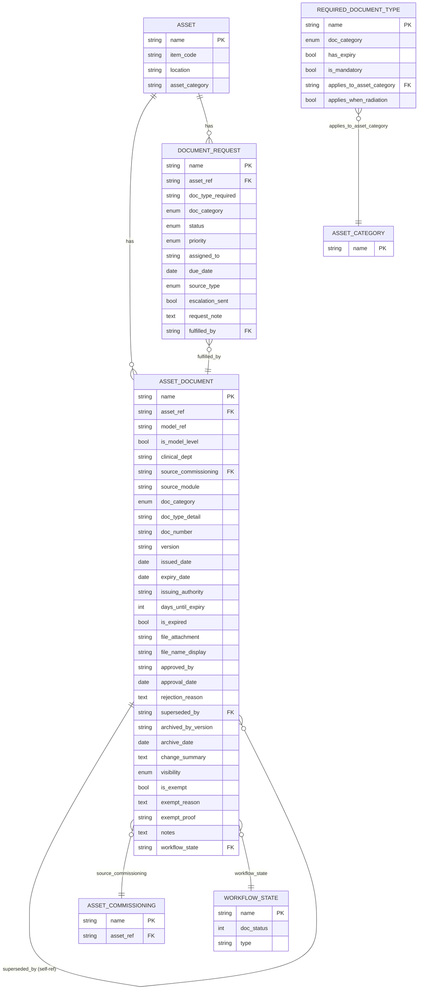
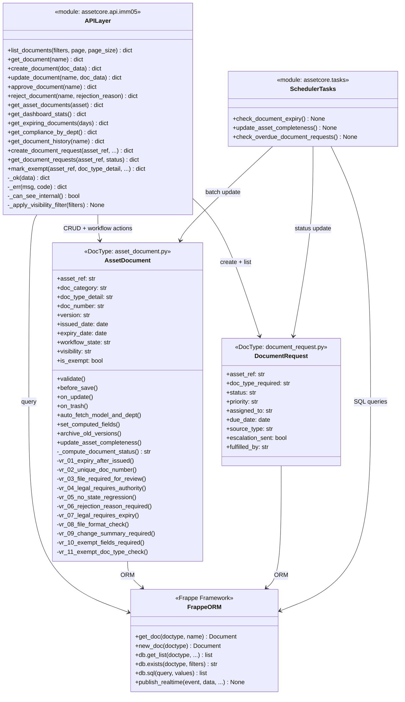
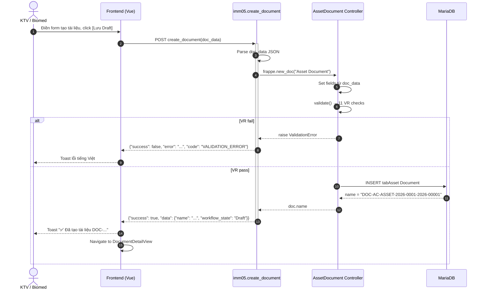
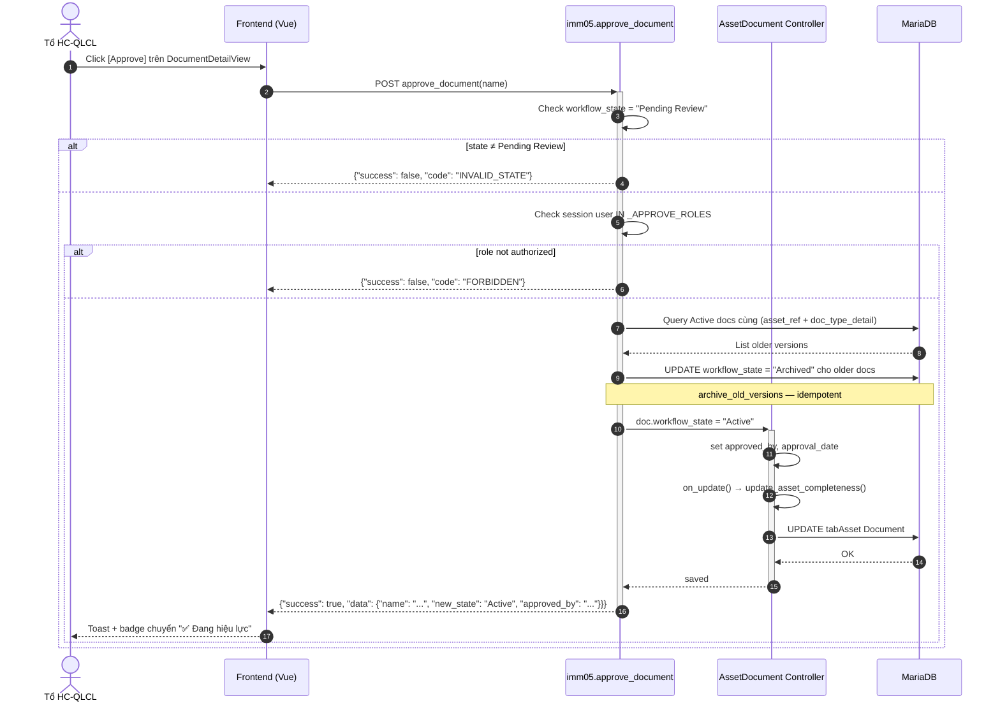
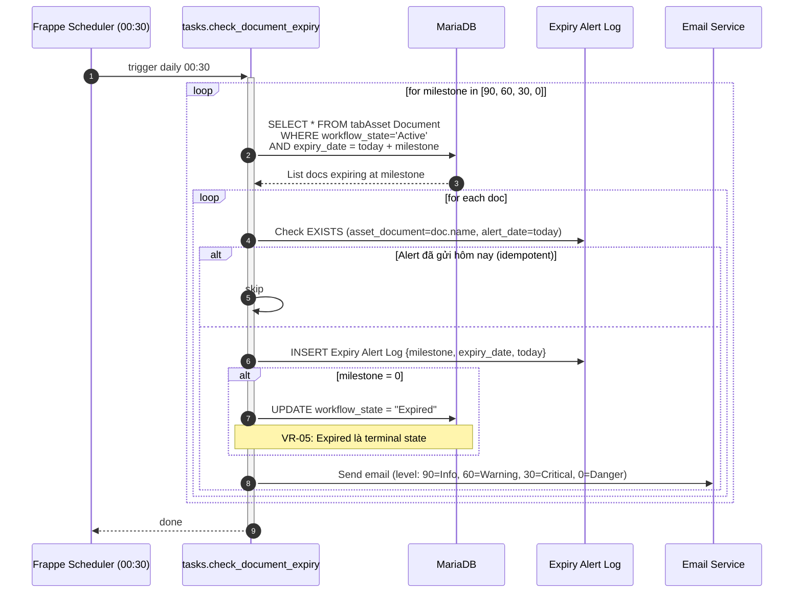
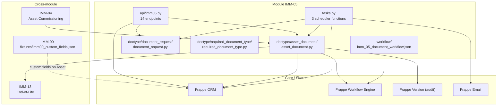
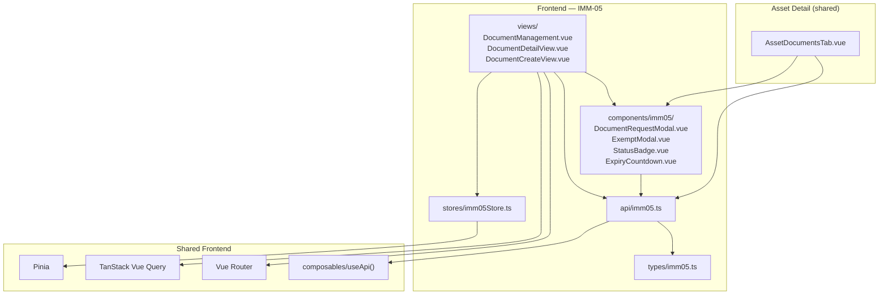

# IMM-05 — Diagrams

| Thuộc tính | Giá trị |
|---|---|
| Module | IMM-05 — Asset Document Repository |
| Template | 03_Diagrams v4.1+ |
| Ngày tạo | 2026-05-08 |
| Trạng thái | Draft |

---

## Phần I — ERD (Entity Relationship Diagram)

### I.1 ERD Tổng thể



### I.2 Cheatsheet cardinality

| Ký hiệu | Nghĩa |
|---|---|
| `||--o{` | 1 bắt buộc — 0 hoặc nhiều |
| `}o--||` | 0 hoặc nhiều — 1 bắt buộc |
| `||--||` | 1 bắt buộc — 1 bắt buộc |
| `}o--o{` | 0 hoặc nhiều — 0 hoặc nhiều |

### I.3 Entity catalog

| Entity | Thuộc module | DocType name | Ghi chú |
|---|---|---|---|
| Asset | Core (Frappe) | AC Asset | Registry thiết bị |
| Asset Document | IMM-05 (owned) | Asset Document | Tài liệu hồ sơ thiết bị |
| Document Request | IMM-05 (owned) | Document Request | Yêu cầu bổ sung tài liệu |
| Required Document Type | IMM-05 (owned) | Required Document Type | Master config tài liệu bắt buộc |
| Asset Commissioning | IMM-04 (cross-module) | Asset Commissioning | Nguồn của tài liệu (auto-import) |
| Workflow State | Core (Frappe) | Workflow State | Quản lý trạng thái workflow |

### I.4 Data Dictionary

**Bảng 1.1 — tabAsset Document**

| Cột | Kiểu | Nullable | Ghi chú |
|---|---|:---:|---|
| `name` | varchar(140) | N | PK, autoname `DOC-{asset_ref}-{YYYY}-{#####}` |
| `asset_ref` | varchar(140) | N | FK → tabAsset, search_index |
| `model_ref` | varchar(140) | Y | FK → IMM Device Model, auto-fetch |
| `is_model_level` | tinyint(1) | Y | Áp dụng toàn model |
| `clinical_dept` | varchar(140) | Y | fetch_from asset_ref.location, read_only |
| `source_commissioning` | varchar(140) | Y | FK → Asset Commissioning |
| `source_module` | varchar(140) | Y | Module tạo tài liệu, read_only |
| `doc_category` | varchar(140) | N | Enum: Legal/Technical/Certification/Training/QA |
| `doc_type_detail` | varchar(140) | N | Tên loại tài liệu, title_field |
| `doc_number` | varchar(140) | N | Số hiệu, search_index |
| `version` | varchar(140) | N | default "1.0" |
| `issued_date` | date | N | Ngày cấp |
| `expiry_date` | date | Y | Bắt buộc nếu Legal/Certification (VR-07) |
| `issuing_authority` | varchar(255) | Y | Bắt buộc nếu Legal (VR-04) |
| `days_until_expiry` | int(11) | Y | Computed, read_only |
| `is_expired` | tinyint(1) | Y | Computed, read_only |
| `file_attachment` | text | N | File path Frappe, VR-08 ext validation |
| `file_name_display` | varchar(255) | Y | Display name, read_only |
| `approved_by` | varchar(140) | Y | FK → User, read_only |
| `approval_date` | date | Y | read_only |
| `rejection_reason` | text | Y | Bắt buộc nếu Rejected (VR-06) |
| `superseded_by` | varchar(140) | Y | FK → Asset Document (self-ref), read_only |
| `archived_by_version` | varchar(140) | Y | Version thay thế, read_only |
| `archive_date` | date | Y | read_only |
| `change_summary` | text | Y | Bắt buộc nếu version != "1.0" (VR-09) |
| `visibility` | varchar(140) | Y | Enum: Public/Internal_Only, default Public |
| `is_exempt` | tinyint(1) | Y | Miễn đăng ký NĐ98 |
| `exempt_reason` | text | Y | Bắt buộc nếu is_exempt=1 (VR-10) |
| `exempt_proof` | text | Y | File path bắt buộc nếu is_exempt=1 (VR-10) |
| `notes` | longtext | Y | Ghi chú tự do |
| `workflow_state` | varchar(140) | Y | FK → Workflow State, in_list_view |

**Bảng 1.2 — tabDocument Request**

| Cột | Kiểu | Nullable | Ghi chú |
|---|---|:---:|---|
| `name` | varchar(140) | N | PK, autoname `DOCREQ-{YYYY}-{MM}-{#####}` |
| `asset_ref` | varchar(140) | N | FK → tabAsset |
| `doc_type_required` | varchar(255) | N | Loại tài liệu yêu cầu |
| `doc_category` | varchar(140) | N | Enum: Legal/.../QA |
| `status` | varchar(140) | N | Enum: Open/In_Progress/Overdue/Fulfilled/Cancelled, default Open |
| `priority` | varchar(140) | Y | Enum: Low/Medium/High/Critical, default Medium |
| `assigned_to` | varchar(140) | N | FK → User |
| `due_date` | date | N | Hạn hoàn thành |
| `source_type` | varchar(140) | Y | Enum: Manual/Dashboard/GW2_Block/Scheduler, read_only |
| `escalation_sent` | tinyint(1) | Y | 1 khi scheduler đã gửi cảnh báo, read_only |
| `request_note` | text | Y | Ghi chú yêu cầu |
| `fulfilled_by` | varchar(140) | Y | FK → Asset Document khi hoàn thành |

**Bảng 1.3 — tabRequired Document Type**

| Cột | Kiểu | Nullable | Ghi chú |
|---|---|:---:|---|
| `name` | varchar(140) | N | PK = type_name |
| `doc_category` | varchar(140) | N | Enum: Legal/.../QA |
| `has_expiry` | tinyint(1) | Y | Có ngày hết hạn |
| `is_mandatory` | tinyint(1) | Y | Bắt buộc cho compliance |
| `applies_to_asset_category` | varchar(140) | Y | FK → AC Asset Category |
| `applies_when_radiation` | tinyint(1) | Y | Chỉ áp dụng thiết bị bức xạ |

### I.5 Constraints & Indexes

```sql
-- Index Frappe auto-tạo từ search_index=1
CREATE INDEX idx_assetdoc_asset_ref      ON `tabAsset Document` (asset_ref);
CREATE INDEX idx_assetdoc_doc_number     ON `tabAsset Document` (doc_number);
CREATE INDEX idx_assetdoc_workflow_state ON `tabAsset Document` (workflow_state);
CREATE INDEX idx_assetdoc_model_ref      ON `tabAsset Document` (model_ref);
CREATE INDEX idx_assetdoc_expiry_date    ON `tabAsset Document` (expiry_date);

-- Composite index khuyến nghị (manual SQL)
CREATE INDEX idx_asd_asset_type_state
    ON `tabAsset Document` (asset_ref, doc_type_detail, workflow_state);
CREATE INDEX idx_asd_state_expiry
    ON `tabAsset Document` (workflow_state, expiry_date);

-- Index Document Request
CREATE INDEX idx_docreq_asset_status ON `tabDocument Request` (asset_ref, status);
```

> **VR-02 Unique check:** Không có DB UNIQUE constraint — kiểm tra bằng `frappe.db.exists()` trong controller `vr_02_unique_doc_number`. Thêm DB constraint là Tech-debt (Sprint 7).

---

## Phần II — Class Diagram

### II.1 Class Diagram — 4 lớp kiến trúc



### II.2 Class Catalog

| Class | Layer | File | Trách nhiệm |
|---|---|---|---|
| `APILayer` | API | `assetcore/api/imm05.py` | 14 whitelist endpoints, visibility filter, role check |
| `AssetDocument` | Controller | `assetcore/doctype/asset_document/asset_document.py` | 11 VR + 4 business methods, lifecycle hooks |
| `DocumentRequest` | Controller | `assetcore/doctype/document_request/document_request.py` | Yêu cầu bổ sung tài liệu |
| `SchedulerTasks` | Scheduler | `assetcore/tasks.py` | 3 cron jobs IMM-05 |
| `FrappeORM` | Data | Frappe core | Database access abstraction |

> **Tech-debt:** Chưa có `services/imm05.py`. Logic nghiệp vụ nằm trong `AssetDocument` controller. Khi refactor, tách `archive_old_versions`, `update_asset_completeness`, `_compute_document_status` ra service layer.

---

## Phần III — Sequence Diagrams

### III.1 Convention

| Ký hiệu | Nghĩa |
|---|---|
| `->` | Synchronous call |
| `-->` | Return |
| `+` | Activate lifeline |
| `-` | Deactivate lifeline |
| `alt` | Conditional branch |
| `Note` | Annotation |

### III.2 SD-05-01 — Tạo Asset Document (happy path)



### III.3 SD-05-02 — Phê duyệt tài liệu (Approve)



### III.4 SD-05-03 — Scheduler check_document_expiry



### III.5 Cross-reference Sequence ↔ Use Case

| Sequence Diagram | Use Case liên quan | API endpoint |
|---|---|---|
| SD-05-01 | UC-01 Tạo tài liệu | `create_document` |
| SD-05-02 | UC-03 Phê duyệt | `approve_document` |
| SD-05-03 | UC-09 Scheduler expiry | `check_document_expiry` (tasks) |

---

## Phần IV — Communication Diagram

### IV.1 Comm-05-01 — Topology Module IMM-05

```
                    ┌─────────────────┐
                    │   Frontend Vue  │
                    │  (imm05Store)   │
                    └────────┬────────┘
                             │ HTTP whitelist
                             ▼
              ┌──────────────────────────────┐
              │  API Layer (api/imm05.py)    │
              │  14 endpoints + helpers      │
              └───────┬──────────────────────┘
                      │
           ┌──────────┼──────────────────┐
           │          │                  │
           ▼          ▼                  ▼
  ┌─────────────┐  ┌──────────────┐  ┌──────────────────┐
  │ AssetDoc    │  │ Document     │  │ Frappe ORM /     │
  │ Controller  │  │ Request      │  │ MariaDB          │
  │ (11 VR +    │  │ Controller   │  │ tabAsset Document│
  │  4 methods) │  │              │  │ tabDoc Request   │
  └──────┬──────┘  └──────┬───────┘  │ tabReq Doc Type  │
         │                │           └──────────────────┘
         ▼                ▼
  ┌──────────────────────────────┐
  │  Scheduler (tasks.py)        │
  │  check_document_expiry       │
  │  update_asset_completeness   │
  │  check_overdue_requests      │
  └──────────────────────────────┘

Cross-module:
  IMM-04 → IMM-05: imm04_asset_released event → auto create Asset Document
  IMM-05 → IMM-04: GW-2 gate query: SELECT Active docs WHERE doc_type="CN ĐK lưu hành"
  IMM-05 → IMM-13: Archived on asset retired
```

---

## Phần V — Package Diagram

### V.1 Backend Package Diagram



### V.2 Frontend Package Diagram



### V.3 Anti-patterns

- **Không** query DB trực tiếp từ Frontend — phải qua API layer
- **Không** gọi `approve_document` từ Scheduler — chỉ `archive_old_versions` (idempotent)
- **Không** cache `document_status` trên Asset (đã bỏ v3) — tính on-the-fly qua SQL EXISTS
- **Không** cho FE tự filter `Internal_Only` — server-side enforcement duy nhất

---

## DoD Checklist

- [x] ERD Mermaid cho 3 owned entities + 3 cross-module
- [x] Data Dictionary đầy đủ cho 3 bảng chính
- [x] Composite index recommendation
- [x] Class diagram 4-layer với tech-debt note
- [x] 3 Sequence diagrams (happy path, approve, scheduler)
- [x] Communication diagram topology
- [x] Package diagram BE + FE
- [x] Anti-patterns list
