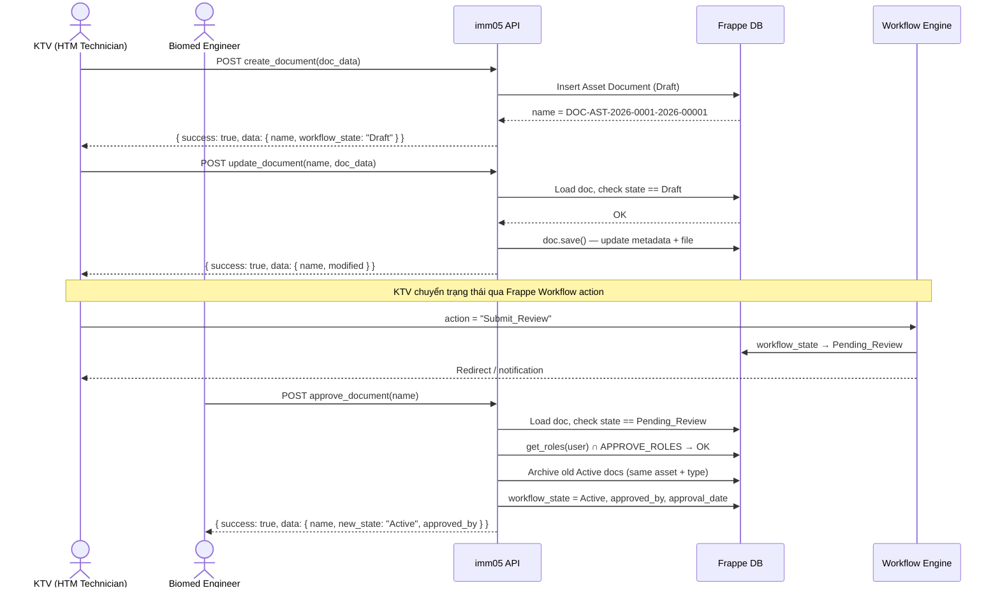
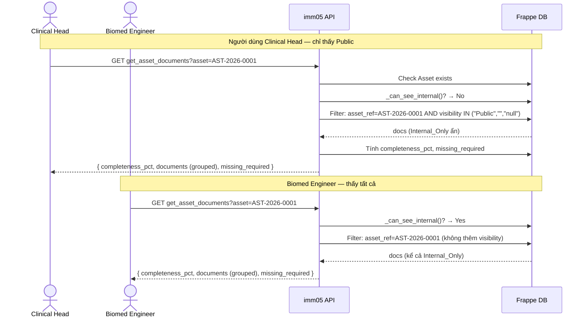
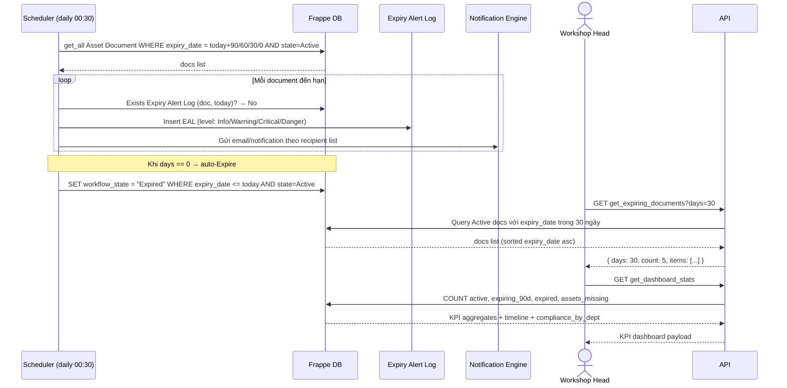

# IMM-05 API Interface Documentation

**Module:** IMM-05 — Đăng ký, Cấp phép & Quản lý Hồ sơ Thiết bị Y tế  
**DocType chính:** `Asset Document`  
**Base path:** `/api/method/assetcore.api.imm05`  
**Version:** 1.0  
**Ngày:** 2026-04-17

---

## 1. Authentication

All endpoints require a valid Frappe session. Two methods are supported:

| Method | Header / Cookie |
|---|---|
| Session cookie | `Cookie: sid=<session_id>` |
| API token | `Authorization: token <api_key>:<api_secret>` |

Frappe wraps every response in an outer envelope:
```json
{ "message": <actual_response> }
```

All AssetCore responses inside `message` follow the standard wrapper:
```json
{ "success": true,  "data": { ... } }
{ "success": false, "error": "Mô tả lỗi", "code": "ERROR_CODE" }
```

---

## 2. Sequence Diagrams

### 2.1 Upload and Approve Document Flow



---

### 2.2 Get Asset Documents with Visibility Filter



---

### 2.3 Document Expiry Check and Bulk Status Update



---

## 3. Endpoints Table

| # | HTTP Method | Endpoint | Actor / Role | Mô tả | Auth |
|---|---|---|---|---|---|
| 1 | GET | `list_documents` | Tất cả role | Danh sách phân trang + filter; tự động ẩn Internal_Only | Read perm |
| 2 | GET | `get_document` | Tất cả role | Chi tiết 1 Asset Document | Read perm |
| 3 | POST | `create_document` | HTM Technician, Tổ HC-QLCL | Tạo Asset Document mới (Draft) | Create perm |
| 4 | POST | `update_document` | HTM Technician (Draft/Rejected only) | Sửa metadata | Write perm |
| 5 | POST | `approve_document` | Biomed Engineer, Tổ HC-QLCL, CMMS Admin | Approve → Active; archive version cũ | Approve role |
| 6 | POST | `reject_document` | Biomed Engineer, Tổ HC-QLCL, CMMS Admin | Reject + lý do bắt buộc | Approve role |
| 7 | GET | `get_asset_documents` | Tất cả role | Toàn bộ hồ sơ của 1 Asset, group theo category | Read perm |
| 8 | GET | `get_dashboard_stats` | Workshop Head, CMMS Admin, PTP | KPI Dashboard IMM-05 | Read perm |
| 9 | GET | `get_expiring_documents` | Workshop Head, CMMS Admin | Docs sắp hết hạn trong N ngày | Read perm |
| 10 | GET | `get_compliance_by_dept` | Workshop Head, CMMS Admin, PTP | Tỷ lệ compliance theo khoa | Read perm |
| 11 | GET | `get_document_history` | Biomed Engineer, Tổ HC-QLCL, CMMS Admin | Lịch sử thay đổi (audit trail) | Read perm |
| 12 | POST | `create_document_request` | HTM Technician, Tổ HC-QLCL, Biomed | Tạo Document Request task | Write perm |
| 13 | GET | `get_document_requests` | HTM Technician, Tổ HC-QLCL, Biomed | Danh sách Document Request | Read perm |
| 14 | POST | `mark_exempt` | Tổ HC-QLCL, CMMS Admin, Workshop Head | Đánh dấu thiết bị Exempt khỏi NĐ98 | Exempt role |

---

## 4. JSON Payloads

### 4.1 `list_documents` — GET

**Request:**
```
GET /api/method/assetcore.api.imm05.list_documents
    ?filters={"doc_category":"Legal","workflow_state":"Active"}
    &page=1
    &page_size=20
```

**Response (200 OK):**
```json
{
  "message": {
    "success": true,
    "data": {
      "items": [
        {
          "name": "DOC-AST-2026-0001-2026-00001",
          "asset_ref": "AST-2026-0001",
          "doc_category": "Legal",
          "doc_type_detail": "Chứng nhận đăng ký lưu hành",
          "doc_number": "DLVHTT-2025-04132",
          "version": "1.0",
          "workflow_state": "Active",
          "expiry_date": "2027-12-31",
          "days_until_expiry": 623,
          "visibility": "Public",
          "is_exempt": 0,
          "modified": "2026-04-16 14:30:00"
        },
        {
          "name": "DOC-AST-2026-0002-2026-00003",
          "asset_ref": "AST-2026-0002",
          "doc_category": "Legal",
          "doc_type_detail": "Giấy phép nhập khẩu",
          "doc_number": "GP-NK-2025-00218",
          "version": "2.0",
          "workflow_state": "Active",
          "expiry_date": "2026-06-30",
          "days_until_expiry": 74,
          "visibility": "Public",
          "is_exempt": 0,
          "modified": "2026-03-10 09:00:00"
        }
      ],
      "pagination": {
        "page": 1,
        "page_size": 20,
        "total": 45,
        "total_pages": 3
      }
    }
  }
}
```

---

### 4.2 `get_document` — GET

**Request:**
```
GET /api/method/assetcore.api.imm05.get_document?name=DOC-AST-2026-0001-2026-00001
```

**Response (200 OK):**
```json
{
  "message": {
    "success": true,
    "data": {
      "name": "DOC-AST-2026-0001-2026-00001",
      "asset_ref": "AST-2026-0001",
      "model_ref": "ITEM-DRAGER-EVITA-V500",
      "is_model_level": 0,
      "clinical_dept": "ICU",
      "source_commissioning": "ACC-2026-00042",
      "source_module": "IMM-04",
      "doc_category": "Legal",
      "doc_type_detail": "Chứng nhận đăng ký lưu hành",
      "doc_number": "DLVHTT-2025-04132",
      "version": "1.0",
      "issued_date": "2025-01-15",
      "expiry_date": "2027-12-31",
      "issuing_authority": "Cục Quản lý Trang thiết bị Y tế — Bộ Y tế",
      "days_until_expiry": 623,
      "is_expired": 0,
      "file_attachment": "/files/cndk_lh_drager_evita_2025.pdf",
      "file_name_display": "cndk_lh_drager_evita_2025.pdf",
      "approved_by": "biomed@bvnd1.vn",
      "approval_date": "2026-04-16",
      "rejection_reason": null,
      "visibility": "Public",
      "is_exempt": 0,
      "workflow_state": "Active",
      "change_summary": null,
      "notes": null,
      "modified": "2026-04-16 14:30:00",
      "owner": "hieu@bvnd1.vn"
    }
  }
}
```

**Error — Internal_Only + không đủ quyền:**
```json
{
  "message": {
    "success": false,
    "error": "Không có quyền xem tài liệu này.",
    "code": "FORBIDDEN"
  }
}
```

---

### 4.3 `create_document` — POST

**Request:**
```json
{
  "doc_data": "{\"asset_ref\": \"AST-2026-0001\", \"doc_category\": \"Legal\", \"doc_type_detail\": \"Chứng nhận đăng ký lưu hành\", \"doc_number\": \"DLVHTT-2025-04132\", \"version\": \"1.0\", \"issued_date\": \"2025-01-15\", \"expiry_date\": \"2027-12-31\", \"issuing_authority\": \"Cục Quản lý Trang thiết bị Y tế\", \"file_attachment\": \"/files/cndk_lh_drager_evita_2025.pdf\", \"visibility\": \"Public\"}"
}
```

**Response (200 OK — created as Draft):**
```json
{
  "message": {
    "success": true,
    "data": {
      "name": "DOC-AST-2026-0001-2026-00001",
      "workflow_state": "Draft"
    }
  }
}
```

---

### 4.4 `update_document` — POST

**Request:**
```json
{
  "name": "DOC-AST-2026-0001-2026-00001",
  "doc_data": "{\"doc_number\": \"DLVHTT-2025-04132-v2\", \"version\": \"2.0\", \"change_summary\": \"Cập nhật số hiệu theo văn bản chỉnh sửa từ NCC\"}"
}
```

**Response (200 OK):**
```json
{
  "message": {
    "success": true,
    "data": {
      "name": "DOC-AST-2026-0001-2026-00001",
      "modified": "2026-04-17 09:15:00"
    }
  }
}
```

**Error — Không ở Draft/Rejected:**
```json
{
  "message": {
    "success": false,
    "error": "Chỉ có thể sửa khi ở Draft hoặc Rejected. Hiện tại: Pending_Review",
    "code": "INVALID_STATE"
  }
}
```

---

### 4.5 `approve_document` — POST

**Request:**
```json
{
  "name": "DOC-AST-2026-0001-2026-00001"
}
```

**Response (200 OK):**
```json
{
  "message": {
    "success": true,
    "data": {
      "name": "DOC-AST-2026-0001-2026-00001",
      "new_state": "Active",
      "approved_by": "biomed@bvnd1.vn"
    }
  }
}
```

**Error — Sai state:**
```json
{
  "message": {
    "success": false,
    "error": "Chỉ Approve từ Pending_Review. Hiện tại: Draft",
    "code": "INVALID_STATE"
  }
}
```

---

### 4.6 `reject_document` — POST

**Request:**
```json
{
  "name": "DOC-AST-2026-0001-2026-00001",
  "rejection_reason": "File bị mờ, không đọc được số giấy phép. Yêu cầu scan lại bản gốc."
}
```

**Response (200 OK):**
```json
{
  "message": {
    "success": true,
    "data": {
      "name": "DOC-AST-2026-0001-2026-00001",
      "new_state": "Rejected"
    }
  }
}
```

---

### 4.7 `get_asset_documents` — GET

**Request:**
```
GET /api/method/assetcore.api.imm05.get_asset_documents?asset=AST-2026-0001
```

**Response (200 OK):**
```json
{
  "message": {
    "success": true,
    "data": {
      "asset": "AST-2026-0001",
      "completeness_pct": 71.4,
      "document_status": "Incomplete",
      "documents": {
        "Legal": [
          {
            "name": "DOC-AST-2026-0001-2026-00001",
            "doc_category": "Legal",
            "doc_type_detail": "Chứng nhận đăng ký lưu hành",
            "doc_number": "DLVHTT-2025-04132",
            "version": "1.0",
            "workflow_state": "Active",
            "expiry_date": "2027-12-31",
            "days_until_expiry": 623,
            "visibility": "Public",
            "is_exempt": 0,
            "approved_by": "biomed@bvnd1.vn",
            "approval_date": "2026-04-16"
          },
          {
            "name": "DOC-AST-2026-0001-2026-00002",
            "doc_category": "Legal",
            "doc_type_detail": "Giấy phép nhập khẩu",
            "doc_number": "GP-NK-2024-00177",
            "version": "1.0",
            "workflow_state": "Active",
            "expiry_date": "2026-08-01",
            "days_until_expiry": 106,
            "visibility": "Public",
            "is_exempt": 0,
            "approved_by": "biomed@bvnd1.vn",
            "approval_date": "2026-01-10"
          }
        ],
        "Technical": [
          {
            "name": "DOC-AST-2026-0001-2026-00003",
            "doc_category": "Technical",
            "doc_type_detail": "User Manual (HDSD)",
            "doc_number": "UM-EVITAV500-EN",
            "version": "1.0",
            "workflow_state": "Active",
            "expiry_date": null,
            "days_until_expiry": null,
            "visibility": "Public",
            "is_exempt": 0,
            "approved_by": "biomed@bvnd1.vn",
            "approval_date": "2026-02-05"
          }
        ],
        "QA": [
          {
            "name": "DOC-AST-2026-0001-2026-00004",
            "doc_category": "QA",
            "doc_type_detail": "CO - Chứng nhận Xuất xứ",
            "doc_number": "CO-2025-GER-8812",
            "version": "1.0",
            "workflow_state": "Draft",
            "expiry_date": null,
            "days_until_expiry": null,
            "visibility": "Public",
            "is_exempt": 0,
            "approved_by": null,
            "approval_date": null
          }
        ]
      },
      "missing_required": [
        "CQ - Chứng nhận Chất lượng",
        "Service Manual",
        "Warranty Card"
      ]
    }
  }
}
```

---

### 4.8 `get_dashboard_stats` — GET

**Request:**
```
GET /api/method/assetcore.api.imm05.get_dashboard_stats
```

**Response (200 OK):**
```json
{
  "message": {
    "success": true,
    "data": {
      "kpis": {
        "total_active": 342,
        "expiring_90d": 12,
        "expired_not_renewed": 3,
        "assets_missing_docs": 8
      },
      "expiry_timeline": [
        {
          "name": "DOC-AST-2026-0002-2026-00003",
          "asset_ref": "AST-2026-0002",
          "doc_type_detail": "Giấy phép nhập khẩu",
          "expiry_date": "2026-06-30",
          "days_until_expiry": 74
        },
        {
          "name": "DOC-AST-2026-0005-2026-00011",
          "asset_ref": "AST-2026-0005",
          "doc_type_detail": "Warranty Card",
          "expiry_date": "2026-07-15",
          "days_until_expiry": 89
        }
      ],
      "compliance_by_dept": [
        { "dept": "ICU", "total_assets": 25, "compliant": 22, "pct": 88.0 },
        { "dept": "Phòng mổ", "total_assets": 18, "compliant": 15, "pct": 83.3 },
        { "dept": "HSTC", "total_assets": 12, "compliant": 9, "pct": 75.0 },
        { "dept": "X-quang", "total_assets": 8, "compliant": 4, "pct": 50.0 }
      ]
    }
  }
}
```

---

### 4.9 `get_expiring_documents` — GET

**Request:**
```
GET /api/method/assetcore.api.imm05.get_expiring_documents?days=30
```

**Response (200 OK):**
```json
{
  "message": {
    "success": true,
    "data": {
      "days": 30,
      "count": 2,
      "items": [
        {
          "name": "DOC-AST-2026-0008-2026-00015",
          "asset_ref": "AST-2026-0008",
          "doc_category": "Certification",
          "doc_type_detail": "Chứng chỉ hiệu chuẩn",
          "expiry_date": "2026-04-28",
          "days_until_expiry": 11,
          "issuing_authority": "Trung tâm Kỹ thuật TCĐLCL 3"
        },
        {
          "name": "DOC-AST-2026-0012-2026-00022",
          "asset_ref": "AST-2026-0012",
          "doc_category": "Legal",
          "doc_type_detail": "Giấy phép bức xạ",
          "expiry_date": "2026-05-10",
          "days_until_expiry": 23,
          "issuing_authority": "Cục An toàn bức xạ và hạt nhân"
        }
      ]
    }
  }
}
```

---

### 4.10 `get_compliance_by_dept` — GET

**Response (200 OK):**
```json
{
  "message": {
    "success": true,
    "data": [
      {
        "dept": "ICU",
        "total_assets": 25,
        "compliant": 20,
        "incomplete": 3,
        "non_compliant": 1,
        "expiring_soon": 1,
        "pct": 80.0
      },
      {
        "dept": "Phòng mổ",
        "total_assets": 18,
        "compliant": 15,
        "incomplete": 2,
        "non_compliant": 0,
        "expiring_soon": 1,
        "pct": 83.3
      }
    ]
  }
}
```

---

### 4.11 `get_document_history` — GET

**Request:**
```
GET /api/method/assetcore.api.imm05.get_document_history?name=DOC-AST-2026-0001-2026-00001
```

**Response (200 OK):**
```json
{
  "message": {
    "success": true,
    "data": {
      "name": "DOC-AST-2026-0001-2026-00001",
      "history": [
        {
          "timestamp": "2026-04-15 08:20:00",
          "user": "hieu@bvnd1.vn",
          "action": "Field Update",
          "from_state": null,
          "to_state": null,
          "changes": [
            { "field": "doc_number", "old": null, "new": "DLVHTT-2025-04132" }
          ]
        },
        {
          "timestamp": "2026-04-15 10:00:00",
          "user": "hieu@bvnd1.vn",
          "action": "Workflow Transition",
          "from_state": "Draft",
          "to_state": "Pending_Review",
          "changes": []
        },
        {
          "timestamp": "2026-04-16 14:30:00",
          "user": "biomed@bvnd1.vn",
          "action": "Workflow Transition",
          "from_state": "Pending_Review",
          "to_state": "Active",
          "changes": [
            { "field": "approved_by", "old": null, "new": "biomed@bvnd1.vn" },
            { "field": "approval_date", "old": null, "new": "2026-04-16" }
          ]
        }
      ]
    }
  }
}
```

---

### 4.12 `create_document_request` — POST

**Request:**
```json
{
  "asset_ref": "AST-2026-0001",
  "doc_type_required": "Chứng nhận đăng ký lưu hành",
  "doc_category": "Legal",
  "assigned_to": "hieu@bvnd1.vn",
  "due_date": "2026-05-17",
  "priority": "High",
  "request_note": "NCC chưa cung cấp — yêu cầu gấp trước kiểm tra Sở Y tế tháng 5",
  "source_type": "Manual"
}
```

**Response (200 OK):**
```json
{
  "message": {
    "success": true,
    "data": {
      "name": "DOCREQ-2026-04-00001",
      "status": "Open"
    }
  }
}
```

---

### 4.13 `get_document_requests` — GET

**Request:**
```
GET /api/method/assetcore.api.imm05.get_document_requests?asset_ref=AST-2026-0001&status=Open
```

**Response (200 OK):**
```json
{
  "message": {
    "success": true,
    "data": {
      "count": 2,
      "items": [
        {
          "name": "DOCREQ-2026-04-00001",
          "asset_ref": "AST-2026-0001",
          "doc_type_required": "Chứng nhận đăng ký lưu hành",
          "doc_category": "Legal",
          "assigned_to": "hieu@bvnd1.vn",
          "due_date": "2026-05-17",
          "status": "Open",
          "priority": "High",
          "escalation_sent": 0,
          "source_type": "Manual",
          "fulfilled_by": null
        },
        {
          "name": "DOCREQ-2026-04-00002",
          "asset_ref": "AST-2026-0001",
          "doc_type_required": "CQ - Chứng nhận Chất lượng",
          "doc_category": "QA",
          "assigned_to": "hieu@bvnd1.vn",
          "due_date": "2026-05-17",
          "status": "Open",
          "priority": "Medium",
          "escalation_sent": 0,
          "source_type": "GW2_Block",
          "fulfilled_by": null
        }
      ]
    }
  }
}
```

---

### 4.14 `mark_exempt` — POST

**Request:**
```json
{
  "asset_ref": "AST-2026-0009",
  "doc_type_detail": "Chứng nhận đăng ký lưu hành",
  "exempt_reason": "Thiết bị sản xuất trong nước, miễn đăng ký theo Thông tư 46/2017/TT-BYT Điều 8 Khoản 2",
  "exempt_proof": "/files/cong_van_mien_dk_ND98_2026.pdf"
}
```

**Response (200 OK):**
```json
{
  "message": {
    "success": true,
    "data": {
      "document_name": "DOC-AST-2026-0009-2026-00031",
      "is_exempt": true,
      "new_asset_document_status": "Compliant (Exempt)"
    }
  }
}
```

---

## 5. Error Code Table

| Code | HTTP Status | Mô tả | Endpoint(s) áp dụng |
|---|---|---|---|
| `NOT_FOUND` | 200* | Không tìm thấy record (Asset hoặc Asset Document) | `get_document`, `update_document`, `approve_document`, `reject_document`, `get_document_history`, `get_asset_documents`, `create_document_request`, `mark_exempt` |
| `FORBIDDEN` | 200* | Không có quyền thực hiện hành động này | `get_document` (Internal_Only), `approve_document`, `mark_exempt` |
| `VALIDATION_ERROR` | 200* | Vi phạm validation rule (VR-01 đến VR-11) | `create_document`, `update_document`, `reject_document` (thiếu reason), `mark_exempt` |
| `INVALID_STATE` | 200* | Hành động không hợp lệ ở state hiện tại | `update_document` (không phải Draft/Rejected), `approve_document` (không phải Pending_Review), `reject_document` (không phải Pending_Review) |
| `INVALID_DATA` | 200* | JSON parse error (doc_data không hợp lệ) | `create_document`, `update_document` |
| `INVALID_FILTERS` | 200* | filters param không phải JSON hợp lệ | `list_documents` |
| `CREATE_ERROR` | 200* | Lỗi khi tạo record (unexpected exception) | `create_document`, `create_document_request` |
| `EXEMPT_ERROR` | 200* | Lỗi khi tạo Exempt record | `mark_exempt` |

> *Frappe luôn trả HTTP 200. Error được phân biệt qua `success: false` và `code` trong response body.

**Ví dụ lỗi tổng hợp:**
```json
{
  "message": {
    "success": false,
    "error": "Lý do từ chối là bắt buộc (VR-06).",
    "code": "VALIDATION_ERROR"
  }
}
```

---

## 6. curl Examples

### 6.1 List documents (Legal, Active)
```bash
curl -s \
  -b "sid=<your_session_id>" \
  "https://erp.bvnd1.vn/api/method/assetcore.api.imm05.list_documents?filters=%7B%22doc_category%22%3A%22Legal%22%2C%22workflow_state%22%3A%22Active%22%7D&page=1&page_size=20" \
  | python3 -m json.tool
```

### 6.2 Get document detail
```bash
curl -s \
  -H "Authorization: token abc123:xyz789" \
  "https://erp.bvnd1.vn/api/method/assetcore.api.imm05.get_document?name=DOC-AST-2026-0001-2026-00001"
```

### 6.3 Create document
```bash
curl -s -X POST \
  -H "Authorization: token abc123:xyz789" \
  -H "Content-Type: application/json" \
  -d '{
    "doc_data": "{\"asset_ref\": \"AST-2026-0001\", \"doc_category\": \"Legal\", \"doc_type_detail\": \"Chứng nhận đăng ký lưu hành\", \"doc_number\": \"DLVHTT-2025-04132\", \"version\": \"1.0\", \"issued_date\": \"2025-01-15\", \"expiry_date\": \"2027-12-31\", \"issuing_authority\": \"Cục Quản lý Trang thiết bị Y tế\", \"file_attachment\": \"/files/cndk_lh_drager_2025.pdf\", \"visibility\": \"Public\"}"
  }' \
  "https://erp.bvnd1.vn/api/method/assetcore.api.imm05.create_document"
```

### 6.4 Update document
```bash
curl -s -X POST \
  -H "Authorization: token abc123:xyz789" \
  -H "Content-Type: application/json" \
  -d '{
    "name": "DOC-AST-2026-0001-2026-00001",
    "doc_data": "{\"version\": \"2.0\", \"change_summary\": \"Cập nhật số hiệu theo văn bản chỉnh sửa từ NCC tháng 4/2026\"}"
  }' \
  "https://erp.bvnd1.vn/api/method/assetcore.api.imm05.update_document"
```

### 6.5 Approve document
```bash
curl -s -X POST \
  -H "Authorization: token abc123:xyz789" \
  -H "Content-Type: application/json" \
  -d '{"name": "DOC-AST-2026-0001-2026-00001"}' \
  "https://erp.bvnd1.vn/api/method/assetcore.api.imm05.approve_document"
```

### 6.6 Reject document
```bash
curl -s -X POST \
  -H "Authorization: token abc123:xyz789" \
  -H "Content-Type: application/json" \
  -d '{
    "name": "DOC-AST-2026-0001-2026-00001",
    "rejection_reason": "File bị mờ, không đọc được số giấy phép. Yêu cầu scan lại bản gốc."
  }' \
  "https://erp.bvnd1.vn/api/method/assetcore.api.imm05.reject_document"
```

### 6.7 Get all documents for an asset
```bash
curl -s \
  -H "Authorization: token abc123:xyz789" \
  "https://erp.bvnd1.vn/api/method/assetcore.api.imm05.get_asset_documents?asset=AST-2026-0001"
```

### 6.8 Get dashboard stats
```bash
curl -s \
  -H "Authorization: token abc123:xyz789" \
  "https://erp.bvnd1.vn/api/method/assetcore.api.imm05.get_dashboard_stats"
```

### 6.9 Get expiring documents (next 30 days)
```bash
curl -s \
  -H "Authorization: token abc123:xyz789" \
  "https://erp.bvnd1.vn/api/method/assetcore.api.imm05.get_expiring_documents?days=30"
```

### 6.10 Get compliance by department
```bash
curl -s \
  -H "Authorization: token abc123:xyz789" \
  "https://erp.bvnd1.vn/api/method/assetcore.api.imm05.get_compliance_by_dept"
```

### 6.11 Get document history (audit trail)
```bash
curl -s \
  -H "Authorization: token abc123:xyz789" \
  "https://erp.bvnd1.vn/api/method/assetcore.api.imm05.get_document_history?name=DOC-AST-2026-0001-2026-00001"
```

### 6.12 Create document request
```bash
curl -s -X POST \
  -H "Authorization: token abc123:xyz789" \
  -H "Content-Type: application/json" \
  -d '{
    "asset_ref": "AST-2026-0001",
    "doc_type_required": "Chứng nhận đăng ký lưu hành",
    "doc_category": "Legal",
    "assigned_to": "hieu@bvnd1.vn",
    "due_date": "2026-05-17",
    "priority": "High",
    "request_note": "NCC chưa cung cấp — yêu cầu gấp trước kiểm tra Sở Y tế",
    "source_type": "Manual"
  }' \
  "https://erp.bvnd1.vn/api/method/assetcore.api.imm05.create_document_request"
```

### 6.13 Get document requests
```bash
curl -s \
  -H "Authorization: token abc123:xyz789" \
  "https://erp.bvnd1.vn/api/method/assetcore.api.imm05.get_document_requests?asset_ref=AST-2026-0001&status=Open"
```

### 6.14 Mark exempt (NĐ98)
```bash
curl -s -X POST \
  -H "Authorization: token abc123:xyz789" \
  -H "Content-Type: application/json" \
  -d '{
    "asset_ref": "AST-2026-0009",
    "doc_type_detail": "Chứng nhận đăng ký lưu hành",
    "exempt_reason": "Thiết bị sản xuất trong nước, miễn đăng ký theo Thông tư 46/2017/TT-BYT Điều 8 Khoản 2",
    "exempt_proof": "/files/cong_van_mien_dk_ND98_2026.pdf"
  }' \
  "https://erp.bvnd1.vn/api/method/assetcore.api.imm05.mark_exempt"
```

---

## 7. Workflow State Reference

| State | Người được sửa | Chuyển sang |
|---|---|---|
| `Draft` | HTM Technician | `Pending_Review` (action: Submit_Review) |
| `Pending_Review` | Biomed Engineer | `Active` (action: Approve) hoặc `Rejected` (action: Reject) |
| `Active` | Workshop Head | `Archived` (action: Force_Archive) |
| `Rejected` | HTM Technician | `Pending_Review` (action: Submit_Review, sau khi sửa) |
| `Expired` | CMMS Admin | — (set tự động bởi scheduler) |
| `Archived` | CMMS Admin | — (terminal state) |

---

## 8. Validation Rules Summary

| Code | Rule | Endpoint bị ảnh hưởng |
|---|---|---|
| VR-01 | `expiry_date > issued_date` | `create_document`, `update_document` |
| VR-02 | `doc_number` unique per type per asset | `create_document`, `update_document` |
| VR-03 | `file_attachment` bắt buộc trước `Pending_Review` | `update_document` (khi chuyển state) |
| VR-04 | `issuing_authority` bắt buộc khi `doc_category = Legal` | `create_document`, `update_document` |
| VR-06 | `rejection_reason` bắt buộc khi Reject | `reject_document` |
| VR-07 | `expiry_date` bắt buộc khi Legal/Certification | `create_document`, `update_document` |
| VR-08 | File format: chỉ PDF/JPG/PNG/DOCX | `create_document`, `update_document` |
| VR-09 | `change_summary` bắt buộc khi `version != "1.0"` | `create_document`, `update_document` |
| VR-10 | `exempt_reason` + `exempt_proof` bắt buộc khi `is_exempt=1` | `mark_exempt` |
| VR-11 | `is_exempt` chỉ cho doc_type liên quan đến ĐK lưu hành | `mark_exempt` |
