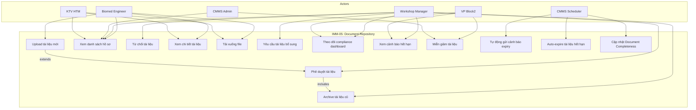
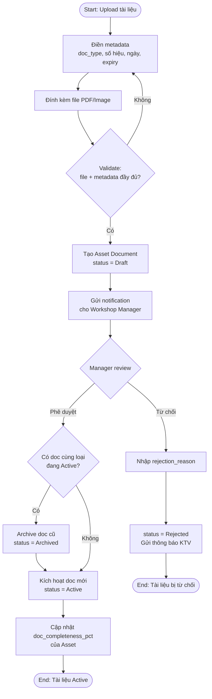
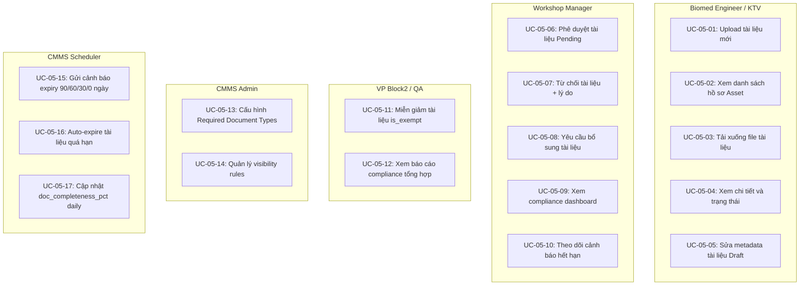

# IMM-05 Functional Specification

**Module:** IMM-05 — Đăng ký, Cấp phép & Quản lý Hồ sơ Thiết bị Y tế
**Version:** 1.0-draft
**Ngày:** 2026-04-16
**Trạng thái:** CHỜ PHÊ DUYỆT

---

## 1. Mục tiêu Module

IMM-05 quản lý **toàn bộ kho hồ sơ kỹ thuật, pháp lý, kiểm định** gắn với từng thiết bị y tế (Asset) hoặc từng dòng sản phẩm (Item/Model) trong suốt vòng đời.

**Không phải** module đơn lẻ — IMM-05 là **hệ thống Document Repository** vận hành song song liên tục với tất cả module khác, từ khi thiết bị được mint (IMM-04) đến khi thanh lý (IMM-13/14).

---

## 2. Phạm vi

### 2.1 In Scope

| # | Chức năng | Mô tả |
|---|-----------|-------|
| F-01 | Document Repository | Kho hồ sơ per-Asset (per-instance) và per-Item (per-model) |
| F-02 | Phân loại tài liệu | 5 nhóm: Pháp lý, Kỹ thuật, Kiểm định, Đào tạo, Chất lượng |
| F-03 | Metadata đầy đủ | Số hiệu, ngày cấp, expiry, version, cơ quan cấp, owner, approver |
| F-04 | Version control | Archive tự động version cũ khi version mới được duyệt |
| F-05 | Auto-import từ IMM-04 | Kế thừa CO/CQ/Packing/Manual/Warranty/License khi Asset được mint |
| F-06 | Expiry alert | Scheduler: 90/60/30/0 ngày, email + in-app notification |
| F-07 | Dashboard | Assets thiếu hồ sơ, sắp hết hạn, compliance rate theo khoa |
| F-08 | Audit trail | Mọi thao tác sinh record (upload, approve, archive, expire, reject) |

### 2.2 Out of Scope

| # | Chức năng | Module phụ trách |
|---|-----------|-----------------|
| 1 | Quản lý hợp đồng vendor | IMM-02 |
| 2 | Lịch đào tạo nhân viên | IMM-06 |
| 3 | Lịch hiệu chuẩn định kỳ | IMM-11 |
| 4 | CAPA management | IMM-16 |
| 5 | Electronic signature (chữ ký số) | v2.0 |
| 6 | Integration FHIR/HIS | Phase 2 |

### 2.3 Dependencies

| Module | Chiều | Mô tả |
|--------|-------|-------|
| IMM-04 | IN | Trigger tạo Document Set khi Asset mint; kế thừa commissioning_documents |
| IMM-06 | OUT | Cung cấp Manual/HDSD cho module Đào tạo |
| IMM-08 | OUT | Cung cấp Service Manual, Spec Sheet cho PM |
| IMM-09 | OUT | Cung cấp Schematic, Parts List cho sửa chữa |
| IMM-11 | BOTH | Cung cấp Certificate hiệu chuẩn; nhận lại cert mới sau hiệu chuẩn |
| IMM-10 | OUT | Compliance score dựa trên document completeness |
| IMM-13 | OUT | Archive toàn bộ kho hồ sơ khi thanh lý |

### 2.4 Assumptions

| # | Giả định |
|---|----------|
| A-01 | ERPNext `Asset` là định danh duy nhất — mọi document link về `Asset.name` |
| A-02 | Tài liệu per-Model (IFU, Service Manual) dùng `Item` làm anchor — áp dụng chung cho toàn bộ asset cùng model |
| A-03 | Tài liệu per-Instance (Giấy phép, Cert hiệu chuẩn) link thẳng `Asset` |
| A-04 | File lưu trong Frappe File System (không S3 ở Wave 1) |
| A-05 | Một Asset có thể có nhiều document cùng loại (các version khác nhau) |
| A-06 | Required Document Set (bộ hồ sơ bắt buộc) được cấu hình per-Item Group, không hard-code |

---

## 3. Actor & Phân quyền

| Actor | Vị trí thực tại BV NĐ1 | Quyền IMM-05 | Trách nhiệm chính |
|-------|------------------------|--------------|-------------------|
| **HTM Technician** | Kỹ thuật viên HTM | Create, Read, Write (Draft only) | Upload tài liệu kỹ thuật, điền metadata |
| **Biomed Engineer** | Kỹ sư Biomedical | Read, Write, Approve/Reject | Xác nhận tài liệu kỹ thuật, cert hiệu chuẩn |
| **Tổ HC-QLCL** | Tổ Hành chính – Quản lý Chất lượng | Read, Write, Create, Approve (Pháp lý) | Thu thập & duyệt giấy phép pháp lý, theo dõi hiệu lực ĐK lưu hành |
| **Workshop Head** | Trưởng Phân xưởng | Read, Submit, Cancel, Amend | Quản lý kho hồ sơ, gửi Document Request, override |
| **VP Block2** | Phó Trưởng Khoa Khối 2 | Read, Submit, Cancel | Phê duyệt bộ hồ sơ đủ điều kiện vận hành |
| **CMMS Admin** | IT/CMMS | Full | Quản trị hệ thống, cấu hình expiry alert |
| **Clinical Head** | Trưởng Khoa Lâm sàng | Read only (khoa mình, Public docs) | Xem hồ sơ thiết bị tại khoa — không xem Internal Only |

---

## 4. User Stories

### US-01: Upload tài liệu mới

```
Là HTM Technician,
Tôi muốn upload tài liệu (PDF/ảnh) cho một thiết bị và điền metadata,
Để tài liệu được lưu trữ tập trung và sẵn sàng cho người duyệt kiểm tra.

Acceptance Criteria:
- GIVEN tôi có quyền Create trên Asset Document
- WHEN tôi chọn Asset, chọn Category, upload file, điền metadata
- THEN hệ thống tạo record status = Draft
- AND naming series theo format DOC-{ASSET}-{YYYY}-{####}
- AND file được attach vào record
```

### US-02: Duyệt / Từ chối tài liệu

```
Là Biomed Engineer hoặc QA Officer,
Tôi muốn xem xét tài liệu đã upload và Approve hoặc Reject,
Để đảm bảo chất lượng hồ sơ trước khi đưa vào kho chính thức.

Acceptance Criteria:
- GIVEN tài liệu ở status Pending_Review
- WHEN tôi nhấn Approve
- THEN status → Active, approved_by = tôi, approval_date = today
- AND nếu có version cũ cùng loại + cùng asset → version cũ auto-archive

- WHEN tôi nhấn Reject
- THEN status → Rejected
- AND rejection_reason là bắt buộc
- AND notification gửi cho người upload
```

### US-03: Auto-import từ IMM-04

```
Là hệ thống,
Khi phiếu Asset Commissioning được Submit (Clinical_Release),
Tôi tự động tạo Document Set cho Asset mới,
Để kho hồ sơ có baseline ngay từ đầu.

Acceptance Criteria:
- GIVEN phiếu IMM-04 chuyển Clinical_Release → on_submit
- THEN hệ thống tạo 1 Asset Document cho mỗi row Received trong commissioning_documents
- AND mỗi doc có source_commissioning = phiếu IMM-04
- AND status = Draft (cần review lại)
- AND nếu qa_license_doc tồn tại → tạo thêm 1 doc category "Pháp lý"
```

### US-04: Cảnh báo hết hạn

```
Là Workshop Head,
Tôi muốn nhận cảnh báo khi tài liệu sắp hết hạn (90/60/30 ngày),
Để kịp thời gia hạn hoặc thay thế trước khi vi phạm pháp lý.

Acceptance Criteria:
- GIVEN tài liệu Active có expiry_date
- WHEN (expiry_date - today) == 90 THEN gửi alert level "Info" cho Workshop Head
- WHEN (expiry_date - today) == 60 THEN gửi alert level "Warning" cho Workshop Head + Biomed
- WHEN (expiry_date - today) == 30 THEN gửi alert level "Critical" cho Workshop Head + VP Block2
- WHEN (expiry_date - today) == 0 THEN auto-transition status → Expired + alert "Danger"
- AND mỗi lần alert sinh 1 record Expiry Alert Log
```

### US-05: Dashboard hồ sơ thiết bị

```
Là VP Block2 hoặc Workshop Head,
Tôi muốn xem dashboard tổng hợp trạng thái hồ sơ toàn khoa,
Để quản lý compliance và ra quyết định kịp thời.

Acceptance Criteria:
- KPI-01: Tổng tài liệu Active
- KPI-02: Số tài liệu sắp hết hạn (90 ngày tới)
- KPI-03: Số tài liệu ĐÃ hết hạn chưa renew
- KPI-04: Số Asset thiếu hồ sơ bắt buộc
- TABLE-01: Danh sách assets thiếu tài liệu theo khoa
- TABLE-02: Timeline tài liệu hết hạn (30/60/90 ngày tới)
- CHART-01: Compliance rate theo khoa (%)
```

### US-06: Xem kho hồ sơ theo Asset

```
Là Biomed Engineer,
Tôi muốn mở 1 Asset và xem toàn bộ hồ sơ liên quan (tất cả version),
Để có đầy đủ context khi bảo trì hoặc kiểm định.

Acceptance Criteria:
- GIVEN tôi đang xem form Asset
- WHEN tôi mở tab/sidebar "Hồ sơ"
- THEN hiển thị danh sách Asset Document filter theo asset_ref
- AND group theo doc_category
- AND Active docs hiển thị đầu, Archived/Expired hiển thị mờ
```

### US-07: Version control

```
Là HTM Technician,
Khi tôi upload phiên bản mới của tài liệu đã có,
Hệ thống tự archive version cũ và link version mới,
Để luôn chỉ có 1 version Active cho mỗi loại tài liệu.

Acceptance Criteria:
- GIVEN tôi upload doc mới cùng asset + cùng doc_type_detail
- AND version cũ đang Active
- WHEN doc mới được Approve
- THEN version cũ → Archived (archived_by_version = version mới)
- AND version mới → Active
- AND KHÔNG XÓA version cũ (chỉ archive)
- AND change_summary là bắt buộc khi version != "1.0"
```

### US-08: Yêu cầu tài liệu bị thiếu (Document Request)

```
Là Workshop Head hoặc Tổ HC-QLCL,
Khi một tài liệu bắt buộc không có hoặc bị mất,
Tôi muốn tạo yêu cầu cung cấp tài liệu (Document Request) kèm deadline,
Để theo dõi và leo thang nếu NCC / bên cung cấp không phản hồi trong 30 ngày.

Acceptance Criteria:
- GIVEN tôi phát hiện tài liệu bắt buộc còn thiếu trên Asset
- WHEN tôi click "Tạo Yêu cầu Tài liệu" từ Asset Document hoặc Dashboard
- THEN hệ thống tạo Document Request record với:
    - asset_ref, doc_type_required, assigned_to, due_date (mặc định +30 ngày)
    - status = "Open"
- AND gửi notification cho assigned_to
- WHEN due_date qua mà status vẫn "Open"
- THEN hệ thống tự leo thang: notification → Workshop Head + VP Block2
- AND status → "Overdue"
```

### US-09: Thiết bị miễn đăng ký (Exempt)

```
Là Tổ HC-QLCL,
Khi thiết bị không cần số ĐK lưu hành theo NĐ98/2021 (miễn đăng ký),
Tôi muốn đánh dấu "Exempt" và upload văn bản miễn đăng ký,
Để GW-2 của IMM-04 không bị chặn mà vẫn có bằng chứng pháp lý.

Acceptance Criteria:
- GIVEN asset đang chờ release tại IMM-04 GW-2
- AND doc loại "Chứng nhận đăng ký lưu hành" chưa có
- WHEN Tổ HC-QLCL tạo Asset Document với is_exempt = True
- AND upload exempt_proof (văn bản miễn đăng ký)
- AND điền exempt_reason
- THEN GW-2 check coi thiết bị là "compliant" (miễn đăng ký hợp lệ)
- AND document_status = "Compliant (Exempt)"
```

---

## 5. Workflow — Trạng thái Tài liệu

### 5.1 State Machine

```
                    ┌──────────┐
                    │  Draft   │ ← Tạo mới / Import từ IMM-04
                    └────┬─────┘
                         │ Submit for Review
                         ▼
                ┌─────────────────┐
                │ Pending_Review  │
                └────┬───────┬────┘
                     │       │
              Approve│       │Reject
                     ▼       ▼
              ┌──────┐   ┌──────────┐
              │Active│   │ Rejected │
              └──┬───┘   └──────────┘
                 │
        ┌────────┼──────────────┐
        │        │              │
   Expiry   New Version    Asset Retired
   (auto)   Approved       (IMM-13)
        │        │              │
        ▼        ▼              ▼
   ┌────────┐ ┌────────┐  ┌────────┐
   │Expired │ │Archived│  │Archived│
   └────────┘ └────────┘  └────────┘
```

### 5.2 State Table

| Code | State | Mô tả | Entry Condition | Exit Condition | Actor chính |
|------|-------|-------|-----------------|----------------|-------------|
| S01 | Draft | Vừa upload, chưa review | Tạo mới hoặc import | Submit for Review | HTM Technician |
| S02 | Pending_Review | Đang chờ duyệt | File + metadata đầy đủ | Approve hoặc Reject | Biomed / QA |
| S03 | Active | Đang có hiệu lực, được sử dụng | Approved | Expiry hoặc superseded | — (auto) |
| S04 | Expired | Đã hết hạn, cần gia hạn | expiry_date < today (scheduler) | Upload version mới | — (auto) |
| S05 | Archived | Lưu trữ lịch sử, không sử dụng | Bị thay thế bởi version mới | TERMINAL | — (auto) |
| S06 | Rejected | Bị từ chối, cần sửa | Reviewer reject | Tạo doc mới | Biomed / QA |

### 5.3 Transition Table

| From | Action | To | Role | Condition |
|------|--------|----|------|-----------|
| Draft | Submit_Review | Pending_Review | HTM Technician | file_attachment not empty |
| Pending_Review | Approve | Active | Biomed Engineer, QA Risk Team | — |
| Pending_Review | Reject | Rejected | Biomed Engineer, QA Risk Team | rejection_reason not empty |
| Active | — (scheduler) | Expired | System | expiry_date == today |
| Active | — (auto) | Archived | System | version mới cùng loại được Approve |

---

## 6. Business Rules

| Code | Rule | Mô tả | Enforcement |
|------|------|-------|-------------|
| BR-01 | Mỗi Asset chỉ có 1 Active doc per doc_type_detail | Khi approve mới → archive cũ | Server (on_approve) |
| BR-02 | Không xóa cứng document | Chỉ archive, không delete | Server (override on_trash) |
| BR-03 | Expiry alert theo mốc 90/60/30/0 | Scheduler daily check | Cron job |
| BR-04 | Auto-import từ IMM-04 | Khi commissioning submit → tạo doc set | Server hook (on_submit) |
| BR-05 | Document set bắt buộc | Config per Item Group qua Required Document Type master | Dashboard check + GW-2 |
| BR-06 | Per-model doc shared | doc is_model_level=True → applicable cho mọi asset cùng Item | Client + Server |
| BR-07 | **GW-2 Gate: Block IMM-04 Submit nếu hồ sơ thiếu** | Trước khi Asset Commissioning được Submit, phải kiểm tra: (1) Asset có Chứng nhận ĐK lưu hành Active HOẶC (2) có Asset Document is_exempt=True cho loại đó. Nếu thiếu → frappe.throw() | Server (asset_commissioning.validate) |
| BR-08 | Thiết bị Exempt khỏi NĐ98 | Nếu is_exempt=True + exempt_proof đã upload → coi là compliant cho loại ĐK đó; document_status = "Compliant" | Server (update_asset_completeness) |
| BR-09 | change_summary bắt buộc khi upload version > 1.0 | Tránh versioning mà không có lý do | Server (validate) |
| BR-10 | Internal Only docs ẩn với Clinical Head | Docs có visibility="Internal_Only" chỉ hiện với HTM Technician, Tổ HC-QLCL, Biomed, Workshop Head | Server (get_list filter) + Client |

---

## 7. Phân loại Tài liệu

### 7.1 Categories & Types

| Category | doc_category | Loại tài liệu cụ thể (doc_type_detail) |
|----------|-------------|----------------------------------------|
| **Pháp lý** | Legal | Giấy phép nhập khẩu, Giấy phép hoạt động, Chứng nhận đăng ký lưu hành, Giấy phép bức xạ |
| **Kỹ thuật** | Technical | Service Manual, User Manual (HDSD), Schematic, Spec Sheet, Parts Catalog |
| **Kiểm định** | Certification | Chứng chỉ hiệu chuẩn, Kết quả kiểm định, Biên bản đo kiểm, Chứng nhận CE/FDA |
| **Đào tạo** | Training | Tài liệu đào tạo, Biên bản đào tạo, Video hướng dẫn |
| **Chất lượng** | QA | CO - Chứng nhận Xuất xứ, CQ - Chứng nhận Chất lượng, Warranty Card, Packing List |

### 7.2 Required Document Set (cấu hình mặc định)

Khi Asset được mint từ IMM-04, hệ thống kiểm tra bộ hồ sơ bắt buộc:

| # | Loại tài liệu | Bắt buộc | Có expiry? | Ghi chú |
|---|---------------|:--------:|:----------:|---------|
| 1 | Giấy phép nhập khẩu | Conditional | Yes | Nếu thiết bị nhập khẩu |
| 2 | Chứng nhận đăng ký lưu hành | Yes | Yes | Bắt buộc theo NĐ98 |
| 3 | CO - Chứng nhận Xuất xứ | Yes | No | — |
| 4 | CQ - Chứng nhận Chất lượng | Yes | No | — |
| 5 | User Manual (HDSD) | Yes | No | Per-model |
| 6 | Warranty Card | Yes | Yes | Thời hạn bảo hành |
| 7 | Giấy phép bức xạ | Conditional | Yes | Nếu is_radiation_device |

---

## 8. Luồng nghiệp vụ End-to-End

### 8.1 Luồng chính: Upload → Approve → Active

```
Step 1: [HTM Technician] Mở form Asset Document
  → Chọn Asset (hoặc Item nếu per-model)
  → Chọn Category + Type
  → Upload file (PDF/Image, max 25MB)
  → Điền metadata: số hiệu, ngày cấp, cơ quan cấp, expiry_date
  → Save → status = Draft

Step 2: [HTM Technician] Click "Gửi Duyệt"
  → Validation: file_attachment không trống
  → status → Pending_Review
  → Notification gửi cho Biomed Engineer / QA Officer

Step 3: [Biomed / QA] Mở document cần duyệt
  → Xem file đính kèm
  → Kiểm tra metadata vs nội dung file
  → Approve → status = Active
    → approved_by = current user
    → approval_date = today
    → Nếu có version cũ cùng loại → auto-archive
  → HOẶC Reject → status = Rejected
    → rejection_reason bắt buộc điền
    → Notification gửi cho người upload

Step 4: [System] Document Active
  → Asset completeness score tự cập nhật
  → Dashboard compliance refresh
```

### 8.2 Luồng phụ: Auto-import từ IMM-04

```
Trigger: Asset Commissioning → on_submit (Clinical_Release)

Step 1: [System] Đọc commissioning_documents table
  → Lọc rows có status = "Received"
  → Với mỗi row:
    - Tạo Asset Document
    - asset_ref = final_asset
    - doc_category = map từ doc_type
    - status = Draft (cần review lại)
    - source_commissioning = commissioning.name

Step 2: [System] Kiểm tra qa_license_doc
  → Nếu tồn tại (file path):
    - Tạo Asset Document
    - doc_category = "Legal"
    - doc_type_detail = "Giấy phép bức xạ"
    - file_attachment = qa_license_doc

Step 3: [System] Log event
  → Tạo Lifecycle Event: "imm05.document_set.auto_created"
```

### 8.3 Luồng phụ: Expiry Alert Cycle

```
Trigger: Scheduler daily (00:30)

Step 1: [System] Query Asset Document
  WHERE workflow_state = "Active"
  AND expiry_date IS NOT NULL

Step 2: Với mỗi doc:
  - Tính days_remaining = expiry_date - today

  IF days_remaining IN (90, 60, 30):
    → Tạo Expiry Alert Log
    → Gửi email theo template
    → Gửi in-app notification (frappe.publish_realtime)

  IF days_remaining <= 0:
    → Chuyển status → Expired
    → Tạo Expiry Alert Log (level = DANGER)
    → Gửi alert cho tất cả stakeholder
```

### 8.4 Luồng phụ: Version Control

```
Trigger: Biomed/QA Approve document mới

Step 1: [System] Kiểm tra existing Active doc
  WHERE asset_ref = doc.asset_ref
  AND doc_type_detail = doc.doc_type_detail
  AND workflow_state = "Active"
  AND name != doc.name

Step 2: Nếu tìm thấy old_doc:
  → old_doc.workflow_state = "Archived"
  → old_doc.archived_by_version = doc.version
  → old_doc.save()

Step 3: doc.workflow_state = "Active"
```

---

## 9. Exception Handling

| # | Tình huống | Xử lý hệ thống | Xử lý nghiệp vụ |
|---|-----------|---------------|-----------------|
| E-01 | Upload file > 25MB | Block + thông báo "Tối đa 25MB" | Nén file hoặc liên hệ CMMS Admin |
| E-02 | File format không hợp lệ | Block + liệt kê format cho phép (PDF/JPG/PNG/DOCX) | Chuyển đổi sang PDF trước khi upload |
| E-03 | Expiry_date < issued_date | Validation error VR-01, highlight đỏ field | Kiểm tra lại ngày trên văn bản gốc |
| E-04 | Trùng doc_number cùng type + cùng asset | Validation error VR-02 | Kiểm tra có phải version mới không — nếu có thì tăng version field |
| E-05 | Asset bị Decommission | Tự động archive toàn bộ docs; không chặn, chỉ log | — |
| E-06 | Approve doc không có file | Block (VR-03) | Yêu cầu HTM upload file trước |
| E-07 | **Thiết bị nhập khẩu cần miễn ĐK (NĐ98)** | Cho phép is_exempt=True + upload exempt_proof; GW-2 coi là "compliant" | Tổ HC-QLCL lưu công văn miễn đăng ký |
| E-08 | **Tài liệu bị mất / NCC không cung cấp** | Tạo Document Request task với deadline; Asset.document_status = "Incomplete" | Workshop Head theo dõi; leo thang nếu quá 30 ngày |
| E-09 | **Số ĐK lưu hành hết hạn khi đang vận hành** | Auto-transition → Expired; Asset.document_status = "Non-Compliant"; cảnh báo đỏ dashboard | Tạm đình chỉ nếu không gia hạn; leo thang BGĐ |
| E-10 | **Tài liệu confidential của NCC** | Đặt visibility = "Internal_Only"; ẩn với Clinical Head và Public role | Chỉ HTM + Tổ HC-QLCL truy cập |
| E-11 | IMM-05 DocType chưa deploy khi IMM-04 Submit | GW-2 check bắt lỗi gracefully: nếu DocType không tồn tại → skip check, log warning | CMMS Admin deploy IMM-05 trước khi enforce |

---

## 10. QMS Mapping

| QMS Code | Loại | Tên | Module | Trạng thái |
|----------|------|-----|--------|-----------|
| QC-IMMIS-05 | L1/Policy | Chính sách quản lý hồ sơ thiết bị | IMM-05 | Planning |
| PR-HTM-05 | SOP | Quy trình tiếp nhận, phân loại, lưu trữ hồ sơ | IMM-05 | Planning |
| WI-HTM-05-01 | Work Instruction | Hướng dẫn upload tài liệu lên hệ thống | IMM-05 | Planning |
| WI-HTM-05-02 | Work Instruction | Hướng dẫn duyệt & archive tài liệu | IMM-05 | Planning |
| BM-HTM-05-01 | Form | Form upload tài liệu (Asset Document) | IMM-05 | Draft |
| HS-LOG-05-01 | Log | Expiry Alert Log | IMM-05 | Draft |
| KPI-DASH-05 | Dashboard | Dashboard Compliance Hồ sơ | IMM-05 | Planning |

---

## 11. Mapping với WHO HTM Framework

| WHO Guideline | Nội dung | Áp dụng IMM-05 |
|---------------|----------|----------------|
| WHO-HTM 2.1 | Medical device registration and regulation | Document repository cho giấy phép, chứng nhận |
| WHO-HTM 2.3 | Medical device nomenclature | doc_type_detail mapping theo GMDN/UMDNS |
| WHO-HTM 3.2 | Documentation and record keeping | Version control, audit trail, archive policy |
| NĐ 98/2021 | Quản lý trang thiết bị y tế | Bắt buộc: giấy phép lưu hành, giấy phép nhập khẩu |

---

## 12. Use Case Diagram



---

## 13. Activity Diagram — Upload & Approve Flow



---

## 14. Non-Functional Requirements

| ID | Yêu cầu | Chỉ tiêu | Phương pháp kiểm tra |
|---|---|---|---|
| NFR-05-01 | Performance: Load danh sách hồ sơ | < 2s với 10,000 records | Load test JMeter |
| NFR-05-02 | File upload size limit | Tối đa 50 MB/file | Validate backend |
| NFR-05-03 | Audit trail immutability | Không thể xóa/sửa sau Submit | DB constraint + permission |
| NFR-05-04 | Availability | 99.5% trong giờ hành chính | Uptime monitoring |
| NFR-05-05 | Concurrent users | 50 users đồng thời không degradation | Load test |
| NFR-05-06 | Data retention | Hồ sơ giữ tối thiểu 10 năm sau thanh lý | Archival policy |
| NFR-05-07 | File format support | PDF, DOCX, XLSX, JPG, PNG | Whitelist validation |
| NFR-05-08 | Encryption | File attachment mã hóa at-rest | Server config |

---

## Biểu Đồ Use Case Phân Rã — IMM-05

### Phân rã theo Actor



---

## Đặc Tả Use Case — IMM-05

### UC-05-01: Upload tài liệu mới

| Thuộc tính | Nội dung |
|---|---|
| **UC ID** | UC-05-01 |
| **Tên** | Upload tài liệu kỹ thuật/pháp lý mới cho Asset |
| **Actor chính** | Biomed Engineer |
| **Actor phụ** | Workshop Manager (nhận notification) |
| **Tiền điều kiện** | Asset đã tồn tại trong hệ thống (status ≠ Retired); người dùng có role Biomed Engineer hoặc CMMS Admin |
| **Hậu điều kiện** | Asset Document tạo với workflow_state = Draft; notification gửi Workshop Manager |
| **Luồng chính** | 1. KTV chọn Asset từ danh sách<br>2. Nhấn "Upload Document"<br>3. Chọn doc_type từ dropdown (Required Document Types)<br>4. Điền: document_number, issuing_authority, issue_date, expiry_date (nếu có), version<br>5. Đính kèm file PDF/Image (≤ 50MB)<br>6. Chọn visibility (Internal/External/Confidential)<br>7. Nhấn Submit → hệ thống tạo Asset Document<br>8. Hệ thống gửi notification đến Workshop Manager |
| **Luồng thay thế** | 5a. File > 50MB → hệ thống báo lỗi "Vượt quá giới hạn 50MB"<br>5b. Định dạng không hợp lệ → báo lỗi whitelist format<br>4a. expiry_date < today → cảnh báo nhưng vẫn cho phép |
| **Luồng ngoại lệ** | 7a. DB connection lỗi → thông báo lỗi, dữ liệu không lưu |
| **Business Rule** | BR-05-01: Mọi tài liệu phải có file_attachment; BR-05-02: doc_type phải thuộc Required Document Types |

---

### UC-05-06: Phê duyệt tài liệu

| Thuộc tính | Nội dung |
|---|---|
| **UC ID** | UC-05-06 |
| **Tên** | Phê duyệt tài liệu từ trạng thái Pending_Review sang Active |
| **Actor chính** | Workshop Manager |
| **Actor phụ** | Biomed Engineer (nhận notification kết quả) |
| **Tiền điều kiện** | Asset Document ở workflow_state = Pending_Review; người dùng có role Workshop Manager, Tổ HC-QLCL, hoặc CMMS Admin |
| **Hậu điều kiện** | workflow_state = Active; nếu có doc cùng loại đang Active → doc cũ chuyển Archived; doc_completeness_pct của Asset được cập nhật |
| **Luồng chính** | 1. Manager nhận notification tài liệu mới<br>2. Mở chi tiết tài liệu, review nội dung và file<br>3. Nhấn "Approve"<br>4. Hệ thống kiểm tra doc cùng type đang Active<br>5. Nếu có: auto-archive doc cũ<br>6. Set workflow_state = Active, ghi approved_by + approved_date<br>7. Cập nhật doc_completeness_pct cho Asset<br>8. Gửi notification đến Biomed Engineer |
| **Luồng thay thế** | 3a. Manager chọn "Reject" → chuyển UC-05-07 |
| **Luồng ngoại lệ** | 6a. Archive doc cũ thất bại → rollback, alert Admin |
| **Business Rule** | BR-05-03: Chỉ 1 version Active cho mỗi doc_type per Asset; BR-05-04: Archive tự động không thể undo |

---

### UC-05-15: Gửi cảnh báo expiry

| Thuộc tính | Nội dung |
|---|---|
| **UC ID** | UC-05-15 |
| **Tên** | Gửi cảnh báo tự động khi tài liệu sắp hết hạn |
| **Actor chính** | CMMS Scheduler |
| **Actor phụ** | Workshop Manager, VP Block2, QA Risk Team (nhận email) |
| **Tiền điều kiện** | Asset Document có expiry_date ≠ null và workflow_state = Active; Scheduler job chạy daily 00:30 |
| **Hậu điều kiện** | Expiry Alert Log entry được tạo; email gửi đến roles tương ứng theo mốc ngày |
| **Luồng chính** | 1. Scheduler chạy check_document_expiry()<br>2. Query docs có expiry_date = today + {90/60/30/0}<br>3. Với mỗi doc tìm thấy: kiểm tra Expiry Alert Log hôm nay đã tạo chưa<br>4. Nếu chưa: tạo Expiry Alert Log mới<br>5. Lấy email theo role config của mốc ngày<br>6. Gửi email cảnh báo với link đến doc<br>7. Khi days=0: auto-set workflow_state = Expired |
| **Luồng thay thế** | 3a. Alert Log đã tồn tại hôm nay → skip (tránh duplicate) |
| **Luồng ngoại lệ** | 5a. Không có email recipient → log warning, không gửi |
| **Business Rule** | BR-05-05: Expiry Alert Log immutable sau insert; BR-05-06: days=0 → auto-expire ngay |
