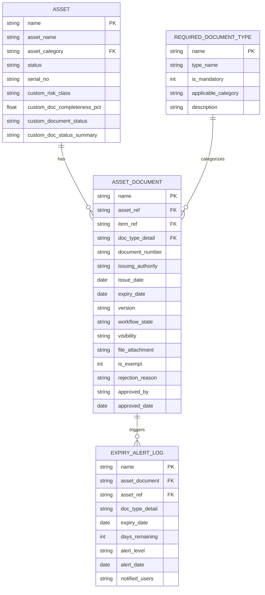
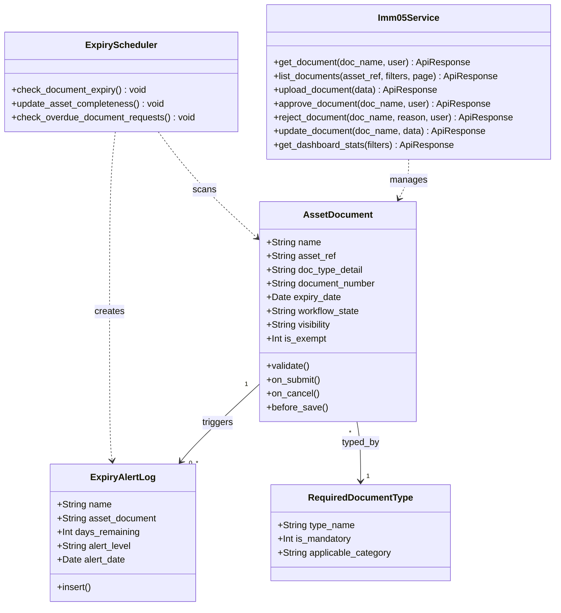
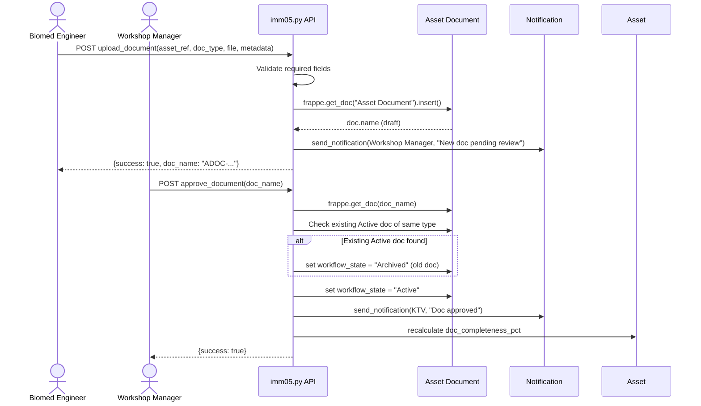
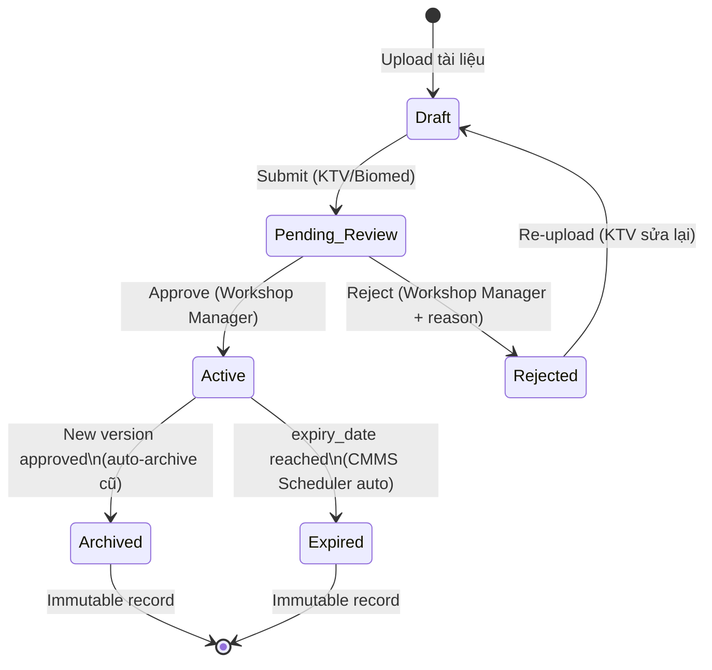
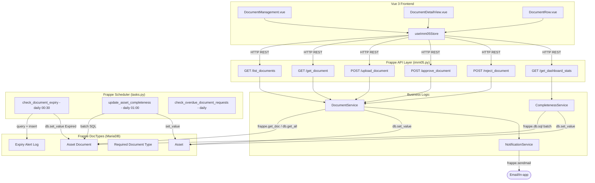

# IMM-05 Technical Design

**Module:** IMM-05 — Đăng ký, Cấp phép & Quản lý Hồ sơ Thiết bị Y tế
**Version:** 1.0-draft
**Ngày:** 2026-04-16
**Trạng thái:** CHỜ PHÊ DUYỆT

---

## 1. Tổng quan kiến trúc

### 1.1 Vị trí trong System

```
assetcore/
  assetcore/
    assetcore/
      doctype/
        asset_document/           ← DocType chính IMM-05 (NEW)
        expiry_alert_log/         ← Log cảnh báo hết hạn (NEW)
        required_document_type/   ← Master config bộ hồ sơ bắt buộc (NEW)
      page/
        imm05_dashboard/          ← Dashboard Page (NEW)
    api/
      imm04.py                    ← API IMM-04 (existing)
      imm05.py                    ← API IMM-05 (NEW)
      __init__.py                 ← Re-export (UPDATE)
    tasks.py                      ← Thêm scheduler IMM-05 (UPDATE)
    hooks.py                      ← Thêm doc_events + scheduler (UPDATE)
```

### 1.2 Pattern tuân thủ

- Theo đúng pattern `api/imm04.py`: response chuẩn `_ok()` / `_err()`, whitelist validation, JSON parse
- DocType nằm trong `assetcore/assetcore/doctype/` (giữ đúng nested module path)
- Controller class kế thừa `frappe.model.document.Document`
- Workflow dùng Frappe native Workflow engine (fixture)

---

## 2. DocType Schema

### 2.1 Asset Document (DocType chính)

**Config:**

| Property | Value |
|----------|-------|
| name | Asset Document |
| module | AssetCore |
| autoname | `format:DOC-.asset_ref.-.YYYY.-.#####` |
| is_submittable | No (dùng workflow state thay vì docstatus) |
| track_changes | Yes |
| track_views | Yes |
| naming_rule | Expression |

**Fields:**

| # | fieldname | fieldtype | label | options | reqd | read_only | in_list_view | search_index | Ghi chú |
|---|-----------|-----------|-------|---------|:----:|:---------:|:------------:|:------------:|---------|
| 1 | workflow_state | Link | Trạng thái | Workflow State | — | 1 | 1 | 1 | Auto by workflow |
| — | **Section: Liên kết Thiết bị** | | | | | | | | |
| 2 | asset_ref | Link | Tài sản | Asset | * | — | 1 | 1 | Per-instance |
| 3 | model_ref | Link | Model Thiết bị | Item | — | — | — | 1 | Per-model (auto-fetch) |
| 4 | is_model_level | Check | Áp dụng toàn bộ Model | — | — | — | — | — | Tick = doc dùng chung cho model |
| 5 | clinical_dept | Link | Khoa / Phòng | Department | — | 1 | — | — | Fetch from asset_ref |
| — | **Column Break** | | | | | | | | |
| 6 | source_commissioning | Link | Phiếu Commissioning nguồn | Asset Commissioning | — | 1 | — | — | Nếu import từ IMM-04 |
| 7 | source_module | Data | Module nguồn | — | — | 1 | — | — | "IMM-04", "IMM-11", etc. |
| — | **Section: Phân loại Tài liệu** | | | | | | | | |
| 8 | doc_category | Select | Nhóm Hồ sơ | Legal\nTechnical\nCertification\nTraining\nQA | 1 | — | 1 | — | 5 nhóm chính |
| 9 | doc_type_detail | Data | Loại Tài liệu cụ thể | — | 1 | — | 1 | — | Free text nhưng có suggest |
| — | **Column Break** | | | | | | | | |
| 10 | doc_number | Data | Số hiệu Tài liệu | — | 1 | — | — | 1 | Unique per type per asset |
| 11 | version | Data | Phiên bản | — | 1 | — | — | — | Mặc định "1.0" |
| — | **Section: Thông tin Hiệu lực** | | | | | | | | |
| 12 | issued_date | Date | Ngày cấp | — | 1 | — | — | — | — |
| 13 | expiry_date | Date | Ngày hết hạn | — | — | — | 1 | 1 | Bắt buộc nếu Legal/Certification |
| 14 | issuing_authority | Data | Cơ quan cấp | — | — | — | — | — | Bắt buộc nếu Legal |
| — | **Column Break** | | | | | | | | |
| 15 | days_until_expiry | Int | Số ngày còn lại | — | — | 1 | — | — | Virtual, tính = expiry - today |
| 16 | is_expired | Check | Đã hết hạn | — | — | 1 | — | — | Virtual, auto-set |
| — | **Section: File đính kèm** | | | | | | | | |
| 17 | file_attachment | Attach | File Tài liệu | — | 1 | — | — | — | PDF/JPG/PNG, max 25MB |
| 18 | file_name_display | Data | Tên file | — | — | 1 | — | — | Auto-set từ attachment |
| — | **Section: Phê duyệt** | | | | | | | | |
| 19 | approved_by | Link | Người phê duyệt | User | — | 1 | — | — | Set khi Approve |
| 20 | approval_date | Date | Ngày phê duyệt | — | — | 1 | — | — | Set khi Approve |
| 21 | rejection_reason | Small Text | Lý do Từ chối | — | — | — | — | — | Bắt buộc khi Reject |
| — | **Section: Version Control** | | | | | | | | |
| 22 | superseded_by | Link | Thay thế bởi | Asset Document | — | 1 | — | — | Link tới version mới |
| 23 | archived_by_version | Data | Lý do Archive | — | — | 1 | — | — | "Superseded by v2.0" |
| 24 | archive_date | Date | Ngày Archive | — | — | 1 | — | — | Auto-set |
| — | **Section: Version Control** | | | | | | | | |
| 22 | superseded_by | Link | Thay thế bởi | Asset Document | — | 1 | — | — | Link tới version mới |
| 23 | archived_by_version | Data | Lý do Archive | — | — | 1 | — | — | "Superseded by v2.0" |
| 24 | archive_date | Date | Ngày Archive | — | — | 1 | — | — | Auto-set |
| 25 | change_summary | Small Text | Tóm tắt thay đổi | — | — | — | — | — | **Bắt buộc khi version != "1.0"** (VR-09) |
| — | **Section: Kiểm soát Quyền truy cập** | | | | | | | | |
| 26 | visibility | Select | Phạm vi xem | Public\nInternal_Only | — | — | 1 | — | Internal_Only: ẩn với Clinical Head |
| — | **Section: Miễn đăng ký (NĐ98 Exempt)** | | | | | | | | |
| 27 | is_exempt | Check | Miễn đăng ký NĐ98 | — | — | — | — | — | Tick nếu có văn bản miễn ĐK lưu hành |
| 28 | exempt_reason | Small Text | Lý do miễn đăng ký | — | — | — | — | — | Bắt buộc khi is_exempt=1 (VR-10) |
| 29 | exempt_proof | Attach | Văn bản miễn đăng ký | — | — | — | — | — | Bắt buộc khi is_exempt=1 (VR-10) |
| — | **Section: Ghi chú** | | | | | | | | |
| 30 | notes | Text Editor | Ghi chú nội bộ | — | — | — | — | — | — |

**Permissions:**

| Role | Read | Write | Create | Submit | Cancel | Amend | Permlevel |
|------|:----:|:-----:|:------:|:------:|:------:|:-----:|:---------:|
| HTM Technician | 1 | 1 (Draft) | 1 | 0 | 0 | 0 | 0 |
| Biomed Engineer | 1 | 1 | 0 | 0 | 0 | 0 | 0 |
| Tổ HC-QLCL | 1 | 1 | 1 | 0 | 0 | 0 | 0 |
| Workshop Head | 1 | 1 | 1 | 0 | 1 | 1 | 0 |
| VP Block2 | 1 | 1 | 0 | 0 | 1 | 0 | 0 |
| CMMS Admin | 1 | 1 | 1 | 0 | 1 | 1 | 0 |
| Clinical Head | 1 (Public only) | 0 | 0 | 0 | 0 | 0 | 0 |

### 2.2 Expiry Alert Log (DocType phụ)

**Config:**

| Property | Value |
|----------|-------|
| name | Expiry Alert Log |
| module | AssetCore |
| autoname | `format:EAL-.YYYY.-.MM.-.#####` |
| is_submittable | No |
| track_changes | No |

**Fields:**

| # | fieldname | fieldtype | label | options | reqd | read_only |
|---|-----------|-----------|-------|---------|:----:|:---------:|
| 1 | asset_document | Link | Tài liệu | Asset Document | 1 | 1 |
| 2 | asset_ref | Link | Tài sản | Asset | 1 | 1 |
| 3 | doc_type_detail | Data | Loại Tài liệu | — | — | 1 |
| 4 | expiry_date | Date | Ngày hết hạn | — | 1 | 1 |
| 5 | days_remaining | Int | Số ngày còn lại | — | 1 | 1 |
| 6 | alert_level | Select | Mức cảnh báo | Info\nWarning\nCritical\nDanger | 1 | 1 |
| 7 | notified_users | Small Text | Đã thông báo | — | — | 1 |
| 8 | alert_date | Date | Ngày gửi cảnh báo | — | 1 | 1 |

**Permissions:** Read-only cho tất cả role (chỉ system tạo).

### 2.3 Document Request (DocType phụ — GAP-04)

**Config:**

| Property | Value |
|----------|-------|
| name | Document Request |
| module | AssetCore |
| autoname | `format:DOCREQ-.YYYY.-.MM.-.#####` |
| is_submittable | No |
| track_changes | Yes |

**Fields:**

| # | fieldname | fieldtype | label | options | reqd | read_only | Ghi chú |
|---|-----------|-----------|-------|---------|:----:|:---------:|---------|
| 1 | asset_ref | Link | Tài sản | Asset | 1 | — | Asset cần bổ sung tài liệu |
| 2 | doc_type_required | Data | Loại tài liệu cần | — | 1 | — | Ví dụ: "Chứng nhận đăng ký lưu hành" |
| 3 | doc_category | Select | Nhóm | Legal\nTechnical\nCertification\nTraining\nQA | 1 | — | — |
| 4 | assigned_to | Link | Giao cho | User | 1 | — | Người chịu trách nhiệm thu thập |
| 5 | due_date | Date | Hạn hoàn thành | — | 1 | — | Mặc định = today + 30 ngày |
| 6 | status | Select | Trạng thái | Open\nIn_Progress\nOverdue\nFulfilled\nCancelled | 1 | — | — |
| 7 | priority | Select | Ưu tiên | Low\nMedium\nHigh\nCritical | — | — | Mặc định = Medium |
| 8 | request_note | Small Text | Ghi chú yêu cầu | — | — | — | Mô tả cụ thể tài liệu cần |
| 9 | fulfilled_by | Link | Hoàn thành bởi | Asset Document | — | 1 | Link tới doc được upload sau |
| 10 | escalation_sent | Check | Đã leo thang | — | — | 1 | Auto-set khi scheduler leo thang |
| 11 | source_type | Select | Nguồn tạo | Manual\nDashboard\nGW2_Block\nScheduler | — | 1 | Tracking từ đâu tạo ra |

**Permissions:**

| Role | Read | Write | Create | Delete |
|------|:----:|:-----:|:------:|:------:|
| HTM Technician | 1 | 1 | 1 | 0 |
| Tổ HC-QLCL | 1 | 1 | 1 | 0 |
| Biomed Engineer | 1 | 1 | 1 | 0 |
| Workshop Head | 1 | 1 | 1 | 1 |
| CMMS Admin | 1 | 1 | 1 | 1 |
| Clinical Head | 0 | 0 | 0 | 0 |

**Scheduler logic:**

```python
def check_overdue_document_requests():
    """Chạy daily — tự động leo thang Document Request quá hạn."""
    overdue = frappe.get_all("Document Request",
        filters={"status": "Open", "due_date": ("<", nowdate())},
        fields=["name", "asset_ref", "doc_type_required", "assigned_to"]
    )
    for req in overdue:
        frappe.db.set_value("Document Request", req.name, {
            "status": "Overdue",
            "escalation_sent": 1
        })
        # Notify Workshop Head + VP Block2
        ...
```

---

### 2.4 Required Document Type (Master Data)

**Config:**

| Property | Value |
|----------|-------|
| name | Required Document Type |
| module | AssetCore |
| autoname | field:type_name |
| is_submittable | No |

**Fields:**

| # | fieldname | fieldtype | label | options | reqd |
|---|-----------|-----------|-------|---------|:----:|
| 1 | type_name | Data | Tên loại tài liệu | — | 1 |
| 2 | doc_category | Select | Nhóm | Legal\nTechnical\nCertification\nTraining\nQA | 1 |
| 3 | has_expiry | Check | Có ngày hết hạn | — | — |
| 4 | is_mandatory | Check | Bắt buộc cho mọi Asset | — | — |
| 5 | applies_to_item_group | Link | Áp dụng cho nhóm Item | Item Group | — |
| 6 | applies_when_radiation | Check | Chỉ bắt buộc khi thiết bị bức xạ | — | — |

**Mục đích:** Cho phép cấu hình "bộ hồ sơ bắt buộc" mà không hard-code. Dashboard sẽ so sánh actual docs vs required docs.

---

## 3. Custom Fields trên Core DocType

### 3.1 Asset (ERPNext Core)

| fieldname | fieldtype | label | options | Ghi chú |
|-----------|-----------|-------|---------|---------|
| custom_doc_completeness_pct | Percent | Tỷ lệ Hồ sơ đầy đủ (%) | — | Read-only, cập nhật bởi IMM-05 scheduler |
| custom_document_status | Select | Trạng thái Hồ sơ | Compliant\nCompliant (Exempt)\nIncomplete\nExpiring_Soon\nNon-Compliant | **Enum rõ ràng để filter, GW-2 check và dashboard badge** |
| custom_doc_status_summary | Small Text | Tóm tắt Hồ sơ | — | Read-only, format: "5/7 bắt buộc, 2 sắp hết hạn" |
| custom_nearest_expiry | Date | Hồ sơ hết hạn gần nhất | — | Read-only |

**Logic cập nhật `custom_document_status`** (trong `update_asset_completeness()`):

```python
def _compute_document_status(pct: float, has_expiring: bool, has_expired: bool, is_exempt: bool) -> str:
    if is_exempt:
        return "Compliant (Exempt)"
    if has_expired:
        return "Non-Compliant"
    if has_expiring:           # bất kỳ doc nào trong 30 ngày tới
        return "Expiring_Soon"
    if pct >= 100:
        return "Compliant"
    return "Incomplete"
```

---

## 4. Validation Rules (Server-side)

| Code | Rule | Khi nào chạy | Logic |
|------|------|-------------|-------|
| VR-01 | expiry_date > issued_date | validate() | Nếu cả 2 có giá trị → so sánh |
| VR-02 | doc_number unique per type per asset | validate() | Query: same asset_ref + doc_type_detail + doc_number + name != self |
| VR-03 | file_attachment bắt buộc trước Submit_Review | before_save() | Nếu workflow_state sắp = Pending_Review và file trống → throw |
| VR-04 | issuing_authority bắt buộc khi Legal | validate() | Nếu doc_category == "Legal" và issuing_authority trống → throw |
| VR-05 | Không Submit khi Archived/Expired | validate() | Block state regression |
| VR-06 | rejection_reason bắt buộc khi Reject | before_save() | Nếu transition → Rejected và rejection_reason trống → throw |
| VR-07 | expiry_date bắt buộc khi Legal/Certification | validate() | Nếu category in ("Legal","Certification") và expiry_date trống → throw |
| VR-08 | File format: chỉ PDF/JPG/PNG/DOCX | validate() | Kiểm tra extension từ file_attachment URL; throw nếu không hợp lệ |
| VR-09 | change_summary bắt buộc khi version != "1.0" | validate() | Nếu version không phải "1.0" và change_summary trống → throw |
| VR-10 | exempt_reason + exempt_proof bắt buộc khi is_exempt=1 | validate() | Nếu is_exempt và (exempt_reason trống hoặc exempt_proof trống) → throw |
| VR-11 | is_exempt chỉ áp dụng cho doc_type liên quan đến ĐK lưu hành | validate() | Nếu is_exempt=1 và doc_type_detail không in ("Chứng nhận đăng ký lưu hành", "Giấy phép nhập khẩu") → throw |

---

## 5. Server Hooks (Python Controller)

### 5.1 asset_document.py

```python
class AssetDocument(Document):

    def validate(self):
        self.vr_01_expiry_after_issued()
        self.vr_02_unique_doc_number()
        self.vr_04_legal_requires_authority()
        self.vr_07_legal_requires_expiry()
        self.auto_fetch_model_and_dept()

    def before_save(self):
        self.vr_03_file_required_for_review()
        self.vr_06_rejection_reason_required()
        self.set_computed_fields()

    def on_update(self):
        # Khi chuyển sang Active → archive version cũ
        if self.workflow_state == "Active":
            self.archive_old_versions()
            self.update_asset_completeness()

        # Khi chuyển sang Expired
        if self.workflow_state == "Expired":
            self.update_asset_completeness()

    def on_trash(self):
        # BR-02: Không cho xóa — chuyển sang Archived thay vì delete
        frappe.throw(_("Không được phép xóa tài liệu. Hãy chuyển sang trạng thái Archived."))

    # ── Business Logic ──

    def archive_old_versions(self):
        """BR-01: Chỉ 1 Active per type per asset."""
        ...

    def update_asset_completeness(self):
        """Cập nhật custom_doc_completeness_pct trên Asset."""
        ...

    def auto_fetch_model_and_dept(self):
        """Auto-fill model_ref và clinical_dept từ asset_ref."""
        ...

    def set_computed_fields(self):
        """Tính days_until_expiry, is_expired."""
        ...
```

### 5.2 Hook vào asset_commissioning.py (UPDATE)

```python
# Thêm vào validate() — GW-2 compliance gate (BR-07)
def validate(self):
    ...
    if self.workflow_state in ("Clinical_Release", "Pending_Release"):
        self._gw2_check_document_compliance()

def _gw2_check_document_compliance(self):
    """BR-07: Block Submit nếu thiết bị thiếu Chứng nhận ĐK lưu hành.
    Bỏ qua nếu: (1) Asset Document DocType chưa deploy, (2) thiết bị có is_exempt=True.
    """
    # Graceful degradation: nếu IMM-05 chưa deploy → skip
    if not frappe.db.table_exists("Asset Document"):
        frappe.log_error("IMM-05 DocType chưa tồn tại — GW-2 check bị bỏ qua", "GW2 Warning")
        return

    asset_name = self.final_asset or self.get("asset")
    if not asset_name:
        return

    # Kiểm tra Exempt
    exempt_exists = frappe.db.exists("Asset Document", {
        "asset_ref": asset_name,
        "doc_type_detail": ("in", ["Chứng nhận đăng ký lưu hành", "Giấy phép nhập khẩu"]),
        "is_exempt": 1,
        "exempt_proof": ("is", "set"),
    })
    if exempt_exists:
        return  # Thiết bị được miễn — pass

    # Kiểm tra có Active doc
    active_exists = frappe.db.exists("Asset Document", {
        "asset_ref": asset_name,
        "doc_type_detail": "Chứng nhận đăng ký lưu hành",
        "workflow_state": "Active",
    })
    if not active_exists:
        frappe.throw(
            _(
                "GW-2 Compliance Block: Thiết bị {0} chưa có <b>Chứng nhận đăng ký lưu hành</b> "
                "hợp lệ trong IMM-05. Vui lòng upload tài liệu hoặc đánh dấu Exempt trước khi Submit."
            ).format(asset_name),
            title=_("Thiếu hồ sơ pháp lý")
        )


# Thêm vào on_submit() sau mint_core_asset()
def on_submit(self):
    ...
    self.mint_core_asset()
    self.create_initial_document_set()  # NEW
    self.fire_release_event()


def create_initial_document_set(self):
    """US-03: Auto-import documents từ commissioning_documents table vào IMM-05.
    Tạo Asset Document Draft cho mỗi row Received trong commissioning_documents.
    """
    if not frappe.db.table_exists("Asset Document"):
        return  # IMM-05 chưa deploy — skip gracefully

    asset_name = self.final_asset
    if not asset_name:
        return

    DOC_CATEGORY_MAP = {
        "CO": "QA", "CQ": "QA", "Packing": "QA",
        "Manual": "Technical", "Warranty": "QA",
        "License": "Legal", "Training": "Training", "Other": "Technical",
    }

    for row in self.get("commissioning_documents", []):
        if row.status != "Received":
            continue
        try:
            frappe.get_doc({
                "doctype": "Asset Document",
                "asset_ref": asset_name,
                "doc_category": DOC_CATEGORY_MAP.get(row.doc_type, "Technical"),
                "doc_type_detail": row.doc_type,
                "doc_number": row.get("doc_number") or "—",
                "version": "1.0",
                "issued_date": row.get("received_date") or nowdate(),
                "source_commissioning": self.name,
                "source_module": "IMM-04",
                "visibility": "Public",
                "workflow_state": "Draft",
                "change_summary": "Auto-imported từ IMM-04 " + self.name,
            }).insert(ignore_permissions=True)
        except Exception as e:
            frappe.log_error(
                f"IMM-05 auto-import failed for doc_type={row.doc_type}: {e}",
                "IMM-05 Auto Import"
            )

    # Kiểm tra qa_license_doc
    if self.get("qa_license_doc"):
        frappe.get_doc({
            "doctype": "Asset Document",
            "asset_ref": asset_name,
            "doc_category": "Legal",
            "doc_type_detail": "Giấy phép bức xạ",
            "doc_number": "—",
            "version": "1.0",
            "issued_date": nowdate(),
            "file_attachment": self.qa_license_doc,
            "source_commissioning": self.name,
            "source_module": "IMM-04",
            "visibility": "Internal_Only",
            "workflow_state": "Draft",
        }).insert(ignore_permissions=True)
```

---

## 6. API Endpoints (`api/imm05.py`)

Tuân thủ pattern giống `api/imm04.py`: response wrapper `_ok()/_err()`, permission check, JSON parse.

### 6.1 Danh sách endpoints

| # | Method | Endpoint | Mô tả | Auth |
|---|--------|----------|-------|------|
| 1 | GET | `imm05.list_documents` | Paginated list + filters (tự động ẩn Internal_Only nếu không có quyền) | Read perm |
| 2 | GET | `imm05.get_document` | Chi tiết 1 document | Read perm |
| 3 | POST | `imm05.create_document` | Upload tài liệu mới | Create perm |
| 4 | POST | `imm05.update_document` | Sửa metadata (Draft only) | Write perm |
| 5 | POST | `imm05.approve_document` | Approve → Active (archive version cũ tự động) | Biomed / Tổ HC-QLCL |
| 6 | POST | `imm05.reject_document` | Reject + reason | Biomed / Tổ HC-QLCL |
| 7 | GET | `imm05.get_asset_documents` | Toàn bộ docs theo Asset, group by category | Read perm |
| 8 | GET | `imm05.get_dashboard_stats` | KPIs cho Dashboard IMM-05 | Read perm |
| 9 | GET | `imm05.get_expiring_documents` | Docs sắp hết hạn trong N ngày | Read perm |
| 10 | GET | `imm05.get_compliance_by_dept` | Compliance rate theo khoa (%) | Read perm |
| 11 | GET | `imm05.get_document_history` | Lịch sử thay đổi của 1 document (wrap Frappe Version) | Read perm |
| 12 | POST | `imm05.create_document_request` | Tạo Document Request task | Write perm |
| 13 | GET | `imm05.get_document_requests` | Danh sách Document Request (lọc theo asset / status) | Read perm |
| 14 | POST | `imm05.mark_exempt` | Đánh dấu thiết bị Exempt khỏi loại ĐK nhất định | Tổ HC-QLCL |

### 6.2 Chi tiết Request/Response

**6.2.1 list_documents**

```
GET /api/method/assetcore.api.imm05.list_documents
Params:
  filters: {"doc_category": "Legal", "workflow_state": "Active"}
  page: 1
  page_size: 20

Response:
{
  "success": true,
  "data": {
    "items": [...],
    "pagination": { "page": 1, "page_size": 20, "total": 45, "total_pages": 3 }
  }
}
```

**6.2.2 get_asset_documents**

```
GET /api/method/assetcore.api.imm05.get_asset_documents?asset=AST-2026-0001
Response:
{
  "success": true,
  "data": {
    "asset": "AST-2026-0001",
    "completeness_pct": 71.4,
    "documents": {
      "Legal": [
        { "name": "DOC-...", "doc_type_detail": "Giấy phép nhập khẩu",
          "workflow_state": "Active", "expiry_date": "2027-06-30", ... }
      ],
      "Technical": [...],
      ...
    },
    "missing_required": ["Chứng nhận đăng ký lưu hành"]
  }
}
```

**6.2.3 get_dashboard_stats**

```
GET /api/method/assetcore.api.imm05.get_dashboard_stats
Response:
{
  "success": true,
  "data": {
    "kpis": {
      "total_active": 342,
      "expiring_90d": 12,
      "expired_not_renewed": 3,
      "assets_missing_docs": 8
    },
    "expiry_timeline": [
      { "name": "DOC-...", "asset_ref": "AST-...", "doc_type_detail": "...",
        "expiry_date": "2026-06-15", "days_remaining": 60 }
    ],
    "compliance_by_dept": [
      { "dept": "ICU", "total_assets": 25, "compliant": 22, "pct": 88.0 },
      { "dept": "OR", "total_assets": 18, "compliant": 15, "pct": 83.3 }
    ]
  }
}
```

**6.2.4 approve_document**

```
POST /api/method/assetcore.api.imm05.approve_document
Body: { "name": "DOC-AST-2026-0001-2026-00001" }

Response:
{
  "success": true,
  "data": {
    "name": "DOC-...",
    "new_state": "Active",
    "approved_by": "admin@example.com",
    "archived_old": "DOC-...-00001"  // nếu có version cũ bị archive
  }
}
```

**6.2.5 reject_document**

```
POST /api/method/assetcore.api.imm05.reject_document
Body: { "name": "DOC-...", "rejection_reason": "File không đúng phiên bản..." }

Response:
{
  "success": true,
  "data": {
    "name": "DOC-...",
    "new_state": "Rejected"
  }
}
```

**6.2.6 get_document_history** *(GAP-06)*

```
GET /api/method/assetcore.api.imm05.get_document_history?name=DOC-AST-2026-0001-2026-00001

Response:
{
  "success": true,
  "data": {
    "name": "DOC-AST-2026-0001-2026-00001",
    "history": [
      {
        "timestamp": "2026-04-16 09:30:00",
        "user": "hieu@bvnd1.vn",
        "action": "Workflow Transition",
        "from_state": "Draft",
        "to_state": "Pending_Review",
        "changes": []
      },
      {
        "timestamp": "2026-04-16 14:15:00",
        "user": "biomed@bvnd1.vn",
        "action": "Workflow Transition",
        "from_state": "Pending_Review",
        "to_state": "Active",
        "changes": [
          { "field": "approved_by", "old": null, "new": "biomed@bvnd1.vn" },
          { "field": "approval_date", "old": null, "new": "2026-04-16" }
        ]
      }
    ]
  }
}
```

*Implementation:* Wrap `frappe.get_all("Version", filters={"ref_doctype": "Asset Document", "docname": name})` và parse `data` JSON field.

**6.2.7 create_document_request** *(GAP-04)*

```
POST /api/method/assetcore.api.imm05.create_document_request
Body:
{
  "asset_ref": "AST-2026-0001",
  "doc_type_required": "Chứng nhận đăng ký lưu hành",
  "doc_category": "Legal",
  "assigned_to": "hieu@bvnd1.vn",
  "due_date": "2026-05-17",
  "priority": "High",
  "request_note": "NCC chưa cung cấp — yêu cầu gấp trước kiểm tra Sở Y tế",
  "source_type": "Manual"
}

Response:
{
  "success": true,
  "data": { "name": "DOCREQ-2026-04-00001", "status": "Open" }
}
```

**6.2.8 mark_exempt** *(GAP-02)*

```
POST /api/method/assetcore.api.imm05.mark_exempt
Body:
{
  "asset_ref": "AST-2026-0001",
  "doc_type_detail": "Chứng nhận đăng ký lưu hành",
  "exempt_reason": "Thiết bị sản xuất trong nước, miễn đăng ký theo Thông tư 46/2017",
  "exempt_proof": "/files/cong_van_mien_dk_ND98.pdf"
}

Response:
{
  "success": true,
  "data": {
    "document_name": "DOC-AST-2026-0001-2026-00005",
    "is_exempt": true,
    "new_asset_document_status": "Compliant (Exempt)"
  }
}
```

**6.2.9 list_documents — Visibility filter** *(GAP-05)*

```python
# Trong imm05.list_documents(), thêm filter tự động:
INTERNAL_ONLY_ROLES = {"HTM Technician", "Tổ HC-QLCL", "Biomed Engineer", "Workshop Head", "CMMS Admin"}
user_roles = set(frappe.get_roles(frappe.session.user))
if not user_roles.intersection(INTERNAL_ONLY_ROLES):
    filters["visibility"] = "Public"   # ẩn Internal_Only với Clinical Head và role ngoài
```

---

## 7. Scheduler (Cron Jobs)

### 7.1 check_document_expiry (daily — 00:30)

```python
def check_document_expiry():
    """
    Chạy daily: kiểm tra toàn bộ Active docs có expiry.
    Tạo Expiry Alert Log + gửi notification theo mốc 90/60/30/0.
    """
    THRESHOLDS = {
        90: {"level": "Info",     "recipients": ["Workshop Head"]},
        60: {"level": "Warning",  "recipients": ["Workshop Head", "Biomed Engineer"]},
        30: {"level": "Critical", "recipients": ["Workshop Head", "VP Block2"]},
        0:  {"level": "Danger",   "recipients": ["Workshop Head", "VP Block2", "QA Risk Team"]},
    }

    for days, config in THRESHOLDS.items():
        target_date = add_days(nowdate(), days)
        docs = frappe.get_all("Asset Document",
            filters={"expiry_date": target_date, "workflow_state": "Active"},
            fields=["name", "asset_ref", "doc_type_detail", "expiry_date"]
        )
        for doc in docs:
            # Tránh duplicate alert cho cùng doc + cùng ngày
            existing = frappe.db.exists("Expiry Alert Log", {
                "asset_document": doc.name, "alert_date": nowdate()
            })
            if existing:
                continue

            # Tạo log
            frappe.get_doc({
                "doctype": "Expiry Alert Log",
                "asset_document": doc.name,
                "asset_ref": doc.asset_ref,
                "doc_type_detail": doc.doc_type_detail,
                "expiry_date": doc.expiry_date,
                "days_remaining": days,
                "alert_level": config["level"],
                "alert_date": nowdate(),
            }).insert(ignore_permissions=True)

            # Gửi notification
            ...

        # Auto-expire khi days == 0
        if days == 0:
            for doc in docs:
                frappe.db.set_value("Asset Document", doc.name,
                    "workflow_state", "Expired")
```

### 7.2 update_asset_completeness (daily — 01:00)

```python
def update_asset_completeness():
    """Batch update custom_doc_completeness_pct cho toàn bộ Active assets."""
    assets = frappe.get_all("Asset", filters={"status": "In Use"}, fields=["name", "item_code"])

    for asset in assets:
        # Đếm required docs cho item group này
        required = get_required_doc_types(asset.item_code)
        actual = frappe.db.count("Asset Document", {
            "asset_ref": asset.name,
            "workflow_state": "Active",
            "doc_type_detail": ("in", required)
        })
        pct = (actual / len(required) * 100) if required else 100

        frappe.db.set_value("Asset", asset.name, {
            "custom_doc_completeness_pct": pct,
            "custom_doc_status_summary": f"{actual}/{len(required)} bắt buộc",
        })
```

---

## 8. Fixtures

### 8.1 Workflow: IMM-05 Document Workflow

```json
{
  "name": "IMM-05 Document Workflow",
  "document_type": "Asset Document",
  "is_active": 1,
  "states": [
    {"state": "Draft", "doc_status": 0, "allow_edit": "HTM Technician"},
    {"state": "Pending_Review", "doc_status": 0, "allow_edit": "Biomed Engineer"},
    {"state": "Active", "doc_status": 0, "allow_edit": "Workshop Head"},
    {"state": "Expired", "doc_status": 0, "allow_edit": "CMMS Admin"},
    {"state": "Archived", "doc_status": 0, "allow_edit": "CMMS Admin"},
    {"state": "Rejected", "doc_status": 0, "allow_edit": "HTM Technician"}
  ],
  "transitions": [
    {"state": "Draft", "action": "Submit_Review", "next_state": "Pending_Review", "allowed": "HTM Technician"},
    {"state": "Pending_Review", "action": "Approve", "next_state": "Active", "allowed": "Biomed Engineer"},
    {"state": "Pending_Review", "action": "Approve", "next_state": "Active", "allowed": "QA Risk Team"},
    {"state": "Pending_Review", "action": "Reject", "next_state": "Rejected", "allowed": "Biomed Engineer"},
    {"state": "Pending_Review", "action": "Reject", "next_state": "Rejected", "allowed": "QA Risk Team"},
    {"state": "Active", "action": "Force_Archive", "next_state": "Archived", "allowed": "Workshop Head"}
  ]
}
```

### 8.2 Required Document Types (seed data)

```json
[
  {"type_name": "Chứng nhận đăng ký lưu hành", "doc_category": "Legal", "has_expiry": 1, "is_mandatory": 1},
  {"type_name": "CO - Chứng nhận Xuất xứ", "doc_category": "QA", "has_expiry": 0, "is_mandatory": 1},
  {"type_name": "CQ - Chứng nhận Chất lượng", "doc_category": "QA", "has_expiry": 0, "is_mandatory": 1},
  {"type_name": "User Manual (HDSD)", "doc_category": "Technical", "has_expiry": 0, "is_mandatory": 1},
  {"type_name": "Warranty Card", "doc_category": "QA", "has_expiry": 1, "is_mandatory": 1},
  {"type_name": "Giấy phép nhập khẩu", "doc_category": "Legal", "has_expiry": 1, "is_mandatory": 0},
  {"type_name": "Giấy phép bức xạ", "doc_category": "Legal", "has_expiry": 1, "is_mandatory": 0, "applies_when_radiation": 1},
  {"type_name": "Service Manual", "doc_category": "Technical", "has_expiry": 0, "is_mandatory": 1},
  {"type_name": "Chứng chỉ hiệu chuẩn", "doc_category": "Certification", "has_expiry": 1, "is_mandatory": 0}
]
```

---

## 9. hooks.py Changes

```python
# Thêm vào fixtures
fixtures = [
    ...,
    {"dt": "Workflow", "filters": [["name", "in", [
        "IMM-04 Workflow", "IMM-05 Document Workflow"  # NEW
    ]]]},
    {"dt": "Required Document Type"},   # NEW — export toàn bộ seed data
    {"dt": "Custom Field", "filters": [["dt", "in", ["Asset"]]]},
    # Document Request không cần fixture (dữ liệu runtime, không seed)
]

# Thêm scheduler
scheduler_events = {
    "daily": [
        ...,
        "assetcore.tasks.check_document_expiry",            # IMM-05: expiry alert + auto-Expire
        "assetcore.tasks.update_asset_completeness",        # IMM-05: cập nhật pct + document_status enum
        "assetcore.tasks.check_overdue_document_requests",  # IMM-05: leo thang Document Request quá hạn
    ],
    ...
}

# Permissions cho Tổ HC-QLCL role (thêm nếu chưa có trong Frappe Role list)
# Role "Tổ HC-QLCL" phải được tạo trước khi migrate
# bench --site miyano execute "frappe.get_doc({'doctype':'Role','role_name':'Tổ HC-QLCL'}).insert()"
```

---

## 10. Database Indexes

| Table | Field(s) | Index Type | Lý do |
|-------|----------|-----------|-------|
| Asset Document | asset_ref | Search | Query theo asset |
| Asset Document | model_ref | Search | Query theo model |
| Asset Document | expiry_date | Search | Scheduler daily scan |
| Asset Document | workflow_state | Search | Filter active/expired |
| Asset Document | doc_number | Search | Unique check |
| Expiry Alert Log | asset_document | Search | Tránh duplicate |
| Expiry Alert Log | alert_date | Search | Tránh duplicate |

---

## 11. Migration Plan

### 11.1 Thứ tự thực thi

```
Step 1:  Tạo Frappe Role "Tổ HC-QLCL" nếu chưa có
Step 2:  Tạo DocType Required Document Type + seed data (is_mandatory cập nhật)
Step 3:  Tạo DocType Expiry Alert Log
Step 4:  Tạo DocType Document Request (NEW — GAP-04)
Step 5:  Tạo DocType Asset Document (30 fields — bao gồm visibility, is_exempt, change_summary)
         + controller asset_document.py với VR-01 đến VR-11
         + workflow fixture IMM-05 Document Workflow
Step 6:  Tạo Custom Fields trên Asset:
         - custom_doc_completeness_pct (Percent)
         - custom_document_status (Select enum — GAP-03)
         - custom_doc_status_summary (Small Text)
         - custom_nearest_expiry (Date)
Step 7:  bench migrate
Step 8:  Tạo api/imm05.py (14 endpoints) + update api/__init__.py
Step 9:  Thêm 3 scheduler vào tasks.py + hooks.py
Step 10: Tạo asset_document.js (client script — visibility logic, exempt section)
Step 11: Tạo imm05_dashboard page (HTML/JS/CSS)
Step 12: Thêm _gw2_check_document_compliance() vào asset_commissioning.py (GAP-01)
         Thêm create_initial_document_set() vào on_submit
Step 13: bench build --app assetcore + clear-cache + sudo supervisorctl restart all
```

### 11.2 Rollback Plan

Nếu lỗi:
- DocType mới có thể xóa qua `bench --site miyano remove-from-installed-apps` (extreme)
- Custom Fields có thể xóa qua Frappe UI
- Scheduler có thể disable bằng comment trong hooks.py
- API file có thể xóa mà không ảnh hưởng IMM-04

---

## ERD — Entity Relationship Diagram



---

## Class Diagram



---

## Sequence Diagram — Upload & Approve Flow



---

## State Machine — Asset Document Workflow



---

## Biểu Đồ Giao Tiếp (Communication Diagram) — IMM-05


