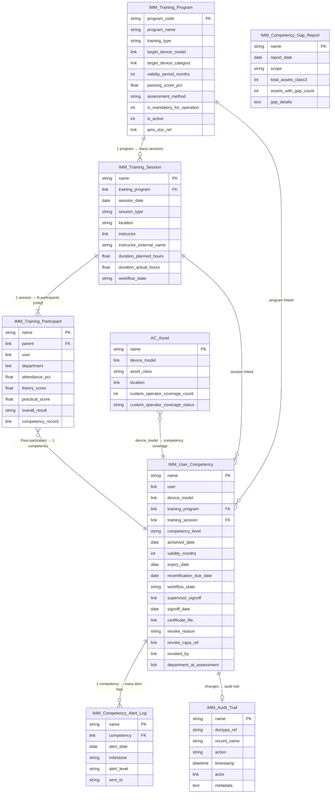
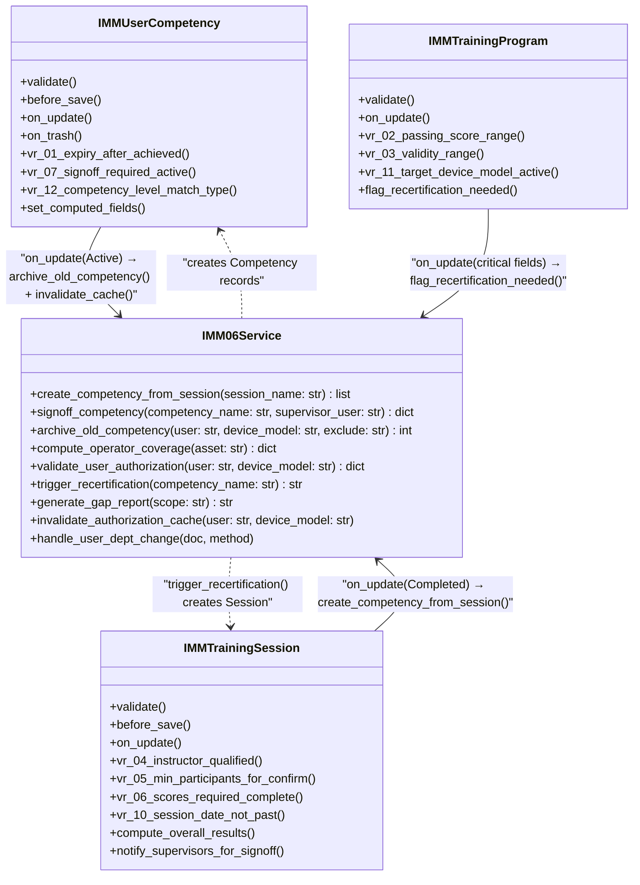
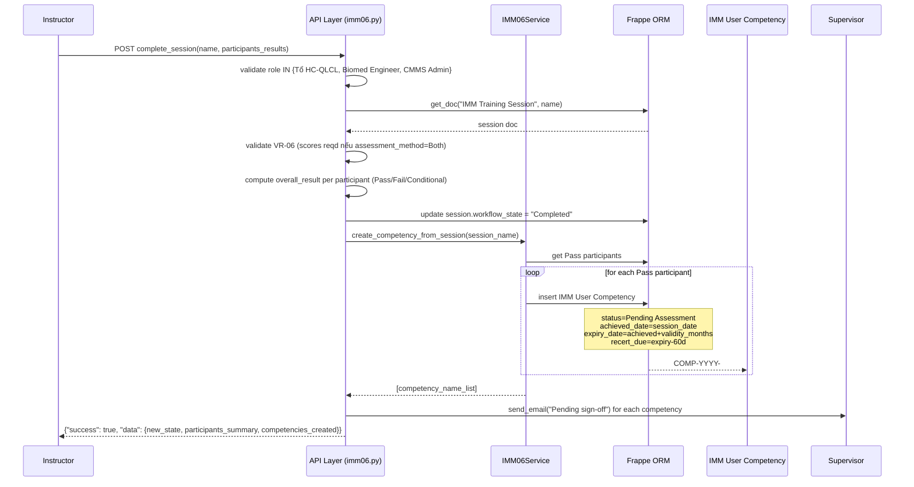
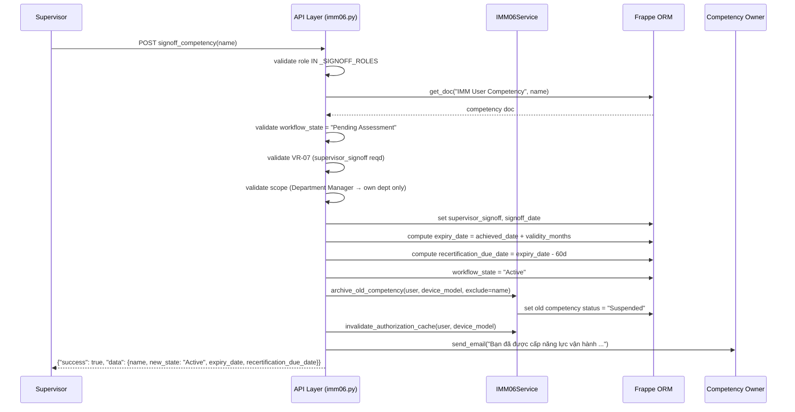
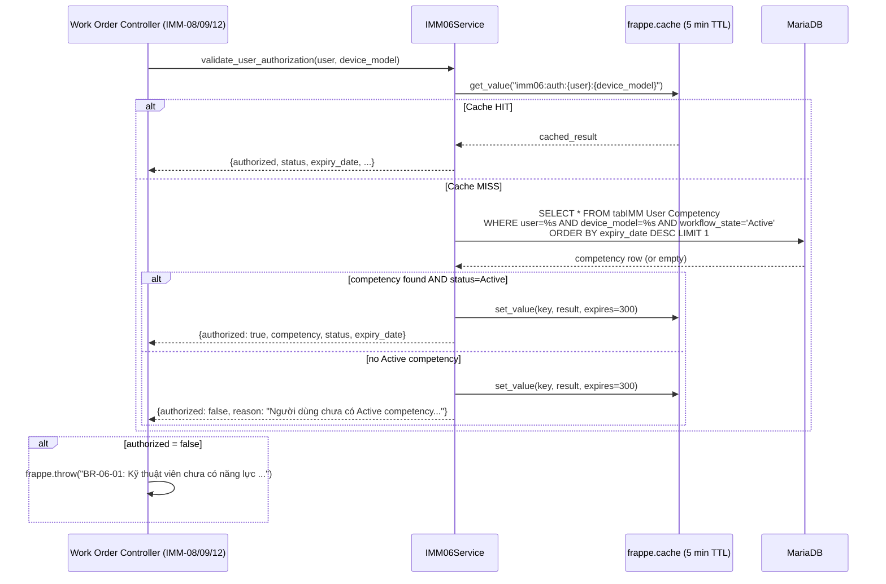

# 03 — Diagrams — IMM-06 Đào tạo & Quản lý năng lực

| Mục | Giá trị |
|---|---|
| Module | IMM-06 — User Training & Competency Management |
| Phiên bản tài liệu | 0.1.0 |
| Ngày cập nhật | 2026-05-08 |
| Liên kết | [02 Analysis](./02_Analysis_Design.md) · [04 Backend](./04_Backend_Design.md) · [05 API](./05_API_Specification.md) · [06 Frontend](./06_Frontend_Design.md) |

> ⚠️ Pending implementation — Module PLANNED (Wave 2). Tất cả diagram là thiết kế spec, chưa implement.

---

## §I ERD (Entity Relationship Diagram)



### Cross-module links (external entities)

| Entity | Relationship | Note |
|---|---|---|
| `AC Asset` | `device_model` → `IMM User Competency.device_model` | Coverage check, IMM-04 gate |
| `IMM Audit Trail` | All Competency status changes → Audit Trail log | Cross-cutting, reuse |
| `Asset Document` (IMM-05) | `IMM User Competency.certificate_file` → Asset Document | `doc_category=Training` |
| `CAPA` | `IMM User Competency.revoke_capa_ref` → CAPA | BR-06-06 |
| Frappe `User` | `user`, `instructor`, `supervisor_signoff`, `revoked_by` | Source of truth cho người dùng |

---

## §II Class Diagram



### Notes

- `IMMUserCompetency.on_trash()` → `frappe.throw()` (BR-06-09: không xóa cứng)
- `IMM06Service.validate_user_authorization()` — cached 5 min TTL qua `frappe.cache`
- `IMM06Service.compute_operator_coverage()` — returns `{asset, device_model, department, operator_count, required_min, gate_pass}`

---

## §III Sequence Diagrams

### SD-1: Complete Session → Auto-create Competency



### SD-2: Supervisor Sign-off Competency



### SD-3: Authorization Gate (IMM-08/09/12 hook)



---

## §IV Communication Diagram — Cross-module Dependencies

```
IMM-06 User Training & Competency Management
├── OUT → IMM-04 Installation (Clinical Release gate)
│         Caller: asset_commissioning.py validate()
│         Call: services.imm06.compute_operator_coverage(asset)
│         Gate: operator_count >= required_min (2 cho Class III)
│         Block: frappe.throw nếu gate_pass = false
│
├── IN ← IMM-05 Document Repository
│         IMM-06 lưu certificate PDF:
│         Asset Document {doc_category=Training, is_model_level=1}
│         Link: IMM User Competency.certificate_file → Asset Document
│
├── OUT → IMM-08 PM / IMM-09 Repair / IMM-11 Calibration / IMM-12 Corrective
│         Caller: work_order.py validate_assignee()
│         Call: services.imm06.validate_user_authorization(user, device_model)
│         Block: frappe.throw("BR-06-01: ...") nếu authorized = false
│         Note: cross-module import (không qua HTTP để tránh overhead)
│
├── IN ← IMM-10 Compliance / Incident (Wave 3)
│         CAPA action item type="revoke_competency" → auto-call revoke_competency API
│         services/imm10.py → services/imm06.py (Wave 3 integration)
│
├── OUT → IMM-16 Compliance Dashboard
│         Cung cấp: training_compliance_pct, coverage_class3_pct
│         API: get_dashboard_stats, get_competency_gaps_by_dept
│
└── OUT → IMM Audit Trail (cross-cutting)
          Mọi revoke/suspend/sign-off → log_audit_trail(doc, action, metadata)
          Actor traceability đầy đủ
```

---

## §V Package Diagram — File Layout

```
assetcore/
├── assetcore/
│   └── doctype/
│       ├── imm_training_program/
│       │   ├── imm_training_program.json       ⚠️ Pending
│       │   └── imm_training_program.py         ⚠️ Pending  (IMMTrainingProgram controller)
│       ├── imm_training_session/
│       │   ├── imm_training_session.json       ⚠️ Pending
│       │   └── imm_training_session.py         ⚠️ Pending  (IMMTrainingSession controller)
│       ├── imm_training_participant/
│       │   ├── imm_training_participant.json   ⚠️ Pending  (child table)
│       │   └── imm_training_participant.py     ⚠️ Pending
│       ├── imm_user_competency/
│       │   ├── imm_user_competency.json        ⚠️ Pending
│       │   ├── imm_user_competency.py          ⚠️ Pending  (IMMUserCompetency controller)
│       │   └── test_imm_user_competency.py     ⚠️ Pending
│       ├── imm_competency_gap_report/
│       │   ├── imm_competency_gap_report.json  ⚠️ Pending
│       │   └── imm_competency_gap_report.py    ⚠️ Pending
│       └── imm_competency_alert_log/
│           └── imm_competency_alert_log.json   ⚠️ Pending  (idempotent log)
│
├── workflow/
│   ├── imm_06_session_workflow.json            ⚠️ Pending  (7 states)
│   └── imm_06_competency_workflow.json         ⚠️ Pending  (6 states)
│
├── services/
│   ├── imm06.py                                ⚠️ Pending  (IMM06Service — 7 functions)
│   └── test_imm06.py                           ⚠️ Pending
│
├── api/
│   └── imm06.py                                ⚠️ Pending  (19 @frappe.whitelist endpoints)
│
├── tasks.py                                    ⚠️ Pending  (4 scheduler jobs thêm mới)
│
└── frontend/src/
    ├── views/imm06/
    │   ├── CompetencyDashboard.vue             ⚠️ Pending
    │   ├── ProgramListView.vue                 ⚠️ Pending
    │   ├── ProgramDetailView.vue               ⚠️ Pending
    │   ├── SessionCreateView.vue               ⚠️ Pending
    │   ├── SessionDetailView.vue               ⚠️ Pending
    │   ├── SessionRunView.vue                  ⚠️ Pending
    │   ├── CompetencyListView.vue              ⚠️ Pending
    │   ├── CompetencyDetailView.vue            ⚠️ Pending
    │   ├── MyCompetenciesView.vue              ⚠️ Pending
    │   └── GapReportView.vue                   ⚠️ Pending
    ├── components/imm06/
    │   ├── RevokeCompetencyModal.vue           ⚠️ Pending
    │   └── SignoffModal.vue                    ⚠️ Pending
    ├── stores/
    │   └── imm06Store.ts                       ⚠️ Pending
    └── types/
        └── imm06.ts                            ⚠️ Pending
```
