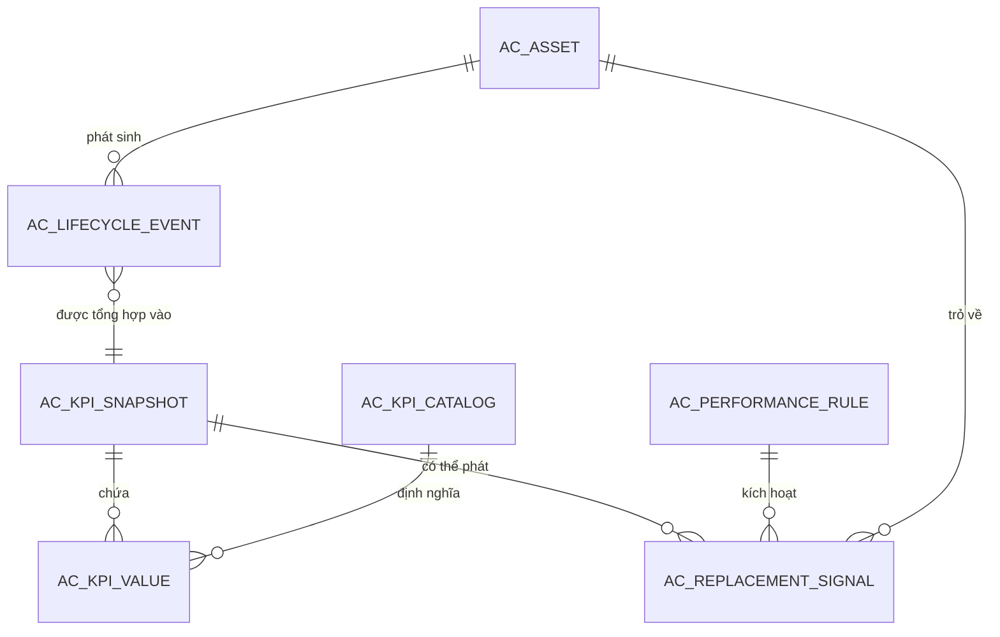
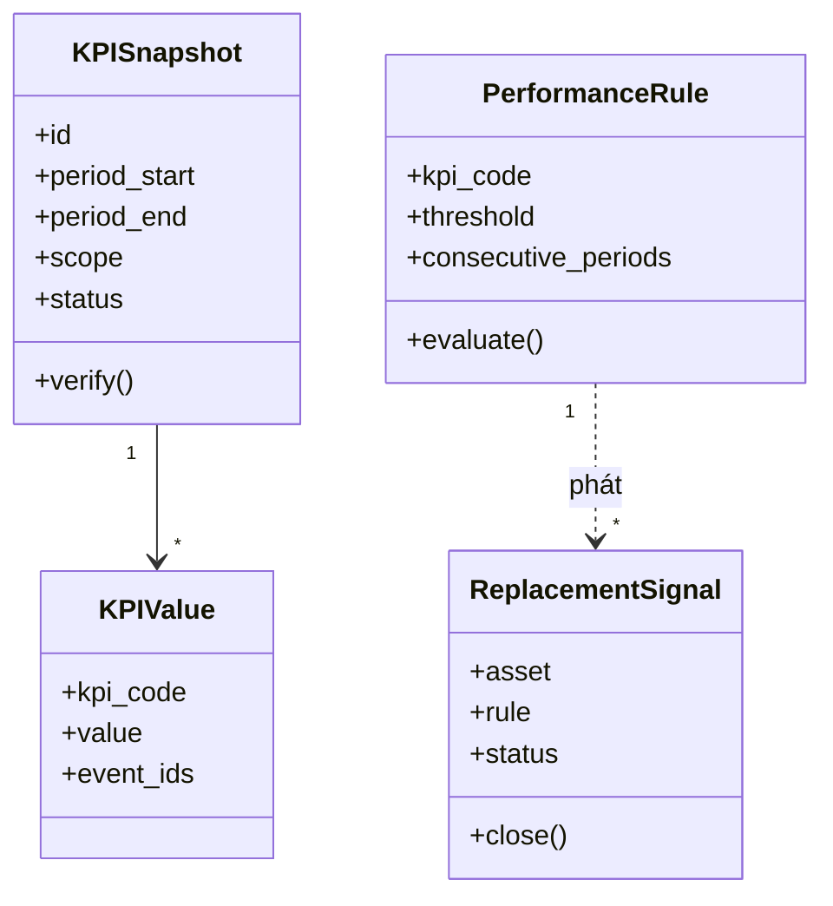
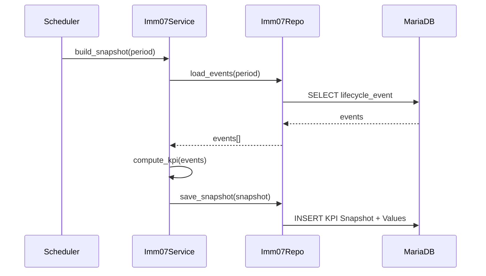

# 03 — Biểu đồ kỹ thuật (IMM-07 — Theo dõi hiệu suất)

| Mục | Giá trị |
|---|---|
| Module | IMM-07 — Theo dõi hiệu suất |
| Trạng thái | Skeleton (BE chưa scaffold — diagram chính sẽ vẽ sau Wave 3 sprint 1) |
| Cập nhật | 2026-05-10 |

---

# Phần I — Entity Relationship Diagram (ERD)

## I.1. ERD logic (đề xuất — chờ BE scaffold)

Hình 1.1 — ERD logic IMM-07 (đề xuất).

## I.2. Cardinality cheatsheet

- 1 Asset — N Lifecycle Event — N KPI Snapshot.
- 1 KPI Snapshot — N KPI Value (theo KPI Catalog).
- 1 Asset có thể có ≥0 Replacement Signal (đóng/mở theo thời gian).

## I.3. Entity catalog

| Entity | Vai trò | Định nghĩa chi tiết |
|---|---|---|
| `AC KPI Catalog` | Master KPI | Định nghĩa KPI: code, công thức, đơn vị, ngưỡng |
| `AC KPI Snapshot` | Bản chốt KPI 1 chu kỳ | Period start/end, scope (asset/khoa/model), trạng thái verify |
| `AC KPI Value` | Giá trị KPI cụ thể trong snapshot | Reference catalog + value + event_ids nguồn |
| `AC Performance Rule` | Rule phát signal | KPI + threshold + số chu kỳ liên tiếp |
| `AC Replacement Signal` | Cảnh báo thay thế | Asset + rule + trạng thái xử lý |

Field detail — *(Thiết kế trong sprint Wave 3)*.

## I.4. Data dictionary

*(Thiết kế trong sprint Wave 3 — sau khi DocType scaffold)*

## I.5. Constraints & indexes

- Index `(asset, period_end)` trên `AC KPI Snapshot`.
- Unique `(asset, period_start, period_end, scope)` trên Snapshot để chống trùng.
- *(Chi tiết trong sprint Wave 3)*

## I.6. Naming conventions

Theo CONVENTIONS §1: DocType prefix `AC `, fieldname snake_case, Link tới Asset dùng `asset`.

## I.7. Mapping ERD → DocType

| Entity ERD | DocType (đề xuất) |
|---|---|
| AC_KPI_CATALOG | AC KPI Catalog |
| AC_KPI_SNAPSHOT | AC KPI Snapshot |
| AC_KPI_VALUE | AC KPI Value (child table của Snapshot) |
| AC_PERFORMANCE_RULE | AC Performance Rule |
| AC_REPLACEMENT_SIGNAL | AC Replacement Signal |

## I.8. Volume & retention

- Snapshot tháng × ~5.000 asset = ~60.000 record/năm. Retention ≥ 7 năm (NĐ98).
- *(Cần khảo sát baseline)* — actual asset count.

## I.9. Data classification & PII

Không chứa PII bệnh nhân. Thuộc tính nhạy cảm: tên người verify (audit). Phân loại Internal.

---

# Phần II — Class Diagram

## II.1. Class diagram tổng quát (skeleton)

Hình 2.1 — Class diagram IMM-07 (skeleton).

## II.2. Layer mapping

- Controller: `ac_kpi_snapshot.py`, `ac_replacement_signal.py` — chỉ dispatch sang service.
- Service: `services/imm07.py` — orchestration (tổng hợp, verify, rule eval).
- Repository: `repositories/imm07_repo.py` — query event nguồn, đọc/ghi snapshot.

Refer CONVENTIONS §2.

## II.3. Class catalog

*(Chi tiết khi BE scaffold)*

## II.4. Relationships glossary

- `KPISnapshot 1—* KPIValue`: composition.
- `PerformanceRule 1..* ReplacementSignal`: dependency (rule là factory).

## II.5. Stereotypes

- `<<service>>` trên `Imm07Service`.
- `<<entity>>` trên các DocType.
- `<<scheduler>>` trên job tổng hợp.

## II.6. Class design principles

- Tách read/write: query KPI = read-only repository; verify = service.
- Snapshot bất biến sau verify.

## II.7. Sub-feature class diagrams

*(Bổ sung sau Wave 3 sprint 2)*

---

# Phần III — Sequence Diagram

## III.1. Khi nào vẽ sequence?

Vẽ cho UC-07-01 (tổng hợp), UC-07-02 (verify), UC-07-04 (rule eval). Hiện tại skeleton — chỉ Use Case overview.

## III.2. Convention

Mermaid `sequenceDiagram`. Actor → API → Service → Repository → DB.

## III.3. Sequence skeleton — UC-07-01

Hình 3.1 — Sequence build snapshot (skeleton).

Sequence diagram chi tiết các UC còn lại — *(Vẽ sau khi BE scaffold Wave 3)*.

---

## DoD — File 03 (IMM-07)

- [x] ERD logic skeleton
- [x] Class diagram skeleton
- [x] 1 Sequence skeleton
- [ ] *(Pending: data dictionary sau DocType scaffold; sequence các UC còn lại)*
