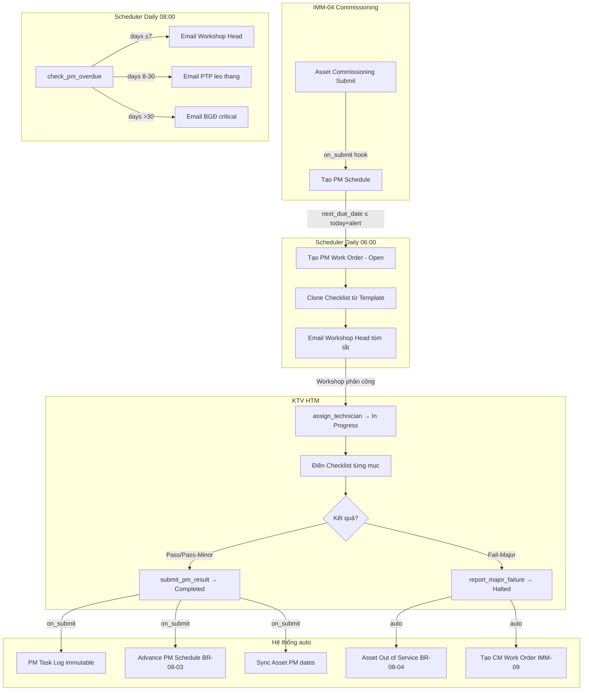
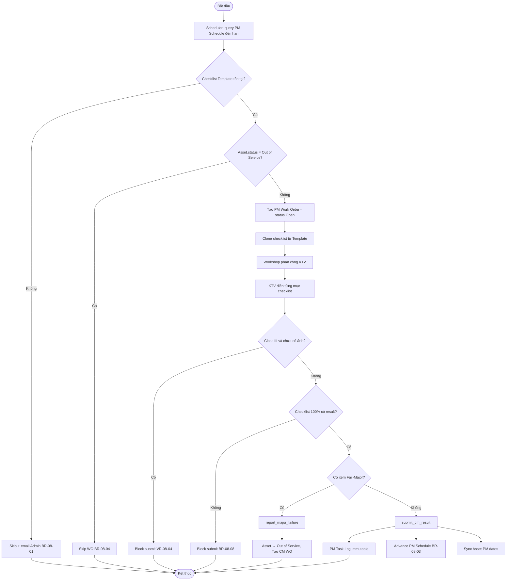
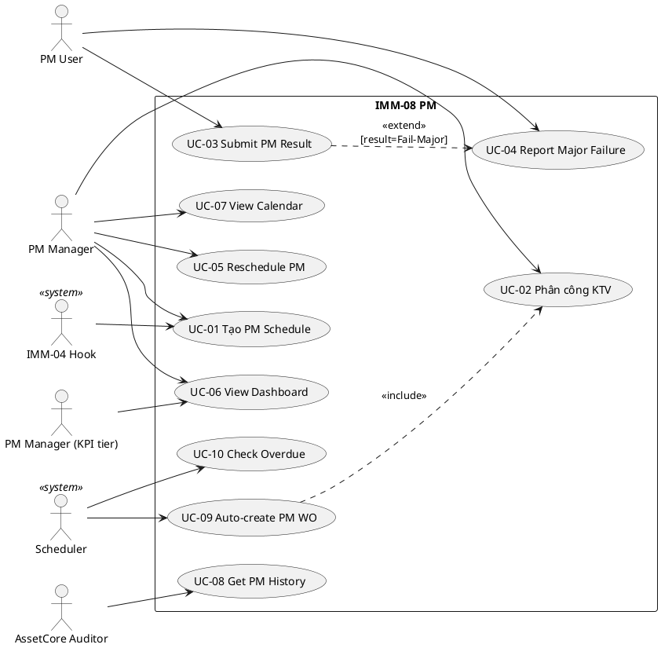
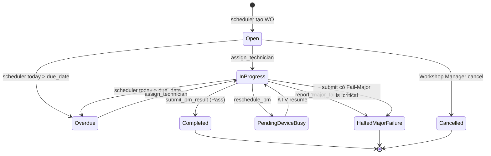

# 02 — Phân tích thiết kế nghiệp vụ — IMM-08 Bảo trì định kỳ (PM)

| Mục | Giá trị |
|---|---|
| Module | IMM-08 — Preventive Maintenance |
| Phạm vi | Per-module |
| Owner | BA + System Analyst |
| Liên kết | [03 Diagrams](./03_Diagrams.md) · [04 Backend](./04_Backend_Design.md) · [05 API](./05_API_Specification.md) · [06 Frontend](./06_Frontend_Design.md) |
| Chuẩn tham chiếu | WHO HTM 2025 §5.3, ISO 13485:2016 §7.5, ISO 9001:2015 §8.5.1, NĐ 98/2021 |
| Cập nhật | 2026-05-27 |

---

# Phần I — Module Overview

## I.1. Pitch

Bệnh viện hiện quản lý lịch bảo trì định kỳ (PM) qua Excel và sổ giấy, dẫn đến thiết bị bị bỏ sót PM và không có audit trail đầy đủ. IMM-08 tự động hoá toàn bộ vòng đời PM: từ tạo lịch khi commissioning, scheduler hằng ngày sinh PM Work Order đúng hạn, KTV điền checklist chuẩn hoá, đến cập nhật ngày PM kế tiếp và phát sinh CM Work Order khi phát hiện lỗi trong quá trình PM. Mục tiêu: tỷ lệ PM compliance ≥ 90%, 0 thiết bị bỏ sót lịch bảo trì.

## I.2. Vị trí trong WHO HTM lifecycle

| Phase | Chạm? | Ghi chú |
|---|---|---|
| Needs | — | — |
| Procurement | — | — |
| Install | ✅ | IMM-04 commissioning trigger tạo PM Schedule đầu tiên |
| Operation | ✅ | Chạy suốt vòng đời thiết bị |
| **Maintenance** | ✅ **chính** | PM Work Order, Checklist, Task Log |
| Decommission | ✅ | Halted–Major Failure → Out of Service → trigger IMM-09 CM |

Input: `Asset Commissioning` (IMM-04) → `commissioning_date`.  
Output: `PM Task Log` (immutable), cập nhật `Asset.custom_last_pm_date / next_pm_date`, trigger CM WO (IMM-09) khi Fail-Major.

## I.3. Stakeholders & Actors

| Vai trò | Người dùng thực | Quan tâm chính | Tần suất | Loại |
|---|---|---|---|---|
| PM Manager | Trưởng nhóm PM | Compliance rate, calendar overview, phân công | Daily | Primary |
| PM User | Kỹ thuật viên PM | WO được phân công, checklist, submit | Daily | Primary |
| Corrective Manager | Trưởng nhóm sửa chữa | Hỗ trợ Major Failure, nhận CM từ PM Halted | Weekly | Secondary |
| PM Manager (KPI tier) | PTP Khối 2 (cũ) | KPI compliance, nhận escalation cấp cao | Weekly | Approver |
| AssetCore System User | IT/QMS Admin | Cấu hình template, fixtures, phân quyền | Ad-hoc | Secondary |
| Scheduler hệ thống | System Scheduler | Tạo WO, mark Overdue, gửi email | Daily automatic | Secondary (system) |
| AssetCore Auditor | QMS Officer | PM Task Log immutability, compliance report | Monthly | Auditor |

## I.4. Scope

**In-scope:**
- 6 DocTypes: PM Schedule, PM Checklist Template, PM Checklist Item (child), PM Work Order, PM Checklist Result (child), PM Task Log
- Auto-create PM Schedule khi Asset Commissioning submit (hook IMM-04 → IMM-08)
- Scheduler daily tạo PM WO, đánh dấu Overdue, leo thang email
- KTV điền checklist (Pass / Fail-Minor / Fail-Major / N/A), submit WO
- Major Failure → Asset Out of Service + auto CM WO
- Dashboard KPI (compliance %, overdue, trend 6 tháng) + Calendar view

**Out-of-scope (defer):**
- Calibration WO (IMM-11)
- Spare Parts request workflow (IMM-09 phase 2)
- Mobile offline queue IndexedDB (v2.1)
- Holiday list integration khi tính due_date (v2.2)
- E-signature PM completion certificate (QMS phase 2)

**Assumptions:**
- Asset đã có `asset_category` và `custom_risk_class` trước khi PM Schedule được tạo
- PM Checklist Template đã được Workshop Head soạn sẵn per category × pm_type

**Dependencies:**
- IMM-04: `Asset Commissioning.on_submit` → tạo PM Schedule đầu tiên
- IMM-09: nhận CM WO từ PM Halted–Major Failure
- Asset (ERPNext core): `asset_category`, `custom_risk_class`, `status`, `custom_*_pm_date`
- Frappe Scheduler + Email Queue

## I.5. KPI mục tiêu

| KPI | Định nghĩa | Baseline | Target | Đo ở đâu |
|---|---|---|---|---|
| PM Compliance Rate | `completed_on_time / total_scheduled × 100`; `total_scheduled` = WO **không-Cancelled** trong tháng (INV-PM-KPI-6) | ~60% (Excel manual) | ≥ 90% | `get_pm_dashboard_stats` |
| Số WO Overdue | WO quá `due_date` chưa hoàn thành | N/A | ≤ 5% tổng WO | Dashboard KPI card |
| Avg Days Late | Trung bình ngày trễ của WO late | N/A | ≤ 2 ngày | Dashboard KPI card |
| PM Task Log Coverage | % WO có Task Log immutable | 0% | 100% | Audit query |
| Scheduler reliability | 0 WO trùng cho cùng schedule | N/A | 0 duplicate | Scheduler log |

## I.6. Ràng buộc Compliance

| Quy định | Yêu cầu áp lên module | Doc tham chiếu |
|---|---|---|
| NĐ 98/2021 | Hồ sơ PM ≥ 5 năm; audit trail đầy đủ | Điều 28, 29 |
| NĐ 98/2021 | **Ảnh bằng chứng PM thiết bị Class C/D** (kiểm soát truy cập — File `is_private=1`) + lifecycle event `pm_checklist_photo_attached` (BR-08-15/16) | Điều 28 (hồ sơ), phân loại rủi ro C/D |
| WHO HTM 2025 §5.3 | PM theo kế hoạch, có checklist chuẩn | WHO HTM 2025 |
| ISO 13485:2016 §7.5 | Controlled conditions cho thiết bị y tế | ISO 13485:2016 |
| ISO 9001:2015 §8.5.1 | Bảo trì phòng ngừa theo kiểm soát sản xuất | ISO 9001:2015 |

## I.7. Risk & Open questions

| Risk | Likelihood | Impact | Giảm thiểu |
|---|---|---|---|
| Scheduler job fail → WO không tạo | Low | High | Monitor log + alert email Admin |
| Asset không có Checklist Template → WO bị skip | Medium | High | Email Admin ngay khi skip (BR-08-01) |
| KTV không submit WO đúng hạn → Overdue | High | Medium | Escalation email theo ngưỡng |
| 2 KTV submit cùng WO đồng thời | Low | Medium | Frappe optimistic lock `modified` |

| Open question | Owner | Deadline |
|---|---|---|
| Wave 2: migrate `Link → Asset` sang `Link → AC Asset` | Tech Lead | Sprint 8 |
| Tích hợp Holiday list khi tính due_date | BA | v2.2 |

## I.8. Roadmap thực thi

| Sprint | Hạng mục | Owner | Status |
|---|---|---|---|
| Sprint 1 | DocType schema 6 DocTypes | BE Lead | ✅ Done |
| Sprint 2 | Scheduler generate + check_overdue | BE Lead | ✅ Done |
| Sprint 3 | Controller validate + on_submit hooks | BE Lead | ✅ Done |
| Sprint 4 | API 24 endpoints + tests | BE Lead | ✅ Done |
| Sprint 5 | FE 4 views + Pinia store + Calendar | FE Lead | ✅ Done |
| Sprint 6 | UAT 10 scenarios + bug fix | QA Lead | ✅ Done |
| Sprint 7 | Docs chuẩn hóa template 02–06 | BA | 🔄 In Progress |
| Sprint 8 | Migrate AC Asset + Lifecycle Event | Tech Lead | ⏳ Planned |

---

# Phần II — Quy trình nghiệp vụ (BPMN)

## II.2. As-Is process

Hiện tại bệnh viện dùng file Excel theo dõi lịch PM theo tuần / tháng. Workshop Manager nhìn vào Excel → báo KTV bằng điện thoại → KTV thực hiện và ghi sổ giấy → sổ không có audit trail chính thức, không có checklist chuẩn.

## II.3. Pain points

| # | Pain | Tác động |
|---|---|---|
| 1 | Bỏ sót thiết bị PM vì Excel không tự nhắc | Thiết bị quá hạn PM, vi phạm NĐ98 |
| 2 | Không có checklist chuẩn → mỗi KTV làm khác nhau | Không đảm bảo chất lượng PM, không audit-ready |
| 3 | Sổ giấy có thể bị thất lạc, sửa chữa | Vi phạm yêu cầu immutability hồ sơ |
| 4 | KPI compliance không tính được tự động | Workshop Manager tốn 1–2h/tuần tổng hợp báo cáo |

## II.4. To-Be process

## II.5. Decision points

| Điểm | Câu hỏi | Quy tắc |
|---|---|---|
| Tạo WO | Có Checklist Template không? | Không → skip + email Admin (BR-08-01) |
| Tạo WO | Asset Out of Service? | Có → skip WO (BR-08-04) |
| Submit | Checklist 100% có result? | Không → block (BR-08-08) |
| Submit | Asset Class III và có ảnh? | Không ảnh → block (BR-08-06) |
| Overdue | days_overdue? | ≤7 → email Workshop Head; 8–30 → PTP; >30 → BGĐ |

## II.6. Process metrics

Tham chiếu WHO HTM — *Medical equipment maintenance programme overview* (chương "Performance indicators") và WHO — *Computerized maintenance management system* (chương "Reports & KPIs"): chương trình PM phải đo được ở mức từng quy trình, không chỉ KPI tổng module.

| Metric | Đơn vị | Công thức | Tần suất đo | Owner | Threshold cảnh báo |
|---|---|---|---|---|---|
| PM completion rate | % | `wo_completed_on_time / wo_scheduled` | Tuần | PM Manager | < 90% → review |
| Schedule adherence | % | `actual_pm_date - due_date` trong cửa sổ ±2 ngày | Tuần | PM Manager | > 5% trễ → escalate cấp cao |
| Mean time to PM (MTTPM) | giờ | `Σ duration_minutes / N WO Completed` | Tháng | Corrective Manager | > +20% baseline → review template |
| First-time-pass rate | % | `wo_completed_no_failure / wo_completed` | Tháng | PM Manager | < 85% → review checklist |
| Major failure rate during PM | % | `wo_halted_major / wo_completed` | Tháng | PM Manager | > 5% → review training |
| Checklist coverage | % | `items_with_result / items_total` | Per WO | PM User | < 100% → block submit (BR-08-08) |
| Reschedule ratio | % | `wo_rescheduled / wo_total` | Tháng | PM Manager | > 15% → review capacity |
| Audit trail completeness | % | `wo_with_task_log / wo_completed` | Quý | AssetCore Auditor | < 100% → fix-it sprint |

**Đo ở đâu (technical mapping):**
- `assetcore/services/imm08.py::get_pm_dashboard_stats` — completion rate, overdue, avg days late
- Audit query SQL — task log coverage (`SELECT count(*) FROM tabPM Task Log WHERE work_order = ...`)
- Frappe Report Builder — schedule adherence histogram
- Scheduler log file — reliability (0 missed jobs)

*(Baseline tháng đầu vận hành — cần khảo sát 3 tháng đầu để chốt threshold thực tế cho mỗi cơ sở.)*

## II.7. RACI matrix

| Hoạt động | PM Manager | PM User | Corrective Manager | PM Manager (KPI tier) | System |
|---|---|---|---|---|---|
| Tạo PM Schedule | R/A | — | C | I | — |
| Soạn Checklist Template | R/A | C | C | — | — |
| Phân công KTV | R/A | I | — | — | — |
| Thực hiện PM | C/I | R/A | C | I | — |
| Submit WO | C | R/A | — | — | — |
| Báo lỗi Major | C | R/A | C | I | — |
| Reschedule PM | R/A | — | — | I | — |
| Tạo WO tự động | I | I | — | I | R/A |
| Escalation email | I | I | — | R/A | — |

## II.8. Exception flow

**E1 — Thiết bị bận trong khi đến hạn PM:**
PM Manager dùng `reschedule_pm` với lý do bắt buộc. WO chuyển sang `Pending–Device Busy`. PM User resume thủ công khi thiết bị rảnh.

**E2 — Fail-Minor trong checklist:**
PM User submit với `overall_result = Pass with Minor Issues`. Hệ thống tự tạo CM WO với priority Medium và `source_pm_wo` liên kết. PM vẫn được tính là hoàn thành.

## II.9. So sánh As-Is vs To-Be

Tham chiếu WHO HTM — *Medical equipment maintenance programme overview* (chương "Programme planning") và WHO — *Computerized maintenance management system* (chương "Why a CMMS"): chuyển đổi từ paper-based / spreadsheet sang CMMS phải so sánh rõ ràng theo 7 trục dưới đây để biện minh ROI và làm baseline đo lường sau triển khai.

| Trục so sánh | As-Is (Excel + sổ giấy) | To-Be (IMM-08 trên AssetCore) | Lợi ích chính |
|---|---|---|---|
| Lịch PM | Excel theo tuần/tháng, PM Manager nhìn bằng mắt | PM Schedule per asset × pm_type, scheduler tự sinh WO khi đến hạn | Không bỏ sót, idempotent (BR-08-07, AC-2) |
| Phân công | Gọi điện thoại / báo miệng | `assign_technician` API + email tự động | Có audit, không cãi nhau ai làm |
| Checklist | Mỗi PM User viết khác, không chuẩn | PM Checklist Template clone vào WO, có result/measured_value/photo | Chuẩn hoá, audit-ready (BR-08-06, BR-08-10) |
| Hồ sơ PM | Sổ giấy, có thể thất lạc/sửa | PM Task Log immutable (`in_create=1`, no write/delete) | Tuân thủ NĐ98 Điều 28 (lưu ≥ 5 năm) |
| Báo cáo KPI | PM Manager tổng hợp 1–2h/tuần | `get_pm_dashboard_stats` real-time | Giảm 100% công tổng hợp thủ công |
| Major Failure | Báo miệng, Asset vẫn dùng cho tới khi có CM thủ công | `report_major_failure` → Asset Out of Service tức thì + auto CM WO (IMM-09) | An toàn người bệnh, traceable |
| Escalation | Không có cơ chế chính thức | Scheduler daily 08:00 leo thang ≤7d / 8–30d / >30d theo cấp | PM Manager → PM Manager (KPI tier) → BGĐ minh bạch |
| Compliance audit | Không sẵn sàng, mất ngày để chuẩn bị | Audit query 1 SQL (PM Task Log), KPI dashboard luôn live | Đáp ứng audit NĐ98/WHO HTM trong giờ |

**Trục đo ROI (theo WHO HTM "Programme overview"):**

| Chỉ số ROI | As-Is (ước tính) | To-Be (target) | Ghi chú |
|---|---|---|---|
| PM compliance rate | ~60% | ≥ 90% | KPI I.5 |
| PM Manager admin time | 1–2h / tuần | < 15 phút / tuần | Còn lại review escalation |
| Audit prep time | 1–2 ngày / kỳ audit | < 1 giờ | Live dashboard + Task Log |
| Bỏ sót thiết bị PM | có (Excel quên cập nhật) | 0 (idempotent scheduler) | BR-08-07 + AC-2 |
| Major failure phát hiện trong PM dẫn tới Out of Service tức thì | thủ công, có thể trễ | < 5 phút | UC-04 + auto CM |

*(Baseline As-Is cần khảo sát từng cơ sở khi go-live để chốt số liệu thật — hiện ước tính từ interview Wave 1.)*

## II.10. Activity diagram — UC tạo và submit PM WO

---

# Phần III — Use Case Specification

## III.1. Use Case Diagram (tổng quát)

## III.2. Actor catalog

| Actor | Loại | Mô tả | Goal chính |
|---|---|---|---|
| PM Manager | Primary | Quản lý nhóm PM | Đảm bảo compliance rate ≥ 90% |
| PM User | Primary | Kỹ thuật viên thực hiện PM | Hoàn thành checklist đúng hạn |
| PM Manager (KPI tier) | Secondary | Cấp phê duyệt KPI/escalation | Giám sát KPI, nhận escalation |
| Scheduler | System | Frappe scheduler job | Tự động tạo WO + check Overdue |
| IMM-04 Hook | System | on_submit Asset Commissioning | Tạo PM Schedule đầu tiên |
| AssetCore Auditor | Auditor | QMS Officer | Kiểm tra PM Task Log immutability |

## III.3. Use Case Specifications

### UC-03: Submit PM Result

| Mục | Giá trị |
|---|---|
| ID | UC-IMM08-03 |
| Brief | PM User điền checklist và submit kết quả PM Work Order |
| Primary actor | PM User |
| Pre-condition | WO ở trạng thái In Progress; PM User là assigned_to |
| Post-condition | WO Completed; PM Task Log tạo; PM Schedule advance; Asset dates sync |
| Trigger | PM User hoàn thành thực hiện PM |

#### Main flow

| Bước | Actor | System |
|---|---|---|
| 1 | PM User mở WO Detail | Load checklist items |
| 2 | PM User điền result + measured_value từng item | Validate notes bắt buộc khi Fail-* |
| 3 | PM User điền overall_result + technician_notes + duration_minutes | — |
| 4 | PM User upload ảnh (bắt buộc nếu Class III) | Validate BR-08-06 |
| 5 | PM User click "Hoàn thành" | Gọi POST submit_pm_result |
| 6 | — | Validate BR-08-08 (checklist 100%), BR-08-06 (ảnh) |
| 7 | — | wo.submit() → on_submit controller |
| 8 | — | Tạo PM Task Log immutable |
| 9 | — | Advance PM Schedule (BR-08-03) |
| 10 | — | Sync Asset custom_*_pm_date |
| 11 | — | Return { new_status, is_late, next_pm_date } |

#### Alternative A1 — Fail-Minor trong checklist
- 4a. Hệ thống tự tạo CM WO priority Medium với `source_pm_wo`
- 4b. WO vẫn Completed, cm_wo_created trả về trong response

#### Exception E1 — Checklist chưa đủ
- 6a. Return error BR-08-08 "Tất cả mục checklist phải có kết quả"
- 6b. PM User bổ sung còn thiếu rồi thử lại

#### Special requirements
- PM Task Log PHẢI immutable sau insert (in_create=1)
- is_late = completion_date > due_date (BR-08-05)

## III.4. UC relationships

Mô tả quan hệ giữa các Use Case của IMM-08 (extend / include / generalize) — diễn giải chi tiết những đường nét rời ở UC diagram §III.1.

| From UC | Quan hệ | To UC | Điều kiện | Lý do thiết kế |
|---|---|---|---|---|
| UC-09 Auto-create PM WO | `<<include>>` | UC-02 Phân công KTV | Mỗi WO mới sinh từ scheduler đều cần phân công | Scheduler không tự gán KTV cụ thể — PM Manager assign sau bằng `assign_technician`. |
| UC-03 Submit PM Result | `<<extend>>` | UC-04 Report Major Failure | `overall_result = Pass with Major Failure` hoặc có item `result = Fail-Major + is_critical` | Tách flow Major khỏi happy path để giữ UC-03 gọn (BR-08-09). |
| UC-03 Submit PM Result | `<<include>>` | (system) Tạo PM Task Log | Mọi lần Submit thành công | Task Log immutable là post-condition bắt buộc (BR-08-10). |
| UC-03 Submit PM Result | `<<include>>` | (system) Advance PM Schedule | Mọi lần Submit thành công | `next_pm_date = completion_date + interval` (BR-08-03). |
| UC-04 Report Major Failure | `<<include>>` | (system) Tạo CM Work Order IMM-09 | Mọi lần report Major | Cross-module trigger sang IMM-09 (BR-08-09). |
| UC-04 Report Major Failure | `<<include>>` | (system) Set Asset Out of Service | Mọi lần report Major | An toàn (BR-08-04). |
| UC-09 Auto-create PM WO | `<<extend>>` | (system) Skip + Email Admin | Checklist Template không tồn tại | Branch BR-08-01. |
| UC-09 Auto-create PM WO | `<<extend>>` | (system) Skip WO | Asset.status = Out of Service | Branch BR-08-04. |
| UC-10 Check Overdue | `<<extend>>` | (system) Email leo thang PM Manager (KPI tier) | days_overdue 8–30 | Escalation tier 2. |
| UC-10 Check Overdue | `<<extend>>` | (system) Email leo thang BGĐ | days_overdue > 30 | Escalation tier 3. |
| UC-05 Reschedule PM | `<<extend>>` | UC-02 Phân công KTV | Sau khi resume từ Pending–Device Busy | Có thể assign lại PM User khác. |
| UC-01 Tạo PM Schedule | (none) | — | Trigger 1: IMM-04 commissioning hook · Trigger 2: AssetCore System User tạo manual | Một UC, hai actor (system + human). |

**Quan hệ generalize:**
- *PM Work Order* (chung) ← chuyên hoá theo `pm_type` (Daily / Weekly / Monthly / Quarterly / Annual). Hiện tại các pm_type chỉ khác `interval` và `Checklist Template`, KHÔNG cần UC riêng — generalize ở mức data (BR-08-07: mỗi pm_type là 1 PM Schedule riêng), không ở mức UC.

**Cross-module relationships:**

| UC IMM-08 | Module liên quan | Chiều | Ghi chú |
|---|---|---|---|
| UC-01 Tạo PM Schedule | IMM-04 Commissioning | Inbound | Hook `Asset Commissioning.on_submit` |
| UC-04 Report Major Failure | IMM-09 Repair (CM) | Outbound | Tạo CM WO với `source_pm_wo` |
| UC-03 Submit PM Result (Fail-Minor) | IMM-09 Repair (CM) | Outbound | CM Medium priority |
| UC-08 Get PM History | IMM-15 Reporting | Outbound (data source) | Báo cáo compliance theo cơ sở |
| UC-03 Submit PM Result | IMM-16 Compliance | Outbound (data source) | PM Task Log feed audit query |

## III.5. UC ↔ User Story mapping

| Use Case | US ID | Note |
|---|---|---|
| UC-03 Submit PM Result | US-08-02 | Happy path |
| UC-04 Report Major Failure | US-08-03 | Major failure flow |
| UC-09 Auto-create PM WO | US-08-01 | Scheduler daily |
| UC-10 Check Overdue | US-08-04 | Escalation email |
| UC-02 Phân công KTV | US-08-06 (partial) | assign then reschedule |

---

# Phần IV — Functional Specifications

## IV.1. User Stories & Acceptance Criteria

### US-08-01 — Scheduler tự động tạo PM WO

Là **Scheduler**, tôi muốn **tự động tạo PM Work Order khi next_due_date đến hạn**, để **không thiết bị nào bị bỏ sót PM**.

Priority: Must | Estimate: 8SP

**AC-1 — Happy path:**
- Given Asset Active có PM Schedule với next_due_date ≤ today+alert_days_before và Checklist Template tồn tại
- When scheduler.generate_pm_work_orders chạy
- Then 1 PM WO được tạo, status=Open, checklist clone từ template, email gửi PM Manager

**AC-2 — Idempotent:**
- Given PM WO đã tồn tại cho cùng schedule và status IN (Open, In Progress, Pending–Device Busy)
- When scheduler chạy lại
- Then KHÔNG tạo WO trùng

### US-08-03 — Major Failure → Asset Out of Service

Là **PM User**, tôi muốn **báo lỗi nghiêm trọng trong quá trình PM**, để **Asset được đưa ra khỏi sử dụng và tạo CM ngay**.

Priority: Must | Estimate: 5SP

**AC-1 — Happy path:**
- Given PM WO đang In Progress
- When PM User gọi report_major_failure với description
- Then WO status=Halted–Major Failure, Asset.status=Out of Service, CM WO tạo với source_pm_wo

**AC-2 — Email khẩn:**
- Then email HTML khẩn gửi PM Manager + PM Manager (KPI tier) trong 5 phút

## IV.2. Business Rules

| ID | Rule | Implement ở | Liên kết test |
|---|---|---|---|
| BR-08-01 | Phải có Checklist Template trước khi tạo PM WO | `tasks.generate_pm_work_orders` (skip + email) | TC-PM-01 |
| BR-08-02 | CM WO phải có `source_pm_wo` | `_validate_cm_source()` + `mandatory_depends_on` | TC-PM-05 |
| BR-08-03 | **`next_pm_date` = SoT `compute_next_pm_date(completion_date, interval)`** — anchor LUÔN `completion_date` (KHÔNG dùng due_date, KHÔNG dùng nowdate); interval hiệu lực = `pm_interval_days` nếu > 0 else `PM_DEFAULT_INTERVAL_DAYS=90`. CẢ 3+ write-site (PM Schedule.next_due_date, AC Asset.next_pm_date, PM Task Log.next_pm_date, field API submit_result trả về) gọi CHUNG helper → bằng nhau byte-for-byte. KHÔNG inline `add_days`, KHÔNG literal 90, KHÔNG `or 0`/`or 90` ở call-site. | `compute_next_pm_date()` dùng chung bởi `update_pm_schedule_after_completion` / `handle_work_order_submit` / `submit_result` | TC-PM-02, TC-PM-NEXT-02, TC-PM-NEXT-03 |
| BR-08-04 | Asset Out of Service → block PM WO | scheduler skip | TC-PM-06 |
| BR-08-05 | `is_late = completion_date > due_date` | `_set_completion()` | TC-PM-02 |
| BR-08-06 | Class III/C/D bắt buộc ảnh trước/sau PM | `_validate_photo_for_high_risk()` | TC-PM-04 |
| BR-08-07 | Mỗi pm_type là PM Schedule riêng | Naming `PMS-{asset_ref}-{pm_type}` | Unit test |
| BR-08-08 | Checklist 100% có result trước Submit | `_validate_checklist_complete()` | TC-PM-02 |
| BR-08-09 | Fail-Minor → CM Medium; Fail-Major → CM Critical + Out of Service | `_handle_failures()` | TC-PM-05 |
| BR-08-10 | PM Task Log immutable | `in_create=1`, perms không có write/delete | TC-PM-02 |
| BR-08-11 | **PM quá hạn (overdue) = SoT predicate `is_pm_overdue`** — `due_date < today` (strict) AND status ∈ {Open, In Progress, Pending–Device Busy}. 1 định nghĩa dùng chung cho cron `check_pm_overdue` (set status=Overdue), counter `count_overdue_pm`, và drill `?overdue=1`. | `is_pm_overdue()` / `count_overdue_pm()` / `_normalize_filters(overdue=1)` | TC-PM-OV-01, test_d_be_18 |
| BR-08-12 | **PM đến hạn (due-soon) = SoT window predicate `due_soon_filter`** — `due_date ∈ [today, today+PM_DUE_SOON_WINDOW_DAYS]` (cả 2 biên inclusive) AND status NOT IN {Completed, Cancelled}. KPI `pm_due_7d` count == số dòng drill `?due_before=today+7` (card == drill, byte-for-byte). WO quá hạn (`due_date<today`) KHÔNG lọt vào due-soon → thuộc BR-08-11 (overdue). Hai tập **disjoint** (như IMM-11 round 9). | `due_soon_filter()` dùng chung bởi `_normalize_filters(due_before)` + `dashboard.pm_due_next7` | TC-PM-DS-01, test_d_be_18b |
| BR-08-13 | **KPI dashboard đồng nhất phạm vi (vòng 10)** — `get_dashboard_stats(year,month)` tách `kpis` thành 2 khối: (a) **THÁNG** `total_scheduled`/`completed_on_time`/`overdue_in_month`/`pending_in_month`/`compliance_rate_pct`/`avg_days_late` (mọi field đếm trên population **THÁNG** = WO có `due_date` trong tháng ∧ **không-Cancelled** — xem BR-08-14) PHẢI hòa hợp số học `total_scheduled >= on_time + overdue_in_month + pending_in_month`; (b) **TOÀN HỆ THỐNG** `overdue` = `count_overdue_pm()` (RC-10, không đổi). `compliance_rate_pct` **null khi `total_scheduled==0`** (FE '—', KHÔNG 0%). FE gắn nhãn phạm vi từng tile: "Quá hạn trong tháng" (THÁNG) ≠ "Quá hạn (toàn hệ thống)" (drill `?overdue=1`). | `get_dashboard_stats()` §4.1.4 / `PMDashboardView.vue` / `PMWorkOrderListView.vue` strip | TC-PM-KPI-1..6 |
| BR-08-14 | **Loại WO Cancelled khỏi MẪU tuân thủ + bucket pending (vòng 25, INV-PM-KPI-6)** — population khối-THÁNG = `scheduled` = WO `due_date` trong tháng ∧ `status != Cancelled`. WO `Cancelled` (hủy chủ động, hết nghĩa vụ thực hiện) KHÔNG vào `total_scheduled`, KHÔNG vào MẪU/tử compliance, KHÔNG rơi vào `pending_in_month`/`overdue_in_month`/`completed_on_time`. Diệt 2 lỗi: (a) cancelled-PM kéo `compliance_rate_pct` giả tụt (mẫu phình); (b) phantom 'chưa xong' ở `pending` không bao giờ làm. Tháng chỉ-Cancelled → `total_scheduled==0` ⇒ `compliance_rate_pct==None` (KHÔNG `0.0`). `trend_6months[*].rate` dùng CÙNG predicate loại-Cancelled. **No-regression:** tháng không có Cancelled → KPI bất biến. **OUT-of-scope:** KHÔNG đổi `count_overdue_pm()` global, `is_late`, bucket của `Halted–Major Failure` (giữ counted = kết cục PM không-tuân-thủ thật), shape/field-name API. | `get_dashboard_stats()` §4.1.4 (predicate `status != Cancelled`) | TC-PM-KPI-06..09 |
| BR-08-15 | **Đính ảnh bằng chứng theo TỪNG mục checklist PM — permission + validation (mobile CR-14/G6, Vòng 2)** — `attach_pm_checklist_photo(work_order_name, checklist_item_idx, file)` (multipart): (1) **Permission** = KTV được giao (`wo.assigned_to == session.user`) **HOẶC** `frappe.has_permission("PM Work Order","write",doc=wo)` (tái dùng IDOR-guard row-level `pm_work_order_has_permission` — Vendor/KTV ngoài `assigned_to` → FORBIDDEN). Thiếu cả 2 → in-handler cap-403 Decision-B `FORBIDDEN` (KHÔNG leak cap); Guest → guard-401/dispatcher-403. (2) **Validation TRƯỚC khi tạo File** (thứ tự): WO không tồn tại → `NOT_FOUND`; `checklist_item_idx` thiếu/không parse/không khớp mục → `VALIDATION fields.checklist_item_idx`; thiếu `file`/content-type∉{jpg,png}/size>`MAX_PM_CHECKLIST_PHOTO_BYTES=10MB`/`len(_pm_checklist_photos(WO,idx))>=MAX_PM_CHECKLIST_PHOTOS=5` → `VALIDATION fields.file`. (3) success → **đúng 1** File `is_private=1` (`attached_to='PM Work Order'`, discriminator per-mục) + ghi `pm_checklist_result[idx].photo` bằng `db.set_value` (KHÔNG `wo.save()`). **Mọi nhánh reject KHÔNG tạo File.** Đối xứng BR-12-17. | `services/imm08.py: attach_pm_checklist_photo()/_pm_checklist_photos()/_assert_can_attach_pm_photo()`; `api/imm08.py` | TC-PM-PHOTO-* |
| BR-08-16 | **Bằng chứng PM NĐ98 (Class C/D) — lifecycle event + read-back parity** — (a) mỗi lần đính thành công sinh **đúng 1** `Asset Lifecycle Event` `event_type='pm_checklist_photo_attached'` (`asset=wo.asset_ref`, `actor=session.user`, `timestamp`, `root_doctype/root_record`) — **hard-requirement** (commit cùng File + set_value; event throw → File.insert rollback, KHÔNG orphan/KHÔNG swallow). Cần THÊM option `pm_checklist_photo_attached` vào Select `Asset Lifecycle Event.event_type` (deploy reload-doctype). (b) **Read-back parity**: `get_pm_work_order(WO).checklist_results[idx].photo == file_url` vừa trả (get_work_order KHÔNG đổi — đã trả `r.photo`). `_pm_checklist_photos` = CÙNG SoT với max-count → **count==rows**. Bổ trợ BR-08-06 (Class III/C/D bắt buộc ảnh) — cung cấp KÊNH nạp ảnh per-item cho mobile. | `services/imm08.py: attach_pm_checklist_photo()`; `asset_lifecycle_event.json` (+enum); FE PM Detail | TC-PM-PHOTO-EVIDENCE-* |
| BR-08-17 | **Tìm kiếm free-text phía SERVER cho danh sách phiếu PM (CR-18)** — param `search` (string, optional) trên `list_pm_work_orders`: OR-LIKE `name` (mã lệnh PM) / `asset_code` / `asset_name` (2 field trên **AC Asset**, link `asset_ref`) — case-insensitive, TOÀN tập mọi trang (KHÔNG lọc client-side chỉ-trang-đã-tải). (a) **AND-combine, KHÔNG nới quyền**: `search` AND với `status`/`asset_ref`/virtual-key + `mine`(`assigned_to`) + vendor-scope ⇒ KTV `mine=1`/Vendor KHÔNG thấy phiếu ngoài scope dù khớp. (b) **Escape LIKE-metachar** qua SSoT `escape_like_term` (`%`→`\%`, `_`→`\_`) → khớp literal, chống wildcard-injection/DoS. (c) **INVARIANT count==rows**: `or_filters` (gồm id AC Asset đã resolve 1 lần) thread CÙNG cho `count_with_or`+`get_all` ⇒ `pagination.total == số phiếu thực khớp` mọi trang. (d) `search=""`/absent ⇒ list BYTE-IDENTICAL baseline (web-FE regression=0). Recall cap 500 asset/term → `[ROADMAP]` streaming. | `api/imm08.py::list_pm_work_orders` (inject `f["search"]`); `services/imm08.py::list_work_orders` (`pop_search`→`or_filters`); `services/shared/filters.py::pop_search` (+escape, +list display-field); FE `PMWorkOrderListView.vue` | TC-PM-SEARCH-01..06 |

## IV.3. State Machine

| State | Mô tả | docstatus | Role có quyền chuyển |
|---|---|---|---|
| Open | WO mới tạo, chưa phân công | 0 | Scheduler (auto) |
| In Progress | Đã phân công PM User | 0 | PM Manager |
| Pending–Device Busy | Thiết bị bận, hoãn lịch | 0 | PM Manager |
| Overdue | Quá due_date chưa hoàn thành | 0 | Scheduler (auto) |
| Completed | PM hoàn thành, Task Log tạo | 1 | PM User → PM Manager submit |
| Halted–Major Failure | Phát hiện lỗi nghiêm trọng | 0 | PM User |
| Cancelled | Hủy WO có lý do | 2 | PM Manager |

## IV.4. Input — Output

**Input fields chính:**
- `asset_ref` (Link Asset, reqd) → auto-fill `asset_category`, `risk_class`
- `pm_schedule` (Link PM Schedule, reqd) → cascade fill `pm_type`, `checklist_template`
- `checklist_results` (child table) — KTV điền `result`, `measured_value`, `notes`, `photo`
- `overall_result` (Select) — KTV chọn khi submit
- `pm_sticker_attached` (Check) — bắt buộc nếu policy

**Output records:**
- `PM Task Log` (immutable, mỗi WO Completed)
- `PM Work Order` trạng thái Completed (docstatus=1)
- PM Schedule `last_pm_date`, `next_due_date` cập nhật
- Asset `custom_last_pm_date`, `custom_next_pm_date` cập nhật
- CM Work Order (nếu Fail-Minor/Major)

**Notifications:**
- Email PM Manager: daily WO summary
- Email leo thang: Overdue ≤7d / 8–30d / >30d
- Email khẩn: Major Failure → PM Manager + PM Manager (KPI tier)

## IV.5. Edge cases & Errors

| ID | Edge case | Hành vi | Error code |
|---|---|---|---|
| E-08-01 | Submit WO đã docstatus=1 | Block — "PM Work Order đã được Submit" | `ALREADY_SUBMITTED` |
| E-08-02 | 2 KTV submit cùng lúc | Frappe optimistic lock `modified` → second request fail | `CONFLICT` |
| E-08-03 | Assign KTV khi WO ở Completed | Block — "Không thể phân công khi WO ở trạng thái 'Completed'" | `BAD_STATE` |
| E-08-04 | Class III không có ảnh | Block submit — VR-08-04 | `VALIDATION` |
| E-08-05 | Checklist result=Fail–* nhưng không có notes | Block save — VR-08-06 | `VALIDATION` |
| E-08-06 | reschedule với reason < 5 ký tự | Block — VR-08-09 | `VALIDATION` |

---

# Phần V — Yêu cầu phi chức năng

## V.1. Hiệu năng

| Metric | Target | Đo ở đâu |
|---|---|---|
| `list_pm_work_orders` P95 (50k WO) | < 300 ms | NFR-08-02 |
| `get_pm_dashboard_stats` P95 | < 800 ms | NFR-08-03 |
| Scheduler `generate_pm_work_orders` duration | < 60s với 500 schedules | scheduler log |
| Page load FCP | < 2s | Lighthouse |

## V.2. Bảo mật

- Authentication: Frappe session + API token
- RBAC: PM Manager / PM User / Corrective Manager / AssetCore System User / AssetCore Auditor (30-role module-based RBAC, post patch `v3_2.001`)
- PM Task Log immutable: `in_create=1` + no write/delete perm
- Audit trail: Frappe `track_changes: 1` trên PM Work Order
- Compliance: NĐ98/2021 + WHO HTM + ISO 13485

## V.3. Khả dụng

| Metric | Target |
|---|---|
| Uptime giờ làm việc (06:00–22:00) | ≥ 99.5% |
| Scheduler daily reliability | 0 missed jobs |

## V.4. Khả mở rộng

- 100 concurrent users
- 100k PM WO / site (với indexes `(status, due_date)`, `asset_ref`)
- Multi-site: codebase chung, data phân tách per site

## V.5. Khả dụng UX

- Checklist hoạt động trên tablet ≥ 768px (KTV dùng iPad tại giường)
- Nút Pass/Fail tap target ≥ 48px
- WCAG 2.1 AA contrast cho status badge
- Ngôn ngữ: tiếng Việt primary

## V.6. Bảo trì

- Code coverage: service ≥ 85%, controller ≥ 70%, API ≥ 60%
- Mọi service function có docstring tiếng Anh + AC
- Linting: ruff/black 100% pass

## V.7. Tuân thủ

- PM Task Log lưu ≥ 5 năm (NĐ98 Điều 28)
- Immutability enforce ở DB level (`in_create=1`)
- Phân tách trách nhiệm: PM User (thực hiện) ≠ PM Manager (approve) ≠ AssetCore Auditor (read-only)
- Mọi mutation có record audit (PM Task Log)

---

## DoD — File 02 hoàn chỉnh

### I. Module Overview
- [x] Pitch ≤ 5 câu, không jargon
- [x] Lifecycle phase + lifecycle position rõ
- [x] ≥ 1 Primary + 1 Auditor stakeholder
- [x] Scope cả In + Out + Assumption + Dependency
- [x] ≥ 3 KPI có target số
- [x] ≥ 1 ràng buộc compliance

### II. Business Process
- [x] Pain points ≥ 3
- [x] To-Be swimlane ≥ 4 lane
- [x] Decision points có quy tắc
- [x] RACI cho mọi hoạt động chính
- [x] Activity diagram UC chính

### III. Use Case Spec
- [x] Use case diagram tổng quát
- [x] Actor catalog ≥ 4 actor
- [x] UC-03 có spec đầy đủ

### IV. Functional Specs
- [x] User Stories có AC Given-When-Then
- [x] 10 Business Rules đánh số
- [x] State machine vẽ rõ
- [x] ≥ 5 edge case với error code

### V. NFR
- [x] 7 nhóm NFR với target số
- [x] Compliance NĐ98 + WHO HTM
