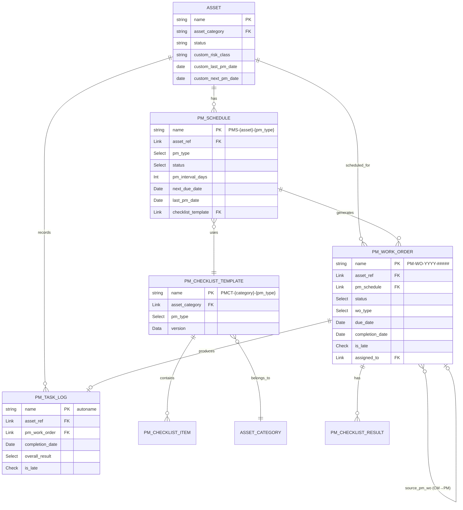
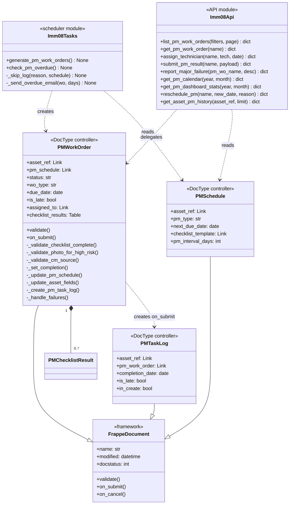
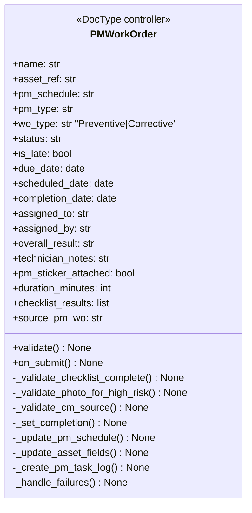
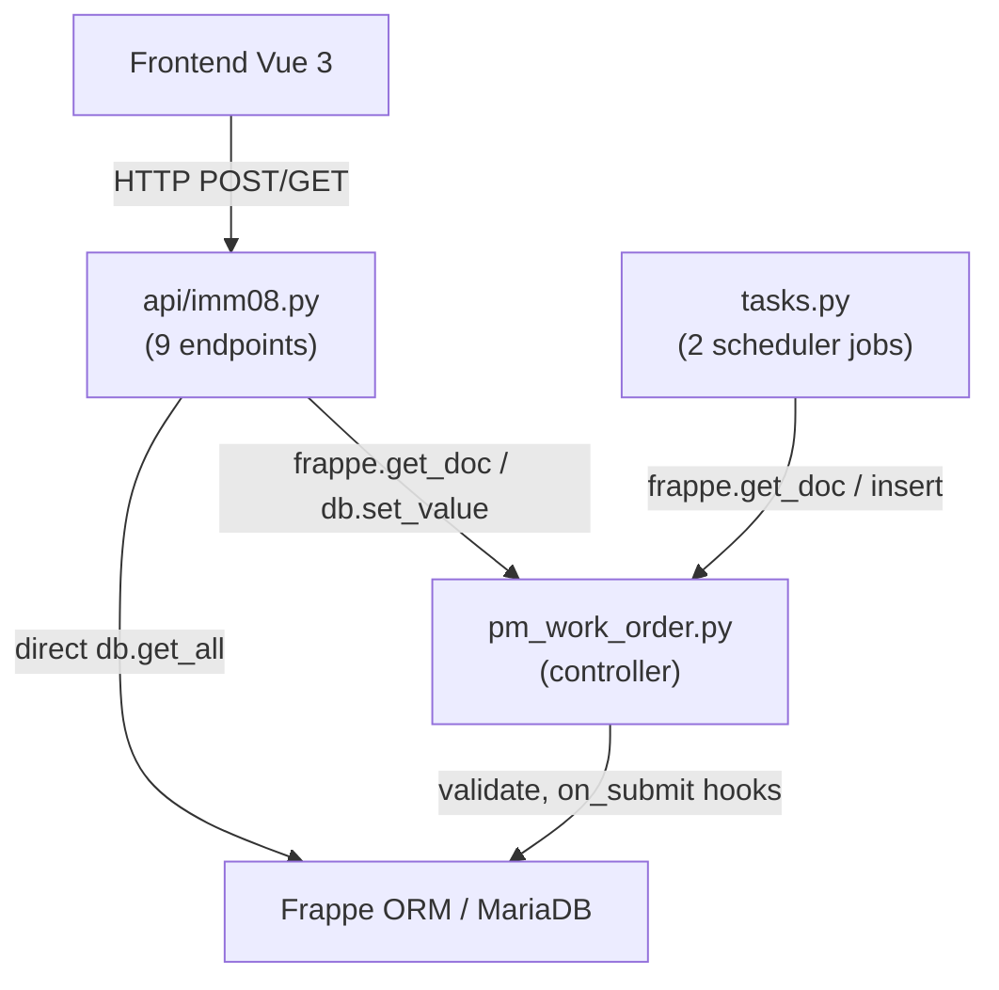
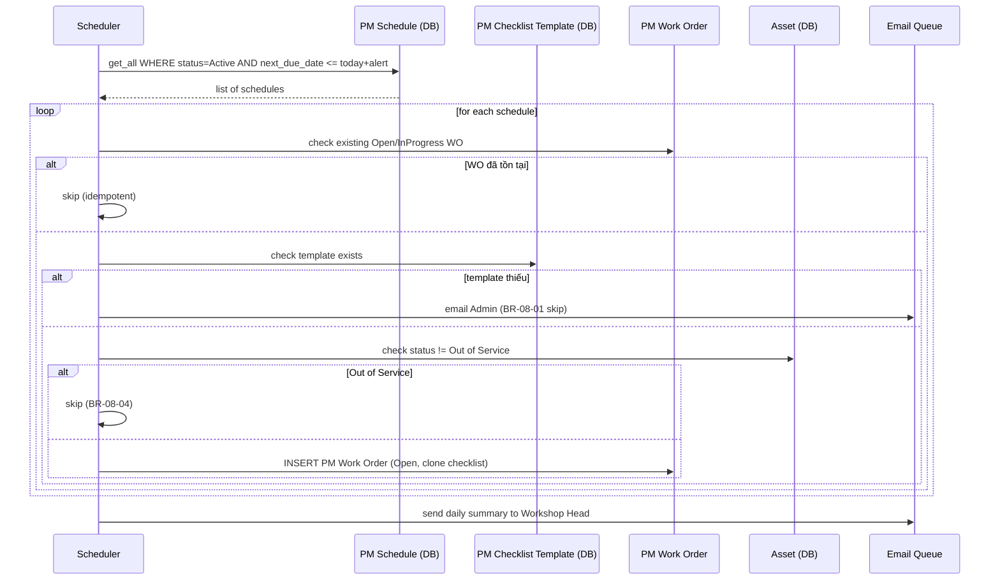
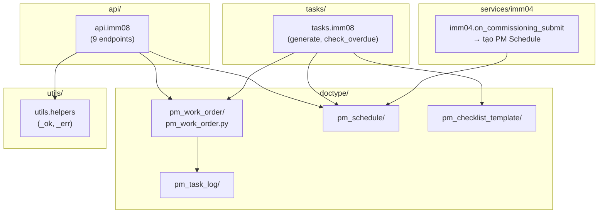
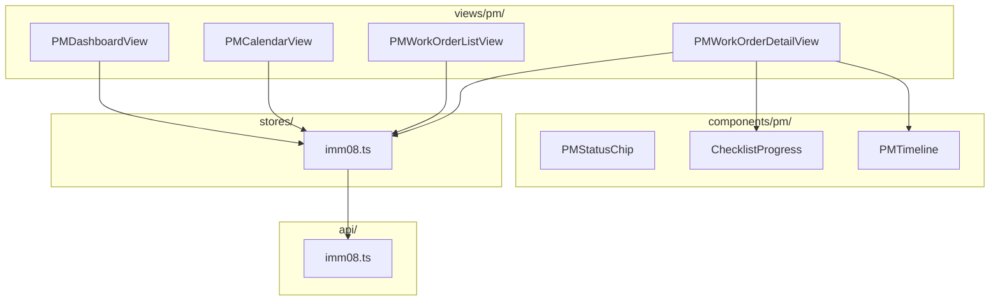

# 03 — Biểu đồ kỹ thuật — IMM-08 Bảo trì định kỳ (PM)

| Mục | Giá trị |
|---|---|
| Module | IMM-08 |
| Phạm vi | Per-module |
| Owner | System Analyst / Tech Lead / DBA |
| Liên kết | [02 Analysis & Design](./02_Analysis_Design.md) · [04 Backend Design](./04_Backend_Design.md) |
| Cập nhật | 2026-05-18 |

---

# Phần I — Entity Relationship Diagram (ERD)

## I.1. ERD logic



## I.2. Cardinality

| Notation | Mermaid | Ý nghĩa |
|---|---|---|
| `||--||` | một – một | 1 đến 1 |
| `||--o{` | một – nhiều | 1 đến N (0 hoặc nhiều) |
| `}o--||` | nhiều – một | N đến 1 |
| `}o--o{` | nhiều – nhiều | M đến N |

## I.3. Entity catalog

**Entities module sở hữu:**

| Entity | DocType file | Naming | Volume/năm |
|---|---|---|---|
| PM Schedule | `pm_schedule/pm_schedule.json` | `PMS-{asset_ref}-{pm_type}` | = số asset × pm_type |
| PM Checklist Template | `pm_checklist_template/` | `PMCT-{category}-{pm_type}` | ~50 templates |
| PM Checklist Item | child của Template | autoname | ~20 item/template |
| PM Work Order | `pm_work_order/pm_work_order.json` | `PM-WO-.YYYY.-.#####` | ~2000/năm |
| PM Checklist Result | child của PM Work Order | autoname | ~20 result/WO |
| PM Task Log | `pm_task_log/pm_task_log.json` | autoname hash | = số WO Completed |

**Entities tham chiếu cross-module:**

| Entity | Owner module | Vai trò |
|---|---|---|
| Asset (ERPNext) | ERPNext core | Đối tượng thực hiện PM |
| Asset Commissioning | IMM-04 | Trigger tạo PM Schedule đầu |
| PM Work Order (CM type) | IMM-09 (nhận) | CM WO tạo từ Fail-Major |

## I.4. Data dictionary

### Bảng 1.1: PM Schedule

| Field | Type | Length | Required | Default | PII | Validation | Mô tả |
|---|---|---|---|---|---|---|---|
| `name` | varchar | 60 | ✓ | autoname | — | `PMS-{asset_ref}-{pm_type}` | PK, naming unique |
| `asset_ref` | Link Asset | — | ✓ | — | — | must exist | FK đến Asset |
| `pm_type` | Select | — | ✓ | — | — | Quarterly/Semi-Annual/Annual/Ad-hoc | Loại PM |
| `status` | Select | — | — | Active | — | Active/Paused/Suspended | Trạng thái schedule |
| `pm_interval_days` | Int | — | ✓ | — | — | > 0 | Chu kỳ PM (ngày) |
| `checklist_template` | Link PMCT | — | ✓ | — | — | must exist | FK đến template BR-08-01 |
| `alert_days_before` | Int | — | — | 7 | — | ≥ 0 | Ngày trước để tạo WO |
| `next_due_date` | Date | — | — | — | — | — | Ngày PM kế tiếp |
| `last_pm_date` | Date | — | — | — | — | — | Ngày PM lần cuối |

### Bảng 1.2: PM Work Order

| Field | Type | Length | Required | Default | PII | Validation | Mô tả |
|---|---|---|---|---|---|---|---|
| `name` | varchar | 30 | ✓ | autoname | — | `PM-WO-.YYYY.-.#####` | PK |
| `asset_ref` | Link Asset | — | ✓ | — | — | must exist | FK |
| `pm_schedule` | Link PMS | — | ✓ | — | — | must exist | FK |
| `status` | Select | — | ✓ | Open | — | 7 states | Workflow state |
| `wo_type` | Select | — | — | Preventive | — | Preventive/Corrective | Loại WO |
| `due_date` | Date | — | ✓ | — | — | — | Hạn PM |
| `completion_date` | Date | — | — | — | — | read_only | Auto set on_submit |
| `is_late` | Check | — | — | 0 | — | read_only | completion > due |
| `assigned_to` | Link User | — | — | — | — | — | KTV thực hiện |
| `overall_result` | Select | — | — | — | — | Pass/Pass with Minor Issues/Fail | Kết quả tổng |

### Bảng 1.3: PM Task Log

| Field | Type | Length | Required | Default | PII | Validation | Mô tả |
|---|---|---|---|---|---|---|---|
| `name` | varchar | 60 | ✓ | autoname | — | hash | PK, in_create=1 |
| `asset_ref` | Link Asset | — | ✓ | — | — | must exist | FK |
| `pm_work_order` | Link PM WO | — | ✓ | — | — | must exist | FK |
| `completion_date` | Date | — | ✓ | — | — | — | Ngày hoàn thành |
| `is_late` | Check | — | — | 0 | — | read_only | Mirror từ WO |
| `days_late` | Int | — | — | — | — | ≥ 0 | Số ngày trễ |
| `next_pm_date` | Date | — | — | — | — | — | completion + interval |

## I.5. Constraints & indexes

**Unique constraints:**
- `PM Schedule.name` = `PMS-{asset_ref}-{pm_type}` → unique per (asset, pm_type)
- `PM Checklist Template.name` = `PMCT-{asset_category}-{pm_type}` → unique per (category, pm_type)

**Indexes DB:**

| Table | Index | Lý do |
|---|---|---|
| `tabPM Work Order` | `asset_ref` | Dashboard filter, history |
| `tabPM Work Order` | `(status, due_date)` | Scheduler query overdue |
| `tabPM Work Order` | `assigned_to` | KTV xem WO của mình |
| `tabPM Schedule` | `(status, next_due_date)` | Scheduler generate daily |
| `tabPM Task Log` | `asset_ref` | `get_asset_pm_history` |

## I.8. Volume & retention

| Entity | Volume/năm/site | Retention | Archive |
|---|---|---|---|
| PM Schedule | ~500 | Permanent | Không archive |
| PM Work Order | ~2000 | ≥ 5 năm (NĐ98) | Archive sau 5 năm |
| PM Task Log | ~2000 | ≥ 5 năm (NĐ98) | Archive sau 5 năm |
| PM Checklist Result | ~40000 | ≥ 5 năm | Cascade với PM WO |

---

# Phần II — Class Diagram

## II.1.a. Biểu đồ lớp tổng quát



## II.1.b. Biểu đồ lớp chi tiết — PMWorkOrder Controller



## II.2. Layer mapping



---

# Phần III — Sequence Diagram

## III.1. Khi nào vẽ sequence?

| Tình huống | Vẽ? |
|---|---|
| submit_pm_result (multi-step, multi-component) | ✓ |
| report_major_failure (side effects phức tạp) | ✓ |
| GET đơn giản (list, get detail) | ✗ |
| scheduler generate (batch) | ✓ |

## III.3. Sequence — submit_pm_result (Happy path)

```mermaid
sequenceDiagram
    actor KTV
    participant Browser
    participant API as api.imm08
    participant WO as PM Work Order
    participant Sched as PM Schedule
    participant Asset
    participant Log as PM Task Log
    database DB

    KTV->>Browser: click "Hoàn thành PM"
    Browser->>API: POST submit_pm_result {name, checklist_results, overall_result}
    API->>WO: frappe.get_doc("PM Work Order", name)
    WO->>DB: SELECT

    alt checklist chưa đủ (BR-08-08)
        WO-->>API: ValidationError
        API-->>Browser: {success:false, code:"VALIDATION"}
    else Class III chưa có ảnh (BR-08-06)
        WO-->>API: ValidationError
        API-->>Browser: {success:false, code:"VALIDATION"}
    else Happy path
        WO->>WO: _set_completion() → is_late, completion_date
        WO->>Sched: _update_pm_schedule() → next_due_date = completion + interval
        WO->>Asset: _update_asset_fields() → custom_last_pm_date, custom_next_pm_date
        WO->>Log: _create_pm_task_log() → INSERT (immutable)
        WO->>WO: _handle_failures() → auto CM WO nếu Fail-*
        WO->>DB: UPDATE PM WO docstatus=1
        DB-->>API: ok
        API-->>Browser: {success:true, data:{new_status:"Completed", next_pm_date}}
    end
```

## III.3b. Sequence — report_major_failure

```mermaid
sequenceDiagram
    actor KTV
    participant API as api.imm08
    participant WO as PM Work Order
    participant Asset
    participant CMWO as CM Work Order
    participant Email as Email Queue
    database DB

    KTV->>API: POST report_major_failure {pm_wo_name, failure_description}
    API->>DB: get PM WO
    DB-->>API: doc

    alt WO không tồn tại
        API-->>KTV: {success:false, code:"NOT_FOUND"}
    else
        API->>Asset: db.set_value("Asset", asset_ref, "status", "Out of Service")
        API->>WO: db.set_value status = "Halted–Major Failure"
        API->>CMWO: frappe.get_doc({wo_type:"Corrective", source_pm_wo}).insert()
        API->>Email: send khẩn → Workshop Head + VP Block2
        API-->>KTV: {success:true, data:{pm_wo, new_status, cm_wo_created, asset_status}}
    end
```

## III.3c. Sequence — Scheduler generate_pm_work_orders



---

# Phần IV — Communication Diagram

## IV.4. Communication — submit_pm_result

```plantuml
@startuml
object "browser:VueSPA" as B
object ":Imm08Api" as API
object ":PMWorkOrder" as WO
object ":PMSchedule" as PMS
object ":Asset" as ASSET
object ":PMTaskLog" as LOG
database ":MariaDB" as DB

B   --> API  : 1: POST submit_pm_result
API --> DB   : 2: SELECT PM Work Order
API --> WO   : 3: update checklist_results
WO  --> DB   : 3.1: validate BR-08-08, BR-08-06
WO  --> WO   : 4: _set_completion()
WO  --> PMS  : 5: advance schedule
PMS --> DB   : 5.1: UPDATE next_due_date
WO  --> ASSET: 6: update pm dates
ASSET --> DB : 6.1: UPDATE custom_*_pm_date
WO  --> LOG  : 7: _create_pm_task_log()
LOG --> DB   : 7.1: INSERT (immutable)
API --> B    : 8: 200 {success, data}
@enduml
```

---

# Phần V — Package / Dependency Diagram

## V.2. Backend package diagram



## V.3. Frontend package diagram



---

## DoD — File 03 hoàn chỉnh

### I. ERD
- [x] ERD diagram render Mermaid
- [x] Mọi entity sở hữu có catalog entry
- [x] Data dictionary 1 bảng per DocType chính
- [x] Unique constraint + index liệt kê
- [x] Volume + retention đủ

### II. Class Diagram
- [x] Diagram tổng quát đủ 4 layer
- [x] Diagram chi tiết PMWorkOrder
- [x] Stereotype gắn đúng

### III. Sequence Diagram
- [x] submit_pm_result: happy + error path
- [x] report_major_failure sequence
- [x] Scheduler generate sequence
- [x] Audit log line trong diagram

### IV. Communication Diagram
- [x] submit_pm_result communication diagram
- [x] Message numbered

### V. Package Diagram
- [x] BE package diagram
- [x] FE package diagram
