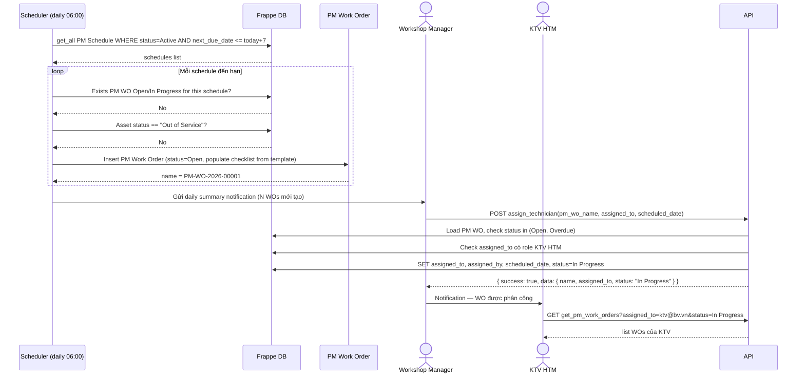
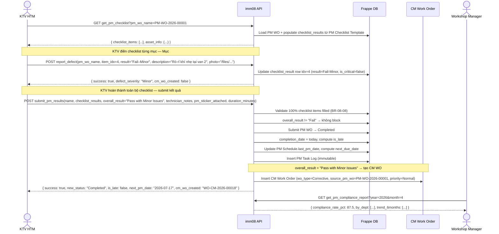
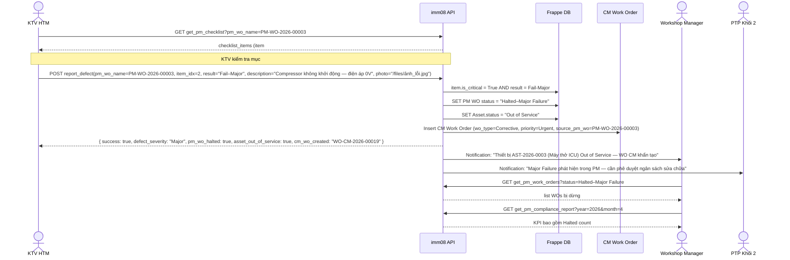

# IMM-08 API Interface Documentation

**Module:** IMM-08 — Bảo trì Định kỳ (Preventive Maintenance)  
**DocTypes:** `PM Schedule`, `PM Work Order`, `PM Task Log`, `PM Checklist Template`  
**Base path:** `/api/method/assetcore.api.imm08`  
**Version:** 1.0  
**Ngày:** 2026-04-17

---

## 1. Authentication

All endpoints require a valid Frappe session. Two methods are supported:

| Method | Header / Cookie |
|---|---|
| Session cookie | `Cookie: sid=<session_id>` |
| API token | `Authorization: token <api_key>:<api_secret>` |

Frappe wraps every response in an outer envelope:
```json
{ "message": <actual_response> }
```

All AssetCore responses inside `message` follow the standard wrapper:
```json
{ "success": true,  "data": { ... } }
{ "success": false, "error": "Mô tả lỗi", "code": "ERROR_CODE" }
```

---

## 2. Sequence Diagrams

### 2.1 Auto-Schedule to WO Creation and Assignment Flow



---

### 2.2 KTV Performs PM — Finds Minor Defect — CM WO Created



---

### 2.3 PM Finds Major Failure — Asset Out of Service Flow



---

## 3. Endpoints Table

| # | HTTP Method | Endpoint | Actor / Role | Mô tả | Auth |
|---|---|---|---|---|---|
| 1 | POST | `create_pm_schedule` | Workshop Manager, CMMS Admin | Tạo lịch PM cho thiết bị | Write perm |
| 2 | GET | `get_pm_work_orders` | KTV HTM, Workshop Manager, CMMS Admin | Danh sách PM WO với filter (status, due_date, asset, technician) | Read perm |
| 3 | GET | `get_pm_work_order` | KTV HTM, Workshop Manager | Chi tiết 1 PM WO | Read perm |
| 4 | POST | `assign_technician` | Workshop Manager, CMMS Admin | Phân công KTV vào PM WO | Write perm |
| 5 | GET | `get_pm_checklist` | KTV HTM, Workshop Manager | Lấy checklist template đầy đủ cho PM WO | Read perm |
| 6 | POST | `submit_pm_results` | KTV HTM | Nộp kết quả PM hoàn chỉnh (validate 100% BR-08-08) | Write perm |
| 7 | POST | `report_defect` | KTV HTM | Ghi nhận lỗi Minor/Major trên 1 checklist item | Write perm |
| 8 | GET | `get_pm_compliance_report` | Workshop Manager, PTP Khối 2, CMMS Admin | Tỷ lệ compliance PM theo kỳ (dashboard) | Read perm |
| 9 | GET | `get_pm_calendar` | Workshop Manager, KTV HTM | Dữ liệu calendar view (tuần/tháng) | Read perm |
| 10 | GET | `list_pm_work_orders` | Workshop Manager, KTV HTM, CMMS Admin | Paginated list PM WOs với filters JSON | Read perm |
| 11 | POST | `reschedule_pm` | Workshop Manager, CMMS Admin | Hoãn lịch PM (Device Busy, KTV vắng) | Write perm |
| 12 | GET | `get_asset_pm_history` | Tất cả role | Lịch sử PM của thiết bị từ PM Task Log | Read perm |
| 13 | GET | `get_pm_dashboard_stats` | Workshop Manager, PTP Khối 2 | KPI tổng thể PM (on-time rate, overdue, avg days late) | Read perm |

---

## 4. JSON Payloads

### 4.1 `create_pm_schedule` — POST

**Request:**
```json
{
  "asset_ref": "AST-2026-0003",
  "pm_type": "Quarterly",
  "pm_interval_days": 90,
  "checklist_template": "PMCT-VentilatorICU-Quarterly",
  "last_pm_date": "2026-01-17",
  "next_due_date": "2026-04-17",
  "alert_days_before": 7,
  "responsible_technician": "ktv1@bvnd1.vn",
  "notes": "Máy thở ICU — ưu tiên PM không gián đoạn ca điều trị"
}
```

**Response (200 OK):**
```json
{
  "message": {
    "success": true,
    "data": {
      "name": "PMS-AST-2026-0003-Quarterly-2026",
      "asset_ref": "AST-2026-0003",
      "pm_type": "Quarterly",
      "next_due_date": "2026-04-17",
      "status": "Active"
    }
  }
}
```

**Error — Asset không tồn tại:**
```json
{
  "message": {
    "success": false,
    "error": "Không tìm thấy Asset: AST-2026-9999",
    "code": "NOT_FOUND"
  }
}
```

**Error — Template không phù hợp với loại thiết bị:**
```json
{
  "message": {
    "success": false,
    "error": "Template PMCT-Infusion-Annual không áp dụng cho loại thiết bị Ventilator ICU.",
    "code": "VALIDATION_ERROR"
  }
}
```

---

### 4.2 `get_pm_work_orders` — GET

**Request:**
```
GET /api/method/assetcore.api.imm08.get_pm_work_orders
    ?status=Open
    &asset_ref=AST-2026-0003
    &due_date_from=2026-04-01
    &due_date_to=2026-04-30
    &assigned_to=ktv1@bvnd1.vn
    &page=1
    &page_size=20
```

**Response (200 OK):**
```json
{
  "message": {
    "success": true,
    "data": {
      "items": [
        {
          "name": "PM-WO-2026-00001",
          "asset_ref": "AST-2026-0003",
          "asset_name": "Máy thở Drager Evita V500 — ICU Giường 3",
          "pm_schedule": "PMS-AST-2026-0003-Quarterly-2026",
          "pm_type": "Quarterly",
          "due_date": "2026-04-17",
          "scheduled_date": "2026-04-17",
          "status": "Open",
          "assigned_to": "ktv1@bvnd1.vn",
          "assigned_by": null,
          "is_late": false,
          "overall_result": null,
          "completion_date": null
        }
      ],
      "pagination": {
        "page": 1,
        "page_size": 20,
        "total": 1,
        "total_pages": 1
      }
    }
  }
}
```

---

### 4.3 `get_pm_work_order` — GET

**Request:**
```
GET /api/method/assetcore.api.imm08.get_pm_work_order?name=PM-WO-2026-00001
```

**Response (200 OK):**
```json
{
  "message": {
    "success": true,
    "data": {
      "name": "PM-WO-2026-00001",
      "asset_ref": "AST-2026-0003",
      "asset_name": "Máy thở Drager Evita V500 — ICU Giường 3",
      "asset_category": "Ventilator ICU",
      "location": "ICU",
      "pm_schedule": "PMS-AST-2026-0003-Quarterly-2026",
      "pm_type": "Quarterly",
      "wo_type": "Preventive",
      "due_date": "2026-04-17",
      "scheduled_date": "2026-04-17",
      "status": "In Progress",
      "assigned_to": "ktv1@bvnd1.vn",
      "assigned_by": "wm@bvnd1.vn",
      "overall_result": null,
      "technician_notes": null,
      "pm_sticker_attached": 0,
      "duration_minutes": null,
      "checklist_results": [
        {
          "idx": 1,
          "checklist_item": "PMCI-VentICU-Q-001",
          "description": "Kiểm tra điện áp đầu vào",
          "measurement_type": "Numeric",
          "unit": "V",
          "expected_min": 210.0,
          "expected_max": 240.0,
          "is_critical": true,
          "result": null,
          "measured_value": null,
          "notes": null,
          "photo": null
        },
        {
          "idx": 2,
          "checklist_item": "PMCI-VentICU-Q-002",
          "description": "Kiểm tra áp lực đường thở tối đa (PIP)",
          "measurement_type": "Numeric",
          "unit": "cmH2O",
          "expected_min": 0.0,
          "expected_max": 60.0,
          "is_critical": true,
          "result": null,
          "measured_value": null,
          "notes": null,
          "photo": null
        },
        {
          "idx": 3,
          "checklist_item": "PMCI-VentICU-Q-003",
          "description": "Kiểm tra alarm âm thanh và đèn báo",
          "measurement_type": "Pass/Fail",
          "unit": null,
          "expected_min": null,
          "expected_max": null,
          "is_critical": true,
          "result": null,
          "measured_value": null,
          "notes": null,
          "photo": null
        },
        {
          "idx": 4,
          "checklist_item": "PMCI-VentICU-Q-004",
          "description": "Kiểm tra rò rỉ hệ thống dây thở",
          "measurement_type": "Pass/Fail",
          "unit": null,
          "expected_min": null,
          "expected_max": null,
          "is_critical": false,
          "result": null,
          "measured_value": null,
          "notes": null,
          "photo": null
        },
        {
          "idx": 5,
          "checklist_item": "PMCI-VentICU-Q-005",
          "description": "Vệ sinh bộ lọc bụi và cánh tản nhiệt",
          "measurement_type": "Pass/Fail",
          "unit": null,
          "expected_min": null,
          "expected_max": null,
          "is_critical": false,
          "result": null,
          "measured_value": null,
          "notes": null,
          "photo": null
        }
      ]
    }
  }
}
```

---

### 4.4 `assign_technician` — POST

**Request:**
```json
{
  "pm_wo_name": "PM-WO-2026-00001",
  "assigned_to": "ktv1@bvnd1.vn",
  "scheduled_date": "2026-04-17"
}
```

**Response (200 OK):**
```json
{
  "message": {
    "success": true,
    "data": {
      "name": "PM-WO-2026-00001",
      "assigned_to": "ktv1@bvnd1.vn",
      "assigned_by": "wm@bvnd1.vn",
      "scheduled_date": "2026-04-17",
      "status": "In Progress"
    }
  }
}
```

**Error — WO không ở trạng thái có thể phân công:**
```json
{
  "message": {
    "success": false,
    "error": "Không thể phân công WO ở trạng thái Completed.",
    "code": "INVALID_STATE"
  }
}
```

**Error — User không có role KTV HTM:**
```json
{
  "message": {
    "success": false,
    "error": "Người dùng admin@test.vn không có quyền thực hiện PM (thiếu role KTV HTM).",
    "code": "VALIDATION_ERROR"
  }
}
```

---

### 4.5 `get_pm_checklist` — GET

**Request:**
```
GET /api/method/assetcore.api.imm08.get_pm_checklist?pm_wo_name=PM-WO-2026-00001
```

**Response (200 OK):**
```json
{
  "message": {
    "success": true,
    "data": {
      "pm_wo_name": "PM-WO-2026-00001",
      "asset_ref": "AST-2026-0003",
      "asset_category": "Ventilator ICU",
      "pm_type": "Quarterly",
      "template_name": "PMCT-VentilatorICU-Quarterly",
      "template_version": "2.1",
      "template_approved_by": "biomed@bvnd1.vn",
      "total_items": 5,
      "critical_items": 3,
      "checklist_items": [
        {
          "idx": 1,
          "item_code": "PMCI-VentICU-Q-001",
          "description": "Kiểm tra điện áp đầu vào",
          "measurement_type": "Numeric",
          "unit": "V",
          "expected_min": 210.0,
          "expected_max": 240.0,
          "is_critical": true,
          "reference_section": "Service Manual §2.1",
          "current_result": null,
          "current_measured_value": null
        },
        {
          "idx": 2,
          "item_code": "PMCI-VentICU-Q-002",
          "description": "Kiểm tra áp lực đường thở tối đa (PIP)",
          "measurement_type": "Numeric",
          "unit": "cmH2O",
          "expected_min": 0.0,
          "expected_max": 60.0,
          "is_critical": true,
          "reference_section": "Service Manual §4.3",
          "current_result": null,
          "current_measured_value": null
        },
        {
          "idx": 3,
          "item_code": "PMCI-VentICU-Q-003",
          "description": "Kiểm tra alarm âm thanh và đèn báo",
          "measurement_type": "Pass/Fail",
          "unit": null,
          "expected_min": null,
          "expected_max": null,
          "is_critical": true,
          "reference_section": "Service Manual §5.1",
          "current_result": null,
          "current_measured_value": null
        },
        {
          "idx": 4,
          "item_code": "PMCI-VentICU-Q-004",
          "description": "Kiểm tra rò rỉ hệ thống dây thở",
          "measurement_type": "Pass/Fail",
          "unit": null,
          "expected_min": null,
          "expected_max": null,
          "is_critical": false,
          "reference_section": "Service Manual §3.2",
          "current_result": null,
          "current_measured_value": null
        },
        {
          "idx": 5,
          "item_code": "PMCI-VentICU-Q-005",
          "description": "Vệ sinh bộ lọc bụi và cánh tản nhiệt",
          "measurement_type": "Pass/Fail",
          "unit": null,
          "expected_min": null,
          "expected_max": null,
          "is_critical": false,
          "reference_section": "Service Manual §6.4",
          "current_result": null,
          "current_measured_value": null
        }
      ]
    }
  }
}
```

---

### 4.6 `submit_pm_results` — POST

**Request:**
```json
{
  "name": "PM-WO-2026-00001",
  "checklist_results": [
    { "idx": 1, "result": "Pass", "measured_value": 225.5, "notes": "" },
    { "idx": 2, "result": "Pass", "measured_value": 35.0, "notes": "" },
    { "idx": 3, "result": "Pass", "measured_value": null, "notes": "Tất cả alarm hoạt động bình thường" },
    { "idx": 4, "result": "Fail–Minor", "measured_value": null, "notes": "Rò rỉ khí nhẹ tại van 2 — chưa ảnh hưởng hoạt động" },
    { "idx": 5, "result": "Pass", "measured_value": null, "notes": "Đã vệ sinh xong, thay lọc mới" }
  ],
  "overall_result": "Pass with Minor Issues",
  "technician_notes": "Phát hiện rò rỉ nhỏ van 2, đã ghi nhận tạo CM WO theo dõi. Sticker PM đã gắn.",
  "pm_sticker_attached": true,
  "duration_minutes": 52
}
```

**Response (200 OK):**
```json
{
  "message": {
    "success": true,
    "data": {
      "name": "PM-WO-2026-00001",
      "new_status": "Completed",
      "overall_result": "Pass with Minor Issues",
      "completion_date": "2026-04-17",
      "is_late": false,
      "next_pm_date": "2026-07-17",
      "pm_task_log": "PMTL-2026-04-00012",
      "cm_wo_created": "WO-CM-2026-00018"
    }
  }
}
```

**Error — Chưa điền đủ 100% checklist (BR-08-08):**
```json
{
  "message": {
    "success": false,
    "error": "Chưa điền kết quả cho 2 mục checklist: idx 3, idx 4. Phải hoàn thành 100% trước khi nộp.",
    "code": "VALIDATION_ERROR"
  }
}
```

**Error — WO không ở trạng thái hợp lệ:**
```json
{
  "message": {
    "success": false,
    "error": "Chỉ có thể nộp kết quả khi WO ở trạng thái In Progress. Hiện tại: Completed",
    "code": "INVALID_STATE"
  }
}
```

---

### 4.7 `report_defect` — POST

**Request (Minor defect):**
```json
{
  "pm_wo_name": "PM-WO-2026-00001",
  "item_idx": 4,
  "result": "Fail–Minor",
  "description": "Rò rỉ khí nhẹ tại van 2 — chưa ảnh hưởng hoạt động lâm sàng",
  "measured_value": null,
  "photo": "/files/photo_leak_valve2_20260417.jpg"
}
```

**Response (Minor — 200 OK):**
```json
{
  "message": {
    "success": true,
    "data": {
      "pm_wo_name": "PM-WO-2026-00001",
      "item_idx": 4,
      "defect_severity": "Minor",
      "pm_wo_halted": false,
      "asset_out_of_service": false,
      "cm_wo_created": null,
      "message": "Lỗi nhỏ đã ghi nhận. PM WO tiếp tục bình thường. CM WO sẽ tạo khi submit kết quả cuối."
    }
  }
}
```

**Request (Major defect — Critical item):**
```json
{
  "pm_wo_name": "PM-WO-2026-00003",
  "item_idx": 2,
  "result": "Fail–Major",
  "description": "Compressor không khởi động — điện áp đo được 0V, thiết bị không thể vận hành",
  "measured_value": 0.0,
  "photo": "/files/photo_compressor_fail_20260417.jpg"
}
```

**Response (Major — PM dừng, Asset Out of Service — 200 OK):**
```json
{
  "message": {
    "success": true,
    "data": {
      "pm_wo_name": "PM-WO-2026-00003",
      "item_idx": 2,
      "defect_severity": "Major",
      "pm_wo_halted": true,
      "new_pm_wo_status": "Halted–Major Failure",
      "asset_out_of_service": true,
      "asset_ref": "AST-2026-0003",
      "cm_wo_created": "WO-CM-2026-00019",
      "cm_wo_priority": "Urgent",
      "message": "Lỗi nghiêm trọng phát hiện — PM WO dừng, thiết bị đặt Out of Service, CM WO khẩn đã tạo."
    }
  }
}
```

---

### 4.8 `get_pm_compliance_report` — GET

**Request:**
```
GET /api/method/assetcore.api.imm08.get_pm_compliance_report?year=2026&month=4
```

**Response (200 OK):**
```json
{
  "message": {
    "success": true,
    "data": {
      "period": "2026-04",
      "kpis": {
        "compliance_rate_pct": 87.5,
        "total_scheduled": 16,
        "completed_on_time": 11,
        "completed_late": 3,
        "overdue": 2,
        "halted_major_failure": 1,
        "avg_days_late": 3.5
      },
      "by_dept": [
        {
          "dept": "ICU",
          "total": 5,
          "completed": 5,
          "on_time": 4,
          "late": 1,
          "compliance_pct": 80.0
        },
        {
          "dept": "Phòng mổ",
          "total": 4,
          "completed": 4,
          "on_time": 4,
          "late": 0,
          "compliance_pct": 100.0
        },
        {
          "dept": "HSTC",
          "total": 4,
          "completed": 2,
          "on_time": 2,
          "late": 0,
          "compliance_pct": 50.0
        },
        {
          "dept": "X-quang",
          "total": 3,
          "completed": 3,
          "on_time": 3,
          "late": 0,
          "compliance_pct": 100.0
        }
      ],
      "trend_6months": [
        { "period": "2025-11", "compliance_pct": 90.0, "total": 14, "on_time": 12 },
        { "period": "2025-12", "compliance_pct": 85.7, "total": 14, "on_time": 12 },
        { "period": "2026-01", "compliance_pct": 93.3, "total": 15, "on_time": 14 },
        { "period": "2026-02", "compliance_pct": 84.6, "total": 13, "on_time": 11 },
        { "period": "2026-03", "compliance_pct": 88.9, "total": 18, "on_time": 16 },
        { "period": "2026-04", "compliance_pct": 87.5, "total": 16, "on_time": 14 }
      ]
    }
  }
}
```

---

### 4.9 `get_pm_calendar` — GET

**Request:**
```
GET /api/method/assetcore.api.imm08.get_pm_calendar?year=2026&month=4&asset_ref=&technician=ktv1@bvnd1.vn
```

**Response (200 OK):**
```json
{
  "message": {
    "success": true,
    "data": {
      "month": "2026-04",
      "technician_filter": "ktv1@bvnd1.vn",
      "events": [
        {
          "name": "PM-WO-2026-00001",
          "asset_ref": "AST-2026-0003",
          "asset_name": "Máy thở Drager Evita V500 — ICU",
          "pm_type": "Quarterly",
          "due_date": "2026-04-17",
          "status": "Completed",
          "assigned_to": "ktv1@bvnd1.vn",
          "is_late": false,
          "overall_result": "Pass with Minor Issues"
        },
        {
          "name": "PM-WO-2026-00004",
          "asset_ref": "AST-2026-0007",
          "asset_name": "Máy bơm tiêm Braun — Phòng mổ 2",
          "pm_type": "Semi-Annual",
          "due_date": "2026-04-22",
          "status": "Open",
          "assigned_to": "ktv1@bvnd1.vn",
          "is_late": false,
          "overall_result": null
        },
        {
          "name": "PM-WO-2026-00007",
          "asset_ref": "AST-2026-0011",
          "asset_name": "Monitor theo dõi bệnh nhân Philips — HSTC",
          "pm_type": "Quarterly",
          "due_date": "2026-04-10",
          "status": "Overdue",
          "assigned_to": "ktv1@bvnd1.vn",
          "is_late": true,
          "overall_result": null
        }
      ],
      "summary": {
        "total": 3,
        "completed": 1,
        "overdue": 1,
        "open": 1,
        "in_progress": 0,
        "halted": 0
      }
    }
  }
}
```

---

### 4.10 `list_pm_work_orders` — GET

**Request:**
```
GET /api/method/assetcore.api.imm08.list_pm_work_orders
    ?filters={"status":"Overdue"}
    &page=1
    &page_size=20
```

**Response (200 OK):**
```json
{
  "message": {
    "success": true,
    "data": {
      "items": [
        {
          "name": "PM-WO-2026-00007",
          "asset_ref": "AST-2026-0011",
          "pm_type": "Quarterly",
          "due_date": "2026-04-10",
          "status": "Overdue",
          "assigned_to": "ktv1@bvnd1.vn",
          "is_late": true,
          "overall_result": null
        }
      ],
      "pagination": {
        "page": 1,
        "page_size": 20,
        "total": 2,
        "total_pages": 1
      }
    }
  }
}
```

---

### 4.11 `reschedule_pm` — POST

**Request:**
```json
{
  "name": "PM-WO-2026-00004",
  "new_date": "2026-04-25",
  "reason": "Thiết bị đang sử dụng trong ca cấp cứu chiều 22/4 — dời sang 25/4"
}
```

**Response (200 OK):**
```json
{
  "message": {
    "success": true,
    "data": {
      "name": "PM-WO-2026-00004",
      "old_scheduled_date": "2026-04-22",
      "new_scheduled_date": "2026-04-25",
      "status": "Pending–Device Busy",
      "reason_logged": true
    }
  }
}
```

---

### 4.12 `get_asset_pm_history` — GET

**Request:**
```
GET /api/method/assetcore.api.imm08.get_asset_pm_history?asset_ref=AST-2026-0003&limit=10
```

**Response (200 OK):**
```json
{
  "message": {
    "success": true,
    "data": {
      "asset_ref": "AST-2026-0003",
      "asset_name": "Máy thở Drager Evita V500 — ICU Giường 3",
      "total_pm_count": 8,
      "history": [
        {
          "name": "PMTL-2026-04-00012",
          "pm_work_order": "PM-WO-2026-00001",
          "pm_type": "Quarterly",
          "completion_date": "2026-04-17",
          "technician": "ktv1@bvnd1.vn",
          "overall_result": "Pass with Minor Issues",
          "is_late": false,
          "days_late": 0,
          "next_pm_date": "2026-07-17",
          "summary": "Phát hiện rò rỉ nhỏ van 2 — đã tạo CM WO-CM-2026-00018. Sticker PM đã gắn."
        },
        {
          "name": "PMTL-2026-01-00003",
          "pm_work_order": "PM-WO-2026-00000",
          "pm_type": "Quarterly",
          "completion_date": "2026-01-17",
          "technician": "ktv2@bvnd1.vn",
          "overall_result": "Pass",
          "is_late": false,
          "days_late": 0,
          "next_pm_date": "2026-04-17",
          "summary": "Hoàn thành đúng hạn — tất cả mục Pass."
        }
      ]
    }
  }
}
```

---

### 4.13 `get_pm_dashboard_stats` — GET

**Request:**
```
GET /api/method/assetcore.api.imm08.get_pm_dashboard_stats?year=2026&month=4
```

**Response (200 OK):**
```json
{
  "message": {
    "success": true,
    "data": {
      "kpis": {
        "compliance_rate_pct": 87.5,
        "total_scheduled": 16,
        "completed_on_time": 11,
        "overdue": 2,
        "halted_major_failure": 1,
        "avg_days_late": 3.5,
        "assets_no_schedule": 4,
        "assets_due_soon_7d": 3
      },
      "by_dept": [
        { "dept": "ICU",       "compliance_pct": 80.0,  "total": 5,  "on_time": 4 },
        { "dept": "Phòng mổ",  "compliance_pct": 100.0, "total": 4,  "on_time": 4 },
        { "dept": "HSTC",      "compliance_pct": 50.0,  "total": 4,  "on_time": 2 },
        { "dept": "X-quang",   "compliance_pct": 100.0, "total": 3,  "on_time": 3 }
      ],
      "trend_6months": [
        { "period": "2025-11", "compliance_pct": 90.0 },
        { "period": "2025-12", "compliance_pct": 85.7 },
        { "period": "2026-01", "compliance_pct": 93.3 },
        { "period": "2026-02", "compliance_pct": 84.6 },
        { "period": "2026-03", "compliance_pct": 88.9 },
        { "period": "2026-04", "compliance_pct": 87.5 }
      ]
    }
  }
}
```

---

## 5. Error Code Table

| Code | HTTP Status | Mô tả | Endpoint(s) áp dụng |
|---|---|---|---|
| `NOT_FOUND` | 200* | Không tìm thấy record (Asset, PM Schedule, PM WO) | `create_pm_schedule`, `get_pm_work_order`, `assign_technician`, `get_pm_checklist`, `submit_pm_results`, `report_defect`, `reschedule_pm`, `get_asset_pm_history` |
| `FORBIDDEN` | 200* | Không có quyền thực hiện hành động này | `assign_technician`, `reschedule_pm`, `submit_pm_results`, `report_defect` |
| `VALIDATION_ERROR` | 200* | Vi phạm business rule (ví dụ: 100% checklist BR-08-08, template không phù hợp) | `create_pm_schedule`, `assign_technician`, `submit_pm_results`, `report_defect` |
| `INVALID_STATE` | 200* | Hành động không hợp lệ ở state hiện tại | `assign_technician`, `submit_pm_results`, `report_defect`, `reschedule_pm` |
| `INVALID_DATA` | 200* | JSON parse error hoặc tham số không hợp lệ | `list_pm_work_orders`, `create_pm_schedule` |
| `DUPLICATE_WO` | 200* | PM WO đã tồn tại cho schedule này (idempotent guard) | `create_pm_schedule` (nếu tạo thủ công trùng scheduler) |
| `ASSET_OUT_OF_SERVICE` | 200* | Asset ở trạng thái Out of Service — không thể tạo PM | `create_pm_schedule`, scheduler auto-create |
| `MAJOR_FAILURE_REQUIRED` | 200* | Critical item bị Fail — phải gọi `report_defect` với Major trước khi submit | `submit_pm_results` |
| `CREATE_ERROR` | 200* | Lỗi unexpected khi tạo record | `create_pm_schedule`, `report_defect` (khi tạo CM WO) |

> *Frappe luôn trả HTTP 200. Error được phân biệt qua `success: false` và `code` trong response body.

---

## 6. curl Examples

### 6.1 Create PM Schedule
```bash
curl -s -X POST \
  -H "Authorization: token abc123:xyz789" \
  -H "Content-Type: application/json" \
  -d '{
    "asset_ref": "AST-2026-0003",
    "pm_type": "Quarterly",
    "pm_interval_days": 90,
    "checklist_template": "PMCT-VentilatorICU-Quarterly",
    "last_pm_date": "2026-01-17",
    "next_due_date": "2026-04-17",
    "alert_days_before": 7,
    "responsible_technician": "ktv1@bvnd1.vn"
  }' \
  "https://erp.bvnd1.vn/api/method/assetcore.api.imm08.create_pm_schedule"
```

### 6.2 Get PM Work Orders (overdue, paginated)
```bash
curl -s \
  -H "Authorization: token abc123:xyz789" \
  "https://erp.bvnd1.vn/api/method/assetcore.api.imm08.get_pm_work_orders?status=Overdue&page=1&page_size=20"
```

### 6.3 Assign technician to WO
```bash
curl -s -X POST \
  -H "Authorization: token abc123:xyz789" \
  -H "Content-Type: application/json" \
  -d '{
    "pm_wo_name": "PM-WO-2026-00001",
    "assigned_to": "ktv1@bvnd1.vn",
    "scheduled_date": "2026-04-17"
  }' \
  "https://erp.bvnd1.vn/api/method/assetcore.api.imm08.assign_technician"
```

### 6.4 Get PM checklist for a WO
```bash
curl -s \
  -H "Authorization: token abc123:xyz789" \
  "https://erp.bvnd1.vn/api/method/assetcore.api.imm08.get_pm_checklist?pm_wo_name=PM-WO-2026-00001"
```

### 6.5 Submit PM results (all pass)
```bash
curl -s -X POST \
  -H "Authorization: token abc123:xyz789" \
  -H "Content-Type: application/json" \
  -d '{
    "name": "PM-WO-2026-00001",
    "checklist_results": [
      { "idx": 1, "result": "Pass", "measured_value": 225.5, "notes": "" },
      { "idx": 2, "result": "Pass", "measured_value": 35.0,  "notes": "" },
      { "idx": 3, "result": "Pass", "measured_value": null,  "notes": "Alarm OK" },
      { "idx": 4, "result": "Fail–Minor", "measured_value": null, "notes": "Rò rỉ nhỏ van 2" },
      { "idx": 5, "result": "Pass", "measured_value": null,  "notes": "Đã vệ sinh xong" }
    ],
    "overall_result": "Pass with Minor Issues",
    "technician_notes": "Ghi nhận rò rỉ van 2, tạo CM WO theo dõi.",
    "pm_sticker_attached": true,
    "duration_minutes": 52
  }' \
  "https://erp.bvnd1.vn/api/method/assetcore.api.imm08.submit_pm_results"
```

### 6.6 Report Minor defect on checklist item
```bash
curl -s -X POST \
  -H "Authorization: token abc123:xyz789" \
  -H "Content-Type: application/json" \
  -d '{
    "pm_wo_name": "PM-WO-2026-00001",
    "item_idx": 4,
    "result": "Fail–Minor",
    "description": "Rò rỉ khí nhẹ tại van 2 — chưa ảnh hưởng hoạt động lâm sàng",
    "photo": "/files/photo_leak_valve2_20260417.jpg"
  }' \
  "https://erp.bvnd1.vn/api/method/assetcore.api.imm08.report_defect"
```

### 6.7 Report Major failure (Critical item)
```bash
curl -s -X POST \
  -H "Authorization: token abc123:xyz789" \
  -H "Content-Type: application/json" \
  -d '{
    "pm_wo_name": "PM-WO-2026-00003",
    "item_idx": 2,
    "result": "Fail–Major",
    "description": "Compressor không khởi động — điện áp đo được 0V",
    "measured_value": 0.0,
    "photo": "/files/photo_compressor_fail_20260417.jpg"
  }' \
  "https://erp.bvnd1.vn/api/method/assetcore.api.imm08.report_defect"
```

### 6.8 Get PM compliance report (monthly)
```bash
curl -s \
  -H "Authorization: token abc123:xyz789" \
  "https://erp.bvnd1.vn/api/method/assetcore.api.imm08.get_pm_compliance_report?year=2026&month=4"
```

### 6.9 Get PM calendar (month view, filtered by technician)
```bash
curl -s \
  -H "Authorization: token abc123:xyz789" \
  "https://erp.bvnd1.vn/api/method/assetcore.api.imm08.get_pm_calendar?year=2026&month=4&technician=ktv1%40bvnd1.vn"
```

### 6.10 Reschedule a PM WO
```bash
curl -s -X POST \
  -H "Authorization: token abc123:xyz789" \
  -H "Content-Type: application/json" \
  -d '{
    "name": "PM-WO-2026-00004",
    "new_date": "2026-04-25",
    "reason": "Thiết bị đang sử dụng trong ca cấp cứu chiều 22/4 — dời sang 25/4"
  }' \
  "https://erp.bvnd1.vn/api/method/assetcore.api.imm08.reschedule_pm"
```

### 6.11 Get PM history for an asset
```bash
curl -s \
  -H "Authorization: token abc123:xyz789" \
  "https://erp.bvnd1.vn/api/method/assetcore.api.imm08.get_asset_pm_history?asset_ref=AST-2026-0003&limit=10"
```

### 6.12 Get PM dashboard KPIs
```bash
curl -s \
  -H "Authorization: token abc123:xyz789" \
  "https://erp.bvnd1.vn/api/method/assetcore.api.imm08.get_pm_dashboard_stats?year=2026&month=4"
```

### 6.13 List PM WOs with JSON filters
```bash
curl -s \
  -H "Authorization: token abc123:xyz789" \
  "https://erp.bvnd1.vn/api/method/assetcore.api.imm08.list_pm_work_orders?filters=%7B%22status%22%3A%22Overdue%22%7D&page=1&page_size=20"
```

---

## 7. Workflow State Reference (PM Work Order)

| State | Khi nào | Chuyển sang |
|---|---|---|
| `Open` | Scheduler tạo WO | `In Progress` (sau assign_technician) |
| `In Progress` | Workshop Manager phân công KTV | `Completed` (sau submit_pm_results), `Halted–Major Failure` (sau report_defect Major), `Pending–Device Busy` (sau reschedule_pm) |
| `Pending–Device Busy` | Workshop Manager hoãn lịch | `In Progress` (sau khi thiết bị sẵn sàng) |
| `Overdue` | Scheduler daily — quá due_date mà chưa Completed | `Completed` hoặc `Halted–Major Failure` (KTV vẫn nộp) |
| `Completed` | KTV submit kết quả thành công | Terminal (audit trail trong PM Task Log) |
| `Halted–Major Failure` | KTV report Major defect trên Critical item | Terminal (CM WO được tạo tự động) |
| `Cancelled` | CMMS Admin huỷ thủ công | Terminal |

---

## 8. Business Rules Summary

| Code | Rule | Endpoint áp dụng |
|---|---|---|
| BR-08-04 | Không tạo PM WO nếu Asset ở `Out of Service` | Scheduler, `create_pm_schedule` |
| BR-08-05 | Không tạo WO trùng nếu đã có WO Open/In Progress cùng schedule | Scheduler (idempotent) |
| BR-08-07 | Critical item Fail–Major → PM WO dừng (`Halted–Major Failure`) + tạo CM WO khẩn | `report_defect` |
| BR-08-08 | 100% checklist items phải có kết quả trước khi submit | `submit_pm_results` |
| BR-08-09 | Minor issue → CM WO tạo tự động với priority Normal khi submit | `submit_pm_results` |
| BR-08-10 | `next_pm_date = last_pm_date + pm_interval_days` — tính lại sau mỗi lần submit | `submit_pm_results`, PM Schedule controller |
| BR-08-11 | PM Task Log là immutable — không thể sửa hoặc xóa sau khi tạo | Tất cả (bảo vệ audit trail) |

---

## 9. Scheduling Reference

| Job | Cron | Mô tả |
|---|---|---|
| `generate_pm_work_orders` | Daily 06:00 | Tạo PM WO cho các schedule đến hạn trong 7 ngày tới |
| `check_pm_overdue` | Daily 08:00 | Đánh dấu Overdue và leo thang cảnh báo |
| `create_pm_schedule_from_commissioning` | Event (IMM-04 submit) | Tạo PM Schedule đầu tiên khi thiết bị được commissioning |
