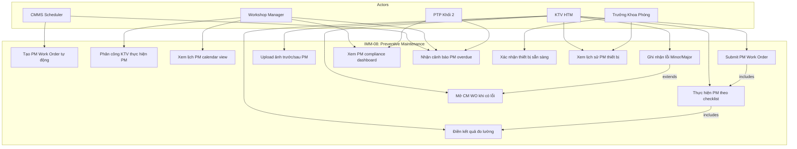
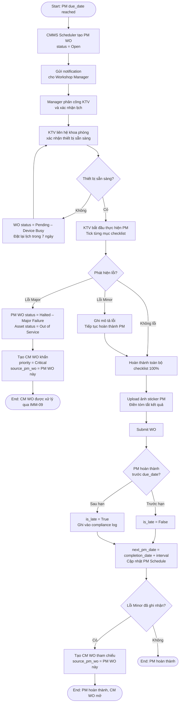
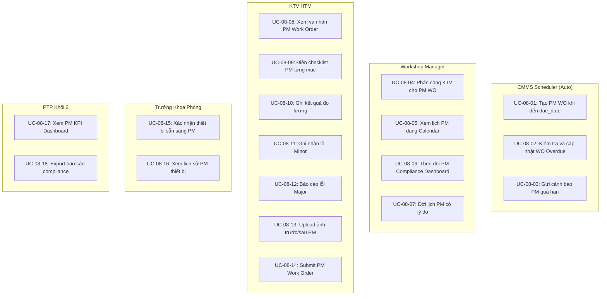
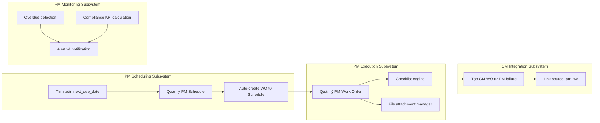

# IMM-08 — Preventive Maintenance (Bảo trì Định kỳ)
## Functional Specification

**Module:** IMM-08  
**Version:** 1.0  
**Ngày:** 2026-04-17  
**Trạng thái:** Draft — Chờ phê duyệt  
**Tác giả:** AssetCore Team

---

## 1. Vị trí trong Asset Lifecycle

```
IMM-04 (Lắp đặt) → IMM-05 (Hồ sơ) → [Asset "Active"]
                                              │
                                    ┌─────────▼─────────┐
                                    │   IMM-08: PM       │
                                    │  Lập kế hoạch      │
                                    │  → Tạo WO          │
                                    │  → Thực hiện       │
                                    │  → Nghiệm thu      │
                                    │  → Cập nhật lịch   │
                                    └─────────┬─────────┘
                                              │ Phát sinh lỗi?
                              ┌───── No ──────┴────── Yes ──────┐
                              │                                  │
                    [PM completed]                    IMM-09 (CM Work Order)
                    Next PM scheduled                 hoặc IMM-12 (Corrective)
```

**Quan hệ ngang:**
- **IMM-04** → cung cấp `asset_ref` và `commissioning_date` làm baseline cho kỳ PM đầu tiên  
- **IMM-05** → cung cấp Service Manual (checklist template nguồn)  
- **IMM-09** → nhận CM WO khi PM phát hiện lỗi  
- **IMM-11** → Calibration có thể được tích hợp vào PM nếu cùng kỳ  
- **IMM-12** → Corrective Maintenance khi PM major failure

---

## 2. Workflow Chính (BPMN)

```
START
  │
  ▼ [Trigger]
  Lịch PM đến hạn (CMMS Scheduler — daily job)
  │
  ▼ [Step 1]
  Tạo PM Work Order tự động
  Actor: CMMS Auto
  Output: PM-WO-YYYY-#####
  │
  ▼ [Step 2]
  Assign KTV & xác nhận lịch
  Actor: Workshop Manager
  Action: Chọn KTV thực hiện, xác nhận ngày PM với khoa phòng
  │
  ▼ [Step 3]
  Thông báo khoa phòng & điều phối thiết bị
  Actor: KTV / Workshop
  Action: Gửi notification, xác nhận thiết bị sẵn sàng
  │
  ▼ [Step 4]
  Thực hiện PM theo checklist chuẩn
  Actor: KTV HTM
  Action: Tick từng mục checklist, ghi kết quả đo lường, chụp ảnh
  │
  ▼ [Gateway: Phát hiện lỗi?]
  │
  ├─── Không lỗi ───────────────────────────────┐
  │                                              │
  ├─── Lỗi MINOR (không ngừng vận hành) ────────┤
  │    → Hoàn thành PM + mở CM WO tham chiếu    │
  │                                              │
  └─── Lỗi MAJOR (ngừng vận hành) ─────────────┐│
       → Dừng PM, set "Out of Service"           ││
       → Mở CM WO khẩn (source_pm_wo = PM WO)   ││
                                                 ││
  ◄────────────────────────────────────────────┘│
  │                                              │
  ▼ [Step 5]                                     │
  Cập nhật kết quả & đóng PM WO                 │
  Actor: KTV HTM                                 │
  ├── Điền tóm tắt kết quả                       │
  ├── Upload ảnh sticker PM đã gắn               │
  └── Submit WO                                  │
  │                                              │
  ▼ [Step 6] (Auto — triggered on Submit)        │
  Cập nhật lịch PM tiếp theo                    │
  next_pm_date = completion_date + pm_interval   │
  │                                              │
  ▼                                              │
  END: PM hoàn thành, sticker gắn, lịch cập nhật│
  ◄──────────────────────────────────────────────┘
```

---

## 3. Actors & Roles

| Actor | Vai trò | Quyền hệ thống | Trách nhiệm |
|---|---|---|---|
| CMMS Scheduler | System auto-trigger | System Process | Tạo WO tự động theo PM Schedule |
| Workshop Manager | Lập kế hoạch & phân công | Assign WO, PM Calendar | Phân công KTV, điều phối lịch khoa phòng |
| Kỹ thuật viên HTM | Thực hiện PM | Execute WO, Fill Checklist | Thực hiện, điền kết quả, gắn sticker |
| Trưởng khoa phòng | Phối hợp | View Schedule, Confirm | Xác nhận thiết bị sẵn sàng, ký biên bản |
| PTP Khối 2 | Giám sát KPI | View PM Dashboard | Theo dõi compliance rate, escalation |

---

## 4. Input / Output

### INPUT

| Đầu vào | Nguồn |
|---|---|
| PM Schedule (interval, due_date) | `PM Schedule` DocType |
| PM Checklist Template theo Asset Category | `PM Checklist Template` |
| Lịch sử PM trước (last_pm_date, last result) | `PM Task Log` |
| Service manual (phần PM procedure) | IMM-05 Asset Document |
| Danh sách vật tư tiêu hao cần thay | Spare Parts Catalog |
| Trạng thái thiết bị hiện tại | `Asset.status` |

### OUTPUT

| Đầu ra | DocType / Artifact |
|---|---|
| PM Work Order (WO) | `PM Work Order` |
| PM Task Log (kết quả từng lần) | `PM Task Log` |
| Checklist kết quả PM đã ký (PDF) | Print Format |
| PM sticker (physical) + digital tag | Print Format + `Asset.last_pm_date` |
| CM WO (nếu phát sinh) | `PM Work Order` (type=CM, source_pm_wo) |
| next_pm_date (auto-calculated) | `PM Schedule.next_due_date` |

---

## 5. Business Rules

| Mã | Nội dung Rule | Hậu quả vi phạm | Kiểm soát |
|---|---|---|---|
| **BR-08-01** | PM WO phải có checklist template tương ứng với Asset Category trước khi assign | WO không được tạo nếu không có template | Validate template exists on WO creation |
| **BR-08-02** | Khi phát hiện lỗi trong PM, phải mở CM WO có trường `source_pm_wo` bắt buộc tham chiếu số PM WO gốc | CM WO bị block Submit nếu thiếu source | `source_pm_wo` mandatory khi type=CM from PM |
| **BR-08-03** | Ngày PM tiếp theo tính từ ngày **HOÀN THÀNH** (completion_date), không phải due_date | Trễ lịch PM tích luỹ nếu tính từ due_date | `next_pm_date = completion_date + interval` |
| **BR-08-04** | Thiết bị có status `Out of Service` không được tạo PM WO mới cho đến khi restored | Tránh PM thiết bị đang sửa chữa | Workflow condition check on WO creation |
| **BR-08-05** | PM WO hoàn thành sau due_date vẫn bị đánh dấu "Late" trên compliance report | Minh bạch KPI | `is_late = (completion_date > due_date)` |
| **BR-08-06** | Thiết bị nguy cơ cao (Class III) bắt buộc có ảnh chụp trước/sau PM | Đảm bảo bằng chứng audit trail | File attachment mandatory check by risk class |
| **BR-08-07** | Một thiết bị có thể có nhiều loại PM (annual, quarterly) — mỗi loại là 1 PM Schedule độc lập | Không gộp lịch khác nhau vào cùng 1 WO | `pm_type` phân biệt trên mỗi Schedule |
| **BR-08-08** | Checklist PHẢI được hoàn thành 100% trước khi Submit WO | Tránh PM không đầy đủ | Validate all checklist items filled before Submit |

---

## 6. Tính toán ngày PM

### 6.1 PM đầu tiên (từ IMM-04)
```
first_pm_date = commissioning_date + pm_interval_days
```
Trigger: Khi Asset Commissioning được Submit (event hook `on_submit`).

### 6.2 PM tiếp theo (từ completion)
```
next_pm_date = completion_date + pm_interval_days
```
Điều kiện: PM WO status = "Completed".

### 6.3 Overdue detection (daily scheduler)
```python
if today > due_date and wo.status in ("Open", "In Progress"):
    wo.status = "Overdue"
    send_alert(workshop_manager, ptp)
```

### 6.4 Slippage tolerance
- **≤ 7 ngày trễ**: Cảnh báo vàng, tiếp tục bình thường  
- **8–30 ngày trễ**: Cảnh báo đỏ, escalate PTP  
- **> 30 ngày trễ**: Critical — leo thang BGĐ, ghi vào compliance log

---

## 7. Exception Handling

| Tình huống | Điều kiện kích hoạt | Xử lý hệ thống | Xử lý nghiệp vụ |
|---|---|---|---|
| Thiết bị đang sử dụng ca cấp cứu | Khoa phòng từ chối ngừng thiết bị | WO status = "Pending – Device Busy" | Workshop đặt lại lịch trong 7 ngày, ghi lý do |
| KTV vắng/ốm khi PM đến hạn | WO unassigned hoặc KTV báo vắng | Alert Workshop Manager, WO unassigned | Manager reassign hoặc hoãn có ghi lý do |
| Không có vật tư tiêu hao | Spare part stock = 0 | Block WO, trigger spare part request | Liên hệ kho, đặt mua khẩn nếu tồn kho = 0 |
| Thiết bị có multiple PM types | Annual + quarterly cùng lúc | Tạo riêng WO cho mỗi loại | Workshop có thể combine nếu cùng ngày, ghi log |
| PM fail → lỗi major | KTV đánh dấu "Major Failure" trong checklist | Set asset "Out of Service", tạo CM WO khẩn | Ngừng sử dụng, thông báo khoa phòng và BGĐ |
| Không có checklist template | Asset category không có template | Block WO creation, alert Admin | CMMS Admin tạo template trước khi PM |

---

## 8. User Stories (INVEST)

| ID | Story | SP |
|---|---|---|
| US-08-01 | Với tư cách là **CMMS**, tôi muốn tự động tạo PM WO khi đến ngày đáo hạn theo lịch, để không có thiết bị nào bị bỏ sót PM do quên lịch thủ công. | 8 |
| US-08-02 | Với tư cách là **KTV HTM**, tôi muốn xem PM checklist theo template của từng model thiết bị ngay trong WO, để thực hiện đúng quy trình mà không cần tra tài liệu riêng. | 5 |
| US-08-03 | Với tư cách là **Workshop Manager**, tôi muốn xem lịch PM tuần/tháng theo dạng calendar view, để điều phối nhân lực và lịch với khoa phòng hiệu quả. | 3 |
| US-08-04 | Với tư cách là **PTP Khối 2**, tôi muốn xem PM compliance rate (% WO hoàn thành đúng hạn) theo tháng, để báo cáo BGĐ và cải tiến kế hoạch PM. | 3 |
| US-08-05 | Với tư cách là **KTV HTM**, tôi muốn điền checklist PM trên điện thoại/tablet, để loại bỏ giấy tờ thủ công khi thực hiện tại khoa. | 5 |

---

## 9. Acceptance Criteria (Gherkin)

```gherkin
Scenario: Tự động tạo PM WO và hoàn thành đúng hạn
  Given Asset A có PM Schedule interval = 90 ngày
    And last_pm_date = 90 ngày trước
  When CMMS scheduler chạy daily job
  Then Tạo PM Work Order với status = "Open"
    And WO được đưa vào Workshop queue
    And Gửi notification đến Workshop Manager
  When KTV hoàn thành toàn bộ checklist và Submit WO
  Then Asset.last_pm_date = today
    And Asset.next_pm_date = today + 90
    And PM Task Log entry được tạo với timestamp và KTV name
    And WO.is_late = False

Scenario: PM WO bị trễ hạn
  Given PM WO có due_date = hôm nay - 5 ngày
    And status = "Open"
  When Scheduler chạy overdue check
  Then WO.status = "Overdue"
    And Gửi alert đến Workshop Manager và PTP Khối 2
    And Asset hiển thị badge "PM Overdue" trên dashboard
    And WO.is_late = True khi completed

Scenario: PM phát hiện lỗi Minor
  Given KTV đang điền checklist PM WO
  When KTV đánh dấu 1 mục là "Fail – Minor"
  Then Hệ thống bắt buộc KTV nhập mô tả lỗi
    And KTV có thể tiếp tục hoàn thành PM
    And Sau Submit: CM WO mới được tạo với source_pm_wo = PM WO này
    And Asset.status giữ nguyên "Active"

Scenario: PM phát hiện lỗi Major
  Given KTV đánh dấu mục là "Fail – Major"
  When KTV bấm "Report Major Failure"
  Then PM WO status = "Halted – Major Failure"
    And Asset.status = "Out of Service"
    And CM WO khẩn được tạo với priority = "Critical"
    And Alert gửi Workshop Manager + PTP + khoa phòng ngay lập tức
```

---

## 10. WHO HTM & QMS Mapping

| Yêu cầu IMM-08 | WHO Reference | ISO 9001:2015 | Ghi chú |
|---|---|---|---|
| PM interval theo manufacturer | WHO Maintenance §5.3.1 | §8.5.1 | Template per Asset Category |
| Work Order system | WHO CMMS §3.2.3 | §8.5.1 | PM WO với checklist bắt buộc |
| PM compliance tracking | WHO HTM 2025 §6.2 | §9.1 | KPI = completed on time / total scheduled |
| Hồ sơ bảo trì immutable | WHO Maintenance §5.3.5 | §7.5 | PM Task Log không thể xóa sau Submit |
| Phát hiện lỗi → CM | WHO HTM 2025 §5.3.4 | §10.2 | CM WO có tham chiếu PM WO nguồn |
| Audit trail | WHO HTM 2025 §6.4 | §7.5.3 | Timestamp + user trên mọi hành động |

---

## 11. Use Case Diagram



---

## 12. Activity Diagram — PM Execution Flow



---

## 13. Non-Functional Requirements

| ID | Yêu cầu | Chỉ tiêu | Phương pháp kiểm tra |
|---|---|---|---|
| NFR-08-01 | Scheduler reliability | Tạo WO trong vòng 1 phút sau 00:00 đến hạn | Monitor scheduler log |
| NFR-08-02 | Checklist load time | < 1.5s cho checklist 50 items | Frontend perf test |
| NFR-08-03 | Mobile responsiveness | Hoạt động trên tablet 768px | Manual test |
| NFR-08-04 | Offline capability | Cache checklist khi mất mạng, sync khi có lại | Network simulation test |
| NFR-08-05 | Photo upload size | Tối đa 10 MB/ảnh, tối đa 5 ảnh/WO | Backend validate |
| NFR-08-06 | PM compliance report | Export PDF/Excel trong < 3s | Performance test |
| NFR-08-07 | Alert delivery | Notification gửi trong 5 phút sau trigger | End-to-end test |
| NFR-08-08 | Audit trail | Mọi thao tác trên checklist có timestamp + user | DB audit check |

---

## Biểu Đồ Use Case Phân Rã — IMM-08

### Phân rã theo Actor



### Phân rã theo Subsystem



---

## Đặc Tả Use Case — IMM-08

### UC-08-01: Tạo PM WO tự động

| Thuộc tính | Nội dung |
|---|---|
| **UC ID** | UC-08-01 |
| **Tên** | Tạo PM Work Order tự động khi đến hạn |
| **Actor chính** | CMMS Scheduler |
| **Actor phụ** | Workshop Manager (nhận notification) |
| **Tiền điều kiện** | PM Schedule tồn tại và next_due_date <= today; Asset.status = Active (không Out of Service); PM Checklist Template tồn tại cho asset_category + pm_type |
| **Hậu điều kiện** | PM Work Order được tạo với status = Open; checklist items được clone từ template; notification gửi Workshop Manager |
| **Luồng chính** | 1. Scheduler query PM Schedules có next_due_date <= today / 2. Với mỗi schedule: kiểm tra Asset.status / 3. Kiểm tra tồn tại Checklist Template / 4. Tạo PM Work Order mới (WO-PM-YYYY-#####) / 5. Clone checklist items từ template vào WO / 6. Set status = Open, due_date = next_due_date / 7. Gửi notification đến Workshop Manager |
| **Luồng thay thế** | 2a. Asset.status = Out of Service → skip, không tạo WO (BR-08-04) / 3a. Không có template → block, gửi alert Admin |
| **Luồng ngoại lệ** | 4a. WO creation fail → log error, retry next scheduler run |
| **Business Rule** | BR-08-01: Template phải tồn tại; BR-08-04: Out of Service asset bị block |

---

### UC-08-09: Điền checklist PM

| Thuộc tính | Nội dung |
|---|---|
| **UC ID** | UC-08-09 |
| **Tên** | Điền từng mục checklist PM và ghi kết quả |
| **Actor chính** | KTV HTM |
| **Actor phụ** | — |
| **Tiền điều kiện** | PM WO đã được assign cho KTV; WO.status = In Progress; KTV đã xác nhận thiết bị sẵn sàng với khoa phòng |
| **Hậu điều kiện** | Tất cả checklist items có result; nếu có Fail item → failure_type được ghi nhận |
| **Luồng chính** | 1. KTV mở WO trên thiết bị di động/tablet / 2. Hệ thống hiển thị checklist theo thứ tự idx / 3. KTV tick từng mục: Pass \| Fail-Minor \| Fail-Major / 4. Với mỗi mục Pass: nhập actual_value (nếu có expected_value) / 5. Hệ thống lưu auto-save sau mỗi mục / 6. Sau khi hoàn thành: hệ thống kiểm tra 100% items có result |
| **Luồng thay thế** | 3a. KTV chọn Fail-Minor → hiện ô nhập failure_note (bắt buộc) / 3b. KTV chọn Fail-Major → trigger UC-08-12 |
| **Luồng ngoại lệ** | 5a. Mất kết nối mạng → cache local, sync khi có lại |
| **Business Rule** | BR-08-08: 100% items phải có result trước khi Submit |

---

### UC-08-14: Submit PM Work Order

| Thuộc tính | Nội dung |
|---|---|
| **UC ID** | UC-08-14 |
| **Tên** | Submit PM Work Order sau khi hoàn thành |
| **Actor chính** | KTV HTM |
| **Actor phụ** | CMMS System (auto-update) |
| **Tiền điều kiện** | 100% checklist items đã có result; ảnh PM đã upload (nếu Class III — BR-08-06); result_summary đã điền |
| **Hậu điều kiện** | WO.status = Completed; PM Task Log entry tạo; Asset.last_pm_date = today; PM Schedule.next_due_date = completion_date + interval; nếu có lỗi Minor → CM WO tạo tự động |
| **Luồng chính** | 1. KTV nhấn "Submit Work Order" / 2. Hệ thống validate: checklist 100%, ảnh (nếu Class III), result_summary / 3. Hệ thống set WO.status = Completed / 4. Tính is_late = (completion_date > due_date) / 5. Tạo PM Task Log entry / 6. Cập nhật Asset.last_pm_date = today / 7. Cập nhật PM Schedule.next_due_date = today + interval (BR-08-03) / 8. Nếu có Fail-Minor items: tạo CM WO với source_pm_wo = WO này |
| **Luồng thay thế** | 2a. Checklist chưa đủ 100% → block Submit, hiện danh sách items còn thiếu / 2b. Ảnh chưa upload (Class III) → block Submit |
| **Luồng ngoại lệ** | 6a. Asset không tìm thấy → log error, alert Admin |
| **Business Rule** | BR-08-02: CM WO phải có source_pm_wo; BR-08-03: next_pm_date tính từ completion_date; BR-08-05: is_late flag |
