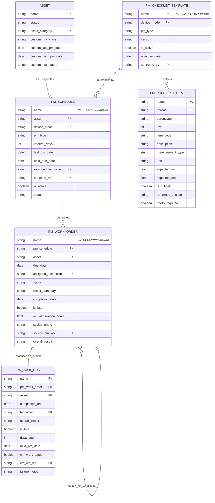
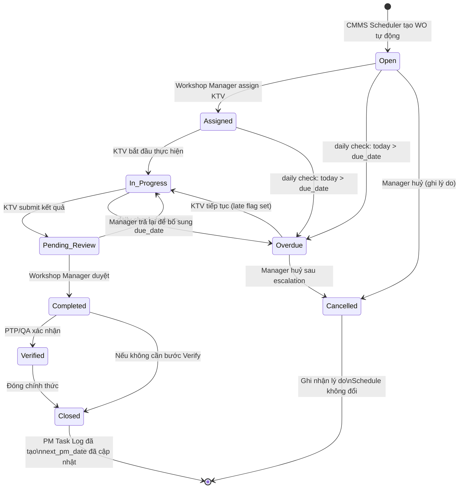

# IMM-08 — Technical Design

## Preventive Maintenance System (Bảo trì Định kỳ)

**Module:** IMM-08
**Version:** 2.0
**Ngày:** 2026-04-17
**Trạng thái:** Ready for Implementation
**Tác giả:** AssetCore Team

---

## 1. ERD (Entity Relationship Diagram)



---

## 2. Data Dictionary

### 2.1 PM Schedule (Lịch bảo trì định kỳ)

**Naming:** `PM-SCH-YYYY-#####` (autoname series)
**DocType type:** Regular (not submittable)

| field_name | Label | Type | Mandatory | Description | Constraints |
| --- | --- | --- | --- | --- | --- |
| `asset` | Thiết bị | Link → Asset | Yes | Thiết bị cần PM | Asset.status phải ≠ Decommissioned |
| `device_model` | Model thiết bị | Link → Device Model | No | Tự động pull từ Asset | Read-only, set on save |
| `pm_type` | Loại PM | Select | Yes | Annual / Quarterly / Monthly | Mỗi asset+pm_type là 1 schedule độc lập |
| `interval_days` | Chu kỳ (ngày) | Int | Yes | 365 / 90 / 30 | > 0 |
| `last_pm_date` | Ngày PM gần nhất | Date | No | Cập nhật sau mỗi WO submit | Không sửa thủ công |
| `next_due_date` | Ngày PM tiếp theo | Date | No | Computed: last_pm_date + interval_days | Read-only, auto-recalc |
| `assigned_technician` | KTV phụ trách | Link → User | No | KTV mặc định khi tạo WO | |
| `template_ref` | Checklist Template | Link → PM Checklist Template | Yes | Template cho asset category | Phải tồn tại trước khi tạo WO |
| `is_active` | Đang hoạt động | Check | Yes | Toggle để tạm dừng schedule | Default: 1 |
| `status` | Trạng thái | Select | Yes | Active / Paused / Expired | Expired khi asset decommissioned |
| `alert_days_before` | Cảnh báo trước (ngày) | Int | No | Số ngày tạo WO trước due_date | Default: 7 |
| `created_from_commissioning` | Tạo từ IMM-04 | Link → Asset Commissioning | No | Liên kết nguồn gốc | Read-only |
| `notes` | Ghi chú | Text | No | | |

---

### 2.2 PM Checklist Template (Mẫu checklist chuẩn)

**Naming:** `PCT-{CATEGORY}-#####`
**DocType type:** Regular

| field_name | Label | Type | Mandatory | Description | Constraints |
| --- | --- | --- | --- | --- | --- |
| `template_name` | Tên template | Data | Yes | Tên mô tả | Unique per device_model + pm_type |
| `device_model` | Model thiết bị | Link → Device Model | Yes | Template áp dụng cho model này | |
| `pm_type` | Loại PM | Select | Yes | Annual / Quarterly / Monthly | |
| `version` | Phiên bản | Data | Yes | Ví dụ: "1.0", "2.1" | Default "1.0" |
| `is_active` | Đang hiệu lực | Check | Yes | Chỉ 1 version is_active per model+type | Validate on save |
| `effective_date` | Ngày hiệu lực | Date | Yes | Ngày bắt đầu áp dụng | |
| `approved_by` | Người phê duyệt | Link → User | Yes | Người phê duyệt template | |
| `approval_date` | Ngày phê duyệt | Date | No | | |
| `items` | Các mục kiểm tra | Table → PM Checklist Item | Yes | Child table danh sách việc cần làm | Phải có ít nhất 1 item |

---

### 2.3 PM Checklist Item (Child Table của Template)

**ParentType:** PM Checklist Template

| field_name | Label | Type | Mandatory | Description | Constraints |
| --- | --- | --- | --- | --- | --- |
| `idx` | STT | Int | Yes | Thứ tự thực hiện | Auto-increment |
| `item_code` | Mã mục | Data | Yes | Ví dụ: CHK-001, CHK-002 | Unique trong template |
| `description` | Mô tả công việc | Text | Yes | Ví dụ: "Kiểm tra điện áp đầu vào" | |
| `measurement_type` | Loại đo lường | Select | Yes | Pass/Fail \| Numeric \| Text | Điều kiện hiển thị expected values |
| `unit` | Đơn vị | Data | No | V, A, mmHg, °C, % | Chỉ hiện khi measurement_type=Numeric |
| `expected_min` | Giá trị min | Float | No | Ngưỡng tối thiểu | Chỉ khi Numeric |
| `expected_max` | Giá trị max | Float | No | Ngưỡng tối đa | Chỉ khi Numeric |
| `is_critical` | Mục quan trọng | Check | No | Fail mục này → Major Failure | Default: 0 |
| `reference_section` | Tham chiếu tài liệu | Data | No | Ví dụ: "Service Manual §3.2" | |
| `photo_required` | Bắt buộc chụp ảnh | Check | No | Yêu cầu đính kèm ảnh | Default: 0 |

---

### 2.4 PM Work Order (Phiếu thực hiện bảo trì)

**Naming Series:** `WO-PM-YYYY-#####`
**DocType type:** Submittable

| field_name | Label | Type | Mandatory | Description | Constraints |
| --- | --- | --- | --- | --- | --- |
| `pm_schedule` | Lịch PM | Link → PM Schedule | Yes | Tham chiếu schedule gốc | |
| `asset` | Thiết bị | Link → Asset | Yes | Pull từ PM Schedule | Read-only |
| `due_date` | Ngày đến hạn | Date | Yes | Pull từ PM Schedule.next_due_date | Read-only |
| `assigned_technician` | KTV thực hiện | Link → User | Yes | Phải assign trước khi In Progress | |
| `status` | Trạng thái | Select | Yes | Open/Assigned/In Progress/Pending Review/Completed/Verified/Closed/Cancelled/Overdue | Workflow-driven |
| `checklist_items` | Kết quả checklist | Table → PM WO Checklist Result | Yes | Clone từ template khi tạo | |
| `result_summary` | Tóm tắt kết quả | Text | No | Mandatory before Submit | Validate on_submit |
| `completion_date` | Ngày hoàn thành | Date | No | Set by system on Submit | Read-only |
| `is_late` | Trễ hạn | Check | No | completion_date > due_date | Computed on Submit |
| `actual_duration_hours` | Thời gian thực tế (giờ) | Float | No | KTV tự nhập | |
| `sticker_photo` | Ảnh sticker PM | Attach | No | Mandatory cho Class III (BR-08-06) | |
| `overall_result` | Kết quả tổng thể | Select | Yes | Pass / Pass with Issues / Fail | |
| `source_pm_wo` | PM WO nguồn | Link → PM Work Order | No | Bắt buộc nếu tạo từ PM failure | Mandatory khi wo_type=CM from PM |
| `wo_type` | Loại WO | Select | Yes | Preventive / Corrective from PM | Default: Preventive |
| `failure_notes` | Gô chú lỗi | Text | No | Điền khi phát hiện lỗi | |

---

### 2.5 PM Task Log (Nhật ký bảo trì — Immutable)

**DocType type:** Regular (không submittable, không deletable — quyền delete bị khoá)

| field_name | Label | Type | Mandatory | Description | Constraints |
| --- | --- | --- | --- | --- | --- |
| `pm_work_order` | PM Work Order | Link → PM Work Order | Yes | Tham chiếu WO | Unique — 1 WO : 1 Log |
| `asset` | Thiết bị | Link → Asset | Yes | | |
| `completion_date` | Ngày hoàn thành | Date | Yes | Lấy từ WO.completion_date | |
| `technician` | KTV | Link → User | Yes | Người thực hiện | |
| `overall_result` | Kết quả | Select | Yes | Pass / Pass with Issues / Fail | |
| `is_late` | Trễ hạn | Check | Yes | Gương WO.is_late | |
| `days_late` | Số ngày trễ | Int | No | date_diff(completion_date, due_date) | 0 nếu on-time |
| `next_pm_date` | Lịch PM tiếp theo | Date | Yes | completion_date + interval | |
| `cm_wo_created` | CM WO đã tạo | Check | No | True nếu phát sinh CM | |
| `cm_wo_ref` | CM WO tham chiếu | Link → PM Work Order | No | Số CM WO nếu có | |
| `failure_notes` | Ghi chú lỗi | Text | No | Summary lỗi phát hiện | |
| `duration_hours` | Thời gian (giờ) | Float | No | Gương WO.actual_duration_hours | |

**Bất biến:** Không ai có quyền xoá sau khi insert. Audit trail tuyệt đối.

---

## 3. State Machine



**Transition Guards:**

- `In_Progress → Pending_Review`: 100% checklist items phải có result (BR-08-08)
- `Pending_Review → Completed`: sticker_photo mandatory nếu Asset.custom_risk_class = "III" (BR-08-06)
- `Completed / Closed`: trigger `on_submit` — tạo PM Task Log, cập nhật Asset dates

---

## 4. Backend Implementation

### 4.1 Controller — `pm_work_order.py`

```python
# assetcore/assetcore/doctype/pm_work_order/pm_work_order.py

import frappe
from frappe import _
from frappe.model.document import Document
from assetcore.services.imm08 import (
    update_asset_pm_dates,
    create_pm_task_log,
    create_cm_wo_from_pm_failure,
)


class PMWorkOrder(Document):
    """
    Controller cho PM Work Order — Phiếu thực hiện bảo trì định kỳ.
    Mọi business logic được delegate xuống service layer (imm08.py).
    """

    def validate(self) -> None:
        """Validate trước khi save — không submit."""
        self._validate_checklist_template_exists()
        self._validate_asset_is_active()
        self._set_readonly_fields()

    def before_submit(self) -> None:
        """Validate nghiêm ngặt trước khi submit (hoàn thành WO)."""
        self._validate_checklist_100_percent()
        self._validate_photo_for_class_iii()
        self._validate_result_summary()
        self._set_completion_fields()

    def on_submit(self) -> None:
        """Actions sau khi submit — audit trail + downstream triggers."""
        update_asset_pm_dates(
            asset_name=self.asset,
            completion_date=self.completion_date,
            interval_days=frappe.db.get_value(
                "PM Schedule", self.pm_schedule, "interval_days"
            ),
        )
        create_pm_task_log(pm_wo=self)
        if self._has_failure_items():
            create_cm_wo_from_pm_failure(pm_wo=self, failure_items=self._get_failure_items())

    def on_cancel(self) -> None:
        """Ghi lý do huỷ vào log."""
        frappe.logger().info(
            f"PM Work Order {self.name} cancelled by {frappe.session.user}"
        )

    # --- Private helpers ---

    def _validate_checklist_template_exists(self) -> None:
        if not self.pm_schedule:
            return
        template = frappe.db.get_value("PM Schedule", self.pm_schedule, "template_ref")
        if not template or not frappe.db.exists("PM Checklist Template", template):
            frappe.throw(
                _("Chưa có Checklist Template cho lịch PM này. Vui lòng tạo template trước."),
                title=_("VR-08-01: Template bắt buộc"),
            )

    def _validate_asset_is_active(self) -> None:
        asset_status = frappe.db.get_value("Asset", self.asset, "status")
        if asset_status == "Out of Service":
            frappe.throw(
                _("Thiết bị {0} đang ở trạng thái Out of Service. Không thể tạo PM Work Order.").format(
                    self.asset
                ),
                title=_("VR-08-02: Thiết bị không khả dụng"),
            )

    def _validate_checklist_100_percent(self) -> None:
        incomplete = [
            item for item in self.checklist_items
            if not item.result
        ]
        if incomplete:
            frappe.throw(
                _("Còn {0} mục checklist chưa có kết quả. Phải hoàn thành 100% trước khi nộp.").format(
                    len(incomplete)
                ),
                title=_("VR-08-03: Checklist chưa đủ"),
            )

    def _validate_photo_for_class_iii(self) -> None:
        risk_class = frappe.db.get_value("Asset", self.asset, "custom_risk_class")
        if risk_class == "III" and not self.sticker_photo:
            frappe.throw(
                _("Thiết bị Class III bắt buộc phải upload ảnh sticker PM trước/sau bảo trì."),
                title=_("VR-08-04: Ảnh bắt buộc"),
            )

    def _validate_result_summary(self) -> None:
        if not self.result_summary:
            frappe.throw(
                _("Vui lòng điền tóm tắt kết quả PM trước khi nộp."),
                title=_("Thiếu tóm tắt kết quả"),
            )

    def _set_readonly_fields(self) -> None:
        if not self.is_new():
            return
        if self.pm_schedule:
            sched = frappe.get_doc("PM Schedule", self.pm_schedule)
            self.asset = sched.asset
            self.due_date = sched.next_due_date

    def _set_completion_fields(self) -> None:
        from frappe.utils import today, date_diff
        self.completion_date = today()
        self.is_late = (
            date_diff(self.completion_date, self.due_date) > 0
        ) if self.due_date else 0

    def _has_failure_items(self) -> bool:
        return any(
            item.result in ("Fail–Minor", "Fail–Major")
            for item in self.checklist_items
        )

    def _get_failure_items(self) -> list:
        return [
            item for item in self.checklist_items
            if item.result in ("Fail–Minor", "Fail–Major")
        ]
```

---

### 4.2 Service Layer — `services/imm08.py`

```python
# assetcore/services/imm08.py
"""
IMM-08 — Preventive Maintenance Service Layer.
Mọi business logic của PM được đặt tại đây, KHÔNG trong controller.
"""

from __future__ import annotations

import frappe
from frappe.utils import add_days, date_diff, nowdate, today


def create_pm_schedule_from_commissioning(doc: "Document") -> None:
    """
    Triggered khi Asset Commissioning được Submit (IMM-04 → IMM-08).
    Tạo PM Schedule đầu tiên cho thiết bị dựa trên Asset Category.

    Args:
        doc: Asset Commissioning document vừa được Submit.
    """
    asset_category = frappe.db.get_value("Asset", doc.asset, "asset_category")
    templates = frappe.get_all(
        "PM Checklist Template",
        filters={"asset_category": asset_category, "is_active": 1},
        fields=["name", "pm_type", "interval_days"],
    )

    for tmpl in templates:
        # Tránh tạo trùng schedule
        if frappe.db.exists("PM Schedule", {"asset": doc.asset, "pm_type": tmpl.pm_type}):
            continue

        frappe.get_doc({
            "doctype": "PM Schedule",
            "asset": doc.asset,
            "pm_type": tmpl.pm_type,
            "interval_days": tmpl.interval_days,
            "template_ref": tmpl.name,
            "last_pm_date": doc.completion_date,
            "next_due_date": add_days(doc.completion_date, tmpl.interval_days),
            "status": "Active",
            "is_active": 1,
            "created_from_commissioning": doc.name,
        }).insert(ignore_permissions=True)

    frappe.db.commit()


def create_pm_work_orders_due_today() -> None:
    """
    Scheduler daily: Tạo PM WO cho các schedule đến hạn.
    Idempotent — không tạo WO trùng cho cùng schedule.
    Chạy lúc: 06:00 hàng ngày.
    """
    alert_window = 7  # Tạo WO trước 7 ngày
    schedules = frappe.get_all(
        "PM Schedule",
        filters={
            "status": "Active",
            "is_active": 1,
            "next_due_date": ("<=", add_days(nowdate(), alert_window)),
        },
        fields=["name", "asset", "pm_type", "next_due_date", "template_ref", "assigned_technician"],
    )

    created_count = 0
    for sched in schedules:
        # Idempotent check: không tạo nếu đã có WO Open/In Progress/Assigned
        existing = frappe.db.exists("PM Work Order", {
            "pm_schedule": sched.name,
            "status": ("in", ["Open", "Assigned", "In Progress", "Pending Review"]),
        })
        if existing:
            continue

        # BR-08-04: Không tạo WO cho thiết bị Out of Service
        asset_status = frappe.db.get_value("Asset", sched.asset, "status")
        if asset_status == "Out of Service":
            frappe.logger("imm08").warning(
                f"Skip PM WO creation for {sched.asset} — Out of Service"
            )
            continue

        wo = frappe.get_doc({
            "doctype": "PM Work Order",
            "pm_schedule": sched.name,
            "asset": sched.asset,
            "pm_type": sched.pm_type,
            "due_date": sched.next_due_date,
            "status": "Open",
            "assigned_technician": sched.assigned_technician,
            "wo_type": "Preventive",
        })
        _populate_checklist_from_template(wo, sched.template_ref)
        wo.insert(ignore_permissions=True)
        created_count += 1

    if created_count:
        frappe.db.commit()
        _notify_workshop_manager_daily_summary(created_count)


def check_pm_overdue() -> None:
    """
    Scheduler daily: Đánh dấu Overdue và leo thang theo ngưỡng.
    Chạy lúc: 08:00 hàng ngày.
    """
    overdue_wos = frappe.get_all(
        "PM Work Order",
        filters={
            "status": ("in", ["Open", "Assigned", "In Progress"]),
            "due_date": ("<", nowdate()),
        },
        fields=["name", "asset", "due_date", "assigned_technician"],
    )

    for wo in overdue_wos:
        days_overdue = date_diff(nowdate(), wo.due_date)
        frappe.db.set_value("PM Work Order", wo.name, "status", "Overdue")

        # Escalation theo ngưỡng (Functional Spec §6.4)
        if days_overdue > 30:
            _escalate_to_director(wo, days_overdue)
        elif days_overdue > 7:
            _escalate_to_ptp(wo, days_overdue)
        else:
            _alert_workshop_manager(wo, days_overdue)

    if overdue_wos:
        frappe.db.commit()


def check_pm_slippage() -> None:
    """
    Scheduler daily: Kiểm tra slippage — WO Overdue > 7 ngày nhưng chưa leo thang.
    Chạy lúc: 09:00 hàng ngày.
    """
    slipped = frappe.get_all(
        "PM Work Order",
        filters={
            "status": "Overdue",
            "due_date": ("<", add_days(nowdate(), -7)),
        },
        fields=["name", "asset", "due_date"],
    )
    for wo in slipped:
        days = date_diff(nowdate(), wo.due_date)
        _escalate_to_ptp(wo, days)


def create_cm_wo_from_pm_failure(
    pm_wo: "Document",
    failure_items: list,
) -> str:
    """
    Tạo CM Work Order khi PM phát hiện lỗi.
    BR-08-02: CM WO bắt buộc có source_pm_wo.

    Args:
        pm_wo: PM Work Order document đã submit.
        failure_items: Danh sách checklist items bị Fail.

    Returns:
        Tên CM Work Order mới tạo.
    """
    has_major = any(item.result == "Fail–Major" for item in failure_items)
    priority = "Critical" if has_major else "Medium"

    cm_wo = frappe.get_doc({
        "doctype": "PM Work Order",
        "pm_schedule": pm_wo.pm_schedule,
        "asset": pm_wo.asset,
        "wo_type": "Corrective from PM",
        "source_pm_wo": pm_wo.name,  # BR-08-02
        "status": "Open",
        "due_date": today(),
        "failure_notes": "\n".join(
            f"[{i.result}] {i.description}: {i.notes or ''}"
            for i in failure_items
        ),
        "overall_result": "Fail",
    })
    cm_wo.insert(ignore_permissions=True)
    frappe.db.commit()

    if has_major:
        # Set Asset Out of Service
        frappe.db.set_value("Asset", pm_wo.asset, "status", "Out of Service")
        _notify_major_failure(pm_wo, cm_wo.name)

    return cm_wo.name


def update_asset_pm_dates(
    asset_name: str,
    completion_date: str,
    interval_days: int,
) -> None:
    """
    Cập nhật ngày PM trên Asset sau khi WO submit.
    BR-08-03: next_pm_date = completion_date + interval (NOT due_date + interval).

    Args:
        asset_name: Tên Asset.
        completion_date: Ngày hoàn thành PM (chuỗi YYYY-MM-DD).
        interval_days: Chu kỳ PM tính bằng ngày.
    """
    next_pm = add_days(completion_date, interval_days)
    frappe.db.set_value("Asset", asset_name, {
        "custom_last_pm_date": completion_date,
        "custom_next_pm_date": next_pm,
        "custom_pm_status": "On Schedule",
    })


def create_pm_task_log(pm_wo: "Document") -> None:
    """
    Tạo immutable PM Task Log sau khi PM WO submit.
    Là audit trail không thể xoá.

    Args:
        pm_wo: PM Work Order document đã submit.
    """
    interval = frappe.db.get_value("PM Schedule", pm_wo.pm_schedule, "interval_days") or 0
    days_late = max(0, date_diff(pm_wo.completion_date, pm_wo.due_date))

    frappe.get_doc({
        "doctype": "PM Task Log",
        "pm_work_order": pm_wo.name,
        "asset": pm_wo.asset,
        "completion_date": pm_wo.completion_date,
        "technician": pm_wo.assigned_technician,
        "overall_result": pm_wo.overall_result,
        "is_late": pm_wo.is_late,
        "days_late": days_late,
        "next_pm_date": add_days(pm_wo.completion_date, interval),
        "cm_wo_created": 0,
        "failure_notes": pm_wo.failure_notes,
        "duration_hours": pm_wo.actual_duration_hours,
    }).insert(ignore_permissions=True)


# --- Internal helpers (không expose qua API) ---

def _populate_checklist_from_template(wo: "Document", template_ref: str) -> None:
    """Clone checklist items từ PM Checklist Template vào WO."""
    if not template_ref:
        return
    template = frappe.get_doc("PM Checklist Template", template_ref)
    for item in template.items:
        wo.append("checklist_items", {
            "item_code": item.item_code,
            "description": item.description,
            "measurement_type": item.measurement_type,
            "unit": item.unit,
            "expected_min": item.expected_min,
            "expected_max": item.expected_max,
            "is_critical": item.is_critical,
            "reference_section": item.reference_section,
            "photo_required": item.photo_required,
        })


def _notify_workshop_manager_daily_summary(count: int) -> None:
    """Gửi email tóm tắt cho Workshop Manager về WO mới tạo."""
    managers = frappe.get_all("User", filters={"role": "Workshop Manager"}, fields=["email"])
    for mgr in managers:
        frappe.sendmail(
            recipients=[mgr.email],
            subject=f"[AssetCore] {count} PM Work Order mới hôm nay",
            message=f"Hệ thống đã tự động tạo {count} PM Work Order mới cần phân công KTV.",
        )


def _escalate_to_director(wo: dict, days: int) -> None:
    """Leo thang BGĐ khi WO overdue > 30 ngày."""
    frappe.publish_realtime("pm_overdue_critical", {
        "wo": wo["name"], "asset": wo["asset"], "days": days
    })


def _escalate_to_ptp(wo: dict, days: int) -> None:
    """Leo thang PTP khi WO overdue 8–30 ngày."""
    frappe.publish_realtime("pm_overdue_warning", {
        "wo": wo["name"], "asset": wo["asset"], "days": days
    })


def _alert_workshop_manager(wo: dict, days: int) -> None:
    """Cảnh báo Workshop Manager khi WO overdue ≤ 7 ngày."""
    frappe.publish_realtime("pm_overdue_alert", {
        "wo": wo["name"], "asset": wo["asset"], "days": days
    })


def _notify_major_failure(pm_wo: "Document", cm_wo_name: str) -> None:
    """Thông báo khẩn khi phát hiện Major Failure."""
    frappe.publish_realtime("pm_major_failure", {
        "pm_wo": pm_wo.name, "cm_wo": cm_wo_name, "asset": pm_wo.asset
    })
```

---

### 4.3 Hooks Configuration

```python
# hooks.py (additions)

doc_events = {
    # IMM-04 → IMM-08: Tạo PM Schedule khi commissioning hoàn thành
    "Asset Commissioning": {
        "on_submit": "assetcore.services.imm08.create_pm_schedule_from_commissioning",
    },
    # PM Work Order hooks
    "PM Work Order": {
        "validate": "assetcore.assetcore.doctype.pm_work_order.pm_work_order.PMWorkOrder.validate",
        "on_submit": "assetcore.assetcore.doctype.pm_work_order.pm_work_order.PMWorkOrder.on_submit",
        "on_cancel": "assetcore.assetcore.doctype.pm_work_order.pm_work_order.PMWorkOrder.on_cancel",
    },
}

scheduler_events = {
    "daily": [
        # 06:00 — tạo WO cho schedule đến hạn trong 7 ngày tới
        "assetcore.services.imm08.create_pm_work_orders_due_today",
        # 08:00 — đánh dấu Overdue và leo thang
        "assetcore.services.imm08.check_pm_overdue",
        # 09:00 — kiểm tra slippage > 7 ngày
        "assetcore.services.imm08.check_pm_slippage",
    ],
}
```

---

## 5. Validation Rules

| Mã VR | Điều kiện | Action | Error Message (Vietnamese) |
| --- | --- | --- | --- |
| **VR-08-01** | PM Checklist Template không tồn tại cho asset category trước khi tạo WO | Block WO creation | "Chưa có Checklist Template cho lịch PM này. Vui lòng tạo template trước." |
| **VR-08-02** | Asset.status = "Out of Service" khi tạo WO mới | Block WO creation | "Thiết bị {asset} đang ở trạng thái Out of Service. Không thể tạo PM Work Order." |
| **VR-08-03** | Submit WO khi có checklist item chưa có result | Block Submit | "Còn {n} mục checklist chưa có kết quả. Phải hoàn thành 100% trước khi nộp." |
| **VR-08-04** | Asset.custom_risk_class = "III" mà không có sticker_photo | Block Submit | "Thiết bị Class III bắt buộc phải upload ảnh sticker PM trước/sau bảo trì." |
| **VR-08-05** | CM WO có wo_type = "Corrective from PM" nhưng source_pm_wo trống | Block CM WO Save | "CM Work Order phát sinh từ PM bắt buộc phải có số PM Work Order nguồn (source_pm_wo)." |
| **VR-08-06** | Submit WO khi result_summary trống | Block Submit | "Vui lòng điền tóm tắt kết quả PM trước khi nộp." |
| **VR-08-07** | PM Schedule tạo trùng (cùng asset + pm_type) | Block insert | "Đã tồn tại PM Schedule {pm_type} cho thiết bị này. Không được tạo trùng." |
| **VR-08-08** | next_due_date bị tính từ due_date thay vì completion_date | Fail code review | — (code enforcement: `next = completion_date + interval`) |

---

## 6. PM Date Calculation

### 6.1 PM đầu tiên — từ Commissioning (IMM-04 trigger)

```python
# Triggered: Asset Commissioning.on_submit
first_pm_date = add_days(commissioning_doc.completion_date, pm_interval_days)
# Ví dụ: commissioned 2026-01-15, interval 90 days → first PM 2026-04-15
```

### 6.2 PM tiếp theo — từ completion_date (BR-08-03)

```python
# Sau khi PM WO submit thành công:
# ĐÚNG — tính từ ngày hoàn thành thực tế
next_pm_date = add_days(completion_date, interval_days)

# SAI — không được tính từ due_date (tích luỹ trễ)
# next_pm_date = add_days(due_date, interval_days)  ← FORBIDDEN
```

### 6.3 Overdue detection — daily scheduler

```python
# PM WO bị đánh dấu Overdue khi:
if today() > wo.due_date and wo.status in ("Open", "Assigned", "In Progress"):
    wo.status = "Overdue"

# Slippage escalation:
days_late = date_diff(today(), wo.due_date)
# ≤ 7 ngày  → Alert Workshop Manager (cảnh báo vàng)
# 8–30 ngày → Escalate PTP Khối 2 (cảnh báo đỏ)
# > 30 ngày → Escalate BGĐ + ghi compliance log (critical)
```

### 6.4 is_late flag — tính khi Submit

```python
# PM hoàn thành muộn vẫn ghi is_late = True (BR-08-05)
is_late = date_diff(completion_date, due_date) > 0
days_late = max(0, date_diff(completion_date, due_date))
```

---

## 7. KPI Definitions

| KPI | Công thức | Đơn vị | Mục tiêu | Nguồn dữ liệu |
| --- | --- | --- | --- | --- |
| **PM Compliance Rate** | `(WO completed on-time / total WO scheduled) × 100` | % | ≥ 90% | PM Task Log, PM Work Order |
| **Overdue Rate** | `(WO Overdue / total WO scheduled) × 100` | % | ≤ 5% | PM Work Order |
| **Average Completion Time** | `AVG(actual_duration_hours)` per asset category | Hours | Per manufacturer spec | PM Task Log |
| **Average Days Late** | `AVG(days_late) WHERE is_late = True` | Days | → 0 | PM Task Log |
| **Major Failure Rate** | `(WO with Fail–Major / total WO) × 100` | % | ≤ 2% | PM Work Order |
| **First-Time Pass Rate** | `(WO overall_result=Pass / total WO) × 100` | % | ≥ 85% | PM Task Log |

```python
# PM Compliance Rate — SQL
SELECT
    COUNT(CASE WHEN is_late = 0 AND status = 'Closed' THEN 1 END) * 100.0
    / NULLIF(COUNT(*), 0) AS compliance_rate
FROM `tabPM Work Order`
WHERE YEAR(due_date) = %(year)s AND MONTH(due_date) = %(month)s
  AND wo_type = 'Preventive';
```

---

## 8. Exception Catalog

| Error Code | HTTP | Điều kiện | Handler | Recovery |
| --- | --- | --- | --- | --- |
| `PM-ERR-001` | 400 | Template không tồn tại cho asset category | `frappe.throw()` với VR-08-01 | Admin tạo PM Checklist Template |
| `PM-ERR-002` | 400 | Asset Out of Service | `frappe.throw()` với VR-08-02 | Hoàn thành CM WO, restore Asset status |
| `PM-ERR-003` | 400 | Checklist chưa 100% | `frappe.throw()` với VR-08-03 | KTV điền đủ tất cả mục |
| `PM-ERR-004` | 400 | Thiếu ảnh Class III | `frappe.throw()` với VR-08-04 | KTV upload ảnh sticker |
| `PM-ERR-005` | 400 | CM WO thiếu source_pm_wo | `frappe.throw()` với VR-08-05 | Set source_pm_wo bắt buộc |
| `PM-ERR-006` | 409 | WO trùng cho cùng schedule | Skip insert, log warning | Idempotent scheduler — bỏ qua |
| `PM-ERR-007` | 500 | Scheduler fail insert WO | Log error, retry next run | Monitor scheduler log hàng ngày |
| `PM-ERR-008` | 404 | Asset không tìm thấy khi update dates | Log error, alert Admin | Kiểm tra data integrity |

---

## 9. Communication Diagram

```mermaid
graph TD
    subgraph Frontend["Vue 3 Frontend"]
        CAL[PMCalendarView.vue]
        LIST[PMWorkOrderList.vue]
        DETAIL[PMWorkOrderDetail.vue]
        CHECK[PMChecklist.vue]
        STORE[useImm08Store.ts]
    end

    subgraph API["Frappe API — api/imm08.py"]
        A1[GET /list_pm_work_orders]
        A2[GET /get_pm_work_order]
        A3[POST /assign_technician]
        A4[POST /submit_pm_result]
        A5[POST /report_major_failure]
        A6[GET /get_pm_calendar]
        A7[GET /get_pm_dashboard_stats]
        A8[POST /reschedule_pm]
        A9[GET /get_asset_pm_history]
    end

    subgraph Services["Business Logic — services/imm08.py"]
        S1[create_pm_work_orders_due_today]
        S2[check_pm_overdue]
        S3[check_pm_slippage]
        S4[create_pm_schedule_from_commissioning]
        S5[create_cm_wo_from_pm_failure]
        S6[update_asset_pm_dates]
        S7[create_pm_task_log]
    end

    subgraph DocTypes["Frappe DocTypes — MariaDB"]
        D1[PM Schedule]
        D2[PM Checklist Template]
        D3[PM Work Order]
        D4[PM Task Log]
        D5[Asset]
        D6[Asset Commissioning]
    end

    subgraph Scheduler["Frappe Scheduler — tasks.py"]
        T1[daily: create_pm_work_orders_due_today]
        T2[daily: check_pm_overdue]
        T3[daily: check_pm_slippage]
    end

    subgraph External["External Triggers"]
        IMM04[IMM-04: Asset Commissioning.on_submit]
        IMM09[IMM-09: CM Work Order created]
    end

    CAL --> STORE
    LIST --> STORE
    DETAIL --> STORE
    CHECK --> STORE

    STORE -->|HTTP REST| A1
    STORE -->|HTTP REST| A2
    STORE -->|HTTP REST| A3
    STORE -->|HTTP REST| A4
    STORE -->|HTTP REST| A5
    STORE -->|HTTP REST| A6
    STORE -->|HTTP REST| A7
    STORE -->|HTTP REST| A8
    STORE -->|HTTP REST| A9

    A1 --> S1
    A2 --> S1
    A4 --> S6
    A4 --> S7
    A4 --> S5
    A5 --> S5
    A6 --> D1
    A7 --> D4
    A8 --> D3

    T1 --> S1
    T2 --> S2
    T3 --> S3

    S1 -->|insert| D3
    S1 -->|read| D1
    S1 -->|read| D2
    S2 -->|set_value status=Overdue| D3
    S4 -->|insert| D1
    S5 -->|insert CM WO| D3
    S5 -->|set Out of Service| D5
    S6 -->|set_value pm dates| D5
    S7 -->|insert| D4

    IMM04 -->|on_submit hook| S4
    S5 -->|creates| IMM09
```



---

## Appendix: Frappe DocType Permissions

| Role | PM Schedule | PM Work Order | PM Task Log | PM Checklist Template |
| --- | --- | --- | --- | --- |
| KTV HTM | Read | Read, Write (own) | Read | Read |
| Workshop Manager | Read, Write, Create | Read, Write, Assign | Read | Read |
| CMMS Admin | Full | Full | Read | Full |
| PTP Khối 2 | Read | Read | Read | Read |
| System Scheduler | Read, Write, Create | Create, Write | Create | Read |
| QA / Auditor | Read | Read | Read | Read |
