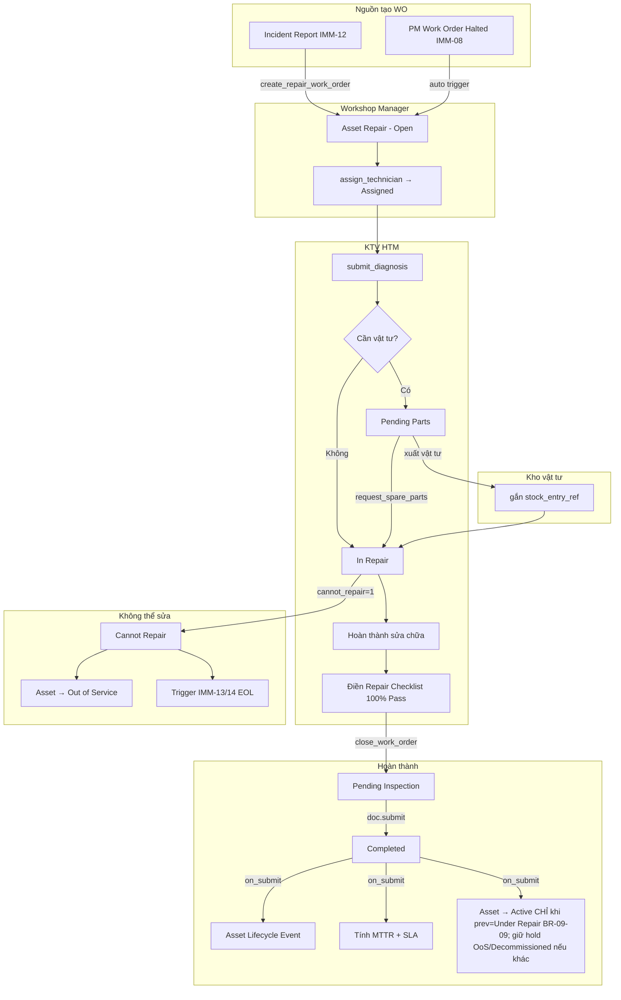
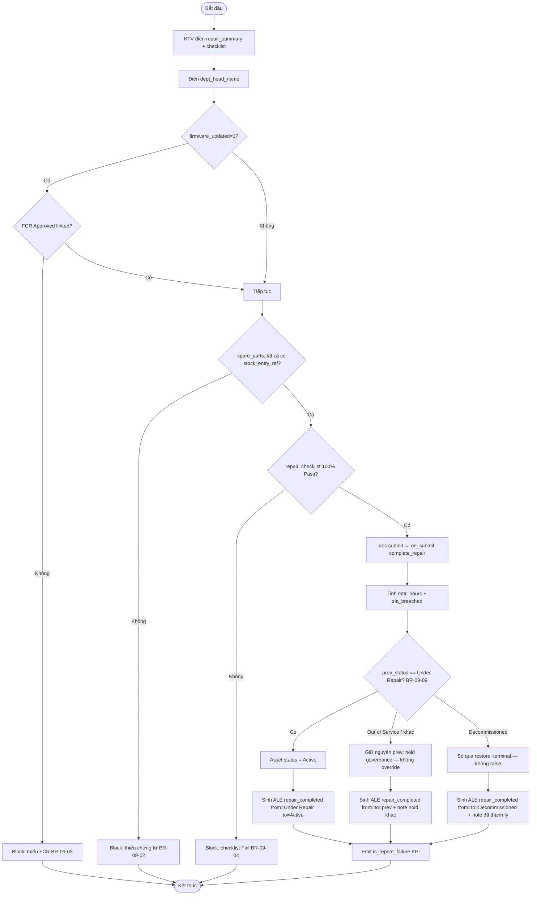
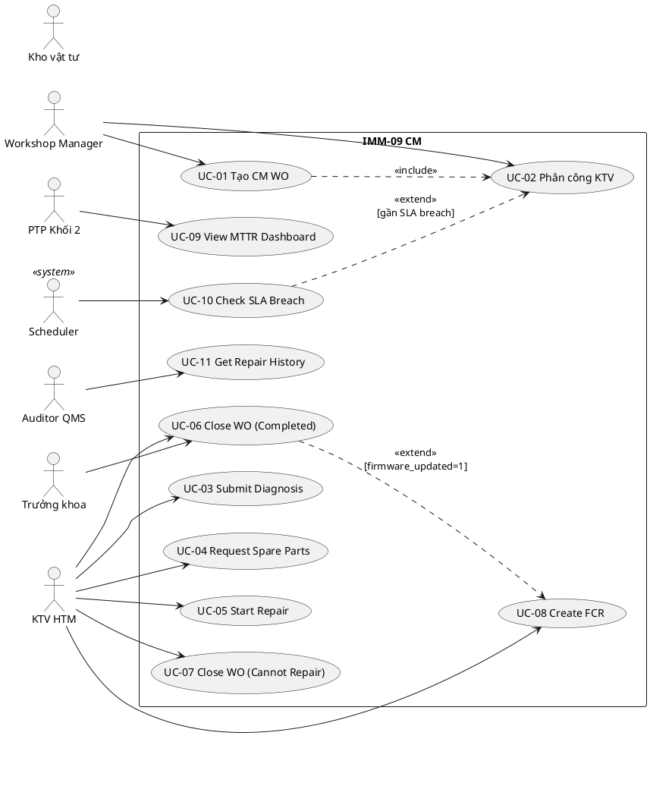
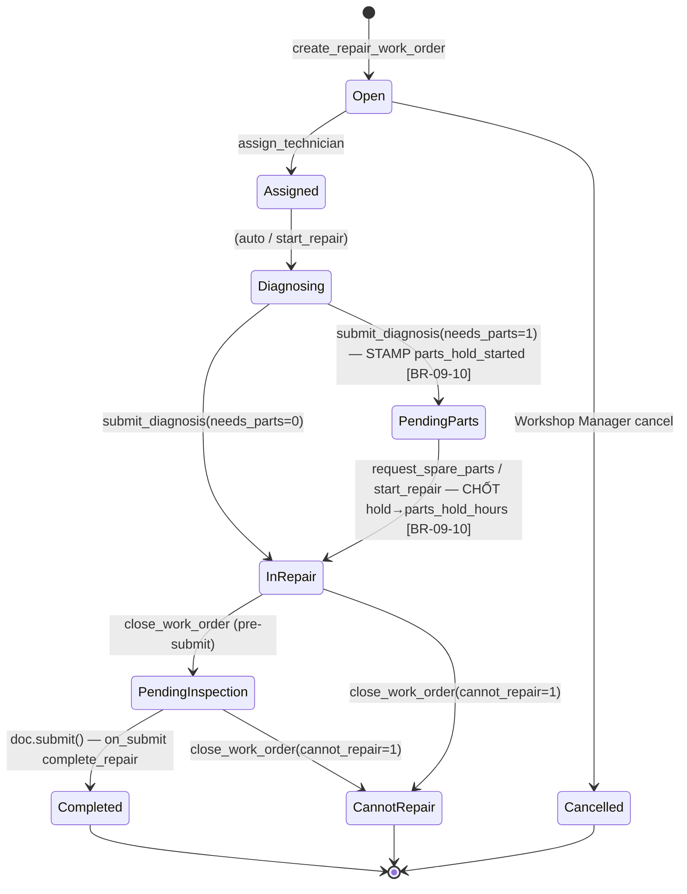
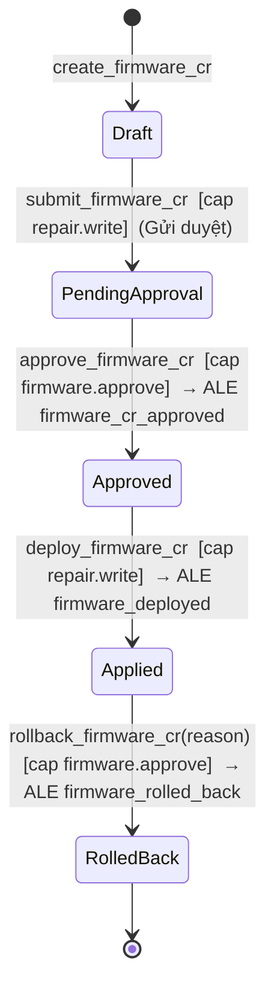

# 02 — Phân tích thiết kế nghiệp vụ — IMM-09 Sửa chữa (Corrective Maintenance)

| Mục               | Giá trị                                                                                                                                    |
| ------------------ | -------------------------------------------------------------------------------------------------------------------------------------------- |
| Module             | IMM-09 — Corrective Maintenance / Repair                                                                                                    |
| Phạm vi           | Per-module                                                                                                                                   |
| Owner              | BA + System Analyst                                                                                                                          |
| Liên kết         | [03 Diagrams](./03_Diagrams.md) · [04 Backend](./04_Backend_Design.md) · [05 API](./05_API_Specification.md) · [06 Frontend](./06_Frontend_Design.md) |
| Chuẩn tham chiếu | WHO HTM 2025 §5.4, ISO 13485:2016 §7.5, ISO 9001:2015 §8.5.1, NĐ 98/2021                                                                 |
| Cập nhật          | 2026-05-18                                                                                                                                   |

---

# Phần I — Module Overview

## I.1. Pitch

Khi thiết bị y tế hỏng, bệnh viện hiện xử lý sửa chữa qua điện thoại/email không có hồ sơ chuẩn — không biết KTV nào đang xử lý, vật tư đã xuất chưa có chứng từ, không đo được MTTR. IMM-09 chuẩn hoá toàn bộ vòng đời sửa chữa: tiếp nhận từ Incident Report hoặc PM Halted, phân công KTV, chẩn đoán, xuất vật tư có chứng từ kế toán, nghiệm thu 100% Pass, đo MTTR theo SLA risk class. Mục tiêu: MTTR Class III Emergency ≤ 4 giờ, SLA compliance ≥ 90%.

## I.2. Vị trí trong WHO HTM lifecycle

| Phase                 | Chạm?             | Ghi chú                                                  |
| --------------------- | ------------------ | --------------------------------------------------------- |
| Needs                 | —                 | —                                                        |
| Procurement           | —                 | —                                                        |
| Install               | —                 | —                                                        |
| Operation             | ✅                 | Asset status transition: Active → Under Repair → Active |
| **Maintenance** | ✅**chính** | CM Work Order, Checklist, Lifecycle Event                 |
| Decommission          | ✅                 | Cannot Repair → Out of Service → trigger IMM-13/14 EOL  |

Input: Incident Report (IMM-12) hoặc PM Work Order Halted (IMM-08).
Output: Asset Repair record (immutable sau submit), Asset Lifecycle Event, MTTR metrics, trigger IMM-11 (Calibration) hoặc IMM-12 (CAPA).

## I.3. Stakeholders & Actors

| Vai trò             | Người dùng thực  | Quan tâm chính                                                 | Tần suất | Loại              |
| -------------------- | -------------------- | ---------------------------------------------------------------- | ---------- | ------------------ |
| Workshop Manager     | Quản lý xưởng KT | Phân công, SLA breach, approve FCR                             | Daily      | Primary            |
| KTV HTM              | Kỹ thuật viên HTM | WO được gán, diagnosis, parts, checklist                     | Daily      | Primary            |
| Kho vật tư         | Thủ kho             | Xuất vật tư, gắn stock_entry_ref                             | Per WO     | Secondary          |
| Trưởng khoa phòng | Trưởng khoa        | Nghiệm thu, ký xác nhận bàn giao                            | Per WO     | Secondary          |
| PTP Khối 2          | Phó Trưởng phòng | MTTR KPI, SLA compliance dashboard                               | Weekly     | Approver           |
| CMMS Admin           | IT / QMS Admin       | Cấu hình, scheduler, audit                                     | Ad-hoc     | Secondary          |
| CMMS Auto            | Frappe Scheduler     | Tự động: SLA breach check hourly, overdue daily, MTTR monthly | Auto       | Secondary (system) |
| Auditor QMS          | QMS Officer          | Hồ sơ immutable, traceability, CAPA link                       | Monthly    | Auditor            |

## I.4. Scope

**In-scope:**

- 4 DocTypes: Asset Repair (submittable), Spare Parts Used (child), Repair Checklist (child), Firmware Change Request (submittable)
- State machine 9 trạng thái: Open → Completed / Cannot Repair / Cancelled
- 8 Business Rules (BR-09-01 → BR-09-08)
- Tính MTTR + SLA matrix theo `risk_class × priority`
- 12 REST endpoints
- 7 FE views Vue 3 + store imm09.ts
- Scheduler: hourly SLA breach, daily overdue, monthly MTTR rollup
- Tích hợp: IMM-08 (PM Halted → CM), IMM-11 (post-repair Cal), IMM-12 (CAPA repeat failure)

**Out-of-scope:**

- Procurement vật tư khẩn cấp (Inventory/Procurement module)
- Vendor Service Order gửi thiết bị ra ngoài (IMM-09.1 phase sau)
- Mobile native app (web responsive đủ Wave 1)
- Predictive maintenance AI (roadmap dài hạn)

**Assumptions:**

- Incident Report (IMM-12) và PM Work Order (IMM-08) đã tồn tại trước khi tạo CM WO
- Stock Entry trong ERPNext đã được kho xuất trước khi gắn `stock_entry_ref`

**Dependencies:**

- IMM-00 Foundation: `transition_asset_status()`, `create_lifecycle_event()`, AC Asset
- IMM-08: `source_pm_wo` — auto tạo CM WO khi PM Halted
- IMM-12: `incident_report` — nguồn tạo CM WO
- ERPNext Stock: `Stock Entry` — chứng từ xuất vật tư (BR-09-02)

## I.5. KPI mục tiêu

| KPI                      | Định nghĩa                              | Baseline           | Target        | Đo ở đâu        |
| ------------------------ | ------------------------------------------ | ------------------ | ------------- | ------------------- |
| MTTR Class III Emergency | Calendar hours từ open → complete        | ~12h (ước tính) | ≤ 4 h        | `get_mttr_report` |
| SLA Compliance           | % WO complete trước `sla_target_hours` | N/A                | ≥ 90%        | `get_repair_kpis` |
| First-Time Fix Rate      | % WO không phải `is_repeat_failure`    | N/A                | ≥ 85%        | `get_mttr_report` |
| Open Backlog             | Số WO chưa đóng                        | N/A                | ≤ 15 WO/site | Dashboard           |
| Repeat Failure Rate      | % WO `is_repeat_failure=1` trong tháng  | N/A                | ≤ 10%        | `get_repair_kpis` |

## I.6. Ràng buộc Compliance

| Quy định           | Yêu cầu áp lên module                            | Doc tham chiếu     |
| -------------------- | ---------------------------------------------------- | ------------------- |
| NĐ 98/2021          | Hồ sơ sửa chữa ≥ 5 năm, truy xuất nguồn gốc | Điều 28–31       |
| NĐ 98/2021          | **Ảnh bằng chứng sửa chữa theo TỪNG mục checklist thiết bị Class C/D** (kiểm soát truy cập — File `is_private=1`) + lifecycle event `repair_checklist_photo_attached` (BR-09-15/16) — **và cổng CHẶN đóng/nghiệm thu khi thiếu ảnh (BR-09-23, AC-CR-84)**. ⚠️ Trước 2026-07-27 dòng này mô tả **khả năng đính ảnh**, KHÔNG phải nghĩa vụ: cổng bắt buộc chỉ tồn tại ở client mobile và ở đó không bao giờ kích hoạt (mobile CR-51) ⇒ phiếu Class C/D đóng được **không kèm ảnh nào**. BR-09-23 đưa cổng về server, đóng khoảng cách tài liệu ↔ hệ thống. | Điều 28 (hồ sơ), phân loại rủi ro C/D |
| WHO HTM 2025 §5.4   | CM WO bắt buộc cho mọi sửa chữa, traceability   | CMMS §3.2.3        |
| ISO 13485:2016 §7.5 | Spare parts có chứng từ, acceptance test          | 7.5.3, 7.5.5, 8.2.4 |
| WHO HTM 2025 §7.2   | Firmware change control (FCR)                        | §7.2               |
| ISO 9001 §10.2      | Repeat failure → CAPA                               | §10.2              |

## I.7. Risk & Open questions

| Risk                                              | Likelihood | Impact | Giảm thiểu                                          |
| ------------------------------------------------- | ---------- | ------ | ----------------------------------------------------- |
| Duplicate active WO cho cùng asset               | Medium     | High   | `validate_asset_not_under_repair` before_insert     |
| Spare parts thiếu chứng từ → block submit     | Medium     | High   | VR-09-05 + UI nhắc nhở sớm                         |
| `ignore_permissions=True` trong service         | High       | Medium | Production review: enable đầy đủ permission check |
| MTTR tính calendar time (không loại ngày lễ) | Medium     | Low    | Backlog: implement `get_working_hours_between`      |

| Open question                                                                   | Owner     | Deadline |
| ------------------------------------------------------------------------------- | --------- | -------- |
| Search spare parts endpoint chính thức (hiện FE gọi frappe.client.get_list) | BE Lead   | Sprint 9 |
| FCR create/approve endpoints                                                    | BE Lead   | Sprint 9 |
| MTTR theo working hours (Mon–Fri 07:00–17:00)                                 | Tech Lead | v2.1     |

## I.8. Roadmap thực thi

| Sprint   | Hạng mục                                  | Owner   | Status         |
| -------- | ------------------------------------------- | ------- | -------------- |
| Sprint 1 | DocType Asset Repair + 2 child + FCR        | BE Lead | ✅ Done        |
| Sprint 2 | Service layer 13 functions + SLA matrix     | BE Lead | ✅ Done        |
| Sprint 3 | API layer 12 endpoints                      | BE Lead | ✅ Done        |
| Sprint 4 | Scheduler hourly/daily/monthly              | BE Lead | ✅ Done        |
| Sprint 5 | FE 7 views + Pinia store                    | FE Lead | ✅ Done        |
| Sprint 6 | UAT 8 scenarios Gherkin + bug fix           | QA      | ✅ Done        |
| Sprint 7 | Docs 07_Testing, 08_Deployment, 09_Release  | BA      | ✅ Done        |
| Sprint 8 | Docs 02–06 template chuẩn                 | BA      | 🔄 In Progress |
| Sprint 9 | search_spare_parts endpoint + FCR endpoints | BE Lead | ⏳ Planned     |

---

# Phần II — Quy trình nghiệp vụ (BPMN)

## II.2. As-Is process

Bệnh viện nhận báo hỏng qua điện thoại → Workshop Manager ghi sổ hoặc email → KTV đến sửa → ghi kết quả tự do trên phiếu giấy. Không có SLA tracking, không rõ vật tư xuất từ đâu, không có nghiệm thu tiêu chuẩn.

## II.3. Pain points

| # | Pain                                                                         | Tác động                                               |
| - | ---------------------------------------------------------------------------- | --------------------------------------------------------- |
| 1 | Không có nguồn bắt buộc → sửa chữa không rõ lý do                 | Không audit-ready, vi phạm WHO HTM                      |
| 2 | Vật tư xuất không có chứng từ kế toán                               | Kiểm toán viên không reconcile được                |
| 3 | Không đo MTTR → không biết workshop có đang tốt không               | KPI trống, không cải tiến được                     |
| 4 | Firmware thay đổi không có change control                                | Rủi ro an toàn thiết bị y tế, vi phạm WHO HTM §7.2 |
| 5 | Không phát hiện tái hỏng → thiết bị hỏng mãn tính không có CAPA | Chi phí sửa chữa tăng                                 |

## II.4. To-Be process

## II.5. Decision points

| Điểm        | Câu hỏi                               | Quy tắc                                            |
| ------------- | --------------------------------------- | --------------------------------------------------- |
| Tạo WO       | Có IR hoặc source_pm_wo?              | Không → block (BR-09-01)                          |
| Tạo WO       | Asset đã có WO active?               | Có → block (BR-09-05)                             |
| Submit        | Spare parts có stock_entry_ref?        | Không → block (BR-09-02)                          |
| Submit        | Firmware_updated=1 có FCR Approved?    | Không → block (BR-09-03)                          |
| Submit        | Checklist 100% Pass?                    | Không → block (BR-09-04)                          |
| Close         | Cannot repair?                          | Có → Asset Out of Service; Không → Asset Active |
| Before_insert | WO hoàn thành trong 30 ngày trước? | Có → is_repeat_failure=1                          |

## II.6. Process metrics

Theo WHO HTM (chương *Computerized Maintenance Management Systems* — đo hiệu quả corrective maintenance qua MTTR, SLA compliance, repeat failure rate, audit-readiness).

| Metric                       | Mục tiêu                                | Đo ở đâu                                          |
| ---------------------------- | ----------------------------------------- | --------------------------------------------------- |
| MTTR (Mean Time To Repair)   | ≤ 24h class B; ≤ 48h class C *(Cần khảo sát baseline)* | `Asset Repair.mttr_hours` aggregate theo asset_class |
| Time-to-assignment           | ≤ 2h kể từ tạo WO                     | `assigned_to` set time − `created` time             |
| % SLA compliance             | ≥ 90% *(Cần khảo sát baseline)*       | `sla_breached=0` / total Completed WO trong kỳ    |
| Repeat failure rate (30d)    | ≤ 5%                                     | `is_repeat_failure=1` / total Completed WO          |
| Spare parts traceability     | 100% có `stock_entry_ref`               | BR-09-02 violation count = 0                        |
| Audit-readiness              | 100% WO Completed có ALE đầy đủ      | ALE `repair_completed` count = WO Completed count   |
| FCR coverage (firmware)      | 100% `firmware_updated=1` có FCR Approved | BR-09-03 violation count = 0                       |

## II.7. RACI matrix

| Hoạt động           | Workshop Manager | KTV HTM | Kho vật tư | Trưởng khoa | PTP Khối 2 | System |
| ---------------------- | ---------------- | ------- | ------------ | ------------- | ----------- | ------ |
| Tạo WO                | R/A              | —      | —           | —            | I           | —     |
| Phân công KTV        | R/A              | I       | —           | —            | —          | —     |
| Diagnosis              | C/I              | R/A     | —           | —            | —          | —     |
| Request vật tư       | C                | R       | A            | —            | —          | —     |
| Xuất vật tư         | C                | R       | R/A          | —            | —          | —     |
| Sửa chữa + checklist | C/I              | R/A     | —           | C             | —          | —     |
| Nghiệm thu (ký)      | C                | R       | —           | R/A           | —          | —     |
| Submit WO              | A                | R       | —           | —            | —          | —     |
| SLA check              | I                | I       | —           | —            | R/A         | —     |
| MTTR rollup            | I                | I       | —           | —            | A           | R      |

## II.8. Exception flow

**E1 — Cannot Repair:**
KTV xác nhận không sửa được → `close_work_order(cannot_repair=1)` → Asset Out of Service → sinh ALE `cannot_repair` → Workshop Manager đề xuất mở EOL (IMM-13/14 manual review).

**E2 — Firmware update cần change control:**
KTV check `firmware_updated=1` → FE tự động hiển thị form tạo FCR → Workshop Manager duyệt FCR → `firmware_change_request` field gắn FCR Approved → submit WO tiếp tục.

**E3 — Repeat failure phát hiện:**
`before_insert` phát hiện WO Completed trong 30 ngày → `is_repeat_failure=1` → FE hiển thị banner "Tái hỏng — gợi ý mở CAPA" → sau close WO, Workshop Manager có thể tạo CAPA (IMM-12).

## II.9. So sánh As-Is vs To-Be

| Khía cạnh                   | As-Is (chưa có hệ thống)                          | To-Be (AssetCore IMM-09)                                                       |
| --------------------------- | ---------------------------------------------------- | -------------------------------------------------------------------------------- |
| Tạo CM WO                  | Sổ giấy / Excel ad-hoc, không bắt buộc nguồn  | DocType `Asset Repair` bắt buộc `incident_report` HOẶC `source_pm_wo` (BR-09-01) |
| Phân công KTV             | Trưởng xưởng gọi điện thoại                  | Workflow `Assigned`, lưu `assigned_to`, audit timestamp                       |
| Theo dõi vật tư         | Chứng từ kho rời, khó đối soát                | Child table `spare_parts` với `stock_entry_ref` (BR-09-02)                     |
| Firmware update             | Không kiểm soát, không link change control    | `firmware_updated=1` ⇒ bắt buộc FCR Approved (BR-09-03)                       |
| Checklist nghiệm thu     | Tự do / không có                                | Child table `repair_checklist` 100% Pass mới Submit (BR-09-04)                |
| MTTR                        | Tính tay, không tin cậy                          | Tự động `mttr_hours = time_to_complete_hours`                                |
| SLA breach                  | Không phát hiện được                             | Scheduler `check_sla_breach` set `sla_breached=1`                                |
| Repeat failure              | Không phát hiện                                   | `before_insert` quét 30 ngày, set `is_repeat_failure=1`                        |
| Asset status                | Không cập nhật / cập nhật trễ                  | `on_submit` ⇒ Asset → Active CHỈ khi đang Under Repair (BR-09-09); giữ OoS/Decommissioned nếu có hold khác; hoặc Out of Service (cannot_repair) |
| Audit trail                 | Mất dấu, không truy xuất sau 6 tháng         | Asset Lifecycle Event + immutable submit (docstatus=1)                           |
| Báo cáo MTTR / SLA         | Excel rollup tay                                    | Dashboard truy về `Asset Repair` source                                         |
| Tuân thủ NĐ98 / WHO HTM   | Khó chứng minh khi audit                         | Trace 100% qua ALE + spare parts + FCR + checklist                               |

## II.10. Activity diagram — UC close_work_order (Completed mode)

---

# Phần III — Use Case Specification

## III.1. Use Case Diagram (tổng quát)

## III.2. Actor catalog

| Actor                | Loại     | Mô tả                      | Goal chính                                    |
| -------------------- | --------- | ---------------------------- | ---------------------------------------------- |
| Workshop Manager     | Primary   | Quản lý xưởng kỹ thuật | SLA compliance, phân bổ nhân lực           |
| KTV HTM              | Primary   | Kỹ thuật viên sửa chữa  | Sửa đúng kỹ thuật, có hồ sơ đầy đủ |
| Kho vật tư         | Secondary | Thủ kho                     | Xuất vật tư có chứng từ                  |
| Trưởng khoa phòng | Secondary | Người dùng thiết bị     | Nhận lại thiết bị an toàn                 |
| PTP Khối 2          | Approver  | Giám sát KPI               | MTTR avg, SLA compliance report                |
| Scheduler            | System    | Frappe scheduler             | SLA breach, overdue, MTTR rollup               |
| Auditor QMS          | Auditor   | QMS Officer                  | Traceability, immutable records                |

## III.3. Use Case Specifications

### UC-06: Close Work Order (Completed)

| Mục           | Giá trị                                                                            |
| -------------- | ------------------------------------------------------------------------------------ |
| ID             | UC-IMM09-06                                                                          |
| Brief          | KTV và Trưởng khoa hoàn thành nghiệm thu và đóng WO                         |
| Primary actor  | KTV HTM                                                                              |
| Pre-condition  | WO ở In Repair / Pending Inspection; checklist đã điền; vật tư có chứng từ |
| Post-condition | WO Completed, docstatus=1; Asset → Active CHỈ khi prev=Under Repair (BR-09-09, ngược lại giữ nguyên hold); ALE repair_completed (luôn ghi); MTTR tính xong |
| Trigger        | KTV xác nhận sửa chữa hoàn thành                                               |

#### Main flow

| Bước | Actor                                           | System                                        |
| ------ | ----------------------------------------------- | --------------------------------------------- |
| 1      | KTV điền repair_summary + root_cause_category | —                                            |
| 2      | KTV điền checklist results (tất cả Pass)    | Validate BR-09-04                             |
| 3      | Trưởng khoa ký dept_head_name                | —                                            |
| 4      | KTV click "Hoàn thành sửa chữa"             | Gọi POST close_work_order                    |
| 5      | —                                              | Validate BR-09-02 (spare parts stock_entry)   |
| 6      | —                                              | Validate BR-09-03 (FCR nếu firmware_updated) |
| 7      | —                                              | doc.submit() → on_submit complete_repair()   |
| 8      | —                                              | Tính mttr_hours, sla_breached                |
| 9      | —                                              | Đọc prev_status; Asset → Active CHỈ khi prev=Under Repair (BR-09-09); ngược lại giữ hold (OoS/Decommissioned) không override, không raise |
| 10     | —                                              | Sinh ALE repair_completed (luôn ghi — cả 3 nhánh) |
| 11     | —                                              | Return {status, mttr_hours, sla_breached}     |

#### Alternative A1 — Cannot Repair

- 4a. KTV chọn "Không thể sửa" → gọi `close_work_order(cannot_repair=1)`
- 4b. Asset.status = Out of Service; ALE cannot_repair; WO = Cannot Repair

#### Exception E1 — Checklist có Fail

- 5a. Validate BR-09-04 fail → error "Mục kiểm tra #{idx} chưa Pass"
- 5b. KTV sửa lại checklist rồi thử lại

#### Special requirements

- `is_repeat_failure` đã set at before_insert — không thay đổi
- Asset Repair record sau submit KHÔNG thể sửa / xóa (submittable)

## III.4. Use Case relationships

**`<<include>>`** — caller bắt buộc gọi callee:

| Caller                       | Callee                                  | Lý do                                                            |
| ---------------------------- | --------------------------------------- | ----------------------------------------------------------------- |
| UC-01 Tạo CM WO             | UC-Validate Source (BR-09-01)           | Mọi WO phải có IR hoặc source_pm_wo                          |
| UC-04 Request Spare Parts    | UC-Validate Stock Entry (BR-09-02)      | Mỗi spare part phải có stock_entry_ref khi submit            |
| UC-06 Close WO (Completed)   | UC-Validate Checklist (BR-09-04)        | 100% Pass mới Submit                                            |
| UC-06 Close WO (Completed)   | UC-Compute MTTR & SLA                   | Auto sinh metric mttr_hours + sla_breached                       |
| UC-06 Close WO (Completed)   | UC-Update Asset Status                  | Asset.status = Active CHỈ khi prev=Under Repair (BR-09-09); giữ hold nếu khác |
| UC-06 Close WO (Completed)   | UC-Emit ALE repair_completed            | Audit trail bắt buộc — luôn ghi cả 3 nhánh                  |
| UC-07 Cannot Repair          | UC-Update Asset Status                  | Asset.status = Out of Service                                     |
| UC-07 Cannot Repair          | UC-Emit ALE cannot_repair               | Trigger EOL review (IMM-13/14 manual)                             |

**`<<extend>>`** — chạy khi điều kiện đúng:

| Base UC                      | Extension UC                            | Điều kiện                                                       |
| ---------------------------- | --------------------------------------- | ----------------------------------------------------------------- |
| UC-01 Tạo CM WO             | UC-Mark Repeat Failure                  | `before_insert` phát hiện WO Completed cho asset trong 30 ngày |
| UC-06 Close WO               | UC-Validate FCR (BR-09-03)              | `firmware_updated=1` ⇒ bắt buộc FCR Approved linked            |
| UC-09 MTTR Dashboard         | UC-Alert High MTTR                      | Khi MTTR avg vượt threshold theo asset_class                    |
| UC-Scheduler SLA Check       | UC-Notify Workshop Manager              | Khi `sla_breached=1` lần đầu                                   |

## III.5. UC ↔ User Story mapping

| Use Case                  | US ID              | Note                            |
| ------------------------- | ------------------ | ------------------------------- |
| UC-01 Tạo CM WO          | US-09-01           | Tạo WO bắt buộc nguồn       |
| UC-02 Phân công         | US-09-02           | Phân công KTV                 |
| UC-03 Submit Diagnosis    | US-09-03           | Ghi chẩn đoán                |
| UC-04 Request Spare Parts | US-09-04, US-09-05 | Yêu cầu + xác nhận vật tư |
| UC-06 Close WO            | US-09-07, US-09-08 | Checklist + nghiệm thu         |
| UC-07 Cannot Repair       | US-09-09           | EOL trigger                     |
| UC-09 MTTR Dashboard      | US-09-10, US-09-11 | KPI report                      |

---

# Phần IV — Functional Specifications

## IV.1. User Stories & Acceptance Criteria

### US-09-01 — Tạo CM WO bắt buộc có nguồn

Là **Workshop Manager**, tôi muốn **tạo CM Work Order bắt buộc có nguồn (IR hoặc PM WO)**, để **mọi sửa chữa truy xuất được lý do**.

Priority: Must | Estimate: 5SP

**AC-1 — Thiếu nguồn → block:**

- Given Workshop Manager đăng nhập
- When POST create_repair_work_order với incident_report="" và source_pm_wo=""
- Then response.success=false; response.error contains "Phải có nguồn sửa chữa"

**AC-2 — Tạo WO thành công:**

- Given Incident Report IR-2026-00123 đã submitted; asset=AC-ASSET-2026-00042 (Class III)
- When POST create_repair_work_order với incident_report="IR-2026-00123", priority="Urgent"
- Then response.data.name khớp `^WO-CM-2026-\d{5}$`; sla_target_hours=24.0; Asset.status="Under Repair"

### US-09-07 — Checklist 100% Pass trước khi Complete

Là **KTV HTM**, tôi muốn **hệ thống chỉ cho Submit khi Repair Checklist 100% Pass**, để **đảm bảo an toàn trước khi trả thiết bị**.

Priority: Must | Estimate: 5SP

> **CR-50 (seed danh mục chuẩn — gỡ deadlock nghiệm thu):** phiếu CM do **mobile** tạo trước đây có `repair_checklist` rỗng ⇒ `confirm_inspection` submit → BR-09-04 `if not doc.repair_checklist` raise 422 → **deadlock 100% phiếu CM mobile** (không có dòng nào để KTV điền → không submit được). Giải pháp: `create_work_order` **seed 6 dòng danh mục chuẩn** (`test_description`+`test_category` điền sẵn, `result` trống) — KTV chỉ cần điền Pass/Fail. BR-09-04 GIỮ NGUYÊN (điền thiếu/Fail vẫn chặn). Chi tiết: `04_Backend_Design.md §3.7` + ADR-IMM09-SEED-CHECKLIST. Danh mục 6 dòng phủ 5 nhóm `test_category` (Electrical/Mechanical/Software/Safety×2/Performance).

**AC-1 — Checklist có Fail → block:**

- Given repair_checklist gồm 5 row, 4 Pass + 1 Fail
- When close_work_order
- Then error "Mục kiểm tra #3 '...' chưa Pass — không thể hoàn thành"

**AC-2 — Happy path (asset đang Under Repair):**

- Given tất cả checklist Pass, dept_head_name điền, spare parts có stock_entry_ref, **asset đang `Under Repair`**
- When close_work_order
- Then WO Completed, mttr_hours set, sla_breached computed, Asset → Active; ALE `repair_completed` (from=Under Repair, to=Active)

**AC-2b — Asset đang Out of Service do hold khác (BR-09-09 nhánh B):**

- Given WO đủ điều kiện đóng, nhưng asset đã bị 1 governance khác (calib-fail/CAPA/incident) đẩy sang `Out of Service`
- When close_work_order
- Then WO Completed (docstatus=1), mttr/sla set; **asset GIỮ `Out of Service`** (KHÔNG ép Active); ALE `repair_completed` (from=to=Out of Service) + note "WO đóng nhưng asset giữ Out of Service do hold khác — cần giải toả riêng"

**AC-2c — Asset đã Decommissioned (BR-09-09 nhánh C):**

- Given WO đủ điều kiện đóng, nhưng asset đã `Decommissioned` (terminal)
- When close_work_order
- Then WO Completed (docstatus=1, đóng được — KHÔNG raise `InvalidAssetTransition`); asset giữ `Decommissioned`; ALE `repair_completed` (from=to=Decommissioned) + note "asset đã thanh lý"
- **INV-09-RESTORE-1:** lifecycle_status mới ∈ {Active (chỉ khi prev=Under Repair), prev giữ nguyên (mọi prev khác)} — nhánh restore KHÔNG BAO GIỜ raise.

## IV.2. Business Rules

| ID       | Rule                                                                     | Implement ở                                           | Liên kết test   |
| -------- | ------------------------------------------------------------------------ | ------------------------------------------------------ | ----------------- |
| BR-09-01 | WO bắt buộc `incident_report` OR `source_pm_wo`                    | `validate_repair_source()` before_insert             | Scenario 9.1      |
| BR-09-02 | Spare parts row phải có `stock_entry_ref` hợp lệ (trỏ **`AC Stock Movement`** tồn tại — v3 soft-ref, KHÔNG phải ERPNext `Stock Entry`). **AC-CR-78 (2026-07-27):** predicate tách thành SSoT dùng chung enforcement ∧ **display** — `get_work_order` phơi `stock_entry_status` ∈ {OK, MISSING, NOT_FOUND} + `stock_entry_ok` (0\|1) mỗi dòng + tổng `parts_pending_stock_entry`. **INV-PARTS-1:** `parts_pending_stock_entry == 0` ⟺ validator KHÔNG raise. Cấm viết lại phép so sánh ở nơi thứ 2 (BE/FE/report/mobile) | `_spare_parts_stock_entry_statuses()` (predicate SSoT) → `validate_spare_parts_stock_entries()` before_submit ∧ `_enrich_spare_parts_used()` trong `get_work_order` — xem [`04 §3.8`](./04_Backend_Design.md) + [`05 §13`](./05_API_Specification.md) | Scenario 9.2 · `TC-CM-PARTS-01..08` ([`07 §IX`](./07_Testing_QA.md)) |
| BR-09-03 | `firmware_updated=1` → FCR Approved linked                            | `validate_firmware_change_request()` before_submit   | Scenario 9.3      |
| BR-09-04 | Repair Checklist đầy đủ + 100% Pass trước Submit                   | `validate_repair_checklist_complete()` before_submit | Scenario 9.4      |
| BR-09-05 | Asset Under Repair khi open; **Active khi Completed CHỈ nếu asset đang Under Repair** (xem BR-09-09); OOS khi Cannot Repair | `set_asset_under_repair()` + `complete_repair()`   | Scenario 9.5, 9.6 |
| BR-09-06 | WO trong 30 ngày →`is_repeat_failure=1`                              | `check_repeat_failure()` before_insert               | Scenario 9.7      |
| BR-09-07 | MTTR ≥ SLA target →`sla_breached=1` (cờ monotonic). **KPI/drill 'SLA vi phạm' đếm theo LIVE SoT predicate**: `count(sla_breached=1)` + `count(open & sla_breached=0 & open_datetime+sla_target_hours < now())` — 2 nhánh exclusive, idempotent vs scheduler, kill undercount cửa-sổ-trễ-scheduler (KHÔNG chỉ đếm cờ stale). Drill `list_work_orders` enrich `is_sla_breached` live ⇒ card==drill trên tập live. | `is_sla_breached()` predicate (SoT, biên `>=`) + `cm_sla_breach_count()` / `sla_breach_live_filter()` / `_enrich_sla_breach()` (SoT live) — dùng bởi `api/dashboard.py` (`cm_sla_breached`) + `list_work_orders`; cờ-set giữ ở `complete_repair()` + `check_repair_sla_breach()` | Scenario 9.5, 9.9 |
| BR-09-08 | "Đang mở" ⟺ status NOT IN `{Completed, Cannot Repair, Cancelled}`; KPI thẻ `cm_open` == số dòng drill-down (card == drill); `Cannot Repair` = TERMINAL ở mọi consumer; KHÔNG có literal ma `Closed` | `is_repair_open()` / `open_repair_filter()` / `REPAIR_TERMINAL_STATES` (SoT) — dùng chung bởi `api/dashboard.py` (`cm_open`, drill SQL, `my_cm`, `cm_urgent`) + `services/notifications.py` (alias) | Scenario 9.8 |
| BR-09-09 | **Restore asset CÓ ĐIỀU KIỆN theo state machine (an toàn NĐ98).** `complete_repair` chỉ chuyển Asset → `Active` khi `prev_status == 'Under Repair'`. Nếu asset đang `Out of Service` (hold do calib-fail/CAPA/incident khác) → KHÔNG ép Active, giữ nguyên OoS (thiết bị out-of-tolerance không tự lọt lại lâm sàng). Nếu asset `Decommissioned` (terminal) → bỏ qua restore, KHÔNG raise → WO vẫn đóng được. MỌI nhánh ghi 1 ALE `repair_completed`. **INV-09-RESTORE-1:** lifecycle_status mới ∈ {Active (chỉ khi prev=Under Repair), prev giữ nguyên (mọi prev khác)} — nhánh restore KHÔNG BAO GIỜ raise. | `complete_repair()` (khối transition guarded) — đọc `prev_status` trước; nhánh A/B/C | Scenario 9.10, 9.11 |
| BR-09-10 | **SLA/MTTR clock-stop khi WO chờ phụ tùng (Pending Parts).** Thời gian WO nằm `Pending Parts` (kho hết hàng — blocker cung ứng/vendor lead-time NGOÀI tầm đội sửa) KHÔNG tính vào elapsed dùng để quyết breach + MTTR. **SoT DUY NHẤT** `repair_elapsed_hours(doc, until) = max(0, (until − open_datetime) − parts_hold_hours_effective)` trong đó `parts_hold_hours_effective = parts_hold_hours + open-leg đang chạy` (nếu còn `parts_hold_started`, cộng `until − parts_hold_started`). CẢ 3 consumer (`complete_repair` lúc đóng, scheduler `check_repair_sla_breach` live, card `_row_is_live_overdue` live) phái sinh elapsed từ CÙNG SoT này, rồi gọi `is_sla_breached(elapsed, target)` BẤT BIẾN (biên `>=`, không đổi). `mttr_hours = repair_elapsed_hours(doc, completion_datetime)`. Khi `parts_hold_hours == 0` (WO không bao giờ qua Pending Parts) ⇒ elapsed == wall-clock cũ (no-regression). **Compliance:** false-breach phạt oan đội sửa vì lead-time NCC ⇒ méo KPI đáp ứng NĐ98 Article 56 (bảo trì/sửa chữa kịp thời) — clock-stop phản ánh đúng SLA-trong-tầm-kiểm-soát. | `repair_elapsed_hours()` (helper SoT mới) + 2 field `parts_hold_hours`/`parts_hold_started` + stamp/accumulate ở `submit_diagnosis`/`start_repair`/`request_spare_parts`/`complete_repair`; `is_sla_breached()`/`get_sla_target()`/`_SLA_MATRIX`/`update_asset_mttr_avg()` BẤT BIẾN | Scenario 9.12, TC-09-HOLD-01..06 |
| BR-09-15 | **Đính ảnh bằng chứng theo TỪNG mục checklist sửa chữa — permission + validation (mobile CR-15/G6, Vòng 3).** `attach_repair_checklist_photo(work_order_name, checklist_item_idx, file)` (multipart): (1) **Permission** = KTV được giao (`wo.assigned_to == session.user`) **HOẶC** `frappe.has_permission("Asset Repair","write",doc=wo)` (tái dùng row-level guard `ac_asset_repair_query`/vendor-scope — Vendor/KTV ngoài `assigned_to` → FORBIDDEN). Thiếu cả 2 → in-handler cap-403 Decision-B `FORBIDDEN` (KHÔNG leak cap); Guest/no-token → dispatcher-403 (POST @whitelist KHÔNG `allow_guest`). (2) **Validation TRƯỚC khi tạo File** (thứ tự): WO không tồn tại → `NOT_FOUND`; `checklist_item_idx` thiếu/không parse/không khớp **child `idx`** nào của `wo.repair_checklist` → `VALIDATION fields.file`; thiếu `file`/content-type∉{image/jpeg,image/png}/size>`MAX_REPAIR_CHECKLIST_PHOTO_BYTES=10MB`/`row.photo` đã có ảnh (max-count/mục) → `VALIDATION fields.file`. (3) success → **đúng 1** File `is_private=1` (`attached_to='Asset Repair'`, `attached_to_name=WO`) + ghi `repair_checklist[idx].photo` bằng `frappe.db.set_value("Repair Checklist", row.name, "photo", file_url, update_modified=False)` (**KHÔNG `doc.save()`** trên Asset Repair — anti-pattern #10, tránh re-run `validate_repair_checklist_complete`/gate BR-09-04 giữa lúc đính ảnh; `workflow_state` KHÔNG đổi). **Mọi nhánh reject KHÔNG tạo File.** Đối xứng BR-08-15 (imm08) / BR-12-17 (imm12) — **KHÁC** module/doctype (`Asset Repair`)/discriminator (child `idx` — Repair Checklist KHÔNG có field STT domain, xem ADR-IMM09-PHOTO-01). | `services/imm09.py: attach_repair_checklist_photo()/_repair_checklist_item_photos()/_find_repair_checklist_row()/_assert_can_attach_repair_photo()`; `api/imm09.py` | TC-CM-PHOTO-01..08 |
| BR-09-16 | **Bằng chứng sửa chữa NĐ98 (Class C/D) — lifecycle event hard-req + read-back parity + count==rows.** (a) mỗi lần đính thành công sinh **đúng 1** `Asset Lifecycle Event` `event_type='repair_checklist_photo_attached'` (`asset=wo.asset_ref`, `actor=session.user`, `timestamp`, `root_doctype='Asset Repair'`, `root_record=WO`, `notes="Đính ảnh mục #<idx>: <filename>"`) — **hard-requirement**: emit canonical `create_lifecycle_event` TRỰC TIẾP (KHÔNG dùng wrapper `_log_lifecycle_event` vì wrapper đó try/except-**swallow**; đính-ảnh-evidence KHÔNG được mất im lặng). Commit CÙNG File.insert + set_value; event throw → File.insert + set_value rollback (chưa commit) ⇒ **không orphan File, không silent** (đối xứng imm12 `incident_photo_attached` / imm08 `pm_checklist_photo_attached`). Cần THÊM option `repair_checklist_photo_attached` vào Select `Asset Lifecycle Event.event_type` (deploy `reload-doctype`, HARD-STOP USER, KHÔNG chặn test — test seed event qua `create_lifecycle_event`). (b) **Read-back parity**: `get_repair_work_order(WO).repair_checklist[idx].photo == file_url` vừa trả (`get_work_order` KHÔNG đổi — `doc.as_dict()` đã serialize `repair_checklist[].photo`). SoT ảnh/mục = `row.photo` (single Attach) dùng CHUNG cho max-count check LẪN read-side hiển thị ⇒ invariant **count==rows** (số chặn ảnh-thứ-2 == số hiển thị). | `services/imm09.py: attach_repair_checklist_photo()`; `asset_lifecycle_event.json` (+enum); FE CMDetail | TC-CM-PHOTO-EVIDENCE-01..03 |
| BR-09-17 | **Tìm kiếm free-text phía SERVER cho danh sách phiếu CM (CR-18, ĐỐI XỨNG BR-08-17)** — param `search` (string, optional) trên `list_repair_work_orders`: OR-LIKE `name` (mã lệnh CM) / `asset_code` / `asset_name` (2 field trên **AC Asset**, link `asset_ref`) — case-insensitive, TOÀN tập mọi trang (KHÔNG lọc client-side chỉ-trang-đã-tải). (a) **AND-combine, KHÔNG nới quyền**: `search` AND với `status`/`priority`/`asset_ref`/`open_repair_filter` + `mine`(`assigned_to`) + vendor-scope ⇒ KTV `mine=1`/Vendor KHÔNG thấy phiếu ngoài scope dù khớp. (b) **Escape LIKE-metachar** qua SSoT `escape_like_term` (`%`→`\%`, `_`→`\_`) → khớp literal, chống wildcard-injection/DoS. (c) **INVARIANT count==rows**: `or_filters` (id AC Asset resolve 1 lần) thread CÙNG cho `count_with_or`+`get_all` ⇒ `pagination.total == số phiếu thực khớp` mọi trang; forward vào nhánh live `sla_breached_live`. (d) `search=""`/absent ⇒ list BYTE-IDENTICAL baseline (web-FE regression=0). Recall cap 500 asset/term → `[ROADMAP]` streaming. | `api/imm09.py::list_repair_work_orders` (inject `f["search"]`); `services/imm09.py::list_work_orders` (`pop_search`→`or_filters`); `services/shared/filters.py::pop_search` (+escape, +list display-field); FE `CMWorkOrderListView.vue` | TC-CM-SEARCH-01..06 |
| BR-09-18 | **Trạng thái Firmware Change Request (FCR) CHỈ đổi qua endpoint transition có kiểm soát SERVER-side — capability-role + valid-transition guard (Vòng 10, ĐỐI XỨNG ADR-IMM09-CTA repair + workflow-admin-override).** Status FCR (`Draft → Pending Approval → Approved → Applied → Rolled Back`) là state machine FIELD-LEVEL `_FCR_VALID_TRANSITIONS` (SoT, `services/imm09.py` — parity `_REPAIR_VALID_TRANSITIONS`); MỖI cạnh 1 endpoint riêng: `submit_firmware_cr` (Gửi duyệt) / `approve_firmware_cr` (Duyệt) / `deploy_firmware_cr` (Triển khai) / `rollback_firmware_cr` (Hoàn tác). (a) **Duyệt** (`Pending Approval→Approved`) + **Hoàn tác** (`Applied→Rolled Back`, reqd `rollback_reason`) yêu cầu capability `firmware.approve` = (`Firmware Change Request`,`submit`) → resolve TRUE cho **Repair Manager + AssetCore Super Admin** (DocPerm submit=1), FALSE cho **Repair User** (submit=0) — capability-based, KHÔNG hardcode role-name (chống RBAC dead-gate). (b) **Triển khai** (`Approved→Applied`) + **Gửi duyệt** (`Draft→Pending Approval`) gate `repair.write` (KTV thực thi). (c) Repair User bấm Duyệt → in-handler Decision-B `FORBIDDEN` **HTTP-200 + Error envelope** VN ("Bạn không có quyền phê duyệt yêu cầu đổi firmware"), KHÔNG silent/KHÔNG 500; QTV/Super Admin duyệt được (đối xứng root-cause 'đủ quyền vẫn không duyệt được'). (d) Cạnh NGOÀI `_FCR_VALID_TRANSITIONS` (Draft→Applied nhảy-cóc, Approved→Draft, mọi cạnh không khai) → in-handler `BAD_STATE` **HTTP-200** VN ("Không thể chuyển yêu cầu đổi firmware từ '{from}' sang '{to}'"). Guest/no-token → dispatcher-403 (POST @whitelist KHÔNG `allow_guest`). | `services/imm09.py::_FCR_VALID_TRANSITIONS + FirmwareStatus + firmware_transition()/approve/deploy/rollback/submit + _assert_valid_fcr_transition + _assert_can_approve_fcr`; `api/imm09.py`; `services/shared/rbac.py` (+cap `firmware.approve`) | TC-FCR-01..09 |
| BR-09-19 | **Mỗi Approve / Deploy / Rollback FCR ghi ĐÚNG 1 Asset Lifecycle Event (audit trail NĐ98, CLAUDE.md §5/§10) + CHẶN đổi status qua CRUD chung.** (a) 3 event `firmware_cr_approved` / `firmware_deployed` / `firmware_rolled_back` (`asset=fcr.asset_ref`, `actor=session.user`, `from_status`→`to_status` FCR, `root_doctype='Firmware Change Request'`, `root_record=FCR`, `notes`) — emit **canonical `create_lifecycle_event` TRỰC TIẾP** (KHÔNG dùng wrapper `_log_lifecycle_event` vì wrapper đó try/except-**swallow**; audit firmware KHÔNG được mất im lặng). Commit CÙNG transaction đổi status ⇒ **event throw → status rollback** (KHÔNG đổi status câm). Cần THÊM 3 option vào Select `Asset Lifecycle Event.event_type` (deploy `reload-doctype`, HARD-STOP USER, KHÔNG chặn test — test seed qua `create_lifecycle_event`). (b) `update_firmware_cr` (generic `_generic_update`, `api/imm00.py`) **STRIP** `_FCR_CONTROLLED_FIELDS = {status, approved_by, approved_datetime, applied_datetime, rollback_reason}` khỏi payload TRƯỚC khi save → status KHÔNG BAO GIỜ đổi qua CRUD chung (Repair User KHÔNG tự Approve / nhảy-cóc / mất-audit); field tự do (`change_notes`/`source_reference`/`version_*` khi Draft) vẫn sửa được. Test chốt `status KHÔNG đổi` sau khi gọi `update_firmware_cr(status='Approved')`. | `api/imm00.py::update_firmware_cr` (+strip controlled fields); `services/imm09.py` (canonical event, hard-req); `asset_lifecycle_event.json` (+3 enum) | TC-FCR-AUDIT-01..03, TC-FCR-CRUD-GUARD-01 |
| BR-09-20 | **`get_firmware_cr` trả `allowed_transitions[]` derive SERVER-side đã LỌC theo capability caller + cờ `can_approve` — consumer (web + mobile) CHỈ render theo cờ (ĐỐI XỨNG allowed_transitions repair / GATE-8 · LL-FE-51).** `allowed_transitions = _FCR_VALID_TRANSITIONS.get(status, [])` **LỌC bỏ** cạnh mà caller thiếu capability (vd Repair User xem FCR `Pending Approval` → raw `["Approved"]` nhưng thiếu `firmware.approve` → `[]`; Manager → `["Approved"]`); `can_approve = rbac.can("firmware.approve")`. `FirmwareCrDetailView.vue` gate **100% nút hành động** (Duyệt / Triển khai / Hoàn tác) theo `allowed_transitions` + `can_approve` — **0 hardcode `fcr.status==='X'`** trên nút (badge / step-indicator / text hiển thị status = display-only, KHÔNG phải gate). Nút gọi endpoint transition riêng (KHÔNG `updateFirmwareCr({status})`). | `api/imm00.py::get_firmware_cr` (enrich, lazy-import `svc.imm09`); `services/imm09.py::firmware_allowed_transitions(status) -> (list, can_approve)`; FE `FirmwareCrDetailView.vue` + `api/imm00.ts` | TC-FCR-CTA-01..04, FE `FirmwareCrDetail.test.ts` |
| BR-09-21 | **Gợi ý phụ tùng CM phải mang KHOÁ NHẬN DẠNG — không được nhập nhằng theo tên (CR-73a, Vòng 2 · 2026-07-25).** `search_spare_parts(query, limit)` trả row-dict **EXACT 13 khoá**: 10 khoá cũ GIỮ NGUYÊN giá trị + 3 khoá MỚI `device_model` (PK `IMM Device Model`), `device_model_name` (`model_name` — nhãn hiển thị), `spare_part` (PK `AC Spare Part`). Cả 3 kiểu `str`, **LUÔN có mặt**, vắng = `""` (**KHÔNG `None`, KHÔNG thiếu khoá** — OAS `additionalProperties:false` + `required` 13). (a) **Khử nhập nhằng**: bỏ `SELECT DISTINCT`, đưa `parent` vào `SELECT`, lọc `parenttype='IMM Device Model'`, `ORDER BY part_name ASC, parent ASC` ⇒ 2 model cùng khai phụ tùng trùng tên ra **2 dòng phân biệt** (trước: gộp 1 dòng ⇒ KTV có thể cấp linh kiện của model A cho thiết bị model B — rủi ro an toàn NĐ98). (b) **Resolve `spare_part` DETERMINISTIC**: khớp `AC Spare Part.manufacturer_part_no` (ưu tiên) → fallback `part_name`; lọc `is_active=1`; nhiều khớp ⇒ `order_by name asc` lấy đầu tiên; 0 khớp ⇒ `""`. Chạy **system-scope** chỉ phát PK (ADR-IMM09-SPARE-02 — persona KTV KHÔNG có DocPerm `AC Spare Part`, gate ở đây = dead-gate khoá đúng người dùng chính). (c) **Không N+1**: ≤ **3 truy vấn phụ** ngoài SQL chính (1 batch `model_name` + ≤2 batch resolve), bất kể số dòng. (d) **Role-gate**: `assert_doctype_read_permission("IMM Device Model")` + `@rowscoped` ⇒ thiếu quyền = **HTTP-200 + Error envelope FORBIDDEN** (Decision-B), **KHÔNG** 500, **KHÔNG** trả `[]` câm; persona KTV thật (`AssetCore System User` + `Repair User`) VẪN nhận kết quả non-empty. | `services/imm09.py::search_spare_parts`; `services/shared/permissions.py::assert_doctype_read_permission/rowscoped`; OAS `SearchSparePartItem` (10→13 prop); FE `SparePartSuggestion` + `CMCreateView.vue`/`CMPartsView.vue` | TC-CM-SPARE-01..09 · ADR-IMM09-SPARE-01/02 (`05 §3.13-bis`) |
| BR-09-22 | **Gate-2 IMM-09 → IMM-15: `allocation: null` KHÔNG được dùng để che lỗi (CR-73a).** `request_spare_parts` tạo `IMM Spare Allocation` trạng thái `Requested` khi (i) có ≥1 item mang `spare_part`/`item_code` **và** (ii) tra được `warehouse` từ `AC Spare Part Stock`. `null` **hợp lệ** CHỈ khi thật sự không có bản ghi tồn cho phụ tùng được yêu cầu. **KHÔNG hợp lệ** khi `null` phát sinh vì: (E2) `spare_part` gửi lên là mã NSX chứ không phải PK `AC Spare Part` — **sửa ở BR-09-21**; (K4) persona KTV thiếu `inventory.write` nên `create_allocation` raise FORBIDDEN rồi bị `except Exception` nuốt — hướng sửa đã ratify tại **ADR-IMM09-SPARE-03** (tách seam `create_allocation_for_work_order` gate theo capability phía WO; `approve`/`issue` giữ nguyên gate `inventory.*`); (K5) `warehouse` chỉ tra theo `items[0]`; (K6) `work_order_doctype` ghi cứng `"IMM PM Work Order"` trong khi phiếu CM là `Asset Repair` ⇒ `Dynamic Link` trỏ sai. Shape response GIỮ closed 4-key `{name,status,updated,allocation}`; muốn phơi lý do ⇒ **CR riêng**. `frappe.log_error` PHẢI giữ (KHÔNG `except: pass`). | `services/imm09.py::request_spare_parts` (Gate-2); `services/imm15.py::create_allocation` | TC-CM-SPARE-ALLOC-01..04 · `05 §3.6-bis` |
| BR-09-23 | **Ảnh bằng chứng nghiệm thu BẮT BUỘC cho thiết bị nguy cơ cao khi đóng/nghiệm thu phiếu CM (NĐ98 Class C/D — AC-CR-84, đóng mobile CR-51 kèm phần enforcement còn nợ của CR-15).** Thiết bị có `AC Asset.risk_classification` ∈ {High, Critical} ⇒ **mọi** dòng `repair_checklist` đã lưu PHẢI có `photo` trước khi `close_work_order` (nhánh `cannot_repair=0`) và trước khi `confirm_inspection` submit phiếu. (a) **Nguồn nhóm nguy cơ = `risk_classification` VERBATIM**, KHÔNG phải `Asset Repair.risk_class` (Class I/II/III — ánh xạ MẤT MÁT `{Low→I, Medium→II, High→III, Critical→III}`, asset chưa phân loại cũng ra Class II) ⇒ chuỗi RỖNG `""` **KHÔNG** bị coi là nguy cơ cao và **KHÔNG** bị coi là Class B. (b) **MỘT predicate SSoT** `_repair_evidence_missing_idxs` phục vụ CẢ enforcement (`close_work_order`, `confirm_inspection`), advertise (`available_actions[close_work_order].enabled` + reason VI) LẪN read (`getRepairWorkOrder.evidence_photo_*`) ⇒ **INV-CMEVID-1**: mảng client thấy == đúng tập server từ chối. (c) **Lỗi = in-envelope HTTP-200** `IMM09-EVIDENCE-PHOTO-REQUIRED` (422) kèm `context.missing_count`/`missing_idxs` + `fields.repair_checklist` — **KHÔNG** 417 thô (⇒ dùng `nthrow` ở service, KHÔNG `nthrow_in_hook`/`before_submit`). (d) **KHÔNG GHI NỬA CHỪNG**: guard đứng SAU `_apply_checklist` nhưng TRƯỚC mọi lệnh lưu ⇒ phiếu bị chặn giữ nguyên `status='In Repair'` + 4 field chưa ghi (INV-CMEVID-5). (e) **Miễn trừ** nhánh `close_work_order(cannot_repair=1)` (thiết bị không sửa được ⇒ không có bằng chứng nghiệm thu) — ADR-IMM09-EVIDENCE-04. (f) Chỉ tính dòng checklist **ĐÃ LƯU** (ảnh chỉ đính được vào dòng có định danh) — ADR-IMM09-EVIDENCE-02. **Đây là cổng SERVER**: trước vòng này cổng chỉ sống ở client mobile và ở đó KHÔNG BAO GIỜ kích hoạt ⇒ hồ sơ NĐ98 của thiết bị Class C/D đóng được không kèm bức ảnh nào. | `services/imm09.py::_repair_evidence_missing_idxs/_repair_evidence_gate_applies/close_work_order/confirm_inspection/_build_repair_available_actions/get_work_order`; `utils/messages.py` (+1 mã); OAS `RepairWorkOrderDetail` (+3 khoá) | TC-CM-EVID-01..12 · `05 §16` · ADR-IMM09-EVIDENCE-01..05 |
| BR-09-SOD | **Phân tách nhiệm vụ (segregation-of-duties / 4-eyes) khi nghiệm thu CM — người NGHIỆM THU phải KHÁC người ĐÓNG phiếu (CR-41, migrate-free).** `confirm_inspection` (`Pending Inspection → Completed`, submit docstatus=1) CHỈ được thực hiện bởi user **KHÁC** với user đã gọi `close_work_order` (người kết thúc sửa chữa, đưa WO về `Pending Inspection`). "Người đóng phiếu" = `actor` của **Asset Lifecycle Event mới nhất** có `event_type='repair_pending_inspection'`, `root_doctype='Asset Repair'`, `root_record=<WO name>` (ĐÃ được `close_work_order` ghi sẵn qua `_log_lifecycle_event(actor=frappe.session.user)` — KHÔNG cần field DocType mới, KHÔNG migrate). Nếu `session.user == closer` → in-handler **HTTP-200 + Error envelope** `{success:false, code:'FORBIDDEN', http_status:403, message:'Người nghiệm thu phải khác người đóng phiếu.'}`; WO **GIỮ** `status='Pending Inspection'`, `docstatus=0` (KHÔNG submit, asset KHÔNG reactivate). **Thứ tự guard** (INV-CM-SOD-1): `NOT_FOUND → BAD_STATE → self-inspect-check` — check SoD nằm SAU state-gate, TRƯỚC `doc.submit()`. **Fail-open** (INV-CM-SOD-2): nếu KHÔNG đọc được `closer` (phiếu legacy trước CR-41 / event bị wrapper `_log_lifecycle_event` swallow) → CHO nghiệm thu + `frappe.logger().debug(...)` (KHÔNG crash, KHÔNG fail-closed — SoD là control chứ không phải safety-gate; fail-closed sẽ deadlock phiếu legacy như CR-50). Bypass: `AssetCore Super Admin` (emergency override, ĐỐI XỨNG `scope.assert_not_self_submitter`). **Compliance:** NĐ98 kiểm soát chất lượng sửa chữa TBYT — nghiệm thu là bước kiểm soát độc lập; tự-đóng-tự-nghiệm-thu = rubber-stamp, vô hiệu hoá kiểm soát. | `services/imm09.py::confirm_inspection` (+ SoD check đọc ALE mới nhất); `services/shared/scope.py` (pattern 4-eyes); MSG mới `IMM09_SELF_INSPECTION` (`utils/messages.py`, http_status=403 → bucket FORBIDDEN) | TC-CM-SOD-01..05 (AC1–AC5) |

### IV.2-bis. Invariant namespace INV-CM-HOLD-* (BR-09-10)

> Namespace RIÊNG, KHÔNG đè `INV-CM-SLA-*` (round-5 SLA-live-count) — clock-stop chỉ đổi NGUỒN elapsed, không đổi predicate breach/biên.

| INV | Phát biểu (phải luôn đúng) |
|-----|----------------------------|
| **INV-CM-HOLD-1** | `repair_elapsed_hours` là điểm SoT DUY NHẤT phái sinh elapsed cho breach+MTTR. Cấm tính `(now/completion − open)` thô để quyết breach/MTTR ở BẤT KỲ consumer nào (card, scheduler, complete_repair). |
| **INV-CM-HOLD-2** | `parts_hold_started` được STAMP (set datetime) khi VÀO Pending Parts; được CHỐT (cộng dồn `until − parts_hold_started` vào `parts_hold_hours` rồi RESET về null) khi RA Pending Parts hoặc khi đóng WO lúc đang hold. Tại mọi thời điểm: `parts_hold_started` non-null ⟺ status hiện tại == Pending Parts. |
| **INV-CM-HOLD-3** | `parts_hold_hours` MONOTONIC tăng dần (chỉ cộng, không trừ); mỗi khoảng hold cộng `≥ 0` (biên vào==ra cùng thời điểm ⇒ cộng 0, KHÔNG âm). Nhiều chu kỳ hold ⇒ tổng = Σ mọi khoảng. |
| **INV-CM-HOLD-4** | `parts_hold_hours == 0 ∧ parts_hold_started == null` (WO không bao giờ qua Pending Parts) ⇒ `repair_elapsed_hours == wall-clock (until − open)` cũ nguyên vẹn (no-regression, đối chứng). |
| **INV-CM-HOLD-5** | Đóng WO khi đang Pending Parts: open-leg cuối được chốt tới `completion_datetime` TRƯỚC khi tính `mttr_hours` (không bỏ sót khoảng hold cuối; `parts_hold_started` reset null sau chốt). Thứ tự BẮT BUỘC: chốt-hold → tính elapsed → quyết breach. |
| **INV-CM-HOLD-6** | Card `_row_is_live_overdue` (live) == scheduler `check_repair_sla_breach` (live) == `complete_repair` (stamp) — cả 3 phái sinh breach từ cùng `repair_elapsed_hours` (no divergence: card == drill == cờ stamp). |

**Self-Correction (vòng 24 — lỗi thiết kế gốc):** Core Doc trước (BR-09-07 + IV.3 State Machine + 04 §MTTR) ngầm định elapsed = wall-clock thuần `(now/completion − open_datetime)` ở CẢ 3 consumer, KHÔNG có khái niệm "clock-stop". Pending Parts được vẽ là 1 state bình thường trong dòng thời gian SLA. → WO mở 80h trong đó 40h chờ phụ tùng hết kho (vendor lead-time) với target=72h bị stamp `sla_breached=1` SAI + `mttr_hours=80h` thổi phồng, phạt oan đội sửa và méo KPI NĐ98. **Sửa Core Doc TRƯỚC:** thêm BR-09-10 (clock-stop SoT), INV-CM-HOLD-1..6, 2 field DocType `parts_hold_hours`/`parts_hold_started`, side-effect stamp/accumulate ở 4 transition, và cập nhật IV.3 State Machine để chú thích cặp enter/exit hold. `is_sla_breached`/SLA matrix/biên `>=` KHÔNG đổi — chỉ NGUỒN elapsed đổi.

## IV.3. State Machine

| State              | Mô tả                              | docstatus | Actor                   |
| ------------------ | ------------------------------------ | --------- | ----------------------- |
| Open               | WO vừa tạo, chờ phân công       | 0         | Workshop Manager / Auto |
| Assigned           | KTV được gán, Asset Under Repair | 0         | Workshop Manager        |
| Diagnosing         | KTV đang chẩn đoán               | 0         | KTV HTM                 |
| Pending Parts      | Chờ kho xuất vật tư — **SLA tạm dừng (clock-stop, BR-09-10)**; `parts_hold_started` đang non-null | 0         | KTV / Kho               |
| In Repair          | Đang sửa chữa                     | 0         | KTV HTM                 |
| Pending Inspection | Sửa xong, chờ nghiệm thu          | 0         | KTV HTM                 |
| Completed          | Nghiệm thu pass, Asset Active       | 1         | KTV + Trưởng khoa     |
| Cannot Repair      | Không sửa được, Asset OOS       | 0         | Workshop Manager        |
| Cancelled          | Hủy WO                              | 0         | Workshop Manager        |

### IV.3-bis. State Machine — Firmware Change Request (FCR) (BR-09-18/19/20, Vòng 10)

> **Bối cảnh (Self-Correction):** Core Doc trước mô tả FCR chỉ như GATE cho `close_work_order` (BR-09-03) và ghi *"`create_firmware_fcr`/`approve_firmware_fcr` — quản lý qua Frappe Desk form, chưa có custom endpoint"* (`05 §10.2`). Hệ quả: FE `FirmwareCrDetailView.vue` đổi status bằng `updateFirmwareCr({status})` (CRUD chung, `ignore_permissions=True`) + gate nút bằng `fcr.status==='X'` hardcode ⇒ **Repair User tự bấm Duyệt được, nhảy-cóc trạng thái, KHÔNG audit trail** (vi phạm CLAUDE.md §5/§10 + NĐ98 change-control WHO HTM §7.2). Vòng 10 chốt: FCR có **state machine field-level `_FCR_VALID_TRANSITIONS`** riêng (thành viên THỨ HAI của IMM-09 có `allowed_transitions[]`, sau `_REPAIR_VALID_TRANSITIONS`), transition CHỈ qua endpoint có kiểm soát. FCR **KHÔNG dùng Frappe Workflow JSON** — `status` là SSoT workflow (ADR-IMM09-FCR-01), song song `docstatus`/`is_submittable` (dùng `db_set`/`set_value` để mutate `status`, KHÔNG couple transition với docstatus submit).

**`_FCR_VALID_TRANSITIONS` (SoT — `services/imm09.py`), codomain ⊆ enum `status`:**

| `status` hiện tại | `allowed_transitions` (raw, trước lọc cap) | Endpoint (cạnh) | Capability cạnh | Lifecycle Event |
| ------------------ | ------------------------------------------- | ---------------- | ----------------- | ----------------- |
| `Draft`             | `["Pending Approval"]`  | `submit_firmware_cr` (Gửi duyệt)   | `repair.write`     | — (bước nội bộ, không ALE) |
| `Pending Approval`  | `["Approved"]`          | `approve_firmware_cr` (Duyệt)      | **`firmware.approve`** | `firmware_cr_approved` |
| `Approved`          | `["Applied"]`           | `deploy_firmware_cr` (Triển khai)  | `repair.write`     | `firmware_deployed` |
| `Applied`           | `["Rolled Back"]`       | `rollback_firmware_cr` (Hoàn tác)  | **`firmware.approve`** | `firmware_rolled_back` |
| `Rolled Back`       | `[]` (terminal)         | —                | —                 | — |

- **`Rollback Required`** (option enum còn lại) = **trạng thái RESERVED** cho quy trình hoàn-tác 2-pha tương lai (manager flag "cần hoàn tác" → KTV thực thi); Vòng 10 **KHÔNG** đưa vào `_FCR_VALID_TRANSITIONS` (hoàn tác 1 bước `Applied→Rolled Back`, `rollback_reason` reqd để thoả `validate()` FCR). KHÔNG xoá option khỏi schema (light-touch) — ghi rõ để BE không băn khoăn.
- **Side-effect từng cạnh**: `approve` set `approved_by=session.user` + `approved_datetime=now`; `deploy` set `applied_datetime=now`; `rollback` reqd `rollback_reason` (throw VN nếu rỗng, TRƯỚC khi đổi status). Mọi side-effect + đổi status + ALE nằm CÙNG 1 transaction, commit 1 lần.
- **`allowed_transitions[]` phía client**: `get_firmware_cr` LỌC raw list theo capability caller (bỏ cạnh thiếu quyền) + cờ `can_approve`. Repair User xem FCR `Pending Approval` → `allowed_transitions=[]`, `can_approve=false` ⇒ FE không hiện nút Duyệt (nhưng vẫn xem được — `repair.read`). Xem BR-09-20 + `04 §3.2`.

## IV.4. Input — Output

**Input fields với cascade:**

- `asset_ref` chọn → auto-fill `risk_class`, `serial_no`, `asset_category`
- `incident_report` HOẶC `source_pm_wo` → at least 1 required (BR-09-01)
- `priority` + `risk_class` → cascade auto-fill `sla_target_hours` qua `get_sla_target()`
- `firmware_updated=1` → field `firmware_change_request` becomes required (BR-09-03)

**Output records:**

- Asset Repair (submittable, immutable sau docstatus=1)
- Asset Lifecycle Event (immutable, mọi transition)
- Asset.status transition

**SLA Matrix:**

| Risk Class \ Priority | Emergency     | Urgent | Normal |
| --------------------- | ------------- | ------ | ------ |
| Class III             | **4 h** | 24 h   | 120 h  |
| Class II              | 8 h           | 48 h   | 72 h   |
| Class I               | 24 h          | 72 h   | 480 h  |

## IV.5. Edge cases & Errors

| ID      | Edge case                                                             | Hành vi     | Error code                 |
| ------- | --------------------------------------------------------------------- | ------------ | -------------------------- |
| E-09-01 | WO không có IR và source_pm_wo                                     | Block insert | `BUSINESS_RULE` (CM-001) |
| E-09-02 | Asset đã có WO active                                              | Block insert | `CONFLICT` (CM-002)      |
| E-09-03 | Stock entry ref không tồn tại trong DB                             | Block submit | `VALIDATION` (CM-004)    |
| E-09-04 | FCR status=Pending Approval khi submit firmware_updated=1             | Block submit | `VALIDATION` (CM-006)    |
| E-09-05 | Checklist có row result=Fail                                         | Block submit | `VALIDATION` (CM-008)    |
| E-09-06 | close_work_order khi status không phải In Repair/Pending Inspection | Block        | `BAD_STATE` (CM-012)     |
| E-09-07 | dept_head_name rỗng khi Completed mode                               | Block        | `VALIDATION` (CM-013)    |
| E-09-08 | WO đóng (`complete_repair`) trong khi đang Pending Parts             | Chốt open-leg hold tới `completion_datetime` TRƯỚC khi tính elapsed (INV-CM-HOLD-5); không bỏ sót khoảng hold cuối; KHÔNG raise | — (handled, BR-09-10) |
| E-09-09 | Vào/ra Pending Parts cùng thời điểm (Δ=0)                            | Cộng 0 vào `parts_hold_hours` (INV-CM-HOLD-3); KHÔNG âm | — (handled, BR-09-10) |
| E-09-10 | Repair User gọi `approve_firmware_cr`                                | in-handler `FORBIDDEN` HTTP-200 + VN (KHÔNG 500, KHÔNG silent) | `FORBIDDEN` (FCR-403) |
| E-09-11 | Chuyển FCR nhảy-cóc (Draft→Applied) / lùi (Approved→Draft)          | Reject, KHÔNG đổi status | `BAD_STATE` (FCR-STATE) |
| E-09-12 | `rollback_firmware_cr` thiếu `rollback_reason`                       | Reject TRƯỚC khi đổi status | `VALIDATION` (FCR-ROLLBACK-REASON) |
| E-09-13 | `update_firmware_cr(status='Approved')` (CRUD chung) bởi bất kỳ user | STRIP `status` → save no-op trên status; `status` giữ nguyên | — (handled, BR-09-19b) |
| E-09-14 | Lifecycle event throw khi approve/deploy/rollback                    | Rollback CẢ transaction — status KHÔNG đổi câm (BR-09-19a) | — (fail-loud) |
| E-09-15 | Guest/no-token POST endpoint transition FCR                         | dispatcher-403 (trước handler) | 403 (re-auth) |
| E-09-16 | Đóng phiếu CM thiết bị `Critical`, 2/6 mục checklist chưa có ảnh | Reject **TRƯỚC** mọi lệnh lưu; `status` giữ `In Repair`; `missing_idxs=[…]` khớp đúng 2 mục | `IMM09-EVIDENCE-PHOTO-REQUIRED` (422, in-envelope) |
| E-09-17 | Thiết bị `risk_classification=""` (chưa phân loại), 0 ảnh | **Đóng THÀNH CÔNG** → `Pending Inspection` (chưa phân loại ≠ Class B) | — (0 regression) |
| E-09-18 | `close_work_order(cannot_repair=1)` trên thiết bị `Critical`, 0 ảnh | **KHÔNG chặn** → `Cannot Repair` + asset `Out of Service` | — (miễn trừ, ADR-IMM09-EVIDENCE-04) |
| E-09-19 | Đặt `status='Pending Inspection'` bằng đường khác rồi gọi `confirm_inspection` (thiết bị `Critical`, thiếu ảnh) | Chặn **in-envelope** trước `doc.submit()` — KHÔNG `frappe.ValidationError`, KHÔNG 417 | `IMM09-EVIDENCE-PHOTO-REQUIRED` |
| E-09-20 | Phiếu legacy 0 dòng `repair_checklist`, thiết bị `Critical` | Cổng ảnh KHÔNG chặn (mẫu số 0); **BR-09-04** vẫn chặn nghiệm thu ⇒ đường chuẩn hoá = `backfill_repair_checklists` | `IMM09-CHECKLIST-INCOMPLETE` (⚠️ hiện còn 417 thô — backlog B-CR84-3) |

### IV.5-bis. Boundaries (Always / Never) — FCR controlled transitions

- **Always**: đổi status FCR qua ĐÚNG endpoint transition tương ứng cạnh trong `_FCR_VALID_TRANSITIONS`; gate `firmware.approve` bằng CAPABILITY (`frappe.has_permission`), KHÔNG so tên role; ghi 1 ALE canonical cho Approve/Deploy/Rollback trong CÙNG transaction; FE gate nút theo `allowed_transitions`+`can_approve` server-derived.
- **Never**: KHÔNG đổi status FCR qua `update_firmware_cr`/CRUD chung; KHÔNG hardcode `role=='Repair Manager'` (dùng capability); KHÔNG hardcode `fcr.status==='X'` trên NÚT hành động FE (dead-gate); KHÔNG dùng wrapper `_log_lifecycle_event` swallow cho audit firmware (dùng canonical, fail-loud); KHÔNG raise→HTTP-4xx cho lỗi nghiệp vụ transition (dùng in-handler HTTP-200 Error envelope — trừ dispatcher-403 guest); KHÔNG thêm option enum `status`/`event_type` mà quên `reload-doctype`.

---

# Phần V — Yêu cầu phi chức năng

## V.1. Hiệu năng

| Metric                                                | Target                       | Đo ở đâu |
| ----------------------------------------------------- | ---------------------------- | ------------ |
| `list_repair_work_orders` P95 (≤100k records)      | < 300 ms                     | NFR-09-01    |
| `get_repair_work_order` + asset_info enrichment P95 | < 500 ms                     | NFR-09-02    |
| `search_spare_parts` (10k items) P95                | < 800 ms                     | NFR-09-03    |
| SLA alert latency                                     | ≤ 1 giờ (scheduler hourly) | NFR-09-05    |
| Realtime `cm_sla_breached`                          | < 5 giây                    | NFR-09-06    |

## V.2. Bảo mật

- Authentication: Frappe session + API token
- RBAC: Workshop Manager / HTM Technician / Kho vật tư / Trưởng khoa / PTP / CMMS Admin
- Permission Query: HTM Technician chỉ thấy WO `assigned_to = session.user`
- Submittable lock: sau Submit không sửa/xóa
- Audit trail: Asset Lifecycle Event immutable + Frappe track_changes
- Review: `ignore_permissions=True` tạm thời trong service → production phải bật đầy đủ

## V.3. Khả dụng

| Metric                     | Target       |
| -------------------------- | ------------ |
| Uptime giờ làm việc     | ≥ 99.5%     |
| Scheduler hourly SLA check | 0 missed run |

## V.4. Khả mở rộng

- 100 concurrent users
- 100k WO / site với indexes composite `(asset_ref, status, completion_datetime)`
- Multi-site: codebase chung

## V.5. Khả dụng UX

- KTV thao tác trên tablet ≥ 768px
- Offline tolerance: form diagnosis + checklist hỗ trợ IndexedDB + sync on reconnect (NFR-09-12)
- Tiếng Việt primary

## V.6. Bảo trì

- Service coverage ≥ 85%
- `frappe.logger("imm09")` cho mọi mutation
- Linting ruff/black 100% pass

## V.7. Tuân thủ

- Asset Repair lưu ≥ 5 năm (NĐ98 Điều 28)
- Hồ sơ immutable sau submit (submittable DocType)
- Traceability nguồn: BR-09-01 enforce mọi WO có source
- Firmware change control: BR-09-03
- Acceptance test sau sửa chữa: BR-09-04

---

## DoD — File 02 hoàn chỉnh

### I. Module Overview

- [X] Pitch ≤ 5 câu
- [X] Lifecycle phase rõ
- [X] ≥ 1 Primary + 1 Auditor stakeholder
- [X] Scope In + Out + Assumption + Dependency
- [X] ≥ 3 KPI có số
- [X] Compliance NĐ98 + WHO HTM + ISO 13485

### II. Business Process

- [X] ≥ 3 pain point
- [X] To-Be swimlane ≥ 4 lane
- [X] Decision points có quy tắc
- [X] RACI đủ hoạt động
- [X] Activity diagram UC chính

### III. Use Case Spec

- [X] UC diagram tổng quát
- [X] Actor catalog ≥ 4
- [X] UC-06 spec đầy đủ

### IV. Functional Specs

- [X] 2 US có AC Given-When-Then
- [X] 7 Business Rules đánh số
- [X] State machine 9 states
- [X] SLA matrix
- [X] ≥ 5 edge case với error code

### V. NFR

- [X] 7 nhóm NFR với target số
- [X] Compliance NĐ98 + WHO HTM
