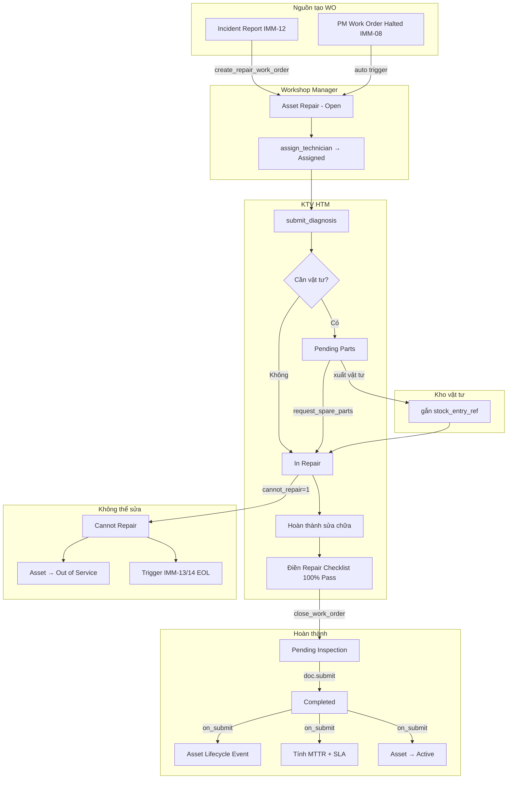
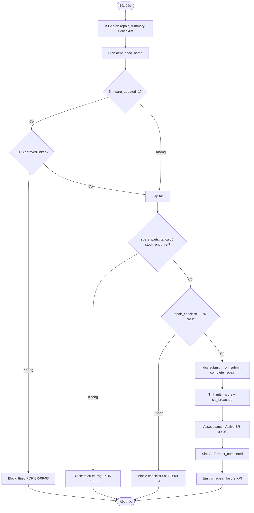
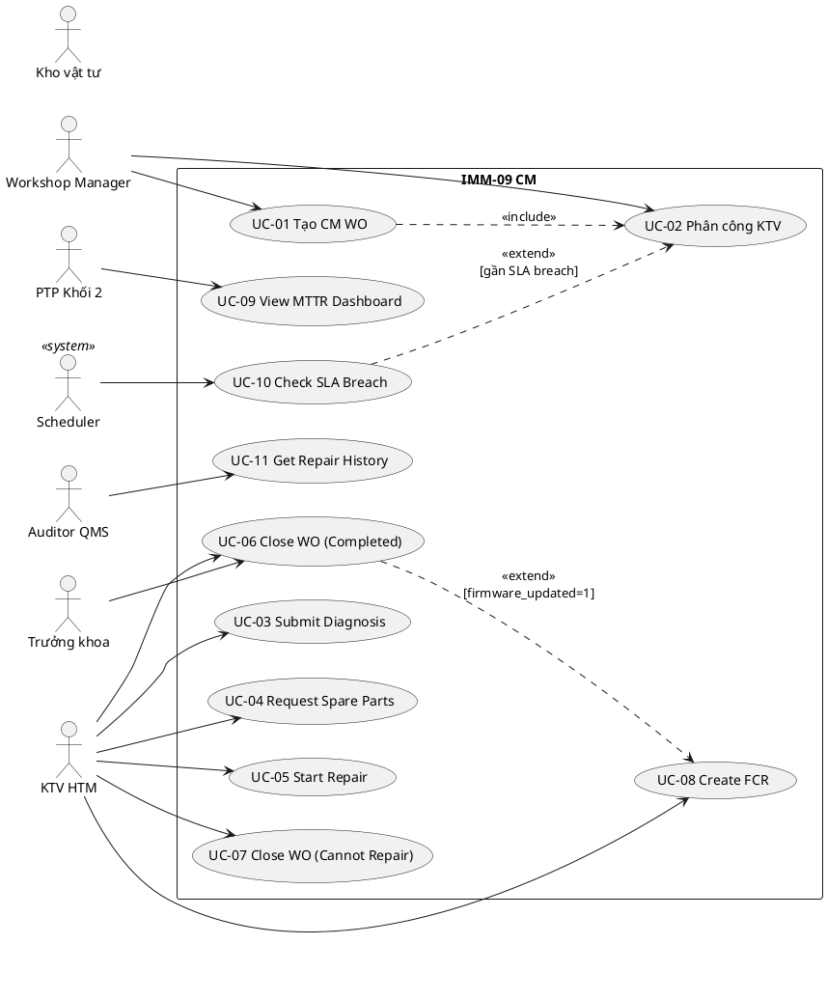
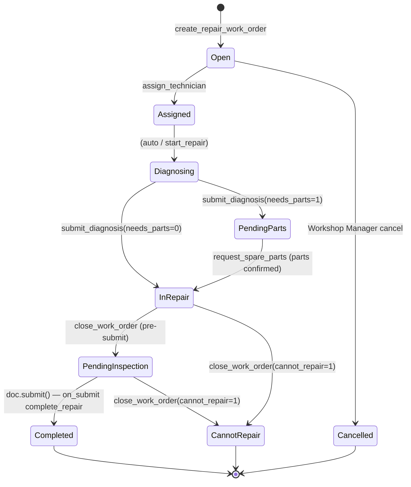

# 02 — Phân tích thiết kế nghiệp vụ — IMM-09 Sửa chữa (Corrective Maintenance)

| Mục               | Giá trị                                                                                                                                    |
| ------------------ | -------------------------------------------------------------------------------------------------------------------------------------------- |
| Module             | IMM-09 — Corrective Maintenance / Repair                                                                                                    |
| Phạm vi           | Per-module                                                                                                                                   |
| Owner              | BA + System Analyst                                                                                                                          |
| Liên kết         | [03 Diagrams](./03_Diagrams.md) · [04 Backend](./04_Backend_Design.md) · [05 API](./05_API_Specification.md) · [06 Frontend](./06_Frontend_Design.md) |
| Chuẩn tham chiếu | WHO HTM 2025 §5.4, ISO 13485:2016 §7.5, ISO 9001:2015 §8.5.1, NĐ 98/2021                                                                 |
| Cập nhật          | 2026-05-14                                                                                                                                   |

---

# Phần I — Module Overview

## I.1. Pitch

Khi thiết bị y tế hỏng, bệnh viện hiện xử lý sửa chữa qua điện thoại/email không có hồ sơ chuẩn — không biết KTV nào đang xử lý, vật tư đã xuất chưa có chứng từ, không đo được MTTR. IMM-09 chuẩn hoá toàn bộ vòng đời sửa chữa: tiếp nhận từ Incident Report hoặc PM Halted, phân công KTV, chẩn đoán, xuất vật tư có chứng từ kế toán, nghiệm thu 100% Pass, đo MTTR theo SLA risk class. Mục tiêu: MTTR Class III Emergency ≤ 4 giờ, SLA compliance ≥ 90%.

## I.2. Vị trí trong WHO HTM lifecycle

| Phase                 | Chạm?             | Ghi chú                                                  |
| --------------------- | ------------------ | --------------------------------------------------------- |
| Needs                 | —                 | —                                                        |
| Procurement           | —                 | —                                                        |
| Install               | —                 | —                                                        |
| Operation             | ✅                 | Asset status transition: Active → Under Repair → Active |
| **Maintenance** | ✅**chính** | CM Work Order, Checklist, Lifecycle Event                 |
| Decommission          | ✅                 | Cannot Repair → Out of Service → trigger IMM-13/14 EOL  |

Input: Incident Report (IMM-12) hoặc PM Work Order Halted (IMM-08).
Output: Asset Repair record (immutable sau submit), Asset Lifecycle Event, MTTR metrics, trigger IMM-11 (Calibration) hoặc IMM-12 (CAPA).

## I.3. Stakeholders & Actors

| Vai trò             | Người dùng thực  | Quan tâm chính                                                 | Tần suất | Loại              |
| -------------------- | -------------------- | ---------------------------------------------------------------- | ---------- | ------------------ |
| Workshop Manager     | Quản lý xưởng KT | Phân công, SLA breach, approve FCR                             | Daily      | Primary            |
| KTV HTM              | Kỹ thuật viên HTM | WO được gán, diagnosis, parts, checklist                     | Daily      | Primary            |
| Kho vật tư         | Thủ kho             | Xuất vật tư, gắn stock_entry_ref                             | Per WO     | Secondary          |
| Trưởng khoa phòng | Trưởng khoa        | Nghiệm thu, ký xác nhận bàn giao                            | Per WO     | Secondary          |
| PTP Khối 2          | Phó Trưởng phòng | MTTR KPI, SLA compliance dashboard                               | Weekly     | Approver           |
| CMMS Admin           | IT / QMS Admin       | Cấu hình, scheduler, audit                                     | Ad-hoc     | Secondary          |
| CMMS Auto            | Frappe Scheduler     | Tự động: SLA breach check hourly, overdue daily, MTTR monthly | Auto       | Secondary (system) |
| Auditor QMS          | QMS Officer          | Hồ sơ immutable, traceability, CAPA link                       | Monthly    | Auditor            |

## I.4. Scope

**In-scope:**

- 4 DocTypes: Asset Repair (submittable), Spare Parts Used (child), Repair Checklist (child), Firmware Change Request (submittable)
- State machine 9 trạng thái: Open → Completed / Cannot Repair / Cancelled
- 7 Business Rules (BR-09-01 → BR-09-07)
- Tính MTTR + SLA matrix theo `risk_class × priority`
- 12 REST endpoints
- 7 FE views Vue 3 + store imm09.ts
- Scheduler: hourly SLA breach, daily overdue, monthly MTTR rollup
- Tích hợp: IMM-08 (PM Halted → CM), IMM-11 (post-repair Cal), IMM-12 (CAPA repeat failure)

**Out-of-scope:**

- Procurement vật tư khẩn cấp (Inventory/Procurement module)
- Vendor Service Order gửi thiết bị ra ngoài (IMM-09.1 phase sau)
- Mobile native app (web responsive đủ Wave 1)
- Predictive maintenance AI (roadmap dài hạn)

**Assumptions:**

- Incident Report (IMM-12) và PM Work Order (IMM-08) đã tồn tại trước khi tạo CM WO
- Stock Entry trong ERPNext đã được kho xuất trước khi gắn `stock_entry_ref`

**Dependencies:**

- IMM-00 Foundation: `transition_asset_status()`, `create_lifecycle_event()`, AC Asset
- IMM-08: `source_pm_wo` — auto tạo CM WO khi PM Halted
- IMM-12: `incident_report` — nguồn tạo CM WO
- ERPNext Stock: `Stock Entry` — chứng từ xuất vật tư (BR-09-02)

## I.5. KPI mục tiêu

| KPI                      | Định nghĩa                              | Baseline           | Target        | Đo ở đâu        |
| ------------------------ | ------------------------------------------ | ------------------ | ------------- | ------------------- |
| MTTR Class III Emergency | Calendar hours từ open → complete        | ~12h (ước tính) | ≤ 4 h        | `get_mttr_report` |
| SLA Compliance           | % WO complete trước `sla_target_hours` | N/A                | ≥ 90%        | `get_repair_kpis` |
| First-Time Fix Rate      | % WO không phải `is_repeat_failure`    | N/A                | ≥ 85%        | `get_mttr_report` |
| Open Backlog             | Số WO chưa đóng                        | N/A                | ≤ 15 WO/site | Dashboard           |
| Repeat Failure Rate      | % WO `is_repeat_failure=1` trong tháng  | N/A                | ≤ 10%        | `get_repair_kpis` |

## I.6. Ràng buộc Compliance

| Quy định           | Yêu cầu áp lên module                            | Doc tham chiếu     |
| -------------------- | ---------------------------------------------------- | ------------------- |
| NĐ 98/2021          | Hồ sơ sửa chữa ≥ 5 năm, truy xuất nguồn gốc | Điều 28–31       |
| WHO HTM 2025 §5.4   | CM WO bắt buộc cho mọi sửa chữa, traceability   | CMMS §3.2.3        |
| ISO 13485:2016 §7.5 | Spare parts có chứng từ, acceptance test          | 7.5.3, 7.5.5, 8.2.4 |
| WHO HTM 2025 §7.2   | Firmware change control (FCR)                        | §7.2               |
| ISO 9001 §10.2      | Repeat failure → CAPA                               | §10.2              |

## I.7. Risk & Open questions

| Risk                                              | Likelihood | Impact | Giảm thiểu                                          |
| ------------------------------------------------- | ---------- | ------ | ----------------------------------------------------- |
| Duplicate active WO cho cùng asset               | Medium     | High   | `validate_asset_not_under_repair` before_insert     |
| Spare parts thiếu chứng từ → block submit     | Medium     | High   | VR-09-05 + UI nhắc nhở sớm                         |
| `ignore_permissions=True` trong service         | High       | Medium | Production review: enable đầy đủ permission check |
| MTTR tính calendar time (không loại ngày lễ) | Medium     | Low    | Backlog: implement `get_working_hours_between`      |

| Open question                                                                   | Owner     | Deadline |
| ------------------------------------------------------------------------------- | --------- | -------- |
| Search spare parts endpoint chính thức (hiện FE gọi frappe.client.get_list) | BE Lead   | Sprint 9 |
| FCR create/approve endpoints                                                    | BE Lead   | Sprint 9 |
| MTTR theo working hours (Mon–Fri 07:00–17:00)                                 | Tech Lead | v2.1     |

## I.8. Roadmap thực thi

| Sprint   | Hạng mục                                  | Owner   | Status         |
| -------- | ------------------------------------------- | ------- | -------------- |
| Sprint 1 | DocType Asset Repair + 2 child + FCR        | BE Lead | ✅ Done        |
| Sprint 2 | Service layer 13 functions + SLA matrix     | BE Lead | ✅ Done        |
| Sprint 3 | API layer 12 endpoints                      | BE Lead | ✅ Done        |
| Sprint 4 | Scheduler hourly/daily/monthly              | BE Lead | ✅ Done        |
| Sprint 5 | FE 7 views + Pinia store                    | FE Lead | ✅ Done        |
| Sprint 6 | UAT 8 scenarios Gherkin + bug fix           | QA      | ✅ Done        |
| Sprint 7 | Docs 07_Testing, 08_Deployment, 09_Release  | BA      | ✅ Done        |
| Sprint 8 | Docs 02–06 template chuẩn                 | BA      | 🔄 In Progress |
| Sprint 9 | search_spare_parts endpoint + FCR endpoints | BE Lead | ⏳ Planned     |

---

# Phần II — Quy trình nghiệp vụ (BPMN)

## II.2. As-Is process

Bệnh viện nhận báo hỏng qua điện thoại → Workshop Manager ghi sổ hoặc email → KTV đến sửa → ghi kết quả tự do trên phiếu giấy. Không có SLA tracking, không rõ vật tư xuất từ đâu, không có nghiệm thu tiêu chuẩn.

## II.3. Pain points

| # | Pain                                                                         | Tác động                                               |
| - | ---------------------------------------------------------------------------- | --------------------------------------------------------- |
| 1 | Không có nguồn bắt buộc → sửa chữa không rõ lý do                 | Không audit-ready, vi phạm WHO HTM                      |
| 2 | Vật tư xuất không có chứng từ kế toán                               | Kiểm toán viên không reconcile được                |
| 3 | Không đo MTTR → không biết workshop có đang tốt không               | KPI trống, không cải tiến được                     |
| 4 | Firmware thay đổi không có change control                                | Rủi ro an toàn thiết bị y tế, vi phạm WHO HTM §7.2 |
| 5 | Không phát hiện tái hỏng → thiết bị hỏng mãn tính không có CAPA | Chi phí sửa chữa tăng                                 |

## II.4. To-Be process

## II.5. Decision points

| Điểm        | Câu hỏi                               | Quy tắc                                            |
| ------------- | --------------------------------------- | --------------------------------------------------- |
| Tạo WO       | Có IR hoặc source_pm_wo?              | Không → block (BR-09-01)                          |
| Tạo WO       | Asset đã có WO active?               | Có → block (BR-09-05)                             |
| Submit        | Spare parts có stock_entry_ref?        | Không → block (BR-09-02)                          |
| Submit        | Firmware_updated=1 có FCR Approved?    | Không → block (BR-09-03)                          |
| Submit        | Checklist 100% Pass?                    | Không → block (BR-09-04)                          |
| Close         | Cannot repair?                          | Có → Asset Out of Service; Không → Asset Active |
| Before_insert | WO hoàn thành trong 30 ngày trước? | Có → is_repeat_failure=1                          |

## II.6. Process metrics

Theo WHO HTM (chương *Computerized Maintenance Management Systems* — đo hiệu quả corrective maintenance qua MTTR, SLA compliance, repeat failure rate, audit-readiness).

| Metric                       | Mục tiêu                                | Đo ở đâu                                          |
| ---------------------------- | ----------------------------------------- | --------------------------------------------------- |
| MTTR (Mean Time To Repair)   | ≤ 24h class B; ≤ 48h class C *(Cần khảo sát baseline)* | `Asset Repair.mttr_hours` aggregate theo asset_class |
| Time-to-assignment           | ≤ 2h kể từ tạo WO                     | `assigned_to` set time − `created` time             |
| % SLA compliance             | ≥ 90% *(Cần khảo sát baseline)*       | `sla_breached=0` / total Completed WO trong kỳ    |
| Repeat failure rate (30d)    | ≤ 5%                                     | `is_repeat_failure=1` / total Completed WO          |
| Spare parts traceability     | 100% có `stock_entry_ref`               | BR-09-02 violation count = 0                        |
| Audit-readiness              | 100% WO Completed có ALE đầy đủ      | ALE `repair_completed` count = WO Completed count   |
| FCR coverage (firmware)      | 100% `firmware_updated=1` có FCR Approved | BR-09-03 violation count = 0                       |

## II.7. RACI matrix

| Hoạt động           | Workshop Manager | KTV HTM | Kho vật tư | Trưởng khoa | PTP Khối 2 | System |
| ---------------------- | ---------------- | ------- | ------------ | ------------- | ----------- | ------ |
| Tạo WO                | R/A              | —      | —           | —            | I           | —     |
| Phân công KTV        | R/A              | I       | —           | —            | —          | —     |
| Diagnosis              | C/I              | R/A     | —           | —            | —          | —     |
| Request vật tư       | C                | R       | A            | —            | —          | —     |
| Xuất vật tư         | C                | R       | R/A          | —            | —          | —     |
| Sửa chữa + checklist | C/I              | R/A     | —           | C             | —          | —     |
| Nghiệm thu (ký)      | C                | R       | —           | R/A           | —          | —     |
| Submit WO              | A                | R       | —           | —            | —          | —     |
| SLA check              | I                | I       | —           | —            | R/A         | —     |
| MTTR rollup            | I                | I       | —           | —            | A           | R      |

## II.8. Exception flow

**E1 — Cannot Repair:**
KTV xác nhận không sửa được → `close_work_order(cannot_repair=1)` → Asset Out of Service → sinh ALE `cannot_repair` → Workshop Manager đề xuất mở EOL (IMM-13/14 manual review).

**E2 — Firmware update cần change control:**
KTV check `firmware_updated=1` → FE tự động hiển thị form tạo FCR → Workshop Manager duyệt FCR → `firmware_change_request` field gắn FCR Approved → submit WO tiếp tục.

**E3 — Repeat failure phát hiện:**
`before_insert` phát hiện WO Completed trong 30 ngày → `is_repeat_failure=1` → FE hiển thị banner "Tái hỏng — gợi ý mở CAPA" → sau close WO, Workshop Manager có thể tạo CAPA (IMM-12).

## II.9. So sánh As-Is vs To-Be

| Khía cạnh                   | As-Is (chưa có hệ thống)                          | To-Be (AssetCore IMM-09)                                                       |
| --------------------------- | ---------------------------------------------------- | -------------------------------------------------------------------------------- |
| Tạo CM WO                  | Sổ giấy / Excel ad-hoc, không bắt buộc nguồn  | DocType `Asset Repair` bắt buộc `incident_report` HOẶC `source_pm_wo` (BR-09-01) |
| Phân công KTV             | Trưởng xưởng gọi điện thoại                  | Workflow `Assigned`, lưu `assigned_to`, audit timestamp                       |
| Theo dõi vật tư         | Chứng từ kho rời, khó đối soát                | Child table `spare_parts` với `stock_entry_ref` (BR-09-02)                     |
| Firmware update             | Không kiểm soát, không link change control    | `firmware_updated=1` ⇒ bắt buộc FCR Approved (BR-09-03)                       |
| Checklist nghiệm thu     | Tự do / không có                                | Child table `repair_checklist` 100% Pass mới Submit (BR-09-04)                |
| MTTR                        | Tính tay, không tin cậy                          | Tự động `mttr_hours = time_to_complete_hours`                                |
| SLA breach                  | Không phát hiện được                             | Scheduler `check_sla_breach` set `sla_breached=1`                                |
| Repeat failure              | Không phát hiện                                   | `before_insert` quét 30 ngày, set `is_repeat_failure=1`                        |
| Asset status                | Không cập nhật / cập nhật trễ                  | `on_submit` ⇒ Asset Active hoặc Out of Service (cannot_repair)                  |
| Audit trail                 | Mất dấu, không truy xuất sau 6 tháng         | Asset Lifecycle Event + immutable submit (docstatus=1)                           |
| Báo cáo MTTR / SLA         | Excel rollup tay                                    | Dashboard truy về `Asset Repair` source                                         |
| Tuân thủ NĐ98 / WHO HTM   | Khó chứng minh khi audit                         | Trace 100% qua ALE + spare parts + FCR + checklist                               |

## II.10. Activity diagram — UC close_work_order (Completed mode)

---

# Phần III — Use Case Specification

## III.1. Use Case Diagram (tổng quát)

## III.2. Actor catalog

| Actor                | Loại     | Mô tả                      | Goal chính                                    |
| -------------------- | --------- | ---------------------------- | ---------------------------------------------- |
| Workshop Manager     | Primary   | Quản lý xưởng kỹ thuật | SLA compliance, phân bổ nhân lực           |
| KTV HTM              | Primary   | Kỹ thuật viên sửa chữa  | Sửa đúng kỹ thuật, có hồ sơ đầy đủ |
| Kho vật tư         | Secondary | Thủ kho                     | Xuất vật tư có chứng từ                  |
| Trưởng khoa phòng | Secondary | Người dùng thiết bị     | Nhận lại thiết bị an toàn                 |
| PTP Khối 2          | Approver  | Giám sát KPI               | MTTR avg, SLA compliance report                |
| Scheduler            | System    | Frappe scheduler             | SLA breach, overdue, MTTR rollup               |
| Auditor QMS          | Auditor   | QMS Officer                  | Traceability, immutable records                |

## III.3. Use Case Specifications

### UC-06: Close Work Order (Completed)

| Mục           | Giá trị                                                                            |
| -------------- | ------------------------------------------------------------------------------------ |
| ID             | UC-IMM09-06                                                                          |
| Brief          | KTV và Trưởng khoa hoàn thành nghiệm thu và đóng WO                         |
| Primary actor  | KTV HTM                                                                              |
| Pre-condition  | WO ở In Repair / Pending Inspection; checklist đã điền; vật tư có chứng từ |
| Post-condition | WO Completed, docstatus=1; Asset Active; ALE repair_completed; MTTR tính xong       |
| Trigger        | KTV xác nhận sửa chữa hoàn thành                                               |

#### Main flow

| Bước | Actor                                           | System                                        |
| ------ | ----------------------------------------------- | --------------------------------------------- |
| 1      | KTV điền repair_summary + root_cause_category | —                                            |
| 2      | KTV điền checklist results (tất cả Pass)    | Validate BR-09-04                             |
| 3      | Trưởng khoa ký dept_head_name                | —                                            |
| 4      | KTV click "Hoàn thành sửa chữa"             | Gọi POST close_work_order                    |
| 5      | —                                              | Validate BR-09-02 (spare parts stock_entry)   |
| 6      | —                                              | Validate BR-09-03 (FCR nếu firmware_updated) |
| 7      | —                                              | doc.submit() → on_submit complete_repair()   |
| 8      | —                                              | Tính mttr_hours, sla_breached                |
| 9      | —                                              | Asset.status = Active                         |
| 10     | —                                              | Sinh ALE repair_completed                     |
| 11     | —                                              | Return {status, mttr_hours, sla_breached}     |

#### Alternative A1 — Cannot Repair

- 4a. KTV chọn "Không thể sửa" → gọi `close_work_order(cannot_repair=1)`
- 4b. Asset.status = Out of Service; ALE cannot_repair; WO = Cannot Repair

#### Exception E1 — Checklist có Fail

- 5a. Validate BR-09-04 fail → error "Mục kiểm tra #{idx} chưa Pass"
- 5b. KTV sửa lại checklist rồi thử lại

#### Special requirements

- `is_repeat_failure` đã set at before_insert — không thay đổi
- Asset Repair record sau submit KHÔNG thể sửa / xóa (submittable)

## III.4. Use Case relationships

**`<<include>>`** — caller bắt buộc gọi callee:

| Caller                       | Callee                                  | Lý do                                                            |
| ---------------------------- | --------------------------------------- | ----------------------------------------------------------------- |
| UC-01 Tạo CM WO             | UC-Validate Source (BR-09-01)           | Mọi WO phải có IR hoặc source_pm_wo                          |
| UC-04 Request Spare Parts    | UC-Validate Stock Entry (BR-09-02)      | Mỗi spare part phải có stock_entry_ref khi submit            |
| UC-06 Close WO (Completed)   | UC-Validate Checklist (BR-09-04)        | 100% Pass mới Submit                                            |
| UC-06 Close WO (Completed)   | UC-Compute MTTR & SLA                   | Auto sinh metric mttr_hours + sla_breached                       |
| UC-06 Close WO (Completed)   | UC-Update Asset Status                  | Asset.status = Active                                             |
| UC-06 Close WO (Completed)   | UC-Emit ALE repair_completed            | Audit trail bắt buộc                                            |
| UC-07 Cannot Repair          | UC-Update Asset Status                  | Asset.status = Out of Service                                     |
| UC-07 Cannot Repair          | UC-Emit ALE cannot_repair               | Trigger EOL review (IMM-13/14 manual)                             |

**`<<extend>>`** — chạy khi điều kiện đúng:

| Base UC                      | Extension UC                            | Điều kiện                                                       |
| ---------------------------- | --------------------------------------- | ----------------------------------------------------------------- |
| UC-01 Tạo CM WO             | UC-Mark Repeat Failure                  | `before_insert` phát hiện WO Completed cho asset trong 30 ngày |
| UC-06 Close WO               | UC-Validate FCR (BR-09-03)              | `firmware_updated=1` ⇒ bắt buộc FCR Approved linked            |
| UC-09 MTTR Dashboard         | UC-Alert High MTTR                      | Khi MTTR avg vượt threshold theo asset_class                    |
| UC-Scheduler SLA Check       | UC-Notify Workshop Manager              | Khi `sla_breached=1` lần đầu                                   |

## III.5. UC ↔ User Story mapping

| Use Case                  | US ID              | Note                            |
| ------------------------- | ------------------ | ------------------------------- |
| UC-01 Tạo CM WO          | US-09-01           | Tạo WO bắt buộc nguồn       |
| UC-02 Phân công         | US-09-02           | Phân công KTV                 |
| UC-03 Submit Diagnosis    | US-09-03           | Ghi chẩn đoán                |
| UC-04 Request Spare Parts | US-09-04, US-09-05 | Yêu cầu + xác nhận vật tư |
| UC-06 Close WO            | US-09-07, US-09-08 | Checklist + nghiệm thu         |
| UC-07 Cannot Repair       | US-09-09           | EOL trigger                     |
| UC-09 MTTR Dashboard      | US-09-10, US-09-11 | KPI report                      |

---

# Phần IV — Functional Specifications

## IV.1. User Stories & Acceptance Criteria

### US-09-01 — Tạo CM WO bắt buộc có nguồn

Là **Workshop Manager**, tôi muốn **tạo CM Work Order bắt buộc có nguồn (IR hoặc PM WO)**, để **mọi sửa chữa truy xuất được lý do**.

Priority: Must | Estimate: 5SP

**AC-1 — Thiếu nguồn → block:**

- Given Workshop Manager đăng nhập
- When POST create_repair_work_order với incident_report="" và source_pm_wo=""
- Then response.success=false; response.error contains "Phải có nguồn sửa chữa"

**AC-2 — Tạo WO thành công:**

- Given Incident Report IR-2026-00123 đã submitted; asset=AC-ASSET-2026-00042 (Class III)
- When POST create_repair_work_order với incident_report="IR-2026-00123", priority="Urgent"
- Then response.data.name khớp `^WO-CM-2026-\d{5}$`; sla_target_hours=24.0; Asset.status="Under Repair"

### US-09-07 — Checklist 100% Pass trước khi Complete

Là **KTV HTM**, tôi muốn **hệ thống chỉ cho Submit khi Repair Checklist 100% Pass**, để **đảm bảo an toàn trước khi trả thiết bị**.

Priority: Must | Estimate: 5SP

**AC-1 — Checklist có Fail → block:**

- Given repair_checklist gồm 5 row, 4 Pass + 1 Fail
- When close_work_order
- Then error "Mục kiểm tra #3 '...' chưa Pass — không thể hoàn thành"

**AC-2 — Happy path:**

- Given tất cả checklist Pass, dept_head_name điền, spare parts có stock_entry_ref
- When close_work_order
- Then WO Completed, mttr_hours set, sla_breached computed, Asset Active

## IV.2. Business Rules

| ID       | Rule                                                                     | Implement ở                                           | Liên kết test   |
| -------- | ------------------------------------------------------------------------ | ------------------------------------------------------ | ----------------- |
| BR-09-01 | WO bắt buộc `incident_report` OR `source_pm_wo`                    | `validate_repair_source()` before_insert             | Scenario 9.1      |
| BR-09-02 | Spare parts row phải có `stock_entry_ref` hợp lệ                   | `validate_spare_parts_stock_entries()` before_submit | Scenario 9.2      |
| BR-09-03 | `firmware_updated=1` → FCR Approved linked                            | `validate_firmware_change_request()` before_submit   | Scenario 9.3      |
| BR-09-04 | Repair Checklist đầy đủ + 100% Pass trước Submit                   | `validate_repair_checklist_complete()` before_submit | Scenario 9.4      |
| BR-09-05 | Asset Under Repair khi open; Active khi Completed; OOS khi Cannot Repair | `set_asset_under_repair()` + `complete_repair()`   | Scenario 9.5, 9.6 |
| BR-09-06 | WO trong 30 ngày →`is_repeat_failure=1`                              | `check_repeat_failure()` before_insert               | Scenario 9.7      |
| BR-09-07 | MTTR > SLA target →`sla_breached=1`                                   | `complete_repair()` + `check_repair_sla_breach()`  | Scenario 9.5      |

## IV.3. State Machine

| State              | Mô tả                              | docstatus | Actor                   |
| ------------------ | ------------------------------------ | --------- | ----------------------- |
| Open               | WO vừa tạo, chờ phân công       | 0         | Workshop Manager / Auto |
| Assigned           | KTV được gán, Asset Under Repair | 0         | Workshop Manager        |
| Diagnosing         | KTV đang chẩn đoán               | 0         | KTV HTM                 |
| Pending Parts      | Chờ kho xuất vật tư              | 0         | KTV / Kho               |
| In Repair          | Đang sửa chữa                     | 0         | KTV HTM                 |
| Pending Inspection | Sửa xong, chờ nghiệm thu          | 0         | KTV HTM                 |
| Completed          | Nghiệm thu pass, Asset Active       | 1         | KTV + Trưởng khoa     |
| Cannot Repair      | Không sửa được, Asset OOS       | 0         | Workshop Manager        |
| Cancelled          | Hủy WO                              | 0         | Workshop Manager        |

## IV.4. Input — Output

**Input fields với cascade:**

- `asset_ref` chọn → auto-fill `risk_class`, `serial_no`, `asset_category`
- `incident_report` HOẶC `source_pm_wo` → at least 1 required (BR-09-01)
- `priority` + `risk_class` → cascade auto-fill `sla_target_hours` qua `get_sla_target()`
- `firmware_updated=1` → field `firmware_change_request` becomes required (BR-09-03)

**Output records:**

- Asset Repair (submittable, immutable sau docstatus=1)
- Asset Lifecycle Event (immutable, mọi transition)
- Asset.status transition

**SLA Matrix:**

| Risk Class \ Priority | Emergency     | Urgent | Normal |
| --------------------- | ------------- | ------ | ------ |
| Class III             | **4 h** | 24 h   | 120 h  |
| Class II              | 8 h           | 48 h   | 72 h   |
| Class I               | 24 h          | 72 h   | 480 h  |

## IV.5. Edge cases & Errors

| ID      | Edge case                                                             | Hành vi     | Error code                 |
| ------- | --------------------------------------------------------------------- | ------------ | -------------------------- |
| E-09-01 | WO không có IR và source_pm_wo                                     | Block insert | `BUSINESS_RULE` (CM-001) |
| E-09-02 | Asset đã có WO active                                              | Block insert | `CONFLICT` (CM-002)      |
| E-09-03 | Stock entry ref không tồn tại trong DB                             | Block submit | `VALIDATION` (CM-004)    |
| E-09-04 | FCR status=Pending Approval khi submit firmware_updated=1             | Block submit | `VALIDATION` (CM-006)    |
| E-09-05 | Checklist có row result=Fail                                         | Block submit | `VALIDATION` (CM-008)    |
| E-09-06 | close_work_order khi status không phải In Repair/Pending Inspection | Block        | `BAD_STATE` (CM-012)     |
| E-09-07 | dept_head_name rỗng khi Completed mode                               | Block        | `VALIDATION` (CM-013)    |

---

# Phần V — Yêu cầu phi chức năng

## V.1. Hiệu năng

| Metric                                                | Target                       | Đo ở đâu |
| ----------------------------------------------------- | ---------------------------- | ------------ |
| `list_repair_work_orders` P95 (≤100k records)      | < 300 ms                     | NFR-09-01    |
| `get_repair_work_order` + asset_info enrichment P95 | < 500 ms                     | NFR-09-02    |
| `search_spare_parts` (10k items) P95                | < 800 ms                     | NFR-09-03    |
| SLA alert latency                                     | ≤ 1 giờ (scheduler hourly) | NFR-09-05    |
| Realtime `cm_sla_breached`                          | < 5 giây                    | NFR-09-06    |

## V.2. Bảo mật

- Authentication: Frappe session + API token
- RBAC: Workshop Manager / HTM Technician / Kho vật tư / Trưởng khoa / PTP / CMMS Admin
- Permission Query: HTM Technician chỉ thấy WO `assigned_to = session.user`
- Submittable lock: sau Submit không sửa/xóa
- Audit trail: Asset Lifecycle Event immutable + Frappe track_changes
- Review: `ignore_permissions=True` tạm thời trong service → production phải bật đầy đủ

## V.3. Khả dụng

| Metric                     | Target       |
| -------------------------- | ------------ |
| Uptime giờ làm việc     | ≥ 99.5%     |
| Scheduler hourly SLA check | 0 missed run |

## V.4. Khả mở rộng

- 100 concurrent users
- 100k WO / site với indexes composite `(asset_ref, status, completion_datetime)`
- Multi-site: codebase chung

## V.5. Khả dụng UX

- KTV thao tác trên tablet ≥ 768px
- Offline tolerance: form diagnosis + checklist hỗ trợ IndexedDB + sync on reconnect (NFR-09-12)
- Tiếng Việt primary

## V.6. Bảo trì

- Service coverage ≥ 85%
- `frappe.logger("imm09")` cho mọi mutation
- Linting ruff/black 100% pass

## V.7. Tuân thủ

- Asset Repair lưu ≥ 5 năm (NĐ98 Điều 28)
- Hồ sơ immutable sau submit (submittable DocType)
- Traceability nguồn: BR-09-01 enforce mọi WO có source
- Firmware change control: BR-09-03
- Acceptance test sau sửa chữa: BR-09-04

---

## DoD — File 02 hoàn chỉnh

### I. Module Overview

- [X] Pitch ≤ 5 câu
- [X] Lifecycle phase rõ
- [X] ≥ 1 Primary + 1 Auditor stakeholder
- [X] Scope In + Out + Assumption + Dependency
- [X] ≥ 3 KPI có số
- [X] Compliance NĐ98 + WHO HTM + ISO 13485

### II. Business Process

- [X] ≥ 3 pain point
- [X] To-Be swimlane ≥ 4 lane
- [X] Decision points có quy tắc
- [X] RACI đủ hoạt động
- [X] Activity diagram UC chính

### III. Use Case Spec

- [X] UC diagram tổng quát
- [X] Actor catalog ≥ 4
- [X] UC-06 spec đầy đủ

### IV. Functional Specs

- [X] 2 US có AC Given-When-Then
- [X] 7 Business Rules đánh số
- [X] State machine 9 states
- [X] SLA matrix
- [X] ≥ 5 edge case với error code

### V. NFR

- [X] 7 nhóm NFR với target số
- [X] Compliance NĐ98 + WHO HTM
