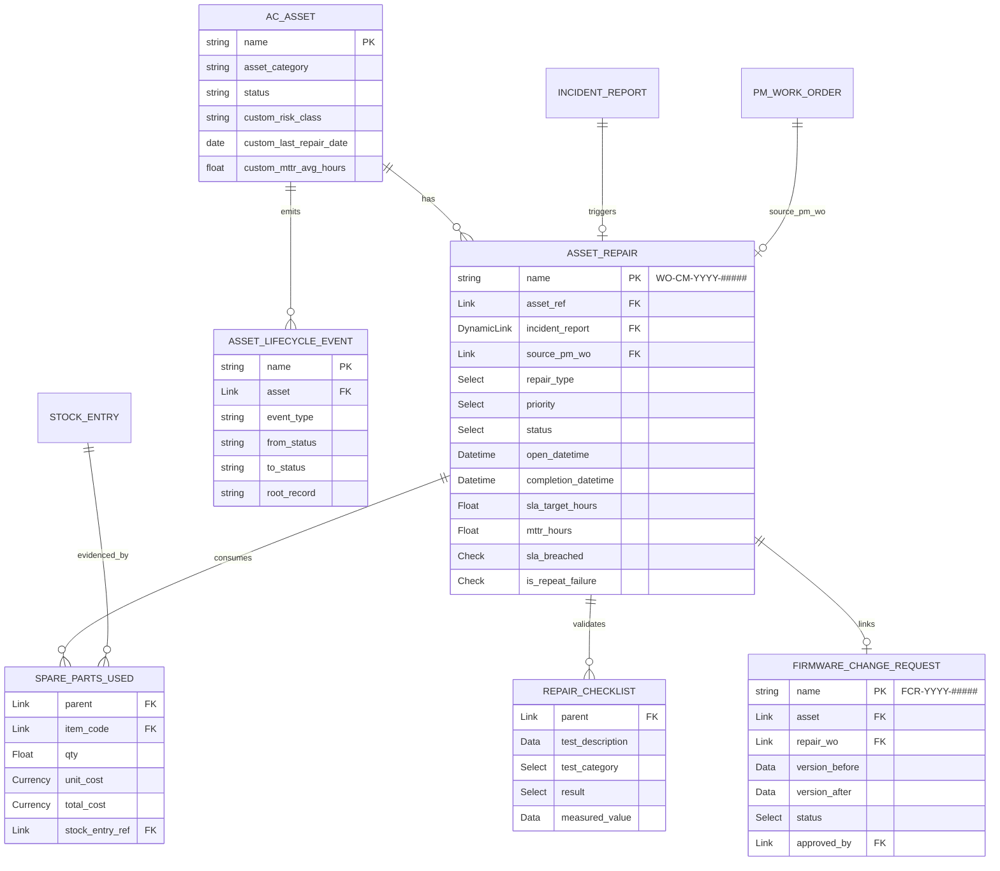
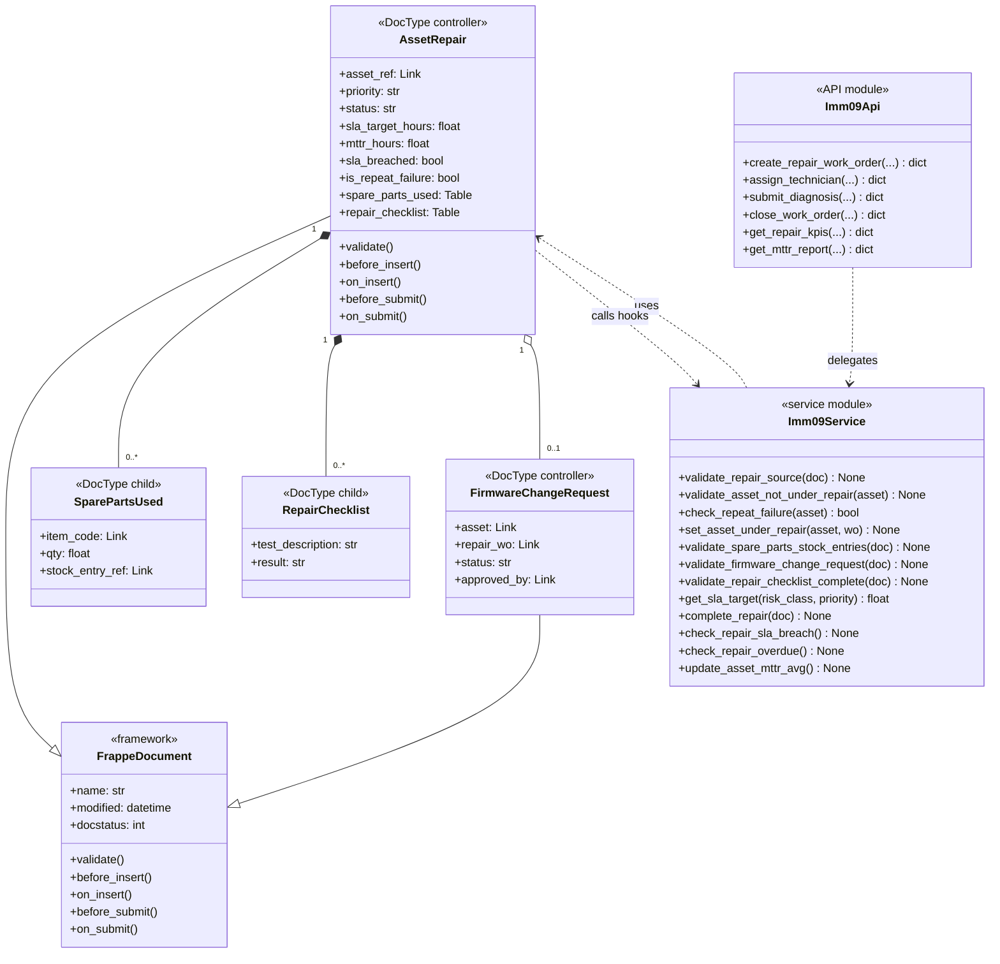
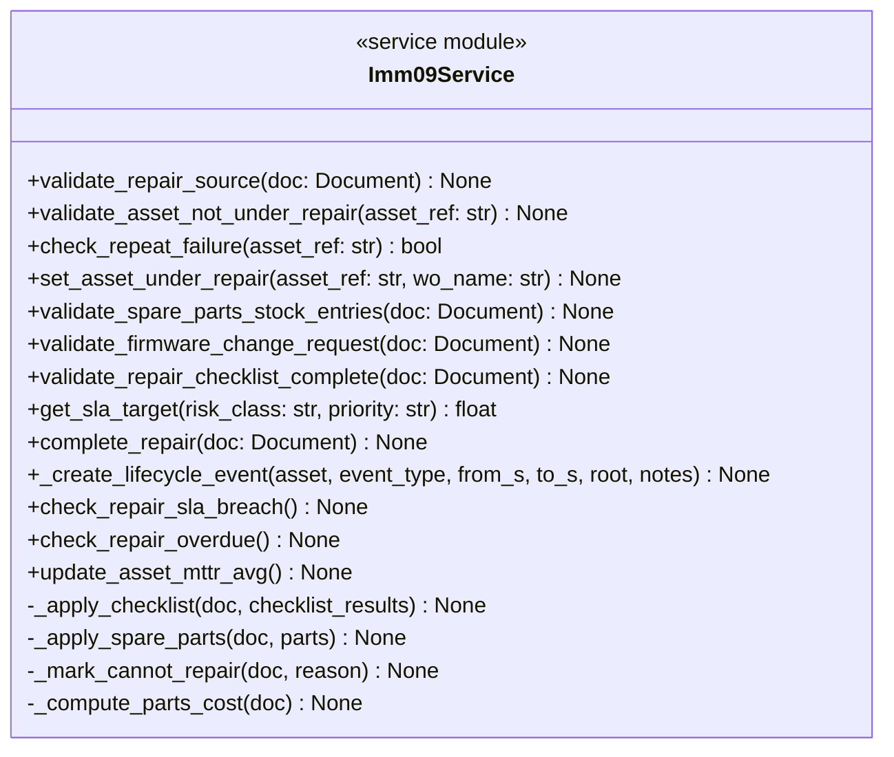
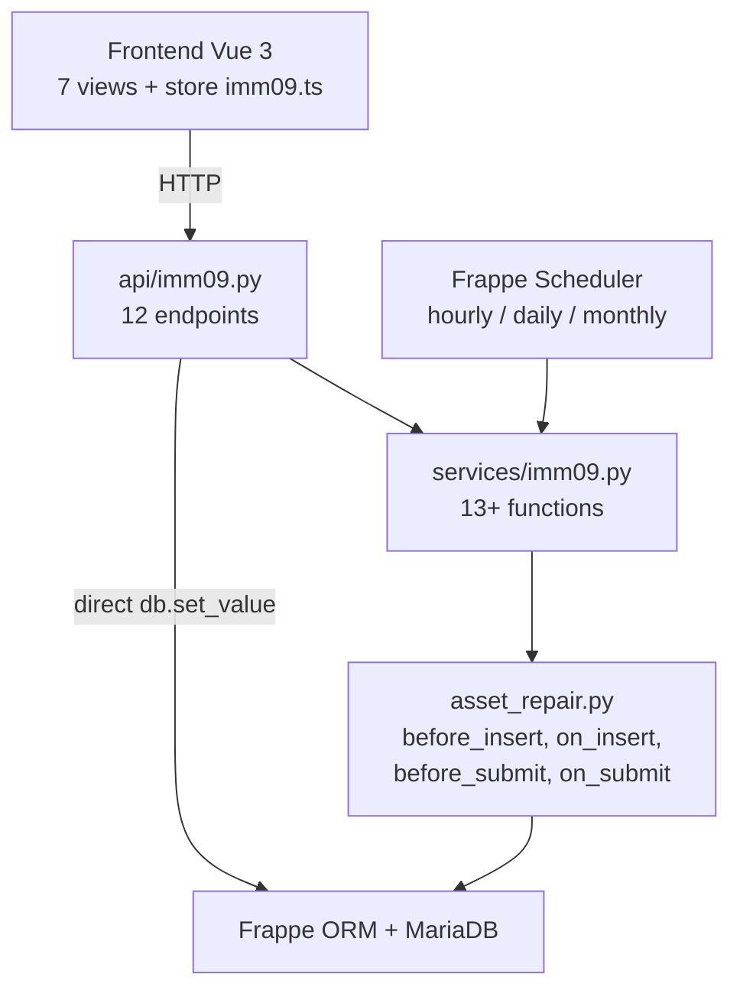
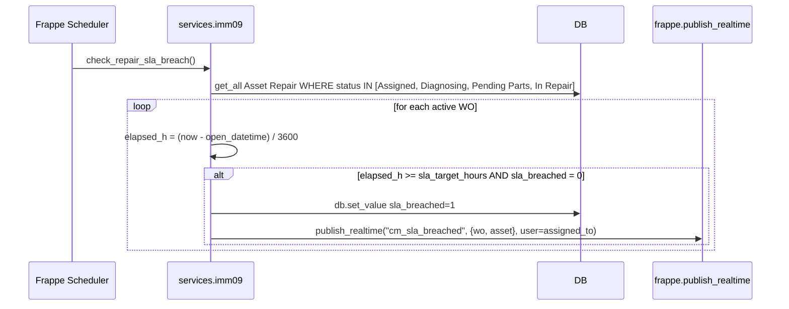
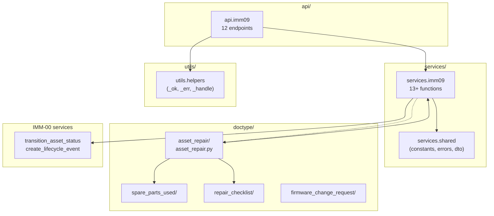
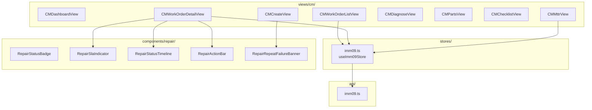
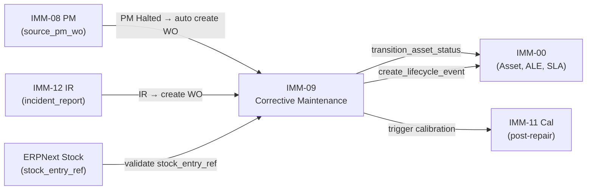

# 03 — Biểu đồ kỹ thuật — IMM-09 Sửa chữa (Corrective Maintenance)

| Mục | Giá trị |
|---|---|
| Module | IMM-09 |
| Phạm vi | Per-module |
| Owner | System Analyst / Tech Lead / DBA |
| Liên kết | [02 Analysis & Design](./02_Analysis_Design.md) · [04 Backend Design](./04_Backend_Design.md) |
| Cập nhật | 2026-05-14 |

---

# Phần I — Entity Relationship Diagram (ERD)

## I.1. ERD logic



## I.2. Cardinality

| Notation | Mermaid | Ý nghĩa |
|---|---|---|
| `||--||` | một – một | 1 đến 1 |
| `||--o{` | một – nhiều | 1 đến N (0 hoặc nhiều) |
| `}o--||` | nhiều – một | N đến 1 |
| `||--o|` | một – 0 hoặc 1 | optional 1 |

## I.3. Entity catalog

**Entities module sở hữu:**

| Entity | DocType file | Naming | Volume/năm |
|---|---|---|---|
| Asset Repair | `asset_repair/asset_repair.json` | `WO-CM-.YYYY.-.#####` | ~500 WO/site |
| Spare Parts Used | child của Asset Repair | autoname | ~3 rows/WO |
| Repair Checklist | child của Asset Repair | autoname | ~5 rows/WO |
| Firmware Change Request | `firmware_change_request/` | `FCR-.YYYY.-.#####` | ~50/năm |

**Entities tham chiếu cross-module:**

| Entity | Owner module | Vai trò |
|---|---|---|
| AC Asset | IMM-00 Foundation | Asset thực hiện sửa chữa |
| Asset Lifecycle Event | IMM-00 Foundation | Immutable event per transition |
| Incident Report | IMM-12 | Nguồn tạo WO |
| PM Work Order | IMM-08 | Nguồn PM Halted |
| Stock Entry | ERPNext | Chứng từ xuất vật tư |

## I.4. Data dictionary

### Bảng 1.1: Asset Repair

| Field | Type | Required | Default | PII | Validation | Mô tả |
|---|---|---|---|---|---|---|
| `name` | varchar(30) | ✓ | autoname | — | `WO-CM-.YYYY.-.#####` | PK |
| `asset_ref` | Link Asset | ✓ | — | — | must exist | FK |
| `incident_report` | Link IR | BR-09-01 | — | — | OR source_pm_wo | Nguồn |
| `source_pm_wo` | Link PM WO | BR-09-01 | — | — | OR incident_report | Nguồn |
| `repair_type` | Select | ✓ | Corrective | — | Corrective/Emergency/Warranty | Loại |
| `priority` | Select | ✓ | Normal | — | Normal/Urgent/Emergency | Ưu tiên |
| `status` | Select | ✓ | Open | — | 9 states | Trạng thái |
| `open_datetime` | Datetime | — | now() | — | read_only | Auto before_insert |
| `sla_target_hours` | Float | — | — | — | auto | Từ get_sla_target() |
| `mttr_hours` | Float | — | — | — | read_only | Auto on_submit |
| `sla_breached` | Check | — | 0 | — | read_only | auto |
| `is_repeat_failure` | Check | — | 0 | — | read_only | auto before_insert |
| `diagnosis_notes` | Text | — | — | — | — | KTV điền |
| `root_cause_category` | Select | — | — | — | 6 options | Nguyên nhân |
| `repair_summary` | Text | (close) | — | — | reqd khi Completed | — |
| `total_parts_cost` | Currency | — | — | — | auto | Σ spare_parts_used |
| `firmware_updated` | Check | — | 0 | — | — | Trigger BR-09-03 |
| `firmware_change_request` | Link FCR | BR-09-03 | — | — | reqd khi firmware_updated | — |
| `dept_head_name` | Data | (close) | — | ✓ | reqd khi Completed | Người nghiệm thu |
| `cannot_repair_reason` | Text | (cannot) | — | — | reqd Cannot Repair | — |

### Bảng 1.2: Spare Parts Used (child)

| Field | Type | Required | PII | Validation | Mô tả |
|---|---|---|---|---|---|
| `item_code` | Link Item | ✓ | — | must exist | Mã vật tư |
| `qty` | Float | ✓ | — | > 0 | Số lượng |
| `unit_cost` | Currency | ✓ | — | ≥ 0 | Đơn giá |
| `total_cost` | Currency | — | — | auto | qty × unit_cost |
| `stock_entry_ref` | Link Stock Entry | **BR-09-02** | — | must exist | Chứng từ xuất kho |

### Bảng 1.3: Repair Checklist (child)

| Field | Type | Required | Validation | Mô tả |
|---|---|---|---|---|
| `test_description` | Data | ✓ | — | Mô tả kiểm tra |
| `test_category` | Select | ✓ | 5 options | Nhóm kiểm tra |
| `result` | Select | ✓ (close) | Pass/Fail/N/A, must=Pass | Kết quả BR-09-04 |
| `measured_value` | Data | — | — | Giá trị đo |

### Bảng 1.4: Firmware Change Request

| Field | Type | Required | Validation | Mô tả |
|---|---|---|---|---|
| `name` | varchar | ✓ | `FCR-.YYYY.-.#####` | PK |
| `asset` | Link Asset | ✓ | must exist | FK |
| `repair_wo` | Link Asset Repair | ✓ | must exist | FK |
| `version_before` | Data | ✓ | — | Version cũ |
| `version_after` | Data | ✓ | — | Version mới |
| `status` | Select | ✓ | Draft/Pending/Approved/Applied/Rolled Back | Workflow state |
| `approved_by` | Link User | (Approve) | reqd on Approve | — |

## I.5. Constraints & indexes

**Unique:** Asset Repair naming tự unique theo series.

**Indexes:**

| Table | Index | Mục đích |
|---|---|---|
| `tabAsset Repair` | `asset_ref` (search_index) | History per asset |
| `tabAsset Repair` | `(status, docstatus)` composite | Scheduler filter active WO |
| `tabAsset Repair` | `open_datetime DESC` | Sort danh sách |
| `tabAsset Repair` | `(asset_ref, status, completion_datetime)` | check_repeat_failure lookup |
| `tabSpare Parts Used` | `parent` (default) + `stock_entry_ref` | Validate BR-09-02 |

## I.8. Volume & retention

| Entity | Volume/năm | Retention | Archive |
|---|---|---|---|
| Asset Repair | ~500 WO | ≥ 5 năm (NĐ98) | Archive sau 5 năm |
| Spare Parts Used | ~1500 rows | Cascade với WO | Same |
| Repair Checklist | ~2500 rows | Cascade với WO | Same |
| Asset Lifecycle Event | ~3000/năm | ≥ 5 năm | Permanent |
| Firmware Change Request | ~50/năm | ≥ 5 năm | Permanent |

---

# Phần II — Class Diagram

## II.1.a. Biểu đồ lớp tổng quát



## II.1.b. Biểu đồ lớp chi tiết — Imm09Service



## II.2. Layer mapping



---

# Phần III — Sequence Diagram

## III.3a. Sequence — create_repair_work_order (Happy path + errors)

```mermaid
sequenceDiagram
    actor WM as Workshop Manager
    participant Browser
    participant API as api.imm09
    participant SVC as services.imm09
    participant Doc as Asset Repair
    participant Asset
    participant ALE as Asset Lifecycle Event
    database DB

    WM->>Browser: click "Tạo phiếu sửa chữa"
    Browser->>API: POST create_repair_work_order {asset_ref, incident_report, priority}
    API->>SVC: validate_repair_source(doc)

    alt Thiếu cả IR và source_pm_wo
        SVC-->>API: ServiceError(BUSINESS_RULE, CM-001)
        API-->>Browser: {success:false, code:"BUSINESS_RULE"}
    else Asset đã có WO active
        SVC-->>API: ServiceError(CONFLICT, CM-002)
        API-->>Browser: {success:false, code:"CONFLICT"}
    else Happy path
        SVC->>SVC: check_repeat_failure(asset_ref) → set is_repeat_failure
        SVC->>SVC: get_sla_target(risk_class, priority) → sla_target_hours
        SVC->>Doc: insert {status:Open, open_datetime:now()}
        Doc->>DB: INSERT
        SVC->>Asset: db.set_value status=Under Repair
        SVC->>ALE: _create_lifecycle_event(repair_opened)
        ALE->>DB: INSERT (immutable)
        SVC-->>API: {name, status, sla_target_hours}
        API-->>Browser: {success:true, data:{name, status, sla_target_hours}}
    end
```

## III.3b. Sequence — close_work_order (Completed mode)

```mermaid
sequenceDiagram
    actor KTV
    participant Browser
    participant API as api.imm09
    participant SVC as services.imm09
    participant Doc as Asset Repair
    participant Asset
    participant ALE as Asset Lifecycle Event
    database DB

    KTV->>Browser: click "Hoàn thành sửa chữa"
    Browser->>API: POST close_work_order {name, checklist_results, repair_summary, dept_head_name}
    API->>Doc: frappe.get_doc
    Doc->>DB: SELECT

    API->>SVC: _apply_checklist(doc, results)
    API->>Doc: db_set status=Pending Inspection

    note over Doc: doc.submit() triggers controller hooks
    Doc->>SVC: before_submit: validate_spare_parts_stock_entries

    alt Spare parts thiếu stock_entry_ref
        SVC-->>API: ServiceError(VALIDATION, CM-003)
        API-->>Browser: {success:false, code:"VALIDATION"}
    else firmware_updated=1 FCR chưa Approved
        SVC-->>API: ServiceError(VALIDATION, CM-005)
        API-->>Browser: {success:false, code:"VALIDATION"}
    else Checklist có Fail
        SVC-->>API: ServiceError(VALIDATION, CM-007)
        API-->>Browser: {success:false, code:"VALIDATION"}
    else Happy path
        Doc->>SVC: on_submit: complete_repair(doc)
        SVC->>SVC: mttr_hours = (completion - open) / 3600
        SVC->>SVC: sla_breached = mttr > sla_target
        SVC->>Asset: db.set_value status=Active
        SVC->>ALE: _create_lifecycle_event(repair_completed, notes=MTTR)
        ALE->>DB: INSERT immutable
        SVC->>DB: COMMIT
        API-->>Browser: {success:true, data:{status:Completed, mttr_hours, sla_breached}}
    end
```

## III.3c. Sequence — Scheduler check_repair_sla_breach (Hourly)



---

# Phần IV — Communication Diagram

## IV.4. Communication — close_work_order (Completed)

```plantuml
@startuml
object "browser:VueSPA" as B
object ":Imm09Api" as API
object ":AssetRepairDoc" as DOC
object ":Imm09Service" as SVC
object ":Asset" as ASSET
object ":AssetLifecycleEvent" as ALE
database ":MariaDB" as DB

B    --> API  : 1: POST close_work_order
API  --> DOC  : 2: frappe.get_doc
DOC  --> DB   : 2.1: SELECT
API  --> SVC  : 3: _apply_checklist + _apply_spare_parts
SVC  --> DOC  : 3.1: update fields
DOC  --> DB   : 3.2: UPDATE
DOC  --> SVC  : 4: before_submit: validate_* BR-09-02/03/04
DOC  --> SVC  : 5: on_submit: complete_repair
SVC  --> SVC  : 5.1: compute mttr_hours, sla_breached
SVC  --> ASSET: 6: db.set_value status=Active
ASSET--> DB   : 6.1: UPDATE
SVC  --> ALE  : 7: _create_lifecycle_event(repair_completed)
ALE  --> DB   : 7.1: INSERT immutable
API  --> B    : 8: 200 {success, data:{status, mttr_hours}}
@enduml
```

---

# Phần V — Package / Dependency Diagram

## V.2. Backend package diagram



## V.3. Frontend package diagram



## V.4. Cross-module dependency



---

## DoD — File 03 hoàn chỉnh

### I. ERD
- [x] ERD Mermaid render
- [x] 4 entity sở hữu + cross-module catalog
- [x] Data dictionary 4 bảng riêng
- [x] Indexes DB liệt kê
- [x] Volume + retention

### II. Class Diagram
- [x] Diagram tổng quát 4 layer
- [x] Chi tiết Imm09Service
- [x] Stereotype đúng

### III. Sequence Diagram
- [x] create_repair_work_order: happy + 2 error
- [x] close_work_order: happy + 3 error path
- [x] Scheduler sequence
- [x] ALE log trong mọi mutation

### IV. Communication Diagram
- [x] close_work_order communication numbered

### V. Package Diagram
- [x] BE package
- [x] FE package
- [x] Cross-module dependency
