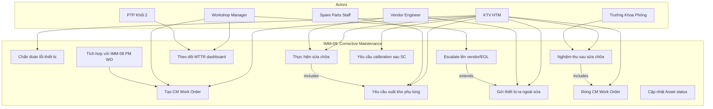
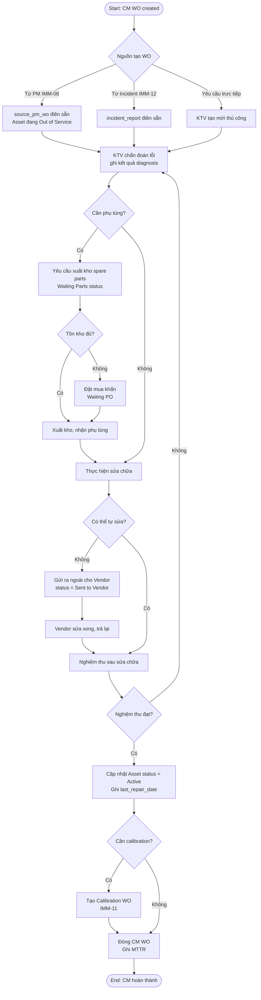
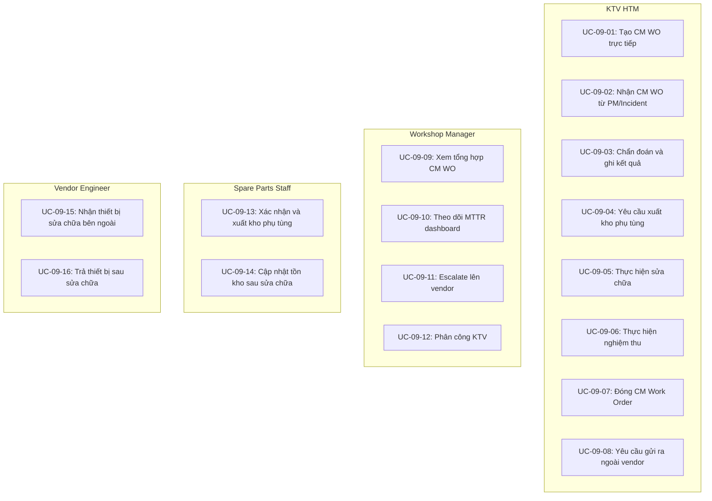
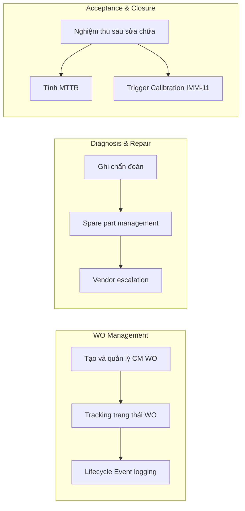

# IMM-09 — Corrective Maintenance (Sửa chữa / Bảo trì Khắc phục)
## Functional Specification

**Module:** IMM-09  
**Version:** 1.0  
**Ngày:** 2026-04-17  
**Trạng thái:** Draft — Chờ phê duyệt  
**Tác giả:** AssetCore Team

---

## 1. Vị trí trong Asset Lifecycle

```
IMM-04 (Lắp đặt) → IMM-05 (Hồ sơ) → [Asset "Active"]
                                              │
                              ┌───────────────▼───────────────┐
                              │    Nguồn kích hoạt CM         │
                              │                               │
                  ┌───────────┼───────────┐                   │
                  │           │           │                   │
            PM phát lỗi   Sự cố     Yêu cầu                  │
            (IMM-08)      (IMM-12)   người dùng               │
                  │           │           │                   │
                  └───────────┴─────┬─────┘                   │
                                    │                         │
                                    ▼                         │
                         ┌──────────────────┐                 │
                         │   IMM-09: CM     │                 │
                         │  Tiếp nhận WO   │                 │
                         │  → Chẩn đoán    │                 │
                         │  → Xuất kho PT  │                 │
                         │  → Thực hiện SC │                 │
                         │  → Nghiệm thu   │                 │
                         │  → Tái đưa vào  │                 │
                         │    dịch vụ      │                 │
                         └────────┬─────────┘                 │
                                  │                           │
                    ┌─────────────┼─────────────┐             │
                    │             │             │             │
              Hoàn thành   Không sửa       Cần hiệu      ◄───┘
              (Active)     được (EOL)      chuẩn (IMM-11)
                    │             │
           [MTTR ghi nhận] [IMM-13/14 EOL]
```

**Quan hệ ngang:**
- **IMM-08** → cung cấp `source_pm_wo` khi PM phát hiện lỗi và chuyển sang CM
- **IMM-05** → cung cấp Service Manual, hồ sơ kỹ thuật thiết bị để chẩn đoán
- **IMM-11** → Calibration bắt buộc sau sửa chữa nếu thiết bị liên quan đến đo lường
- **IMM-12** → Corrective Maintenance (sự cố) có thể chuyển thành Repair WO IMM-09
- **IMM-13/14** → khi thiết bị không thể sửa chữa (Cannot Repair) → chuyển EOL

---

## 2. Workflow Chính (BPMN)

```
START
  │
  ▼ [Trigger — một trong ba nguồn]
  ┌────────────────────────────────────────────┐
  │ A. Người dùng báo hỏng → tạo Incident Rpt │
  │ B. PM WO phát hiện lỗi → source_pm_wo     │
  │ C. Workshop Manager tạo CM WO thủ công    │
  └────────────────────┬───────────────────────┘
  │
  ▼ [Step 1 — BR-09-01]
  Tạo Asset Repair WO (WO-CM-YYYY-#####)
  Actor: Workshop Manager / CMMS Auto
  Validate: phải có source (IR-ref HOẶC source_pm_wo)
  Output: WO status = "Open"
  │
  ▼ [Step 2]
  Phân công KTV thực hiện
  Actor: Workshop Manager
  Action: Chọn KTV, xác nhận ngày, set priority (Normal / Urgent / Emergency)
  Output: WO status = "Assigned"
  │
  ▼ [Step 3]
  KTV tiến hành chẩn đoán
  Actor: KTV HTM
  Action: Kiểm tra thiết bị, xác định nguyên nhân gốc rễ
  Asset status = "Under Repair" (BR-09-05)
  Output: WO status = "Diagnosing", diagnosis_notes filled
  │
  ▼ [Gateway: Cần vật tư?]
  │
  ├─── Không cần vật tư → [Emergency Fast-Track] ──────────────┐
  │                                                             │
  ├─── Cần vật tư ─────────────────────────────┐               │
  │                                             │               │
  │    ▼ [Step 4 — BR-09-02]                    │               │
  │    Yêu cầu xuất kho vật tư                  │               │
  │    Actor: KTV HTM → Kho vật tư             │               │
  │    Action: Tạo Spare Parts Request         │               │
  │    Output: WO status = "Pending Parts"     │               │
  │            Stock Entry reference bắt buộc  │               │
  │                                             │               │
  │    ▼ [Step 5]                               │               │
  │    Kho xuất vật tư                          │               │
  │    Actor: Kho vật tư                        │               │
  │    Action: Issue parts, tạo Stock Entry    │               │
  │    Output: Spare Parts Used table filled   │               │
  │                                             │               │
  └─────────────────────────────────────────────┘               │
                                   │                            │
                                   └────────────────────────────┘
                                               │
  ▼ [Step 6]
  Thực hiện sửa chữa
  Actor: KTV HTM
  Action: Thay thế linh kiện, điều chỉnh, sửa chữa
  Output: WO status = "In Repair"
  │
  ▼ [Gateway: Cập nhật Firmware?]
  │
  ├─── Có → [BR-09-03]
  │         Tạo Firmware Change Request
  │         Actor: KTV HTM → Workshop Manager approve
  │         Fields: version_before, version_after, change_notes
  │         Output: FCR submitted
  │
  └─── Không → tiếp tục
  │
  ▼ [Step 7 — BR-09-04]
  Kiểm tra nghiệm thu sau sửa chữa
  Actor: KTV HTM
  Action: Điền Repair Checklist (100% pass bắt buộc)
  Output: WO status = "Pending Inspection"
  │
  ▼ [Gateway: Checklist 100% pass?]
  │
  ├─── Fail → Quay lại Step 6 (tiếp tục sửa)
  │
  ├─── Pass + Thiết bị OK
  │    ▼ [Step 8]
  │    Bàn giao thiết bị
  │    Actor: KTV HTM + Trưởng khoa phòng
  │    Action: Trưởng khoa xác nhận nhận lại, ký biên bản
  │    Output: WO status = "Completed"
  │            Asset.status = "Active" (BR-09-05)
  │            MTTR calculated
  │
  └─── Cannot Repair
       ▼
       WO status = "Cannot Repair"
       Asset.status = "Out of Service"
       Trigger IMM-13/14 process

END
```

---

## 3. Actors & Roles

| Actor | Vai trò | Quyền hệ thống | Trách nhiệm |
|---|---|---|---|
| Workshop Manager | Quản lý Workshop | Tạo/Assign WO, phê duyệt chi phí | Tiếp nhận yêu cầu, phân công KTV, approve repair cost, giám sát MTTR |
| KTV HTM | Thực hiện sửa chữa | Execute WO, Fill Checklist, Fill Diagnosis | Chẩn đoán, thực hiện sửa chữa, điền checklist nghiệm thu |
| Kho vật tư | Xuất kho linh kiện | Issue Parts, Create Stock Entry | Xác nhận tồn kho, xuất vật tư theo yêu cầu, tạo phiếu xuất kho |
| Trưởng khoa phòng | Xác nhận trả thiết bị | Confirm return, View WO | Ký biên bản nhận lại thiết bị sau sửa chữa |
| PTP Khối 2 | Giám sát KPI | View CM Dashboard, View MTTR Report | Theo dõi repair backlog, MTTR trend, first-time fix rate |
| CMMS Auto | Hệ thống | System process | Tạo CM WO từ PM failure event (source_pm_wo), tính MTTR tự động |

---

## 4. Input / Output

### INPUT

| Đầu vào | Nguồn | Bắt buộc |
|---|---|---|
| Incident Report (IR-ref) | IMM-12 hoặc người dùng báo hỏng | Có (hoặc source_pm_wo) |
| PM Work Order nguồn (source_pm_wo) | IMM-08 PM WO detect lỗi | Có (nếu từ PM) |
| Thông tin thiết bị (asset_ref, serial, model) | Asset DocType + IMM-05 | Có |
| Service Manual / hồ sơ kỹ thuật | IMM-05 Asset Documents | Không (tham khảo) |
| Spare Parts Catalog | Item Master | Khi cần vật tư |
| Firmware version hiện tại | Asset custom field | Khi update firmware |
| Repair Checklist Template | Asset Category | Có (cho nghiệm thu) |

### OUTPUT

| Đầu ra | DocType / Artifact | Ghi chú |
|---|---|---|
| Asset Repair WO | `Asset Repair` (WO-CM-YYYY-#####) | Record chính |
| Spare Parts Used | Child table của Asset Repair | Liệt kê linh kiện thay thế |
| Stock Entry reference | Link đến Stock Entry Frappe | BR-09-02 bắt buộc |
| Repair Checklist result | Child table `Repair Checklist` | 100% pass mới cho Complete |
| Firmware Change Request | `Firmware Change Request` | Khi có cập nhật firmware |
| Asset Lifecycle Event | `Asset Lifecycle Event` | Mỗi thay đổi trạng thái |
| Biên bản bàn giao (PDF) | Print Format | Ký giữa KTV và Trưởng khoa |
| MTTR record | Tính từ open→completion datetime | Phục vụ KPI |

---

## 5. Business Rules

| Mã | Nội dung Rule | Hậu quả vi phạm | Kiểm soát |
|---|---|---|---|
| **BR-09-01** | Asset Repair WO phải có ít nhất một nguồn hợp lệ: `incident_report` (IR-ref) HOẶC `source_pm_wo` — không được tạo WO mà không có lý do rõ ràng | WO bị block tạo nếu thiếu cả hai trường nguồn | Validate `incident_report` OR `source_pm_wo` is not null trên `before_insert` |
| **BR-09-02** | Khi KTV ghi nhận vật tư đã sử dụng trong `Spare Parts Used`, phải có `stock_entry_ref` tham chiếu phiếu xuất kho hợp lệ — không chấp nhận vật tư ghi tay không có chứng từ | `Spare Parts Used` row bị block nếu thiếu `stock_entry_ref` | Validate trên child table trước Submit WO |
| **BR-09-03** | Khi KTV cập nhật firmware thiết bị trong quá trình sửa chữa, phải tạo `Firmware Change Request` riêng biệt với `version_before` và `version_after` — không được update firmware field trực tiếp trên Asset | WO không thể submit nếu `firmware_updated = True` mà không có FCR linked | Check `firmware_change_request` is linked nếu `firmware_updated` = True |
| **BR-09-04** | Trước khi chuyển WO sang "Completed", toàn bộ `Repair Checklist` phải được điền và 100% kết quả là "Pass" — không có mục nào để trống hoặc "Fail" | WO bị block Complete nếu có mục Fail hoặc chưa điền | Validate all checklist items result = "Pass" trên `before_submit` |
| **BR-09-05** | Asset.status phải được set = "Under Repair" ngay khi WO chuyển sang "Assigned" và chỉ được trả về "Active" khi WO được Submit với status = "Completed" — suốt thời gian sửa chữa thiết bị không thể dùng cho PM hoặc Calibration mới | Thiết bị bị schedule PM/Calibration trong khi đang sửa | Auto-set `Asset.status` theo WO transition; block WO creation nếu asset đã "Under Repair" |

---

## 6. MTTR Calculation

### 6.1 Định nghĩa

```
MTTR = (completion_datetime - open_datetime) theo giờ làm việc
```

Trong đó:
- `open_datetime`: thời điểm WO được tạo (creation timestamp)
- `completion_datetime`: thời điểm WO được Submit thành công (Completed)
- Tính theo **giờ làm việc** (working hours): thứ 2–6, 07:00–17:00 (loại trừ ngày lễ)

### 6.2 Công thức chi tiết

```python
def calculate_mttr(open_dt: datetime, close_dt: datetime) -> float:
    """
    Tính MTTR theo giờ làm việc.
    Trả về số giờ (float, 2 chữ số thập phân).
    
    Working hours: Mon-Fri, 07:00-17:00
    Excludes: public holidays (từ Holiday List)
    """
    working_hours = get_working_hours_between(open_dt, close_dt)
    return round(working_hours, 2)
```

### 6.3 Ngưỡng SLA theo loại thiết bị

| Risk Class | Priority | MTTR Target | Cảnh báo | Critical |
|---|---|---|---|---|
| Class III (Nguy cơ cao) | Emergency | ≤ 4 giờ | > 2 giờ | > 4 giờ |
| Class III | Urgent | ≤ 24 giờ | > 16 giờ | > 24 giờ |
| Class II | Normal | ≤ 72 giờ | > 48 giờ | > 72 giờ |
| Class I | Normal | ≤ 120 giờ | > 80 giờ | > 120 giờ |

### 6.4 MTTR KPI Dashboard

```
MTTR (tháng) = Tổng MTTR tất cả WO hoàn thành / Tổng số WO
First-Time Fix Rate = WO không mở lại trong 30 ngày / Tổng WO × 100%
Repair Backlog = Count(Open + Assigned WOs)
Parts Cost/Repair = Tổng spare_parts_total_cost / Count WO Completed
```

### 6.5 Scheduler — SLA Overdue Alert

```python
def check_repair_sla_breach():
    """
    Chạy mỗi 1 giờ — kiểm tra WO sắp/đã vượt SLA.
    """
    active_wos = frappe.get_all("Asset Repair", 
        filters={"status": ("in", ["Assigned", "Diagnosing", "In Repair"])},
        fields=["name", "asset_ref", "priority", "creation", "risk_class"])
    
    for wo in active_wos:
        elapsed = get_working_hours_since(wo.creation)
        sla_limit = get_sla_limit(wo.risk_class, wo.priority)
        
        if elapsed >= sla_limit:
            _escalate_sla_breach(wo)
        elif elapsed >= sla_limit * 0.75:
            _warn_approaching_sla(wo)
```

---

## 7. Exception Handling

| Tình huống | Điều kiện kích hoạt | Xử lý hệ thống | Xử lý nghiệp vụ |
|---|---|---|---|
| Thiết bị hỏng không có vật tư | Spare part stock = 0 sau khi chẩn đoán | WO status = "Pending Parts", trigger procurement alert | Kho liên hệ nhà cung cấp, đặt mua khẩn; Workshop Manager cập nhật ETA |
| KTV không thể sửa (skill gap) | KTV ghi nhận "vượt năng lực" trong diagnosis | Alert Workshop Manager, WO unassigned | Manager reassign cho KTV cao cấp hơn hoặc liên hệ hãng |
| Hãng sản xuất cần can thiệp | KTV chọn "Escalate to Manufacturer" | WO status = "Pending Manufacturer", ghi vendor contact | Workshop liên hệ hãng, ghi tracking number bảo hành |
| Thiết bị trong bảo hành | Asset.warranty_expiry > today AND failure không do lỗi người dùng | Flag WO is_warranty = True, block chi phí xuất kho thông thường | Liên hệ nhà cung cấp bảo hành, không tính chi phí vật tư |
| Sửa chữa không thành công | KTV chọn "Cannot Repair" sau nhiều lần thử | WO status = "Cannot Repair", Asset.status = "Out of Service" | Trigger IMM-13/14 (EOL); Workshop thông báo BGĐ + khoa phòng |
| Thiết bị lại hỏng trong 30 ngày | Mở WO mới cho cùng asset trong 30 ngày sau WO hoàn thành | Flag WO.is_repeat_failure = True; giảm First-Time Fix Rate KPI | Điều tra root cause, xem xét thay thế thiết bị |
| Firmware update thất bại | FCR submitted nhưng firmware rollback cần thiết | Alert KTV + Workshop Manager; FCR status = "Rollback Required" | KTV thực hiện rollback, cập nhật FCR với kết quả |
| Thiết bị khẩn cấp (life-critical) | asset.risk_class = III AND ward = ICU/OR | Auto-escalate đến PTP + BGĐ; push notification ngay lập tức | Ưu tiên tuyệt đối, cần spare device nếu có |

---

## 8. User Stories (INVEST)

| ID | Story | SP |
|---|---|---|
| US-09-01 | Với tư cách là **Workshop Manager**, tôi muốn tạo CM Work Order với bắt buộc điền nguồn (Incident Report hoặc PM WO nguồn), để đảm bảo mọi repair đều có lý do truy xuất được và không bị mở WO vô căn cứ. | 5 |
| US-09-02 | Với tư cách là **KTV HTM**, tôi muốn chẩn đoán và ghi root cause trực tiếp trên WO form kèm ảnh chụp thiết bị hỏng, để tạo hồ sơ kỹ thuật đầy đủ cho audit trail. | 5 |
| US-09-03 | Với tư cách là **KTV HTM**, tôi muốn yêu cầu vật tư từ kho trực tiếp trong WO và nhận notification khi đã được xuất, để không cần liên lạc thủ công và tránh gián đoạn quy trình sửa chữa. | 8 |
| US-09-04 | Với tư cách là **KTV HTM**, tôi muốn điền Repair Checklist sau khi sửa chữa và hệ thống chỉ cho phép Complete WO khi 100% mục đã Pass, để đảm bảo thiết bị an toàn trước khi trả lại khoa phòng. | 5 |
| US-09-05 | Với tư cách là **PTP Khối 2**, tôi muốn xem MTTR theo tháng và First-Time Fix Rate trên dashboard, để báo cáo hiệu suất workshop và phát hiện thiết bị có vấn đề mãn tính. | 3 |
| US-09-06 | Với tư cách là **Workshop Manager**, tôi muốn xem danh sách repair backlog (Open + Assigned WOs) với màu ưu tiên theo risk class và SLA status, để phân bổ nhân lực hiệu quả. | 3 |
| US-09-07 | Với tư cách là **KTV HTM**, tôi muốn tạo Firmware Change Request liên kết với WO khi cần update firmware, để đảm bảo mọi thay đổi phần mềm thiết bị đều có hồ sơ kiểm soát thay đổi. | 5 |

---

## 9. Acceptance Criteria (Gherkin)

```gherkin
Feature: IMM-09 Corrective Maintenance — Asset Repair Workflow

Scenario: Tạo CM WO bắt buộc có nguồn hợp lệ (BR-09-01)
  Given Workshop Manager đang tạo Asset Repair WO mới
  When Manager không điền cả "Incident Report" lẫn "PM WO nguồn"
  Then Hệ thống hiển thị lỗi "Phải có nguồn: Incident Report hoặc PM WO gốc"
    And WO không được lưu
  When Manager điền "Incident Report" = "IR-2026-00123"
  Then WO được tạo thành công với status = "Open"
    And Asset.status = "Under Repair"
    And Asset Lifecycle Event được tạo: event_type = "repair_opened"

Scenario: Yêu cầu vật tư phải có phiếu xuất kho (BR-09-02)
  Given WO đang ở trạng thái "In Repair"
    And KTV điền "Spare Parts Used" với item = "Capacitor 100uF", qty = 2
  When KTV để trống trường "Stock Entry Reference"
    And KTV bấm Submit WO
  Then Hệ thống block Submit với lỗi "Vật tư 'Capacitor 100uF' thiếu phiếu xuất kho"
  When KTV điền stock_entry_ref = "STE-2026-00456"
    And KTV bấm Submit lại
  Then WO được Submit thành công

Scenario: Firmware update yêu cầu Firmware Change Request (BR-09-03)
  Given WO đang ở trạng thái "In Repair"
    And KTV đánh dấu checkbox "Đã cập nhật Firmware" = True
  When KTV bấm Submit WO mà không tạo Firmware Change Request
  Then Hệ thống block Submit với lỗi "Cập nhật firmware yêu cầu phải có Firmware Change Request liên kết"
  When KTV tạo FCR với version_before = "2.1.0", version_after = "2.3.1"
    And FCR được Workshop Manager phê duyệt
    And KTV link FCR vào WO và Submit lại
  Then WO Submit thành công
    And Asset.firmware_version được cập nhật = "2.3.1"

Scenario: Nghiệm thu sau sửa chữa — 100% Pass bắt buộc (BR-09-04)
  Given WO đang ở trạng thái "Pending Inspection"
    And Repair Checklist có 5 mục
    And KTV điền 4 mục = "Pass", 1 mục = "Fail"
  When KTV bấm "Complete Repair"
  Then Hệ thống block với lỗi "Mục kiểm tra #3 chưa Pass — không thể hoàn thành"
  When KTV sửa xong và điền lại mục #3 = "Pass"
    And Trưởng khoa phòng xác nhận nhận thiết bị
  Then WO status = "Completed"
    And Asset.status = "Active"
    And MTTR được tính và lưu vào WO
    And Asset Lifecycle Event được tạo: event_type = "repair_completed"

Scenario: Emergency Repair — Fast-track không cần vật tư
  Given Asset là máy thở (risk_class = III) đang hỏng tại ICU
    And Workshop Manager tạo WO với priority = "Emergency"
  When KTV chẩn đoán xong và chọn "Không cần vật tư"
  Then WO tự động skip trạng thái "Pending Parts"
    And WO chuyển thẳng sang "In Repair"
    And PTP Khối 2 nhận push notification "Sửa chữa khẩn cấp đang tiến hành"
  When Repair Checklist 100% Pass và KTV Submit
  Then MTTR được tính từ lúc open đến complete
    And Nếu MTTR > 4 giờ → flag SLA_breached = True
```

---

## 10. WHO HTM & QMS Mapping

| Yêu cầu IMM-09 | WHO Reference | ISO 9001:2015 | NĐ98 | Ghi chú |
|---|---|---|---|---|
| Work Order bắt buộc cho mọi sửa chữa | WHO CMMS §3.2.3 | §8.5.1 | Điều 28 | Không có action ngoài WO |
| Traceability nguồn (IR/PM WO) | WHO HTM 2025 §5.4.2 | §8.5.2 | Điều 29 | BR-09-01 đảm bảo |
| Spare parts với chứng từ xuất kho | WHO Maintenance §6.3 | §8.4.3 | Điều 31 | BR-09-02 — Stock Entry bắt buộc |
| Firmware change control | WHO HTM 2025 §7.2 | §8.5.6 | Điều 35 | BR-09-03 — FCR bắt buộc |
| Post-repair acceptance test | WHO Maintenance §5.5.3 | §8.6 | Điều 30 | BR-09-04 — 100% Pass |
| Asset status management | WHO CMMS §3.3.1 | §8.5.1 | Điều 28 | BR-09-05 — Under Repair → Active |
| MTTR tracking | WHO HTM 2025 §6.1 | §9.1.1 | Điều 36 | KPI bắt buộc |
| Audit trail mọi thao tác | WHO HTM 2025 §6.4 | §7.5.3 | Điều 40 | Asset Lifecycle Event cho mọi bước |
| Hồ sơ sửa chữa immutable | WHO Maintenance §5.5.5 | §7.5 | Điều 37 | WO Submitted không thể xóa |
| Thiết bị nguy cơ cao ưu tiên khẩn | WHO HTM Risk §4.2 | §8.5.1 | Điều 22 | SLA theo risk class |

---

## Use Case Diagram



---

## Activity Diagram — CM Execution Flow



---

## Non-Functional Requirements

| ID | Yêu cầu | Chỉ tiêu | Phương pháp kiểm tra |
|---|---|---|---|
| NFR-09-01 | MTTR tracking accuracy | Tính chính xác đến 0.5 giờ | Unit test |
| NFR-09-02 | SLA alert delivery | Gửi cảnh báo trong 5 phút khi SLA breach | E2E test |
| NFR-09-03 | Spare part lookup | < 1s tìm kiếm trong catalog 10,000 items | Performance test |
| NFR-09-04 | Concurrent WO | 20 WO đang xử lý đồng thời không conflict | Load test |
| NFR-09-05 | Audit immutability | Không thể xóa Lifecycle Event sau tạo | DB test |
| NFR-09-06 | Vendor integration | Export WO PDF cho vendor trong < 2s | Performance test |

---

## Biểu Đồ Use Case Phân Rã — IMM-09

### Phân rã theo Actor



### Phân rã theo Subsystem



---

## Đặc Tả Use Case — IMM-09

### UC-09-02: Nhận CM WO từ PM failure

| Thuộc tính | Nội dung |
|---|---|
| **UC ID** | UC-09-02 |
| **Tên** | Nhận và xử lý CM Work Order được tạo từ PM failure (IMM-08) |
| **Actor chính** | KTV HTM |
| **Actor phụ** | Workshop Manager (phân công), CMMS System (tạo WO auto) |
| **Tiền điều kiện** | PM Work Order đã đánh dấu Major Failure; CM WO đã được tạo tự động với source_pm_wo; Asset.status = Out of Service |
| **Hậu điều kiện** | KTV nhận WO, trạng thái chuyển Diagnosing; Lifecycle Event ghi nhận |
| **Luồng chính** | 1. Workshop Manager nhận alert Major Failure từ PM / 2. Manager xem CM WO đã tạo tự động (priority=Critical) / 3. Manager phân công KTV cho CM WO / 4. KTV nhận notification, mở CM WO / 5. KTV xem: source_pm_wo reference, mô tả lỗi, thông tin Asset / 6. KTV confirm nhận WO → status = Diagnosing / 7. Lifecycle Event tạo: "cm_started" |
| **Luồng thay thế** | 3a. Không có KTV available → Manager escalate, WO pending |
| **Luồng ngoại lệ** | 6a. Asset đã được repair trước đó → check conflict |
| **Business Rule** | BR-09-01: CM WO từ PM phải có source_pm_wo bắt buộc |

---

### UC-09-06: Nghiệm thu sau sửa chữa

| Thuộc tính | Nội dung |
|---|---|
| **UC ID** | UC-09-06 |
| **Tên** | Thực hiện nghiệm thu và xác nhận thiết bị hoạt động sau sửa chữa |
| **Actor chính** | KTV HTM |
| **Actor phụ** | Trưởng Khoa Phòng (ký biên bản), QA Officer |
| **Tiền điều kiện** | Sửa chữa hoàn thành; WO.status = Pending Acceptance |
| **Hậu điều kiện** | Nếu Pass: Asset.status = Active, last_repair_date cập nhật, MTTR tính; Nếu Fail: quay lại Diagnosing |
| **Luồng chính** | 1. KTV hoàn thành sửa chữa / 2. KTV điền acceptance checklist / 3. Khoa phòng xác nhận thiết bị hoạt động bình thường / 4. KTV nhấn "Accept Repair" / 5. Hệ thống set Asset.status = Active / 6. Ghi last_repair_date = today / 7. Tính MTTR = (close_date - open_date) theo giờ / 8. Tạo Lifecycle Event: "repaired" / 9. Kiểm tra: có cần Calibration? (theo asset_category) / 10. Nếu có → tạo Calibration WO (IMM-11) |
| **Luồng thay thế** | 3a. Khoa phòng từ chối → WO quay Diagnosing, ghi lý do |
| **Luồng ngoại lệ** | 7a. open_date null → MTTR = N/A, log warning |
| **Business Rule** | BR-09-02: MTTR phải được tính và ghi vào WO; BR-09-03: Một số thiết bị bắt buộc Calibration sau sửa chữa |

---

### UC-09-07: Đóng CM Work Order

| Thuộc tính | Nội dung |
|---|---|
| **UC ID** | UC-09-07 |
| **Tên** | Đóng CM Work Order và hoàn tất hồ sơ sửa chữa |
| **Actor chính** | KTV HTM |
| **Actor phụ** | Workshop Manager (review) |
| **Tiền điều kiện** | Nghiệm thu đã Pass; tất cả spare parts đã ghi nhận; WO.status = Pending Acceptance |
| **Hậu điều kiện** | WO.status = Closed; close_date ghi nhận; Lifecycle Event "cm_closed"; repair history cập nhật trên Asset |
| **Luồng chính** | 1. KTV điền repair_summary / 2. Xác nhận danh sách parts_used đã đầy đủ / 3. Upload ảnh thiết bị sau sửa chữa (optional) / 4. Nhấn "Close Work Order" / 5. Hệ thống set WO.status = Closed, close_date = today / 6. Tạo Lifecycle Event: "cm_closed" / 7. Cập nhật Asset.custom_last_repair_date / 8. Cập nhật Asset.custom_mttr_avg_hours |
| **Luồng thay thế** | 2a. Parts chưa đủ → cảnh báo nhưng cho phép tiếp tục với note |
| **Luồng ngoại lệ** | 8a. Lỗi tính MTTR → set null, alert Admin |
| **Business Rule** | BR-09-04: WO đã Closed không thể edit; audit trail immutable |
