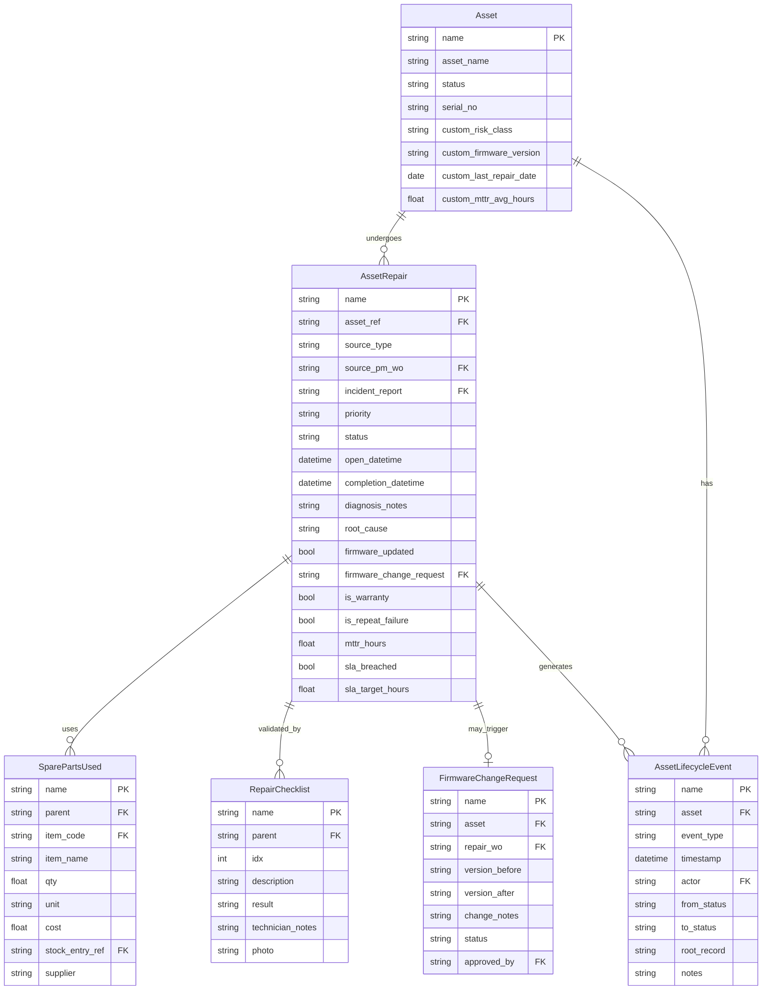
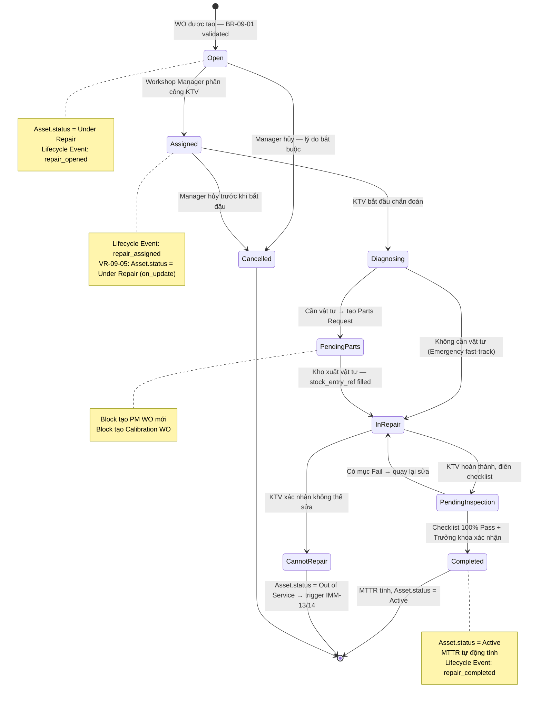

# IMM-09 — Technical Design

## Corrective Maintenance System

**Module:** IMM-09 — Corrective Maintenance (Sửa chữa khắc phục)
**Version:** 2.0
**Ngày:** 2026-04-17
**Trạng thái:** Draft — NOT CODED YET
**Author:** AssetCore Team

---

## 1. ERD — Entity Relationship Diagram



---

## 2. Data Dictionary

### 2.1 `Asset Repair` (Phiếu sửa chữa — extends ERPNext Asset Repair)

**Mục đích:** Record chính của mỗi lần sửa chữa khắc phục — từ tiếp nhận đến nghiệm thu.
**Naming Series:** `WO-CM-YYYY-#####`
**DocType type:** Submittable
**Module:** AssetCore

Custom fields thêm vào ERPNext Asset Repair:

| Field | Label (VI) | Type | Options / Notes | Mandatory |
| --- | --- | --- | --- | --- |
| `source_type` | Loại nguồn | Select | PM_Failure, Incident_Report, Manual | Yes |
| `source_pm_wo` | PM Work Order nguồn | Link | PM Work Order | Conditional |
| `incident_report` | Phiếu sự cố | Link | Incident Report | Conditional |
| `priority` | Ưu tiên | Select | Emergency, Urgent, Normal | Yes |
| `diagnosis_notes` | Ghi chú chẩn đoán | Text | Mô tả chi tiết lỗi | Yes (on Diagnosing) |
| `root_cause` | Nguyên nhân gốc rễ | Text | Bắt buộc trước khi Complete | Yes (on Complete) |
| `firmware_updated` | Đã cập nhật firmware | Check | — | No |
| `firmware_change_request` | Firmware Change Request | Link | Firmware Change Request | Conditional |
| `is_warranty` | Bảo hành | Check | Nếu trong thời hạn bảo hành | No |
| `is_repeat_failure` | Tái hỏng (30 ngày) | Check | Tự động tính khi tạo WO | Auto |
| `mttr_hours` | MTTR (giờ) | Float | Tính theo giờ làm việc, tự động khi Submit | Auto |
| `sla_target_hours` | SLA mục tiêu (giờ) | Float | Lookup theo risk_class + priority | Auto |
| `sla_breached` | Vi phạm SLA | Check | mttr_hours > sla_target_hours | Auto |
| `repair_checklist` | Checklist nghiệm thu | Table | Child: Repair Checklist | Yes |
| `spare_parts_used` | Vật tư đã sử dụng | Table | Child: Spare Parts Used | No |
| `open_datetime` | Thời điểm mở WO | Datetime | Tự động set khi tạo | Auto |
| `completion_datetime` | Thời điểm hoàn thành | Datetime | Tự động set khi Submit | Auto |
| `cannot_repair_reason` | Lý do không sửa được | Text | Bắt buộc khi Cannot Repair | Conditional |

---

### 2.2 `Spare Parts Used` (Vật tư đã sử dụng — Child Table)

**Mục đích:** Liệt kê toàn bộ linh kiện, vật tư thay thế trong quá trình sửa chữa.
**Parent:** Asset Repair

| Field | Label (VI) | Type | Notes | Mandatory |
| --- | --- | --- | --- | --- |
| `item_code` | Mã vật tư | Link | Item | Yes |
| `item_name` | Tên vật tư | Data | Fetch from Item (read-only) | Auto |
| `qty` | Số lượng | Float | > 0 | Yes |
| `unit` | Đơn vị | Link | UOM | Yes |
| `cost` | Đơn giá (VNĐ) | Currency | Fetch từ Item valuation | Yes |
| `stock_entry_ref` | Phiếu xuất kho | Link | Stock Entry — bắt buộc (BR-09-02) | Yes |
| `supplier` | Nhà cung cấp | Data | Tên nhà cung cấp vật tư | No |

---

### 2.3 `Repair Checklist` (Checklist nghiệm thu — Child Table)

**Mục đích:** Xác nhận thiết bị hoạt động đúng sau sửa chữa.
**Parent:** Asset Repair

| Field | Label (VI) | Type | Notes | Mandatory |
| --- | --- | --- | --- | --- |
| `idx` | STT | Int | Auto | Auto |
| `description` | Nội dung kiểm tra | Data | Ví dụ: "Kiểm tra điện áp đầu ra" | Yes |
| `result` | Kết quả | Select | Pass, Fail, N/A | Yes |
| `technician_notes` | Ghi chú KTV | Text | Ghi nhận thực tế | No |
| `photo` | Ảnh minh chứng | Attach | — | No |

**Ràng buộc:** Tất cả dòng phải là `Pass` hoặc `N/A` trước khi Submit (BR-09-04). Bất kỳ `Fail` nào sẽ block Submit.

---

### 2.4 `Firmware Change Request` (Yêu cầu thay đổi firmware)

**Mục đích:** Kiểm soát thay đổi firmware thiết bị — bắt buộc khi KTV update phần mềm.
**Naming Series:** `FCR-YYYY-#####`
**DocType type:** Submittable

| Field | Label (VI) | Type | Notes | Mandatory |
| --- | --- | --- | --- | --- |
| `asset` | Thiết bị | Link | Asset | Yes |
| `repair_wo` | Asset Repair WO | Link | Asset Repair | Yes |
| `version_before` | Firmware trước | Data | Ví dụ: "2.1.0" | Yes |
| `version_after` | Firmware sau | Data | Ví dụ: "2.3.1" | Yes |
| `change_notes` | Mô tả thay đổi | Text | Lý do update, changelog | Yes |
| `status` | Trạng thái | Select | Draft, Pending Approval, Approved, Applied, Rolled Back | Yes |
| `approved_by` | Người phê duyệt | Link | User (Workshop Manager) | Yes (on Approve) |

---

## 3. State Machine



---

## 4. Backend Implementation

### 4.1 Service Layer — `services/imm09.py`

```python
"""
IMM-09 Corrective Maintenance — Service Layer
Business logic đặt tại đây, controller chỉ gọi functions.
"""
import frappe
from frappe import _
from frappe.utils import nowdate, now_datetime, get_datetime
from assetcore.utils.working_hours import get_working_hours_between
from assetcore.utils.lifecycle import create_lifecycle_event
from typing import Optional


def create_cm_wo_from_pm_failure(pm_wo_name: str) -> str:
    """
    Tạo Asset Repair WO từ PM Work Order phát hiện lỗi (IMM-08 → IMM-09).

    Args:
        pm_wo_name: Tên PM Work Order nguồn

    Returns:
        str: Tên Asset Repair WO mới tạo
    """
    pm_wo = frappe.get_doc("PM Work Order", pm_wo_name)
    doc = frappe.get_doc({
        "doctype": "Asset Repair",
        "asset_ref": pm_wo.asset_ref,
        "source_type": "PM_Failure",
        "source_pm_wo": pm_wo_name,
        "priority": "Urgent",
        "status": "Open",
    })
    doc.insert(ignore_permissions=True)
    return doc.name


def create_cm_wo_from_incident(incident_report_name: str) -> str:
    """
    Tạo Asset Repair WO từ Incident Report (IMM-12 → IMM-09).

    Args:
        incident_report_name: Tên Incident Report nguồn

    Returns:
        str: Tên Asset Repair WO mới tạo
    """
    ir = frappe.get_doc("Incident Report", incident_report_name)
    doc = frappe.get_doc({
        "doctype": "Asset Repair",
        "asset_ref": ir.asset_ref,
        "source_type": "Incident_Report",
        "incident_report": incident_report_name,
        "priority": ir.severity or "Normal",
        "status": "Open",
    })
    doc.insert(ignore_permissions=True)
    return doc.name


def calculate_mttr(open_dt: "datetime", close_dt: "datetime") -> float:
    """
    Tính MTTR (Mean Time To Repair) theo giờ làm việc thực tế.
    Working hours: Mon–Fri 07:00–17:00, loại trừ ngày lễ.

    Args:
        open_dt: Thời điểm mở WO
        close_dt: Thời điểm đóng WO

    Returns:
        float: Số giờ làm việc đã tiêu tốn, làm tròn 2 chữ số thập phân
    """
    return round(get_working_hours_between(open_dt, close_dt), 2)


def check_sla_breach() -> None:
    """
    Kiểm tra SLA breach cho mọi WO đang mở — chạy mỗi 1 giờ.
    Gửi cảnh báo leo thang (75% SLA = warning, 100% = breach).
    """
    active_wos = frappe.get_all(
        "Asset Repair",
        filters={
            "status": ("in", ["Assigned", "Diagnosing", "Pending Parts", "In Repair"]),
            "docstatus": 0,
        },
        fields=["name", "asset_ref", "priority", "risk_class",
                "open_datetime", "sla_target_hours", "assigned_to"],
    )
    for wo in active_wos:
        from assetcore.utils.working_hours import get_working_hours_since
        elapsed = get_working_hours_since(wo.open_datetime)
        sla = wo.sla_target_hours or 120.0

        if elapsed >= sla:
            frappe.db.set_value("Asset Repair", wo.name, "sla_breached", True)
            _send_sla_breach_alert(wo, elapsed, sla)
        elif elapsed >= sla * 0.75:
            _send_sla_warning_alert(wo, elapsed, sla)


def check_repeat_failure(asset_name: str, repair_wo_name: str) -> bool:
    """
    Kiểm tra thiết bị có bị hỏng lại trong 30 ngày sau lần sửa trước.

    Args:
        asset_name: Tên Asset
        repair_wo_name: WO hiện tại (loại trừ khỏi query)

    Returns:
        bool: True nếu là repeat failure
    """
    from frappe.utils import add_days
    cutoff = add_days(nowdate(), -30)
    last = frappe.db.exists("Asset Repair", {
        "asset_ref": asset_name,
        "status": "Completed",
        "completion_datetime": (">=", cutoff),
        "docstatus": 1,
        "name": ("!=", repair_wo_name),
    })
    return bool(last)


def trigger_calibration_after_repair(asset_name: str) -> None:
    """
    Trigger tạo Calibration WO sau sửa chữa nếu thiết bị thuộc loại đo lường
    (IMM-09 → IMM-11). Chỉ áp dụng nếu Device Model có calibration_required = True.

    Args:
        asset_name: Tên Asset vừa được sửa
    """
    device_model = frappe.db.get_value("Asset", asset_name, "device_model")
    if not device_model:
        return
    cal_required = frappe.db.get_value("Device Model", device_model, "calibration_required")
    if not cal_required:
        return

    from assetcore.services.imm11 import create_post_repair_calibration
    create_post_repair_calibration(asset_name)
```

---

### 4.2 Controller Hooks — `asset_repair.py`

```python
"""
Asset Repair DocType Controller
Không chứa business logic — chỉ gọi service layer (imm09.py).
"""
import frappe
from frappe.model.document import Document
from assetcore.services.imm09 import (
    check_repeat_failure,
    calculate_mttr,
    check_sla_breach,
    trigger_calibration_after_repair,
)


class AssetRepair(Document):
    def validate(self):
        """VR-09-01: Kiểm tra source_type hợp lệ — source record phải tồn tại."""
        if self.source_type == "PM_Failure" and not self.source_pm_wo:
            frappe.throw(_("Loại nguồn 'PM_Failure' yêu cầu liên kết PM Work Order"))
        if self.source_type == "Incident_Report" and not self.incident_report:
            frappe.throw(_("Loại nguồn 'Incident_Report' yêu cầu liên kết Incident Report"))

        # VR-09-02: Validate stock_entry_ref khi Pending Parts → In Repair
        if self.status == "In Repair":
            for row in (self.spare_parts_used or []):
                if not row.stock_entry_ref:
                    frappe.throw(
                        _(f"Vật tư '{row.item_name}' (dòng {row.idx}) thiếu phiếu xuất kho")
                    )

    def before_submit(self):
        """VR-09-03 + VR-09-04: Validate firmware FCR và checklist."""
        if self.firmware_updated and not self.firmware_change_request:
            frappe.throw(_("Cập nhật firmware yêu cầu Firmware Change Request đã được phê duyệt"))
        if self.firmware_updated and self.firmware_change_request:
            fcr_status = frappe.db.get_value(
                "Firmware Change Request", self.firmware_change_request, "status"
            )
            if fcr_status != "Approved":
                frappe.throw(_(f"FCR '{self.firmware_change_request}' chưa được phê duyệt"))

        if not self.repair_checklist:
            frappe.throw(_("Phải điền Repair Checklist trước khi hoàn thành sửa chữa"))
        for row in self.repair_checklist:
            if row.result == "Fail":
                frappe.throw(
                    _(f"Mục kiểm tra #{row.idx} '{row.description}' chưa Pass — không thể Submit")
                )

    def on_submit(self):
        """Cập nhật Asset.status → Active, tính MTTR, kiểm tra repeat failure."""
        self.completion_datetime = frappe.utils.now_datetime()
        self.mttr_hours = calculate_mttr(
            frappe.utils.get_datetime(self.open_datetime),
            frappe.utils.get_datetime(self.completion_datetime),
        )
        self.sla_breached = self.mttr_hours > (self.sla_target_hours or 120.0)

        frappe.db.set_value("Asset", self.asset_ref, {
            "status": "Active",
            "custom_last_repair_date": frappe.utils.nowdate(),
        })

        if self.status == "Completed":
            trigger_calibration_after_repair(self.asset_ref)

    def on_update(self):
        """VR-09-05: Set Asset.status = Under Repair khi WO chuyển sang Assigned."""
        if self.status in ("Assigned", "Diagnosing", "Pending Parts", "In Repair"):
            current = frappe.db.get_value("Asset", self.asset_ref, "status")
            if current != "Under Repair":
                frappe.db.set_value("Asset", self.asset_ref, "status", "Under Repair")
```

---

### 4.3 Hooks Registration — `hooks.py`

```python
# assetcore/hooks.py

scheduler_events = {
    "hourly": [
        "assetcore.services.imm09.check_sla_breach",
    ],
    "daily": [
        "assetcore.services.imm09.check_repair_overdue",
        "assetcore.services.imm09.update_asset_mttr_avg",
    ],
}
```

---

## 5. MTTR Calculation

### 5.1 Working Hours Formula

```python
# assetcore/utils/working_hours.py

WORK_START = 7   # 07:00
WORK_END   = 17  # 17:00
WORK_DAYS  = {0, 1, 2, 3, 4}  # Mon=0 … Fri=4


def get_working_hours_between(start: datetime, end: datetime) -> float:
    """
    Tính số giờ làm việc giữa hai thời điểm.
    Loại trừ: thứ Bảy, Chủ Nhật, và ngày lễ quốc gia VN.

    Returns:
        float: Số giờ làm việc thực tế (Mon–Fri 07:00–17:00)
    """
    from assetcore.utils.holidays import get_holiday_dates
    holidays = get_holiday_dates(start.year)

    total_minutes = 0
    current = max(start, start.replace(hour=WORK_START, minute=0, second=0))
    while current < end:
        if current.weekday() in WORK_DAYS and current.date() not in holidays:
            day_end = current.replace(hour=WORK_END, minute=0, second=0)
            slot_end = min(end, day_end)
            if current < slot_end:
                total_minutes += (slot_end - current).seconds // 60
        # Chuyển sang 07:00 ngày tiếp theo
        current = (current + timedelta(days=1)).replace(
            hour=WORK_START, minute=0, second=0
        )
    return round(total_minutes / 60, 2)
```

### 5.2 SLA Thresholds by Risk Class + Priority

| Risk Class | Priority | SLA Target (giờ làm việc) | Ghi chú |
| --- | --- | --- | --- |
| Class III | Emergency | **4h** | Thiết bị hồi sức, phòng mổ |
| Class III | Urgent | **24h** | — |
| Class III | Normal | **72h** | — |
| Class II | Emergency | **8h** | — |
| Class II | Urgent | **48h** | — |
| Class II | Normal | **72h** | — |
| Class I | Emergency | **24h** | — |
| Class I | Urgent | **72h** | — |
| Class I | Normal | **120h** | 15 ngày làm việc |

```python
SLA_MATRIX = {
    ("Class III", "Emergency"): 4.0,
    ("Class III", "Urgent"):    24.0,
    ("Class III", "Normal"):    72.0,
    ("Class II",  "Emergency"): 8.0,
    ("Class II",  "Urgent"):    48.0,
    ("Class II",  "Normal"):    72.0,
    ("Class I",   "Emergency"): 24.0,
    ("Class I",   "Urgent"):    72.0,
    ("Class I",   "Normal"):    120.0,
}

def get_sla_target(risk_class: str, priority: str) -> float:
    """Trả về SLA target giờ theo risk class + priority."""
    return SLA_MATRIX.get((risk_class, priority), 120.0)
```

---

## 6. Validation Rules

| ID | Tên | Trigger | Điều kiện vi phạm | Thông báo lỗi (VI) | Hành động |
| --- | --- | --- | --- | --- | --- |
| VR-09-01 | Source Required | `validate` | `source_type = PM_Failure` mà `source_pm_wo` rỗng; hoặc `source_type = Incident_Report` mà `incident_report` rỗng | "Phải có nguồn sửa chữa hợp lệ: liên kết PM Work Order hoặc Incident Report" | Block Save |
| VR-09-02 | Stock Entry Required | `validate` (status=In Repair) | Dòng `spare_parts_used` không có `stock_entry_ref` | "Vật tư '{item}' (dòng {idx}) thiếu phiếu xuất kho" | Block Save |
| VR-09-03 | FCR Required | `before_submit` | `firmware_updated = True` nhưng `firmware_change_request` rỗng hoặc FCR chưa Approved | "Cập nhật firmware yêu cầu Firmware Change Request đã được phê duyệt" | Block Submit |
| VR-09-04 | Checklist All Pass | `before_submit` | Bất kỳ dòng `repair_checklist` có `result = Fail` | "Mục kiểm tra #{idx} chưa Pass — không thể hoàn thành sửa chữa" | Block Submit |
| VR-09-05 | Asset Under Repair | `on_update` | WO chuyển sang Assigned/Diagnosing/In Repair nhưng `Asset.status != Under Repair` | (Tự động fix, không throw) | Auto set Asset.status |

---

## 7. Integration Points

### 7.1 IMM-08 → IMM-09: PM phát hiện lỗi

```text
PM Work Order (IMM-08)
    └─ on_submit (failure detected)
         └─ create_cm_wo_from_pm_failure(pm_wo_name)
              └─ Asset Repair [source_type=PM_Failure, source_pm_wo=pm_wo_name]
```

### 7.2 IMM-12 → IMM-09: Sự cố → sửa chữa

```text
Incident Report (IMM-12)
    └─ on_approve
         └─ create_cm_wo_from_incident(incident_report_name)
              └─ Asset Repair [source_type=Incident_Report, incident_report=ir_name]
```

### 7.3 IMM-09 → IMM-11: Sau sửa chữa → hiệu chuẩn

```text
Asset Repair (IMM-09)
    └─ on_submit (status=Completed)
         └─ trigger_calibration_after_repair(asset_name)
              └─ Chỉ trigger nếu Device Model.calibration_required = True
              └─ Asset Calibration [source=post_repair]
```

### 7.4 IMM-09 → Asset: Cập nhật trạng thái xuyên suốt lifecycle

| Sự kiện | Asset.status trước | Asset.status sau |
| --- | --- | --- |
| WO tạo / Assigned | Active / In Service | Under Repair |
| WO Completed | Under Repair | Active |
| WO Cannot Repair | Under Repair | Out of Service |
| WO Cancelled | Under Repair | (khôi phục từ Lifecycle Event) |

---

## 8. Exception Catalog

| Code | Tên lỗi | Điều kiện | Thông báo (VI) |
| --- | --- | --- | --- |
| `CM-001` | Missing repair source | `source_type` là PM_Failure nhưng `source_pm_wo` rỗng | "Phải có nguồn sửa chữa: liên kết PM Work Order hoặc Incident Report" |
| `CM-002` | Asset already under repair | Asset đang có WO mở | "Thiết bị đang có phiếu sửa chữa đang mở: {wo_name}" |
| `CM-003` | Missing stock entry ref | Spare part row thiếu `stock_entry_ref` | "Vật tư '{item}' (dòng {idx}) thiếu phiếu xuất kho" |
| `CM-004` | Invalid stock entry | `stock_entry_ref` không tồn tại trong hệ thống | "Phiếu xuất kho '{ref}' không tồn tại" |
| `CM-005` | FCR missing on firmware update | `firmware_updated=True` nhưng không có FCR | "Cập nhật firmware yêu cầu Firmware Change Request được phê duyệt" |
| `CM-006` | FCR not approved | FCR linked chưa được Approve | "Firmware Change Request '{fcr}' chưa được phê duyệt (status: {status})" |
| `CM-007` | Checklist incomplete | Có mục chưa điền `result` | "Mục kiểm tra #{idx} '{desc}' chưa được điền kết quả" |
| `CM-008` | Checklist has failure | Có mục `result = Fail` | "Mục kiểm tra #{idx} '{desc}' chưa Pass — không thể hoàn thành" |
| `CM-009` | Asset not found | `asset_ref` không tồn tại | "Thiết bị '{asset_ref}' không tìm thấy trong hệ thống" |
| `CM-010` | Invalid state transition | Chuyển status không hợp lệ theo state machine | "Không thể chuyển từ '{from_status}' sang '{to_status}'" |
| `CM-011` | Cannot repair — no reason | `status = Cannot Repair` nhưng `cannot_repair_reason` rỗng | "Vui lòng nhập lý do không thể sửa chữa thiết bị" |
| `CM-012` | SLA breach detected | `mttr_hours > sla_target_hours` | (Không block — chỉ flag và notify) |
