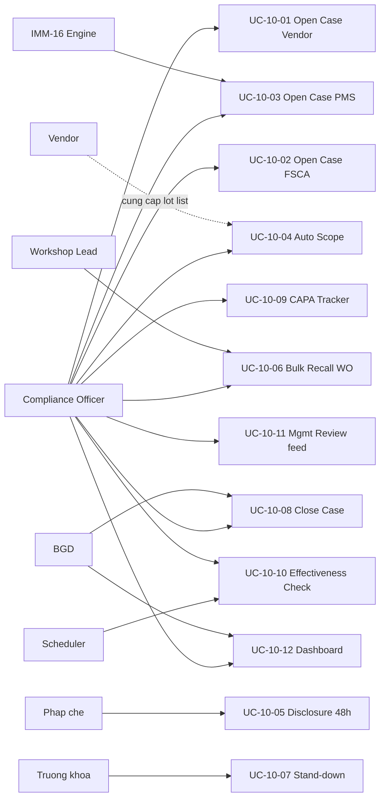
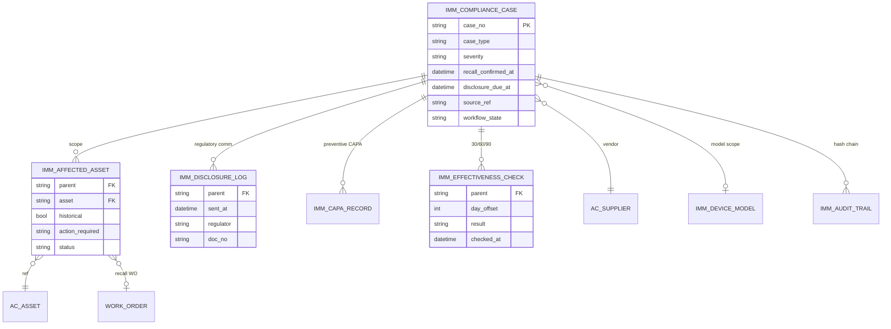
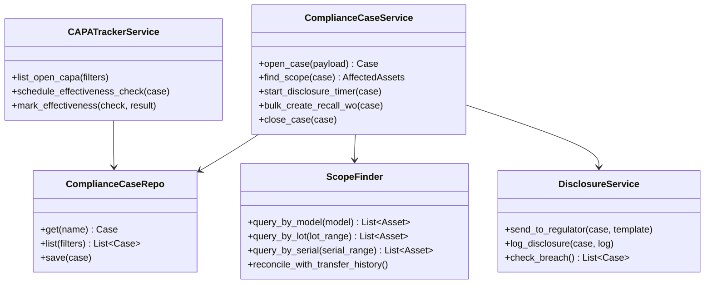
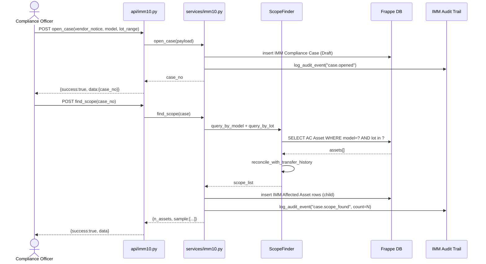
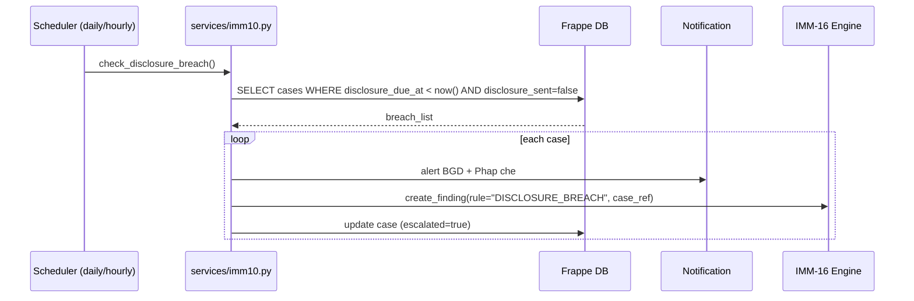
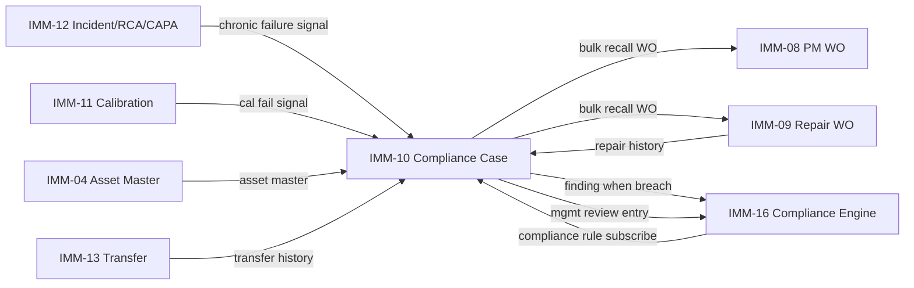
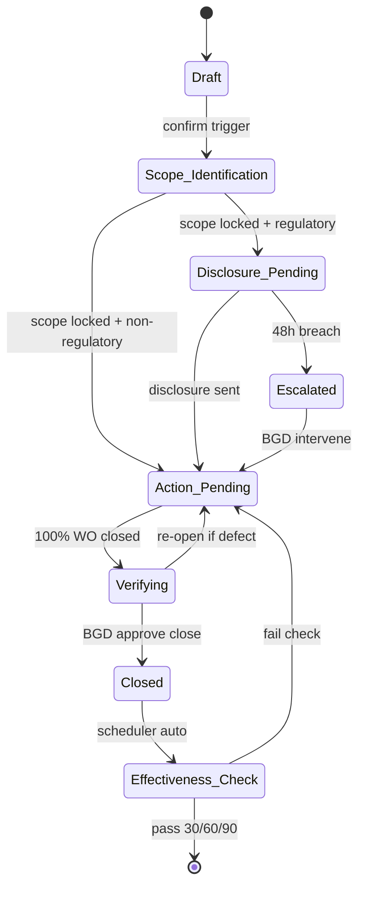
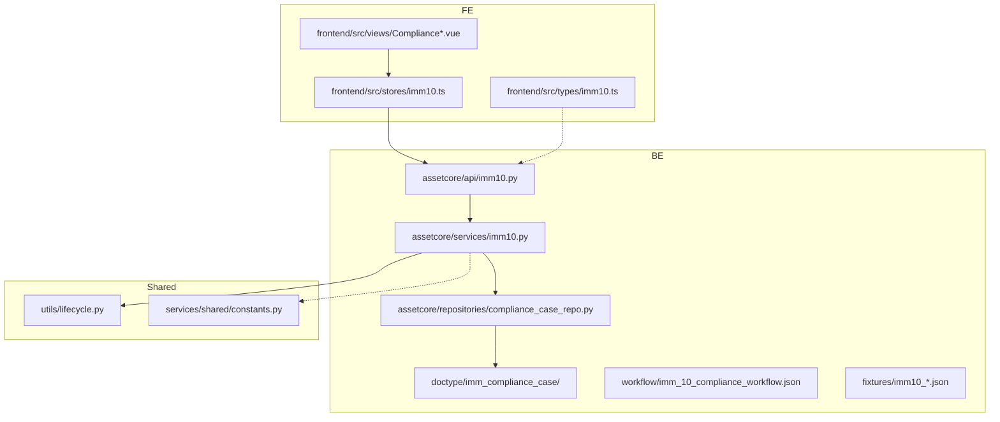

# IMM-10 — Diagrams

| Mục | Giá trị |
|---|---|
| Module | IMM-10 — Hậu kiểm và tuân thủ |
| Đợt | 3 |
| Trạng thái | In Progress (BE chưa scaffold — ERD/Class ở mức conceptual) |
| Cập nhật | 2026-05-10 |

> Diagram trong file này là **conceptual** dựa trên §I–§IV của `02_Analysis_Design.md`. Chi tiết entity/field sẽ được lock khi BE scaffold Sprint Wave 3.

---

## Hình 1 — Use Case Overview

*Hình 1 — Use Case overview module IMM-10.*

---

## Hình 2 — ERD (conceptual)

*Hình 2 — ERD conceptual. Field detail sẽ lock trong `04_Backend_Design.md` khi scaffold.*

> **Reuse**: `AC Asset`, `IMM Device Model`, `AC Supplier`, `IMM CAPA Record`, `IMM Audit Trail`, `Work Order` (PM hoặc Asset Repair) đã có trong codebase Wave 1/2. IMM-10 KHÔNG tạo mới các entity này.

---

## Hình 3 — Class Diagram (Service tầng)

*Hình 3 — Class diagram tầng service (3-tier theo CONVENTIONS §2). API layer wrap các method này.*

---

## Hình 4 — Sequence: Open Case + Auto Scope (UC-10-01 + UC-10-04)

*Hình 4 — Open + scope flow.*

---

## Hình 5 — Sequence: Disclosure 48h Timer (UC-10-05 + BR-10-05)

*Hình 5 — Disclosure breach detection và escalation sang IMM-16.*

---

## Hình 6 — Communication Diagram (Cross-module)

*Hình 6 — Trao đổi xuyên module. IMM-10 vừa là consumer (signal in) vừa là producer (recall WO out).*

---

## Hình 7 — State Machine: Compliance Case

*Hình 7 — State machine. Workflow JSON sẽ scaffold tại `04_Backend_Design.md` §III khi BE ready.*

---

## Hình 8 — Package Diagram

*Hình 8 — Package layout dự kiến (mirror IMM-09/IMM-12).*

---

*Cập nhật: 2026-05-10. Diagram conceptual — chi tiết khoá khi BE scaffold.*
