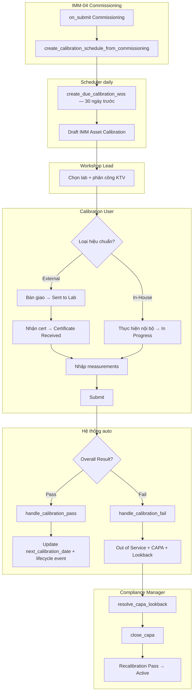
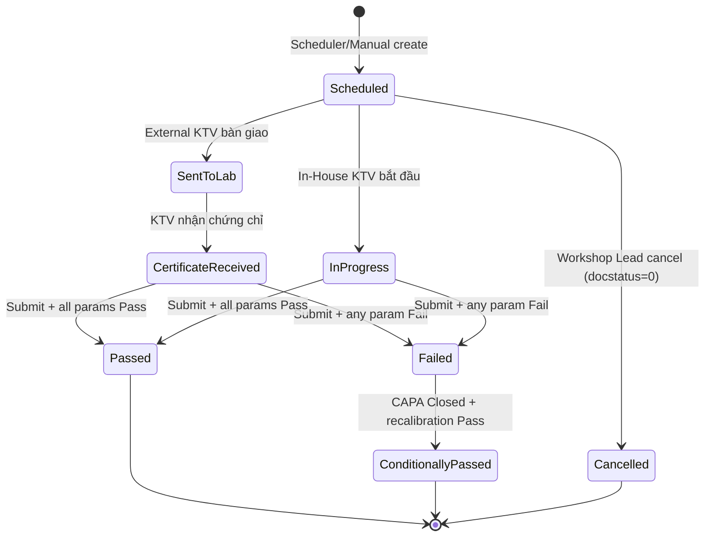

# 02 — Phân tích thiết kế nghiệp vụ (Analysis & Design)

| Mục | Giá trị |
|---|---|
| Module | IMM-11 — Hiệu chuẩn (Calibration) |
| Phạm vi | Per-module |
| Owner | BA + System Analyst |
| Liên kết | 03 Diagrams · 04 Backend · 05 API · 06 Frontend |
| Cập nhật | 2026-05-27 |
| Trạng thái | ✅ Live — service `assetcore/services/imm11.py` + API `assetcore/api/imm11.py` (18 endpoint) + DocType + Workflow + FE views đã deploy |

---

# Phần I — Module Overview

## I.0. Khảo sát hiện trạng

Hiện tại các bệnh viện công Việt Nam quản lý hiệu chuẩn thiết bị đo lường y tế chủ yếu bằng sổ tay và bảng tính Excel. Lịch hiệu chuẩn được lập định kỳ 12 tháng theo IFU/khuyến cáo nhà sản xuất, tuy nhiên không có cảnh báo tự động khi đến hạn — KTV phải tự rà sổ và liên hệ lab. Chứng chỉ ISO/IEC 17025 sau khi lab gửi về thường được lưu giấy hoặc PDF rời rạc trong folder phòng vật tư, gây khó khăn khi audit hoặc khi cần đối chiếu trace ngược (Lookback) một lô thiết bị cùng model.

Theo WHO HTM *Medical equipment maintenance programme overview* (chương 6.1 Inspection and preventive maintenance + Glossary "Calibration"), một chương trình calibration đầy đủ cần: (i) lập lịch theo interval của IFU, (ii) đo so với chuẩn quốc gia/quốc tế (traceability), (iii) ghi nhận kết quả Pass/Fail dựa trên tolerance, (iv) gắn corrective action khi Out-of-Tolerance. Hiện trạng thiếu (iii) và (iv) chính là pain point chính của module — phù hợp NĐ 98/2021 Điều 38–40.

*(Ghi chú: cần khảo sát baseline cụ thể tại site khách hàng — số % thiết bị đến hạn không có cảnh báo, số % chứng chỉ không truy xuất được — BA bổ sung trong sprint khảo sát.)*

## I.1. Pitch

IMM-11 giải quyết vấn đề bệnh viện không theo dõi được trạng thái hiệu chuẩn thiết bị đo lường y tế, dẫn đến sử dụng thiết bị ngoài dung sai mà không biết. Module tự động lập lịch, track bàn giao lab ISO/IEC 17025, tính kết quả Pass/Fail tức thì, và kích hoạt CAPA + Lookback bắt buộc khi thiết bị Fail — đảm bảo không thiết bị nào Fail vẫn tiếp tục sử dụng trên bệnh nhân.

## I.2. Vị trí trong WHO HTM lifecycle

| Phase | Liên quan |
|---|---|
| Needs | ✗ |
| Procurement | ✗ |
| Installation | ✓ — IMM-04 commissioning → tạo Calibration Schedule đầu tiên |
| Operation | ✓ — Track External (ISO 17025 lab) + In-House |
| Maintenance | ✓ — Recalibration sau sửa chữa (IMM-09) |
| Decommission | ✓ — Suspend Schedule khi asset Decommissioned (BR-11-06) |

## I.3. Stakeholders & Actors

| Vai trò | Người dùng thực | Quan tâm chính | Tần suất | Loại |
|---|---|---|---|---|
| Calibration Manager | Trưởng xưởng kỹ thuật | Lập lịch, chọn lab, monitor compliance | Hằng ngày | Primary |
| Calibration User | KTV hiệu chuẩn | Bàn giao thiết bị, nhập measurement, upload cert | Hằng ngày | Primary |
| Compliance Manager | Nhân viên QA | Review CAPA, Lookback findings, RCA | Hằng tuần | Approver |
| Calibration Manager | Quản lý vận hành | Dashboard, KPI, compliance report | Hằng tuần | Secondary |
| Calibration Manager | Trưởng phòng HTM | Nhận escalation overdue > 30 ngày | Khi cần | Auditor |
| Document Manager | Nhân viên lưu trữ | Read-only audit trail, chứng chỉ archive | Theo yêu cầu | Auditor |

## I.4. Scope

**In-scope:**
- Lập lịch hiệu chuẩn tự động từ IMM-04 commissioning
- Track External (ISO/IEC 17025 lab): bàn giao, certificate, nhập số liệu
- Track In-House (KTV nội bộ + reference standard)
- Auto Pass/Fail theo tolerance, CAPA bắt buộc + Lookback khi Fail
- Scheduler tạo WO 30 ngày trước hạn; alert overdue
- Compliance dashboard + KPI

**Out-of-scope:**
- Tích hợp API tự động với lab ngoài (defer IMM-15)
- OCR tự động certificate PDF
- Quản lý reference standard catalog
- Validation Metrology MRA cross-border (NĐ 130/2016 tham chiếu, chưa enforce)

**Assumptions:**
- IMM-00 Foundation đã implement xong (services, DocTypes, permissions)
- AC Supplier có field `iso_17025_certified` và `vendor_type = "Calibration Lab"`
- IMM Device Model có field `calibration_interval_days` và `calibration_required`

**Dependencies:**
- IMM-00 services: `create_capa`, `close_capa`, `log_audit_event`, `create_lifecycle_event`, `transition_asset_status`, `validate_asset_for_operations`, `get_sla_policy`
- IMM-04 Commissioning DocType (`on_submit` hook)
- IMM-09 Repair DocType (`on_submit` hook)

## I.5. KPI mục tiêu

| KPI | Định nghĩa | Baseline | Target | Đo ở đâu |
|---|---|---|---|---|
| Calibration Compliance Rate | Completed on time / Total scheduled × 100% | Chưa đo | ≥ 95% | IMM Asset Calibration |
| Out-of-Tolerance (OOT) Rate | Failed CAL / Total CAL × 100% | Chưa đo | < 5% | IMM Calibration Measurement |
| CAPA Closure Rate (30d) | Closed within 30d / Total opened × 100% | Chưa đo | ≥ 90% | IMM CAPA Record |
| Certificate Coverage | Assets with valid cert / Total calibratable assets | 0% | 100% | AC Asset + IMM Asset Calibration |
| Avg Days Sent → Cert Received | AVG(certificate_date − sent_date) | Chưa đo | ≤ 14 ngày | IMM Asset Calibration |

## I.6. Ràng buộc Compliance

| Quy định | Yêu cầu áp lên module | Doc tham chiếu |
|---|---|---|
| ISO/IEC 17025 | Lab hiệu chuẩn phải có chứng chỉ ISO/IEC 17025 (BR-11-01) | ISO/IEC 17025:2017 |
| ISO 13485:2016 | Fail → CAPA bắt buộc (§8.5.2); immutable record (§4.2.5); Lookback (§8.5.3) | ISO 13485:2016 |
| NĐ 98/2021/NĐ-CP | Hiệu chuẩn theo IFU (Điều 38); lab công nhận (Điều 39); immutable ≥ 7 năm (Điều 40) | NĐ 98/2021 |
| WHO HTM 2025 | Calibration interval (§5.4.2), measurement traceability (§5.4.4), Lookback (§5.4.6) | WHO HTM 2025 |
| ĐLVN standards | Quy trình hiệu chuẩn đo lường Việt Nam | ĐLVN cụ thể theo thiết bị |

## I.7. Risk & Open questions

| Risk | Likelihood | Impact | Giảm thiểu |
|---|---|---|---|
| Lab không có ISO 17025 cert còn hạn | Medium | High | BR-11-01 validate `iso_17025_cert_expiry` + nhắc nhở trước 30 ngày |
| KTV nhập sai measured_value dẫn đến Fail giả | Medium | High | Immutable sau Submit (BR-11-05); Amend với approval |
| Scheduler bỏ sót WO khi server down | Low | Medium | Idempotency check + retry ≤ 3 lần |
| Lookback gây quá tải khi nhiều asset cùng model | Low | Medium | Background job async; batch size limit 100 asset/run |

| Open question | Owner | Deadline |
|---|---|---|
| Reference standard catalog có cần DocType riêng? | BA + Tech Lead | Sprint 11.1 |
| Tolerance nhập thủ công hay lấy từ IFU/Device Model? | BA + QA Officer | Sprint 11.1 |

## I.8. Roadmap thực thi

| Sprint | Hạng mục | Owner | Status |
|---|---|---|---|
| 11.1 | DocType JSON (3) + custom fields AC Asset (3) | BE Lead | ✅ Done |
| 11.2 | Service layer `services/imm11.py` + IMM-00 integration | BE Lead | ✅ Done |
| 11.3 | API layer `api/imm11.py` + scheduler + hooks | BE Lead | ✅ Done |
| 11.4 | Workflow JSON (`imm_11_calibration_workflow.json`) + permission fixtures | BE Lead | ✅ Done |
| 11.5 | Frontend Vue (Dashboard, List, Create, Detail, Schedule) | FE Lead | ✅ Done |
| 11.6 | Test suite (`tests/test_imm11.py`) + UAT execution | QA | 🟡 Tests live; UAT pending |

---

# Phần II — Quy trình nghiệp vụ (Business Process)

## II.2. As-Is process

Hiện tại bệnh viện quản lý hiệu chuẩn bằng sổ tay và Excel. KTV gửi thiết bị ra lab theo lịch định kỳ, nhận chứng chỉ giấy và lưu vào folder. Không có cảnh báo tự động khi đến hạn, không có cơ chế tự động phát hiện thiết bị Fail tiếp tục sử dụng.

## II.3. Pain points

| # | Pain | Tác động |
|---|---|---|
| 1 | Không có cảnh báo tự động khi đến hạn calibration | Thiết bị quá hạn vẫn sử dụng → risk an toàn bệnh nhân |
| 2 | Chứng chỉ lưu file thủ công, không tra cứu được | Không pass audit + tốn thời gian tìm kiếm |
| 3 | Thiết bị Fail không có quy trình bắt buộc dừng hoạt động | Vi phạm ISO 13485:8.5.2 + NĐ98 |
| 4 | Không có Lookback assessment khi 1 thiết bị Fail | Risk lan rộng sang thiết bị cùng model không được phát hiện |

## II.4. To-Be process



## II.5. Decision points

| Điểm | Câu hỏi | Quy tắc |
|---|---|---|
| D1 | External hay In-House? | `calibration_type` từ Device Model default; Workshop Lead override |
| E1 | Pass hay Fail? | `overall_result = Failed` nếu bất kỳ `measurement.out_of_tolerance = True` |
| Gate tạo WO | Asset có thể calibrate không? | `validate_asset_for_operations()` — block nếu OOS/Decommissioned (trừ `is_recalibration=1`) |

## II.6. Process metrics

| Metric | Mục tiêu | Đo ở đâu |
|---|---|---|
| Time-to-assignment (Scheduled → KTV được phân công) | < 3 ngày làm việc | `IMM Asset Calibration.modified` diff |
| % Calibration đúng hạn (on-time rate) | ≥ 95% | KPI Calibration Compliance Rate (xem I.5) |
| Avg ngày Sent → Certificate Received | ≤ 14 ngày | Diff `sent_date` vs `certificate_date` |
| % Pass first-time (không qua recalibration) | ≥ 90% | `overall_result = Passed` / Total |
| % CAPA closed trong 30 ngày | ≥ 90% | KPI CAPA Closure Rate |

## II.7. RACI matrix

| Hoạt động | Workshop Lead | KTV | QA Officer | System |
|---|---|---|---|---|
| Tạo Calibration Schedule | R/A | C | I | — |
| Phân công KTV | R/A | I | — | — |
| Bàn giao thiết bị ra lab | C | R/A | — | — |
| Nhập measurements | C | R/A | — | — |
| Submit kết quả | A | R | I | — |
| Auto tạo CAPA khi Fail | I | I | I | R/A |
| Resolve lookback | A | C | R | — |
| Close CAPA | A | — | R | — |

## II.8. Exception flow

- **EF-01 — Lab trả chứng chỉ không đạt định dạng (cert thiếu accreditation number)**: KTV không submit được do BR-11-01. Hành động: lập biên bản, yêu cầu lab cấp lại; trạng thái CAL giữ ở `Certificate Received` cho đến khi nhận cert hợp lệ.
- **EF-02 — Lab phá sản/mất ISO 17025 trong khi đang giữ thiết bị**: Workshop Lead cần tracking + escalation để chuyển lab khác. *(BA bổ sung playbook chi tiết trong sprint kế tiếp)*
- **EF-03 — Concurrent edit cùng 1 CAL record**: optimistic lock → `CONFLICT` (xem EC-11-03). User được prompt reload và nhập lại.

## II.9. So sánh As-Is vs To-Be

| Khía cạnh | As-Is (Excel/sổ giấy) | To-Be (AssetCore IMM-11) |
|---|---|---|
| Lập lịch | Thủ công, dễ quên | Auto từ IMM-04 commissioning + scheduler 30 ngày trước hạn |
| Cảnh báo đến hạn | Không có | Dashboard Due Soon + Overdue, escalation > 30 ngày |
| Pass/Fail | Đọc cert giấy, ghi sổ | Auto tính theo tolerance, immutable record |
| Out-of-Tolerance handling | Phụ thuộc nhân viên nhớ | Bắt buộc CAPA + chuyển Out of Service + Lookback cùng model |
| Audit | Tìm folder giấy | SHA-256 hash chain, truy xuất ≥ 7 năm |
| Compliance NĐ98/ISO 13485 | Khó chứng minh | Trace đầy đủ qua Lifecycle Event + Audit Trail |

## II.10. Activity diagram per UC chính

*(Bổ sung — vẽ Activity diagram chi tiết cho ≥ 4 UC chính. Hiện tại module đã render BPMN swimlane (II.4) và state machine (IV.3); Activity diagram per UC sẽ vẽ trong file `03_Diagrams.md` §III để tránh trùng. Tham chiếu UC-05, UC-06, UC-08, UC-09. BA bổ sung trong sprint review docs.)*

---

# Phần III — Use Case Specification

## III.1.a. Biểu đồ use case tổng quát

```
[Workshop Lead] ---> (UC-01 Lập lịch calibration)
[Workshop Lead] ---> (UC-02 Phân công KTV)
[KTV] ---> (UC-03 Bàn giao thiết bị External)
[KTV] ---> (UC-04 Nhận certificate)
[KTV] ---> (UC-05 Nhập kết quả đo)
[KTV] ---> (UC-06 Submit kết quả)
[System] ---> (UC-07 Auto Pass handling)
[System] ---> (UC-08 Auto Fail handling — CAPA + OOS + Lookback)
[QA Officer] ---> (UC-09 Resolve lookback)
[QA Officer] ---> (UC-10 Close CAPA)
[Scheduler] ---> (UC-11 Tạo CAL WO tự động)
[Scheduler] ---> (UC-12 Cập nhật calibration_status)
(UC-06) ..> (UC-07) : <<include>> [result=Pass]
(UC-06) ..> (UC-08) : <<include>> [result=Fail]
(UC-08) ..> (UC-09) : <<extend>> [lookback required]
```

## III.1.b. Biểu đồ use case phân rã (theo nhóm chức năng)

Module có 12 UC chính → tách thành 3 nhóm phân rã, mỗi nhóm ≤ 6 UC:

**Nhóm 1 — Planning & Assignment (Workshop Lead)**: UC-01 Lập lịch, UC-02 Phân công KTV, UC-11 Scheduler tự động tạo WO, UC-12 Cập nhật calibration_status.

**Nhóm 2 — Execution (Calibration User)**: UC-03 Bàn giao thiết bị External, UC-04 Nhận certificate, UC-05 Nhập kết quả đo, UC-06 Submit kết quả.

**Nhóm 3 — Post-result Automation & QA**: UC-07 Auto Pass handling (System), UC-08 Auto Fail handling — CAPA + OOS + Lookback (System), UC-09 Resolve lookback (QA Officer), UC-10 Close CAPA (QA Officer).

*(Diagram render chi tiết per nhóm — bổ sung vào file `03_Diagrams.md` để tránh trùng với III.1.a tổng quát.)*

## III.2. Actor catalog

| Actor | Loại | Mô tả | Goal chính |
|---|---|---|---|
| Calibration Manager | Primary | Trưởng xưởng kỹ thuật, owner lịch hiệu chuẩn | Đảm bảo 100% thiết bị có lịch + cert hợp lệ |
| Calibration User | Primary | Kỹ thuật viên hiệu chuẩn nội bộ / handler external | Hoàn thành WO đúng hạn, nhập số liệu đúng |
| Compliance Manager | Approver | Nhân viên QA phụ trách CAPA + Lookback | Đảm bảo Fail không lan rộng, đóng CAPA đúng quy trình |
| Calibration Manager | Secondary | Quản lý vận hành — đọc dashboard, KPI | Theo dõi compliance rate + OOT rate |
| Calibration Manager | Auditor | Trưởng phòng HTM — nhận escalation > 30 ngày overdue | Pass audit NĐ98 + ISO 13485 |
| Document Manager | Auditor | Read-only audit trail, archive chứng chỉ | Truy xuất hồ sơ ≥ 7 năm |
| Calibration Lab (External) | External | Lab ISO/IEC 17025 nhận thiết bị, trả cert | (Out-of-system) Cấp cert đúng định dạng |
| Scheduler | System | Frappe scheduler chạy hằng ngày | Tự động tạo CAL WO 30 ngày trước hạn |
| AssetCore System | System | Engine xử lý on_submit Pass/Fail | Auto trigger CAPA + Lookback + Lifecycle Event |

## III.3. Use Case Specifications

### UC-05: Nhập kết quả đo lường

| Mục | Giá trị |
|---|---|
| ID | UC-IMM11-05 |
| Brief | KTV nhập giá trị đo từng tham số; hệ thống tự tính Pass/Fail |
| Primary actor | Calibration User |
| Pre-condition | `IMM Asset Calibration` ở trạng thái `Certificate Received` hoặc `In Progress` |
| Post-condition | `measurements` đầy đủ; `overall_result` được tính |
| Trigger | KTV nhận chứng chỉ hoặc hoàn thành đo nội bộ |

#### Main flow
| Bước | Actor | System |
|---|---|---|
| 1 | KTV mở `IMM Asset Calibration` | Hiển thị MeasurementTable |
| 2 | KTV nhập `measured_value` cho từng tham số | Tự tính `out_of_tolerance = deviation > tol` |
| 3 | KTV xem kết quả realtime (Pass/Fail/Warn) | Cập nhật `overall_result` |
| 4 | KTV xác nhận và chuyển sang Submit | — |

#### Exception E1 — measured_value null
- 4a. Hệ thống block submit với `ServiceError(VALIDATION, "Tham số {name} chưa có giá trị đo")`

### UC-06: Submit kết quả hiệu chuẩn

| Mục | Giá trị |
|---|---|
| ID | UC-IMM11-06 |
| Brief | KTV submit phiếu hiệu chuẩn, kích hoạt automation Pass/Fail |
| Primary actor | Calibration User |
| Pre-condition | Mọi `measured_value` đã nhập; External: có `certificate_file` và `lab_accreditation_number` |
| Post-condition | DocType submittable (docstatus=1); asset cập nhật; CAPA tạo nếu Fail |
| Trigger | KTV click "Submit" |

#### Main flow — Pass
| Bước | Actor | System |
|---|---|---|
| 1 | KTV click Submit | `before_submit`: set `actual_date` |
| 2 | — | `on_submit`: `handle_calibration_pass()` |
| 3 | — | Update `AC Asset.next_calibration_date = cert_date + interval` |
| 4 | — | `create_lifecycle_event("calibration_completed")` + `log_audit_event()` |

#### Alternative A1 — Fail path
- 2a. `on_submit`: `handle_calibration_fail()`: transition Asset → Out of Service + `create_capa()` + `perform_lookback_assessment()`

#### Exception E1 — External thiếu certificate
- 1a. Block: `ServiceError(VALIDATION, "Vui lòng upload Calibration Certificate (BR-11-01)")`

## III.4. Use Case relationships

**`<<include>>` — caller bắt buộc gọi:**

| Caller UC | Included UC | Lý do bắt buộc |
|---|---|---|
| UC-06 Submit kết quả | UC-07 Auto Pass handling | Khi `overall_result = Passed`, system bắt buộc chạy `handle_calibration_pass()` |
| UC-06 Submit kết quả | UC-08 Auto Fail handling | Khi `overall_result = Failed`, system bắt buộc chạy `handle_calibration_fail()` |
| UC-08 Auto Fail handling | UC-10 (CAPA creation step) | Fail → bắt buộc tạo CAPA (BR-11-02) |

**`<<extend>>` — chạy khi điều kiện thỏa:**

| Base UC | Extending UC | Điều kiện kích hoạt |
|---|---|---|
| UC-08 Auto Fail handling | UC-09 Resolve lookback | Khi có ≥ 1 asset cùng `device_model` đang Active (BR-11-03) |
| UC-11 Scheduler tạo WO | UC-12 Cập nhật calibration_status | Khi asset chuyển trạng thái `Overdue` (> due_date) |

## III.5. UC ↔ User Story mapping

| Use Case | User Story ID | Note |
|---|---|---|
| UC-01 Lập lịch | US-11-01 | Workshop Lead xem & lập kế hoạch |
| UC-05/06 Nhập + Submit | US-11-02 | Auto Pass/Fail real-time |

*(Mapping đầy đủ — BA bổ sung khi viết hết US-11-03 → US-11-NN.)*

---

# Phần IV — Functional Specifications

## IV.1. User Stories & Acceptance Criteria

### US-11-01: Xem danh sách thiết bị đến hạn

**Là** Workshop Lead, **tôi muốn** xem danh sách thiết bị đến hạn calibration trong 30 ngày, **để** lên kế hoạch không bỏ sót.

| Priority | Must |
|---|---|
| AC-01 | Given asset có active `Schedule.next_due_date` trong `[today, today+30]` (SoT BR-11-08), When Workshop Lead xem dashboard, Then thiết bị xuất hiện trong danh sách "Due Soon" |
| AC-02 | Given asset có active `Schedule.next_due_date < today`, When xem, Then hiển thị "Overdue" với số ngày quá hạn |
| AC-11-11 | Given asset chỉ-có-schedule (`AC Asset.next_calibration_date` NULL) nhưng `Schedule.next_due_date < today`, When xem, Then asset được đếm Overdue ở CẢ dashboard VÀ IMM-11 KPI/drill (count == drill, BR-11-08) |
| AC-11-12 | Given `AC Asset.calibration_status = Overdue` và lịch DUY NHẤT của asset bị `is_active=0` (hoặc bị xóa) → rollup map không còn chứa asset, When `check_calibration_expiry()` chạy, Then `calibration_status ∈ {Not Required, ''}` (KHÔNG còn badge `Overdue`/`Due Soon` cũ). BR-11-10 |
| AC-11-13 | Given asset đã `handle_calibration_fail` (`calibration_status = Calibration Failed`, `lifecycle_status = Out of Service`, CAPA mở) còn active schedule overdue, When `check_calibration_expiry()` chạy, Then `calibration_status` GIỮ `Calibration Failed` (KHÔNG ghi đè về On Schedule/Due Soon/Overdue). BR-11-11 |
| AC-11-14 | (giữ hành vi đúng) Given asset đang `Calibrating`, When recal/cal Pass submit, Then restore `Calibrating → Active`; ghi ALE `calibration_passed` from=Calibrating to=Active. BR-11-12 (nhánh Calibrating KHÔNG đổi) |
| AC-11-15 | (cal-fail của CHÍNH nó) Given asset `Out of Service` do calibration fail trước (ALE mới nhất vào OoS có `root_doctype='IMM Asset Calibration'`) + KHÔNG còn hold khác, When recal Pass, Then restore `OoS → Active`; ghi ALE `calibration_passed` to=Active. BR-11-12 |
| AC-11-16 | (OoS do module khác) Given asset `Out of Service` do Incident (IMM-12) HOẶC Repair (IMM-09) HOẶC PM-finding (IMM-08), When recal Pass, Then GIỮ `Out of Service` (KHÔNG ép Active); ghi 1 ALE `calibration_passed` from=OoS to=OoS + note `giữ Ngừng hoạt động do hạng mục khác (<nguồn>)`. BR-11-12 |
| AC-11-17 | (hold đồng thời) Given asset OoS do cal-fail NHƯNG còn ≥1 Incident mở / Repair WO mở / PM WO OoS-finding mở, When recal Pass, Then GIỮ OoS (không restore) + hold-note nêu hold còn lại. BR-11-12 |
| AC-11-18 | (no-raise / idempotent / grep-guard) Given recal Pass nhánh restore-guard, Then KHÔNG BAO GIỜ raise `InvalidAssetTransition` (kể cả asset đã Decommissioned giữa chừng) → on_submit Pass luôn đóng được; chạy lại cùng cal Pass KHÔNG tạo ALE `activated` trùng; transition to=Active từ OoS CHỈ xảy ra sau khi qua `_can_restore_from_oos(asset, cal)` (0 nhánh nào ép Active từ OoS bỏ qua predicate). BR-11-12 |
| AC-11-19 | (FAIL → due-now) Given asset có active schedule (`is_active=1`) với `Schedule.next_due_date` **tương lai** (vd today+200) và `calibration_status` đang ON_SCHEDULE (asset KHÔNG trong overdue/due-soon set), When submit IMM Asset Calibration với `overall_result = Fail`, Then MỌI active schedule của asset có `next_due_date == basis` (`certificate_date \| actual_date \| nowdate()`) `<= today` → asset xuất hiện trong `_overdue_asset_ids()` HOẶC `_due_soon_asset_ids()`, KHÔNG còn ON_SCHEDULE; `get_calibration_kpis`/`get_dashboard` đếm asset vào overdue-or-due, con số == drill `?overdue=1`/`?due_soon=1`. BR-11-08b |
| AC-11-20 | (idempotent / null-safe / khép-kín) Given asset FAIL KHÔNG có schedule active → `handle_calibration_fail` no-op trên schedule (KHÔNG raise, vẫn tạo CAPA+Incident+lookback); AND Given asset đã due-now sau FAIL, When recalibration Pass sau đó, Then `next_due_date` advance lại = `basis + interval` (tương lai) → asset RỜI nhóm overdue/due-soon, trở lại ON_SCHEDULE. BR-11-08b + BR-11-04 |
| AC-11-21 | (PASS multi-schedule rollup — BUG CHÍNH) Given asset X có 2 active schedule: A (`next_due_date` quá khứ = OVERDUE) + B (đang Pass), When `handle_calibration_pass(B)`, Then (1) schedule B advance `next_due_date = basis + interval` (BR-11-04 bất biến); (2) **`AC Asset.calibration_status == 'Overdue'`** (KHÔNG `On Schedule` — rollup worst-of OVERDUE>DUE_SOON>ON_SCHEDULE TỪ MỌI active schedule), KHỚP `_calibration_status_asset_ids()[X]`; (3) **`AC Asset.next_calibration_date == MIN(next_due_date)` trên MỌI active schedule** (= ngày của A, KHÔNG phải next của B); (4) asset X VẪN nằm trong `get_due_calibrations(days=30).items` (KHÔNG rớt do cache bị đẩy tương lai). BR-11-13 |
| AC-11-22 | (ROLLUP-CONSISTENCY / idempotent với scheduler) Given asset X multi-schedule sau `handle_calibration_pass(B)`, When `check_calibration_expiry()` chạy NGAY sau, Then `AC Asset.calibration_status` KHÔNG đổi (giá trị PASS-rollup == giá trị scheduler-rollup cho cùng asset) → no flip-flop badge, no notify spam; `_reconcile_calibration_status` thấy `new == old` → skip ghi. BR-11-13 |
| AC-11-23 | (HAPPY-PATH 1-schedule bất biến) Given asset chỉ 1 active schedule, When Pass, Then `calibration_status == 'On Schedule'` và `next_calibration_date == add_days(basis, interval)` (= rollup MIN trên 1 schedule = chính schedule đó) → hành vi cũ giữ NGUYÊN 100%; ALE `calibration_passed` + `CalibrationRepo.next_calibration_date` + restore-guard 3-nhánh (BR-11-12) BẤT BIẾN. BR-11-13 + BR-11-04 + BR-11-12 |
| AC-11-24 | (record-flag OVERDUE / DUE_SOON / beyond / None) Given `get_calibration(cal)`: (a) `next_calibration_date < ngày-server-hôm-nay` → `is_overdue==1` ∧ `is_due_soon==0`; (b) `next_calibration_date ∈ [hôm-nay, hôm-nay + CAL_DUE_SOON_WINDOW_DAYS]` → `is_due_soon==1` ∧ `is_overdue==0`; (c) `next_calibration_date > hôm-nay+window` HOẶC `None` → cả hai cờ `==0`. Cờ là int 0/1 derived server-side. BR-11-14 |
| AC-11-25 | (list mỗi row có cờ + parity list==detail) Given `list_calibrations`, When trả rows, Then MỖI row có `is_overdue`/`is_due_soon` (int 0/1); và với cùng bản ghi X tại CÙNG ref-date, `row-X.{is_overdue,is_due_soon} == get_calibration(X).{is_overdue,is_due_soon}` (INV-CALFLAG-1, kiểu INV-SLA-5). BR-11-14 |
| AC-11-26 | (shared predicate / no-requery / no client-clock) Given cả 2 endpoint, Then dùng CHUNG helper `is_calibration_overdue`/`is_calibration_due_soon` (KHÔNG re-implement predicate); KHÔNG thêm query DB (`next_calibration_date` đã trong `fields`/`as_dict`); KHÔNG thêm field web-only; KHÔNG consumer nào so `next_calibration_date` với client-clock (grep FE/consumer = 0). BR-11-14 |

### US-11-02: Auto Pass/Fail khi nhập measurement

**Là** Calibration User, **tôi muốn** nhập tham số đo và hệ thống auto tính Pass/Fail, **để** loại bỏ tính toán thủ công.

| Priority | Must |
|---|---|
| AC-01 | Given `nominal=7.5, tol±3%, measured=7.6`, When KTV nhập, Then `pass_fail=Pass`, `out_of_tolerance=False` |
| AC-02 | Given `nominal=7.5, tol±3%, measured=8.0`, When KTV nhập, Then `pass_fail=Fail`, `out_of_tolerance=True` |

### US-11-03: Lưu bảng đo trên web KHÔNG mất dữ liệu (child-diff qua `update_calibration`)

**Là** Calibration User nhập phép đo trên web, **tôi muốn** khi bấm "Lưu" (`updateCalibration` gửi mảng `measurements`) thì N dòng đo được PERSIST và server tự chấm Pass/Fail, **để** dữ liệu KTV nhập không bốc hơi và verdict không bị client giả mạo.

| Priority | Must |
|---|---|
| AC-11-34 | (RED-first / data-loss) Given phiếu draft (`docstatus=0`, status ∈ ACTIVE), When `update_calibration(name, {measurements:[N dòng]})`, Then `get_calibration(name).measurements` trả **ĐÚNG N dòng** với `measured_value`/`nominal_value`/`tolerance_positive`/`tolerance_negative` đã nhập (KHÔNG còn 0 dòng — dữ liệu KTV KHÔNG bốc hơi). BR-11-16 |
| AC-11-35 | (SSoT server-compute — KHÔNG tin client) Given 1 dòng `nominal=7.5, tol±3%, measured=8.0` mà client CỐ gửi `pass_fail='Pass'`/`out_of_tolerance=0`, When lưu, Then reload dòng đó có `pass_fail='Fail'` ∧ `out_of_tolerance=1` (server tính bằng CÙNG luật `_compute_measurement_results` với `add_measurement`; client-supplied pass_fail/out_of_tolerance BỊ STRIP). BR-11-16 |
| AC-11-36 | (replace-set — count==payload) Given phiếu đang có 3 dòng, When lưu `measurements` = 2 dòng (bỏ 1), Then reload = **2 dòng** (dòng bị bỏ khỏi payload → remove); Given lưu 4 dòng → reload = 4 dòng. Reload count == payload count. BR-11-16 |
| AC-11-37 | (guard submit — 409, KHÔNG mutate) Given phiếu `docstatus=1` (đã submit), When `update_calibration(name, {measurements:[...]})`, Then `nthrow IMM11_ALREADY_SUBMITTED` (HTTP-200 + Error envelope, `http_status=409`); `measurements` KHÔNG bị mutate (số dòng + giá trị GIỮ NGUYÊN). BR-11-16 |
| AC-11-38 | (guard status không-editable — 409) Given phiếu `docstatus=0` nhưng `status ∈ {Cancelled, Passed, Failed, Conditionally Passed}` (ngoài ACTIVE_STATUSES), When gửi `measurements`, Then `nthrow IMM11_MEASUREMENTS_NOT_EDITABLE` (HTTP-200 + Error, `http_status=409`); child table KHÔNG đổi. BR-11-16 |
| AC-11-39 | (backward-compat 100%) Given patch KHÔNG có key `measurements` (chỉ scalar, vd `{technician_notes:'x'}`), When `update_calibration`, Then hành vi **Y HỆT** hôm nay (scalar-only qua `_UPDATE_ALLOWED`, `{name,status}` return, 0 regression caller cũ); AND Given patch CHỈ có `measurements` (0 scalar), Then KHÔNG `nthrow IMM11_NO_FIELDS` (sự hiện diện key `measurements` = 1 mutation hợp lệ). BR-11-16 |
| AC-11-40 | (idempotent replay — replace-set) Given lưu CÙNG mảng `measurements` (N dòng) 2 lần liên tiếp trên cùng phiếu draft, Then reload vẫn = N dòng (replace-set tự idempotent — KHÔNG nhân đôi như append của `add_measurement`); KHÔNG cần `client_request_id`. BR-11-16 |
| AC-11-41 | (replay THẮNG state-guard) Given `submit_calibration(name, client_request_id=K)` gọi lần 1 thành công (`docstatus→1`), When gọi LẦN 2 CÙNG `K`, Then trả success **byte-đối-byte** `{name,status,overall_result,next_calibration_date}` (== lần 1), **KHÔNG** raise `IMM11_ALREADY_SUBMITTED`, `docstatus` GIỮ 1, KHÔNG re-run business-logic (KHÔNG double `_lockstep`/ALE/on_submit). BR-11-17 |
| AC-11-42 | (NO-OP backward-compat) Given `submit_calibration(name)` gọi 2 lần **KHÔNG khoá** (header vắng + body `client_request_id` rỗng), When lần 2, Then raise `IMM11_ALREADY_SUBMITTED` (hành vi web-desk/client-cũ Y HỆT hôm nay). BR-11-17 |
| AC-11-43 | (dedup CHỈ replay đúng-khoá) Given lần 1 `K1` thành công, When lần 2 `K2` KHÁC (`K2≠K1`), Then raise `IMM11_ALREADY_SUBMITTED` (KHÔNG nuốt câm re-submit khác khoá — chống dedup quá rộng). BR-11-17 |
| AC-11-44 | (source-precedence) Given body `client_request_id=Kb` VÀ header `X-Idempotency-Key=Kh` (Kb≠Kh), When 2 call, Then dedup theo **Kb** (body THẮNG header, qua SHARED `resolve_idempotency_key`); header-only (body rỗng) → dedup theo header. BR-11-17 |
| AC-11-45 | (not-found intact) Given phiếu `∄`, When `submit_calibration(name=∄, client_request_id=K)`, Then raise `IMM11_CAL_NOT_FOUND` (pre-check MISS → get → not-found, KHÔNG bị dedup che). BR-11-17 |
| AC-11-46 | (no-migrate / response-shape bất biến) dedup dùng `frappe.cache()` TTL 86400s — 0 DocType/DocField mới ⇒ KHÔNG `bench migrate`; `SubmitCalibrationResponse` 4-key GIỮ NGUYÊN; `oas_baseline.BASELINE_TOTAL` GIỮ (0 whitelist mới). BR-11-17 |
| AC-11-47 | (CERTGUARD — chặn + vết nguyên trạng) Given phiếu **External** `status='In Progress'` hậu-`receive_certificate` (`certificate_file` đã set, `sent_date=D0`), When `send_to_lab(name)`, Then raise `IMM11_SEND_LAB_ALREADY_CERTIFIED` (**HTTP-200 + Error envelope**, `body.message_code='IMM11-SEND-LAB-ALREADY-CERTIFIED'`, `http_status=409`); đọc lại DB xác nhận `sent_date==D0` ∧ `certificate_file` ∧ `status` **KHÔNG đổi** (vết NĐ98 nguyên trạng — 0 mutate). BR-11-18 |
| AC-11-48 | (regression — KHÔNG chặn luồng hợp lệ) Given phiếu **External** `status='Scheduled'` (`certificate_file` **rỗng**), When `send_to_lab(name)`, Then thành công → reload `status='Sent to Lab'` ∧ `sent_date` được set (guard `certificate_file`-presence KHÔNG chặn phiếu chưa-có-chứng-chỉ). BR-11-18 |

### US-11-04: Dời lịch hiệu chuẩn mà không đẻ phiếu rác vào hồ sơ tuân thủ (AC-CR-86)

**Là** Trưởng nhóm hiệu chuẩn / KTV hiệu chuẩn, **tôi muốn** dời ngày hẹn của một phiếu hiệu chuẩn đã lên lịch (kèm lý do), **để** lịch phản ánh đúng thực tế mà **không** phải hủy + tạo lại phiếu — thao tác vốn đẻ phiếu `Cancelled` rác vào hồ sơ NĐ98 và làm đứt lịch sử phiếu.

| Priority | Must |
|---|---|
| AC-11-49 | (happy-path — ngày đổi, trạng thái GIỮ) Given phiếu `status='Scheduled'`, `scheduled_date=X`, When `reschedule_calibration(name, new_date=X+7, reason='Phòng mổ trưng dụng thiết bị')`, Then **đọc lại từ DB**: `scheduled_date == X+7` ∧ `status == 'Scheduled'` (**KHÔNG flip**) ∧ `docstatus == 0`; response `data == {name, old_date: X, new_date: X+7, status: 'Scheduled'}`. BR-11-19 |
| AC-11-50 | (In Progress cũng dời được) Given phiếu `status='In Progress'`, When dời lịch hợp lệ, Then `scheduled_date` đổi ∧ `status == 'In Progress'` (KHÔNG rơi về `Scheduled`). BR-11-19 |
| AC-11-51 | (VẾT AUDIT — đếm được, truy được) Given dời lịch **2 lần** trên cùng phiếu, Then `frappe.get_all('IMM Audit Trail', filters={ref_doctype:'IMM Asset Calibration', ref_name:<phiếu>, event_type:'Calibration'})` **tăng ĐÚNG 2**; mỗi `change_summary` chứa **cả** ngày cũ, ngày mới **và** lý do; `actor == frappe.session.user`; `amendment_reason` chứa **2 dòng** `[Dời lịch <old> → <new>]: <reason>` (append, nội dung cũ KHÔNG bị ghi đè). AND số phiếu `IMM Asset Calibration` có `status='Cancelled'` sinh thêm == **0**. BR-11-19 |
| AC-11-52 | (guard trạng thái — SSoT + KHÔNG mutate) Given phiếu `status ∈ {Sent to Lab, Certificate Received, Passed, Failed, Conditionally Passed, Cancelled}` HOẶC `docstatus==1`, When dời lịch, Then lỗi **in-envelope** (HTTP-200, `success:false`, `code=='BAD_STATE'`, `http_status==409`) **VÀ** đọc lại DB `scheduled_date` **BẰNG GIÁ TRỊ CŨ** (assert bằng giá trị, KHÔNG chỉ bằng exception). BR-11-19 |
| AC-11-53 | (validate `reason` — field-level) Given `reason` rỗng hoặc `'  abc '` (< 5 ký tự sau strip), When dời lịch, Then 422 in-envelope với `fields` chứa khoá **`reason`** (không phải khoá khác), và `scheduled_date` KHÔNG đổi. BR-11-19 |
| AC-11-54 | (validate `new_date` — rỗng/không parse được) Given `new_date=''` hoặc `'32/13/2026'`, Then 422 in-envelope với `fields` chứa khoá **`new_date`**; 0 ghi DB. BR-11-19 |
| AC-11-55 | (chống quá-hạn GIẢ) Given `new_date = today - 1`, Then 422 in-envelope `fields=['new_date']`; `scheduled_date` KHÔNG đổi. (Cho phép `new_date == today`.) BR-11-19 |
| AC-11-56 | (cap-gate ở SERVICE, 403 in-envelope) Given user base `AssetCore System User` (KHÔNG có `calibration.write`), When gọi **THẲNG service** `reschedule_calibration(...)`, Then `ServiceError(code='FORBIDDEN', http_status=403)` — envelope, KHÔNG `PermissionError` thô; `scheduled_date` KHÔNG đổi. Given Super Admin → pass. BR-11-19 |
| AC-11-57 | (2 nguồn tuân thủ BẤT ĐỘNG) Given asset có `AC Asset.next_calibration_date = D1` và `IMM Calibration Schedule.next_due_date = D2` (is_active=1), When dời lịch phiếu, Then đọc lại **cả 2 field**: `== D1` và `== D2` (KHÔNG đổi) ⇒ thiết bị quá hạn vẫn quá hạn trên `get_due_calibrations`. BR-11-19 |
| AC-11-58 | (bịt nhánh nuốt im lặng) Given phiếu draft, When `update_calibration(name, {'scheduled_date': X+7})` **hoặc** `{'technician_notes':'x', 'scheduled_date': X+7}`, Then **KHÔNG** trả success — 422 in-envelope, `fields` chứa `scheduled_date`, thông điệp VI trỏ sang «Dời lịch hiệu chuẩn»; đọc lại DB `scheduled_date` **KHÔNG đổi** ∧ `technician_notes` **KHÔNG đổi** (0 ghi từng phần). BR-11-20 |
| AC-11-59 | (regression BẤT BIẾN `_UPDATE_ALLOWED`) Given patch chỉ gồm khoá ∈ `_UPDATE_ALLOWED` (`status` / `actual_date` / `certificate_number` / `technician_notes` / `measurements` …), When `update_calibration`, Then hành vi **Y HỆT** trước CR (success + ghi đủ + return-shape 4-key KHÔNG đổi); AND khoá lạ **khác** `scheduled_date` VẪN bị bỏ qua im lặng (KHÔNG siết thêm — né Hyrum-break web-FE). BR-11-20 |
| AC-11-60 | (cờ đọc `can_reschedule` — display == enforcement) Given `get_calibration(name)`, Then trả `can_reschedule` (boolean) == `(status ∈ RESCHEDULE_CAL_STATES ∧ docstatus==0 ∧ rbac.can('calibration.write'))`; với **mọi** cặp (status × cap) test, cờ TRUE ⟺ `reschedule_calibration` KHÔNG trả `BAD_STATE`/`FORBIDDEN` (parity 2 chiều, chống nút chết + chống nút ẩn oan). BR-11-19 |

## IV.2. Business Rules

| ID | Rule | Implement ở | Liên kết test |
|---|---|---|---|
| BR-11-01 | External: lab ISO 17025 + cert + accreditation số bắt buộc | `IMMAssetCalibration.validate()` | AC-11-03, AC-11-04 |
| BR-11-02 | Fail → Out of Service + CAPA bắt buộc (+ Schedule due-now BR-11-08b) | `IMMAssetCalibration.on_submit()` → `handle_calibration_fail()` | AC-11-02, AC-11-19 |
| BR-11-03 | Lookback bắt buộc cùng `device_model` | `perform_lookback_assessment()` | AC-11-07 |
| BR-11-04 | `next_cal = certificate_date + interval` (không phải due_date) | `handle_calibration_pass()` | AC-11-06 |
| BR-11-05 | Immutable sau Submit; Amend với reason | Submittable + `on_cancel` block | AC-11-09 |
| BR-11-06 | Decommissioned → suspend Schedule | `transition_asset_status()` cascade | — |
| BR-11-07 | `validate_asset_for_operations()` gate (trừ `is_recalibration=1`) | service entry | AC-11-10 |
| BR-11-08 | **SoT "đến hạn/quá hạn" hiệu chuẩn** — biên rõ + 1 nguồn date duy nhất | `is_calibration_overdue` / `is_calibration_due_soon` (services/imm11.py) | AC-11-11, TC-11-SOT-* |
| BR-11-08b | **FAIL → Schedule due-now** — khi `overall_result = Failed`, MỌI active schedule (`is_active=1`) của asset phải hạ `next_due_date` về **ngày cơ sở của phiếu** (`certificate_date \| actual_date \| nowdate()`, cùng SoT basis-date với `handle_calibration_pass`) → `next_due_date <= today` → asset rơi vào `_overdue_asset_ids()` HOẶC `_due_soon_asset_ids()`. Kill Schedule stale giữ ngày-tương-lai khiến thiết bị non-conform (Out of Service) vẫn hiện ON_SCHEDULE trong KPI hiệu chuẩn. Idempotent + null-safe: 0 active schedule → no-op, KHÔNG raise. | `handle_calibration_fail()` (services/imm11.py) | AC-11-19, AC-11-20, TC-11-FAIL-DUENOW-* |
| BR-11-09 | **De-dup theo asset** — 1 asset có >1 active schedule overdue chỉ đếm 1 lần | `get_calibration_kpis` + drill `list_schedules` | TC-11-SOT-DEDUP |
| BR-11-10 | **Stale-clear** — asset KHÔNG còn active schedule (lịch bị `is_active=0`/xóa) thì rollup phải reset `calibration_status` về neutral (`Not Required`), KHÔNG giữ badge `Overdue`/`Due Soon` cũ vĩnh viễn | `check_calibration_expiry()` (reconcile UNION) | AC-11-12, TC-11-ROLLUP-STALE |
| BR-11-11 | **FAILED-preserve (terminal)** — khi asset `lifecycle_status = Out of Service`, rollup KHÔNG được ghi đè `calibration_status = Calibration Failed` về `On Schedule`/`Due Soon`/`Overdue`. Terminal chỉ rời bằng recal Pass (`handle_calibration_pass`) qua **BR-11-12** | `check_calibration_expiry()` (preserve guard) | AC-11-13, TC-11-ROLLUP-FAILED |
| BR-11-12 | **Recalibration OoS-restore governance guard** — recal Pass CHỈ khôi phục `Out of Service → Active` khi hold OoS do **CHÍNH chuỗi hiệu chuẩn** đặt (ALE mới nhất vào OoS có `root_doctype = 'IMM Asset Calibration'`) VÀ **không còn hold governance khác** mở (Incident IMM-12 / Repair WO IMM-09 / PM WO OoS-finding IMM-08). Nếu OoS do module khác hoặc còn hold đồng thời → GIỮ Out of Service (KHÔNG ép Active), ghi 1 ALE `calibration_passed` from=OoS to=OoS + hold-note. Nhánh restore KHÔNG BAO GIỜ raise `InvalidAssetTransition` (kể cả asset đã Decommissioned giữa chừng) → on_submit Pass luôn đóng được. Kill force-override hold liên-module trên recal Pass. | `_can_restore_from_oos(asset, cal)` predicate trong `handle_calibration_pass()` | AC-11-14..18, TC-11-RESTORE-* |
| BR-11-14 | **Read-side derived flags `is_overdue`/`is_due_soon` per record (SERVER-FLAG SSoT)** — `list_calibrations` (mỗi row) và `get_calibration` phải phát 2 cờ `is_overdue`/`is_due_soon` (int 0/1) derive SERVER-SIDE trên `next_calibration_date` của CHÍNH bản ghi, dùng CHUNG predicate thuần `is_calibration_overdue`/`is_calibration_due_soon` (§BR-11-08, `CAL_DUE_SOON_WINDOW_DAYS=30`) — KHÔNG re-implement, KHÔNG thêm query DB (field đã trả sẵn), KHÔNG leak field web-only (cờ có trong CẢ mobile contract lẫn web-FE). Consumer (mobile + web-FE) CHỈ render cờ, TUYỆT ĐỐI KHÔNG so `next_calibration_date` với đồng-hồ-client (client-clock drift → sai an-toàn NĐ98). `next_calibration_date < today` → overdue=1/due_soon=0; `∈ [today, today+30]` → due_soon=1/overdue=0; `> today+30` HOẶC `None` → cả 2 = 0 (overdue ưu tiên → 2 cờ không cùng 1). Nguồn ngày = record-field, KHÔNG Schedule-SoT `_overdue_asset_ids` (asset-level ≠ record-level — ADR-IMM11-05). Đối xứng PATTERN `calibration_overdue` (getAssetScanInfo/imm00, CR-21) + `is_response_breached`/`is_resolution_breached` (getIncident/imm12, INV-SLA-5). | `is_calibration_overdue`/`is_calibration_due_soon` gọi trong `list_calibrations` (vòng row) + `get_calibration` (build data) — §04 §4.1.8 | AC-11-24, AC-11-25, AC-11-26, TC-11-CALFLAG-* |
| BR-11-13 | **PASS → Asset-cache ROLLUP đa-lịch (worst-of-all)** — sau `handle_calibration_pass`, `AC Asset.calibration_status` và `AC Asset.next_calibration_date` (CACHE) phải set bằng **rollup TỪ MỌI active schedule của asset**, KHÔNG hardcode `On Schedule` + next-của-1-lịch-vừa-Pass. Cụ thể: `calibration_status = ` worst-of-all (`OVERDUE > DUE_SOON > ON_SCHEDULE`) qua **CÙNG SoT** `_calibration_status_asset_ids()` mà `check_calibration_expiry` dùng; `next_calibration_date = MIN(next_due_date)` trên MỌI `is_active=1` schedule của asset. Kill divergence badge "Đúng lịch" vs dashboard SoT vẫn Overdue khi asset còn lịch khác quá hạn; kill asset tự rớt khỏi `get_due_calibrations` filter (đọc cache `next_calibration_date`) khi còn lịch sớm hơn. **ROLLUP-CONSISTENCY:** giá trị cache PASS ghi == giá trị `check_calibration_expiry` (scheduler) sẽ ghi cho asset đó → chạy scheduler ngay sau PASS idempotent (no flip-flop). Schedule vừa Pass VẪN advance `next_due_date = basis + interval` (BR-11-04 bất biến — chỉ ASSET-cache đổi nguồn). HAPPY-PATH 1-lịch: rollup MIN trên 1 schedule = chính schedule đó → `On Schedule` + `add_days(basis, interval)` y hệt cũ (regression xanh). Bounded query (KHÔNG N+1 / KHÔNG loop per-schedule SQL). | `_apply_asset_calibration_rollup(asset)` helper TÁI DÙNG `_calibration_status_asset_ids` + `_asset_min_next_due()`, gọi trong `handle_calibration_pass()` | AC-11-21, AC-11-22, AC-11-23, TC-11-PASS-ROLLUP-* |
| BR-11-15 | **`add_measurement` idempotency dedup (mobile write-outbox re-drain — CR-24-CAL)** — `add_measurement` là write KHÔNG idempotent (append 1 child-row + save ⇒ N call = N dòng đo). Mobile write-outbox re-drain (mất mạng giữa request↔response) có thể gọi LẠI CÙNG dòng đo ⇒ dòng đo TRÙNG. Khoá idempotency `resolved_key` (nguồn = param `client_request_id` HOẶC header `X-Idempotency-Key`, **param thắng** — §BR-11-15 chi tiết): truthy ⇒ dedup qua `frappe.cache()` scoped `(cal_name, resolved_key)` TTL 24h — pre-check HIT trả **VERBATIM** payload `{name, measurement_count}` lần-đầu (KHÔNG append, KHÔNG save, KHÔNG tăng `measurement_count`); MISS ⇒ append+save rồi cache-set TRƯỚC return. RỖNG/absent ⇒ **0 dedup** (legacy web-desk/client-cũ y nguyên — mỗi call append). 2 khoá KHÁC trên cùng phiếu ⇒ 2 dòng (dedup theo khoá, KHÔNG chặn phép đo hợp lệ lặp). **GUARD KHÔNG NỚI:** `docstatus==1` KHÔNG khoá ⇒ vẫn `nthrow IMM11_ALREADY_SUBMITTED`; có khoá + race ⇒ winner-reread cache (khớp key → trả cached; không khớp → giữ lỗi cũ). Replay KHÔNG sinh nghiệp vụ/audit mới (add_measurement 0 lifecycle-event; return-cache đứng TRƯỚC append). Envelope response byte-đối-byte lần1==lần2 (shape 2-key KHÔNG đổi). Mirror IMM-08 CR-24-PM (`submit_result` cache-store) — **cache-store, KHÔNG DocField, KHÔNG `bench migrate`**. | Cache-helper `_cal_measurement_cache_key/get/set` + resolve trong `add_measurement()` (services/imm11.py §4.1.9) + param `client_request_id` @`api/imm11.py add_measurement` | AC-11-27..33, TC-11-IDEMP-* |
| BR-11-16 | **`update_calibration` `measurements` child-diff (replace-set) — chặn MẤT DỮ LIỆU phép đo nhập trên web + SSoT server-compute** — Khi patch chứa key `measurements` (mảng dòng đo), server PHẢI persist theo **replace-set**: mảng payload là TẬP đầy-đủ mong-muốn — dòng có trong payload → upsert (identity theo idx/parameter_name), dòng bị bỏ → remove ⇒ **reload count == payload count**. `pass_fail` + `out_of_tolerance` MỖI dòng do **SERVER tính** (CÙNG SSoT `_compute_measurement_results` với `add_measurement`/child-controller, trigger qua `doc.save()→validate()`); **STRIP** `pass_fail`/`out_of_tolerance` client gửi (KHÔNG tin payload — dòng ngoài ±tolerance = Fail dù client gửi Pass). **GUARD:** CHỈ áp khi `docstatus==0` ∧ `status ∈ CalibrationResult.ACTIVE_STATUSES` (Scheduled/Sent to Lab/In Progress/Certificate Received); `docstatus==1` → `IMM11_ALREADY_SUBMITTED` (409, measurements KHÔNG mutate); draft status ngoài ACTIVE (Cancelled/verdict) → `IMM11_MEASUREMENTS_NOT_EDITABLE` (409). **BACKWARD-COMPAT 100%:** patch KHÔNG có key `measurements` ⇒ hành vi Y HỆT hôm nay (scalar-only qua `_UPDATE_ALLOWED`, 0 regression); patch CHỈ có `measurements` (0 scalar) ⇒ KHÔNG `IMM11_NO_FIELDS`. Return-shape `{name, status}` KHÔNG đổi (KHÔNG mobile-OAS mirror; FE re-fetch `get_calibration` để render pass_fail server). Replace-set tự idempotent (lưu lại CÙNG mảng = cùng count) ⇒ KHÔNG cần `client_request_id`. Sanitize dòng: chỉ 6 field input `{parameter_name, unit, nominal_value, tolerance_positive, tolerance_negative, measured_value}`. Dòng `measured_value=None` (chưa đo) HỢP LỆ ở draft — `_compute_measurement_results` skip; submit vẫn enforce đủ (BR-11-08 IMM11_MEASUREMENT_VALUE_REQUIRED). | Nhánh `measurements` trong `update_calibration()` (services/imm11.py §4.1.10) + SSoT `_compute_measurement_results` (imm_asset_calibration.py) | AC-11-34..40, TC-11-MEASDIFF-* |
| BR-11-17 | **`submit_calibration` idempotency dedup — replay THẮNG state-guard (mobile write-outbox re-drain — CR-24-CAL-SUBMIT, op#6 write-family CLOSURE)** — `submit_calibration` nâng `docstatus 0→1` + chốt Pass/Fail/CAPA/ALE — write KHÔNG idempotent; write-outbox re-drain gọi LẠI ⇒ hiện raise `IMM11_ALREADY_SUBMITTED` (false-error dù call#1 đã thành công). Khoá idempotency `resolved_key` = **SHARED `assetcore.utils.idempotency.resolve_idempotency_key`** (body `client_request_id` **THẮNG** header `X-Idempotency-Key`; cả hai vắng → `""`): truthy ⇒ dedup qua `frappe.cache()` scoped `(name, resolved_key)` TTL 86400s (24h) — pre-check HIT trả **VERBATIM** `{name,status,overall_result,next_calibration_date}` lần-đầu (KHÔNG re-submit, KHÔNG double `_lockstep`/ALE, `docstatus` giữ 1). **REPLAY THẮNG STATE-GUARD:** với khoá khớp cache, `docstatus==1` KHÔNG raise mà trả cached (winner-reread khi race); **KHÔNG khoá** ⇒ vẫn `IMM11_ALREADY_SUBMITTED` (backward-compat NO-OP); khoá **KHÁC** (`K2≠K1`) ⇒ cache MISS ⇒ vẫn `IMM11_ALREADY_SUBMITTED` (dedup CHỈ replay đúng-khoá, chống dedup quá rộng). Replay KHÔNG sinh nghiệp vụ/audit mới. Response 4-key byte-đối-byte lần1==lần2. Mirror IMM-08 CR-24-PM `submit_result` cache-store (replay-wins-state-guard) — **cache-store, KHÔNG DocField, KHÔNG `bench migrate`**. **Coupled BE-owned slice:** +param signature ⇒ OAS `SubmitCalibrationRequest` +prop `client_request_id` + guard `_SUBMIT_CAL_REQUEST_PROPS {name}→{name,client_request_id}` land cùng `.py` (Self-Correction vs acceptance "no OAS" — xem `05 §0.1.4-IDEMP-SUBMIT`). | import SHARED `resolve_idempotency_key` + helper `_cal_submit_cache_key/get/set` + bọc dedup trong `submit_calibration()` (services/imm11.py §4.1.11) + param `client_request_id` @`api/imm11.py submit_calibration` | AC-11-41..46, TC-11-IDEMP-SUBMIT-* |
| BR-11-18 | **`send_to_lab` chặn gửi-lại lab phiếu ĐÃ có chứng chỉ — bảo toàn vết `sent_date` NĐ98 (CR-59)** — `send_to_lab` mở guard `status ∈ {Scheduled, In Progress}` cho phép cả `In Progress`; NHƯNG với phiếu **External** đã qua `receive_certificate`, `status='In Progress'` VÀ `certificate_file` đã set (chứng chỉ lab đã về). Gọi `send_to_lab` LẠI ⇒ hiện **ghi đè** `sent_date`/`sent_by` + re-transition asset `Active→Calibrating` + sinh ALE `Calibration Sent To Lab` trùng ⇒ **corrupt vết metrological** (chứng chỉ cấp theo `sent_date` cũ, nay `sent_date` mới > `certificate_date` → chuỗi truy xuất vô hiệu, vi phạm NĐ98/ISO-17025). **GUARD:** khi `doc.certificate_file` **đã set** → `nthrow IMM11_SEND_LAB_ALREADY_CERTIFIED` (**HTTP-200 + Error envelope**, `http_status=409`, Decision-B `body.message_code`) — **KHÔNG** mutate (`sent_date`/`certificate_file`/`status` GIỮ NGUYÊN). Guard trên **sự-hiện-diện-chứng-chỉ** (NĐ98-material fact), KHÔNG trên status enum (status `In Progress` overloaded — xem ADR-IMM11-CERTGUARD). **KHÔNG chặn luồng hợp lệ:** phiếu `Scheduled` (`certificate_file` rỗng) VẪN `send_to_lab` OK → `status='Sent to Lab'` + `sent_date` set (regression BR-11-18). Đặt guard SAU `IMM11_SEND_LAB_BAD_STATE`, TRƯỚC `patch`/mutate (raise-before-mutate). **Field có sẵn** (`certificate_file`/`sent_date`/`status`) ⇒ **KHÔNG DocField mới, KHÔNG `bench migrate`**. **Coupled BE-owned slice:** +MSG code `IMM11_SEND_LAB_ALREADY_CERTIFIED` @`utils/messages.py` ⇒ BẮT BUỘC `python scripts/gen_fe_messages.py` → `frontend/src/locales/messages.ts` (chống class-of-bug SYS-500 do BE-MSG→FE-regen coupling). OAS mirror (2 op send_to_lab/cancel_calibration) đã curate @`docs/mobile/openapi/…` — mã mới trong 200-oneOf Error branch, **0 +path/+opId/+schema**. | guard `if doc.certificate_file: nthrow(MSG.IMM11_SEND_LAB_ALREADY_CERTIFIED)` trong `send_to_lab()` (services/imm11.py, sau BAD_STATE) + MSG entry (409) @`utils/messages.py` + gen_fe_messages regen | AC-11-47, AC-11-48, TC-11-SENDLAB-CERTGUARD-* |
| BR-11-19 | **Dời lịch hiệu chuẩn = OP RIÊNG có lý do + vết audit (AC-CR-86, đóng mobile CR-81)** — `_UPDATE_ALLOWED` KHÔNG chứa `scheduled_date` ⇒ trước CR KHÔNG có đường hợp lệ nào để dời lịch (patch bị NUỐT IM LẶNG, buộc hủy+tạo lại → đẻ phiếu `Cancelled` rác + mất lịch sử). Sau CR: `reschedule_calibration(name, new_date, reason)` — guard SSoT `RESCHEDULE_CAL_STATES` (`{Scheduled, In Progress}` ∧ `docstatus==0`), `reason` ≥ 5 ký tự, `new_date ≥ today`, **KHÔNG flip `status`**, đúng **1** `log_audit_event` mỗi lần dời + append `amendment_reason`, cap-gate ở **service** (403 in-envelope), **KHÔNG đụng** `AC Asset.next_calibration_date` / `IMM Calibration Schedule.next_due_date`. | `services/imm11.py::reschedule_calibration` + `RESCHEDULE_CAL_STATES` + `api/imm11.py::reschedule_calibration` | AC-11-49…57, AC-11-60 |
| BR-11-20 | **`update_calibration` KHÔNG nuốt im lặng `scheduled_date`** — patch chứa khoá `scheduled_date` PHẢI từ chối tường minh 422 in-envelope + `fields=['scheduled_date']` + trỏ sang «Dời lịch hiệu chuẩn»; đặt SAU guard `docstatus==1`, TRƯỚC `clean_patch` ⇒ 0 ghi từng phần. Khoá lạ KHÁC vẫn bỏ qua im lặng như cũ (KHÔNG siết thêm — né Hyrum-break web-FE). | `services/imm11.py::update_calibration` | AC-11-58, AC-11-59 |

### BR-11-12 — Recalibration OoS-restore governance guard (chi tiết)

**Root cause (Self-Correction):** bản trước `handle_calibration_pass` ép `Out of Service → Active` VÔ ĐIỀU KIỆN trên mọi `is_recalibration` Pass (nhánh `elif cal_doc.is_recalibration and current_status == OUT_OF_SERVICE`), giả định OoS luôn do chính cal-fail đặt và không còn hold khác. Thực tế `lifecycle_status = Out of Service` là trạng thái **dùng chung nhiều module** (cal-fail IMM-11, incident IMM-12, repair IMM-09, PM-finding IMM-08). Một recal Pass force-restore → ép thiết bị đang còn Incident/Repair/PM mở (hoặc OoS do module khác) trở lại lâm sàng — vi phạm an toàn NĐ98 và xoá hold của module khác (force-override liên-module).

**Quy tắc (cùng họ với BR-09-09 restore-guard của IMM-09):**

1. **Phân biệt nguồn hold** — đọc ALE mới nhất đưa asset **VÀO** `Out of Service` (`to_status = 'Out of Service'`, order by `timestamp desc`/`creation desc`). `root_doctype` của ALE đó = chủ-hold:
   - `'IMM Asset Calibration'` → hold do CHÍNH chuỗi hiệu chuẩn (cal-fail) → **đủ điều kiện 1** để restore.
   - `'Incident Report'` / `'Asset Repair'` / `'PM Work Order'` → hold do module khác → **KHÔNG restore**.
2. **Không còn hold đồng thời** — ngay cả khi chủ-hold là calibration, vẫn phải xác nhận KHÔNG còn:
   - Incident mở: `Incident Report` của asset với `status NOT IN [Resolved*, Closed, Cancelled]` (dùng `open_incident_filter()` IMM-12).
   - Repair WO mở: `Asset Repair` của asset với `is_repair_open(status)` True (dùng `open_repair_filter()` IMM-09).
   - PM WO OoS-finding mở: `PM Work Order` của asset với `status NOT IN [Completed, Cancelled]` mà đã đẩy asset OoS (ALE root_doctype='PM Work Order').
   - Còn ≥1 hold → **KHÔNG restore**, hold-note nêu rõ hold còn lại.
3. **Predicate gom điều kiện**: `_can_restore_from_oos(asset, cal) -> bool` = (chủ-hold == calibration) ∧ (0 hold khác mở). MỌI nhánh ép Active từ OoS PHẢI đi qua predicate này (grep-guard SoT, AC-11-18).
4. **No-raise / idempotent**: nhánh restore-guard bọc transition trong điều kiện `lifecycle_status` hợp lệ; nếu asset đã `Decommissioned` giữa chừng → KHÔNG ép Active (set rỗng → raise), chỉ ghi ALE audit. Chạy lại cùng cal Pass: transition no-op (prev==to) → KHÔNG tạo ALE `activated` trùng.

**Bảng quyết định restore (recal Pass, asset đang Out of Service):**

| Chủ-hold (ALE root_doctype vào OoS) | Hold khác mở? | Asset Decommissioned? | Hành động | ALE ghi |
|---|---|---|---|---|
| `IMM Asset Calibration` | Không | Không | **Restore OoS → Active** | `calibration_passed` from=OoS to=Active |
| `IMM Asset Calibration` | ≥1 (Incident/Repair/PM) | Không | **Giữ OoS** | `calibration_passed` from=OoS to=OoS + hold-note hold còn lại |
| `Incident Report`/`Asset Repair`/`PM Work Order` | bất kỳ | Không | **Giữ OoS** | `calibration_passed` from=OoS to=OoS + note `giữ Ngừng hoạt động do hạng mục khác (<nguồn>)` |
| bất kỳ | bất kỳ | Có (Decommissioned) | **Giữ Decommissioned** (no-raise) | `calibration_passed` from=Decommissioned to=Decommissioned + note |
| n/a (asset đang `Calibrating`, KHÔNG OoS) | n/a | n/a | **Restore Calibrating → Active** (nhánh cũ KHÔNG đổi — BR đã đúng) | `calibration_passed` from=Calibrating to=Active |

**Hậu quả nếu sai (regulatory):** ép thiết bị còn hold mở/OoS-do-module-khác trở lại Active = thiết bị chưa an toàn lọt lại sử dụng lâm sàng (NĐ98 Điều 56 calibration + an toàn vận hành), đồng thời xoá hold của module khác (audit trail lệch — vi phạm CLAUDE.md §5).

### BR-11-08 — Single Source of Truth: predicate "đến hạn / quá hạn"

Trước đây tồn tại **2 nguồn ngày phân kỳ** cho cùng khái niệm "đến hạn/quá hạn":
1. Dashboard (`api/dashboard.py`) đếm `IMM Calibration Schedule.next_due_date` (KHÔNG lọc `is_active=1`, KHÔNG loại asset decommissioned → đếm dư).
2. Module IMM-11 KPI/drill đếm `AC Asset.calibration_status` — cache derive từ `AC Asset.next_calibration_date` (field KHÁC; NULL với asset chỉ-có-schedule/minted → IMM-11 KPI = 0 dù dashboard thấy).

**Chốt (Self-Correction):** loại bỏ phân kỳ — định nghĩa 1 predicate duy nhất, dùng chung MỌI consumer:

- **Date-field authoritative DUY NHẤT:** `IMM Calibration Schedule.next_due_date` của schedule `is_active=1`. Lý do: 1 asset có thể có **>1 loại** calibration (External + In-House) → mỗi loại 1 schedule riêng với hạn riêng; `AC Asset.next_calibration_date` chỉ giữ 1 giá trị → không biểu diễn được nhiều loại. `AC Asset.calibration_status` từ nay **chỉ là rollup cache** derive từ SoT (không phải nguồn đếm).
- **Hằng cửa sổ dùng chung:** `CAL_DUE_SOON_WINDOW_DAYS = 30` (1 hằng, dùng ở MỌI nơi).
- **Biên (boundary) — chốt rõ:**
  - `is_calibration_overdue(next_due, today)` ⟺ `next_due < today` (**strict `<`**).
  - `is_calibration_due_soon(next_due, today)` ⟺ `today <= next_due <= today + CAL_DUE_SOON_WINDOW_DAYS` (**cả 2 biên inclusive**).
  - `ON_SCHEDULE` ⟺ ngược lại (`next_due > today + 30`). OVERDUE và DUE_SOON loại trừ nhau (overdue ưu tiên).
- **Tập filter ĐỒNG NHẤT ở MỌI consumer:**
  - loại trừ asset decommissioned: `lifecycle_status NOT IN (Decommissioned)` (`AssetStatus.DECOMMISSIONED`); VÀ
  - chỉ schedule `is_active = 1`.
  - Áp dụng y hệt cho `dashboard.py` `calib_due`/`calib_overdue` VÀ `imm11` KPI/drill.
- **Đếm theo ASSET (de-dup, BR-11-09):** nếu 1 asset có nhiều active schedule overdue → đếm **1 lần theo asset**, KHÔNG double-count theo schedule row. KPI card == số dòng drill (drill cũng de-dup theo asset).
- **Mint gap đóng:** asset tạo trực tiếp với `is_calibration_required` (`create_calibration_schedule_from_asset`) đã set `Schedule.next_due_date` → nay hiển thị nhất quán ở CẢ dashboard VÀ IMM-11 KPI/drill (không còn cảnh "chỉ dashboard thấy, IMM-11 KPI=0").

Chi tiết hàm + SQL ở `04_Backend_Design.md §4.1`. Quy tắc count==drill (canonical-value) ở `05_API_Specification.md §6.1`.

### BR-11-08b — FAIL phải hạ Schedule.next_due_date về due-now (Self-Correction)

> **Root cause (lỗi thiết kế gốc — RC-FAIL-DUENOW):** BR-11-08 hợp nhất nguồn đếm KPI về **1 date-field SoT** = `IMM Calibration Schedule.next_due_date` (is_active=1). NHƯNG đường FAIL (`handle_calibration_fail`) chỉ: set `AC Asset.calibration_status = Calibration Failed` + transition Out of Service + CAPA + lookback + Incident — **KHÔNG bao giờ chạm `Schedule.next_due_date`**. Hệ quả: nếu schedule active của asset đang giữ **ngày-đến-hạn tương lai** (vd next_due = today+200), sau khi FAIL asset chuyển Out of Service nhưng `next_due_date` vẫn future → asset **KHÔNG** nằm trong `_overdue_asset_ids()` cũng KHÔNG trong `_due_soon_asset_ids()` → KPI/dashboard hiệu chuẩn vẫn xếp asset vào **ON_SCHEDULE** (mask compliance gap). Một thiết bị non-conform bị "ẩn" khỏi danh sách quá-hạn/đến-hạn — vi phạm minh bạch tuân thủ NĐ98 Article 56 + ISO 17025 §7.10.
>
> Lưu ý: `AC Asset.calibration_status = Calibration Failed` (cache) hiển thị đúng trên badge asset, NHƯNG **KPI/drill KHÔNG đọc cache** (BR-11-08 chủ ý: đếm theo SoT schedule, không theo cache → tránh undercount asset minted) → cache-FAILED không đủ để asset xuất hiện trong tập overdue/due-soon. Phải sửa **chính SoT** (schedule date), không phải cache.

**Quy tắc:**

1. **Basis-date thống nhất với PASS:** `basis = cal_doc.certificate_date or cal_doc.actual_date or nowdate()`. Đúng 1 nguồn basis-date dùng chung cả Pass (advance) lẫn Fail (due-now) → không drift.
2. **Due-now write:** trong `handle_calibration_fail`, sau transition Out of Service, set `next_due_date = basis` cho **MỌI** schedule `{asset, is_active=1}` của asset (1 batch query, theo asset — KHÔNG chỉ `cal_doc.calibration_schedule`, vì asset Class B+ có thể có nhiều loại calibration → nhiều schedule active; tất cả phải due-now để KPI nhất quán). `basis <= today` (cert/actual không thể tương lai; nowdate()==today) → asset rơi vào overdue-set (basis<today) hoặc due-soon-set (basis==today, "due-now").
3. **Idempotent + null-safe:** asset FAIL **không có** schedule active (is_active=1) → no-op, **KHÔNG raise**, KHÔNG vỡ submit; CAPA + Incident + lookback vẫn chạy như cũ (đường FAIL hiện hữu KHÔNG đổi hành vi). Chạy lại (amend/resubmit) đặt cùng basis → kết quả bất biến.
4. **KHÔNG ép trạng thái vòng đời khác:** asset vẫn `Out of Service`; `calibration_status = Calibration Failed` giữ nguyên (terminal, BR-11-11). Fix này CHỈ chạm write-path `Schedule.next_due_date` — KHÔNG đổi state machine, KHÔNG đổi CAPA/Incident/lookback.
5. **Khép kín vòng đời (fail → due-now → pass → on-schedule):** khi recalibration **Pass** sau đó (`handle_calibration_pass`, BR-11-04), `next_due_date` được advance lại = `basis + interval` (tương lai) → asset **rời** tập overdue/due-soon → trở lại ON_SCHEDULE. Vòng đời compliance khép kín, không kẹt due-now vĩnh viễn.

**Đối soát KPI (INVARIANT):** sau FAIL, con số `get_calibration_kpis()` / `get_dashboard()` (overdue_assets/due_soon_assets) **== số dòng drill** `?overdue=1` / `?due_soon=1` (BR-11-08 count==drill bất biến) — asset FAIL nay được đếm vào nhóm overdue-or-due, KHÔNG undercount.

Chi tiết write-path + null-guard ở `04_Backend_Design.md §4.1.6`.

### BR-11-13 — PASS phải set Asset-cache theo ROLLUP đa-lịch (Self-Correction)

> **Root cause (lỗi thiết kế gốc — RC-PASS-ROLLUP):** `handle_calibration_pass` (services/imm11.py:563-567) ghi cache `AC Asset.calibration_status = CalibrationStatus.ON_SCHEDULE` HARDCODE và `AC Asset.next_calibration_date = add_days(basis, interval)` = next-due của **CHỈ schedule vừa Pass** — bỏ qua MỌI active schedule KHÁC của asset. Nhưng `check_calibration_expiry` (scheduler) lại rollup cache từ **TẤT CẢ** active schedule qua `_calibration_status_asset_ids` (worst-of `OVERDUE > DUE_SOON > ON_SCHEDULE`). → **2 write-path cùng ghi 1 cache field nhưng theo 2 logic khác nhau** = divergence.
>
> **Hệ quả (BUG CHÍNH):** asset X Class B+ có 2 loại hiệu chuẩn → 2 active schedule: A (External, `next_due_date` quá khứ = OVERDUE) + B (In-House, đang Pass). Sau `handle_calibration_pass(B)`:
> - **(badge sai)** `AC Asset.calibration_status` bị set `On Schedule` → badge thiết bị render **"Đúng lịch" (xanh)** dù dashboard SoT (`_calibration_status_asset_ids[X] = Overdue`) và drill `?overdue=1` vẫn liệt asset X là **"Quá hạn"**. Divergence badge-vs-dashboard = mất niềm tin dữ liệu.
> - **(rớt khỏi due-list)** `AC Asset.next_calibration_date` bị đẩy về tương lai (= next của B, vd today+200). `get_due_calibrations` (services/imm11.py:1248) filter `next_calibration_date <= today+30` → asset X **biến mất** khỏi danh sách due/overdue dù schedule A vẫn quá hạn → Workshop Lead KHÔNG thấy thiết bị cần hiệu chuẩn gấp. Ẩn compliance gap — vi phạm NĐ98 Article 56 + ISO 17025 §7.10.
> - **(flip-flop)** scheduler `check_calibration_expiry` chạy 06:30 hôm sau ghi đè cache về `Overdue` (rollup đúng) → badge "nhảy" Đúng-lịch → Quá-hạn mỗi ngày = flip-flop, notify spam.
>
> Đây là **mirror đối xứng của BR-11-08b**: BR-11-08b sửa FAIL-path KHÔNG hạ schedule date (SoT); BR-11-13 sửa PASS-path ghi ASSET-cache sai nguồn. Cả hai cùng nguyên tắc: **cache phải derive từ MỌI active schedule, không phải 1 schedule vừa thao tác.**

**Quy tắc:**

1. **Schedule vừa Pass KHÔNG đổi (BR-11-04 bất biến):** vẫn `CalibrationScheduleRepo.set_values(cal_doc.calibration_schedule, {last_calibration_date: basis, next_due_date: basis + interval})`. SoT schedule date của lịch vừa Pass advance về tương lai như cũ. `CalibrationRepo.set_values(cal_doc.name, {next_calibration_date})` (phiếu) cũng GIỮ NGUYÊN.
2. **Asset-cache ghi theo ROLLUP (đổi nguồn):** thay block hardcode `{next_calibration_date: next_date, calibration_status: ON_SCHEDULE}` bằng `_apply_asset_calibration_rollup(cal_doc.asset)` — chạy SAU khi schedule vừa Pass đã advance (để rollup thấy date mới):
   - `calibration_status = _calibration_status_asset_ids().get(asset, CalibrationStatus.ON_SCHEDULE)` — **CÙNG hàm SoT** mà `check_calibration_expiry` dùng → đảm bảo ROLLUP-CONSISTENCY (2 write-path 1 logic). Fallback `ON_SCHEDULE` chỉ khi asset không-còn trong map (mọi schedule `next_due > today+30`).
   - `next_calibration_date = MIN(next_due_date)` trên MỌI `{asset, is_active=1}` schedule (1 query bounded, KHÔNG loop). Đây là hạn-gần-nhất thật của asset → `get_due_calibrations` filter đúng (asset còn lịch sớm hơn KHÔNG bị rớt).
   - `last_calibration_date = basis` (ngày phiếu vừa Pass — đại diện lần hiệu chuẩn gần nhất, GIỮ như cũ).
3. **ROLLUP-CONSISTENCY (idempotent với scheduler):** vì PASS-cache và scheduler-cache cùng gọi `_calibration_status_asset_ids` + cùng MIN-date helper, giá trị 2 nơi ghi cho 1 asset **bằng nhau**. Chạy `check_calibration_expiry` ngay sau PASS → `_reconcile_calibration_status` thấy `new == old` → skip ghi, skip notify (no flip-flop, no spam).
4. **HAPPY-PATH 1-lịch bất biến (regression xanh):** asset chỉ 1 active schedule → sau step 1, schedule đó có `next_due_date = basis + interval` (tương lai) → `_calibration_status_asset_ids` trả `ON_SCHEDULE`, `MIN(next_due_date)` = chính `basis + interval`. → cache y hệt hành vi cũ (`On Schedule` + `add_days(basis, interval)`). KHÔNG đổi 1 byte hành vi quan sát được cho asset 1-lịch.
5. **No N+1 / bounded:** `_calibration_status_asset_ids` đã là 3 set-query toàn-tập (không per-asset loop); rollup cho 1 asset đọc từ map đã build HOẶC — để tránh build map toàn-tập chỉ cho 1 asset — dùng biến thể scoped `_asset_rollup_status(asset)` chạy CÙNG predicate trên đúng schedule của 1 asset (≤ 2 query: 1 cho status-worst, 1 cho MIN-date), KHÔNG loop per-schedule SQL. BE chọn biến thể miễn giá trị == toàn-tập map cho asset đó (ROLLUP-CONSISTENCY là invariant chốt, không phải cách triển khai).

**INVARIANT chốt (test ràng buộc):**
- **INV-PASS-ROLLUP-1:** sau `handle_calibration_pass(X)`, `AC Asset.calibration_status == _calibration_status_asset_ids()[X]` (hoặc `ON_SCHEDULE` nếu X không trong map).
- **INV-PASS-ROLLUP-2:** sau PASS, `AC Asset.next_calibration_date == MIN(next_due_date)` trên MỌI active schedule của X.
- **INV-PASS-ROLLUP-3 (idempotent scheduler):** `check_calibration_expiry()` chạy ngay sau PASS KHÔNG đổi `AC Asset.calibration_status` của X.
- **INV-PASS-ROLLUP-4 (due-list):** X còn ≥1 active schedule `next_due_date <= today+30` → X ∈ `get_due_calibrations(days=30).items`.
- **INV-PASS-ROLLUP-5 (BR-11-12 bất biến):** restore-guard 3-nhánh + ALE `calibration_passed` (1 record) + `CalibrationRepo.next_calibration_date` KHÔNG đổi bởi BR-11-13 (chỉ chạm 3 field ASSET-cache).

Chi tiết write-path + helper ở `04_Backend_Design.md §4.1.7`.

### BR-11-15 — `add_measurement` idempotency dedup (mobile write-outbox · CR-24-CAL / HANDOFF HIGH-2)

> **Root cause (cửa sổ re-drain outbox):** `add_measurement` append 1 row `measurements` + `CalibrationRepo.save` — **KHÔNG idempotent** (N call = N dòng đo). Khi *response `add_measurement` rớt mạng* (server ĐÃ ghi dòng đo nhưng client không nhận `{name, measurement_count}` → không xoá được item khỏi write-outbox) → app re-drain re-POST CÙNG dòng đo → **dòng đo #2 TRÙNG** ⇒ measurement-set sai → `submit_calibration` tính `overall_result` / `out_of_tolerance` trên dữ liệu nhiễu (vi phạm truy vết ISO 17025 §7.8 / NĐ98). Đây là **ca sắc nhất** của mobile write-outbox vì add_measurement là mắt-xích lặp N-lần trong 1 phiên đo.

**Cơ chế (mirror IMM-08 CR-24-PM `submit_result`, khác `report_incident`/CR-24 dùng DocField-unique):**

1. **Nguồn khoá `resolved_key` (param thắng header):**
   - param body `client_request_id` (optional default `""`) truthy → dùng làm khoá. Đây là **transport chính** — mobile write-outbox gửi `client_request_id = item.id` (UUID mint 1 lần, ổn định qua mọi re-drain), nhất quán json+form (Frappe RPC `form_dict`, ADR-MOBILE-047).
   - else header `X-Idempotency-Key` (đọc `frappe.get_request_header("X-Idempotency-Key")`, case-insensitive Werkzeug) truthy → dùng làm khoá. **Forward-compat** cho drain middleware-based (`docs/mobile/07-offline-sync §3` / A6). BE ĐỌC THÊM alias `Idempotency-Key` (component A6 hiện đặt tên KHÔNG có tiền tố `X-`) — `X-Idempotency-Key` ưu tiên; xem ADR-IMM11-07 (reconcile naming).
   - cả hai vắng/rỗng → `resolved_key = ""` → **NO-OP** (bỏ toàn bộ dedup, path legacy y nguyên).
2. **Dedup store:** `frappe.cache()` key scoped `cal_add_measurement::{cal_name}::{resolved_key}`, TTL **86400s (24h)** = cửa sổ re-drain. Đọc PHẢI `get_value(..., expires=True)` (bypass layer `frappe.local.cache` — pre-check MISS nhét None vào local, `set_value(expires_in_sec)` chỉ ghi Redis ⇒ re-drain CÙNG process trả None-shadow nếu đọc mặc-định; test/same-process vỡ — mirror IMM-08 note).
3. **Payload cache** = ĐÚNG dict return `{name, measurement_count}` lần-đầu → replay trả **VERBATIM** ⇒ envelope byte-đối-byte.

**Ngữ nghĩa (đối chiếu 8 acceptance):**

| # | Kịch bản | Hành vi |
|---|---|---|
| 1 | 2 call CÙNG `client_request_id='K1'` (cùng phiếu) | pre-check HIT lần-2 → trả cached `{name, measurement_count}` == lần-1 (**count KHÔNG tăng**), **KHÔNG append / KHÔNG save**; DB đúng 1 dòng |
| 2 | 2 call khoá RỖNG `''` | `resolved_key=""` → NO-OP → mỗi call append (count 1 rồi 2) — web-desk/client-cũ **y hệt hôm nay** |
| 3 | 2 khoá KHÁC (`K1`, `K2`) cùng phiếu | 2 cache-key khác → cả 2 MISS → 2 dòng đo (dedup theo khoá, KHÔNG chặn phép đo lặp hợp lệ) |
| 4 | param + header cùng có | **param `client_request_id` THẮNG**; chỉ header → dùng header; cả hai vắng → NO-OP |
| 5 | `docstatus==1`, KHÔNG khoá, gọi add_measurement | **`nthrow IMM11_ALREADY_SUBMITTED`** (guard KHÔNG nới — giữ nguyên hôm nay) |
| 6 | Replay (HIT) | KHÔNG sinh nghiệp vụ/audit mới (add_measurement 0 lifecycle-event; return-cache đứng TRƯỚC append/save) |
| 7 | Envelope | shape 2-key `{name, measurement_count}` KHÔNG đổi; lần-1 == lần-2 byte-đối-byte |
| 8 | Regression | `bench --site miyano run-tests` module-isolated `assetcore.tests.test_imm11` XANH (`Ran N OK`); test đỏ do đề mục = 0 |

**Winner-reread race (`docstatus==1` + có khoá):** một request re-drain concurrent CÙNG khoá đã append+submit+cache GIỮA pre-check và đây → re-read cache khớp khoá → trả idempotent thay `IMM11_ALREADY_SUBMITTED`. Không khớp khoá (người khác đóng phiếu) → giữ lỗi cũ. Mirror `services/imm08.py:1024-1032`.

**Boundaries:**
- **Always**: dedup theo `(cal_name, resolved_key)` — **KHÔNG** theo giá-trị `parameter_name`/`measured_value`/params (1 outbox-item = 1 khoá cố định; cùng khoá = cùng thao-tác-logic → replay trả kết-quả đầu). Đọc cache `expires=True`. Cache-set payload SAU append+save, TRƯỚC return. Guard `docstatus==1` giữ nguyên. Param `client_request_id` thắng header. TTL 24h. Store = `frappe.cache()` (KHÔNG DocField mới).
- **Never**: ❌ NO-OP khoá-rỗng KHÔNG được đổi hành vi legacy (KHÔNG dedup, KHÔNG cache-touch). ❌ KHÔNG nới guard submitted (bỏ/relax `IMM11_ALREADY_SUBMITTED` khi không-khoá). ❌ KHÔNG đổi shape return `{name, measurement_count}` (Hyrum — OAS `AddMeasurementResponse` + web/mobile phụ thuộc). ❌ KHÔNG thêm DocField / KHÔNG `bench migrate` (cache-store). ❌ KHÔNG dedup theo params (cùng khoá + params khác vẫn trả cached đầu — đúng hợp đồng write-outbox). ❌ KHÔNG log audit/lifecycle mới trên replay. ❌ KHÔNG đọc cache mặc-định (thiếu `expires=True` → shadow None re-drain same-process).

ADR: **ADR-IMM11-07** (`04_Backend_Design.md`). Write-path + helper: `04_Backend_Design.md §4.1.9`. Mobile contract binding + acceptance chốt BE/Test: `05_API_Specification.md §0.1.4-IDEMP`.

### BR-11-16 — `update_calibration` `measurements` child-diff (data-loss fix + SSoT server-compute)

> **Root cause (lỗi thiết kế gốc — RC-MEAS-DATALOSS):** web `CalibrationDetailView.save()` (`frontend/src/views/calibration/CalibrationDetailView.vue:252`) gửi CẢ mảng `measurements` trong payload `updateCalibration(id, form.value)`. NHƯNG service `update_calibration` (`services/imm11.py:1122`) lọc patch qua `clean_patch = {k:v for k,v in patch.items() if k in _UPDATE_ALLOWED}` — và `_UPDATE_ALLOWED` (`:1113`) **KHÔNG chứa `measurements`** ⇒ mảng dòng đo bị **DROP CÂM**. Hệ quả: KTV nhập N dòng phép đo → bấm Lưu → reload `get_calibration` trả **0 dòng** (dữ liệu bốc hơi). `submit_calibration` sau đó tính `overall_result` trên measurement-set RỖNG (hoặc chặn ở `before_submit` BR-11-08 vì 0 measurement) → luồng cụt. Vi phạm truy vết ISO 17025 §7.8 (bản ghi phép đo) + minh bạch NĐ98.

**Vì sao replace-set (KHÔNG per-row `add_measurement`, KHÔNG upsert-only):**
- Lưới nhập của web là mô hình "đây là TOÀN BỘ danh sách của tôi bây giờ" — KTV thêm/sửa/xoá dòng rồi bấm Lưu **1 lần**. `add_measurement` per-row (mắt-xích mobile) chỉ **append** — KHÔNG diễn đạt được EDIT dòng cũ hay REMOVE dòng đã xoá, và cần N round-trip. Replace-set khớp UX lưới + cho invariant sạch **reload count == payload count**.
- Replace-set **tự idempotent** (lưu lại cùng mảng = cùng tập) ⇒ KHÔNG cần khoá `client_request_id` như `add_measurement` (append non-idempotent, BR-11-15). Đây là 2 hợp đồng ghi KHÁC nhau, cùng module.

**Quy tắc:**
1. **Tách nhánh:** rút key `measurements` khỏi patch TRƯỚC bộ lọc `_UPDATE_ALLOWED`. Nếu vắng ⇒ đường scalar cũ Y NGUYÊN (byte-đối-byte, 0 regression — AC-11-39).
2. **Sanitize dòng:** chỉ giữ 6 field input `{parameter_name, unit, nominal_value, tolerance_positive, tolerance_negative, measured_value}`. **STRIP** `pass_fail`/`out_of_tolerance` (+ `name`/`doctype`/`parent…`) từ client — server là SSoT, KHÔNG tin verdict client.
3. **Replace-set:** `doc.set("measurements", sanitized_rows)` (Frappe native diff — upsert dòng còn, delete dòng mất) + `CalibrationRepo.save(doc)`.
4. **SSoT compute:** `doc.save()→validate()→_compute_measurement_results()` (parent controller `imm_asset_calibration.py:84-99`) tính `out_of_tolerance`/`pass_fail` CHO MỖI dòng có `measured_value` — **CÙNG luật** `add_measurement` (không nhân bản logic). Dòng ngoài ±tolerance → `pass_fail='Fail'`/`out_of_tolerance=1` dù client gửi `Pass` (AC-11-35).
5. **Guard state:** `docstatus==1` → `IMM11_ALREADY_SUBMITTED` (409, measurements KHÔNG mutate — guard đã có ở đầu `update_calibration`). `docstatus==0` ∧ `status ∉ CalibrationResult.ACTIVE_STATUSES` → `IMM11_MEASUREMENTS_NOT_EDITABLE` (409, MSG mới). Chỉ `docstatus==0` ∧ `status ∈ ACTIVE` mới nhận child-diff.
6. **NO_FIELDS relax:** guard `if not clean_patch: nthrow(IMM11_NO_FIELDS)` chỉ fire khi CẢ `clean_patch` rỗng LẪN key `measurements` vắng (patch chỉ-measurements = mutation hợp lệ — AC-11-39).
7. **Atomic + đóng vòng đời:** scalar fields (nếu có) áp CÙNG doc trước `save()` → 1 transaction; `_lockstep_cal_workflow_state` giữ nguyên. Return `{name, status}` KHÔNG đổi (KHÔNG mobile-OAS; FE re-fetch `get_calibration`).

**Boundaries:**
- **Always**: `measurements` xử lý ở nhánh RIÊNG ngoài `_UPDATE_ALLOWED`; replace-set (count==payload); `pass_fail`/`out_of_tolerance` server-compute qua CÙNG `_compute_measurement_results`; guard `docstatus==0` ∧ `status ∈ ACTIVE_STATUSES`; sanitize về 6 field input; dòng `measured_value=None` hợp lệ ở draft.
- **Never**: ❌ thêm `measurements` vào `_UPDATE_ALLOWED` (scalar filter — sẽ mất child-diff semantics). ❌ tin `pass_fail`/`out_of_tolerance` client gửi (phải strip + recompute). ❌ nhân bản logic tolerance ở service (dùng SSoT controller). ❌ nới/relax guard `IMM11_ALREADY_SUBMITTED`. ❌ đổi return-shape `{name,status}` hay đổi đường scalar khi `measurements` vắng (regression). ❌ thêm DocField/`bench migrate` (child DocType `IMM Calibration Measurement` đã có đủ field). ❌ thêm `client_request_id` (replace-set đã idempotent).

ADR: **ADR-IMM11-08** (`04_Backend_Design.md`). Write-path: `04_Backend_Design.md §4.1.10`. API contract: `05_API_Specification.md §9`. FE persist: `06_Frontend_Design.md`.

### BR-11-18 — `send_to_lab` chặn gửi-lại lab phiếu ĐÃ có chứng chỉ (CR-59, bảo toàn vết `sent_date` NĐ98)

**Root cause (thiết kế gốc thiếu guard):** `send_to_lab` cho phép `status ∈ {Scheduled, In Progress}`. Với phiếu **External**, `status='In Progress'` là trạng thái **HẬU-`receive_certificate`** — `certificate_file`/`certificate_number`/`certificate_date` đã set (chứng chỉ lab đã về, chờ KTV nhập measurement + `submit_calibration` chốt). Guard hiện KHÔNG kiểm `certificate_file` ⇒ **mọi caller** (mobile write-outbox re-drain, double-tap nút "Gửi lab", script) có thể gọi `send_to_lab` LẠI trên phiếu đã-có-chứng-chỉ ⇒ ghi đè `sent_date`/`sent_by`, re-transition asset `Active→Calibrating`, sinh ALE `Calibration Sent To Lab` trùng.

**Hậu quả nếu data sai (NĐ98/ISO-17025):** chứng chỉ hiệu chuẩn được cấp theo `sent_date` gốc (ngày gửi mẫu đi lab). Ghi đè `sent_date` mới (> `certificate_date`) ⇒ hồ-sơ cho thấy "gửi lab SAU khi đã có chứng chỉ" — mâu thuẫn thời-gian, **chuỗi truy xuất metrological vô hiệu**, thanh tra NĐ98 coi là **giả mạo/không nhất quán** vết hiệu chuẩn. Đây là dữ-liệu-bắt-buộc-auditable (§I.6, BR-11-01, `docs/gmdn`).

**Quy tắc:**
1. **Guard trên sự-hiện-diện-chứng-chỉ:** `if doc.certificate_file:` → `nthrow(MSG.IMM11_SEND_LAB_ALREADY_CERTIFIED)` (`http_status=409`). Đặt **SAU** `IMM11_SEND_LAB_BAD_STATE`, **TRƯỚC** `patch`/mutate (raise-before-mutate ⇒ 0 side-effect khi từ chối).
2. **Envelope Decision-B:** lỗi nghiệp vụ = **in-handler HTTP-200 + Error envelope** (`nthrow`, KHÔNG `raise`→HTTP-4xx); client route theo `body.success=false` + `body.message_code='IMM11-SEND-LAB-ALREADY-CERTIFIED'` + `body.http_status=409`.
3. **KHÔNG chặn luồng hợp lệ:** phiếu `Scheduled` (`certificate_file` rỗng) hoặc External `In Progress` chưa-có-cert (nếu tồn tại) VẪN gửi-lab OK. Guard hẹp đúng vào phiếu-đã-có-chứng-chỉ.
4. **Vết nguyên trạng:** khi từ chối, đọc lại DB `sent_date`/`certificate_file`/`status` **KHÔNG đổi** (AC-11-47).
5. **No-migrate:** dùng field `certificate_file`/`sent_date`/`status` **đã tồn tại** ⇒ 0 DocField mới, KHÔNG `bench migrate`.

**Boundaries:**
- **Always**: guard trên `certificate_file` (NĐ98-material fact); raise-before-mutate; `nthrow` HTTP-200 Error envelope (409); giữ luồng `Scheduled`→`Sent to Lab` xanh; regen `gen_fe_messages.py` sau khi thêm MSG code.
- **Never**: ❌ guard bằng cách BỎ `In Progress` khỏi allowed-states (phá luồng In Progress hợp lệ + KHÔNG bảo vệ đúng invariant "cert tồn tại"). ❌ `raise frappe.ValidationError`→HTTP-4xx (vi phạm Decision-B). ❌ mutate rồi mới rollback. ❌ thêm DocField/`bench migrate`. ❌ thêm MSG code mà quên `gen_fe_messages.py` (→ FE hiện SYS-500 thay message thật). ❌ +path/+opId/+schema trên OAS (mã mới nằm trong 200-oneOf Error branch sẵn có).

**ADR:** ADR-IMM11-CERTGUARD (`04_Backend_Design.md`). API contract: `05_API_Specification.md §0.1.6-CERTGUARD` + error-code table. OAS mirror: `docs/mobile/openapi/assetcore-mobile.openapi.yaml` (op `sendToLab`, đã curate CR-59). Test: `07_Testing_QA.md` TC-11-SENDLAB-CERTGUARD-* (AC-11-47/48).

### BR-11-19 — Dời lịch hiệu chuẩn = OP RIÊNG có lý do + vết audit (AC-CR-86, đóng mobile CR-81)

**Root cause (thiết kế gốc — verify @source 2026-07-27):** `_UPDATE_ALLOWED` (`services/imm11.py:1155-1161`) **KHÔNG chứa `scheduled_date`**. `update_calibration` lọc patch qua tập này (`services/imm11.py:1217`) ⇒ gọi `update_calibration(name, {'scheduled_date': X+7})`:
- nếu patch CHỈ có `scheduled_date` → rơi vào `if not clean_patch and not has_measurements` → `IMM11_NO_FIELDS` (mã "không có trường hợp lệ" — **không nói được ô nào sai**);
- nếu patch có kèm ≥1 khoá hợp lệ khác (đúng ca web-FE gửi cả form) → **trả `success:true` trong khi `scheduled_date` bị BỎ IM LẶNG** (0 thay đổi trong DB, 0 cảnh báo).

⇒ Người dùng KHÔNG có đường hợp lệ nào để dời lịch. Đường vòng duy nhất = `cancel_calibration` + `create_calibration` (mobile CR-81 ghi rõ "sẽ không tự làm").

**Hậu quả nếu data sai (NĐ98 / WHO HTM):**
1. Mỗi lần dời lịch đẻ **1 phiếu `Cancelled` rác** vào hồ sơ tuân thủ — hồ sơ hiệu chuẩn của thiết bị trông như bị hủy liên tục, thanh tra không phân biệt được "hủy vì sai sót" với "hủy vì dời lịch".
2. **Mất lịch sử phiếu**: phiếu mới không mang `measurements`/`technician_notes`/`amendment_reason` của phiếu cũ; chuỗi "ai lên lịch → ai dời → vì sao" đứt.
3. **Không truy được trách nhiệm** — không có bản ghi nào trả lời "ai đã dời lịch hiệu chuẩn của máy thở này 3 lần liền, vì sao".

**Quy tắc:**
1. **Op riêng, KHÔNG nới `_UPDATE_ALLOWED`** — `reschedule_calibration(name, new_date, reason)` (ADR-IMM11-10). Nới `_UPDATE_ALLOWED` sẽ cho dời lịch **không lý do, không vết**, đúng lỗ hổng đang phải bịt.
2. **SSoT trạng thái** — hằng module-level `RESCHEDULE_CAL_STATES = {CalibrationResult.SCHEDULED, CalibrationResult.IN_PROGRESS}` (`services/imm11.py`). Guard **đọc CHÍNH hằng này**, `can_reschedule` (§BR-11-19 điểm 8) advertise **cũng đọc chính hằng này** ⇒ display == enforcement (bài học 3-lần: CR-54 G05 · CR-76 G01/G03 · AC-CR-77).
3. **KHÔNG flip trạng thái** — `status` GIỮ NGUYÊN sau khi dời (ADR-IMM11-11). Khác `imm08.reschedule` (`services/imm08.py:1515-1543`) vốn flip `→ Pending–Device Busy` vì PM có ngữ nghĩa "thiết bị đang bận"; hiệu chuẩn **không có** state đó và mọi state đích của `Scheduled` đều đã có ngữ nghĩa riêng trong `_CAL_VALID_TRANSITIONS`.
4. **Lý do BẮT BUỘC** — `reason` sau `strip()` ≥ 5 ký tự (mirror `imm08.reschedule` `:1516`). Dời lịch một phiếu tuân thủ mà không nêu lý do = ghi vào hồ sơ một quyết định vô danh.
5. **KHÔNG tạo quá-hạn GIẢ** — `new_date < today` bị từ chối. Cho phép lùi ngày về quá khứ = bịa ra một phiếu "đã quá hạn" (hoặc "đã tới hạn") không có thật trên hồ sơ NĐ98.
6. **Vết audit BẮT BUỘC, đúng 1 bản ghi/lần dời** — `log_audit_event(event_type='Calibration', ref_doctype='IMM Asset Calibration', ref_name=<phiếu>)`, `change_summary` chứa **cả** ngày cũ, ngày mới **và** lý do. Đồng thời **append** (KHÔNG ghi đè) vào `amendment_reason`: `\n[Dời lịch <old> → <new>]: <reason>`. Sau N lần dời ⇒ **N** bản ghi audit + **N** dòng trong `amendment_reason`; số phiếu `Cancelled` sinh thêm = **0**.
7. **KHÔNG đụng 2 nguồn tuân thủ** — `AC Asset.next_calibration_date` (chỉ set khi HOÀN TẤT hiệu chuẩn, BR-11-13) và `IMM Calibration Schedule.next_due_date` (SoT đến-hạn/quá-hạn, BR-11-08) **GIỮ NGUYÊN**. ⇒ dời lịch **1 phiếu** KHÔNG che được trạng thái quá hạn của **thiết bị** trên `get_due_calibrations` / dashboard. Đây là ranh giới cốt lõi: phiếu là *kế hoạch thực thi*, schedule là *nghĩa vụ pháp lý*.
8. **Cờ đọc `can_reschedule`** — `get_calibration` phơi `can_reschedule` (boolean derived) = `status ∈ RESCHEDULE_CAL_STATES ∧ docstatus == 0 ∧ rbac.can('calibration.write')`. FE render nút theo cờ này (ADR-IMM11-13) ⇒ 0 nút chết, 0 bản diễn giải thứ hai của luật ở client.
9. **Cap-gate ở SERVICE** — đường DUY NHẤT (API/curl/test đều qua), trả `ServiceError(FORBIDDEN, http_status=403)` **trong envelope** theo khuôn `_require_rca_cap` (`services/imm12.py:366-374`), KHÔNG `rbac.require` (raise `PermissionError` thô NGOÀI envelope + leak raw cap vào message) — ADR-IMM11-12.
10. **No-migrate** — dùng `scheduled_date` + `amendment_reason` **đã tồn tại** trên `IMM Asset Calibration` ⇒ 0 DocField mới, KHÔNG `bench migrate`, KHÔNG cap mới (⇒ `CAP_SET_VERSION` KHÔNG đổi ⇒ FE không phải invalidate persisted-caps).

**Boundaries:**
- **Always**: op riêng + `reason` bắt buộc + đúng 1 audit record/lần dời; guard đọc `RESCHEDULE_CAL_STATES`; raise-before-mutate (mọi từ chối ⇒ đọc lại DB `scheduled_date` KHÔNG đổi); lỗi nghiệp vụ = in-handler **HTTP-200 + Error envelope**; lỗi ô nhập kèm `fields` đúng ô; cap-gate ở service.
- **Never**: ❌ thêm `scheduled_date` vào `_UPDATE_ALLOWED`. ❌ flip `status` (kể cả sang `Scheduled` khi đang `In Progress`). ❌ đụng `AC Asset.next_calibration_date` / `IMM Calibration Schedule.next_due_date`. ❌ ghi đè `amendment_reason` (phải append). ❌ `rbac.require` ở API cho op này (mất envelope 403). ❌ sinh phiếu `Cancelled`. ❌ emit Lifecycle Event (trạng thái vòng đời thiết bị KHÔNG đổi — audit trail là đủ). ❌ DocField mới / `bench migrate`. ❌ thêm MSG code mà quên `python scripts/gen_fe_messages.py`.

**ADR:** ADR-IMM11-10 · ADR-IMM11-11 · ADR-IMM11-12 · ADR-IMM11-13 (`04_Backend_Design.md`). Write-path: `04_Backend_Design.md §4.1.12`. API contract: `05_API_Specification.md §0.1.11` + §2 endpoint #13. OAS mirror: `docs/mobile/openapi/assetcore-mobile.openapi.yaml` (op `rescheduleCalibration`). FE: `06_Frontend_Design.md §3.c-bis`. Test: `07_Testing_QA.md §IX` (AC-11-49…60).

### BR-11-20 — `update_calibration` KHÔNG được NUỐT IM LẶNG `scheduled_date` (mặt đối ngẫu BR-11-19)

**Quy tắc:** sau khi `reschedule_calibration` tồn tại, `update_calibration(name, patch)` mà `patch` chứa khoá `scheduled_date` PHẢI **từ chối tường minh**: `nthrow(MSG.IMM11_SCHEDULED_DATE_READONLY, fields={'scheduled_date': …})` → 422 in-envelope, thông điệp VI **trỏ sang op mới**. Đặt **SAU** guard `docstatus==1`, **TRƯỚC** `clean_patch` ⇒ 0 ghi vào DB khi từ chối.

**Regression BẤT BIẾN (chống Hyrum-break với web-FE):**
- Mọi khoá **trong** `_UPDATE_ALLOWED` (`status`, `actual_date`, `certificate_*`, `technician_notes`, `sticker_photo`, `pm_work_order`, `amendment_reason`, …) hành xử **Y HỆT** trước: patch chỉ chứa các khoá đó ⇒ success, ghi đủ.
- Nhánh `measurements` (BR-11-16) **KHÔNG đổi**.
- **KHÔNG** siết các khoá lạ khác: khoá không thuộc `_UPDATE_ALLOWED` và khác `scheduled_date` VẪN bị bỏ qua im lặng như cũ. Siết-tất-cả = đổi hành vi của mọi client cũ trong 1 vòng (web-FE `CalibrationDetailView.save()` gửi cả form) — ngoài scope CR này; ghi backlog B-11-21.

**Boundaries:** **Always** chặn ĐÚNG 1 khoá `scheduled_date` + `fields=['scheduled_date']` + trỏ sang «Dời lịch hiệu chuẩn». **Never** ❌ chặn khoá lạ khác · ❌ đổi mã lỗi của patch-rỗng (`IMM11_NO_FIELDS` giữ nguyên) · ❌ đổi return-shape `{name,status,measurement_count,overall_result}`.

## IV.3. State Machine



| State | docstatus | Mô tả | Role có quyền chuyển |
|---|---|---|---|
| Scheduled | 0 | Lịch đã tạo, chờ thực hiện | Scheduler / Workshop Lead |
| Sent to Lab | 0 | Đã bàn giao cho lab | Calibration User |
| In Progress | 0 | Đang đo nội bộ | Calibration User |
| Certificate Received | 0 | Nhận chứng chỉ, chờ nhập số liệu | Calibration User |
| Passed | 1 | Tất cả tham số Pass | System (on_submit) |
| Failed | 1 | ≥1 tham số Fail | System (on_submit) |
| Conditionally Passed | 1 | CAPA Closed + recal Pass | System |
| Cancelled | 2 | Hủy (trước Submit) | Workshop Lead |

**Dual-track `status` ⇄ `workflow_state` — LOCKSTEP (round 18, CR-WF-11-CAL — chi tiết `04_Backend_Design.md §3.2` + ADR-IMM11-06).** `IMM Asset Calibration` mang 2 field song song: `status` (field service enforce) và `workflow_state` (bound workflow-engine `imm_11_calibration_workflow.json` **is_active=1**). Trước round 18, 6 service write-path đặt `status` NHƯNG KHÔNG chạm `workflow_state` ⇒ `workflow_state` **đọng `'Scheduled'`** (state khởi tạo) → admin/QTV không điều hành phiếu qua workflow-engine desk (get_transitions đọc sai state). **Fix:** sau mỗi transition-fn đặt CẢ HAI track (`workflow_state = status` qua `frappe.db.set_value(..., update_modified=False)` — bypass `validate_workflow`, an toàn multi-hop). Giả định cũ "workflow_state là track decorative service KHÔNG chạm" ĐÃ SAI (tạo desync trên workflow ĐANG ACTIVE).

> ⚠️ **Self-Correction (grounded imm11.py:1327):** `receive_certificate` đặt `status = In Progress`, **KHÔNG** đặt `Certificate Received`. Bảng state-machine ở trên (mermaid `SentToLab → CertificateReceived`) mô tả **workflow-graph** (desk-action "Nhận chứng chỉ"), nhưng **service-luồng** đi `Sent to Lab → In Progress` (bỏ qua `Certificate Received`) rồi KTV nhập measurement + submit. ⇒ tập status **service-reachable** = `{Scheduled, In Progress, Sent to Lab, Cancelled}` (4); `Certificate Received` là workflow-state chỉ tới qua desk-action, KHÔNG do service đặt. Terminal `Passed/Failed/Conditionally Passed` KHÔNG tự set sau submit (controller chỉ set `overall_result`) — **OUT-OF-SCOPE backlog** (bug thứ cấp).

## IV.4. Input — Output

### (a) Input fields & validation

| Field | Loại | Validation | Phụ thuộc cascade |
|---|---|---|---|
| `asset` (Link → AC Asset) | Mandatory | `validate_asset_for_operations()` (trừ `is_recalibration=1`) | Khi chọn → reload `device_model`, `calibration_interval_days` từ Asset |
| `calibration_type` | Select (External/In-House) | Mandatory; default từ Device Model | Khi = `External` → bắt buộc field `calibration_lab` + `certificate_file`; khi = `In-House` → bắt buộc `reference_standard` |
| `calibration_lab` (Link → AC Supplier) | Conditional | `vendor_type = "Calibration Lab"` + `iso_17025_certified = 1` (BR-11-01) | Reset khi đổi `calibration_type` |
| `due_date` | Date | ≥ today; ≤ today + 365 | Auto-fill = `last_cal_date + interval` |
| `measurements` (Child table) | Mandatory ≥ 1 row | Mỗi row: `nominal`, `tolerance`, `measured_value` đều mandatory khi Submit | `out_of_tolerance` auto-tính từ `nominal` + `tolerance` + `measured_value` |
| `certificate_file` | Attach | Mandatory khi `calibration_type = External` (BR-11-01) | — |
| `lab_accreditation_number` | Data | Mandatory khi External | — |

### (b) Output records sinh ra

| DocType output | Thời điểm | Trigger |
|---|---|---|
| `IMM Asset Calibration` (chính) | Manual hoặc scheduler | Workshop Lead / `create_due_calibration_wos` |
| `IMM Lifecycle Event` (`calibration_completed` / `calibration_failed`) | on_submit | `handle_calibration_pass/fail()` |
| `IMM CAPA Record` | on_submit khi Fail | `create_capa()` (BR-11-02) |
| `IMM Audit Trail` (hash chain) | Mọi mutation | `log_audit_event()` |
| Update `AC Asset.next_calibration_date` | on_submit Pass | BR-11-04 |
| Transition `AC Asset.workflow_state → Out of Service` | on_submit Fail | `transition_asset_status()` |

### (c) Notification / side effect

- Email notification tới Workshop Lead khi CAL Overdue > 7 ngày.
- Email + dashboard alert tới QA Officer khi Fail → CAPA created.
- Lookback: trigger background job liệt kê asset cùng `device_model` đang Active để QA review (BR-11-03).
- Scheduler `create_due_calibration_wos` chạy hằng ngày 02:00.

## IV.5. Edge cases & Errors

| ID | Edge case | Hành vi mong đợi | Error code |
|---|---|---|---|
| EC-11-01 | Submit khi asset Out of Service (không phải recal) | Block với message "Thiết bị không thể tạo Calibration WO" | `BAD_STATE` |
| EC-11-02 | Cancel sau Submit | Block: "Không thể hủy sau Submit — dùng Amend" | `FORBIDDEN` |
| EC-11-03 | 2 user concurrent save cùng 1 CAL record | Optimistic lock — `TimestampMismatchError` → `CONFLICT` | `CONFLICT` |
| EC-11-04 | External: thiếu cert file khi Submit | Block với validation error | `VALIDATION` |
| EC-11-05 | Device Model không có `calibration_interval_days` | Block khi tạo Schedule | `BUSINESS_RULE` |
| EC-11-06 | Close CAPA khi `lookback_status = Pending` | Block: "CAPA chưa hoàn thành Lookback" | `BUSINESS_RULE` |
| EC-11-07 | Dời lịch phiếu `Sent to Lab` / `Certificate Received` / `Passed` / `Failed` / `Cancelled` | Block in-envelope; `scheduled_date` đọc lại từ DB **KHÔNG đổi** | `BAD_STATE` (409) |
| EC-11-08 | Dời lịch phiếu `docstatus == 1` (đã chốt) | Block in-envelope (cùng mã EC-11-07 — phiếu đã chốt không còn nghĩa vụ dời) | `BAD_STATE` (409) |
| EC-11-09 | Dời lịch với `reason` rỗng / < 5 ký tự sau `strip()` | Block; `fields=['reason']`; 0 ghi DB | `VALIDATION` (422) |
| EC-11-10 | Dời lịch với `new_date` rỗng / không parse được ngày / `< today` | Block; `fields=['new_date']`; 0 ghi DB | `VALIDATION` (422) |
| EC-11-11 | User base `AssetCore System User` (thiếu `calibration.write`) gọi `reschedule_calibration` | 403 **trong envelope** (HTTP-200 body `success:false`), KHÔNG logout FE; `scheduled_date` KHÔNG đổi | `FORBIDDEN` (403) |
| EC-11-12 | `update_calibration` patch có khoá `scheduled_date` | Block tường minh + `fields=['scheduled_date']` + trỏ sang «Dời lịch hiệu chuẩn»; 0 ghi DB (KHÔNG còn "success mà 0 thay đổi") | `VALIDATION` (422) |

---

# Phần V — Yêu cầu phi chức năng

## V.1. Hiệu năng

| Metric | Target | Đo ở đâu |
|---|---|---|
| API list calibrations p95 | < 300ms (50k records) | Locust |
| API submit_calibration_results p95 | < 1s (10 measurements) | Locust |
| Dashboard load p95 | < 2s | Lighthouse |
| Scheduler `create_due_calibration_wos` | < 30s/run | Scheduler log |

## V.2. Bảo mật

- Authentication: Frappe session + API key
- Authorization: RBAC — Calibration User chỉ xem CAL mình được giao (`technician = session.user`)
- Audit trail: SHA-256 hash chain mọi mutation qua `log_audit_event()`
- Compliance: NĐ98 + ISO 13485 + ISO/IEC 17025
- KHÔNG lưu patient data
- Certificate PDF lưu trên Frappe file server, không expose qua public URL

## V.3. Khả dụng

| Metric | Target |
|---|---|
| Uptime | ≥ 99.5% giờ làm việc (07:00–22:00) |
| Scheduler miss rate | 0% (idempotent, retry 3x) |
| RPO | ≤ 1 giờ |

## V.4. Khả mở rộng (Scalability)

| Metric | Target |
|---|---|
| Concurrent user | ≥ 50 KTV + 5 Workshop Lead đồng thời |
| Dataset size | ≥ 100k `IMM Asset Calibration` record/site, ≥ 500k `IMM Calibration Measurement` |
| Multi-site | 1 codebase, N site độc lập (Frappe site isolation) |
| Scheduler throughput | ≥ 1000 asset/run trong < 30s |

## V.5. Khả dụng UX (Usability)

- WCAG 2.1 AA: contrast ≥ 4.5:1, keyboard nav cho mọi action, focus visible.
- Browser support: Chrome ≥ 120, Edge ≥ 120, Firefox ≥ 122; Safari ≥ 17 best-effort.
- Ngôn ngữ: tiếng Việt primary; tiếng Anh secondary cho field name kỹ thuật.
- Responsive: desktop-first ≥ 1280px (Workshop Lead dashboard); tablet ≥ 768px (KTV nhập measurement tại workshop).
- Onboarding: KTV mới sử dụng workflow nhập measurement + Submit < 30 phút training (có walkthrough video).

## V.6. Bảo trì (Maintainability)

- Code coverage: service `services/imm11.py` ≥ 85%, DocType controller ≥ 70%, API ≥ 60% (theo CONVENTIONS §6).
- Mọi public service function có docstring + AC trace tới BR-11-XX.
- Linting: ruff + black 100% pass cho BE; ESLint + Prettier 100% pass cho FE.
- Tech debt budget: ≤ 20% sprint capacity dành cho refactor.
- Onboarding junior dev: productive trong < 1 tuần (có docs 02–09 đầy đủ + skill `assetcore-be-module`).

## V.7. Tuân thủ

- Lưu hồ sơ ≥ 7 năm (NĐ98 Điều 40)
- Audit truy xuất qua SHA-256 hash chain
- Immutable record sau Submit (BR-11-05)
- Phân tách: KTV nhập ≠ QA close CAPA ≠ Workshop Lead phân công

---

## DoD — File 02 hoàn chỉnh

### I. Module Overview
- [x] Pitch ≤ 5 câu, không jargon
- [x] Lifecycle phase + position rõ
- [x] ≥ 1 Primary + 1 Auditor stakeholder
- [x] Scope In + Out + Assumption + Dependency
- [x] ≥ 3 KPI có target số
- [x] ≥ 1 ràng buộc compliance

### II. Business Process
- [x] Pain points ≥ 3
- [x] To-Be swimlane ≥ 4 lane
- [x] Decision points có quy tắc
- [x] RACI cho hoạt động chính

### III. Use Case Spec
- [x] Use case diagram tổng quát
- [x] UC specs đầy đủ (pre/post/main/alt/exception)

### IV. Functional Specs
- [x] User Stories có AC Given-When-Then
- [x] Business Rules đánh số + nơi implement
- [x] State machine vẽ rõ
- [x] ≥ 5 edge case

### V. Non-Functional Requirements
- [x] Performance, Security, Availability, Compliance có target số
- [x] Compliance đối chiếu NĐ98 + WHO HTM + ISO 13485
- [ ] ⚠️ Reviewed bởi BA Lead + Tech Lead + QMS Officer (Pending)
