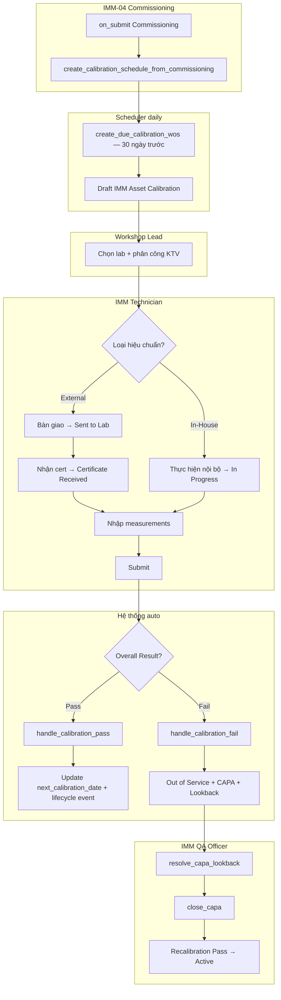
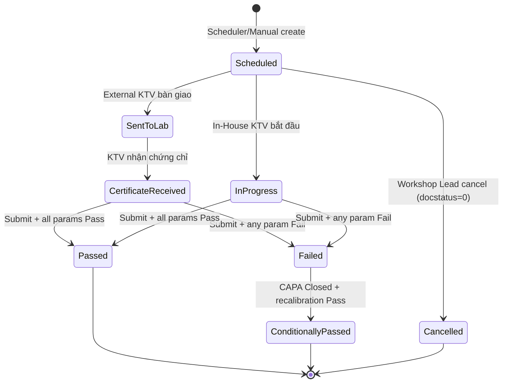

# 02 — Phân tích thiết kế nghiệp vụ (Analysis & Design)

| Mục | Giá trị |
|---|---|
| Module | IMM-11 — Hiệu chuẩn (Calibration) |
| Phạm vi | Per-module |
| Owner | BA + System Analyst |
| Liên kết | 03 Diagrams · 04 Backend · 05 API · 06 Frontend |
| Trạng thái | ⚠️ Pending implementation — toàn bộ module chưa có code |

---

# Phần I — Module Overview

## I.0. Khảo sát hiện trạng

Hiện tại các bệnh viện công Việt Nam quản lý hiệu chuẩn thiết bị đo lường y tế chủ yếu bằng sổ tay và bảng tính Excel. Lịch hiệu chuẩn được lập định kỳ 12 tháng theo IFU/khuyến cáo nhà sản xuất, tuy nhiên không có cảnh báo tự động khi đến hạn — KTV phải tự rà sổ và liên hệ lab. Chứng chỉ ISO/IEC 17025 sau khi lab gửi về thường được lưu giấy hoặc PDF rời rạc trong folder phòng vật tư, gây khó khăn khi audit hoặc khi cần đối chiếu trace ngược (Lookback) một lô thiết bị cùng model.

Theo WHO HTM *Medical equipment maintenance programme overview* (chương 6.1 Inspection and preventive maintenance + Glossary "Calibration"), một chương trình calibration đầy đủ cần: (i) lập lịch theo interval của IFU, (ii) đo so với chuẩn quốc gia/quốc tế (traceability), (iii) ghi nhận kết quả Pass/Fail dựa trên tolerance, (iv) gắn corrective action khi Out-of-Tolerance. Hiện trạng thiếu (iii) và (iv) chính là pain point chính của module — phù hợp NĐ 98/2021 Điều 38–40.

*(Ghi chú: cần khảo sát baseline cụ thể tại site khách hàng — số % thiết bị đến hạn không có cảnh báo, số % chứng chỉ không truy xuất được — BA bổ sung trong sprint khảo sát.)*

## I.1. Pitch

IMM-11 giải quyết vấn đề bệnh viện không theo dõi được trạng thái hiệu chuẩn thiết bị đo lường y tế, dẫn đến sử dụng thiết bị ngoài dung sai mà không biết. Module tự động lập lịch, track bàn giao lab ISO/IEC 17025, tính kết quả Pass/Fail tức thì, và kích hoạt CAPA + Lookback bắt buộc khi thiết bị Fail — đảm bảo không thiết bị nào Fail vẫn tiếp tục sử dụng trên bệnh nhân.

## I.2. Vị trí trong WHO HTM lifecycle

| Phase | Liên quan |
|---|---|
| Needs | ✗ |
| Procurement | ✗ |
| Installation | ✓ — IMM-04 commissioning → tạo Calibration Schedule đầu tiên |
| Operation | ✓ — Track External (ISO 17025 lab) + In-House |
| Maintenance | ✓ — Recalibration sau sửa chữa (IMM-09) |
| Decommission | ✓ — Suspend Schedule khi asset Decommissioned (BR-11-06) |

## I.3. Stakeholders & Actors

| Vai trò | Người dùng thực | Quan tâm chính | Tần suất | Loại |
|---|---|---|---|---|
| IMM Workshop Lead | Trưởng xưởng kỹ thuật | Lập lịch, chọn lab, monitor compliance | Hằng ngày | Primary |
| IMM Technician | KTV hiệu chuẩn | Bàn giao thiết bị, nhập measurement, upload cert | Hằng ngày | Primary |
| IMM QA Officer | Nhân viên QA | Review CAPA, Lookback findings, RCA | Hằng tuần | Approver |
| IMM Operations Manager | Quản lý vận hành | Dashboard, KPI, compliance report | Hằng tuần | Secondary |
| IMM Department Head | Trưởng phòng HTM | Nhận escalation overdue > 30 ngày | Khi cần | Auditor |
| IMM Document Officer | Nhân viên lưu trữ | Read-only audit trail, chứng chỉ archive | Theo yêu cầu | Auditor |

## I.4. Scope

**In-scope:**
- Lập lịch hiệu chuẩn tự động từ IMM-04 commissioning
- Track External (ISO/IEC 17025 lab): bàn giao, certificate, nhập số liệu
- Track In-House (KTV nội bộ + reference standard)
- Auto Pass/Fail theo tolerance, CAPA bắt buộc + Lookback khi Fail
- Scheduler tạo WO 30 ngày trước hạn; alert overdue
- Compliance dashboard + KPI

**Out-of-scope:**
- Tích hợp API tự động với lab ngoài (defer IMM-15)
- OCR tự động certificate PDF
- Quản lý reference standard catalog
- Validation Metrology MRA cross-border (NĐ 130/2016 tham chiếu, chưa enforce)

**Assumptions:**
- IMM-00 Foundation đã implement xong (services, DocTypes, permissions)
- AC Supplier có field `iso_17025_certified` và `vendor_type = "Calibration Lab"`
- IMM Device Model có field `calibration_interval_days` và `calibration_required`

**Dependencies:**
- IMM-00 services: `create_capa`, `close_capa`, `log_audit_event`, `create_lifecycle_event`, `transition_asset_status`, `validate_asset_for_operations`, `get_sla_policy`
- IMM-04 Commissioning DocType (`on_submit` hook)
- IMM-09 Repair DocType (`on_submit` hook)

## I.5. KPI mục tiêu

| KPI | Định nghĩa | Baseline | Target | Đo ở đâu |
|---|---|---|---|---|
| Calibration Compliance Rate | Completed on time / Total scheduled × 100% | Chưa đo | ≥ 95% | IMM Asset Calibration |
| Out-of-Tolerance (OOT) Rate | Failed CAL / Total CAL × 100% | Chưa đo | < 5% | IMM Calibration Measurement |
| CAPA Closure Rate (30d) | Closed within 30d / Total opened × 100% | Chưa đo | ≥ 90% | IMM CAPA Record |
| Certificate Coverage | Assets with valid cert / Total calibratable assets | 0% | 100% | AC Asset + IMM Asset Calibration |
| Avg Days Sent → Cert Received | AVG(certificate_date − sent_date) | Chưa đo | ≤ 14 ngày | IMM Asset Calibration |

## I.6. Ràng buộc Compliance

| Quy định | Yêu cầu áp lên module | Doc tham chiếu |
|---|---|---|
| ISO/IEC 17025 | Lab hiệu chuẩn phải có chứng chỉ ISO/IEC 17025 (BR-11-01) | ISO/IEC 17025:2017 |
| ISO 13485:2016 | Fail → CAPA bắt buộc (§8.5.2); immutable record (§4.2.5); Lookback (§8.5.3) | ISO 13485:2016 |
| NĐ 98/2021/NĐ-CP | Hiệu chuẩn theo IFU (Điều 38); lab công nhận (Điều 39); immutable ≥ 7 năm (Điều 40) | NĐ 98/2021 |
| WHO HTM 2025 | Calibration interval (§5.4.2), measurement traceability (§5.4.4), Lookback (§5.4.6) | WHO HTM 2025 |
| ĐLVN standards | Quy trình hiệu chuẩn đo lường Việt Nam | ĐLVN cụ thể theo thiết bị |

## I.7. Risk & Open questions

| Risk | Likelihood | Impact | Giảm thiểu |
|---|---|---|---|
| Lab không có ISO 17025 cert còn hạn | Medium | High | BR-11-01 validate `iso_17025_cert_expiry` + nhắc nhở trước 30 ngày |
| KTV nhập sai measured_value dẫn đến Fail giả | Medium | High | Immutable sau Submit (BR-11-05); Amend với approval |
| Scheduler bỏ sót WO khi server down | Low | Medium | Idempotency check + retry ≤ 3 lần |
| Lookback gây quá tải khi nhiều asset cùng model | Low | Medium | Background job async; batch size limit 100 asset/run |

| Open question | Owner | Deadline |
|---|---|---|
| Reference standard catalog có cần DocType riêng? | BA + Tech Lead | Sprint 11.1 |
| Tolerance nhập thủ công hay lấy từ IFU/Device Model? | BA + QA Officer | Sprint 11.1 |

## I.8. Roadmap thực thi

| Sprint | Hạng mục | Owner | Status |
|---|---|---|---|
| 11.1 | DocType JSON (3) + custom fields AC Asset (3) | BE Lead | ⚠️ Pending |
| 11.2 | Service layer `services/imm11.py` + IMM-00 integration | BE Lead | ⚠️ Pending |
| 11.3 | API layer `api/imm11.py` + scheduler + hooks | BE Lead | ⚠️ Pending |
| 11.4 | Workflow JSON + permission fixtures | BE Lead | ⚠️ Pending |
| 11.5 | Frontend Vue (Dashboard, Form, Detail, CAPA panel) | FE Lead | ⚠️ Pending |
| 11.6 | Test suite + UAT execution (target 70% coverage) | QA | ⚠️ Pending |

---

# Phần II — Quy trình nghiệp vụ (Business Process)

## II.2. As-Is process

Hiện tại bệnh viện quản lý hiệu chuẩn bằng sổ tay và Excel. KTV gửi thiết bị ra lab theo lịch định kỳ, nhận chứng chỉ giấy và lưu vào folder. Không có cảnh báo tự động khi đến hạn, không có cơ chế tự động phát hiện thiết bị Fail tiếp tục sử dụng.

## II.3. Pain points

| # | Pain | Tác động |
|---|---|---|
| 1 | Không có cảnh báo tự động khi đến hạn calibration | Thiết bị quá hạn vẫn sử dụng → risk an toàn bệnh nhân |
| 2 | Chứng chỉ lưu file thủ công, không tra cứu được | Không pass audit + tốn thời gian tìm kiếm |
| 3 | Thiết bị Fail không có quy trình bắt buộc dừng hoạt động | Vi phạm ISO 13485:8.5.2 + NĐ98 |
| 4 | Không có Lookback assessment khi 1 thiết bị Fail | Risk lan rộng sang thiết bị cùng model không được phát hiện |

## II.4. To-Be process



## II.5. Decision points

| Điểm | Câu hỏi | Quy tắc |
|---|---|---|
| D1 | External hay In-House? | `calibration_type` từ Device Model default; Workshop Lead override |
| E1 | Pass hay Fail? | `overall_result = Failed` nếu bất kỳ `measurement.out_of_tolerance = True` |
| Gate tạo WO | Asset có thể calibrate không? | `validate_asset_for_operations()` — block nếu OOS/Decommissioned (trừ `is_recalibration=1`) |

## II.6. Process metrics

| Metric | Mục tiêu | Đo ở đâu |
|---|---|---|
| Time-to-assignment (Scheduled → KTV được phân công) | < 3 ngày làm việc | `IMM Asset Calibration.modified` diff |
| % Calibration đúng hạn (on-time rate) | ≥ 95% | KPI Calibration Compliance Rate (xem I.5) |
| Avg ngày Sent → Certificate Received | ≤ 14 ngày | Diff `sent_date` vs `certificate_date` |
| % Pass first-time (không qua recalibration) | ≥ 90% | `overall_result = Passed` / Total |
| % CAPA closed trong 30 ngày | ≥ 90% | KPI CAPA Closure Rate |

## II.7. RACI matrix

| Hoạt động | Workshop Lead | KTV | QA Officer | System |
|---|---|---|---|---|
| Tạo Calibration Schedule | R/A | C | I | — |
| Phân công KTV | R/A | I | — | — |
| Bàn giao thiết bị ra lab | C | R/A | — | — |
| Nhập measurements | C | R/A | — | — |
| Submit kết quả | A | R | I | — |
| Auto tạo CAPA khi Fail | I | I | I | R/A |
| Resolve lookback | A | C | R | — |
| Close CAPA | A | — | R | — |

## II.8. Exception flow

- **EF-01 — Lab trả chứng chỉ không đạt định dạng (cert thiếu accreditation number)**: KTV không submit được do BR-11-01. Hành động: lập biên bản, yêu cầu lab cấp lại; trạng thái CAL giữ ở `Certificate Received` cho đến khi nhận cert hợp lệ.
- **EF-02 — Lab phá sản/mất ISO 17025 trong khi đang giữ thiết bị**: Workshop Lead cần tracking + escalation để chuyển lab khác. *(BA bổ sung playbook chi tiết trong sprint kế tiếp)*
- **EF-03 — Concurrent edit cùng 1 CAL record**: optimistic lock → `CONFLICT` (xem EC-11-03). User được prompt reload và nhập lại.

## II.9. So sánh As-Is vs To-Be

| Khía cạnh | As-Is (Excel/sổ giấy) | To-Be (AssetCore IMM-11) |
|---|---|---|
| Lập lịch | Thủ công, dễ quên | Auto từ IMM-04 commissioning + scheduler 30 ngày trước hạn |
| Cảnh báo đến hạn | Không có | Dashboard Due Soon + Overdue, escalation > 30 ngày |
| Pass/Fail | Đọc cert giấy, ghi sổ | Auto tính theo tolerance, immutable record |
| Out-of-Tolerance handling | Phụ thuộc nhân viên nhớ | Bắt buộc CAPA + chuyển Out of Service + Lookback cùng model |
| Audit | Tìm folder giấy | SHA-256 hash chain, truy xuất ≥ 7 năm |
| Compliance NĐ98/ISO 13485 | Khó chứng minh | Trace đầy đủ qua Lifecycle Event + Audit Trail |

## II.10. Activity diagram per UC chính

*(Bổ sung — vẽ Activity diagram chi tiết cho ≥ 4 UC chính. Hiện tại module đã render BPMN swimlane (II.4) và state machine (IV.3); Activity diagram per UC sẽ vẽ trong file `03_Diagrams.md` §III để tránh trùng. Tham chiếu UC-05, UC-06, UC-08, UC-09. BA bổ sung trong sprint review docs.)*

---

# Phần III — Use Case Specification

## III.1.a. Biểu đồ use case tổng quát

```
[Workshop Lead] ---> (UC-01 Lập lịch calibration)
[Workshop Lead] ---> (UC-02 Phân công KTV)
[KTV] ---> (UC-03 Bàn giao thiết bị External)
[KTV] ---> (UC-04 Nhận certificate)
[KTV] ---> (UC-05 Nhập kết quả đo)
[KTV] ---> (UC-06 Submit kết quả)
[System] ---> (UC-07 Auto Pass handling)
[System] ---> (UC-08 Auto Fail handling — CAPA + OOS + Lookback)
[QA Officer] ---> (UC-09 Resolve lookback)
[QA Officer] ---> (UC-10 Close CAPA)
[Scheduler] ---> (UC-11 Tạo CAL WO tự động)
[Scheduler] ---> (UC-12 Cập nhật calibration_status)
(UC-06) ..> (UC-07) : <<include>> [result=Pass]
(UC-06) ..> (UC-08) : <<include>> [result=Fail]
(UC-08) ..> (UC-09) : <<extend>> [lookback required]
```

## III.1.b. Biểu đồ use case phân rã (theo nhóm chức năng)

Module có 12 UC chính → tách thành 3 nhóm phân rã, mỗi nhóm ≤ 6 UC:

**Nhóm 1 — Planning & Assignment (Workshop Lead)**: UC-01 Lập lịch, UC-02 Phân công KTV, UC-11 Scheduler tự động tạo WO, UC-12 Cập nhật calibration_status.

**Nhóm 2 — Execution (KTV — IMM Technician)**: UC-03 Bàn giao thiết bị External, UC-04 Nhận certificate, UC-05 Nhập kết quả đo, UC-06 Submit kết quả.

**Nhóm 3 — Post-result Automation & QA**: UC-07 Auto Pass handling (System), UC-08 Auto Fail handling — CAPA + OOS + Lookback (System), UC-09 Resolve lookback (QA Officer), UC-10 Close CAPA (QA Officer).

*(Diagram render chi tiết per nhóm — bổ sung vào file `03_Diagrams.md` để tránh trùng với III.1.a tổng quát.)*

## III.2. Actor catalog

| Actor | Loại | Mô tả | Goal chính |
|---|---|---|---|
| IMM Workshop Lead | Primary | Trưởng xưởng kỹ thuật, owner lịch hiệu chuẩn | Đảm bảo 100% thiết bị có lịch + cert hợp lệ |
| IMM Technician (KTV) | Primary | Kỹ thuật viên hiệu chuẩn nội bộ / handler external | Hoàn thành WO đúng hạn, nhập số liệu đúng |
| IMM QA Officer | Approver | Nhân viên QA phụ trách CAPA + Lookback | Đảm bảo Fail không lan rộng, đóng CAPA đúng quy trình |
| IMM Operations Manager | Secondary | Quản lý vận hành — đọc dashboard, KPI | Theo dõi compliance rate + OOT rate |
| IMM Department Head | Auditor | Trưởng phòng HTM — nhận escalation > 30 ngày overdue | Pass audit NĐ98 + ISO 13485 |
| IMM Document Officer | Auditor | Read-only audit trail, archive chứng chỉ | Truy xuất hồ sơ ≥ 7 năm |
| Calibration Lab (External) | External | Lab ISO/IEC 17025 nhận thiết bị, trả cert | (Out-of-system) Cấp cert đúng định dạng |
| Scheduler | System | Frappe scheduler chạy hằng ngày | Tự động tạo CAL WO 30 ngày trước hạn |
| AssetCore System | System | Engine xử lý on_submit Pass/Fail | Auto trigger CAPA + Lookback + Lifecycle Event |

## III.3. Use Case Specifications

### UC-05: Nhập kết quả đo lường

| Mục | Giá trị |
|---|---|
| ID | UC-IMM11-05 |
| Brief | KTV nhập giá trị đo từng tham số; hệ thống tự tính Pass/Fail |
| Primary actor | IMM Technician |
| Pre-condition | `IMM Asset Calibration` ở trạng thái `Certificate Received` hoặc `In Progress` |
| Post-condition | `measurements` đầy đủ; `overall_result` được tính |
| Trigger | KTV nhận chứng chỉ hoặc hoàn thành đo nội bộ |

#### Main flow
| Bước | Actor | System |
|---|---|---|
| 1 | KTV mở `IMM Asset Calibration` | Hiển thị MeasurementTable |
| 2 | KTV nhập `measured_value` cho từng tham số | Tự tính `out_of_tolerance = deviation > tol` |
| 3 | KTV xem kết quả realtime (Pass/Fail/Warn) | Cập nhật `overall_result` |
| 4 | KTV xác nhận và chuyển sang Submit | — |

#### Exception E1 — measured_value null
- 4a. Hệ thống block submit với `ServiceError(VALIDATION, "Tham số {name} chưa có giá trị đo")`

### UC-06: Submit kết quả hiệu chuẩn

| Mục | Giá trị |
|---|---|
| ID | UC-IMM11-06 |
| Brief | KTV submit phiếu hiệu chuẩn, kích hoạt automation Pass/Fail |
| Primary actor | IMM Technician |
| Pre-condition | Mọi `measured_value` đã nhập; External: có `certificate_file` và `lab_accreditation_number` |
| Post-condition | DocType submittable (docstatus=1); asset cập nhật; CAPA tạo nếu Fail |
| Trigger | KTV click "Submit" |

#### Main flow — Pass
| Bước | Actor | System |
|---|---|---|
| 1 | KTV click Submit | `before_submit`: set `actual_date` |
| 2 | — | `on_submit`: `handle_calibration_pass()` |
| 3 | — | Update `AC Asset.next_calibration_date = cert_date + interval` |
| 4 | — | `create_lifecycle_event("calibration_completed")` + `log_audit_event()` |

#### Alternative A1 — Fail path
- 2a. `on_submit`: `handle_calibration_fail()`: transition Asset → Out of Service + `create_capa()` + `perform_lookback_assessment()`

#### Exception E1 — External thiếu certificate
- 1a. Block: `ServiceError(VALIDATION, "Vui lòng upload Calibration Certificate (BR-11-01)")`

## III.4. Use Case relationships

**`<<include>>` — caller bắt buộc gọi:**

| Caller UC | Included UC | Lý do bắt buộc |
|---|---|---|
| UC-06 Submit kết quả | UC-07 Auto Pass handling | Khi `overall_result = Passed`, system bắt buộc chạy `handle_calibration_pass()` |
| UC-06 Submit kết quả | UC-08 Auto Fail handling | Khi `overall_result = Failed`, system bắt buộc chạy `handle_calibration_fail()` |
| UC-08 Auto Fail handling | UC-10 (CAPA creation step) | Fail → bắt buộc tạo CAPA (BR-11-02) |

**`<<extend>>` — chạy khi điều kiện thỏa:**

| Base UC | Extending UC | Điều kiện kích hoạt |
|---|---|---|
| UC-08 Auto Fail handling | UC-09 Resolve lookback | Khi có ≥ 1 asset cùng `device_model` đang Active (BR-11-03) |
| UC-11 Scheduler tạo WO | UC-12 Cập nhật calibration_status | Khi asset chuyển trạng thái `Overdue` (> due_date) |

## III.5. UC ↔ User Story mapping

| Use Case | User Story ID | Note |
|---|---|---|
| UC-01 Lập lịch | US-11-01 | Workshop Lead xem & lập kế hoạch |
| UC-05/06 Nhập + Submit | US-11-02 | Auto Pass/Fail real-time |

*(Mapping đầy đủ — BA bổ sung khi viết hết US-11-03 → US-11-NN.)*

---

# Phần IV — Functional Specifications

## IV.1. User Stories & Acceptance Criteria

### US-11-01: Xem danh sách thiết bị đến hạn

**Là** Workshop Lead, **tôi muốn** xem danh sách thiết bị đến hạn calibration trong 30 ngày, **để** lên kế hoạch không bỏ sót.

| Priority | Must |
|---|---|
| AC-01 | Given asset có `next_calibration_date ≤ today + 30`, When Workshop Lead xem dashboard, Then thiết bị xuất hiện trong danh sách "Due Soon" |
| AC-02 | Given asset có `next_calibration_date < today`, When xem, Then hiển thị "Overdue" với số ngày quá hạn |

### US-11-02: Auto Pass/Fail khi nhập measurement

**Là** KTV HTM, **tôi muốn** nhập tham số đo và hệ thống auto tính Pass/Fail, **để** loại bỏ tính toán thủ công.

| Priority | Must |
|---|---|
| AC-01 | Given `nominal=7.5, tol±3%, measured=7.6`, When KTV nhập, Then `pass_fail=Pass`, `out_of_tolerance=False` |
| AC-02 | Given `nominal=7.5, tol±3%, measured=8.0`, When KTV nhập, Then `pass_fail=Fail`, `out_of_tolerance=True` |

## IV.2. Business Rules

| ID | Rule | Implement ở | Liên kết test |
|---|---|---|---|
| BR-11-01 | External: lab ISO 17025 + cert + accreditation số bắt buộc | `IMMAssetCalibration.validate()` | AC-11-03, AC-11-04 |
| BR-11-02 | Fail → Out of Service + CAPA bắt buộc | `IMMAssetCalibration.on_submit()` | AC-11-02 |
| BR-11-03 | Lookback bắt buộc cùng `device_model` | `perform_lookback_assessment()` | AC-11-07 |
| BR-11-04 | `next_cal = certificate_date + interval` (không phải due_date) | `handle_calibration_pass()` | AC-11-06 |
| BR-11-05 | Immutable sau Submit; Amend với reason | Submittable + `on_cancel` block | AC-11-09 |
| BR-11-06 | Decommissioned → suspend Schedule | `transition_asset_status()` cascade | — |
| BR-11-07 | `validate_asset_for_operations()` gate (trừ `is_recalibration=1`) | service entry | AC-11-10 |

## IV.3. State Machine



| State | docstatus | Mô tả | Role có quyền chuyển |
|---|---|---|---|
| Scheduled | 0 | Lịch đã tạo, chờ thực hiện | Scheduler / Workshop Lead |
| Sent to Lab | 0 | Đã bàn giao cho lab | IMM Technician |
| In Progress | 0 | Đang đo nội bộ | IMM Technician |
| Certificate Received | 0 | Nhận chứng chỉ, chờ nhập số liệu | IMM Technician |
| Passed | 1 | Tất cả tham số Pass | System (on_submit) |
| Failed | 1 | ≥1 tham số Fail | System (on_submit) |
| Conditionally Passed | 1 | CAPA Closed + recal Pass | System |
| Cancelled | 2 | Hủy (trước Submit) | Workshop Lead |

## IV.4. Input — Output

### (a) Input fields & validation

| Field | Loại | Validation | Phụ thuộc cascade |
|---|---|---|---|
| `asset` (Link → AC Asset) | Mandatory | `validate_asset_for_operations()` (trừ `is_recalibration=1`) | Khi chọn → reload `device_model`, `calibration_interval_days` từ Asset |
| `calibration_type` | Select (External/In-House) | Mandatory; default từ Device Model | Khi = `External` → bắt buộc field `calibration_lab` + `certificate_file`; khi = `In-House` → bắt buộc `reference_standard` |
| `calibration_lab` (Link → AC Supplier) | Conditional | `vendor_type = "Calibration Lab"` + `iso_17025_certified = 1` (BR-11-01) | Reset khi đổi `calibration_type` |
| `due_date` | Date | ≥ today; ≤ today + 365 | Auto-fill = `last_cal_date + interval` |
| `measurements` (Child table) | Mandatory ≥ 1 row | Mỗi row: `nominal`, `tolerance`, `measured_value` đều mandatory khi Submit | `out_of_tolerance` auto-tính từ `nominal` + `tolerance` + `measured_value` |
| `certificate_file` | Attach | Mandatory khi `calibration_type = External` (BR-11-01) | — |
| `lab_accreditation_number` | Data | Mandatory khi External | — |

### (b) Output records sinh ra

| DocType output | Thời điểm | Trigger |
|---|---|---|
| `IMM Asset Calibration` (chính) | Manual hoặc scheduler | Workshop Lead / `create_due_calibration_wos` |
| `IMM Lifecycle Event` (`calibration_completed` / `calibration_failed`) | on_submit | `handle_calibration_pass/fail()` |
| `IMM CAPA Record` | on_submit khi Fail | `create_capa()` (BR-11-02) |
| `IMM Audit Trail` (hash chain) | Mọi mutation | `log_audit_event()` |
| Update `AC Asset.next_calibration_date` | on_submit Pass | BR-11-04 |
| Transition `AC Asset.workflow_state → Out of Service` | on_submit Fail | `transition_asset_status()` |

### (c) Notification / side effect

- Email notification tới Workshop Lead khi CAL Overdue > 7 ngày.
- Email + dashboard alert tới QA Officer khi Fail → CAPA created.
- Lookback: trigger background job liệt kê asset cùng `device_model` đang Active để QA review (BR-11-03).
- Scheduler `create_due_calibration_wos` chạy hằng ngày 02:00.

## IV.5. Edge cases & Errors

| ID | Edge case | Hành vi mong đợi | Error code |
|---|---|---|---|
| EC-11-01 | Submit khi asset Out of Service (không phải recal) | Block với message "Thiết bị không thể tạo Calibration WO" | `BAD_STATE` |
| EC-11-02 | Cancel sau Submit | Block: "Không thể hủy sau Submit — dùng Amend" | `FORBIDDEN` |
| EC-11-03 | 2 user concurrent save cùng 1 CAL record | Optimistic lock — `TimestampMismatchError` → `CONFLICT` | `CONFLICT` |
| EC-11-04 | External: thiếu cert file khi Submit | Block với validation error | `VALIDATION` |
| EC-11-05 | Device Model không có `calibration_interval_days` | Block khi tạo Schedule | `BUSINESS_RULE` |
| EC-11-06 | Close CAPA khi `lookback_status = Pending` | Block: "CAPA chưa hoàn thành Lookback" | `BUSINESS_RULE` |

---

# Phần V — Yêu cầu phi chức năng

## V.1. Hiệu năng

| Metric | Target | Đo ở đâu |
|---|---|---|
| API list calibrations p95 | < 300ms (50k records) | Locust |
| API submit_calibration_results p95 | < 1s (10 measurements) | Locust |
| Dashboard load p95 | < 2s | Lighthouse |
| Scheduler `create_due_calibration_wos` | < 30s/run | Scheduler log |

## V.2. Bảo mật

- Authentication: Frappe session + API key
- Authorization: RBAC — IMM Technician chỉ xem CAL mình được giao (`technician = session.user`)
- Audit trail: SHA-256 hash chain mọi mutation qua `log_audit_event()`
- Compliance: NĐ98 + ISO 13485 + ISO/IEC 17025
- KHÔNG lưu patient data
- Certificate PDF lưu trên Frappe file server, không expose qua public URL

## V.3. Khả dụng

| Metric | Target |
|---|---|
| Uptime | ≥ 99.5% giờ làm việc (07:00–22:00) |
| Scheduler miss rate | 0% (idempotent, retry 3x) |
| RPO | ≤ 1 giờ |

## V.4. Khả mở rộng (Scalability)

| Metric | Target |
|---|---|
| Concurrent user | ≥ 50 KTV + 5 Workshop Lead đồng thời |
| Dataset size | ≥ 100k `IMM Asset Calibration` record/site, ≥ 500k `IMM Calibration Measurement` |
| Multi-site | 1 codebase, N site độc lập (Frappe site isolation) |
| Scheduler throughput | ≥ 1000 asset/run trong < 30s |

## V.5. Khả dụng UX (Usability)

- WCAG 2.1 AA: contrast ≥ 4.5:1, keyboard nav cho mọi action, focus visible.
- Browser support: Chrome ≥ 120, Edge ≥ 120, Firefox ≥ 122; Safari ≥ 17 best-effort.
- Ngôn ngữ: tiếng Việt primary; tiếng Anh secondary cho field name kỹ thuật.
- Responsive: desktop-first ≥ 1280px (Workshop Lead dashboard); tablet ≥ 768px (KTV nhập measurement tại workshop).
- Onboarding: KTV mới sử dụng workflow nhập measurement + Submit < 30 phút training (có walkthrough video).

## V.6. Bảo trì (Maintainability)

- Code coverage: service `services/imm11.py` ≥ 85%, DocType controller ≥ 70%, API ≥ 60% (theo CONVENTIONS §6).
- Mọi public service function có docstring + AC trace tới BR-11-XX.
- Linting: ruff + black 100% pass cho BE; ESLint + Prettier 100% pass cho FE.
- Tech debt budget: ≤ 20% sprint capacity dành cho refactor.
- Onboarding junior dev: productive trong < 1 tuần (có docs 02–09 đầy đủ + skill `assetcore-be-module`).

## V.7. Tuân thủ

- Lưu hồ sơ ≥ 7 năm (NĐ98 Điều 40)
- Audit truy xuất qua SHA-256 hash chain
- Immutable record sau Submit (BR-11-05)
- Phân tách: KTV nhập ≠ QA close CAPA ≠ Workshop Lead phân công

---

## DoD — File 02 hoàn chỉnh

### I. Module Overview
- [x] Pitch ≤ 5 câu, không jargon
- [x] Lifecycle phase + position rõ
- [x] ≥ 1 Primary + 1 Auditor stakeholder
- [x] Scope In + Out + Assumption + Dependency
- [x] ≥ 3 KPI có target số
- [x] ≥ 1 ràng buộc compliance

### II. Business Process
- [x] Pain points ≥ 3
- [x] To-Be swimlane ≥ 4 lane
- [x] Decision points có quy tắc
- [x] RACI cho hoạt động chính

### III. Use Case Spec
- [x] Use case diagram tổng quát
- [x] UC specs đầy đủ (pre/post/main/alt/exception)

### IV. Functional Specs
- [x] User Stories có AC Given-When-Then
- [x] Business Rules đánh số + nơi implement
- [x] State machine vẽ rõ
- [x] ≥ 5 edge case

### V. Non-Functional Requirements
- [x] Performance, Security, Availability, Compliance có target số
- [x] Compliance đối chiếu NĐ98 + WHO HTM + ISO 13485
- [ ] ⚠️ Reviewed bởi BA Lead + Tech Lead + QMS Officer (Pending)
