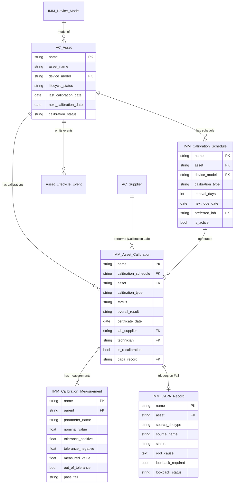
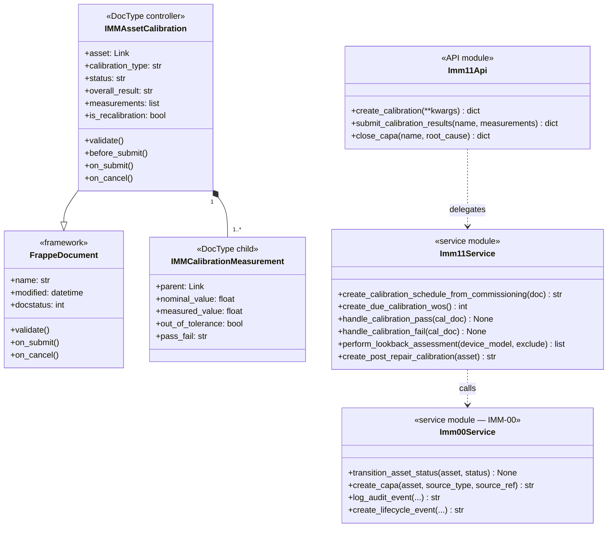
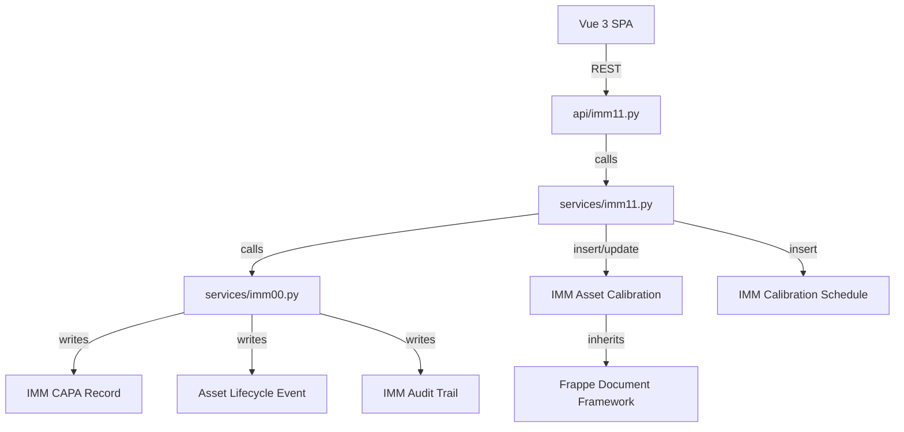
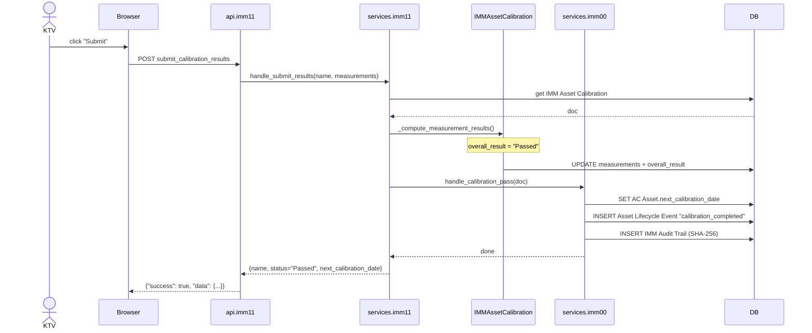
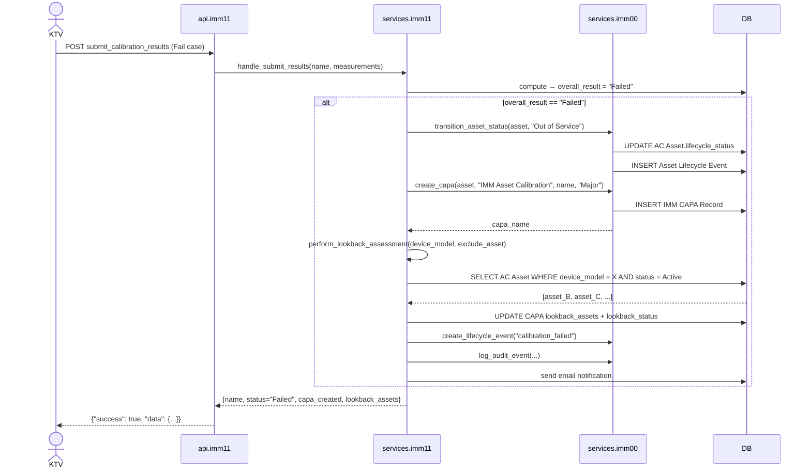
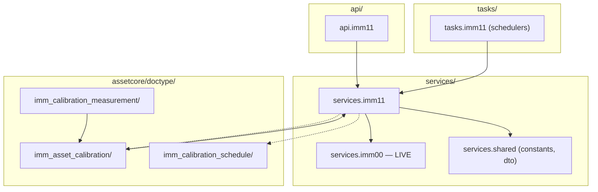
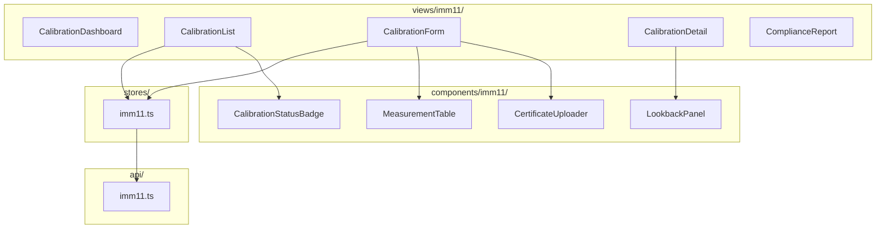

# 03 — Biểu đồ kỹ thuật (UML Diagrams)

| Mục | Giá trị |
|---|---|
| Module | IMM-11 — Hiệu chuẩn (Calibration) |
| Phạm vi | Per-module |
| Owner | System Analyst / Tech Lead / DBA |
| Liên kết | 02 Analysis & Design · 04 Backend Design |
| Cập nhật | 2026-05-18 |
| Trạng thái | ✅ Live — ERD + Class diagram + Sequence diagram phản ánh đúng `services/imm11.py` + DocType hiện hành |

---

# Phần I — Entity Relationship Diagram (ERD)

## I.1. ERD logic



## I.3. Entity catalog

### Entities module sở hữu (✅ Live)

| Entity | DocType | Naming | Lifecycle | Volume/năm/site |
|---|---|---|---|---|
| IMM Calibration Schedule | `IMM Calibration Schedule` (folder `imm_calibration_schedule`) | `CAL-SCH-.YYYY.-.#####` | Non-submittable, tồn tại đến khi asset Decommissioned | 1 per calibratable asset |
| IMM Asset Calibration | `IMM Asset Calibration` (folder `imm_asset_calibration`) | `CAL-.YYYY.-.#####` | Submittable, immutable sau Submit | ~500–2000 |
| IMM Calibration Measurement | `IMM Calibration Measurement` (folder `imm_calibration_measurement`) — child table | (auto) | Child của IMM Asset Calibration | ~5000–20000 rows |

### Entities tham chiếu cross-module (từ IMM-00)

| Entity | Owner | Vai trò |
|---|---|---|
| AC Asset | IMM-00 | Thiết bị được hiệu chuẩn |
| IMM Device Model | IMM-00 | Cung cấp `calibration_interval_days` |
| AC Supplier | IMM-00 | Calibration Lab (iso_17025_certified) |
| IMM CAPA Record | IMM-00 | Auto-created khi Fail (BR-11-02) |
| Asset Lifecycle Event | IMM-00 | Log 5 event types calibration |
| IMM Audit Trail | IMM-00 | SHA-256 chain mọi mutation |

## I.4. Data dictionary

### Bảng 1.1: IMM Calibration Schedule ✅ Live

| Field | Type | Length | Required | Default | PII | Validation | Mô tả |
|---|---|---|---|---|---|---|---|
| `name` | varchar | 30 | ✓ | autoname | — | `CAL-SCH-YYYY-NNNNN` | PK |
| `asset` | Link | 140 | ✓ | — | — | AC Asset exists | Thiết bị |
| `device_model` | Link | 140 | ✓ | auto-fetch | — | — | Auto từ asset |
| `calibration_type` | Select | — | ✓ | External | — | External, In-House | Loại |
| `interval_days` | Int | — | ✓ | từ Device Model | — | > 0 | Chu kỳ (ngày) |
| `next_due_date` | Date | — | ✓ | computed | — | — | Ngày đến hạn |
| `preferred_lab` | Link | 140 | ✗ | — | — | iso_17025_certified=1 | Lab ưu tiên |
| `is_active` | Check | — | ✓ | 1 | — | — | Đang hoạt động |

### Bảng 1.2: IMM Asset Calibration ✅ Live

| Field | Type | Length | Required | Default | PII | Validation | Mô tả |
|---|---|---|---|---|---|---|---|
| `name` | varchar | 30 | ✓ | autoname | — | `CAL-YYYY-NNNNN` | PK |
| `asset` | Link | 140 | ✓ | — | — | Active or is_recalibration | Thiết bị |
| `calibration_type` | Select | — | ✓ | — | — | External, In-House | Loại |
| `status` | Select | — | ✓ | Scheduled | — | 8 states | Trạng thái |
| `overall_result` | Select | — | ✗ | — | — | Passed, Failed, Conditionally Passed | Kết quả tổng |
| `lab_supplier` | Link | 140 | Conditional | — | — | iso_17025_certified=1 (External) | Lab |
| `certificate_file` | Attach | — | Conditional | — | — | PDF, bắt buộc External Submit | Chứng chỉ |
| `certificate_date` | Date | — | Conditional | — | — | ≤ today | Ngày cấp cert |
| `technician` | Link | 140 | ✓ | — | — | — | KTV |
| `is_recalibration` | Check | — | ✗ | 0 | — | — | Tái cal sau CAPA |
| `amendment_reason` | Small Text | 255 | Conditional | — | — | Bắt buộc khi Amend | Lý do Amend |

### Bảng 1.3: IMM Calibration Measurement ✅ Live

| Field | Type | Length | Required | Default | PII | Validation | Mô tả |
|---|---|---|---|---|---|---|---|
| `parameter_name` | Data | 140 | ✓ | — | — | — | Tên tham số |
| `unit` | Data | 40 | ✓ | — | — | — | Đơn vị |
| `nominal_value` | Float | — | ✓ | — | — | — | Giá trị danh định |
| `tolerance_positive` | Float | — | ✓ | — | — | > 0 | Dung sai (+) % |
| `tolerance_negative` | Float | — | ✓ | — | — | > 0 | Dung sai (-) % |
| `measured_value` | Float | — | ✓ | — | — | Required before Submit | Giá trị đo |
| `out_of_tolerance` | Check | — | ✗ | computed | — | Auto | Ngoài dung sai |
| `pass_fail` | Select | — | ✗ | computed | — | Pass, Fail | Kết quả |

## I.8. Volume & retention

| Entity | Volume/năm/site | Retention | Archive policy |
|---|---|---|---|
| IMM Calibration Schedule | ~500 | Suốt đời asset | Lưu tất cả, không xóa |
| IMM Asset Calibration | ~1000–2000 | ≥ 7 năm (NĐ98 Điều 40) | Archive sau 7 năm, không xóa |
| IMM Calibration Measurement | ~10000–20000 | ≥ 7 năm | Cùng với parent |

---

# Phần II — Class Diagram

## II.1.a. Biểu đồ lớp tổng quát



## II.2. Layer mapping



---

# Phần III — Sequence Diagram

## III.3. Sequence: Submit kết quả Pass



## III.3. Sequence: Submit kết quả Fail → CAPA + Lookback



---

# Phần IV — Communication Diagram

## IV.4. Communication: Scheduler daily tạo CAL WO

```
1: trigger daily scheduler
browser:System → :TaskImm11 : 1: create_due_calibration_wos()
:TaskImm11 → :MariaDB : 2: SELECT IMM Calibration Schedule WHERE next_due_date <= today+30
:TaskImm11 → :Imm00Service : 3: validate_asset_for_operations(asset)
:TaskImm11 → :IMMAssetCalibration : 4: insert(draft)
:IMMAssetCalibration → :MariaDB : 4.1: INSERT tabIMM Asset Calibration
:TaskImm11 → :Imm00Service : 5: log_audit_event("calibration_scheduled")
:Imm00Service → :MariaDB : 5.1: INSERT IMM Audit Trail
```

---

# Phần V — Package / Dependency Diagram

## V.2. Backend package diagram



## V.3. Frontend package diagram



---

## DoD — File 03 hoàn chỉnh

- [x] ERD diagram render Mermaid
- [x] Mọi entity sở hữu có catalog entry
- [x] Data dictionary — 1 bảng riêng per DocType
- [x] Volume + retention đủ
- [x] Class diagram tổng quát đủ 4 layer
- [x] Sequence diagram có happy path + fail path + audit log line
- [x] Package diagram BE + FE
- [ ] ⚠️ Class diagram chi tiết per major class (Pending khi implement)
- [ ] ⚠️ Communication diagram đủ 2 flow (Pending)
- [ ] ⚠️ Reviewed bởi DBA + Tech Lead (Pending)
