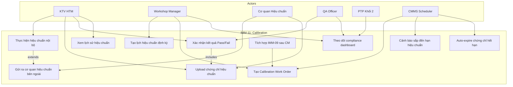
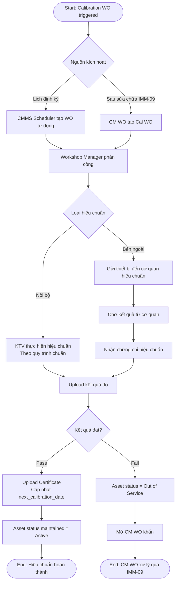
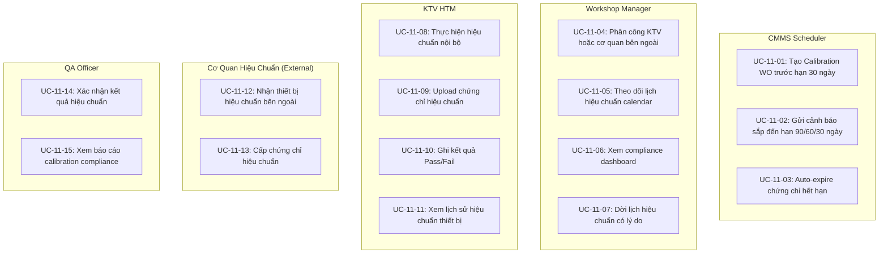
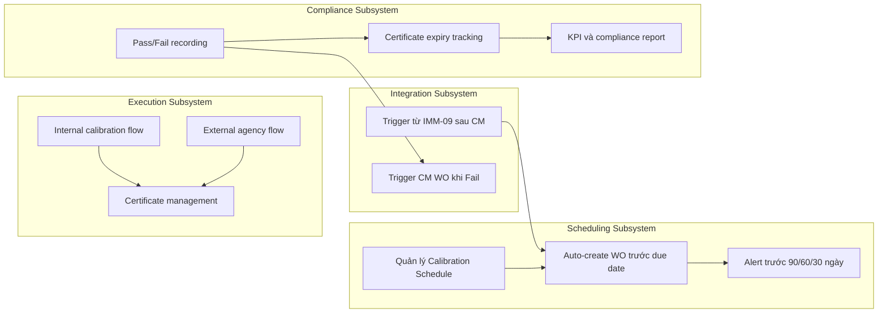

# IMM-11 — Calibration (Hiệu chuẩn Thiết bị Y tế)
## Functional Specification

**Module:** IMM-11
**Version:** 1.0
**Ngày:** 2026-04-17
**Trạng thái:** Draft — Chờ phê duyệt
**Tác giả:** AssetCore Team

---

## 1. Vị trí trong Asset Lifecycle

```
IMM-04 (Lắp đặt) → IMM-05 (Hồ sơ) → [Asset "Active"]
                                              │
                         ┌────────────────────┤
                         │                    │
               ┌─────────▼─────────┐ ┌───────▼────────┐
               │   IMM-08: PM       │ │ IMM-11: CAL    │
               │  Bảo trì định kỳ  │ │ Hiệu chuẩn     │
               │  (tích hợp CAL?)  │ │ Độc lập hoặc   │
               └─────────┬─────────┘ │ trong PM WO    │
                         │           └───────┬────────┘
                         │                   │
                         │          ┌────────▼────────┐
                         │          │ Passed / Failed  │
                         │          └────────┬────────┘
                         │                   │
                         │          ┌────────▼────────┐
                         │          │ Failed → CAPA    │
                         │          │ + Out of Service │
                         │          │ + Lookback       │
                         │          └────────┬────────┘
                         │                   │
                         └───────────────────┘
                                    │ Lỗi nghiêm trọng?
                    ┌──── No ───────┴──── Yes ──────┐
                    │                                │
          [CAL completed]                IMM-09/IMM-12 (CM/Corrective)
          Next CAL scheduled             CAPA → RCA → Resolution
```

**Quan hệ ngang:**
- **IMM-04** → cung cấp `commissioning_date` làm baseline cho kỳ calibration đầu tiên, và `asset_ref`
- **IMM-05** → cung cấp thông số kỹ thuật (tolerance values, calibration interval) từ Service Manual / IFU
- **IMM-08** → Calibration có thể được tích hợp vào PM WO nếu cùng kỳ (`pm_work_order` link trên `Asset Calibration`)
- **IMM-09** → nhận CM WO khi calibration phát hiện lỗi cơ học cần sửa chữa
- **IMM-12** → Corrective Maintenance khi calibration fail do hỏng hóc nghiêm trọng

---

## 2. Workflow Chính (BPMN)

### 2.1 Track A — External Lab (Tổ chức kiểm định được công nhận ISO/IEC 17025)

```
START
  │
  ▼ [Trigger]
  Calibration due (CMMS Scheduler daily job hoặc Manual)
  │
  ▼ [Step 1]
  Tạo Asset Calibration record
  Actor: Workshop Manager / KTV HTM
  Output: CAL-YYYY-#####, status = "Scheduled"
  │
  ▼ [Step 2]
  Liên hệ & đặt lịch với tổ chức kiểm định (external lab)
  Actor: Workshop Manager
  Action: Ghi tên lab, số hợp đồng, ngày gửi dự kiến
  │
  ▼ [Step 3]
  Gửi thiết bị đến lab
  Actor: KTV HTM
  Action: Cập nhật status = "Sent to Lab"
         Ghi ngày gửi, người bàn giao, biên bản giao nhận (attachment)
  │
  ▼ [Step 4]
  Lab thực hiện calibration & cấp chứng chỉ
  Actor: External Lab (tổ chức kiểm định ISO/IEC 17025)
  Output: Calibration Certificate (PDF)
          Measurement results (giá trị đo từng tham số)
  │
  ▼ [Step 5]
  Nhận thiết bị về + nhận chứng chỉ
  Actor: KTV HTM
  Action: status = "Certificate Received"
         Upload chứng chỉ PDF
         Nhập kết quả đo từng tham số vào Calibration Measurement table
  │
  ▼ [Gateway: Kết quả calibration?]
  │
  ├─── PASS (tất cả tham số trong tolerance) ────────────────┐
  │                                                           │
  └─── FAIL (≥1 tham số ngoài tolerance) ─────────────────┐  │
       → Asset.status = "Out of Service"                   │  │
       → Tạo CAPA record bắt buộc                          │  │
       → Lookback assessment                               │  │
       │                                                   │  │
       ▼ [Sub-flow: CAPA Resolution]                       │  │
       CAPA Opened → Root Cause Analysis                   │  │
       → Corrective Action (sửa chữa / thay thế)          │  │
       → Recalibration (nếu cần)                          │  │
       → CAPA Closed → "Conditionally Passed"             │  │
       │                                                   │  │
       └───────────────────────────────────────────────────┘  │
                                                              │
  ◄────────────────────────────────────────────────────────┘  │
  │                                                            │
  ▼ [Step 6] (Auto — triggered on Submit Pass/CAPA Resolved)  │
  Cập nhật next_calibration_date                              │
  next_calibration_date = certificate_date + calibration_interval
  │
  ▼ [Step 7]
  Gắn nhãn/sticker hiệu chuẩn (physical)
  Upload ảnh sticker
  │
  ▼
  END: Calibration hoàn thành, chứng chỉ lưu trữ, lịch cập nhật
  ◄───────────────────────────────────────────────────────────┘
```

### 2.2 Track B — In-House Calibration (KTV nội bộ được chứng nhận)

```
START (In-House Track)
  │
  ▼ [Step 1]
  Tạo Asset Calibration record, calibration_type = "In-House"
  Actor: Workshop Manager / KTV HTM
  Status = "Scheduled"
  │
  ▼ [Step 2]
  KTV thực hiện calibration tại chỗ
  Actor: KTV HTM (có chứng chỉ calibration nội bộ)
  Action: Dùng thiết bị chuẩn (reference standard) đã được kiểm định
         Nhập kết quả từng tham số (Calibration Measurement table)
         Ghi số hiệu thiết bị chuẩn, traceable reference
  Status: "In Progress"
  │
  ▼ [Step 3]
  Submit kết quả (không cần certificate upload — nội bộ)
  Actor: KTV HTM
  Action: Điền tham số, so sánh với tolerance
  │
  ▼ [Gateway: Kết quả?]
  (Tương tự Track A từ bước Gateway trở đi)
  │
  ...
  END
```

---

## 3. Actors & Roles

| Actor | Vai trò | Quyền hệ thống | Trách nhiệm |
|---|---|---|---|
| KTV HTM / Calibration Officer | Thực hiện & nhập kết quả | Create/Edit CAL record, Upload file | Tạo record, nhập kết quả đo, upload chứng chỉ, gắn sticker |
| Workshop Manager | Lập kế hoạch & giám sát | Assign, Schedule, View all | Lập lịch, chọn lab, phân công KTV, monitor trạng thái |
| External Lab (tổ chức kiểm định) | Thực hiện calibration & cấp chứng chỉ | Không có quyền trực tiếp trong hệ thống | Kiểm định, cấp Calibration Certificate ISO/IEC 17025 |
| QA Officer | Xem xét & phê duyệt CAPA | View CAL, Write CAPA | Review CAPA khi calibration fail, đảm bảo RCA đầy đủ |
| PTP Khối 2 | Giám sát compliance | View Dashboard, Reports | Theo dõi calibration compliance rate, escalation |
| CMMS Scheduler | System auto-trigger | System Process | Phát hiện thiết bị đến hạn calibration, tạo draft record |

---

## 4. Input / Output

### INPUT

| Đầu vào | Nguồn |
|---|---|
| Asset & thông số calibration (interval, tolerance) | `Asset` + `Device Model` (từ IMM-05) |
| Calibration Schedule (next_calibration_date, interval) | Tính từ commissioning_date hoặc từ lần calibration trước |
| Calibration Certificate (PDF) | External Lab (track A) |
| Measurement results (parameter, nominal, tolerance, measured, unit) | KTV nhập tay hoặc từ certificate |
| Reference standard info (serial, traceability) | KTV HTM (track B) |
| PM Work Order link (nếu calibration kết hợp PM) | `PM Work Order` IMM-08 |
| Hợp đồng với lab (số hợp đồng, tên lab, scope) | Workshop Manager |

### OUTPUT

| Đầu ra | DocType / Artifact |
|---|---|
| Asset Calibration record (immutable sau Submit) | `Asset Calibration` (CAL-YYYY-#####) |
| Calibration Measurement results | `Calibration Measurement` (child table) |
| Calibration Certificate (file attachment) | Stored trong `Asset Calibration` |
| CAPA Record (bắt buộc nếu fail) | `CAPA Record` |
| Asset Lifecycle Event | `Asset Lifecycle Event` (event_type = "calibration_completed" / "calibration_failed") |
| next_calibration_date (tính tự động) | `Asset.custom_next_calibration_date` |
| Calibration sticker (physical + ảnh digital) | Attachment trên `Asset Calibration` |
| Lookback Assessment Report (nếu fail) | `CAPA Record` (linked lookback field) |

---

## 5. Business Rules

| Mã | Nội dung Rule | Hậu quả vi phạm | Kiểm soát |
|---|---|---|---|
| **BR-11-01** | Calibration certificate từ tổ chức kiểm định được công nhận ISO/IEC 17025 là bắt buộc đối với track External. Lab phải có số công nhận hợp lệ. Không chấp nhận calibration tự làm không có chứng chỉ và không được công nhận. | Record không thể Submit nếu `calibration_type = "External"` mà không có `certificate_file` và `lab_accreditation_number` | Validate on submit: kiểm tra file attachment + accreditation number |
| **BR-11-02** | Khi kết quả calibration = "Fail" (bất kỳ tham số nào `out_of_tolerance = True`), asset PHẢI được set `status = "Out of Service"` VÀ phải mở CAPA record bắt buộc có `root_cause_analysis` | Asset không được phép sử dụng trong tình trạng fail calibration không có CAPA | Tự động set `asset.status = "Out of Service"` và block Submit nếu chưa có CAPA reference |
| **BR-11-03** | Lookback assessment bắt buộc khi calibration fail — phải review tất cả assets cùng `device_model` đang "Active" để đánh giá liệu các thiết bị cùng loại có bị ảnh hưởng không. Kết quả lookback (cleared / action required) phải được ghi vào CAPA record. | Bỏ sót thiết bị cùng loại có lỗi tương tự → rủi ro lâm sàng nghiêm trọng | Field `lookback_status` trên CAPA Record, bắt buộc điền trước khi CAPA Closed |
| **BR-11-04** | `next_calibration_date = certificate_date + calibration_interval` — tính từ ngày cấp chứng chỉ (`certificate_date`), KHÔNG phải từ `due_date` gốc hay ngày thực hiện | Nếu tính từ due_date, thiết bị bị trễ calibration sẽ tích lũy sai lệch lịch | Computed field, auto-calculate on Submit. `calibration_interval` lấy từ `Device Model.calibration_interval_days` |
| **BR-11-05** | `Asset Calibration` record không thể xóa sau khi Submit. Nếu cần sửa, phải dùng Amend với lý do bắt buộc (immutable audit trail đảm bảo traceability cho ISO 13485 §4.2.5, NĐ98 Điều 40) | Xóa record vi phạm audit trail — không thể chứng minh compliance với cơ quan quản lý | DocType submittable, `is_submittable = 1`, không có nút Delete sau Submit. Amend log bắt buộc có `amendment_reason` |

---

## 6. Tính toán ngày Calibration tiếp theo

### 6.1 Calibration đầu tiên (từ IMM-04)

```
first_calibration_date = commissioning_date + calibration_interval_days
```

**Trigger:** Khi `Asset Commissioning` (IMM-04) được Submit — event hook `on_submit`.
**Nguồn interval:** `Device Model.calibration_interval_days` (lấy từ manufacturer specification / IFU).

### 6.2 Calibration tiếp theo (từ certificate_date)

```
next_calibration_date = certificate_date + calibration_interval_days
```

**Áp dụng:** BR-11-04 — tính từ ngày cấp chứng chỉ, không phải ngày đến hạn.
**Điều kiện:** `Asset Calibration.status = "Passed"` hoặc `"Conditionally Passed"`.

### 6.3 Overdue detection (daily scheduler)

```python
if today > next_calibration_date and asset.status == "Active":
    send_alert(level="warning", days_overdue=delta_days)
    if delta_days > 30:
        asset.custom_calibration_status = "Critically Overdue"
        escalate_to_ptp()
```

### 6.4 Slippage tolerance

| Trễ | Mức | Hành động |
|---|---|---|
| ≤ 7 ngày | Cảnh báo vàng | Alert Workshop Manager |
| 8–30 ngày | Cảnh báo đỏ | Escalate PTP Khối 2, ghi compliance log |
| > 30 ngày | Critical | Leo thang BGĐ + Compliance Report + cân nhắc "Out of Service" |

### 6.5 Calibration kết hợp với PM (IMM-08)

Nếu `Asset Calibration.pm_work_order` được điền (link đến PM WO), thì:
- Ngày calibration lấy theo ngày hoàn thành PM WO
- `certificate_date` vẫn phải là ngày do lab cấp (không được thay bằng ngày PM)
- KPI PM và KPI Calibration được tính riêng biệt

---

## 7. Exception Handling

| Tình huống | Điều kiện kích hoạt | Xử lý hệ thống | Xử lý nghiệp vụ |
|---|---|---|---|
| Lab không có chứng nhận ISO/IEC 17025 hợp lệ | `lab_accreditation_number` không pass validation | Block Submit, hiện thông báo lỗi rõ ràng | Workshop Manager chọn lab khác hoặc xác nhận chứng nhận còn hiệu lực |
| Thiết bị hỏng khi đang tại lab | Lab báo thiết bị không hoạt động được trong quá trình cal | KTV update status = "On Hold – Device Damaged" | Mở CM WO khẩn, phối hợp với lab về bảo hiểm / trách nhiệm |
| Chứng chỉ có lỗi (số series sai, ngày sai) | KTV nhập không khớp với file PDF | Hệ thống không tự phát hiện — cần QA review | KTV liên hệ lab yêu cầu cấp lại chứng chỉ, ghi amendment reason |
| Thiết bị fail calibration nhưng cần dùng khẩn cấp | Khoa phòng yêu cầu dùng ngay khi asset "Out of Service" | Hệ thống block — không thể tự override | PTP/BGĐ phê duyệt "Emergency Override" (ghi log đặc biệt) + CAPA vẫn bắt buộc |
| CAPA không được đóng trong 30 ngày | CAPA record open > 30 ngày | Auto-alert QA Officer và PTP Khối 2 | Escalate, yêu cầu update action plan |
| Calibration interval không có trong Device Model | `Device Model.calibration_interval_days = null` | Cảnh báo khi tạo CAL record | CMMS Admin cập nhật Device Model trước khi schedule |
| Thiết bị đang "Out of Service" khi đến hạn cal | Asset status check | Không tạo auto CAL record | Workshop Manager quyết định gửi cal hay sửa trước |

---

## 8. User Stories (INVEST)

| ID | Story | SP |
|---|---|---|
| US-11-01 | Với tư cách là **Workshop Manager**, tôi muốn xem danh sách tất cả thiết bị đến hạn calibration trong 30 ngày tới, để lên kế hoạch gửi thiết bị và đặt lịch với lab không bị bỏ sót. | 5 |
| US-11-02 | Với tư cách là **KTV HTM**, tôi muốn nhập kết quả đo lường từng tham số calibration (nominal, tolerance, measured value) và hệ thống tự động tính Pass/Fail, để loại bỏ tính toán thủ công và giảm nguy cơ sai sót. | 8 |
| US-11-03 | Với tư cách là **KTV HTM**, tôi muốn upload Calibration Certificate PDF trực tiếp vào record, để chứng chỉ được lưu trữ an toàn, có thể tra cứu bất kỳ lúc nào mà không cần tìm file cứng. | 3 |
| US-11-04 | Với tư cách là **QA Officer**, tôi muốn hệ thống tự động tạo CAPA record và set thiết bị "Out of Service" khi calibration fail, để đảm bảo không có thiết bị nào không đạt tiêu chuẩn vẫn được sử dụng trên bệnh nhân. | 8 |
| US-11-05 | Với tư cách là **PTP Khối 2**, tôi muốn xem Calibration Compliance Rate (% hoàn thành đúng hạn) và Out-of-Tolerance Rate theo loại thiết bị, để báo cáo ban giám đốc và ưu tiên nguồn lực bảo dưỡng. | 5 |
| US-11-06 | Với tư cách là **Workshop Manager**, tôi muốn hệ thống tự động thực hiện lookback assessment bằng cách liệt kê tất cả thiết bị cùng model khi có calibration fail, để đánh giá nhanh nguy cơ và không bỏ sót thiết bị có lỗi tương tự. | 8 |
| US-11-07 | Với tư cách là **KTV HTM**, tôi muốn xem lịch sử toàn bộ lần calibration của một thiết bị (certificate date, result, lab, next due), để chuẩn bị hồ sơ khi cơ quan quản lý thanh tra. | 3 |

---

## 9. Acceptance Criteria (Gherkin)

```gherkin
Feature: IMM-11 Asset Calibration

Scenario: CAL-11-AC-01 — Calibration External Pass thành công
  Given Thiết bị "ACC-ASS-2026-00101" có calibration_type = "External"
    And next_calibration_date = hôm nay - 2 ngày (overdue nhẹ)
    And Device Model calibration_interval_days = 365
  When KTV tạo Asset Calibration record CAL-2026-00001
    And KTV update status = "Sent to Lab" với lab_name và lab_accreditation_number hợp lệ
    And KTV nhận chứng chỉ, upload PDF, nhập 5 tham số đo (tất cả trong tolerance)
    And KTV Submit record
  Then Asset Calibration status = "Passed"
    And Asset Lifecycle Event được tạo (event_type = "calibration_completed")
    And next_calibration_date = certificate_date + 365 ngày (BR-11-04)
    And Asset.custom_next_calibration_date được cập nhật
    And Không có CAPA record được tạo

Scenario: CAL-11-AC-02 — Calibration Fail → CAPA bắt buộc + Out of Service
  Given Thiết bị "ACC-ASS-2026-00102" đang "Active"
    And KTV đã submit kết quả calibration với 1 tham số out_of_tolerance = True
  When KTV nhấn Submit
  Then Asset Calibration status = "Failed"
    And Asset.status tự động chuyển sang "Out of Service"
    And Hệ thống tự động tạo CAPA Record với asset_ref, cal_ref, status = "Open"
    And Notification gửi đến QA Officer và PTP Khối 2
    And Asset Lifecycle Event được tạo (event_type = "calibration_failed")
    And Dashboard hiển thị thiết bị với badge "Calibration Failed – OOS"

Scenario: CAL-11-AC-03 — Submit không có certificate file (External track)
  Given KTV đang tạo Asset Calibration với calibration_type = "External"
    And Tất cả measurement parameters đã nhập
    And Không có file đính kèm certificate
  When KTV nhấn Submit
  Then Hệ thống hiện thông báo lỗi: "Vui lòng upload Calibration Certificate trước khi Submit (BR-11-01)"
    And Record giữ nguyên trạng thái "Certificate Received"
    And Không có Lifecycle Event nào được tạo

Scenario: CAL-11-AC-04 — Lookback Assessment khi calibration fail
  Given Thiết bị "ACC-ASS-2026-00103" cùng Device Model "Sysmex XN-1000" với 3 thiết bị khác đang Active
    And Calibration record của "00103" vừa Submit với kết quả = "Failed"
  When Hệ thống xử lý on_submit fail path
  Then CAPA Record được tạo với field lookback_required = True
    And CAPA record chứa danh sách assets cùng Device Model: ["ACC-ASS-2026-00104", "ACC-ASS-2026-00105", "ACC-ASS-2026-00106"]
    And lookback_status = "Pending" cho đến khi QA Officer điền kết quả
    And Notification gửi Workshop Manager: "Cần đánh giá lookback 3 thiết bị cùng model"

Scenario: CAL-11-AC-05 — CAPA Resolved → Conditionally Passed
  Given CAPA Record "CAPA-2026-00015" liên kết với CAL-2026-00008 (Failed)
    And Root cause đã xác định: "Drift do nhiệt độ môi trường"
    And Corrective action: "Tái hiệu chuẩn sau khi điều chỉnh"
    And lookback_status = "Cleared" (3 thiết bị cùng loại không có vấn đề)
  When QA Officer cập nhật CAPA status = "Closed"
    And Thiết bị được gửi tái hiệu chuẩn và nhận chứng chỉ mới (Pass)
  Then Asset.status chuyển từ "Out of Service" → "Active"
    And Asset Calibration record gốc vẫn giữ nguyên status = "Failed" (immutable)
    And Calibration record mới được tạo với status = "Passed" (recalibration)
    And Asset Lifecycle Event: "calibration_conditionally_passed"

Scenario: CAL-11-AC-06 — In-House Calibration không cần certificate upload
  Given KTV tạo Asset Calibration với calibration_type = "In-House"
    And KTV điền reference_standard_serial và traceability_reference
    And KTV nhập tất cả measurement parameters (pass)
  When KTV Submit
  Then Submit thành công không yêu cầu certificate_file (BR-11-01 chỉ áp dụng External)
    And Record ghi nhận technician_name và reference_standard_info
    And next_calibration_date được tính từ completion_date (không có certificate_date)
```

---

## 10. WHO HTM & QMS Mapping

| Yêu cầu IMM-11 | WHO Reference | ISO Standard | NĐ98/2021 | Ghi chú |
|---|---|---|---|---|
| Calibration interval theo manufacturer | WHO HTM §5.4.2 | ISO 13485 §7.6 | Điều 38 | `Device Model.calibration_interval_days` từ IFU |
| Chứng chỉ calibration từ lab được công nhận | WHO HTM §5.4.3 | ISO/IEC 17025 | Điều 39 Khoản 1 | `lab_accreditation_number` bắt buộc (BR-11-01) |
| Measurement traceability (SI units) | WHO HTM §5.4.4 | ISO/IEC 17025 §6.5 | Điều 39 Khoản 2 | `traceability_reference` trên Calibration record |
| Out-of-tolerance → CAPA bắt buộc | WHO HTM §5.4.5 | ISO 13485 §8.5.2 | Điều 40 Khoản 1 | BR-11-02, auto-create CAPA |
| Lookback assessment | WHO HTM §5.4.6 | ISO 13485 §8.5.3 | Điều 40 Khoản 2 | BR-11-03, lookback_status bắt buộc |
| Immutable calibration records | WHO HTM §6.4 | ISO 13485 §4.2.5 | Điều 40 Khoản 3 | BR-11-05, Amend only sau Submit |
| KPI calibration compliance | WHO HTM 2025 §6.2 | ISO 9001 §9.1 | — | % done on time / total scheduled |
| Audit trail đầy đủ | WHO HTM §6.4 | ISO 13485 §7.5.3 | Điều 40 | Asset Lifecycle Event + timestamp + user |

---

## Use Case Diagram



---

## Activity Diagram — Calibration Flow



---

## Non-Functional Requirements

| ID | Yêu cầu | Chỉ tiêu | Phương pháp kiểm tra |
|---|---|---|---|
| NFR-11-01 | Certificate storage | Giữ tối thiểu 7 năm | Data retention test |
| NFR-11-02 | Scheduler reliability | Tạo WO trước due_date 30 ngày | Scheduler test |
| NFR-11-03 | PDF export | Export certificate < 3s | Performance test |
| NFR-11-04 | External agency integration | API hoặc email workflow | E2E test |
| NFR-11-05 | Alert delivery | Cảnh báo 90/60/30 ngày trước hạn | Scheduler test |

---

## Biểu Đồ Use Case Phân Rã — IMM-11

### Phân rã theo Actor



### Phân rã theo Subsystem



---

## Đặc Tả Use Case — IMM-11

### UC-11-01: Tạo Calibration WO tự động

| Thuộc tính | Nội dung |
|---|---|
| **UC ID** | UC-11-01 |
| **Tên** | Tạo Calibration Work Order tự động trước ngày đến hạn |
| **Actor chính** | CMMS Scheduler |
| **Actor phụ** | Workshop Manager (nhận notification) |
| **Tiền điều kiện** | Calibration Schedule tồn tại; next_due_date <= today + 30 ngày; Asset.status = Active |
| **Hậu điều kiện** | Calibration WO tạo với status = Scheduled; notification gửi Workshop Manager |
| **Luồng chính** | 1. Scheduler query Calibration Schedules (next_due_date <= today+30)<br>2. Kiểm tra Asset.status<br>3. Kiểm tra chưa có WO pending cho cùng asset + chu kỳ<br>4. Tạo Calibration Work Order<br>5. Set status = Scheduled, scheduled_date = next_due_date<br>6. Gửi notification Workshop Manager |
| **Luồng thay thế** | 2a. Asset Out of Service → skip, log<br>3a. WO đã tồn tại → skip tránh duplicate |
| **Luồng ngoại lệ** | 4a. WO creation fail → retry lần sau |
| **Business Rule** | BR-11-01: Tạo WO trước 30 ngày để đủ thời gian chuẩn bị |

---

### UC-11-10: Ghi kết quả Pass/Fail

| Thuộc tính | Nội dung |
|---|---|
| **UC ID** | UC-11-10 |
| **Tên** | Ghi nhận kết quả hiệu chuẩn và upload chứng chỉ |
| **Actor chính** | KTV HTM / QA Officer |
| **Actor phụ** | CMMS System (auto-update) |
| **Tiền điều kiện** | Calibration WO ở trạng thái In Progress; thiết bị đã được hiệu chuẩn |
| **Hậu điều kiện** | Kết quả ghi nhận; nếu Pass → Certificate tạo, next_due_date cập nhật; nếu Fail → Asset Out of Service, CM WO tạo |
| **Luồng chính** | 1. KTV mở WO, chọn result = Pass hoặc Fail<br>2. Điền: standard_used, tolerance_value, measurement_data<br>3. Upload file chứng chỉ hiệu chuẩn<br>4a. Nếu Pass: hệ thống tạo Calibration Certificate<br>4b. Hệ thống set completion_date = today<br>4c. Cập nhật Calibration Schedule.next_due_date = today + interval<br>4d. Cập nhật Asset.last_calibration_date |
| **Luồng thay thế** | Nếu Fail: Asset.status = Out of Service; Tạo CM WO khẩn (IMM-09) |
| **Luồng ngoại lệ** | Upload fail → retry, WO vẫn ở In Progress |
| **Business Rule** | BR-11-02: Certificate phải upload trước khi đóng WO Pass; BR-11-03: Fail → bắt buộc tạo CM WO |
