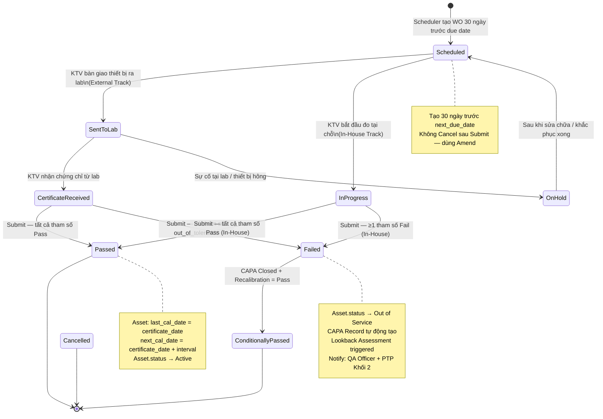

# IMM-11 — Technical Design

## Calibration Management System

**Module:** IMM-11 — Calibration (Hiệu chuẩn thiết bị đo lường)
**Version:** 2.0
**Ngày:** 2026-04-17
**Trạng thái:** Draft — NOT CODED YET
**Author:** AssetCore Team

---

## 1. ERD — Entity Relationship Diagram

```mermaid
erDiagram
    Asset {
        string name PK
        string asset_name
        string device_model FK
        string status
        date custom_last_calibration_date
        date custom_next_calibration_date
        string custom_calibration_status
        int custom_calibration_interval_days
    }

    CalibrationSchedule {
        string name PK
        string asset FK
        string device_model FK
        string calibration_type
        int interval_days
        date last_calibration_date
        date next_due_date
        string preferred_lab
        bool is_active
    }

    AssetCalibration {
        string name PK
        string calibration_schedule FK
        string asset FK
        string calibration_type
        string status
        date scheduled_date
        date actual_date
        string lab_name
        string lab_accreditation_number
        string certificate_file
        date certificate_date
        string certificate_number
        date certificate_expiry
        string overall_result
        string technician FK
        string reference_standard_serial
        string traceability_reference
        string pm_work_order FK
        string capa_record FK
    }

    CalibrationMeasurement {
        string name PK
        string parent FK
        string parameter_name
        string unit
        float nominal_value
        float tolerance_positive
        float tolerance_negative
        float measured_value
        bool out_of_tolerance
        string pass_fail
    }

    CAPARecord {
        string name PK
        string source_doc_type
        string source_doc FK
        string asset FK
        string device_model FK
        string trigger_type
        string root_cause
        string corrective_action
        date corrective_action_due
        string preventive_action
        string status
        string closed_by FK
        date closed_date
        bool lookback_required
        string lookback_status
        string lookback_assets
    }

    AssetLifecycleEvent {
        string name PK
        string asset FK
        string event_type
        datetime timestamp
        string actor FK
        string from_status
        string to_status
        string root_record
        string notes
    }

    Asset ||--o{ CalibrationSchedule : "has schedule"
    Asset ||--o{ AssetCalibration : "has calibrations"
    Asset ||--o{ AssetLifecycleEvent : "has events"
    CalibrationSchedule ||--o{ AssetCalibration : "generates"
    AssetCalibration ||--o{ CalibrationMeasurement : "has measurements"
    AssetCalibration ||--o| CAPARecord : "triggers on fail"
    CAPARecord ||--o{ AssetLifecycleEvent : "triggers events"
```



---

## 2. Data Dictionary

### 2.1 `Calibration Schedule` (Lịch hiệu chuẩn)

**Mục đích:** Master record quản lý chu kỳ hiệu chuẩn cho từng thiết bị — là nguồn để scheduler tạo WO tự động.
**Naming Series:** `CAL-SCH-YYYY-#####`
**DocType type:** Non-submittable

| Field | Label (VI) | Type | Options / Notes | Mandatory |
| --- | --- | --- | --- | --- |
| `asset` | Thiết bị | Link | Asset | Yes |
| `device_model` | Model thiết bị | Link | Device Model (auto-fetch từ Asset) | Yes |
| `calibration_type` | Loại hiệu chuẩn | Select | External, In-House | Yes |
| `interval_days` | Chu kỳ (ngày) | Int | Auto-populate từ Device Model | Yes |
| `last_calibration_date` | Ngày hiệu chuẩn gần nhất | Date | Cập nhật từ Asset Calibration on_submit | Auto |
| `next_due_date` | Ngày đến hạn tiếp theo | Date | Computed: last_calibration_date + interval_days | Auto |
| `preferred_lab` | Lab ưu tiên | Data | Tên lab mặc định cho External | No |
| `is_active` | Đang hoạt động | Check | False = tạm dừng lịch hiệu chuẩn | Yes |

**Tạo tự động:** `create_calibration_schedule_from_commissioning()` được gọi khi Asset Commissioning (IMM-04) on_submit, nếu Device Model có `calibration_required = True`.

---

### 2.2 `Asset Calibration` (Phiếu hiệu chuẩn)

**Mục đích:** Record từng lần thực hiện hoặc gửi hiệu chuẩn — immutable sau Submit.
**Naming Series:** `CAL-YYYY-#####`
**DocType type:** Submittable

| Field | Label (VI) | Type | Options / Notes | Mandatory |
| --- | --- | --- | --- | --- |
| `calibration_schedule` | Lịch hiệu chuẩn | Link | Calibration Schedule | Yes |
| `asset` | Thiết bị | Link | Asset | Yes |
| `calibration_type` | Loại hiệu chuẩn | Select | External, In-House | Yes |
| `scheduled_date` | Ngày dự kiến | Date | — | Yes |
| `actual_date` | Ngày thực hiện | Date | Set khi Submit | Auto |
| `status` | Trạng thái | Select | Scheduled, Sent to Lab, Certificate Received, Passed, Failed, Conditionally Passed, Cancelled | Yes |
| `lab_name` | Tên tổ chức kiểm định | Data | Bắt buộc nếu External | Conditional |
| `lab_accreditation_number` | Số công nhận ISO/IEC 17025 | Data | Bắt buộc nếu External (BR-11-01) | Conditional |
| `certificate_file` | File chứng chỉ (PDF) | Attach | Bắt buộc nếu External (BR-11-01) | Conditional |
| `certificate_date` | Ngày cấp chứng chỉ | Date | Basis tính next_calibration_date (BR-11-04) | Conditional |
| `certificate_number` | Số chứng chỉ | Data | — | No |
| `certificate_expiry` | Ngày hết hạn chứng chỉ | Date | — | No |
| `overall_result` | Kết quả tổng thể | Select | Passed, Failed, Conditionally Passed | Auto |
| `technician` | KTV thực hiện | Link | User | Yes |
| `reference_standard_serial` | Serial thiết bị chuẩn | Data | Chỉ khi In-House | Conditional |
| `traceability_reference` | Tham chiếu traceability | Data | Ví dụ: VLAS-T-xxx, NAATI | Conditional |
| `pm_work_order` | PM Work Order liên kết | Link | PM Work Order (tùy chọn) | No |
| `measurements` | Kết quả đo lường | Table | Child: Calibration Measurement | Yes |
| `capa_record` | CAPA liên kết | Link | CAPA Record (auto-set khi Fail) | Auto |

---

### 2.3 `Calibration Measurement` (Kết quả đo từng tham số — Child Table)

**Mục đích:** Lưu từng tham số đo lường với giá trị danh định, dung sai và kết quả thực đo.
**Parent:** Asset Calibration

| Field | Label (VI) | Type | Notes | Mandatory |
| --- | --- | --- | --- | --- |
| `parameter_name` | Tên tham số | Data | Ví dụ: "Áp suất đỉnh (PIP)", "Thể tích lưu thông" | Yes |
| `unit` | Đơn vị | Data | Ví dụ: cmH₂O, mL, V, mmHg | Yes |
| `nominal_value` | Giá trị danh định | Float | Giá trị lý thuyết theo IFU | Yes |
| `tolerance_positive` | Dung sai (+) | Float | Ví dụ: 2 = ±2% | Yes |
| `tolerance_negative` | Dung sai (-) | Float | Thường bằng tolerance_positive | Yes |
| `measured_value` | Giá trị đo thực tế | Float | KTV nhập từ certificate / thiết bị | Yes |
| `out_of_tolerance` | Ngoài dung sai | Check | Computed server-side | Auto |
| `pass_fail` | Kết quả | Select | Pass, Fail | Auto |

**Computed logic:**

```python
deviation = measured_value - nominal_value
out_of_tolerance = deviation > tolerance_positive or deviation < -tolerance_negative
pass_fail = "Fail" if out_of_tolerance else "Pass"
```

---

### 2.4 `CAPA Record` (Hồ sơ phòng ngừa và khắc phục)

**Mục đích:** Ghi nhận nguyên nhân, hành động khắc phục, và kết quả Lookback Assessment khi calibration fail.
**Naming Series:** `CAPA-YYYY-#####`
**DocType type:** Submittable

| Field | Label (VI) | Type | Options / Notes | Mandatory |
| --- | --- | --- | --- | --- |
| `source_doc_type` | Loại tài liệu nguồn | Data | "Asset Calibration" | Auto |
| `source_doc` | Tài liệu nguồn | Dynamic Link | Asset Calibration | Auto |
| `asset` | Thiết bị | Link | Asset | Yes |
| `device_model` | Model thiết bị | Link | Device Model | Yes |
| `trigger_type` | Loại trigger | Select | Calibration_Fail, Chronic_Failure, Audit | Auto |
| `root_cause` | Nguyên nhân gốc rễ | Text | Bắt buộc trước khi Close | Conditional |
| `corrective_action` | Hành động khắc phục | Text | — | Yes |
| `corrective_action_due` | Hạn hoàn thành khắc phục | Date | Default: ngày mở + 30 ngày | Yes |
| `preventive_action` | Hành động phòng ngừa | Text | — | No |
| `status` | Trạng thái | Select | Open, In Review, Pending Verification, Closed | Yes |
| `closed_by` | Người đóng | Link | User | Conditional |
| `closed_date` | Ngày đóng | Date | Auto-set khi status = Closed | Auto |
| `lookback_required` | Cần Lookback | Check | Auto True khi trigger_type = Calibration_Fail | Auto |
| `lookback_status` | Trạng thái Lookback | Select | Pending, In Progress, Cleared, Action Required | Auto |
| `lookback_assets` | Danh sách thiết bị cùng model | Text | JSON list of asset names — auto-populated | Auto |

---

## 3. State Machine



---

## 4. Backend Implementation

### 4.1 Service Layer — `services/imm11.py`

```python
"""
IMM-11 Calibration Management — Service Layer
Toàn bộ business logic đặt tại đây.
Controller chỉ gọi functions, không chứa logic.
"""
import frappe
from frappe import _
from frappe.utils import nowdate, add_days, date_diff, getdate, now
from typing import Optional


def create_calibration_schedule_from_commissioning(doc) -> None:
    """
    Tạo Calibration Schedule khi Asset Commissioning (IMM-04) được Submit.
    Chỉ tạo nếu Device Model.calibration_required = True.

    Args:
        doc: Asset Commissioning document (on_submit hook)
    """
    device_model = frappe.db.get_value("Asset", doc.asset, "device_model")
    if not device_model:
        return

    cal_required = frappe.db.get_value("Device Model", device_model, "calibration_required")
    if not cal_required:
        return

    interval_days = frappe.db.get_value("Device Model", device_model, "calibration_interval_days") or 365
    cal_type = frappe.db.get_value("Device Model", device_model, "calibration_type_default") or "External"

    schedule = frappe.get_doc({
        "doctype": "Calibration Schedule",
        "asset": doc.asset,
        "device_model": device_model,
        "calibration_type": cal_type,
        "interval_days": interval_days,
        "last_calibration_date": doc.commissioning_date or nowdate(),
        "next_due_date": add_days(doc.commissioning_date or nowdate(), interval_days),
        "is_active": 1,
    })
    schedule.insert(ignore_permissions=True)


def create_due_calibration_wos() -> None:
    """
    Tạo draft Asset Calibration WO cho các thiết bị đến hạn trong 30 ngày.
    Chạy daily — 06:00. Bỏ qua nếu WO Scheduled đã tồn tại.
    """
    alert_threshold = add_days(nowdate(), 30)

    due_schedules = frappe.get_all(
        "Calibration Schedule",
        filters={
            "is_active": 1,
            "next_due_date": ("<=", alert_threshold),
        },
        fields=["name", "asset", "device_model", "calibration_type",
                "interval_days", "next_due_date", "preferred_lab"],
    )

    for sched in due_schedules:
        existing = frappe.db.exists("Asset Calibration", {
            "calibration_schedule": sched.name,
            "status": ("in", ["Scheduled", "Sent to Lab", "Certificate Received"]),
        })
        if existing:
            continue

        cal = frappe.get_doc({
            "doctype": "Asset Calibration",
            "calibration_schedule": sched.name,
            "asset": sched.asset,
            "calibration_type": sched.calibration_type,
            "scheduled_date": sched.next_due_date,
            "status": "Scheduled",
            "lab_name": sched.preferred_lab or "",
        })
        cal.insert(ignore_permissions=True)


def check_calibration_expiry() -> None:
    """
    Cập nhật custom_calibration_status trên Asset dựa trên next_due_date.
    Chạy daily. Trạng thái: On Schedule / Due Soon (≤30d) / Overdue.
    """
    assets = frappe.get_all(
        "Asset",
        filters={"status": "Active", "custom_next_calibration_date": ("!=", "")},
        fields=["name", "custom_next_calibration_date"],
    )
    today = getdate(nowdate())

    for asset in assets:
        if not asset.custom_next_calibration_date:
            continue
        days_left = date_diff(asset.custom_next_calibration_date, today)
        if days_left < 0:
            cal_status = "Overdue"
        elif days_left <= 30:
            cal_status = "Due Soon"
        else:
            cal_status = "On Schedule"
        frappe.db.set_value("Asset", asset.name, "custom_calibration_status", cal_status)


def handle_calibration_fail(cal_doc) -> None:
    """
    Xử lý khi calibration kết quả FAIL (BR-11-02, BR-11-03):
    1. Set Asset.status = Out of Service
    2. Tạo CAPA Record bắt buộc
    3. Trigger Lookback Assessment cùng device_model
    4. Notify QA + PTP

    Args:
        cal_doc: Asset Calibration document (submitted, overall_result = Failed)
    """
    # 1. Set OOS
    frappe.db.set_value("Asset", cal_doc.asset, {
        "status": "Out of Service",
        "custom_calibration_status": "Calibration Failed",
    })

    # 2. Tạo CAPA
    capa_name = _create_capa_record(cal_doc)

    # 3. Lookback
    _trigger_lookback_assessment(cal_doc.device_model, cal_doc.name, capa_name)

    # 4. Audit trail
    frappe.get_doc({
        "doctype": "Asset Lifecycle Event",
        "asset": cal_doc.asset,
        "event_type": "calibration_failed",
        "timestamp": now(),
        "actor": frappe.session.user,
        "from_status": "Active",
        "to_status": "Out of Service",
        "root_record": cal_doc.name,
        "notes": f"CAPA: {capa_name}. Lookback triggered for model {cal_doc.device_model}",
    }).insert(ignore_permissions=True)

    # 5. Notify
    _notify_calibration_fail(cal_doc, capa_name)


def perform_lookback_assessment(device_model: str, failed_cal_name: str) -> list:
    """
    Tìm tất cả Asset cùng device_model đang Active.
    Trả về danh sách để ghi vào CAPA Record.

    Args:
        device_model: Tên Device Model
        failed_cal_name: Tên Asset Calibration đã fail (loại trừ khỏi kết quả)

    Returns:
        list: Danh sách asset names cùng model cần xem xét
    """
    failed_asset = frappe.db.get_value("Asset Calibration", failed_cal_name, "asset")
    same_model = frappe.get_all(
        "Asset",
        filters={
            "device_model": device_model,
            "status": "Active",
            "name": ("!=", failed_asset),
        },
        fields=["name", "asset_name"],
    )
    return [a.name for a in same_model]


def update_asset_calibration_dates(
    asset_name: str, certificate_date: str, interval_days: int
) -> None:
    """
    Cập nhật custom fields trên Asset sau calibration PASS (BR-11-04).
    next_calibration_date = certificate_date + interval_days (NOT due_date).

    Args:
        asset_name: Tên Asset
        certificate_date: Ngày cấp chứng chỉ (YYYY-MM-DD)
        interval_days: Chu kỳ hiệu chuẩn (ngày)
    """
    next_date = add_days(certificate_date, interval_days)
    frappe.db.set_value("Asset", asset_name, {
        "custom_last_calibration_date": certificate_date,
        "custom_next_calibration_date": next_date,
        "custom_calibration_status": "On Schedule",
    })
    return next_date


def _create_capa_record(cal_doc) -> str:
    """Tạo CAPA Record tự động khi calibration fail (BR-11-02)."""
    capa = frappe.get_doc({
        "doctype": "CAPA Record",
        "source_doc_type": "Asset Calibration",
        "source_doc": cal_doc.name,
        "asset": cal_doc.asset,
        "device_model": cal_doc.device_model,
        "trigger_type": "Calibration_Fail",
        "status": "Open",
        "corrective_action": "Chưa xác định — cần RCA",
        "corrective_action_due": add_days(nowdate(), 30),
        "lookback_required": 1,
        "lookback_status": "Pending",
    })
    capa.insert(ignore_permissions=True)
    frappe.db.commit()
    return capa.name


def _trigger_lookback_assessment(
    device_model: str, failed_cal_name: str, capa_name: str
) -> None:
    """Ghi danh sách asset cùng model vào CAPA để thực hiện lookback (BR-11-03)."""
    asset_list = perform_lookback_assessment(device_model, failed_cal_name)
    frappe.db.set_value("CAPA Record", capa_name, {
        "lookback_assets": str(asset_list),
        "lookback_status": "In Progress" if asset_list else "Cleared",
    })


def _notify_calibration_fail(cal_doc, capa_name: str) -> None:
    """Gửi email notification đến QA Officer và PTP Khối 2."""
    qa_users = frappe.get_all("Has Role", filters={"role": "QA Officer"}, pluck="parent")
    ptp_users = frappe.get_all("Has Role", filters={"role": "PTP Khối 2"}, pluck="parent")
    recipients = list(set(qa_users + ptp_users))
    for user in recipients:
        frappe.sendmail(
            recipients=[user],
            subject=f"[ASSETCORE] Calibration FAIL — {cal_doc.asset}",
            message=(
                f"Thiết bị <b>{cal_doc.asset}</b> KHÔNG ĐẠT hiệu chuẩn.<br>"
                f"Phiếu: <b>{cal_doc.name}</b><br>"
                f"CAPA đã mở: <b>{capa_name}</b><br>"
                f"Thiết bị đã chuyển sang <b>Out of Service</b>.<br>"
                f"Vui lòng thực hiện Lookback Assessment."
            ),
        )


def create_post_repair_calibration(asset_name: str) -> Optional[str]:
    """
    Tạo Asset Calibration sau khi sửa chữa xong (IMM-09 → IMM-11).
    Chỉ tạo nếu Asset có Calibration Schedule đang active.

    Args:
        asset_name: Tên Asset vừa hoàn thành sửa chữa

    Returns:
        Optional[str]: Tên Asset Calibration mới, hoặc None nếu không cần
    """
    sched = frappe.db.get_value(
        "Calibration Schedule",
        {"asset": asset_name, "is_active": 1},
        "name",
    )
    if not sched:
        return None

    cal = frappe.get_doc({
        "doctype": "Asset Calibration",
        "calibration_schedule": sched,
        "asset": asset_name,
        "calibration_type": frappe.db.get_value("Calibration Schedule", sched, "calibration_type"),
        "scheduled_date": nowdate(),
        "status": "Scheduled",
    })
    cal.insert(ignore_permissions=True)
    return cal.name
```

---

### 4.2 Controller — `asset_calibration.py`

```python
"""
Asset Calibration DocType Controller
Không chứa business logic — chỉ gọi service layer (imm11.py).
"""
import frappe
from frappe.model.document import Document
from assetcore.services.imm11 import (
    handle_calibration_fail,
    update_asset_calibration_dates,
)


class AssetCalibration(Document):
    def validate(self):
        """BR-11-01: External calibration bắt buộc có certificate + accreditation number."""
        self._auto_populate_fields()
        if self.calibration_type == "External":
            if not self.certificate_file:
                frappe.throw(
                    _("Vui lòng upload Calibration Certificate trước khi Submit (BR-11-01)")
                )
            if not self.lab_accreditation_number:
                frappe.throw(
                    _("Vui lòng nhập Số công nhận ISO/IEC 17025 của tổ chức kiểm định (BR-11-01)")
                )

    def before_submit(self):
        """Tính overall_result từ measurements trước khi Submit."""
        self._compute_measurement_results()
        self.actual_date = frappe.utils.nowdate()

    def on_submit(self):
        """BR-11-02: Nếu Fail → CAPA + OOS. BR-11-04: Cập nhật next calibration date."""
        if self.overall_result == "Failed":
            handle_calibration_fail(self)
        elif self.overall_result in ("Passed", "Conditionally Passed"):
            interval = frappe.db.get_value(
                "Calibration Schedule", self.calibration_schedule, "interval_days"
            ) or 365
            next_date = update_asset_calibration_dates(
                self.asset, str(self.certificate_date or self.actual_date), interval
            )
            frappe.db.set_value("Asset Calibration", self.name, "next_calibration_date", next_date)
            # Cập nhật Calibration Schedule
            frappe.db.set_value("Calibration Schedule", self.calibration_schedule, {
                "last_calibration_date": self.certificate_date or self.actual_date,
                "next_due_date": next_date,
            })
            # Audit trail
            frappe.get_doc({
                "doctype": "Asset Lifecycle Event",
                "asset": self.asset,
                "event_type": "calibration_completed",
                "timestamp": frappe.utils.now(),
                "actor": frappe.session.user,
                "from_status": frappe.db.get_value("Asset", self.asset, "status"),
                "to_status": "Active",
                "root_record": self.name,
                "notes": f"Result: {self.overall_result}. Next due: {next_date}",
            }).insert(ignore_permissions=True)

    def after_insert(self):
        """Cập nhật custom_calibration_status trên Asset khi WO mới được tạo."""
        frappe.db.set_value("Asset", self.asset, "custom_calibration_status", "Scheduled")

    def on_cancel(self):
        """BR-11-05: Không cho phép Cancel sau Submit — chỉ Amend."""
        frappe.throw(_("Không thể hủy Phiếu Hiệu chuẩn đã Submit. Vui lòng dùng Amend (BR-11-05)"))

    def _auto_populate_fields(self):
        """Auto-fill device_model và interval từ Asset / Device Model."""
        if self.asset and not self.device_model:
            self.device_model = frappe.db.get_value("Asset", self.asset, "device_model")

    def _compute_measurement_results(self):
        """Tính out_of_tolerance, pass_fail cho mỗi measurement. Set overall_result."""
        if not self.measurements:
            frappe.throw(_("Phải có ít nhất một tham số đo lường trước khi Submit"))
        any_fail = False
        for m in self.measurements:
            if m.measured_value is None:
                frappe.throw(_(f"Tham số '{m.parameter_name}' chưa có giá trị đo"))
            deviation = m.measured_value - (m.nominal_value or 0)
            m.out_of_tolerance = (
                deviation > (m.tolerance_positive or 0)
                or deviation < -(m.tolerance_negative or 0)
            )
            m.pass_fail = "Fail" if m.out_of_tolerance else "Pass"
            if m.out_of_tolerance:
                any_fail = True
        self.overall_result = "Failed" if any_fail else "Passed"
```

---

### 4.3 Hooks Registration — `hooks.py`

```python
# assetcore/hooks.py

doc_events = {
    "Asset Commissioning": {
        "on_submit": "assetcore.services.imm11.create_calibration_schedule_from_commissioning",
    }
}

scheduler_events = {
    "daily": [
        "assetcore.services.imm11.create_due_calibration_wos",
        "assetcore.services.imm11.check_calibration_expiry",
    ],
}
```

---

## 5. Calibration Date Calculation

### 5.1 Công thức tính ngày tiếp theo (BR-11-04)

```text
next_calibration_date = certificate_date + calibration_interval_days
                        (KHÔNG dùng due_date hay actual_date)
```

**Ví dụ:**

| certificate_date | interval_days | next_calibration_date |
| --- | --- | --- |
| 2026-01-15 | 365 | 2027-01-15 |
| 2026-03-01 | 180 | 2026-08-28 |
| 2026-06-30 | 730 | 2028-06-29 |

### 5.2 Hiệu chuẩn lần đầu từ Commissioning

```text
Khi Asset Commissioning (IMM-04) được Submit:
    → create_calibration_schedule_from_commissioning() được gọi
    → last_calibration_date = commissioning_date
    → next_due_date = commissioning_date + interval_days
    → Scheduler sẽ tạo WO khi còn 30 ngày trước next_due_date
```

### 5.3 Phát hiện Overdue

| custom_calibration_status | Điều kiện |
| --- | --- |
| `On Schedule` | next_due_date > today + 30 ngày |
| `Due Soon` | today < next_due_date ≤ today + 30 ngày |
| `Overdue` | next_due_date < today |
| `Calibration Failed` | Asset Calibration submitted với overall_result = Failed |
| `No Schedule` | Không có Calibration Schedule is_active = True |

---

## 6. CAPA & Lookback Flow

Quy trình tự động khi Asset Calibration submitted với `overall_result = Failed`:

```text
Step 1: handle_calibration_fail(cal_doc)
    ↓
Step 2: frappe.db.set_value(Asset, "status", "Out of Service")
        frappe.db.set_value(Asset, "custom_calibration_status", "Calibration Failed")
    ↓
Step 3: _create_capa_record(cal_doc)
        → CAPA-YYYY-##### [trigger_type=Calibration_Fail, status=Open]
        → lookback_required = True, lookback_status = Pending
    ↓
Step 4: _trigger_lookback_assessment(device_model, failed_cal_name, capa_name)
        → perform_lookback_assessment() → tìm tất cả Asset.status=Active cùng device_model
        → Ghi lookback_assets vào CAPA
        → Nếu có asset cùng model: lookback_status = In Progress
        → Nếu không có: lookback_status = Cleared
    ↓
Step 5: Asset Lifecycle Event (calibration_failed) được tạo
    ↓
Step 6: _notify_calibration_fail() → Email QA Officer + PTP Khối 2
    ↓
Step 7: QA Officer xem xét Lookback Assessment
    → Kiểm tra từng asset trong lookback_assets
    → Nếu cần: tạo thêm Asset Calibration WO cho các thiết bị cùng model
    → Cập nhật CAPA.lookback_status = Cleared hoặc Action Required
    ↓
Step 8: QA Officer điền root_cause, corrective_action, preventive_action
Step 9: CAPA.status = Closed (chỉ khi lookback_status ≠ Pending)
    ↓
Step 10: Sau khi khắc phục → tạo Asset Calibration mới
         Nếu Pass → Asset.status = Active, overall_result = Conditionally Passed
```

---

## 7. Validation Rules

| ID | Tên | Trigger | Điều kiện vi phạm | Thông báo lỗi (VI) | Hành động |
| --- | --- | --- | --- | --- | --- |
| VR-11-01 | External Cert Required | `validate` (on Submit) | `calibration_type = External` nhưng `certificate_file` rỗng | "Vui lòng upload Calibration Certificate trước khi Submit (BR-11-01)" | Block Submit |
| VR-11-02 | Accreditation Number Required | `validate` (on Submit) | `calibration_type = External` nhưng `lab_accreditation_number` rỗng | "Vui lòng nhập Số công nhận ISO/IEC 17025 của tổ chức kiểm định (BR-11-01)" | Block Submit |
| VR-11-03 | All Measurements Required | `before_submit` | Bất kỳ measurement row có `measured_value = null` | "Tham số '{param}' chưa có giá trị đo trước khi Submit" | Block Submit |
| VR-11-04 | Next Date from Certificate | `on_submit` | `certificate_date` rỗng khi Passed | "Ngày cấp chứng chỉ là bắt buộc để tính ngày hiệu chuẩn tiếp theo" | Block Submit |
| VR-11-05 | No Cancel After Submit | `on_cancel` | Cố gắng Cancel record đã Submit | "Không thể hủy Phiếu Hiệu chuẩn đã Submit. Vui lòng dùng Amend (BR-11-05)" | Block Cancel |

---

## 8. Integration Points

### 8.1 IMM-04 → IMM-11: Tạo lịch từ Commissioning

```text
Asset Commissioning (IMM-04)
    └─ on_submit
         └─ create_calibration_schedule_from_commissioning(doc)
              └─ Calibration Schedule [asset, interval, next_due_date]
```

### 8.2 IMM-09 → IMM-11: Sau sửa chữa thiết bị đo lường

```text
Asset Repair (IMM-09)
    └─ on_submit (status=Completed)
         └─ trigger_calibration_after_repair(asset_name)
              └─ create_post_repair_calibration(asset_name)
                   └─ Asset Calibration [status=Scheduled, scheduled_date=today]
```

### 8.3 IMM-11 → Asset: Cập nhật trường custom

| Sự kiện | Trường cập nhật | Giá trị |
| --- | --- | --- |
| Calibration Passed | `custom_last_calibration_date` | certificate_date |
| Calibration Passed | `custom_next_calibration_date` | certificate_date + interval_days |
| Calibration Passed | `custom_calibration_status` | On Schedule |
| Calibration Failed | `status` | Out of Service |
| Calibration Failed | `custom_calibration_status` | Calibration Failed |

### 8.4 IMM-11 → CAPA: Auto-create khi Fail

```text
Asset Calibration (IMM-11) [overall_result = Failed]
    └─ on_submit
         └─ handle_calibration_fail(cal_doc)
              └─ CAPA Record [trigger_type=Calibration_Fail, lookback_required=True]
```

---

## 9. Exception Catalog

| Code | Tên lỗi | Điều kiện | Thông báo (VI) |
| --- | --- | --- | --- |
| `CAL-001` | Missing certificate file | External cal không có `certificate_file` | "Vui lòng upload Calibration Certificate trước khi Submit (BR-11-01)" |
| `CAL-002` | Missing accreditation number | External cal không có `lab_accreditation_number` | "Vui lòng nhập Số công nhận ISO/IEC 17025 của tổ chức kiểm định" |
| `CAL-003` | Missing measured value | Có measurement row chưa điền `measured_value` | "Tham số '{param}' chưa có giá trị đo trước khi Submit" |
| `CAL-004` | Missing certificate date | `overall_result = Passed` nhưng `certificate_date` rỗng | "Ngày cấp chứng chỉ là bắt buộc để tính ngày hiệu chuẩn tiếp theo" |
| `CAL-005` | Cancel blocked | Cố Cancel record đã Submit | "Không thể hủy Phiếu Hiệu chuẩn đã Submit. Vui lòng dùng Amend (BR-11-05)" |
| `CAL-006` | No interval defined | `Device Model.calibration_interval_days` null | "Thiết bị không có chu kỳ hiệu chuẩn. Vui lòng cập nhật Device Model trước" |
| `CAL-007` | CAPA not closed | Cố set Asset Active khi CAPA còn Open | "CAPA Record chưa được đóng. Thiết bị không thể chuyển sang Active" |
| `CAL-008` | Lookback not completed | Close CAPA khi `lookback_status = Pending` | "Lookback Assessment chưa hoàn thành. Vui lòng cập nhật trước khi đóng CAPA" |
| `CAL-009` | Amendment reason missing | Amend record không điền `amendment_reason` | "Lý do sửa đổi là bắt buộc khi Amend Phiếu Hiệu chuẩn" |
| `CAL-010` | No measurements | Submit khi `measurements` table rỗng | "Phải có ít nhất một tham số đo lường trước khi Submit" |
