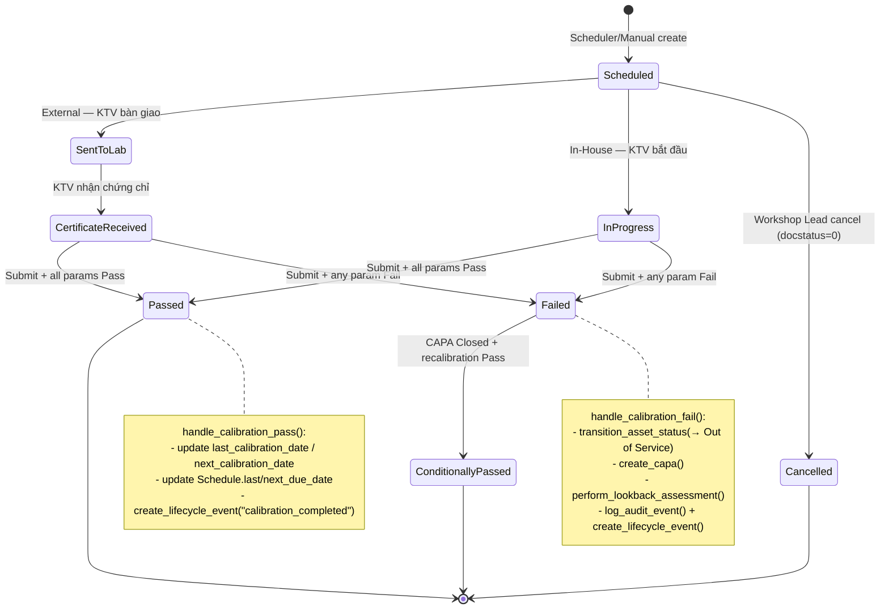

# IMM-11 — Technical Design

| Thuộc tính | Giá trị |
|---|---|
| Module | IMM-11 — Calibration / Hiệu chuẩn |
| Phiên bản | 1.0.0 |
| Ngày cập nhật | 2026-04-18 |
| Trạng thái | DRAFT — chưa implement code |
| Tác giả | AssetCore Team |

> ⚠️ **Pending implementation:** Tất cả DocType JSON, controller, service, scheduler, hooks và test trong tài liệu này **chưa tồn tại trong codebase**. Đây là đặc tả kỹ thuật dùng làm blueprint khi triển khai.

---

## 1. Overview

IMM-11 mở rộng IMM-00 Foundation bằng 3 DocType mới (1 master + 1 submittable + 1 child) và 1 service module. Toàn bộ governance entity (`IMM CAPA Record`, `Asset Lifecycle Event`, `IMM Audit Trail`, `AC Asset`, `AC Supplier`, `IMM Device Model`, `IMM SLA Policy`) tái sử dụng từ IMM-00.

**Layering:**

```
┌─────────────────────────────────────────────────────────┐
│  Frontend (Vue 3 + Pinia) — ⚠️ Mockup only             │
│  CalibrationDashboard / Form / Detail / CAPA panel     │
└────────────────────────────┬────────────────────────────┘
                             │ REST
┌────────────────────────────▼────────────────────────────┐
│  API Layer  ⚠️ Pending — assetcore/api/imm11.py        │
│  @frappe.whitelist endpoints; _ok / _err               │
└────────────────────────────┬────────────────────────────┘
                             │
┌────────────────────────────▼────────────────────────────┐
│  Service Layer  ⚠️ Pending — assetcore/services/imm11.py│
│  Business logic; gọi IMM-00 services                    │
└──────────┬─────────────────┬───────────────────┬────────┘
           │                 │                   │
           ▼                 ▼                   ▼
   IMM-00 services    IMM-11 DocTypes    Frappe Framework
   (transition_      (Schedule,           (ORM, scheduler,
    asset_status,    Asset Calibration,   permissions)
    create_capa,     Measurement)
    log_audit_event)
```

---

## 2. ERD — Entity Relationship Diagram

```mermaid
erDiagram
    AC_Asset {
        string name PK
        string asset_name
        string device_model FK
        string lifecycle_status
        date last_calibration_date
        date next_calibration_date
        string calibration_status
    }

    IMM_Device_Model {
        string name PK
        string model_name
        bool calibration_required
        int calibration_interval_days
        string calibration_type_default
    }

    AC_Supplier {
        string name PK
        string supplier_name
        string vendor_type
        bool iso_17025_certified
        string iso_17025_cert_no
        date iso_17025_cert_expiry
    }

    IMM_Calibration_Schedule {
        string name PK
        string asset FK
        string device_model FK
        string calibration_type
        int interval_days
        date last_calibration_date
        date next_due_date
        string preferred_lab FK
        bool is_active
    }

    IMM_Asset_Calibration {
        string name PK
        string calibration_schedule FK
        string asset FK
        string device_model FK
        string calibration_type
        string status
        date scheduled_date
        date actual_date
        string lab_supplier FK
        string lab_accreditation_number
        string certificate_file
        date certificate_date
        string certificate_number
        string overall_result
        date next_calibration_date
        string technician FK
        string reference_standard_serial
        string traceability_reference
        string pm_work_order FK
        string capa_record FK
        bool is_recalibration
        string amendment_reason
    }

    IMM_Calibration_Measurement {
        string name PK
        string parent FK
        string parameter_name
        string unit
        float nominal_value
        float tolerance_positive
        float tolerance_negative
        float measured_value
        bool out_of_tolerance
        string pass_fail
    }

    IMM_CAPA_Record {
        string name PK
        string source_doctype
        string source_ref FK
        string asset FK
        string device_model FK
        string status
        text root_cause
        text corrective_action
        text preventive_action
        bool lookback_required
        string lookback_status
        text lookback_assets
    }

    Asset_Lifecycle_Event {
        string name PK
        string asset FK
        string event_type
        datetime timestamp
        string actor FK
        string from_status
        string to_status
        string root_doctype
        string root_record
    }

    AC_Asset ||--o{ IMM_Calibration_Schedule : "has"
    AC_Asset ||--o{ IMM_Asset_Calibration : "has"
    AC_Asset ||--o{ Asset_Lifecycle_Event : "has"
    IMM_Device_Model ||--o{ AC_Asset : "model of"
    IMM_Calibration_Schedule ||--o{ IMM_Asset_Calibration : "generates"
    IMM_Asset_Calibration ||--o{ IMM_Calibration_Measurement : "has"
    IMM_Asset_Calibration ||--o| IMM_CAPA_Record : "triggers on Fail"
    AC_Supplier ||--o{ IMM_Asset_Calibration : "performs (Calibration Lab)"
    IMM_CAPA_Record ||--o{ Asset_Lifecycle_Event : "triggers"
```



---

## 3. Data Dictionary

### 3.1 IMM Calibration Schedule

⚠️ Pending implementation.

- **Naming:** `CAL-SCH-.YYYY.-.#####`
- **DocType type:** Non-submittable

| Field | Label | Type | Options / Notes | Mandatory |
|---|---|---|---|---|
| `asset` | Thiết bị | Link | AC Asset | Yes |
| `device_model` | Model | Link | IMM Device Model (auto-fetch) | Yes |
| `calibration_type` | Loại | Select | External, In-House | Yes |
| `interval_days` | Chu kỳ (ngày) | Int | Default từ Device Model | Yes |
| `last_calibration_date` | Ngày cal gần nhất | Date | Auto từ `IMM Asset Calibration` on_submit | Auto |
| `next_due_date` | Ngày đến hạn | Date | Computed: last_calibration_date + interval_days | Auto |
| `preferred_lab` | Lab ưu tiên | Link | AC Supplier (filter `vendor_type=Calibration Lab`) | No |
| `is_active` | Đang hoạt động | Check | False = suspend | Yes |

### 3.2 IMM Asset Calibration

⚠️ Pending implementation.

- **Naming:** `CAL-.YYYY.-.#####`
- **DocType type:** Submittable

| Field | Label | Type | Options / Notes | Mandatory |
|---|---|---|---|---|
| `calibration_schedule` | Lịch | Link | IMM Calibration Schedule | No (manual) |
| `asset` | Thiết bị | Link | AC Asset | Yes |
| `device_model` | Model | Link | IMM Device Model (auto-fetch) | Auto |
| `calibration_type` | Loại | Select | External, In-House | Yes |
| `status` | Trạng thái | Select | Scheduled, Sent to Lab, In Progress, Certificate Received, Passed, Failed, Conditionally Passed, Cancelled | Yes |
| `scheduled_date` | Ngày dự kiến | Date | — | Yes |
| `actual_date` | Ngày thực hiện | Date | Set on_submit | Auto |
| `lab_supplier` | Tổ chức kiểm định | Link | AC Supplier (filter Calibration Lab + iso_17025_certified=1) | Conditional (External) |
| `lab_accreditation_number` | Số công nhận ISO 17025 | Data | Auto-fetch từ `lab_supplier`, override được | Conditional (External) |
| `lab_contract_ref` | Số hợp đồng | Data | — | No |
| `sent_date` | Ngày gửi | Date | — | Conditional (External) |
| `sent_by` | Người bàn giao | Link | User | Conditional |
| `certificate_file` | Chứng chỉ (PDF) | Attach | BR-11-01 | Conditional (External) |
| `certificate_date` | Ngày cấp chứng chỉ | Date | BR-11-04 basis | Conditional (External Pass) |
| `certificate_number` | Số chứng chỉ | Data | — | No |
| `next_calibration_date` | Ngày cal tiếp theo | Date | Computed on_submit Pass: `certificate_date + interval` | Auto |
| `overall_result` | Kết quả tổng | Select | Passed, Failed, Conditionally Passed | Auto |
| `technician` | KTV | Link | User | Yes |
| `assigned_by` | Phân công bởi | Link | User | No |
| `reference_standard_serial` | Serial chuẩn | Data | — | Conditional (In-House) |
| `traceability_reference` | Traceability ref | Data | VLAS-T-xxx, NIST | Conditional (In-House) |
| `measurements` | Tham số đo | Table | Child: IMM Calibration Measurement | Yes |
| `pm_work_order` | PM WO liên kết | Link | (IMM-08) | No |
| `capa_record` | CAPA liên kết | Link | IMM CAPA Record (auto khi Fail) | Auto |
| `is_recalibration` | Là tái cal sau CAPA | Check | Bypass `validate_asset_for_operations` (BR-11-07) | No |
| `calibration_sticker_attached` | Đã gắn sticker | Check | — | No |
| `sticker_photo` | Ảnh sticker | Attach Image | — | No |
| `technician_notes` | Ghi chú KTV | Long Text | — | No |
| `amendment_reason` | Lý do Amend | Small Text | Bắt buộc khi Amend (BR-11-05) | Conditional |

### 3.3 IMM Calibration Measurement (Child)

⚠️ Pending implementation. Parent: `IMM Asset Calibration`.

| Field | Label | Type | Notes | Mandatory |
|---|---|---|---|---|
| `parameter_name` | Tham số | Data | Ví dụ: WBC Count, PIP, Tidal Volume | Yes |
| `unit` | Đơn vị | Data | cmH₂O, mL, V, mmHg, 10³/µL | Yes |
| `nominal_value` | Giá trị danh định | Float | Theo IFU | Yes |
| `tolerance_positive` | Dung sai (+) % | Float | — | Yes |
| `tolerance_negative` | Dung sai (-) % | Float | Thường = positive | Yes |
| `measured_value` | Giá trị đo | Float | KTV nhập | Yes |
| `out_of_tolerance` | Ngoài dung sai | Check | Computed | Auto |
| `pass_fail` | Kết quả | Select | Pass, Fail | Auto |

**Computed logic:**

```python
base = abs(nominal_value)
tol_plus = (tolerance_positive / 100) * base
tol_minus = (tolerance_negative / 100) * base
deviation = measured_value - nominal_value
out_of_tolerance = deviation > tol_plus or deviation < -tol_minus
pass_fail = "Fail" if out_of_tolerance else "Pass"
```

### 3.4 Custom fields trên AC Asset (đề xuất)

⚠️ Pending — cần fixtures `custom_field`.

| Field | Type | Notes |
|---|---|---|
| `last_calibration_date` | Date | Set bởi `handle_calibration_pass()` |
| `next_calibration_date` | Date | Set bởi `handle_calibration_pass()`; driver cho overdue scheduler |
| `calibration_status` | Select | On Schedule, Due Soon, Overdue, Calibration Failed, No Schedule |

---

## 4. State Machine



---

## 5. Backend Implementation

### 5.1 Service layer skeleton

⚠️ Pending implementation — file `assetcore/services/imm11.py` chưa tồn tại.

```python
# assetcore/services/imm11.py  -- ⚠️ FILE CHƯA TỒN TẠI
"""
IMM-11 Calibration — Service Layer.
Tất cả business logic ở đây. Controller chỉ delegate.
Mọi side effect (transition, capa, audit) PHẢI gọi qua IMM-00 services.
"""
import frappe
from frappe import _
from frappe.utils import nowdate, add_days, getdate, date_diff, now
from typing import Optional

from assetcore.services.imm00 import (
    transition_asset_status,
    create_capa,
    log_audit_event,
    create_lifecycle_event,
    validate_asset_for_operations,
    get_sla_policy,
)


def create_calibration_schedule_from_commissioning(commissioning_doc) -> Optional[str]:
    """Hook: IMM-04 Commissioning on_submit. BR-11 setup."""
    asset = commissioning_doc.asset
    device_model = frappe.db.get_value("AC Asset", asset, "device_model")
    if not device_model:
        return None
    cal_required = frappe.db.get_value("IMM Device Model", device_model, "calibration_required")
    if not cal_required:
        return None
    interval = frappe.db.get_value("IMM Device Model", device_model, "calibration_interval_days") or 365
    cal_type = frappe.db.get_value("IMM Device Model", device_model, "calibration_type_default") or "External"
    sched = frappe.get_doc({
        "doctype": "IMM Calibration Schedule",
        "asset": asset,
        "device_model": device_model,
        "calibration_type": cal_type,
        "interval_days": interval,
        "last_calibration_date": commissioning_doc.commissioning_date or nowdate(),
        "next_due_date": add_days(commissioning_doc.commissioning_date or nowdate(), interval),
        "is_active": 1,
    }).insert(ignore_permissions=True)
    log_audit_event(
        asset=asset, event_type="Calibration Schedule Created",
        actor=frappe.session.user, ref_doctype="IMM Calibration Schedule",
        ref_name=sched.name, change_summary=f"Auto from commissioning {commissioning_doc.name}",
    )
    return sched.name


def create_due_calibration_wos() -> int:
    """Scheduler daily — tạo CAL WO cho Schedule due ≤ 30 ngày."""
    threshold = add_days(nowdate(), 30)
    schedules = frappe.get_all(
        "IMM Calibration Schedule",
        filters={"is_active": 1, "next_due_date": ("<=", threshold)},
        fields=["name", "asset", "device_model", "calibration_type",
                "interval_days", "next_due_date", "preferred_lab"],
    )
    created = 0
    for s in schedules:
        if frappe.db.exists("IMM Asset Calibration", {
            "calibration_schedule": s.name,
            "status": ("in", ["Scheduled", "Sent to Lab", "In Progress", "Certificate Received"]),
        }):
            continue
        try:
            validate_asset_for_operations(s.asset)  # IMM-00
        except frappe.ValidationError:
            continue  # skip Out of Service
        frappe.get_doc({
            "doctype": "IMM Asset Calibration",
            "calibration_schedule": s.name,
            "asset": s.asset,
            "device_model": s.device_model,
            "calibration_type": s.calibration_type,
            "scheduled_date": s.next_due_date,
            "lab_supplier": s.preferred_lab,
            "status": "Scheduled",
        }).insert(ignore_permissions=True)
        created += 1
    return created


def check_calibration_expiry() -> None:
    """Scheduler daily — update calibration_status + email alerts."""
    today = getdate(nowdate())
    assets = frappe.get_all(
        "AC Asset",
        filters={"lifecycle_status": "Active",
                 "next_calibration_date": ("is", "set")},
        fields=["name", "next_calibration_date"],
    )
    for a in assets:
        days_left = date_diff(a.next_calibration_date, today)
        if days_left < 0:
            status = "Overdue"
        elif days_left <= 30:
            status = "Due Soon"
        else:
            status = "On Schedule"
        frappe.db.set_value("AC Asset", a.name, "calibration_status", status)
        if days_left in (90, 60, 30, 7, 0):
            _send_expiry_alert(a.name, days_left)


def handle_calibration_pass(cal_doc) -> None:
    """on_submit Pass: BR-11-04 + lifecycle event + Schedule update."""
    interval = frappe.db.get_value(
        "IMM Calibration Schedule", cal_doc.calibration_schedule, "interval_days"
    ) or frappe.db.get_value(
        "IMM Device Model", cal_doc.device_model, "calibration_interval_days"
    ) or 365
    basis_date = cal_doc.certificate_date or cal_doc.actual_date
    next_date = add_days(str(basis_date), interval)
    frappe.db.set_value("AC Asset", cal_doc.asset, {
        "last_calibration_date": basis_date,
        "next_calibration_date": next_date,
        "calibration_status": "On Schedule",
    })
    frappe.db.set_value("IMM Asset Calibration", cal_doc.name, "next_calibration_date", next_date)
    if cal_doc.calibration_schedule:
        frappe.db.set_value("IMM Calibration Schedule", cal_doc.calibration_schedule, {
            "last_calibration_date": basis_date,
            "next_due_date": next_date,
        })
    create_lifecycle_event(  # IMM-00
        asset=cal_doc.asset, event_type="calibration_completed",
        actor=frappe.session.user,
        from_status=frappe.db.get_value("AC Asset", cal_doc.asset, "lifecycle_status"),
        to_status="Active",
        root_doctype="IMM Asset Calibration", root_record=cal_doc.name,
        notes=f"Result: {cal_doc.overall_result}; next due: {next_date}",
    )
    # Recalibration Pass after CAPA → restore Active
    if cal_doc.is_recalibration:
        transition_asset_status(  # IMM-00
            asset=cal_doc.asset, to_status="Active",
            root_doctype="IMM Asset Calibration", root_record=cal_doc.name,
            reason="Recalibration Pass after CAPA",
        )


def handle_calibration_fail(cal_doc) -> None:
    """on_submit Fail: BR-11-02 + BR-11-03."""
    # 1. Transition → Out of Service (IMM-00)
    transition_asset_status(
        asset=cal_doc.asset, to_status="Out of Service",
        root_doctype="IMM Asset Calibration", root_record=cal_doc.name,
        reason=f"Calibration failed — {cal_doc.name}",
    )
    frappe.db.set_value("AC Asset", cal_doc.asset, "calibration_status", "Calibration Failed")

    # 2. Create CAPA (IMM-00)
    capa_name = create_capa(
        asset=cal_doc.asset, source_type="IMM Asset Calibration", source_ref=cal_doc.name,
        severity="Major",
        description=f"Calibration failed; out-of-tolerance parameters: {_failed_params(cal_doc)}",
        responsible="IMM QA Officer", due_date=add_days(nowdate(), 30),
    )
    frappe.db.set_value("IMM Asset Calibration", cal_doc.name, "capa_record", capa_name)

    # 3. Lookback (BR-11-03)
    lookback = perform_lookback_assessment(cal_doc.device_model, cal_doc.asset)
    frappe.db.set_value("IMM CAPA Record", capa_name, {
        "lookback_required": 1,
        "lookback_status": "In Progress" if lookback else "Cleared",
        "lookback_assets": str(lookback),
    })

    # 4. Lifecycle event (IMM-00)
    create_lifecycle_event(
        asset=cal_doc.asset, event_type="calibration_failed",
        actor=frappe.session.user, from_status="Active", to_status="Out of Service",
        root_doctype="IMM Asset Calibration", root_record=cal_doc.name,
        notes=f"CAPA: {capa_name}; lookback {len(lookback)} assets",
    )

    # 5. Notify (utils/email)
    _notify_calibration_fail(cal_doc, capa_name, lookback)


def perform_lookback_assessment(device_model: str, exclude_asset: str) -> list:
    """BR-11-03 — assets cùng device_model đang Active."""
    rows = frappe.get_all(
        "AC Asset",
        filters={
            "device_model": device_model,
            "lifecycle_status": "Active",
            "name": ("!=", exclude_asset),
        },
        fields=["name"],
    )
    return [r.name for r in rows]


def create_post_repair_calibration(asset_name: str) -> Optional[str]:
    """Hook: IMM-09 Repair completed → tái cal nếu thiết bị có Schedule."""
    sched = frappe.db.get_value(
        "IMM Calibration Schedule", {"asset": asset_name, "is_active": 1}, "name"
    )
    if not sched:
        return None
    cal = frappe.get_doc({
        "doctype": "IMM Asset Calibration",
        "calibration_schedule": sched,
        "asset": asset_name,
        "calibration_type": frappe.db.get_value("IMM Calibration Schedule", sched, "calibration_type"),
        "scheduled_date": nowdate(),
        "status": "Scheduled",
        "is_recalibration": 1,
    }).insert(ignore_permissions=True)
    return cal.name
```

### 5.2 Controller skeleton

⚠️ Pending implementation.

```python
# assetcore/imm/doctype/imm_asset_calibration/imm_asset_calibration.py
import frappe
from frappe import _
from frappe.model.document import Document
from assetcore.services.imm11 import (
    handle_calibration_pass, handle_calibration_fail,
)


class IMMAssetCalibration(Document):
    def validate(self):
        self._auto_populate()
        self._validate_external_requirements()
        self._validate_inhouse_requirements()
        self._compute_measurement_results()

    def before_submit(self):
        if not self.actual_date:
            self.actual_date = frappe.utils.nowdate()

    def on_submit(self):
        if self.overall_result == "Failed":
            handle_calibration_fail(self)
        elif self.overall_result in ("Passed", "Conditionally Passed"):
            handle_calibration_pass(self)

    def on_cancel(self):
        # BR-11-05
        frappe.throw(_("Không thể hủy Phiếu Hiệu chuẩn đã Submit. Vui lòng dùng Amend (BR-11-05)"))

    def on_trash(self):
        if self.docstatus == 1:
            frappe.throw(_("Không thể xóa Phiếu Hiệu chuẩn đã Submit (BR-11-05)"))

    def _validate_external_requirements(self):
        if self.calibration_type != "External":
            return
        if not self.lab_supplier:
            frappe.throw(_("Vui lòng chọn lab hiệu chuẩn (BR-11-01)"))
        iso_ok = frappe.db.get_value("AC Supplier", self.lab_supplier, "iso_17025_certified")
        if not iso_ok:
            frappe.throw(_("Vui lòng chọn lab có chứng chỉ ISO/IEC 17025 (BR-11-01)"))
        if self.docstatus == 0 and self.status in ("Certificate Received",) and not self.certificate_file:
            frappe.throw(_("Vui lòng upload Calibration Certificate trước khi Submit (BR-11-01)"))
        if self.docstatus == 0 and self.status in ("Certificate Received",) and not self.lab_accreditation_number:
            frappe.throw(_("Vui lòng nhập Số công nhận ISO/IEC 17025 (BR-11-01)"))

    def _validate_inhouse_requirements(self):
        if self.calibration_type != "In-House":
            return
        if self.docstatus == 0 and not self.reference_standard_serial:
            frappe.throw(_("Vui lòng nhập serial thiết bị chuẩn"))

    def _compute_measurement_results(self):
        if not self.measurements:
            return
        any_fail = False
        for m in self.measurements:
            if m.measured_value is None:
                continue
            base = abs(m.nominal_value or 0)
            tol_plus = (m.tolerance_positive or 0) / 100 * base
            tol_minus = (m.tolerance_negative or 0) / 100 * base
            dev = m.measured_value - (m.nominal_value or 0)
            m.out_of_tolerance = dev > tol_plus or dev < -tol_minus
            m.pass_fail = "Fail" if m.out_of_tolerance else "Pass"
            if m.out_of_tolerance:
                any_fail = True
        self.overall_result = "Failed" if any_fail else "Passed"

    def _auto_populate(self):
        if self.asset and not self.device_model:
            self.device_model = frappe.db.get_value("AC Asset", self.asset, "device_model")
```

### 5.3 hooks.py registration

⚠️ Pending implementation.

```python
doc_events = {
    "IMM Commissioning": {  # IMM-04
        "on_submit": "assetcore.services.imm11.create_calibration_schedule_from_commissioning",
    },
    "IMM Asset Repair": {   # IMM-09
        "on_submit": "assetcore.services.imm11.create_post_repair_calibration_hook",
    },
}

scheduler_events = {
    "daily": [
        "assetcore.services.imm11.create_due_calibration_wos",
        "assetcore.services.imm11.check_calibration_expiry",
    ],
}
```

---

## 6. Calibration Date Calculation (BR-11-04)

```text
next_calibration_date = certificate_date + Device Model.calibration_interval_days
                        (NOT due_date, NOT actual_date for External)

For In-House (no certificate_date):
next_calibration_date = actual_date + interval_days
```

| certificate_date | interval | next_calibration_date |
|---|---|---|
| 2026-01-15 | 365 | 2027-01-15 |
| 2026-03-01 | 180 | 2026-08-28 |
| 2026-06-30 | 730 | 2028-06-29 |

**Overdue detection (daily scheduler):**

| `calibration_status` | Điều kiện |
|---|---|
| On Schedule | `next > today + 30` |
| Due Soon | `0 ≤ next - today ≤ 30` |
| Overdue | `next < today` |
| Calibration Failed | Sau Submit Fail |
| No Schedule | Không có Schedule active |

---

## 7. CAPA & Lookback Flow

```text
on_submit (Failed)
    │
    ▼
handle_calibration_fail(cal_doc):
    1. transition_asset_status(→ Out of Service)            [IMM-00]
    2. create_capa(source_type="IMM Asset Calibration")     [IMM-00]
    3. perform_lookback_assessment(device_model)            [IMM-11]
       → write lookback_assets vào CAPA
    4. create_lifecycle_event("calibration_failed")         [IMM-00]
    5. log_audit_event(...)                                 [IMM-00]
    6. _notify_calibration_fail() → email QA + Manager
    │
    ▼
QA Officer:
    7. resolve_capa_lookback (Cleared / Action Required)
    8. close_capa (root_cause + corrective + preventive)    [IMM-00]
       → block nếu lookback_status=Pending  [BR-11-03]
       → block nếu thiếu RCA                 [BR-00-08]
    │
    ▼
KTV: Recalibration (is_recalibration=1) → Submit Pass
    │
    ▼
handle_calibration_pass + transition_asset_status(→ Active)
    → lifecycle_event("calibration_conditionally_passed")
```

---

## 8. Validation Rules (controller-level)

| ID | Trigger | Điều kiện | Message | Action |
|---|---|---|---|---|
| VR-11-01 | `validate` | External + lab_supplier null | "Vui lòng chọn lab hiệu chuẩn" | throw |
| VR-11-02 | `validate` | External + iso_17025_certified=0 | "Vui lòng chọn lab có chứng chỉ ISO/IEC 17025 (BR-11-01)" | throw |
| VR-11-03 | `validate` | External + status=Certificate Received + certificate_file null | "Vui lòng upload Calibration Certificate (BR-11-01)" | throw |
| VR-11-04 | `validate` | External + status=Certificate Received + accreditation null | "Vui lòng nhập Số công nhận ISO/IEC 17025 (BR-11-01)" | throw |
| VR-11-05 | `before_submit` | measurement.measured_value null | "Tham số '{name}' chưa có giá trị đo" | throw |
| VR-11-06 | `validate` | In-House + reference_standard_serial null | "Vui lòng nhập serial thiết bị chuẩn" | throw |
| VR-11-07 | `validate` | certificate_date > today | "Ngày cấp chứng chỉ không thể trong tương lai" | throw |
| VR-11-08 | `on_cancel` | docstatus=1 | "Không thể hủy Phiếu đã Submit (BR-11-05)" | throw |
| VR-11-09 | `on_trash` | docstatus=1 | "Không thể xóa Phiếu đã Submit (BR-11-05)" | throw |
| VR-11-10 | `validate` (Amend) | amendment_reason null | "Lý do sửa đổi bắt buộc khi Amend (BR-11-05)" | throw |

---

## 9. Integration Points

### 9.1 IMM-04 → IMM-11

```text
IMM Commissioning.on_submit
  → create_calibration_schedule_from_commissioning(doc)
       └─ insert IMM Calibration Schedule
       └─ log_audit_event()
```

### 9.2 IMM-09 → IMM-11

```text
IMM Asset Repair.on_submit (status=Completed, asset có Schedule active)
  → create_post_repair_calibration(asset)
       └─ insert IMM Asset Calibration (is_recalibration=1)
```

### 9.3 IMM-11 → IMM-00

| IMM-00 service được gọi | Khi nào |
|---|---|
| `validate_asset_for_operations(asset)` | `create_due_calibration_wos`, `create_calibration` API (skip nếu `is_recalibration`) |
| `transition_asset_status(...)` | `handle_calibration_fail` (→ Out of Service); `handle_calibration_pass` recal (→ Active) |
| `create_capa(...)` | `handle_calibration_fail` |
| `close_capa(...)` | `close_capa` API |
| `log_audit_event(...)` | Mọi state change |
| `create_lifecycle_event(...)` | 5 event types: scheduled, sent_to_lab, completed, failed, conditionally_passed |
| `get_sla_policy(priority, risk_class)` | Tính SLA cho CAL WO khi tạo |

### 9.4 IMM-11 → AC Asset

| Sự kiện | Field cập nhật | Giá trị |
|---|---|---|
| Pass | `last_calibration_date` | certificate_date / actual_date |
| Pass | `next_calibration_date` | basis + interval |
| Pass | `calibration_status` | On Schedule |
| Fail | `lifecycle_status` (qua transition) | Out of Service |
| Fail | `calibration_status` | Calibration Failed |
| Recal Pass | `lifecycle_status` (qua transition) | Active |

---

## 10. Exception Catalog

| Code | Tên lỗi | Điều kiện | Message |
|---|---|---|---|
| CAL-001 | Missing certificate file | External Submit thiếu certificate | "Vui lòng upload Calibration Certificate (BR-11-01)" |
| CAL-002 | Missing accreditation | External Submit thiếu lab_accreditation_number | "Vui lòng nhập Số công nhận ISO/IEC 17025" |
| CAL-003 | Lab not ISO 17025 | lab_supplier.iso_17025_certified=0 | "Vui lòng chọn lab có chứng chỉ ISO/IEC 17025" |
| CAL-004 | Missing measured value | Measurement row có measured_value null | "Tham số '{param}' chưa có giá trị đo" |
| CAL-005 | Cancel blocked | Cancel khi docstatus=1 | "Không thể hủy Phiếu đã Submit (BR-11-05)" |
| CAL-006 | No interval | Device Model.calibration_interval_days null | "Thiết bị không có chu kỳ hiệu chuẩn" |
| CAL-007 | CAPA lookback pending | Close CAPA khi lookback_status=Pending | "CAPA chưa hoàn thành Lookback (BR-11-03)" |
| CAL-008 | Asset not operational | Tạo CAL WO khi asset Out of Service (không phải recal) | "Thiết bị không thể tạo Calibration WO (BR-00-05)" |
| CAL-009 | Amendment reason missing | Amend không có amendment_reason | "Lý do sửa đổi là bắt buộc (BR-11-05)" |
| CAL-010 | Future certificate date | certificate_date > today | "Ngày cấp chứng chỉ không thể trong tương lai" |

---

## 11. Migration / Rollout

⚠️ Pending implementation.

| Sprint | Hạng mục | Phụ thuộc |
|---|---|---|
| 11.1 | DocType JSON (3) + custom fields trên AC Asset (3) | IMM-00 v3 hoàn tất |
| 11.2 | Controller + service skeleton | 11.1 |
| 11.3 | API layer + hooks + scheduler | 11.2 |
| 11.4 | Workflow JSON + permission fixtures | 11.3 |
| 11.5 | Frontend (Vue) | 11.3 |
| 11.6 | Test suite + UAT | 11.5 |

**Data migration:** Không có (module mới). Tuy nhiên phải seed:
- Fixtures Lab AC Supplier mẫu (Calibration Lab + ISO 17025)
- Permission fixtures cho 8 IMM role
- Workflow JSON cho `IMM Asset Calibration`
