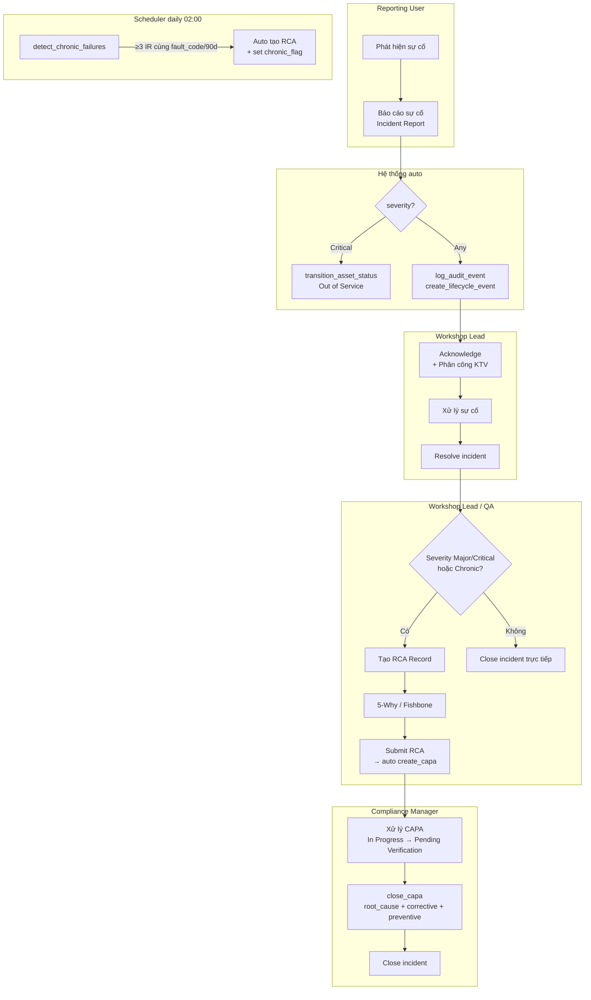
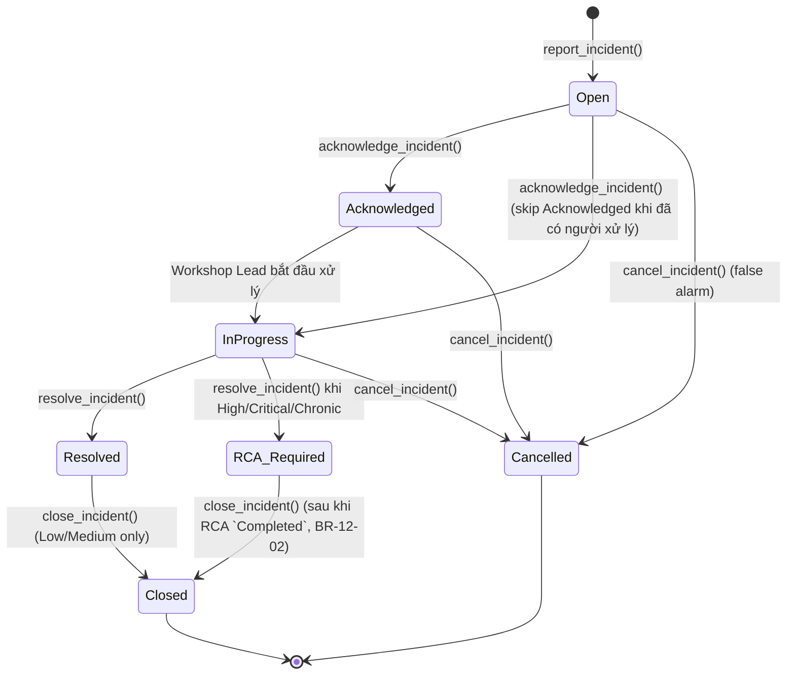
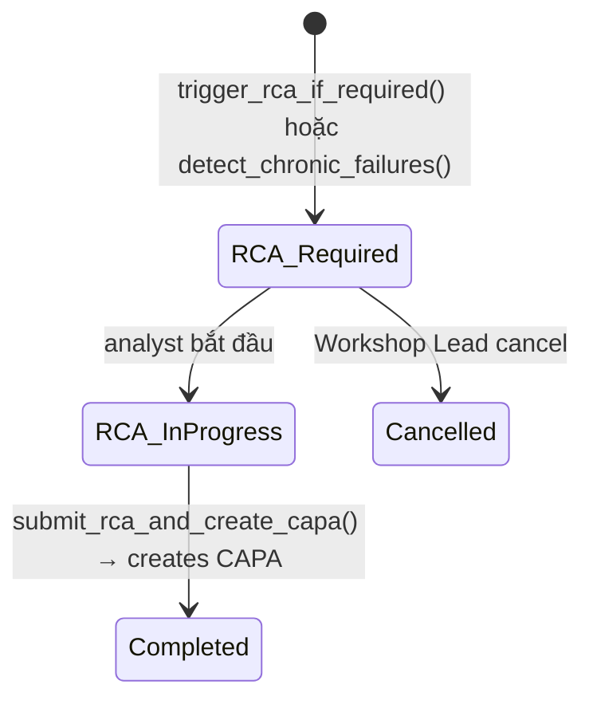

# 02 — Phân tích thiết kế nghiệp vụ (Analysis & Design)

| Mục | Giá trị |
|---|---|
| Module | IMM-12 — Sự cố & CAPA (Incident & Corrective Action) |
| Phạm vi | Per-module |
| Owner | BA + System Analyst |
| Liên kết | 03 Diagrams · 04 Backend · 05 API · 06 Frontend |
| Cập nhật | 2026-05-27 |
| Trạng thái | ✅ Live — `services/imm12.py` + `api/imm12.py` (14 endpoint) + DocType `Incident Report` / `IMM RCA Record` + Workflow JSON + FE views/store đã deploy |

---

# Phần I — Module Overview

## I.0. Khảo sát hiện trạng

Tham chiếu: WHO HTM — *Computerized maintenance management system* (chương Failure reporting & RCA) và *Medical equipment maintenance programme overview* §Corrective maintenance.

| Khía cạnh | Hiện trạng truyền thống tại bệnh viện VN | Nguồn |
|---|---|---|
| Tiếp nhận sự cố | Báo qua điện thoại / Zalo / sổ tay; không có biểu mẫu chuẩn | WHO CMMS §"Work request intake" |
| Phân loại mức độ | Chủ quan, không có tiêu chí Minor/Major/Critical | WHO HTM §Corrective maintenance |
| RCA | Không hoặc làm rời rạc, không có 5-Why/Fishbone chuẩn | WHO CMMS §"Root cause analysis" |
| CAPA | Quản lý bằng Excel, không liên kết tới sự cố gốc | ISO 13485 §8.5.2 |
| Phát hiện chronic failure | Không có cơ chế tự động — chỉ phát hiện khi sự cố quá rõ | WHO CMMS §"Trend analysis" |
| Audit trail | Sổ giấy, dễ thất lạc, không immutable | NĐ 98/2021 Điều 38 |

*(Cần khảo sát baseline cụ thể tại site triển khai — số sự cố/tháng, MTTR hiện tại, % CAPA quá hạn.)*

## I.1. Pitch

IMM-12 giải quyết vấn đề sự cố thiết bị y tế không được theo dõi có hệ thống, dẫn đến lặp lại sự cố (chronic failure) mà không phát hiện, và thiếu bằng chứng audit cho cơ quan quản lý. Module tự động phân loại mức độ nghiêm trọng, kích hoạt RCA bắt buộc với Major/Critical, tạo CAPA qua IMM-00, và phát hiện sự cố mãn tính qua scheduler hàng ngày — đảm bảo mọi sự cố đều có record traceable từ báo cáo đến đóng CAPA.

## I.2. Vị trí trong WHO HTM lifecycle

| Phase | Liên quan |
|---|---|
| Needs | ✗ |
| Procurement | ✗ |
| Installation | ✓ — IMM-04 NC nghiêm trọng → Incident + CAPA |
| Operation | ✓ — tiếp nhận sự cố từ khoa phòng, KTV |
| Maintenance | ✓ — IMM-08 PM finding lớn → Incident; IMM-09 repeat failure → CAPA |
| Decommission | ✗ |

## I.3. Stakeholders & Actors

| Vai trò | Người dùng thực | Quan tâm chính | Tần suất | Loại |
|---|---|---|---|---|
| Reporting User | Điều dưỡng / KTV khoa phòng | Báo cáo sự cố nhanh, dễ dùng trên mobile | Khi có sự cố | Primary |
| Corrective Manager | Trưởng xưởng kỹ thuật | Tiếp nhận, phân công, tạo RCA, monitor CAPA | Hàng ngày | Primary |
| Compliance Manager | Nhân viên QA | Submit/Close CAPA; verify audit trail | Hàng tuần | Approver |
| Corrective Manager | Trưởng phòng HTM | Nhận escalation Critical; phê duyệt CAPA cấp cao | Khi cần | Secondary |
| Corrective Manager | Quản lý vận hành | Dashboard KPI, export compliance report | Hàng tuần | Auditor |
| AssetCore Super Admin | Quản trị viên | Cấu hình fault_code dictionary; seed data | Khi cần | Auditor |

## I.4. Scope

**In-scope:**
- Tiếp nhận Incident Report từ user / tự động từ IMM-08/09/11
- Phân loại severity Low / Medium / High / Critical (theo enum BE `Incident Report.severity`; KHÔNG dùng "Minor/Major")
- Workflow Incident (state machine BE — 7 state, khớp `imm_12_incident_workflow.json` + `_VALID_TRANSITIONS`):
  `Open → Acknowledged → In Progress → Resolved → Closed` (+ nhánh `Resolved → RCA Required → Closed`, + `Cancelled` từ Open/Acknowledged/In Progress)
  - **D3 chốt:** `Acknowledged` là state có thật & reachable. `Open → Acknowledged` ("Tiếp nhận" — Corrective Manager) tách khỏi `Acknowledged → In Progress` ("Bắt đầu xử lý" — Corrective User). Triage/phân công ≠ bắt đầu xử lý (đúng WHO CMMS work-request intake).
- RCA Record (5-Why / Fishbone) bắt buộc với High/Critical/Chronic
- CAPA tự động từ RCA Completed (gọi `imm00.create_capa()`)
- Phát hiện chronic failure (≥3 incidents cùng fault_code/90 ngày) — Scheduler daily
- Audit trail mọi state transition qua `imm00.log_audit_event()`

**Out-of-scope:**
- Thực hiện sửa chữa (thuộc IMM-09)
- SLA Engine (reuse `imm00.get_sla_policy()`); **SLA breach tracking — đã hiện thực ở BR-12-08 (R23)**. `IMM SLA Policy.priority` dùng thang P1–P4; Incident dùng `severity` Low/Medium/High/Critical → map `Critical→P1, High→P2, Medium→P3, Low→P4` (`_severity_to_sla_priority()` trong `services/imm12.py`). Nếu không có policy khớp → bỏ qua set due-time (không chặn report).
- Vigilance reporting tự động lên BYT (thuộc IMM-15)
- Risk Register integration (thuộc IMM-13)
- SMS notification (Sprint sau — chỉ email v1)

**Assumptions:**
- IMM-00 Foundation LIVE: `IMM CAPA Record`, `Incident Report`, `Asset Lifecycle Event`, `IMM Audit Trail`, `services/imm00.py`
- `services/imm00.py` đã có: `create_capa`, `close_capa`, `log_audit_event`, `create_lifecycle_event`, `transition_asset_status`, `check_capa_overdue`

**Dependencies:**
- IMM-00 Foundation (LIVE) — mọi CAPA + audit logic delegate về đây
- IMM-09 Repair WO DocType (để link `repair_wo` field)
- IMM-04 Installation (NC nghiêm trọng → Incident)
- IMM-08 PM (PM finding lớn → Incident)

## I.5. KPI mục tiêu

| KPI | Định nghĩa | Baseline | Target | Đo ở đâu |
|---|---|---|---|---|
| Incident MTTR | avg(resolved_at − reported_at) | Chưa đo | Giảm theo quý | Incident Report |
| RCA On-Time (%) | RCA Completed trước due_date / tổng | Chưa đo | ≥ 95% | RCA Record |
| CAPA On-Time Closure (%) | CAPA Closed trước due_date / tổng | Chưa đo | ≥ 90% | IMM CAPA Record |
| Chronic Failure Count | Assets có `chronic_failure_flag = True` | 0 | 0 | AC Asset |
| Critical Incidents / tháng | COUNT(severity=Critical) | Chưa đo | Giảm theo quý | Incident Report |

## I.6. Ràng buộc Compliance

| Quy định | Yêu cầu áp lên module | Doc tham chiếu |
|---|---|---|
| ISO 13485:2016 §8.5.2 | Corrective action bắt buộc, traceability đầy đủ | ISO 13485:2016 |
| ISO 13485:2016 §8.3 | Control of nonconforming product — incident classification | ISO 13485:2016 |
| WHO HTM 2025 §5.3.4 | Incident reporting, chronic failure detection | WHO HTM 2025 |
| NĐ 98/2021/NĐ-CP Điều 38 | Báo cáo sự cố thiết bị y tế cho cơ quan quản lý | NĐ 98/2021 |
| MEDDEV 2.7/1 Rev 4 | Vigilance reporting nghiêm trọng (defer IMM-15) | MEDDEV 2.7/1 |

## I.7. Risk & Open questions

| Risk | Likelihood | Impact | Giảm thiểu |
|---|---|---|---|
| Reporting User không biết dùng form → bỏ báo cáo | High | High | Form mobile-friendly, minimal fields, auto-fill asset |
| Chronic detection false positive (cùng fault_code khác nguyên nhân) | Medium | Medium | Review alert với Workshop Lead trước khi auto-RCA |
| CAPA overdue tích lũy không ai xử lý | Medium | High | Email escalation + dashboard Overdue counter |

| Open question | Owner | Deadline |
|---|---|---|
| Fault code dictionary quản lý ở đâu (DocType hay CSV)? | BA + Admin | Sprint 12.1 |
| Severity threshold: Major trigger RCA sau bao lâu nếu chưa tạo? | BA + QA Lead | Sprint 12.2 |

## I.8. Roadmap thực thi

| Sprint | Hạng mục | Owner | Status |
|---|---|---|---|
| 12.1 | Custom fields Incident Report (severity, rca_record, clinical_impact, chronic_failure_flag) | BE Lead | ✅ Done |
| 12.2 | RCA Record DocType + child tables (Related Incident, Five Why Step) | BE Lead | ✅ Done |
| 12.3 | `services/imm12.py` (orchestration calling imm00) | BE Lead | ✅ Done |
| 12.4 | `api/imm12.py` REST endpoints (14 endpoints) | BE Lead | ✅ Done |
| 12.5 | Scheduler `detect_chronic_failures` (daily) | BE Lead | ✅ Done |
| 12.6 | FE Incident List/Form, RCA, CAPA, Dashboard (Vue 3) | FE Lead | ✅ Done |
| 12.7 | UAT execution (TC-12-01 → TC-12-NN) | QA | 🟡 Pending |

---

# Phần II — Quy trình nghiệp vụ (Business Process)

## II.2. As-Is process

Hiện tại bệnh viện ghi nhận sự cố qua điện thoại và sổ tay. Workshop Lead nhận thông tin miệng, phân công KTV qua điện thoại. Không có tracking hệ thống, không phát hiện chronic failure, CAPA thực hiện không đồng nhất, không có audit trail cho thanh tra.

## II.3. Pain points

| # | Pain | Tác động |
|---|---|---|
| 1 | Không có báo cáo sự cố chuẩn từ khoa phòng | Mất thông tin, phản ứng chậm |
| 2 | Không phát hiện được sự cố lặp lại (chronic) | Root cause không được xử lý, sự cố tái phát |
| 3 | CAPA không theo dõi được đến khi đóng | Vi phạm ISO 13485:8.5.2 |
| 4 | Không có audit trail cho cơ quan thanh tra | Rủi ro compliance với NĐ98/WHO HTM |

## II.4. To-Be process



## II.5. Decision points

| Điểm | Câu hỏi | Quy tắc |
|---|---|---|
| Severity = Critical? | Có tự động OOS không? | BR-12-04: Critical → `transition_asset_status("Out of Service")` |
| RCA cần không? | Severity High/Critical hoặc chronic? | BR-12-02: High/Critical → RCA bắt buộc trước Close |
| Chronic failure? | ≥3 incidents cùng fault_code/asset/90 ngày? | BR-12-03: auto RCA + flag |
| Close CAPA? | root_cause + corrective + preventive đủ? | BR-00-08 (IMM-00): block nếu thiếu |

## II.6. Process metrics

Tham chiếu: WHO CMMS §"Performance indicators" (chương Reporting/RCA).

| Metric | Định nghĩa | Đo ở bước | Target |
|---|---|---|---|
| Lead time tiếp nhận | report → Acknowledged | UC-02 Acknowledge | < 30 phút (giờ làm việc) |
| Lead time xử lý | In Progress → Resolved | UC-03 Resolve | Tuỳ severity (Critical < 4h, High < 24h) |
| Lead time RCA | RCA Required → Completed | UC-05 Submit RCA | ≤ 14 ngày (Major), ≤ 7 ngày (Critical) |
| CAPA cycle time | CAPA Open → Closed | UC-06 Close CAPA | ≤ 30 ngày (target ISO 13485) |
| % chronic detection chính xác | Alert đúng / tổng alert scheduler | Scheduler daily | ≥ 80% (review feedback) |

*Baseline cụ thể: (Cần khảo sát tại site).*

## II.7. RACI matrix

| Hoạt động | Reporting User | Workshop Lead | QA Officer | System |
|---|---|---|---|---|
| Tạo Incident Report | R/A | C | — | — |
| Acknowledge + phân công | I | R/A | — | — |
| Resolve incident | — | R/A | — | — |
| Tạo RCA | — | R/A | C | — |
| Submit RCA → CAPA | — | R/A | C | — |
| Close CAPA | — | — | R/A | — |
| Detect chronic failure | I | I | I | R/A |
| Close Incident | — | R | A | — |

## II.8. Exception flow

| ID | Điểm xảy ra | Tình huống ngoại lệ | Hành xử hệ thống |
|---|---|---|---|
| EX-12-01 | UC-01 Submit Critical | Thiếu `clinical_impact` | Block với `VALIDATION` (BR-12-01); user phải nhập trước khi submit |
| EX-12-02 | UC-03 Resolve | Resolve khi WO sửa chữa chưa Close | Cảnh báo nhưng cho phép tiếp tục (operator có thể resolve thủ công) |
| EX-12-03 | UC-04/05 RCA | Major/Critical close trực tiếp không qua RCA | Block với `BUSINESS_RULE` (BR-12-02) |
| EX-12-04 | UC-08 Scheduler | Đã có RCA Open cho cùng (asset, fault_code) | Skip — idempotent, không tạo trùng |
| EX-12-05 | UC-09 Auto OOS | Asset đã Out of Service / Decommissioned | Skip transition, vẫn ghi audit trail |
| EX-12-06 | UC-06 Close CAPA | Thiếu `root_cause` / `corrective` / `preventive` | Block với `VALIDATION` (BR-00-08) |

## II.9. So sánh As-Is vs To-Be

| Khía cạnh | As-Is (truyền thống) | To-Be (AssetCore IMM-12) |
|---|---|---|
| Kênh báo sự cố | Điện thoại, Zalo, sổ tay | Form chuẩn (web + mobile) Incident Report |
| Phân loại mức độ | Chủ quan | Severity Minor/Major/Critical với rule rõ |
| Trigger Out of Service | Thủ công, hay quên | Auto khi Critical (BR-12-04) |
| RCA | Rời rạc, không lưu | DocType RCA Record + 5-Why structured |
| CAPA | Excel, không link gốc | IMM CAPA Record link RCA + Incident |
| Chronic failure | Phát hiện khi quá muộn | Scheduler daily detect ≥3/90d |
| Audit trail | Giấy | SHA-256 immutable chain (BR-00-03) |
| Báo cáo cơ quan | Soạn lại từ đầu | Export từ Audit Trail + Incident |

## II.10. Activity diagram per UC chính


*(Activity diagram chi tiết cho UC-05 Submit RCA và UC-08 Detect Chronic xem 03_Diagrams.md.)*

---

# Phần III — Use Case Specification

## III.1. Use Case Diagram

### III.1.a. Biểu đồ use case tổng quát

```
[Reporting User] ---> (UC-01 Tạo Incident Report)
[Workshop Lead] ---> (UC-02 Acknowledge Incident)
[Workshop Lead] ---> (UC-03 Resolve Incident)
[Workshop Lead, QA] ---> (UC-04 Tạo RCA Record)
[Workshop Lead, QA] ---> (UC-05 Submit RCA → CAPA auto)
[QA Officer] ---> (UC-06 Close CAPA)
[Workshop Lead, QA] ---> (UC-07 Close Incident)
[Scheduler] ---> (UC-08 Detect chronic failures)
[System] ---> (UC-09 Auto OOS khi Critical)
(UC-01) ..> (UC-09) : <<include>> [severity=Critical]
(UC-03) ..> (UC-04) : <<extend>> [Major/Critical/Chronic]
(UC-05) ..> (UC-06) : <<extend>> [CAPA created]
```

## III.2. Actor catalog

| Actor | Loại | Vai trò Frappe (dự kiến) | UC chính |
|---|---|---|---|
| Reporting User | Primary (human) | `AssetCore Auditor` (clinician/KTV) | UC-01 |
| Corrective Manager | Primary (human) | `Corrective Manager` | UC-02, 03, 04, 05, 07 |
| Compliance Manager | Approver (human) | `Compliance Manager` | UC-05 (co-execute), 06, 07 |
| Corrective Manager | Secondary (human) | `Corrective Manager` | UC-02 (escalation) |
| Operations Manager | Auditor (human) | `Corrective Manager` | Dashboard / Reports |
| Scheduler | System | `Frappe Scheduler` | UC-08 |
| System | System | Service layer (`imm12.py`) | UC-09 |

## III.3. Use Case Specifications

### UC-01: Tạo Incident Report

| Mục | Giá trị |
|---|---|
| ID | UC-IMM12-01 |
| Brief | User báo cáo sự cố thiết bị y tế với mô tả, mã lỗi, mức độ |
| Primary actor | Reporting User |
| Pre-condition | Asset tồn tại và không Decommissioned |
| Post-condition | IR status = Open; nếu Critical → asset Out of Service + audit trail |
| Trigger | User click "+ Báo cáo sự cố" |

#### Main flow
| Bước | Actor | System |
|---|---|---|
| 1 | User chọn Asset | Auto-fill Khoa phòng, Vị trí |
| 2 | User chọn fault_code, severity, nhập mô tả | — |
| 3 | Nếu Critical: User nhập clinical_impact | Hiện warning banner |
| 4 | User Submit | `report_incident()` → IR status = Open |
| 5 | — | Nếu Critical: `transition_asset_status(Out of Service)` + email Workshop Lead + Dept Head |
| 6 | — | `log_audit_event()` + `create_lifecycle_event("incident_reported")` |

#### Exception E1 — Critical không có clinical_impact (BR-12-01)
- 4a. Block: `ServiceError(VALIDATION, "Sự cố Critical bắt buộc mô tả tác động lâm sàng")`

### UC-05: Submit RCA → Auto tạo CAPA

| Mục | Giá trị |
|---|---|
| ID | UC-IMM12-05 |
| Brief | Workshop Lead/QA Submit RCA với root cause → hệ thống auto tạo CAPA |
| Primary actor | Corrective Manager, Compliance Manager |
| Pre-condition | RCA Record ở trạng thái RCA In Progress; `root_cause` và `rca_method` đã điền |
| Post-condition | RCA status = Completed; CAPA tạo tự động; IR.linked_capa cập nhật |
| Trigger | Click "Submit RCA" |

#### Main flow
| Bước | Actor | System |
|---|---|---|
| 1 | User nhập root_cause, rca_method, five_why_steps | Validate BR-12-07 |
| 2 | User click Submit | `submit_rca_and_create_capa()` |
| 3 | — | `imm00.create_capa(asset, "RCA Record", rca_name, severity)` |
| 4 | — | `RCA.linked_capa = capa_name`; `IR.linked_capa = capa_name` |
| 5 | — | `log_audit_event("rca_completed")` + notify QA Officer |

## III.4. Use Case relationships

| Quan hệ | Source UC | Target UC | Điều kiện |
|---|---|---|---|
| `<<include>>` | UC-01 Tạo Incident | UC-09 Auto OOS | severity = Critical |
| `<<include>>` | UC-01 Tạo Incident | (audit/lifecycle hooks) | mọi trường hợp |
| `<<extend>>` | UC-03 Resolve Incident | UC-04 Tạo RCA Record | severity ∈ {Major, Critical} hoặc chronic_flag |
| `<<extend>>` | UC-05 Submit RCA | UC-06 Close CAPA | CAPA đã tạo, đủ root_cause + corrective + preventive |
| `<<extend>>` | UC-08 Detect Chronic | UC-04 Tạo RCA Record | ≥3 incidents cùng (asset, fault_code) / 90 ngày |
| Generalization | — | — | Không áp dụng (UC độc lập) |

---

# Phần IV — Functional Specifications

## IV.1. User Stories & Acceptance Criteria

### US-12-01: Reporting User báo cáo sự cố Critical

**Là** Điều dưỡng, **tôi muốn** báo cáo sự cố thiết bị nhanh trên điện thoại, **để** Workshop Lead biết ngay và cử KTV đến kịp thời.

| Priority | Must |
|---|---|
| AC-01 | Given asset Active, When Reporting User submit IR Critical với clinical_impact, Then IR status=Open và asset lifecycle_status="Out of Service" |
| AC-02 | Given IR Critical, When submit thiếu clinical_impact, Then throw ValidationError (BR-12-01) |

### US-12-02: Phát hiện sự cố mãn tính

**Là** Workshop Lead, **tôi muốn** hệ thống tự phát hiện khi cùng thiết bị hỏng cùng lỗi ≥3 lần/90 ngày, **để** thực hiện RCA phòng ngừa mà không cần kiểm tra thủ công.

| Priority | Must |
|---|---|
| AC-01 | Given 3 IR cùng asset + fault_code trong 90 ngày, When scheduler chạy, Then RCA Record tạo tự động + chronic_failure_flag = True |
| AC-02 | Given RCA đang mở cùng (asset, fault_code), When scheduler chạy, Then không tạo RCA trùng (idempotency) |

## IV.2. Business Rules

> Severity canonical values trong DocType `Incident Report.severity` = **Low / Medium / High / Critical** (4 mức). Khi tài liệu này gọi "Major" hãy hiểu là "High" theo schema thực tế (service map qua `_map_severity()` trong `services/imm12.py`).

| ID | Rule | Implement ở | Liên kết test |
|---|---|---|---|
| BR-12-01 | Critical → bắt buộc `clinical_impact` | `services/imm12.py: report_incident()` | US-12-01 AC-02 |
| BR-12-02 | High/Critical → RCA `Completed` trước khi Close | `services/imm12.py: close_incident()` | TC-12-Close-Without-RCA |
| BR-12-03 | ≥3 incidents cùng `fault_code` / asset trong 90 ngày → auto RCA + `chronic_failure_flag` | `services/imm12.py: detect_chronic_failures()` (scheduler daily) | US-12-02 |
| BR-12-04 | Critical → `report_incident()` auto `transition_asset_status(Out of Service)`. High → auto OOS khi `acknowledge_incident()`. | `services/imm12.py` | US-12-01 AC-01 |
| BR-12-05 | Mọi transition → `log_audit_event()` (SHA-256 chain) | Helper `_log()` trong service | — |
| BR-12-06 | Submit RCA → auto `imm00.create_capa()` + ghi `linked_capa` lên RCA và Incident | `services/imm12.py: submit_rca()` | — |
| BR-12-07 | RCA `root_cause` + `rca_method` ∈ {5-Why, Fishbone, Other} bắt buộc trước Submit | `services/imm12.py: submit_rca()` | — |
| BR-12-08 | **SLA breach tracking** — `report_incident()` resolve `IMM SLA Policy` theo `severity` → set `sla_policy`, `response_due_at = reported_at + response_time_minutes`, `resolution_due_at = reported_at + resolution_time_hours`. `acknowledge_incident()` set `response_breached` nếu `acknowledged_at > response_due_at`. `resolve_incident()` set `resolution_breached` nếu `resolved_at > resolution_due_at`. Scheduler hourly `check_incident_sla_breach()` đánh dấu breach cho incident chưa đóng đã quá hạn + `_log()` audit-trail (BR-12-05). KHÔNG hardcode giờ — đọc từ `IMM SLA Policy`. | `services/imm12.py: report_incident()/acknowledge_incident()/resolve_incident()/check_incident_sla_breach()` | TC-12-SLA-* |
| BR-12-09 | **SLA breach escalation (notification)** — khi `check_incident_sla_breach()` set một cờ breach từ `0→1` cho 1 incident, hệ thống bắn **ĐÚNG 1 notification** (in-app + email qua `notifications._dispatch`) cho recipient của incident đó. Phân biệt 2 loại trong nội dung: **response-breach** (chưa tiếp nhận quá `response_due_at`) vs **resolution-breach** (chưa đóng quá `resolution_due_at`). Recipient route qua SSoT `services/shared/notify_roles.py` (block escalation incident) hợp với `assigned_to`/`reported_by` của incident VÀ `escalation_l1_user`+`escalation_l2_user` đọc từ `IMM SLA Policy` (`get_sla_policy` đã trả 2 field này). **KHÔNG hardcode role-name** (anti RBAC-dead-gate). **Idempotent**: dùng chính cờ `response_breached`/`resolution_breached` làm khoá — lần quét sau cờ đã =1 ⇒ KHÔNG bắn lại (sweep 2 lần liên tiếp ⇒ tổng notification không đổi). Mỗi lần escalate ghi thêm **1 audit entry** `'SLA breach escalated → <recipients>'` (giữ entry phát-hiện cũ, KHÔNG thay thế — BR-12-05). Per-incident try/except: 1 incident lỗi KHÔNG dừng batch; incident không có recipient nào → set cờ + audit như cũ, KHÔNG bắn rỗng, KHÔNG crash. | `services/imm12.py: check_incident_sla_breach()` + `services/notifications.py` | TC-12-SLA-ESC-* |
| BR-12-10 | **NĐ98 escalation gate** — incident `severity ∈ {Critical, High}` khi breach PHẢI thêm **QA Officer** (`notify_roles.QA_OFFICER`) + **Ops Manager** (`notify_roles.OPS_MANAGER`) vào recipient, **kể cả khi** `IMM SLA Policy` không set `escalation_l1_user`/`escalation_l2_user`. Đây là compliance gate (báo cáo sự cố nghiêm trọng đúng cửa sổ luật định). | `services/imm12.py: check_incident_sla_breach()` (qua `notify_roles`) | TC-12-SLA-ESC-NĐ98 |
| BR-12-11 | **SoT "incident đang mở"** — mọi consumer (dashboard KPI card/donut/persona, SLA engine, list drill-down) đếm open-set qua **1 helper** `open_incident_filter()` = `{status ∈ {Open, Acknowledged, In Progress, RCA Required}}` (POSITIVE list — Cancelled/Resolved/Closed KHÔNG mở). `get_incident_stats()` THÊM `open_total = count(open_incident_filter())`; `get_dashboard().active_incidents` dùng cùng filter ⇒ **invariant: card count == số dòng list sau drill `?open=1`**. Backward-compat: GIỮ `open`/`investigating` per-state. | `services/imm12.py: open_incident_filter()/get_incident_stats()/get_dashboard()` | TC-12-OPEN-SOT-* |
| BR-12-11b | **KPI strip severity = open-set** — tile *"Sự cố nghiêm trọng / mức cao"* trên trang danh sách đếm theo open-set SoT, KHÔNG global all-status. `get_incident_stats()` THÊM `critical_open = count(open_incident_filter()∧severity=Critical)` + `high_open = count(open_incident_filter()∧severity=High)` (DÙNG LẠI `open_incident_filter()`, KHÔNG inline negative-list mới; loại Closed/Cancelled/Resolved). FE `IncidentListView.vue` strip bind `critical_open ?? 0` / `high_open ?? 0` + nhãn 'đang mở' → trên `?open=1` strip == số dòng severity trong bảng, KHÔNG còn mâu thuẫn thị giác. Backward-compat: GIỮ `critical`/`high` global cho donut. Bất biến: `critical_open <= critical`, `high_open <= high`. | `services/imm12.py: get_incident_stats()` + `frontend IncidentListView.vue::kpiItems` | TC-12-STRIP-OPEN-* |
| BR-00-08 | CAPA `root_cause + corrective + preventive` bắt buộc trước Submit CAPA | `IMMCAPARecord.before_submit()` (IMM-00 LIVE) | — |
| BR-00-09 | CAPA quá due_date → auto Overdue via scheduler | `check_capa_overdue()` (IMM-00 LIVE) | — |

## IV.3. State Machine

### Incident Report



> States khớp với constants trong `services/imm12.py`: `Open`, `Acknowledged`, `In Progress`, `Resolved`, `Closed`, `Cancelled` + mid-state RCA `RCA Required`. Workflow JSON: `assetcore/assetcore/workflow/imm_12_incident_workflow.json`.

### RCA Record



## IV.4. Input — Output

**Input fields quan trọng:**
- `asset` → auto-fill `department`, `location`
- `severity` → cascade: nếu Critical → hiện `clinical_impact` (required)
- `fault_code` → gợi ý `fault_description`

**Output records sinh ra:**
- `Incident Report` (mỗi lần báo cáo)
- `RCA Record` (khi Major/Critical/Chronic)
- `IMM CAPA Record` (khi Submit RCA — qua imm00)
- `Asset Lifecycle Event` (mọi state change)
- `IMM Audit Trail` (SHA-256 chain mọi mutation)

## IV.5. Edge cases & Errors

| ID | Edge case | Hành vi mong đợi | Error code |
|---|---|---|---|
| EC-12-01 | Close Major incident khi RCA chưa Completed | Block: "RCA chưa hoàn thành" | `BUSINESS_RULE` |
| EC-12-02 | Close Critical khi CAPA chưa Closed | Block: "CAPA chưa Closed bởi QA" | `BUSINESS_RULE` |
| EC-12-03 | `acknowledge_incident` trên IR đã Acknowledged | Return current state (idempotent) | `CONFLICT` |
| EC-12-04 | Scheduler tạo RCA Chronic khi đã có RCA mở | Skip (idempotency guard) | — |
| EC-12-05 | Asset không tồn tại hoặc Decommissioned | Block: "Thiết bị không tồn tại hoặc đã thanh lý" | `VALIDATION` |
| EC-12-06 | RCA Submit thiếu root_cause | Block: BR-12-07 | `VALIDATION` |

---

# Phần V — Yêu cầu phi chức năng

## V.1. Hiệu năng

| Metric | Target | Đo ở đâu |
|---|---|---|
| Submit Incident p95 | < 2s | E2E test |
| Dashboard load p95 | < 3s (1000 incidents) | Lighthouse |
| Chronic detection scheduler | < 60s (10k IR) | Scheduler log |
| Audit trail write | Không block user (async OK) | Load test |

## V.2. Bảo mật

- Authentication: Frappe session + API key
- Authorization: Reporting User chỉ tạo + xem IR cùng khoa; QA Officer exclusive Close CAPA
- Audit trail: SHA-256 chain — mọi mutation không thể xóa (BR-00-03)
- KHÔNG lưu patient data (chỉ clinical_impact là mô tả kỹ thuật, không PII bệnh nhân)
- CSRF: Frappe built-in

## V.3. Khả dụng

| Metric | Target |
|---|---|
| Uptime | ≥ 99.5% giờ làm việc |
| Email notification latency | < 5 phút sau trigger |
| Scheduler chronic detection | Daily 02:00, không miss |

## V.4. Khả mở rộng (Scalability)

| Khía cạnh | Yêu cầu |
|---|---|
| Volume Incident | Hỗ trợ ≥ 10.000 IR / năm / site (dự kiến) |
| Concurrent reporters | ≥ 50 user đồng thời submit Incident không lỗi |
| Scheduler chronic | Quét ≥ 100k Incident lịch sử trong < 60s (index trên `asset` + `fault_code` + `reported_at`) |
| Multi-site | Module có thể chạy độc lập theo site (multi-tenant qua Frappe site) |

## V.5. Khả dụng UX (Usability)

| Yêu cầu | Mô tả |
|---|---|
| Mobile-friendly | Form Incident Report responsive ≥ 360px (điện thoại của điều dưỡng) |
| Số trường tối thiểu Critical | ≤ 6 trường bắt buộc trên màn submit (asset, severity, fault_code, mô tả, clinical_impact, reporter) |
| Auto-fill | Khi chọn asset, hệ thống điền sẵn department, location |
| Cảnh báo trực quan | Banner đỏ khi severity = Critical; tooltip giải thích chronic_failure_flag |
| Ngôn ngữ | Tiếng Việt cho user nghiệp vụ; tiếng Anh cho field kỹ thuật (fault_code) |
| Tham chiếu design | `docs/res/design/design-frontend.md` |

## V.6. Bảo trì (Maintainability)

| Khía cạnh | Yêu cầu |
|---|---|
| Code split | Tuân thủ 3-tier (API → Service → Repository) — refer `CONVENTIONS.md §2` |
| Test coverage | Service `imm12.py` ≥ 70% (refer `CONVENTIONS.md §6`) |
| Documentation | Mỗi service function có docstring; doc module này (8 file) là source-of-truth |
| Logging | Mọi mutation log qua `imm00.log_audit_event`; error log qua Frappe logger |
| Fault code dictionary | Tách thành DocType riêng để admin tự maintain (không hardcode) |
| Versioning | DocType migration qua patch; tránh breaking change schema |

## V.7. Tuân thủ

- Lưu hồ sơ ≥ 5 năm (ISO 13485:4.2.5 + NĐ98)
- Audit trail immutable (BR-00-03)
- Phân tách: Reporting User tạo ≠ Workshop Lead Acknowledge ≠ QA Close CAPA
- RCA bắt buộc Major/Critical (NĐ98 Điều 38 + ISO 13485:8.5.2)
- **SLA breach của sự cố Critical/High phải ESCALATE tới QA Officer + Ops Manager (BR-12-10)** — bảo đảm báo cáo sự cố nghiêm trọng trong cửa sổ luật định (NĐ98 Điều 67); breach câm (chỉ set cờ, không báo ai) là vi phạm compliance + rủi ro an toàn người bệnh.

---

## DoD — File 02 hoàn chỉnh

### I. Module Overview
- [x] Pitch ≤ 5 câu
- [x] Lifecycle phase rõ
- [x] ≥ 1 Primary + 1 Auditor stakeholder
- [x] Scope In + Out + Assumption + Dependency
- [x] ≥ 3 KPI có target
- [x] ≥ 1 ràng buộc compliance NĐ98 + ISO 13485

### II. Business Process
- [x] Pain points ≥ 4
- [x] To-Be process flowchart
- [x] Decision points có quy tắc
- [x] RACI matrix

### III. Use Case Spec
- [x] Use case diagram tổng quát
- [x] UC-01 + UC-05 có spec đầy đủ

### IV. Functional Specs
- [x] User Stories có AC Given-When-Then
- [x] Business Rules đầy đủ BR-12-01 → BR-12-07 + BR-00-08/09
- [x] State machine Incident + RCA
- [x] ≥ 5 edge case + error code

### V. Non-Functional Requirements
- [x] Performance, Security, Availability, Compliance có target số
- [ ] ⚠️ Reviewed bởi BA Lead + Tech Lead + QMS Officer (Pending)
