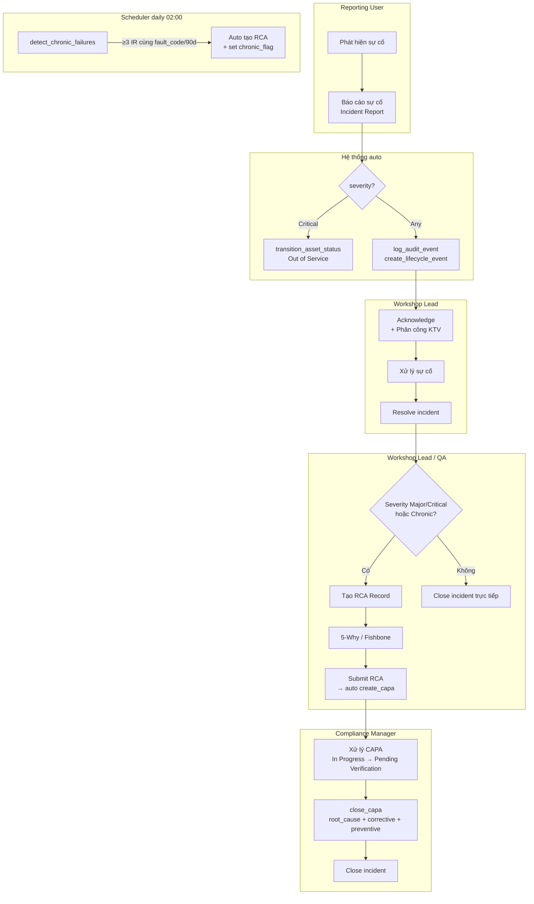
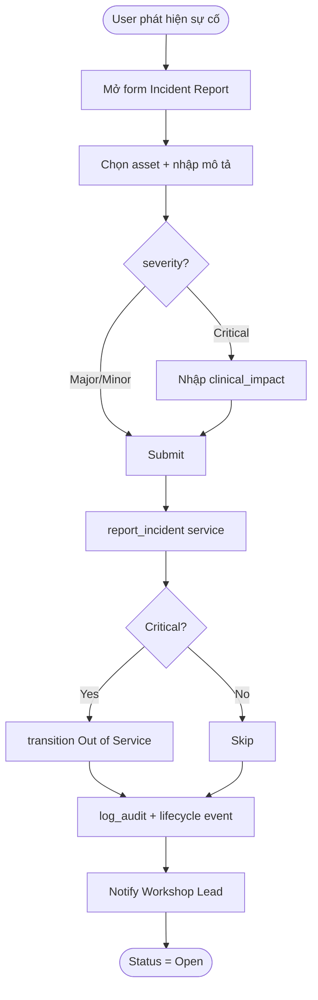
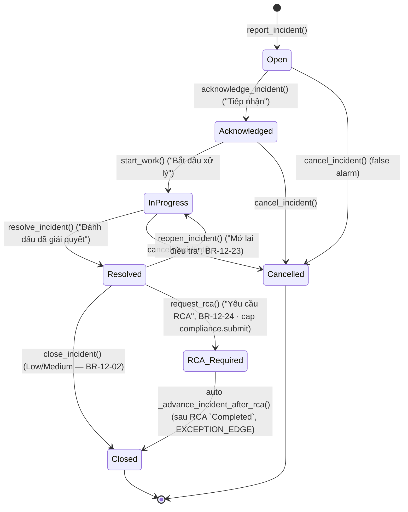
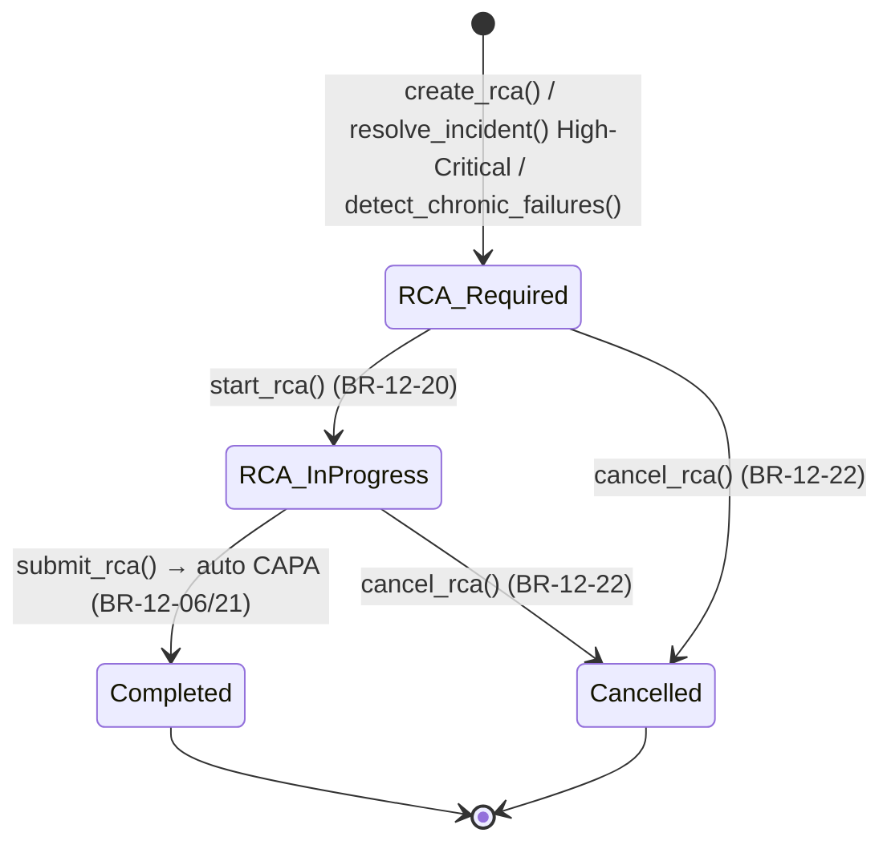

# 02 — Phân tích thiết kế nghiệp vụ (Analysis & Design)

| Mục | Giá trị |
|---|---|
| Module | IMM-12 — Sự cố & CAPA (Incident & Corrective Action) |
| Phạm vi | Per-module |
| Owner | BA + System Analyst |
| Liên kết | 03 Diagrams · 04 Backend · 05 API · 06 Frontend |
| Cập nhật | 2026-05-27 |
| Trạng thái | ✅ Live — `services/imm12.py` + `api/imm12.py` (14 endpoint) + DocType `Incident Report` / `IMM RCA Record` + Workflow JSON + FE views/store đã deploy |

---

# Phần I — Module Overview

## I.0. Khảo sát hiện trạng

Tham chiếu: WHO HTM — *Computerized maintenance management system* (chương Failure reporting & RCA) và *Medical equipment maintenance programme overview* §Corrective maintenance.

| Khía cạnh | Hiện trạng truyền thống tại bệnh viện VN | Nguồn |
|---|---|---|
| Tiếp nhận sự cố | Báo qua điện thoại / Zalo / sổ tay; không có biểu mẫu chuẩn | WHO CMMS §"Work request intake" |
| Phân loại mức độ | Chủ quan, không có tiêu chí Minor/Major/Critical | WHO HTM §Corrective maintenance |
| RCA | Không hoặc làm rời rạc, không có 5-Why/Fishbone chuẩn | WHO CMMS §"Root cause analysis" |
| CAPA | Quản lý bằng Excel, không liên kết tới sự cố gốc | ISO 13485 §8.5.2 |
| Phát hiện chronic failure | Không có cơ chế tự động — chỉ phát hiện khi sự cố quá rõ | WHO CMMS §"Trend analysis" |
| Audit trail | Sổ giấy, dễ thất lạc, không immutable | NĐ 98/2021 Điều 38 |

*(Cần khảo sát baseline cụ thể tại site triển khai — số sự cố/tháng, MTTR hiện tại, % CAPA quá hạn.)*

## I.1. Pitch

IMM-12 giải quyết vấn đề sự cố thiết bị y tế không được theo dõi có hệ thống, dẫn đến lặp lại sự cố (chronic failure) mà không phát hiện, và thiếu bằng chứng audit cho cơ quan quản lý. Module tự động phân loại mức độ nghiêm trọng, kích hoạt RCA bắt buộc với Major/Critical, tạo CAPA qua IMM-00, và phát hiện sự cố mãn tính qua scheduler hàng ngày — đảm bảo mọi sự cố đều có record traceable từ báo cáo đến đóng CAPA.

## I.2. Vị trí trong WHO HTM lifecycle

| Phase | Liên quan |
|---|---|
| Needs | ✗ |
| Procurement | ✗ |
| Installation | ✓ — IMM-04 NC nghiêm trọng → Incident + CAPA |
| Operation | ✓ — tiếp nhận sự cố từ khoa phòng, KTV |
| Maintenance | ✓ — IMM-08 PM finding lớn → Incident; IMM-09 repeat failure → CAPA |
| Decommission | ✗ |

## I.3. Stakeholders & Actors

| Vai trò | Người dùng thực | Quan tâm chính | Tần suất | Loại |
|---|---|---|---|---|
| Reporting User | Điều dưỡng / KTV khoa phòng | Báo cáo sự cố nhanh, dễ dùng trên mobile | Khi có sự cố | Primary |
| Corrective Manager | Trưởng xưởng kỹ thuật | Tiếp nhận, phân công, tạo RCA, monitor CAPA | Hàng ngày | Primary |
| Compliance Manager | Nhân viên QA | Submit/Close CAPA; verify audit trail | Hàng tuần | Approver |
| Corrective Manager | Trưởng phòng HTM | Nhận escalation Critical; phê duyệt CAPA cấp cao | Khi cần | Secondary |
| Corrective Manager | Quản lý vận hành | Dashboard KPI, export compliance report | Hàng tuần | Auditor |
| AssetCore Super Admin | Quản trị viên | Cấu hình fault_code dictionary; seed data | Khi cần | Auditor |

## I.4. Scope

**In-scope:**
- Tiếp nhận Incident Report từ user / tự động từ IMM-08/09/11
- Phân loại severity Low / Medium / High / Critical (theo enum BE `Incident Report.severity`; KHÔNG dùng "Minor/Major")
- Workflow Incident (state machine BE — 7 state, khớp `imm_12_incident_workflow.json` + `_VALID_TRANSITIONS`):
  `Open → Acknowledged → In Progress → Resolved → Closed` (+ nhánh `Resolved → RCA Required → Closed`, + `Cancelled` từ Open/Acknowledged/In Progress)
  - **D3 chốt:** `Acknowledged` là state có thật & reachable. `Open → Acknowledged` ("Tiếp nhận" — Corrective Manager) tách khỏi `Acknowledged → In Progress` ("Bắt đầu xử lý" — Corrective User). Triage/phân công ≠ bắt đầu xử lý (đúng WHO CMMS work-request intake).
- RCA Record (5-Why / Fishbone) bắt buộc với High/Critical/Chronic
- CAPA tự động từ RCA Completed (gọi `imm00.create_capa()`)
- Phát hiện chronic failure (≥3 incidents cùng fault_code/90 ngày) — Scheduler daily
- Audit trail mọi state transition qua `imm00.log_audit_event()`

**Out-of-scope:**
- Thực hiện sửa chữa (thuộc IMM-09)
- SLA Engine (reuse `imm00.get_sla_policy()`); **SLA breach tracking — đã hiện thực ở BR-12-08 (R23)**. `IMM SLA Policy.priority` dùng thang P1–P4; Incident dùng `severity` Low/Medium/High/Critical → map `Critical→P1, High→P2, Medium→P3, Low→P4` (`_severity_to_sla_priority()` trong `services/imm12.py`). Nếu không có policy khớp → bỏ qua set due-time (không chặn report).
- Vigilance reporting tự động lên BYT (thuộc IMM-15)
- Risk Register integration (thuộc IMM-13)
- SMS notification (Sprint sau — chỉ email v1)

**Assumptions:**
- IMM-00 Foundation LIVE: `IMM CAPA Record`, `Incident Report`, `Asset Lifecycle Event`, `IMM Audit Trail`, `services/imm00.py`
- `services/imm00.py` đã có: `create_capa`, `close_capa`, `log_audit_event`, `create_lifecycle_event`, `transition_asset_status`, `check_capa_overdue`

**Dependencies:**
- IMM-00 Foundation (LIVE) — mọi CAPA + audit logic delegate về đây
- IMM-09 Repair WO DocType (để link `repair_wo` field)
- IMM-04 Installation (NC nghiêm trọng → Incident)
- IMM-08 PM (PM finding lớn → Incident)

## I.5. KPI mục tiêu

| KPI | Định nghĩa | Baseline | Target | Đo ở đâu |
|---|---|---|---|---|
| Incident MTTR | avg(resolved_at − reported_at) | Chưa đo | Giảm theo quý | Incident Report |
| RCA On-Time (%) | RCA Completed trước due_date / tổng | Chưa đo | ≥ 95% | RCA Record |
| CAPA On-Time Closure (%) | CAPA Closed trước due_date / tổng | Chưa đo | ≥ 90% | IMM CAPA Record |
| Chronic Failure Count | Số nhóm `(asset, fault_code)` chronic LIVE (≥3 sự cố cùng fault_code/90 ngày trượt) — `chronic_failure_count()`, **KHÔNG** đếm cờ stale `chronic_failure_flag` (BR-12-12) | *(Cần khảo sát baseline)* | Giảm theo quý | Incident Report (rolling 90d) |
| Critical Incidents / tháng | COUNT(severity=Critical) | Chưa đo | Giảm theo quý | Incident Report |

## I.6. Ràng buộc Compliance

| Quy định | Yêu cầu áp lên module | Doc tham chiếu |
|---|---|---|
| ISO 13485:2016 §8.5.2 | Corrective action bắt buộc, traceability đầy đủ | ISO 13485:2016 |
| ISO 13485:2016 §8.3 | Control of nonconforming product — incident classification | ISO 13485:2016 |
| WHO HTM 2025 §5.3.4 | Incident reporting, chronic failure detection | WHO HTM 2025 |
| NĐ 98/2021/NĐ-CP Điều 38 | Báo cáo sự cố thiết bị y tế cho cơ quan quản lý | NĐ 98/2021 |
| MEDDEV 2.7/1 Rev 4 | Vigilance reporting nghiêm trọng (defer IMM-15) | MEDDEV 2.7/1 |

## I.7. Risk & Open questions

| Risk | Likelihood | Impact | Giảm thiểu |
|---|---|---|---|
| Reporting User không biết dùng form → bỏ báo cáo | High | High | Form mobile-friendly, minimal fields, auto-fill asset |
| Chronic detection false positive (cùng fault_code khác nguyên nhân) | Medium | Medium | Review alert với Workshop Lead trước khi auto-RCA |
| CAPA overdue tích lũy không ai xử lý | Medium | High | Email escalation + dashboard Overdue counter |

| Open question | Owner | Deadline |
|---|---|---|
| Fault code dictionary quản lý ở đâu (DocType hay CSV)? | BA + Admin | Sprint 12.1 |
| Severity threshold: Major trigger RCA sau bao lâu nếu chưa tạo? | BA + QA Lead | Sprint 12.2 |

## I.8. Roadmap thực thi

| Sprint | Hạng mục | Owner | Status |
|---|---|---|---|
| 12.1 | Custom fields Incident Report (severity, rca_record, clinical_impact, chronic_failure_flag) | BE Lead | ✅ Done |
| 12.2 | RCA Record DocType + child tables (Related Incident, Five Why Step) | BE Lead | ✅ Done |
| 12.3 | `services/imm12.py` (orchestration calling imm00) | BE Lead | ✅ Done |
| 12.4 | `api/imm12.py` REST endpoints (14 endpoints) | BE Lead | ✅ Done |
| 12.5 | Scheduler `detect_chronic_failures` (daily) | BE Lead | ✅ Done |
| 12.6 | FE Incident List/Form, RCA, CAPA, Dashboard (Vue 3) | FE Lead | ✅ Done |
| 12.7 | UAT execution (TC-12-01 → TC-12-NN) | QA | 🟡 Pending |

---

# Phần II — Quy trình nghiệp vụ (Business Process)

## II.2. As-Is process

Hiện tại bệnh viện ghi nhận sự cố qua điện thoại và sổ tay. Workshop Lead nhận thông tin miệng, phân công KTV qua điện thoại. Không có tracking hệ thống, không phát hiện chronic failure, CAPA thực hiện không đồng nhất, không có audit trail cho thanh tra.

## II.3. Pain points

| # | Pain | Tác động |
|---|---|---|
| 1 | Không có báo cáo sự cố chuẩn từ khoa phòng | Mất thông tin, phản ứng chậm |
| 2 | Không phát hiện được sự cố lặp lại (chronic) | Root cause không được xử lý, sự cố tái phát |
| 3 | CAPA không theo dõi được đến khi đóng | Vi phạm ISO 13485:8.5.2 |
| 4 | Không có audit trail cho cơ quan thanh tra | Rủi ro compliance với NĐ98/WHO HTM |

## II.4. To-Be process



## II.5. Decision points

| Điểm | Câu hỏi | Quy tắc |
|---|---|---|
| Severity = Critical? | Có tự động OOS không? | BR-12-04: Critical → `transition_asset_status("Out of Service")` |
| RCA cần không? | Severity High/Critical hoặc chronic? | BR-12-02: High/Critical → RCA bắt buộc trước Close |
| Chronic failure? | ≥3 incidents cùng fault_code/asset/90 ngày? | BR-12-03: auto RCA + flag |
| Close CAPA? | root_cause + corrective + preventive đủ? | BR-00-08 (IMM-00): block nếu thiếu |

## II.6. Process metrics

Tham chiếu: WHO CMMS §"Performance indicators" (chương Reporting/RCA).

| Metric | Định nghĩa | Đo ở bước | Target |
|---|---|---|---|
| Lead time tiếp nhận | report → Acknowledged | UC-02 Acknowledge | < 30 phút (giờ làm việc) |
| Lead time xử lý | In Progress → Resolved | UC-03 Resolve | Tuỳ severity (Critical < 4h, High < 24h) |
| Lead time RCA | RCA Required → Completed | UC-05 Submit RCA | ≤ 14 ngày (Major), ≤ 7 ngày (Critical) |
| CAPA cycle time | CAPA Open → Closed | UC-06 Close CAPA | ≤ 30 ngày (target ISO 13485) |
| % chronic detection chính xác | Alert đúng / tổng alert scheduler | Scheduler daily | ≥ 80% (review feedback) |

*Baseline cụ thể: (Cần khảo sát tại site).*

## II.7. RACI matrix

| Hoạt động | Reporting User | Workshop Lead | QA Officer | System |
|---|---|---|---|---|
| Tạo Incident Report | R/A | C | — | — |
| Acknowledge + phân công | I | R/A | — | — |
| Resolve incident | — | R/A | — | — |
| Tạo RCA | — | R/A | C | — |
| Submit RCA → CAPA | — | R/A | C | — |
| Close CAPA | — | — | R/A | — |
| Detect chronic failure | I | I | I | R/A |
| Close Incident | — | R | A | — |

## II.8. Exception flow

| ID | Điểm xảy ra | Tình huống ngoại lệ | Hành xử hệ thống |
|---|---|---|---|
| EX-12-01 | UC-01 Submit Critical | Thiếu `clinical_impact` | Block với `VALIDATION` (BR-12-01); user phải nhập trước khi submit |
| EX-12-02 | UC-03 Resolve | Resolve khi WO sửa chữa chưa Close | Cảnh báo nhưng cho phép tiếp tục (operator có thể resolve thủ công) |
| EX-12-03 | UC-04/05 RCA | Major/Critical close trực tiếp không qua RCA | Block với `BUSINESS_RULE` (BR-12-02) |
| EX-12-04 | UC-08 Scheduler | Đã có RCA Open cho cùng (asset, fault_code) | Skip — idempotent, không tạo trùng |
| EX-12-05 | UC-09 Auto OOS | Asset đã Out of Service / Decommissioned | Skip transition, vẫn ghi audit trail |
| EX-12-06 | UC-06 Close CAPA | Thiếu `root_cause` / `corrective` / `preventive` | Block với `VALIDATION` (BR-00-08) |

## II.9. So sánh As-Is vs To-Be

| Khía cạnh | As-Is (truyền thống) | To-Be (AssetCore IMM-12) |
|---|---|---|
| Kênh báo sự cố | Điện thoại, Zalo, sổ tay | Form chuẩn (web + mobile) Incident Report |
| Phân loại mức độ | Chủ quan | Severity Minor/Major/Critical với rule rõ |
| Trigger Out of Service | Thủ công, hay quên | Auto khi Critical (BR-12-04) |
| RCA | Rời rạc, không lưu | DocType RCA Record + 5-Why structured |
| CAPA | Excel, không link gốc | IMM CAPA Record link RCA + Incident |
| Chronic failure | Phát hiện khi quá muộn | Scheduler daily detect ≥3/90d |
| Audit trail | Giấy | SHA-256 immutable chain (BR-00-03) |
| Báo cáo cơ quan | Soạn lại từ đầu | Export từ Audit Trail + Incident |

## II.10. Activity diagram per UC chính



*(Activity diagram chi tiết cho UC-05 Submit RCA và UC-08 Detect Chronic xem 03_Diagrams.md.)*

---

# Phần III — Use Case Specification

## III.1. Use Case Diagram

### III.1.a. Biểu đồ use case tổng quát

```
[Reporting User] ---> (UC-01 Tạo Incident Report)
[Workshop Lead] ---> (UC-02 Acknowledge Incident)
[Workshop Lead] ---> (UC-03 Resolve Incident)
[Workshop Lead, QA] ---> (UC-04 Tạo RCA Record)
[Workshop Lead, QA] ---> (UC-05 Submit RCA → CAPA auto)
[QA Officer] ---> (UC-06 Close CAPA)
[Workshop Lead, QA] ---> (UC-07 Close Incident)
[Scheduler] ---> (UC-08 Detect chronic failures)
[System] ---> (UC-09 Auto OOS khi Critical)
(UC-01) ..> (UC-09) : <<include>> [severity=Critical]
(UC-03) ..> (UC-04) : <<extend>> [Major/Critical/Chronic]
(UC-05) ..> (UC-06) : <<extend>> [CAPA created]
```

## III.2. Actor catalog

| Actor | Loại | Vai trò Frappe (dự kiến) | UC chính |
|---|---|---|---|
| Reporting User | Primary (human) | `AssetCore Auditor` (clinician/KTV) | UC-01 |
| Corrective Manager | Primary (human) | `Corrective Manager` | UC-02, 03, 04, 05, 07 |
| Compliance Manager | Approver (human) | `Compliance Manager` | UC-05 (co-execute), 06, 07 |
| Corrective Manager | Secondary (human) | `Corrective Manager` | UC-02 (escalation) |
| Operations Manager | Auditor (human) | `Corrective Manager` | Dashboard / Reports |
| Scheduler | System | `Frappe Scheduler` | UC-08 |
| System | System | Service layer (`imm12.py`) | UC-09 |

## III.3. Use Case Specifications

### UC-01: Tạo Incident Report

| Mục | Giá trị |
|---|---|
| ID | UC-IMM12-01 |
| Brief | User báo cáo sự cố thiết bị y tế với mô tả, mã lỗi, mức độ |
| Primary actor | Reporting User |
| Pre-condition | Asset tồn tại và không Decommissioned |
| Post-condition | IR status = Open; nếu Critical → asset Out of Service + audit trail |
| Trigger | User click "+ Báo cáo sự cố" |

#### Main flow
| Bước | Actor | System |
|---|---|---|
| 1 | User chọn Asset | Auto-fill Khoa phòng, Vị trí |
| 2 | User chọn fault_code, severity, nhập mô tả | — |
| 3 | Nếu Critical: User nhập clinical_impact | Hiện warning banner |
| 4 | User Submit | `report_incident()` → IR status = Open |
| 5 | — | Nếu Critical: `transition_asset_status(Out of Service)` + email Workshop Lead + Dept Head |
| 6 | — | `log_audit_event()` + `create_lifecycle_event("incident_reported")` |

#### Exception E1 — Critical không có clinical_impact (BR-12-01)
- 4a. Block: `ServiceError(VALIDATION, "Sự cố Critical bắt buộc mô tả tác động lâm sàng")`

### UC-05: Submit RCA → Auto tạo CAPA

| Mục | Giá trị |
|---|---|
| ID | UC-IMM12-05 |
| Brief | Workshop Lead/QA Submit RCA với root cause → hệ thống auto tạo CAPA |
| Primary actor | Corrective Manager, Compliance Manager |
| Pre-condition | RCA Record ở trạng thái RCA In Progress; `root_cause` và `rca_method` đã điền |
| Post-condition | RCA status = Completed; CAPA tạo tự động; IR.linked_capa cập nhật |
| Trigger | Click "Submit RCA" |

#### Main flow
| Bước | Actor | System |
|---|---|---|
| 1 | User nhập root_cause, rca_method, five_why_steps | Validate BR-12-07 |
| 2 | User click Submit | `submit_rca_and_create_capa()` |
| 3 | — | `imm00.create_capa(asset, "RCA Record", rca_name, severity)` |
| 4 | — | `RCA.linked_capa = capa_name`; `IR.linked_capa = capa_name` |
| 5 | — | `log_audit_event("rca_completed")` + notify QA Officer |

## III.4. Use Case relationships

| Quan hệ | Source UC | Target UC | Điều kiện |
|---|---|---|---|
| `<<include>>` | UC-01 Tạo Incident | UC-09 Auto OOS | severity = Critical |
| `<<include>>` | UC-01 Tạo Incident | (audit/lifecycle hooks) | mọi trường hợp |
| `<<extend>>` | UC-03 Resolve Incident | UC-04 Tạo RCA Record | severity ∈ {Major, Critical} hoặc chronic_flag |
| `<<extend>>` | UC-05 Submit RCA | UC-06 Close CAPA | CAPA đã tạo, đủ root_cause + corrective + preventive |
| `<<extend>>` | UC-08 Detect Chronic | UC-04 Tạo RCA Record | ≥3 incidents cùng (asset, fault_code) / 90 ngày |
| Generalization | — | — | Không áp dụng (UC độc lập) |

---

# Phần IV — Functional Specifications

## IV.1. User Stories & Acceptance Criteria

### US-12-01: Reporting User báo cáo sự cố Critical

**Là** Điều dưỡng, **tôi muốn** báo cáo sự cố thiết bị nhanh trên điện thoại, **để** Workshop Lead biết ngay và cử KTV đến kịp thời.

| Priority | Must |
|---|---|
| AC-01 | Given asset Active, When Reporting User submit IR Critical với clinical_impact, Then IR status=Open và asset lifecycle_status="Out of Service" |
| AC-02 | Given IR Critical, When submit thiếu clinical_impact, Then throw ValidationError (BR-12-01) |

### US-12-02: Phát hiện sự cố mãn tính

**Là** Workshop Lead, **tôi muốn** hệ thống tự phát hiện khi cùng thiết bị hỏng cùng lỗi ≥3 lần/90 ngày, **để** thực hiện RCA phòng ngừa mà không cần kiểm tra thủ công.

| Priority | Must |
|---|---|
| AC-01 | Given 3 IR cùng asset + fault_code trong 90 ngày, When scheduler chạy, Then RCA Record tạo tự động + chronic_failure_flag = True |
| AC-02 | Given RCA đang mở cùng (asset, fault_code), When scheduler chạy, Then không tạo RCA trùng (idempotency) |

## IV.2. Business Rules

> Severity canonical values trong DocType `Incident Report.severity` = **Low / Medium / High / Critical** (4 mức). Khi tài liệu này gọi "Major" hãy hiểu là "High" theo schema thực tế (service map qua `_map_severity()` trong `services/imm12.py`).

| ID | Rule | Implement ở | Liên kết test |
|---|---|---|---|
| BR-12-01 | Critical → bắt buộc `clinical_impact` | `services/imm12.py: report_incident()` | US-12-01 AC-02 |
| BR-12-02 | **High/Critical → RCA `Completed` trước khi Close — gate DERIVE-LIVE từ `severity` (SSoT), KHÔNG cờ STORED `rca_required`.** RCA-obligation predicate = **`severity ∈ {High, Critical}` (LIVE, qua `_needs_rca(doc.severity)`) OR `requires_rca == 1` (manual additive-override)** — MIRROR ĐÚNG điều kiện workflow JSON `doc.severity in ('High','Critical') or doc.requires_rca == 1` (`imm_12_incident_workflow.json:103/196/204`). Cả **2 gate** đọc CÙNG predicate: (1) service `close_incident()` (@711) + (2) controller hook `validate_incident_close_gate()` (@1740, wired `hooks.py:270` `Incident Report.validate`) ⇒ chặn nhất quán cả đường API lẫn desk/`doc.save`, KHÔNG lệch nhau (triple-parity workflow-JSON ⇔ service ⇔ hook). Trúng predicate: thiếu `rca_record` → `IMM12_CLOSE_RCA_REQUIRED`; có `rca_record` nhưng RCA `status != Completed` → `IMM12_CLOSE_RCA_INCOMPLETE` (in-handler HTTP-200 body `success:false` Error envelope, KHÔNG status-line — DONE-gate LL-BE-42..49). **Field `rca_required` = DERIVED MIRROR** (`read_only`): `validate_incident_close_gate` recompute `rca_required = 1 if _needs_rca(severity) else 0` MỖI lần save ⇒ escalation Medium→Critical + `doc.save()` → `rca_required==1` (KHÔNG còn stale set-once-lúc-tạo); downgrade Critical→Medium → `rca_required==0`. Gate KHÔNG đọc cờ mirror (mirror chỉ nuôi KPI `rca_pending`/list). **RED-prove:** phiếu tạo `severity=Medium` (`rca_required=0` đúng) → escalate `Critical` → `close_incident` BỊ CHẶN dù `rca_required` ban đầu 0 (bug cũ: `_needs_rca(sev) AND rca_required` = `True AND 0` = False → lọt CẢ 2 gate). | `services/imm12.py: close_incident()/validate_incident_close_gate()/_needs_rca()` | TC-12-Close-Without-RCA · TC-12-Close-Escalation-* |
| BR-12-03 | ≥3 incidents cùng `fault_code` / asset trong 90 ngày → auto RCA + `chronic_failure_flag` | `services/imm12.py: detect_chronic_failures()` (scheduler daily) | US-12-02 |
| BR-12-04 | Critical → `report_incident()` auto `transition_asset_status(Out of Service)`. High → auto OOS khi `acknowledge_incident()`. | `services/imm12.py` | US-12-01 AC-01 |
| BR-12-05 | Mọi transition → `log_audit_event()` (SHA-256 chain) | Helper `_log()` trong service | — |
| BR-12-06 | Submit RCA → auto `imm00.create_capa()` + ghi `linked_capa` lên RCA và Incident | `services/imm12.py: submit_rca()` | — |
| BR-12-07 | RCA `root_cause` + `rca_method` ∈ {5-Why, Fishbone, Other} bắt buộc trước Submit | `services/imm12.py: submit_rca()` | — |
| BR-12-08 | **SLA breach tracking** — `report_incident()` resolve `IMM SLA Policy` theo `severity` → set `sla_policy`, `response_due_at = reported_at + response_time_minutes`, `resolution_due_at = reported_at + resolution_time_hours`. `acknowledge_incident()` set `response_breached` nếu `acknowledged_at > response_due_at`. `resolve_incident()` set `resolution_breached` nếu `resolved_at > resolution_due_at`. Scheduler hourly `check_incident_sla_breach()` đánh dấu breach cho incident chưa đóng đã quá hạn + `_log()` audit-trail (BR-12-05). KHÔNG hardcode giờ — đọc từ `IMM SLA Policy`. | `services/imm12.py: report_incident()/acknowledge_incident()/resolve_incident()/check_incident_sla_breach()` | TC-12-SLA-* |
| BR-12-09 | **SLA breach escalation (notification)** — khi `check_incident_sla_breach()` set một cờ breach từ `0→1` cho 1 incident, hệ thống bắn **ĐÚNG 1 notification** (in-app + email qua `notifications._dispatch`) cho recipient của incident đó. Phân biệt 2 loại trong nội dung: **response-breach** (chưa tiếp nhận quá `response_due_at`) vs **resolution-breach** (chưa đóng quá `resolution_due_at`). Recipient route qua SSoT `services/shared/notify_roles.py` (block escalation incident) hợp với `assigned_to`/`reported_by` của incident VÀ `escalation_l1_user`+`escalation_l2_user` đọc từ `IMM SLA Policy` (`get_sla_policy` đã trả 2 field này). **KHÔNG hardcode role-name** (anti RBAC-dead-gate). **Idempotent**: dùng chính cờ `response_breached`/`resolution_breached` làm khoá — lần quét sau cờ đã =1 ⇒ KHÔNG bắn lại (sweep 2 lần liên tiếp ⇒ tổng notification không đổi). Mỗi lần escalate ghi thêm **1 audit entry** `'SLA breach escalated → <recipients>'` (giữ entry phát-hiện cũ, KHÔNG thay thế — BR-12-05). Per-incident try/except: 1 incident lỗi KHÔNG dừng batch; incident không có recipient nào → set cờ + audit như cũ, KHÔNG bắn rỗng, KHÔNG crash. | `services/imm12.py: check_incident_sla_breach()` + `services/notifications.py` | TC-12-SLA-ESC-* |
| BR-12-10 | **NĐ98 escalation gate** — incident `severity ∈ {Critical, High}` khi breach PHẢI thêm **QA Officer** (`notify_roles.QA_OFFICER`) + **Ops Manager** (`notify_roles.OPS_MANAGER`) vào recipient, **kể cả khi** `IMM SLA Policy` không set `escalation_l1_user`/`escalation_l2_user`. Đây là compliance gate (báo cáo sự cố nghiêm trọng đúng cửa sổ luật định). | `services/imm12.py: check_incident_sla_breach()` (qua `notify_roles`) | TC-12-SLA-ESC-NĐ98 |
| BR-12-11 | **SoT "incident đang mở"** — mọi consumer (dashboard KPI card/donut/persona, SLA engine, list drill-down) đếm open-set qua **1 helper** `open_incident_filter()` = `{status ∈ {Open, Acknowledged, In Progress, RCA Required}}` (POSITIVE list — Cancelled/Resolved/Closed KHÔNG mở). `get_incident_stats()` THÊM `open_total = count(open_incident_filter())`; `get_dashboard().active_incidents` dùng cùng filter ⇒ **invariant: card count == số dòng list sau drill `?open=1`**. Backward-compat: GIỮ `open`/`investigating` per-state. | `services/imm12.py: open_incident_filter()/get_incident_stats()/get_dashboard()` | TC-12-OPEN-SOT-* |
| BR-12-11b | **KPI strip severity = open-set** — tile *"Sự cố nghiêm trọng / mức cao"* trên trang danh sách đếm theo open-set SoT, KHÔNG global all-status. `get_incident_stats()` THÊM `critical_open = count(open_incident_filter()∧severity=Critical)` + `high_open = count(open_incident_filter()∧severity=High)` (DÙNG LẠI `open_incident_filter()`, KHÔNG inline negative-list mới; loại Closed/Cancelled/Resolved). FE `IncidentListView.vue` strip bind `critical_open ?? 0` / `high_open ?? 0` + nhãn 'đang mở' → trên `?open=1` strip == số dòng severity trong bảng, KHÔNG còn mâu thuẫn thị giác. Backward-compat: GIỮ `critical`/`high` global cho donut. Bất biến: `critical_open <= critical`, `high_open <= high`. | `services/imm12.py: get_incident_stats()` + `frontend IncidentListView.vue::kpiItems` | TC-12-STRIP-OPEN-* |
| BR-12-12 | **SoT KPI "Lặp lại (Chronic)" = nhóm LIVE rolling-window, KHÔNG cờ stale** — KPI tile *"Lặp lại (Chronic)"* trên dashboard PHẢI đếm **số nhóm `(asset, fault_code)` đang chronic theo cửa sổ trượt 90 ngày live** (định nghĩa của `get_chronic_failures()` = `GROUP BY (asset, fault_code) HAVING COUNT(*) >= 3` trong 90d, `status != Cancelled`), KHÔNG đếm cờ bền vững `chronic_failure_flag`. Một **SoT count helper dùng chung** `chronic_failure_count()` (cùng predicate với `get_chronic_failures()`) là nguồn duy nhất; `get_incident_stats().chronic` VÀ FE đều phái sinh từ nó — KHÔNG inline lại SQL/đếm ở nhiều nơi (anti-drift). **Lifecycle (RED-prove):** khi 3+ incident cũ aged-out > 90 ngày (cờ `chronic_failure_flag` vẫn = 1 trên các incident đó nhưng không còn nhóm nào ≥ 3 trong 90d) → tile chronic GIẢM về **0** (định nghĩa stale cũ giữ tile > 0 vĩnh viễn = bug). **Invariant 1 màn hình:** trên cùng 1 payload `get_dashboard()`, `stats.chronic == len(dashboard.chronic_failures)` — tile (`IMM12DashboardView.vue:106`) và panel (`:221-234`) cùng SoT, KHÔNG còn 2 con số mâu thuẫn. **Đơn vị thống nhất:** cả tile lẫn panel đếm theo **nhóm `(asset, fault_code)`**, KHÔNG còn lệch đơn vị (cũ: tile = số incident-rows-có-cờ vs panel = số nhóm-live). **Cờ `chronic_failure_flag` GIỮ NGUYÊN** cho badge per-row *"Lặp lại"* (`IncidentListView.vue:271/:317`) — đây là lifecycle riêng của cờ: đánh dấu incident *từng thuộc* cụm chronic (audit/RCA grouping BR-12-03), KHÔNG bị xoá/reset, KHÔNG regression. | `services/imm12.py: chronic_failure_count()/get_incident_stats()/get_dashboard()` + `frontend IMM12DashboardView.vue` | TC-12-CHRONIC-SOT-* |
| BR-12-13 | **SoT KPI "Vi phạm SLA tiếp nhận/xử lý" = breach LIVE predicate, KHÔNG cờ stale stamped-by-scheduler** — KPI tile *"Vi phạm SLA tiếp nhận"* / *"Vi phạm SLA xử lý"* (dashboard) + badge per-row (list/active_incidents) PHẢI đếm/hiển thị theo **predicate breach LIVE**, KHÔNG chỉ cờ bền vững `response_breached`/`resolution_breached` (cờ chỉ được scheduler `check_incident_sla_breach()` stamp theo cửa sổ hourly → cửa sổ trễ scheduler ⇒ incident vừa quá hạn 1–59′ chưa được stamp ⇒ **undercount** tile + badge thiếu). **Predicate SoT `sla_breach_filter(kind)`** với `kind ∈ {"response","resolution"}` định nghĩa breach = **`(cờ_kind = 1)` OR `(đang-mở ∧ quá-hạn-live)`** trong đó: `cờ_kind` = `response_breached`/`resolution_breached`; `đang-mở` = `status ∈ INCIDENT_OPEN_STATES` (dùng lại `open_incident_filter()` — KHÔNG inline negative-list → terminal Cancelled/Closed/Resolved KHÔNG bao giờ vào nhánh live-overdue, chỉ qua nhánh cờ=1 nếu lịch sử từng breach); `quá-hạn-live` = `<kind>_due_at < now()` (response→`response_due_at`, KÈM `acknowledged_at IS NULL`; resolution→`resolution_due_at`). **SoT count helper `sla_breach_count(kind)`** (phái sinh TRỰC TIẾP từ `sla_breach_filter(kind)`, 2 nhánh cờ=1 / cờ=0∧live mutually-exclusive → đếm cộng KHÔNG double-count) là nguồn DUY NHẤT cho `get_incident_stats().sla_response_breached`/`sla_resolution_breached`. **Per-row enrich LIVE:** mỗi row `list_incidents` + `get_dashboard().active_incidents` thêm `is_response_breached`/`is_resolution_breached` (0\|1, derive cùng `sla_breach_filter` predicate trên từng row) → FE đọc field derived thay cờ thô ⇒ **badge live == tile**. **Idempotent (anti double-path drift):** sau khi scheduler chạy stamp cờ, KPI KHÔNG đổi giá trị — incident đã đếm vì live nay đếm vì cờ (cùng 1 con số trước/sau scheduler). **RED-prove:** OPEN incident `resolution_due_at` quá hạn −2h, cờ=0, scheduler chưa chạy ⇒ `sla_resolution_breached` PHẢI =1 (cũ `count(cờ=1)`=0 → bug undercount). **Cờ `response_breached`/`resolution_breached` GIỮ NGUYÊN** ở write-path (`acknowledge_incident`/`resolve_incident`/`check_incident_sla_breach`, BR-12-08) + escalation idempotent-key (BR-12-09) — KHÔNG regression: cờ=1 lịch sử (incident đã đóng/resolve, due không còn live-open) VẪN được đếm qua nhánh `(cờ=1)`. | `services/imm12.py: sla_breach_filter()/sla_breach_count()/get_incident_stats()/list_incidents()/get_dashboard()` + `frontend IMM12DashboardView.vue/IncidentListView.vue` | TC-12-SLA-LIVE-* |
| BR-12-15 | **Cap-gate `report_incident` 3-tier parity (V4-GATE D1) — đóng lỗ leo quyền P1** — API `report_incident` PHẢI chặn **`corrective.create`** (CÙNG cap với route-guard FE `router/index.ts:450` + scan-action SSoT `services/imm00.py:419-420`). User thiếu cap → **403** message VI sạch *"Không có quyền thực hiện hành động này"* (TUYỆT ĐỐI KHÔNG leak raw cap `corrective.create` — dùng `rbac.can` + `_err`, KHÔNG `rbac.require` vì require throw `"Khong du quyen: {cap}"`). User có cap → 200 + Incident tạo. Gate ở **API tier** (đường HTTP duy nhất; đóng curl/REST bypass). RED-prove: user `corrective.read`-không-`create` gọi `report_incident` trực tiếp → 403 no-leak (cũ: 200 bypass). Test tương đẳng 3 binding CÙNG cap `corrective.create`. | `api/imm12.py: report_incident()` (THÊM `rbac.can("corrective.create")`) | TC-12-CAPGATE-* |
| BR-12-16 | **Canonical lifecycle event `incident_reported` + provenance `source` (V4-GATE D2/D3)** — `report_incident` thành công ⇒ ghi **`Asset Lifecycle Event` `event_type='incident_reported'`** (canonical, đã trong Select `Asset Lifecycle Event` + đã ghi doc §6 — KHÔNG dùng `failure_reported` vì KHÔNG có trong Select), `root_doctype="Incident Report"` + `root_record=<IR>` (BẮT BUỘC kèm nhau, pattern IMM-09 — thiếu `root_doctype` → event bị nuốt). **Provenance `source`** enum `{"manual","qr-scan"}` (default `manual`; ∉ enum → coi manual, KHÔNG throw): `notes` (lifecycle) + `change_summary` (audit) ghi rõ `(qr-scan)`/`(manual)` qua SSoT 1 hàm `_source_label`. Audit `_log` (`IMM Audit Trail`, hash-chain) GIỮ → `verify_audit_chain(asset).valid==True` (lifecycle KHÔNG nằm trong chain). **FE (D3):** deep-link `/incidents/new?asset=<name>&source=qr-scan` → ô Thiết bị prefill + **KHOÁ** (`SmartSelect :disabled`) khi `source=qr-scan ∧ có asset`; payload `reportIncident` chứa `source`. No-source/manual → editable + `source=manual` (NO regression). RED-prove: sau report → ≥1 lifecycle `incident_reported` (cũ chỉ generic audit `event_type="Incident"`). | `services/imm12.py: report_incident()/_source_label`; `api/imm12.py`; `frontend IncidentCreateView.vue/api/imm12.ts` | TC-12-LIFECYCLE-PROV-* |
| BR-12-17 | **Đính ảnh hiện trường — permission + validation (mobile CR-17/G6)** — `attach_incident_photo(incident_name)` (multipart `file`): (1) **Permission** = reporter (`incident.reported_by == session.user`) **HOẶC** `frappe.has_permission("Incident Report","write",doc=incident_name)` (tái dùng IDOR-guard AUTH-10 — Vendor ngoài scope → FORBIDDEN). Thiếu cả 2 → in-handler cap-403 Decision-B `FORBIDDEN` (KHÔNG leak cap), Guest → dispatcher-403. (2) **Validation** (TRƯỚC khi tạo File): thiếu `file`/content-type∉{jpg,png}/size>`MAX_INCIDENT_PHOTO_BYTES` → `VALIDATION` `fields.file=<msg VN>`; đủ 5 ảnh (`len(_scene_photos)>=MAX_INCIDENT_PHOTOS=5`) → `VALIDATION 'Tối đa 5 ảnh'`. (3) success → **đúng 1** File `is_private=1` (`attached_to`=Incident). **Mọi nhánh reject KHÔNG tạo File.** | `services/imm12.py: attach_incident_photo()/_scene_photos()`; `api/imm12.py` | TC-12-PHOTO-* |
| BR-12-18 | **Bằng chứng hiện trường NĐ98 — lifecycle event + `scene_photos` parity** — (a) mỗi lần đính thành công sinh **đúng 1** `Asset Lifecycle Event` `event_type='incident_photo_attached'` (`actor=session.user`, `timestamp`, `root_doctype/root_record`) — **hard-requirement** (commit cùng File, KHÔNG swallow; evidence KHÔNG ghi im lặng). Cần THÊM option `incident_photo_attached` vào Select `Asset Lifecycle Event.event_type` (deploy reload-doctype). (b) `get_incident_detail` trả `scene_photos: [{file_url,file_name}]` (`[]` khi rỗng) — parity mobile+web, derive `_scene_photos` (CÙNG SoT với max-count → **count==rows**); KHÔNG rò field web-only khác. | `services/imm12.py: get_incident_detail()/attach_incident_photo()`; `asset_lifecycle_event.json` (+enum); FE Incident Detail | TC-12-PHOTO-EVIDENCE-* |
| BR-12-19 | **Server-driven CTA RCA — SSoT `allowed_transitions` + `can_manage_rca`** — `get_rca(name)` trả `allowed_transitions: list[str]` = `_RCA_VALID_TRANSITIONS.get(status, [])` (`RCA Required→[RCA In Progress, Cancelled]`, `RCA In Progress→[Completed, Cancelled]`, `Completed`/`Cancelled→[]`) + `can_manage_rca: int(0/1)` = `rbac.can("corrective.write")`. FE render nút = `can_manage_rca && đích ∈ allowed_transitions` — **KHÔNG hardcode `rca.status==='X'`, KHÔNG hardcode role-name** (GATE-8/LL-FE-51; parity `get_work_order` imm09.py:917). Guard test map ↔ `fixtures/workflow.json` "IMM-12 RCA Workflow" edge-by-edge + codomain ⊆ enum `status`. | `services/imm12.py: _RCA_VALID_TRANSITIONS/get_rca()`; `api/imm12.py`; `frontend RCADetailView.vue/api/imm12.ts` | TC-12-RCA-CTA-* |
| BR-12-20 | **`start_rca` — Bắt đầu phân tích (RCA Required → RCA In Progress)** — endpoint mới; status ≠ `RCA Required` → `IMM12_RCA_START_INVALID_STATE` (VN inline "Chỉ có thể bắt đầu phân tích khi phiếu ở trạng thái Cần phân tích", in-handler HTTP-200 Error envelope). Cap-gate `corrective.write` (base user → cap-403; Super Admin → OK). Audit `_log` token **`rca_started`** (`from→to` = `RCA Required→RCA In Progress`). | `services/imm12.py: start_rca()`; `api/imm12.py` | TC-12-RCA-START-* |
| BR-12-21 | **`submit_rca` chặn nhảy-cóc — CHỈ từ RCA In Progress** — hoàn thành RCA gọi từ `RCA Required` (bỏ qua `RCA In Progress`) → `IMM12_RCA_SUBMIT_INVALID_STATE` (VN inline, in-handler). Hành vi CŨ cho submit thẳng từ `RCA Required` = **BUG** (bỏ trạng thái phân tích), nay chặn. Audit token **`rca_completed`**. GIỮ guard cũ (409 already-Completed, 422 thiếu root_cause/corrective, auto-CAPA BR-12-06). | `services/imm12.py: submit_rca()`; `api/imm12.py` | TC-12-RCA-SUBMIT-STATE-* |
| BR-12-22 | **`cancel_rca` — Hủy RCA ({RCA Required, RCA In Progress} → Cancelled)** — endpoint mới; `reason` required (`IMM12_CANCEL_REASON_REQUIRED`); status ∈ `{Completed, Cancelled}` → `IMM12_RCA_CANCEL_INVALID_STATE` (VN inline). Cap-gate `corrective.write`. Audit token **`rca_cancelled`**. Hủy RCA của Incident Major/Critical ⇒ `rca_status ≠ Completed` → `close_incident` VẪN chặn (BR-12-02), KHÔNG mở đường đóng-lách. | `services/imm12.py: cancel_rca()`; `api/imm12.py` | TC-12-RCA-CANCEL-* |
| BR-12-23 | **`reopen_incident` — Mở lại điều tra (Resolved → In Progress)** — endpoint mới surface cạnh workflow "Mở lại điều tra" (đã có trong `imm_12_incident_workflow.json`, chỉ thiếu trong SSoT service map ⇒ CTA ẩn câm — drift a, CR-WF-12). Thêm `'In Progress'` vào `_VALID_TRANSITIONS[Resolved]` ⇒ `get_incident_detail.allowed_transitions` chứa `'In Progress'` khi status=`Resolved` → FE render nút "Mở lại điều tra". `reason` required (`IMM12_REOPEN_REASON_REQUIRED`, in-handler HTTP-200 Error envelope); status ≠ `Resolved` → `IMM12_BAD_STATE` qua `_assert_transition`. **Cap-gate `incident.close`** (parity Close — workflow cho cùng role-set {System Manager, AssetCore Super Admin} cho cả "Đóng sự cố" và "Mở lại điều tra"; base/Corrective User → 403). Audit **IMM Audit Trail** `_log(name, asset, "Mở lại điều tra — {reason}", "Resolved", "In Progress")` (BR-12-05 — mọi transition → audit; đối xứng ack/start/resolve/close/cancel). **KHÔNG** đổi asset `lifecycle_status` (Resolved chưa restore asset; nếu Critical→OOS thì asset vẫn OOS, đúng nghĩa "chưa sửa xong") ⇒ **KHÔNG** phát sinh Asset Lifecycle Event mới (`incident_reopened` KHÔNG có trong Select `event_type` — thêm = schema-change Ask-first, [ROADMAP]; xem ADR-IMM12-INCIDENT-CTA). | `services/imm12.py: reopen_incident()`; `api/imm12.py`; `frontend IncidentDetailView.vue/api/imm12.ts` | TC-12-REOPEN-* |
| BR-12-24 | **`request_rca` — Yêu cầu phân tích RCA (Resolved → RCA Required)** — endpoint mới surface cạnh workflow "Yêu cầu RCA" (đã có trong `imm_12_incident_workflow.json` `allowed`={Compliance Manager, System Manager, AssetCore Super Admin} + đã có `'RCA Required'` ∈ `_VALID_TRANSITIONS[Resolved]` từ Round 12 — chỉ thiếu ENTRY endpoint+CTA ⇒ `allowed_transitions` advertise nhưng KHÔNG có nút, backlog CR-WF-12). **KHÔNG đổi `_VALID_TRANSITIONS` NÀO** (state edge đã reconciled) ⇒ INVARIANT `TestIncidentAllowedTransitions` GIỮ GREEN + KHÔNG đụng workflow JSON ⇒ admin-override 22/22 GREEN. Transition đi **qua `apply_workflow(action="Yêu cầu RCA")`** (mirror `_advance_incident_after_rca` — KHÔNG `db.set_value` trực tiếp, giữ `workflow_state` nhất quán) + sync `status` Select=`RCA Required` (dual-track, mirror `_advance`); wrap try/except + fallback `db.set_value` khi `workflow_state` desync. RCA Record **idempotent — reuse** `doc.rca_record` nếu hợp lệ, else gọi `create_rca(name)` (GUARD trước khi gọi vì `create_rca` raise 409 nếu đã có ⇒ KHÔNG tạo trùng). Precondition `status ≠ Resolved` → **`IMM12_REQUEST_RCA_BAD_STATE` (422, MSG MỚI — KHÔNG dùng `IMM12_BAD_STATE`=409)** KHÔNG đổi status; `rca_reason` blank → `IMM12_RCA_REASON_REQUIRED` (422). **Cap-gate `compliance.submit`** (= DocPerm submit `IMM CAPA Record` → {AssetCore Super Admin, Compliance Manager} ⊆ workflow allowed → KHÔNG false-clickable; rbac.can + `_MSG_FORBIDDEN`, KHÔNG `rbac.require`/leak raw cap — parity acknowledge/close). Audit **IMM Audit Trail** `_log(name, asset, "Yêu cầu RCA — {rca_reason}", "Resolved", "RCA Required")` — **KHÔNG** thêm option Select `event_type` mới (event_type="Incident" generic, precedent reopen D4). Đóng loop downstream: RCA Required → hoàn tất RCA → `_advance_incident_after_rca` tự đẩy → Closed (EXIT đã build sẵn, round này bổ ENTRY). | `services/imm12.py: request_rca()`; `api/imm12.py`; `frontend IncidentDetailView.vue/api/imm12.ts` | TC-12-REQRCA-* |
| BR-12-25 | **`report_incident` idempotency `client_request_id` (mobile write-outbox, CR-24 Round 32)** — đóng cửa sổ re-drain outbox tạo phiếu sự cố TRÙNG (NĐ98 audit-integrity — vết sự cố/audit trail phải toàn vẹn, KHÔNG phiếu+event+audit trùng). Thêm param OPTIONAL `client_request_id` (UUID client-side ổn định qua re-drain) vào handler+service. **Non-empty:** SELECT-before-insert ở ĐẦU service `frappe.db.get_value("Incident Report", {client_request_id, reported_by})` — trúng (scope `(client_request_id, reported_by)`, "cùng reporter") → **early-return** `{name,status,severity}` của phiếu ĐÃ tạo, KHÔNG insert / KHÔNG `_log` (IMM Audit Trail) / KHÔNG emit `incident_reported` lifecycle event ⇒ `count(lifecycle incident_reported)==1` ∧ `count(audit)==1`. **Rỗng/thiếu:** guard skip → tạo mới NGUYÊN VẸN (mỗi call=1 phiếu — backward-compat 100% call-path cũ web/desk). 2 key KHÁC → 2 phiếu. Field `client_request_id` (Data, `search_index:1` → DB index NON-UNIQUE) persist trên `Incident Report`; lookup index-seek O(1) KHÔNG full-scan. **KHÔNG DB UNIQUE** (nhiều dòng `""` sẽ collide — ADR-IMM12-09). OAS mirror `ReportIncidentRequest` +property optional `client_request_id` (∉ required; COUPLED handler-parity test 13e ⇒ yaml+handler-param land ATOMIC, KHÔNG pure-yaml). **[LANDED-DELTA 2026-07-14: bản land = GLOBAL-key + `unique:1` NULL-store + race-handler `UniqueValidationError` (ADR-MOBILE-047) — KHÔNG scope `reported_by`/NON-UNIQUE như row này; xem `04 §2.1a` note]** | `services/imm12.py: report_incident()`; `api/imm12.py`; `incident_report.json` (+field); `docs/mobile/openapi/*.yaml` (+prop) | TC-12-IDEMP-* |
| BR-12-26 | **`attach_incident_photo` idempotency `client_request_id` (CR-24 phần dư · B-rel-3, vòng 3)** — đóng cửa sổ **attachment-dup**: mobile drain PHA-2 re-POST ảnh khi response rớt mạng → File TRÙNG + lifecycle event `incident_photo_attached` TRÙNG (bẩn evidence-trail NĐ98). Param OPTIONAL `client_request_id` TƯỜNG MINH ở handler (`api/imm12.py:295` — hết bị `**_ignore` nuốt câm) + service. **Non-empty:** dedupe 2 lớp theo composite scoped key `{incident}::{key}` trên Custom Field **`File.ac_client_request_id`** (`unique:1` NULL-store, fixture — File là core, chỉ extend): lớp-1 pre-check **SAU permission / TRƯỚC validation** → trúng ⇒ early-return `{file_url,file_name}` File ĐÃ đính, 0 insert / 0 event lần 2; lớp-2 race-handler `UniqueValidationError` → re-read winner (kẻ thua raise TRƯỚC emit ⇒ 0 event trùng). **Rỗng/thiếu:** at-least-once CŨ nguyên vẹn (mỗi call 1 File, field NULL). **Cùng key KHÁC incident:** KHÔNG dedupe chéo (composite khác) — 2 File. Response shape GIỮ EXACT 2-key. KHÔNG TTL (key sống cùng File). Backend-confirm (a)(b)(c) + alternatives: ADR-IMM12-10. | `services/imm12.py: attach_incident_photo()`; `api/imm12.py:295`; `fixtures/file_custom_fields.json` (+Custom Field) + `hooks.py`; `docs/mobile/openapi/*.yaml` (`AttachIncidentPhotoRequest` +prop, closed GIỮ) + guard `test_mobile_oas` (props-const + live-sig (h)) | TC-12-PHOTO-IDEMP-* |
| BR-12-27 | **`create_rca`/`request_rca` — thay hồ sơ RCA đã HỦY (CR-55, gỡ deadlock)** — Incident High/Critical có `rca_record` trỏ RCA `status='Cancelled'` bị **KHÓA VĨNH VIỄN**: `create_rca` raise `IMM12_RCA_ALREADY_EXISTS` (409) vì rca_record TỒN TẠI ⇒ KHÔNG tạo RCA thay thế; RCA Cancelled là terminal KHÔNG bao giờ tới `Completed` ⇒ `close_incident` raise `IMM12_CLOSE_RCA_INCOMPLETE` (BR-12-02) mãi ⇒ phiếu không đóng được, asset kẹt Out of Service. **FIX — vị-từ "RCA CÒN SỐNG" (không Cancelled) là điều kiện chặn, KHÔNG phải "rca_record tồn tại"**: cả `create_rca` và `request_rca` dùng CHUNG helper `_has_live_rca(doc)` = `bool(doc.rca_record) ∧ frappe.db.exists(_DT_RCA, rca_record) ∧ frappe.db.get_value(_DT_RCA, rca_record, "status") != _RCA_CANCELLED`. (1) `create_rca`: `if _has_live_rca(doc): nthrow(IMM12_RCA_ALREADY_EXISTS)` — RCA Cancelled ⇒ predicate False ⇒ TẠO RCA MỚI + `set_value(rca_record=<mới>)` (re-point Incident sang tên mới). (2) `request_rca` reuse: `if not _has_live_rca(doc): create_rca(name)` — Cancelled ⇒ tạo mới (KHÔNG tái dùng hồ sơ huỷ). **REGRESSION-GUARD (bất biến giữ nguyên)**: rca_record trỏ RCA `status != Cancelled` (`RCA Required`/`RCA In Progress`/**`Completed`**) → `_has_live_rca`=True → `create_rca` VẪN raise `IMM12_RCA_ALREADY_EXISTS` (idempotent cũ) · `request_rca` VẪN reuse. **Audit-integrity NĐ98**: RCA cũ Cancelled GIỮ NGUYÊN status=Cancelled (KHÔNG sửa/xoá — vết audit "đã từng phân tích, đã huỷ có lý do trong rca_notes"); loại-Cancelled = REPLACE-tạo-mới, KHÔNG un-cancel. Error nghiệp vụ = in-handler HTTP-200 Error envelope (409 bucket), KHÔNG raise→4xx. KHÔNG field/DocType/endpoint/`@frappe.whitelist` mới ⇒ `oas_baseline` bất biến, KHÔNG migrate. Xem ADR-IMM12-11. | `services/imm12.py: _has_live_rca()/create_rca()@869/request_rca()@832`; `api/imm12.py` (giữ) | TC-12-RCA-REPLACE-* |
| BR-12-28 | **Hồ sơ RCA — 3 ràng buộc hoàn tất phải trả LỖI NGHIỆP VỤ CÓ ĐỊA CHỈ (AC-CR-83)** — hồ sơ phân tích nguyên nhân gốc chỉ được chốt `Completed` khi (a) **đã phân công** người phụ trách, (b) có **nguyên nhân gốc** + **tóm tắt hành động khắc phục**, (c) nếu phương pháp chứa "5-Why" thì có **đủ 5 bước** và **mọi bước có câu hỏi + câu trả lời**. Trước AC-CR-83, cả 3 ràng buộc chỉ enforce trong controller hook bằng `frappe.throw` trần ⇒ `handle()` (chỉ bắt `ServiceError`) để `ValidationError` bay lên dispatcher ⇒ **HTTP-417 thô**: không `success`, không `code`, không `message_code`, không `fields` — kỹ thuật viên thấy chuỗi máy chủ thô và **không biết ô nào sai**. Vì `create_rca` seed sẵn 5 bước với câu trả lời rỗng, đây là ca **phổ biến nhất**, không phải biên. **LUẬT:** mỗi ràng buộc = **MỘT** predicate thuần trong `services/imm12.py`, được **dùng chung** bởi pre-check ở service (đường API) và hook backstop ở controller (đường Desk) — sửa 1 chỗ, cả 2 đổi. Lỗi trả **HTTP-200 + Error envelope** kèm `message_code` và `fields` khoá theo **tên tham số GHI** (`corrective_action`, KHÔNG `corrective_action_summary`) và theo **số hiển thị** của bước (`five_why_steps.<why_number>`). Pre-check chạy **TRƯỚC mọi phép gán** ⇒ hồ sơ bị từ chối giữ nguyên trạng thái (không mutate nửa vời). Hợp đồng `message_code` cũ (`IMM12-RCA-ROOT-CAUSE-REQUIRED`/`IMM12-RCA-CORRECTIVE-REQUIRED`) **KHÔNG đổi** — chỉ **thêm** `fields`. **Tuân thủ NĐ98/WHO HTM:** hồ sơ RCA là bằng chứng khắc phục nguyên nhân gốc; hồ sơ chốt **thiếu** phân tích = bằng chứng giả — ràng buộc này phải enforce ở **mọi** đường ghi (API, Desk, script), không chỉ ở form. **Ngoài phạm vi:** phương pháp `Both` hiện KHÔNG bị kiểm 5-Why (predicate khớp chuỗi "why") — xem AC-CR-83b. Xem ADR-IMM12-13/14/15 (`05 §22.9`). | `services/imm12.py::validate_five_why_payload/validate_rca_assignment/validate_rca_completion/submit_rca`; `doctype/imm_rca_record/imm_rca_record.py::validate` | TC-12-RCA83-01..13 · TC-FE-RCA83-01..07 |
| BR-12-29 | **`report_incident` chặn thiết bị ĐÃ THANH LÝ — land EC-12-05 (AC-CR-90, vòng 4/5 IMM-00)** — Core Doc **đã** đặc tả từ đầu (§III.3 UC-01 *Pre-condition: "Asset tồn tại và không Decommissioned"* + §III.5 **EC-12-05** `VALIDATION`), nhưng `services/imm12.py::report_incident` chỉ kiểm `frappe.db.exists` ⇒ **spec có, code không có**: báo được sự cố cho thiết bị đã ra khỏi đội hình ⇒ phiếu mồ côi (không thể chuyển thành phiếu sửa chữa vì `Decommissioned` là trạng thái **terminal**) và làm bẩn thống kê sự cố NĐ98. **LUẬT:** ngay **sau** guard `IMM12_ASSET_NOT_FOUND` và **trước** mọi phép gán — `lifecycle_status == 'Decommissioned'` ⇒ `nthrow(MSG.IMM12_ASSET_DECOMMISSIONED)` (mã **MỚI**, `http_status=422`, in-envelope HTTP-200; khuôn `IMM11_ASSET_BLOCKED`). **CHỈ** chặn `Decommissioned` — **KHÔNG** chặn `Out of Service` (thiết bị ngừng dùng vẫn phải báo được sự cố; đó thường là **lý do** nó ngừng dùng). Fail-fast ⇒ **0** bản ghi/lifecycle event/audit khi bị chặn. Đây cũng là điều kiện để ô «Sự cố» trong «Bản ghi liên quan» tắt đúng ở `Decommissioned` và **sáng đúng** ở `Out of Service` (oracle advertise⇔enforce, [ADR-IMM00-CONNECTIONS-TREE §12 D-CR4-8](../imm-00/ADR-IMM00-CONNECTIONS-TREE.md)). Không mở rộng sang đường ghi khác của IMM-12 trong vòng này. | `services/imm12.py: report_incident()`; `utils/messages.py` (+1 mã) | TC-CONN4-16/17 (`test_imm12.py`) |
| BR-00-08 | CAPA `root_cause + corrective + preventive` bắt buộc trước Submit CAPA | `IMMCAPARecord.before_submit()` (IMM-00 LIVE) | — |
| BR-00-09 | CAPA quá due_date → auto Overdue via scheduler | `check_capa_overdue()` (IMM-00 LIVE) | — |

### IV.2b. Invariant SLA-breach live SoT (BR-12-13) — acceptance kiểm chứng

> Mục tiêu: KPI "Vi phạm SLA tiếp nhận/xử lý" + badge per-row đếm theo **predicate live** `sla_breach_filter(kind)`, KHÔNG còn undercount cửa-sổ-trễ-scheduler. Cùng 1 SoT cho cả 3 surface (tile dashboard, badge list, badge active_incidents) → anti-drift.

| Invariant | Điều kiện | Kỳ vọng |
|---|---|---|
| **INV-SLA-1** (bug chính resolution) | Incident OPEN, `resolution_due_at` quá hạn (vd `now()−2h`), `resolution_breached=0` ở DB, scheduler **chưa** chạy | `get_incident_stats()['sla_resolution_breached'] == 1` (LIVE), KHÔNG phải 0 |
| **INV-SLA-2** (response) | Incident OPEN chưa `acknowledged_at`, `response_due_at` quá hạn, `response_breached=0`, scheduler chưa chạy | `get_incident_stats()['sla_response_breached'] == 1` |
| **INV-SLA-3** (cờ-set vẫn đếm) | Incident đã `Closed`/`Resolved` với `resolution_breached=1` (lịch sử, due KHÔNG còn live-open) | VẪN được đếm — predicate = `(cờ=1)` OR `(đang-mở ∧ quá-hạn)`. Không regression hành vi cũ |
| **INV-SLA-4** (no double-path drift / idempotent) | Chạy `check_incident_sla_breach()` stamp cờ rồi gọi lại `get_incident_stats()` | `sla_resolution_breached` BẰNG giá trị TRƯỚC scheduler (incident đã đếm vì live nay đếm vì cờ — cùng 1 con số) |
| **INV-SLA-5** (badge FE không lệch tile) | Incident currently-overdue-open, cờ DB còn 0 | BE enrich `is_response_breached`/`is_resolution_breached` (derive live) trên mỗi row `list_incidents` + `active_incidents` **+ `get_incident_detail`** (mobile CR-21, round 4); FE đọc field derived (KHÔNG cờ thô, KHÔNG client-clock). **Số badge live == tile; badge màn Chi tiết == badge danh sách == tile tại cùng `now`** |
| **INV-SLA-6** (terminal) | Incident `Cancelled`/`Closed`/`Resolved` | (a) đóng đúng hạn (cờ=0) → KHÔNG `live-overdue` (`is_*_breached=0`, không phantom-count); (b) đã từng breach (cờ=1) → VẪN `is_*_breached=1` qua **nhánh cờ** (KHÔNG live). Áp cả 3 surface list/dashboard/**detail** |

**Grep-guard (anti-drift, 1 SoT):** `get_incident_stats()` KHÔNG còn raw `_count({'response_breached':1})` / `_count({'resolution_breached':1})` đơn lẻ cho 2 KPI; thay bằng `sla_breach_count('response')` / `sla_breach_count('resolution')` phái sinh từ `sla_breach_filter`. Đây là cùng pattern round-3 chronic (`chronic_failure_count` SoT), chống chronic-drift đếm 2 nơi.

**DELTA CR-21 (round 4) — parity màn Chi tiết:** `get_incident_detail(name)` NAY cũng gọi `_enrich_sla_breach([data])` → surface `is_response_breached`/`is_resolution_breached` (CÙNG SoT, KHÔNG re-implement predicate). Web `IncidentDetailView` + mobile `IncidentDetailView` thêm section **"Tình trạng SLA"** đọc `is_*_breached ?? *_breached` (server-flag, KHÔNG so ngày client-clock). Kill stale-divergence "danh sách Quá hạn / Chi tiết Trong hạn" trên cùng phiếu. Spec đầy đủ: `05 §17` + ADR-IMM12-08; FE `06 §2.3.b`; test `07 TC-12-SLA-DETAIL-01..04`.

### IV.2c. Invariant RCA-gate LIVE severity SSoT (BR-12-02 / ADR-IMM12-RCA-LIVE-SSoT) — acceptance kiểm chứng

> Mục tiêu: chặn **ĐÓNG-GIẢ** sự cố High/Critical thiếu RCA Completed theo **`severity` LIVE** (SSoT), kể cả phiếu escalation từ Medium/Low. Cả 2 gate (service + hook) đọc CÙNG predicate = `_needs_rca(doc.severity) or doc.requires_rca`.

| Invariant | Điều kiện | Kỳ vọng |
|---|---|---|
| **INV-RCA-LIVE-1** (mirror derive-live) | Tạo phiếu `severity=Medium` (`rca_required=0` đúng) → set `severity='Critical'` → `doc.save()` | SAU save `rca_required==1` (derive-live từ `severity`, KHÔNG còn stale) |
| **INV-RCA-LIVE-2** (downgrade) | Phiếu đang `Critical` (`rca_required=1`) → hạ `severity='Medium'` → `doc.save()` | SAU save `rca_required==0` |
| **INV-RCA-LIVE-3** (bug chính — escalation chặn) | Phiếu Critical/High chưa có RCA `Completed`, **kể cả** phiếu escalation từ Medium/Low (`rca_required` ban đầu 0) → `close_incident` | BỊ CHẶN: `nthrow MSG.IMM12_CLOSE_RCA_REQUIRED` (HTTP-200 body `success:false`, KHÔNG status-line) |
| **INV-RCA-LIVE-4** (RCA chưa hoàn tất) | Phiếu Critical có `rca_record` nhưng RCA `status != 'Completed'` → `close_incident` | Chặn với `MSG.IMM12_CLOSE_RCA_INCOMPLETE` |
| **INV-RCA-LIVE-5** (đường hạnh phúc) | Phiếu Critical có RCA `status=='Completed'` → `close_incident` | THÀNH CÔNG: `status='Closed'`; asset đang `Out of Service` (do incident) → khôi phục `Active` |
| **INV-RCA-LIVE-6** (non-regression) | Phiếu `severity` thực Low/Medium (KHÔNG escalate, `requires_rca=0`) → resolve + close | KHÔNG bắt RCA (`rca_required=0` đúng), close bình thường |
| **INV-RCA-LIVE-7** (2 gate đồng nhất) | Cùng phiếu escalated-Critical-thiếu-RCA đóng qua **(a)** `close_incident` API và **(b)** desk `doc.save`/`apply_workflow` sang Closed | CẢ HAI bị chặn cùng lý do (gate-1 `close_incident:711` ⇔ gate-2 `validate_incident_close_gate:1740` đọc CÙNG predicate; parity workflow JSON) |
| **INV-RCA-LIVE-8** (manual override) | Phiếu `severity=Medium` nhưng operator bật `requires_rca=1` (case đặc biệt) → `close_incident` thiếu RCA | BỊ CHẶN (predicate = `_needs_rca(sev) OR requires_rca` → True) — parity workflow JSON condition |

**Grep-guard (anti-drift, 2 gate 1 predicate):** cả `close_incident` (@711) và `validate_incident_close_gate` (@1750) KHÔNG còn nhánh quyết định trên cờ STORED `rca_required` (không `and doc.rca_required` / không escape `not rca_required: return`); cả hai gate + workflow JSON `imm_12_incident_workflow.json` cùng dùng `severity ∈ {High,Critical} OR requires_rca==1`. **Contract test batch này KHÔNG thêm `@frappe.whitelist` ⇒ `oas_baseline` bất biến (né Blocker#4).**

## IV.3. State Machine

### Incident Report



> States khớp với constants trong `services/imm12.py`: `Open`, `Acknowledged`, `In Progress`, `Resolved`, `Closed`, `Cancelled` + mid-state RCA `RCA Required`. Workflow JSON: `assetcore/assetcore/workflow/imm_12_incident_workflow.json`.
>
> **⚠️ Self-Correction (Round 12, CR-WF-12):** sơ đồ trước SAI 3 cạnh — gỡ `Open → InProgress` (skip; D3 chặn), gỡ `InProgress → RCA_Required` (workflow KHÔNG có cạnh này; RCA Required chỉ tới từ Resolved); THÊM `Resolved → InProgress` ("Mở lại điều tra", drift a). Cạnh `RCA Required → Closed` KHÔNG do `close_incident()` mà do auto-advance (EXCEPTION_EDGE — xem `04 §3.0`). SSoT CTA = `_VALID_TRANSITIONS` (`services/imm12.py:228`); đối soát INVARIANT `04 §3.0.0`.

### RCA Record



> **KHÔNG có cạnh `RCA Required → Completed`** — submit CHỈ hợp lệ từ `RCA In Progress` (BR-12-21, chặn nhảy-cóc). SSoT `_RCA_VALID_TRANSITIONS` (`services/imm12.py`) + `fixtures/workflow.json` "IMM-12 RCA Workflow" (dual-track `status`/`workflow_state`). Tên đúng `submit_rca` (KHÔNG `submit_rca_and_create_capa`).

### ADR-IMM12-RCA-CTA: Server-driven CTA + capability gate cho RCA transition

- **Status**: Accepted · **Date**: 2026-07-10
- **Context**: `RCADetailView.vue` gate action bằng hardcode `rca.status === 'Completed'` (dead-gate) → (1) cho submit thẳng từ `RCA Required` bỏ qua `RCA In Progress` (BUG); (2) thiếu nút Bắt đầu/Hủy; (3) không phân biệt user có/không quyền corrective (dead-gate RBAC). Vi phạm GATE-8/LL-FE-51.
- **Decision (D1)**: BE là SoT chuyển trạng thái — `get_rca` trả `allowed_transitions` (từ map `_RCA_VALID_TRANSITIONS`) + `can_manage_rca` (từ `rbac.can("corrective.write")`); FE render CTA thuần theo 2 field này, `status` chỉ cho badge. 3 endpoint mới/sửa (`start_rca`/`submit_rca`/`cancel_rca`) enforce transition-guard + cap-gate ở BE (đường HTTP duy nhất, đóng curl bypass).
- **Decision (D2)**: gate cả 3 bằng **1 capability `corrective.write`** (bind `(Incident Report, "write")`, domain Corrective primary) thay vì 3 cap riêng — least-surprise, roles có write (Corrective User/Manager, Super Admin) quản được RCA; base user không. Để `native-workflow-allowed == endpoint-capability-allowed`, THÊM `Corrective User`+`Corrective Manager` vào 2 transition "Hủy RCA" trong `fixtures/workflow.json` (đóng drift cancel-qua-API-được-nhưng-desk-chặn).
- **Alternatives**: (a) giữ hardcode status trên FE — loại (dead-gate, không kiểm tra quyền, cho nhảy-cóc). (b) gate cancel bằng cap `submit`-level riêng (chặt hơn) — loại (phức tạp, AC gộp 3 dưới "capability corrective"; cancel đã an toàn vì BR-12-02 vẫn chặn close). (c) dùng Frappe native `apply_workflow` thay endpoint custom — loại (mất envelope Decision-B + inline VN message; dual-track `status` đã là SoT hành động).
- **Consequences**: thêm map + 2 endpoint + 3 MSG constant; sửa fixture workflow (cần `reload-doctype`/`backfill_workflow_admin.run` khi deploy — KHÔNG data-migration); FE bỏ `isCompleted` hardcode, thêm 2 API client + test gating. Guard test SSoT-divergence chống drift.

### ADR-IMM12-INCIDENT-CTA: Đối soát SSoT `_VALID_TRANSITIONS` (incident) ⇄ workflow JSON + surface "Mở lại"

- **Status**: Accepted · **Date**: 2026-07-11 · (đối xứng ADR-IMM12-RCA-CTA cho state-machine Incident thay vì RCA)
- **Context (CR-WF-12, Trục A)**: `_VALID_TRANSITIONS` (incident, `services/imm12.py:228`) là SSoT sinh `allowed_transitions` → điều khiển nút CTA FE. Đối soát @source phát hiện **2 drift THẬT** + 1 exception hợp lệ so với `imm_12_incident_workflow.json`:
  - **(a) thiếu `Resolved → In Progress`**: workflow CÓ cạnh "Mở lại điều tra" (System Manager/Super Admin) nhưng map `_VALID_TRANSITIONS[Resolved]=[Closed, RCA Required]` bỏ sót ⇒ `get_incident_detail.allowed_transitions` thiếu `'In Progress'` ⇒ FE (`IncidentDetailView`) không thể render nút "Mở lại" ⇒ **QTV không mở lại được DÙ workflow cho phép** (triệu chứng Trục A gốc).
  - **(b) thừa `In Progress → RCA Required`**: map `_VALID_TRANSITIONS[In Progress]` CÓ `'RCA Required'` nhưng workflow KHÔNG có cạnh đó (RCA Required chỉ tới từ Resolved). Map "chào" 1 đích mà workflow từ chối ⇒ nút *dead/bypass*. (Verified: KHÔNG service nào set Incident status = RCA Required; các setter `rca.status=_RCA_REQUIRED` @712/1375/1406 là **RCA Record** — DocType khác.)
  - **(c) `RCA Required → Closed`**: workflow CÓ, map bỏ hẳn key `RCA Required` — HỢP LỆ: đóng qua auto-advance `_advance_incident_after_rca()` (test RC-04) khi RCA Record hoàn tất, KHÔNG phải CTA.
- **Decision (D1) — INVARIANT làm luật**: SSoT giữ nguyên `_VALID_TRANSITIONS` là nguồn `allowed_transitions`; ràng buộc bất-biến `SVC ⊆ WF` (INV-1, chặn nút dead) và `WF ⊆ SVC ∪ EXCEPTION_EDGES` (INV-2, không cạnh workflow lệch câm), `EXCEPTION_EDGES={("RCA Required","Closed")}` có rationale. Guard `TestIncidentAllowedTransitions` RED trước fix / GREEN sau.
- **Decision (D2) — drift (a) = SURFACE "Mở lại" thành CTA-FE**: THÊM `'In Progress'` vào `_VALID_TRANSITIONS[Resolved]` + endpoint `reopen_incident(name, reason)` (BR-12-23). Chọn *surface* thay vì *gỡ cạnh workflow* vì mở-lại-điều-tra là nhu cầu nghiệp vụ THẬT (Resolved nhưng sự cố tái diễn / khắc phục chưa triệt để — WHO HTM corrective loop) và là triệu chứng gốc user báo.
- **Decision (D3) — drift (b) = SỬA MAP cho khớp workflow (KHÔNG thêm cạnh workflow)**: GỠ `'RCA Required'` khỏi `_VALID_TRANSITIONS[In Progress]`. RCA là bước QMS **hậu-giải-quyết** (resolve trước → rồi mới yêu cầu RCA cho High/Critical để chống tái diễn); vào RCA thẳng từ In Progress bỏ qua Resolved sai vòng đời NĐ98/CAPA. Workflow đã đúng (RCA Required chỉ từ Resolved) ⇒ chỉ sửa map, KHÔNG đụng workflow JSON.
- **Decision (D4) — audit reopen = IMM Audit Trail (KHÔNG Asset Lifecycle Event mới)**: reopen ghi `_log(... "Resolved"→"In Progress")` vào IMM Audit Trail (BR-12-05), đối xứng mọi transition sibling (ack/start/resolve/close/cancel đều dùng `_log`, KHÔNG emit Asset Lifecycle Event). KHÔNG thêm `incident_reopened` vào Select `Asset Lifecycle Event.event_type`.
- **Alternatives**: (a-alt) gỡ cạnh "Mở lại" khỏi workflow JSON thay vì surface — loại (mất năng lực nghiệp vụ + admin-override test phải re-sync + đúng là user CẦN mở lại). (b-alt) thêm cạnh `In Progress → RCA Required` vào workflow để khớp map — loại (sai vòng đời QMS; RCA là hậu-resolve). (D4-alt) thêm Select option `incident_reopened` + emit Asset Lifecycle Event — loại (schema-change Ask-first + bất đối xứng với 5 transition sibling + reopen không đổi asset lifecycle_status ⇒ Asset Lifecycle Event không có ngữ nghĩa asset để ghi). Nếu về sau cần dấu vết asset-centric ⇒ [ROADMAP] riêng.
- **Consequences**: BE = sửa 2 dòng map + thêm `reopen_incident` service/API + 1 MSG `IMM12_REOPEN_REASON_REQUIRED`; **KHÔNG đụng `imm_12_incident_workflow.json`** ⇒ `test_workflow_admin_override` GIỮ GREEN (không thêm/bớt transition-group). FE = thêm `canReopen = can('incident.close') && status==='Resolved' && allowed_transitions.includes('In Progress')` + nút "Mở lại điều tra" + API client `reopenIncident`. Guard `TestIncidentAllowedTransitions` chống tái-drift. **Nếu Core Doc về sau thêm/bớt cạnh workflow** thì phải đồng bộ cả `backfill_workflow_admin` (Super Admin phủ transition mới) + INVARIANT test.

### ADR-IMM12-RCA-ENTRY: Surface cạnh workflow "Yêu cầu RCA" (Resolved → RCA Required) thành CTA server-driven

- **Status**: Accepted · **Date**: 2026-07-14 · (đối xứng ADR-IMM12-INCIDENT-CTA — cùng nguyên tắc "surface cạnh workflow THẬT thành CTA-FE server-driven", round 38 · CR-WF-12-RCA-ENTRY, đóng backlog CR-WF-12)
- **Context**: Round 12 (ADR-IMM12-INCIDENT-CTA) đã đối soát `_VALID_TRANSITIONS` ⇄ workflow: cạnh `Resolved → RCA Required` là cạnh THẬT của workflow (action "Yêu cầu RCA", `allowed`={Compliance Manager, System Manager, AssetCore Super Admin}) và ĐÃ nằm sẵn trong `_VALID_TRANSITIONS[Resolved]` (INV-1 pass). NHƯNG chưa có endpoint + nút → `get_incident_detail(Resolved).allowed_transitions` **advertise `'RCA Required'` mà KHÔNG có driver** (hidden-CTA-câm): FE không render, người dùng Resolved không có đường "chốt cần điều tra RCA". Đây là backlog CR-WF-12 để lại. `_advance_incident_after_rca` (EXIT: RCA hoàn tất → Closed) đã build sẵn nhưng KHÔNG có ENTRY để Incident vào `RCA Required` qua SPA/API.
- **Decision (D1) — SURFACE `request_rca(name, rca_reason)` (BR-12-24), ZERO thay đổi state-map**: thêm endpoint + CTA. **KHÔNG sửa `_VALID_TRANSITIONS` NÀO** (state edge đã reconciled Round 12) ⇒ INVARIANT `TestIncidentAllowedTransitions` (INV-1/INV-2) + workflow JSON bất biến ⇒ admin-override 22/22 GREEN. Round này CHỈ bổ ENTRY (endpoint+FE), không đụng state machine.
- **Decision (D2) — transition qua `apply_workflow`, KHÔNG `db.set_value` trực tiếp**: `request_rca` gọi `apply_workflow(inc, "Yêu cầu RCA")` (mirror `_advance_incident_after_rca`) để giữ `workflow_state` nhất quán với engine Frappe, rồi sync field `status` Select=`RCA Required` (dual-track). Wrap try/except + fallback `db.set_value({workflow_state, status})` khi `workflow_state` desync (sibling transition dùng `doc.save` → `workflow_state` có thể lệch `status`). Precondition gate đọc **`doc.status` (domain SSoT), KHÔNG `workflow_state`** (tránh chặn nhầm do desync). Đây là điểm KHÁC các transition corrective sibling (ack/start/resolve/close dùng `doc.save`+`ignore_permissions`) — cố ý, vì `RCA Required` là state nhánh QMS cần workflow_state đúng cho auto-advance EXIT.
- **Decision (D3) — cap-gate `compliance.submit`**: gate = `rbac.can("compliance.submit")` (= DocPerm submit `IMM CAPA Record` → role-set {AssetCore Super Admin, Compliance Manager}). Role-set này ⊆ workflow "Yêu cầu RCA" allowed {Compliance Manager, System Manager, AssetCore Super Admin} ⇒ **mọi user bấm-được-nút đều apply_workflow thành công (KHÔNG false-clickable)** và FE-shown == BE-clickable (cùng 1 cap) ⇒ thoả anti-dead-gate. Semantic: "yêu cầu RCA hình thức cho sự cố đã giải quyết" = thẩm quyền quản trị tuân thủ (workflow gán Compliance Manager); `compliance.submit` = thẩm quyền chốt CAPA của CÙNG chủ thể governance. rbac.can + `_MSG_FORBIDDEN` (KHÔNG `rbac.require` → tránh leak raw cap; parity acknowledge/close). KHÁC `create_rca` (gate `incident.acknowledge`=corrective — KTV tạo bản phân tích, KHÔNG đổi status Incident): 2 endpoint phân vai rõ.
- **Decision (D4) — RCA idempotent reuse; audit IMM Audit Trail (KHÔNG event_type mới)**: `request_rca` GUARD `if not (doc.rca_record ∧ exists): create_rca(name)` — reuse RCA đã có (vd Critical đã auto-tạo ở resolve), KHÔNG để `create_rca` raise 409. Audit `_log(... "Resolved"→"RCA Required")` vào IMM Audit Trail (BR-12-05, đối xứng mọi transition sibling), **KHÔNG** thêm Select `Asset Lifecycle Event.event_type` (precedent reopen D4).
- **Alternatives**: (D1-alt) đổi `_VALID_TRANSITIONS` / thêm cạnh workflow — loại (state edge đã đúng, chỉ thiếu ENTRY; đổi = phá invariant + phải re-sync admin-override vô ích). (D2-alt) set status bằng `doc.save`+`ignore_permissions` như sibling — loại (`workflow_state` sẽ lệch, phá auto-advance EXIT `_advance_incident_after_rca` vốn đọc `workflow_state`). (D3-alt-a) cap `compliance.create` — loại (bao gồm `Compliance User` create=1 NHƯNG ∉ workflow allowed ⇒ **false-clickable** → apply_workflow reject → dead-gate). (D3-alt-b) cap `incident.close`/`incident.acknowledge` (corrective) — loại (Corrective Manager/User ∉ workflow "Yêu cầu RCA" allowed ⇒ false-clickable + sai vai: request-RCA là governance, không phải corrective). (D3-alt-c) tạo cap MỚI + thêm DocPerm cho đúng {Compliance Manager, System Manager, Super Admin} — loại vòng này (đổi DocPerm = fixture + `CAP_SET_VERSION` bump + FE cap-invalidate; nặng, ngoài scope; `compliance.submit` ⊆ đã an toàn). **Residual (chấp nhận, ghi rõ)**: user CHỈ `System Manager` (không kèm `AssetCore Super Admin`) sẽ KHÔNG thấy nút trên SPA (⊆ hẹp hơn workflow) — an toàn (KHÔNG false-clickable, chỉ ẩn), phủ qua (a) profile QTV cấp `AssetCore Super Admin` (memory workflow_admin_override_rbac) + (b) desk admin-override. Nếu về sau CẦN pure-System-Manager thao tác trên SPA ⇒ [ROADMAP] chuyển sang D3-alt-c (Supersede ADR này).
- **Consequences**: BE = thêm `request_rca` service (apply_workflow-with-fallback + idempotent-RCA + `_log`) + API endpoint (cap-gate `compliance.submit`, 2 loại 403) + 2 MSG MỚI `IMM12_REQUEST_RCA_BAD_STATE` (422) / `IMM12_RCA_REASON_REQUIRED` (422); **KHÔNG đụng `_VALID_TRANSITIONS` / `imm_12_incident_workflow.json` / DocPerm / fixtures** ⇒ 0 `bench migrate`, admin-override + INVARIANT GREEN. FE = `canRequestRca = can('compliance.submit') && status==='Resolved' && allowed_transitions.includes('RCA Required')` + nút "Yêu cầu phân tích RCA" + modal `rca_reason` (required) + API client `requestRca` + refetch sau bấm (stepper nhánh RCA Required, badge cập nhật). Guard `TestIncidentRequestRca` + FE vitest `IncidentDetailView.requestRca.test.ts`.

### ADR-IMM12-RCA-PARITY: Đối xứng desk↔endpoint role cho RCA transition (Start/Complete/Cancel) + INVARIANT ràng buộc

- **Status**: Accepted · **Date**: 2026-07-13 · **Extends / bổ khuyết** ADR-IMM12-RCA-CTA **D2** (làm luật hoá invariant mà D2 mới tuyên bố nhưng chưa enforce)
- **Context (CR-WF-12-RCA, Trục A · desk-endpoint parity)**: ADR-IMM12-RCA-CTA D2 (2026-07-10) đã tuyên bố nguyên tắc **`native-workflow-allowed == endpoint-capability-allowed`** cho 3 endpoint RCA (`start_rca`/`submit_rca`/`cancel_rca`, cùng gate `corrective.write`). NHƯNG lần đó **chỉ áp cho "Hủy RCA"** (thêm `Corrective User`+`Corrective Manager` vào 2 transition cancel) — bỏ sót 2 transition còn lại. Đối soát @source (2026-07-13) xác nhận **asymmetry THẬT còn tồn tại**:
  - `corrective.write` resolve TRUE cho **{AssetCore Super Admin, Corrective Manager, Corrective User}** (DocPerm `write=1` trên Incident Report — grounded `incident_report.json`).
  - Workflow `imm_12_rca_workflow.json` (== `fixtures/workflow.json` "IMM-12 RCA Workflow", tuple-set khớp byte): "Bắt đầu phân tích RCA" (`RCA Required→RCA In Progress`) và "Hoàn thành RCA" (`RCA In Progress→Completed`) mỗi cái chỉ có **{AssetCore Super Admin, Corrective User, System Manager}** — **THIẾU `Corrective Manager`**. "Hủy RCA" đã đủ 4.
  - ⇒ Triệu chứng gốc: **Corrective Manager có `corrective.write` (gọi được endpoint `start_rca`/`submit_rca`) NHƯNG mở phiếu RCA ở DESK (Frappe native) KHÔNG THẤY / KHÔNG BẤM được nút "Bắt đầu/Hoàn thành phân tích"** — đúng dạng "user có đủ quyền AssetCore nhưng luồng duyệt không duyệt được" mà PM giao. (FE SPA đọc `can_manage_rca` nên không lộ; nhưng desk-user và bất kỳ đường Frappe-workflow nào đều vấp.)
- **Decision (D1) — vá đối xứng**: THÊM **1 row `allowed="Corrective Manager"`** vào transition "Bắt đầu phân tích RCA" (`RCA Required→RCA In Progress`) VÀ "Hoàn thành RCA" (`RCA In Progress→Completed`), trong **CẢ HAI** `imm_12_rca_workflow.json` (source) và `fixtures/workflow.json` (seed). Sau vá, role-set mỗi transition quản-RCA = **{Corrective User, Corrective Manager, System Manager, AssetCore Super Admin}** (4 role, khớp "Hủy RCA"). "Hủy RCA" GIỮ NGUYÊN. Mọi row/tuple khác **bất biến** (source == fixture).
- **Decision (D2) — làm luật bằng INVARIANT (chống tái-drift câm)**: thêm 3 invariant test (guard trong `test_imm12`) — **đây là điểm khác cốt lõi so với lần vá Cancel** (lần đó chỉ vá dữ liệu, không có guard nên Start/Complete âm thầm lệch):
  - **INV-RCA-PARITY-A (reconcile SSoT⇄workflow)**: codomain(state→{next_state}) dựng từ `imm_12_rca_workflow.json` **== `_RCA_VALID_TRANSITIONS` codomain EXACT** theo set (`RCA Required→{RCA In Progress,Cancelled}`; `RCA In Progress→{Completed,Cancelled}`; `Completed→∅`; `Cancelled→∅`). Bổ khuyết guard cũ (`TestRCAAllowedTransitions` chỉ chốt map ↔ enum, KHÔNG parse workflow-JSON) — mirror `TestIncidentAllowedTransitions` (incident, ADR-INCIDENT-CTA).
  - **INV-RCA-PARITY-B (desk == endpoint)**: với MỖI action ∈ {Bắt đầu phân tích RCA, Hoàn thành RCA, Hủy RCA}, `workflow.allowed_role_set ⊇ roles(corrective.write) ∪ {AssetCore Super Admin, System Manager}`. `roles(corrective.write)` tính **ĐỘNG** qua `rbac.CAPABILITY_MAP["corrective.write"]=("Incident Report","write")` → đọc DocPerm write=1 (KHÔNG hardcode role-name — chống RBAC dead-gate). **RED trước fix** (Start/Complete thiếu Corrective Manager) → **GREEN sau**.
  - **INV-RCA-PARITY-C (fresh-install seed)**: `fixtures/workflow.json` "IMM-12 RCA Workflow" transition tuple-set **== source** `imm_12_rca_workflow.json` (site cài mới seed đúng như dev — không lệch source vs fixture).
- **Alternatives**: (a) chỉ vá FE (ẩn nút cho Corrective Manager ở desk) — loại (đây là quyền THẬT theo DocPerm, ẩn = tước quyền + desk vẫn hỏng). (b) gỡ `System Manager` khỏi workflow để bằng đúng `corrective.write` (equality thay superset) — loại (System Manager là admin-override toàn cục ADR admin-override-RBAC; INV-B dùng **⊇** đúng ngữ nghĩa: workflow được PHÉP rộng hơn cap-gate, không được HẸP hơn). (c) đổi gate endpoint sang cap chặt hơn cho Start/Complete — loại (mâu thuẫn D2 gốc "1 cap corrective.write cho cả 3"). (d) chỉ sửa source, để fixture lệch — loại (site cài mới seed sai; INV-C chặn).
- **Consequences**: sửa dữ liệu 4 row (2 source + 2 fixture) — **KHÔNG code Python runtime, KHÔNG đổi `_RCA_VALID_TRANSITIONS`** (state-machine bất biến; chỉ role-set đổi). Live-sync qua `setup.backfill_workflow_admin.run` **HOẶC** `reload_doc`/re-import fixture — **KHÔNG `bench migrate`** (HARD-STOP USER). `backfill_workflow_admin` chỉ APPEND admin-role (Super Admin/System Manager) nên **KHÔNG tự thêm Corrective Manager** — role này phải vào qua fixture re-import hoặc chỉnh live Workflow doc; deploy note ghi rõ (08 §RCA-parity). `test_workflow_admin_override` (Super Admin+System Manager 22/22) **GIỮ GREEN** — ta chỉ THÊM role vào transition-group đã có, không xoá/không tạo group mới ⇒ admin vẫn phủ. Nếu về sau đổi DocPerm write của Incident Report (thêm/bớt role) → INV-B tự bắt lệch (dynamic), phải đồng bộ workflow role-set.

**Boundaries (ADR-IMM12-RCA-PARITY):**
- **Always**: giữ `workflow.allowed_role_set ⊇ roles(corrective.write) ∪ {admin-override}` cho MỌI action quản-RCA (INV-B); source `imm_12_rca_workflow.json` == fixture (INV-C); `_RCA_VALID_TRANSITIONS` == workflow codomain (INV-A); sinh audit cho mọi transition (BR-12-05, đã có).
- **Ask first**: đổi cap-gate của bất kỳ endpoint RCA nào (không còn `corrective.write`); thêm/bớt state RCA (đụng codomain INV-A + enum `status`); đổi DocPerm write Incident Report (kéo theo role-set workflow).
- **Never**: hardcode role-name trong test INV-B (phải resolve động qua rbac); dùng equality thay `⊇` ở INV-B (loại admin-override sai); vá 1 phía source-hoặc-fixture (INV-C sẽ RED); sửa `_RCA_VALID_TRANSITIONS` hay code runtime để "khớp" (state-machine không đổi — đây là fix dữ-liệu-role thuần); `bench migrate`/commit (HARD-STOP USER).

### ADR-IMM12-RCA-LIVE-SSoT: RCA-gate close_incident DERIVE-LIVE từ `severity` (SSoT), KHÔNG cờ STORED `rca_required` set-once

- **Status**: Accepted · **Date**: 2026-07-19 · (Round 4 · vòng đề mục "chống ĐÓNG-GIẢ sự cố escalation")
- **Context (bug lọt escalation Medium→Critical)**: BR-12-02 chặn Close sự cố High/Critical thiếu RCA Completed. Nhưng **CẢ 2 gate** quyết định trên **cờ STORED `rca_required`** (Check, `read_only`) — được set **MỘT LẦN lúc tạo** ở `report_incident` (@541 `doc.rca_required = 1 if _needs_rca(severity) else 0`) và **KHÔNG re-derive khi severity đổi**:
  - **Gate-1 service** `close_incident` (@711): `if _needs_rca(doc.severity) and doc.rca_required:` — AND cờ stored. Phiếu tạo `Medium` (`rca_required=0`) rồi escalate `Critical`: `_needs_rca(Critical)=True` **AND** `rca_required=0` = **False** ⇒ gate SKIP ⇒ **đóng-giả** (không cần RCA).
  - **Gate-2 hook** `validate_incident_close_gate` (@1750-1752): `if severity not in _HIGH_SEVERITY: return` rồi `if not requires_rca and not rca_required: return` — escalated Critical với `requires_rca=0` (default, chưa toggle) ∧ `rca_required=0` (stale) ⇒ nhánh escape `return` ⇒ SKIP ⇒ đóng-giả qua desk/`doc.save`.
  - ⇒ Escalation (Medium/Low → Critical/High **sau** khi tạo) **lọt CẢ 2 gate** — vết audit NĐ98 hổng (sự cố nghiêm trọng đóng không RCA). Cờ `rca_required` là **stale mirror** không phản ánh `severity` hiện tại.
- **Decision (D1) — `severity` LIVE là SSoT của nghĩa vụ RCA**: predicate nghĩa-vụ-RCA = **`_needs_rca(doc.severity)` (`severity ∈ {High,Critical}`) OR `doc.requires_rca == 1` (manual additive-override)**. MIRROR ĐÚNG điều kiện workflow JSON `doc.severity in ('High','Critical') or doc.requires_rca == 1` (`imm_12_incident_workflow.json:103/196/204`) ⇒ **triple-parity workflow-JSON ⇔ gate-1 service ⇔ gate-2 hook**, chặn nhất quán API + desk, KHÔNG lệch. Cả 2 gate ĐỔI điều kiện: gate-1 `if _needs_rca(doc.severity) or doc.requires_rca:` (bỏ `and doc.rca_required`); gate-2 `if severity not in _HIGH_SEVERITY and not doc.get("requires_rca"): return` (bỏ escape đọc `rca_required` stored). Trúng predicate → thiếu `rca_record` = `IMM12_CLOSE_RCA_REQUIRED`; RCA `status != Completed` = `IMM12_CLOSE_RCA_INCOMPLETE` (giữ nguyên 2 MSG, in-handler HTTP-200 Error envelope).
- **Decision (D2) — `rca_required` giáng cấp thành DERIVED MIRROR sync-mỗi-save**: `validate_incident_close_gate` recompute `doc.rca_required = 1 if _needs_rca(doc.severity) else 0` ở ĐẦU hook (chạy trên mọi insert+update — Frappe `validate`). Escalation + `doc.save()` → `rca_required==1` LIVE; downgrade → `0`. Field GIỮ (nuôi KPI `rca_pending` + list column) nhưng **gate KHÔNG còn đọc nó** ⇒ cờ stale không thể gây đóng-giả. `report_incident:@541` set-lúc-tạo GIỮ được (redundant, cùng giá trị) hoặc bỏ — validate hook là SSoT.
- **Alternatives**: (a) backfill 1 lần `rca_required` cho phiếu escalated cũ, giữ gate đọc cờ — loại (không đóng gốc: escalation TƯƠNG LAI vẫn stale tới lần save kế; gate vẫn phụ thuộc mirror). (b) gate đọc thẳng `_needs_rca(severity)` NHƯNG bỏ luôn `requires_rca` — loại (mất manual-override hợp lệ: operator bật RCA cho Medium đặc biệt — workflow JSON đã hỗ trợ; gate phải parity). (c) gộp `requires_rca` + `rca_required` thành 1 field — loại (2 field khác ngữ nghĩa: `requires_rca`=ý-chí-người-dùng editable/override, `rca_required`=mirror-máy read-only; gộp mất khả năng override + đụng workflow condition + schema-change Ask-first). (d) đọc `workflow_state` thay `status`/`severity` — loại (dual-track có thể desync; `severity` là field độc lập luôn LIVE trên doc).
- **Consequences**: BE = sửa 1 điều kiện gate-1 (@711) + 1 điều kiện gate-2 (@1750-1752, bỏ escape stored-flag) + THÊM recompute `rca_required` đầu `validate_incident_close_gate`. **KHÔNG** thêm field / DocType / endpoint / `@frappe.whitelist` ⇒ `oas_baseline` **KHÔNG đổi** (né Blocker#4) + `imm_12_incident_workflow.json` bất biến (admin-override GREEN). **Minor follow-up (không blocking)**: KPI `rca_pending` (`services/imm12.py:1325` = `count(rca_required=1 ∧ rca_record chưa set)`) vẫn đọc mirror — phiếu escalated CHƯA save lại còn `rca_required=0` trong DB ⇒ có thể **undercount** tile tới khi phiếu được save (self-heal). Khuyến nghị BE cân nhắc derive `rca_pending` từ predicate LIVE `_needs_rca(severity)` để nhất quán tuyệt đối — [ROADMAP], ngoài scope AC vòng này. Gate close-giả (correctness) KHÔNG phụ thuộc điểm này.

**Boundaries (ADR-IMM12-RCA-LIVE-SSoT — BR-12-02):**
- **Always**: cả gate-1 (`close_incident`) và gate-2 (`validate_incident_close_gate`) dùng CÙNG predicate `_needs_rca(doc.severity) or doc.requires_rca` (LIVE) — mirror ĐÚNG workflow JSON condition; recompute `rca_required` mirror mỗi lần save (validate hook); giữ 2 MSG `IMM12_CLOSE_RCA_REQUIRED`/`IMM12_CLOSE_RCA_INCOMPLETE` in-handler HTTP-200 Error envelope (không status-line); non-regression phiếu Low/Medium thực (không escalate, `requires_rca=0`) → close bình thường; Critical có RCA `Completed` → close OK + asset Out of Service → Active.
- **Ask first**: đổi predicate nghĩa-vụ-RCA (thêm/bớt severity, đổi vai `requires_rca`); gộp/đổi field `rca_required`↔`requires_rca` (schema-change + đụng workflow condition); đổi KPI `rca_pending` sang derive-live (đụng dashboard SoT).
- **Never**: để BẤT KỲ gate nào quyết định đóng trên cờ STORED `rca_required` (stale → đóng-giả escalation); đổi điều kiện chỉ 1 trong 2 gate (2 gate lệch SSoT); bỏ manual-override `requires_rca` (mất parity workflow JSON); thêm `@frappe.whitelist` mới (đụng `oas_baseline`); đụng `imm_12_incident_workflow.json` / DocPerm (admin-override re-sync vô ích); `bench migrate` / git commit (HARD-STOP USER).

### ADR-IMM12-11: Thay hồ sơ RCA đã HỦY bằng RCA MỚI (CR-55) — replace-on-Cancelled, KHÔNG un-cancel

- **Status**: Accepted · **Date**: 2026-07-23 · (CR-55 · gỡ deadlock "hồ sơ Cancelled khoá vĩnh viễn phiếu sự cố High/Critical")
- **Context (deadlock nghịch-đảo BR-12-02)**: guard idempotent của `create_rca` (`services/imm12.py:869`) — `if doc.rca_record and frappe.db.exists(_DT_RCA, doc.rca_record): nthrow(IMM12_RCA_ALREADY_EXISTS)` — coi MỌI `rca_record` tồn tại là "đã có RCA", kể cả RCA đã `Cancelled`. Nhưng `cancel_rca` (BR-12-22) đưa RCA về terminal `Cancelled` (`_RCA_VALID_TRANSITIONS[Cancelled]=∅`, KHÔNG có đường un-cancel). Với Incident High/Critical, RCA Cancelled ⇒ (a) `create_rca` raise 409 (không tạo được RCA thay thế); (b) `request_rca` reuse-guard `if not (doc.rca_record ∧ exists): create_rca` coi Cancelled là "hợp lệ" ⇒ tái dùng hồ sơ huỷ, KHÔNG tạo mới; (c) `close_incident` gate BR-12-02 đòi RCA `Completed`, mà `Cancelled != Completed` ⇒ raise `IMM12_CLOSE_RCA_INCOMPLETE` mãi. ⇒ phiếu **KHÓA VĨNH VIỄN**, asset kẹt `Out of Service` (không transition nào gỡ end-to-end).
- **Decision (D1) — vị-từ "RCA CÒN SỐNG" thay cho "rca_record tồn tại"**: helper `_has_live_rca(doc)` = `bool(doc.rca_record) ∧ frappe.db.exists(_DT_RCA, doc.rca_record) ∧ frappe.db.get_value(_DT_RCA, doc.rca_record, "status") != _RCA_CANCELLED`. `create_rca` chặn khi `_has_live_rca` (thay guard cũ đọc `exists`); `request_rca` reuse khi `_has_live_rca` (else gọi `create_rca`). RCA Cancelled ⇒ predicate False ⇒ đường tạo MỚI mở; `create_rca` `frappe.db.set_value(_DT_INCIDENT, incident_name, {"rca_record": <mới>, "rca_required": 1})` tự re-point Incident sang RCA sống mới.
- **Decision (D2) — REPLACE (tạo mới), KHÔNG un-cancel/reuse hồ sơ huỷ**: RCA cũ Cancelled GIỮ NGUYÊN `status=Cancelled`, KHÔNG bị sửa/xoá — bảo toàn evidence-trail NĐ98 ("đã từng có phân tích, đã huỷ có lý do trong `rca_notes`"). Incident sinh RCA MỚI (fresh 5-Why, `due_date` mới). Hệ quả: 1 Incident có thể có ≥2 IMM RCA Record trỏ về nó (≥1 Cancelled + 1 sống) — hợp lệ vì lookup nghiệp vụ đi qua link đơn `Incident.rca_record` (luôn trỏ RCA sống mới nhất); KHÔNG có path count==rows reverse-count RCA theo `incident_report` (chỉ `related_incidents` child ở chronic-flow, độc lập).
- **Alternatives**: (a) un-cancel RCA Cancelled về `RCA Required` để reuse — loại (phá bất biến terminal của `cancel_rca`/BR-12-22 + `_RCA_VALID_TRANSITIONS[Cancelled]=∅`; mất vết "đã huỷ"; đụng INV-RCA-PARITY-A). (b) chặn `cancel_rca` trên Incident High/Critical — loại (chặn nhu cầu huỷ RCA nhầm hợp lệ; không cứu phiếu đã lỡ Cancelled). (c) `close_incident` bỏ qua RCA Cancelled — loại (phá BR-12-02: đóng High/Critical không RCA Completed = đóng-giả, hổng NĐ98). (d) hard-delete RCA Cancelled rồi tạo mới — loại (xoá vết audit; NĐ98 đòi bản ghi bất biến).
- **Consequences**: BE = +1 helper `_has_live_rca` + đổi 1 điều kiện `create_rca`(@869) + 1 điều kiện `request_rca` reuse(@832). KHÔNG field/DocType/endpoint/`@frappe.whitelist` mới ⇒ `oas_baseline` bất biến (né Blocker#4), KHÔNG migrate/DocPerm. DoD = `bench --site miyano run-tests` module IMM-12 (KHÔNG curl — không đụng HTTP shape; nhưng đụng `.py` service ⇒ live-HTTP cần user reload gunicorn `--preload`, NGOÀI scope DoD). Regression: `test_request_rca_idempotent_existing_rca` (RCA sống → reuse) + `test create_rca 409 khi RCA sống` GIỮ GREEN.

**Boundaries (ADR-IMM12-11 — CR-55):**
- **Always**: `create_rca` + `request_rca` dùng CHUNG `_has_live_rca` (một SSoT predicate — 2 path KHÔNG lệch); RCA Cancelled cũ GIỮ NGUYÊN (immutable audit); `create_rca` re-point `Incident.rca_record` sang RCA mới; error nghiệp vụ = in-handler HTTP-200 Error envelope (409 bucket `IMM12_RCA_ALREADY_EXISTS`); non-regression RCA sống (Required/In Progress/**Completed**) → VẪN raise 409 (create) / VẪN reuse (request); close end-to-end sau RCA mới Completed → asset Out of Service → Active.
- **Ask first**: đổi định nghĩa "sống" (vd coi `Completed` cũng thay được — hiện KHÔNG, `Completed` bất-khả-thay); thêm un-cancel transition cho RCA; đổi cardinality link `rca_record` (1→n) hay thêm reverse-list RCA-theo-incident vào path count==rows.
- **Never**: sửa/xoá RCA Cancelled cũ (phá audit NĐ98); un-cancel để reuse (phá terminal Cancelled BR-12-22); cho `close_incident` bỏ qua RCA chưa Completed (phá BR-12-02, đóng-giả); thêm `@frappe.whitelist`/field/DocPerm (đụng `oas_baseline`/migrate); `bench migrate` / git commit / reload gunicorn (HARD-STOP USER).

**Boundaries (CR-24 idempotency `client_request_id` — BR-12-25 / ADR-IMM12-09):**
- **Always**: dedupe guard ở ĐẦU service `report_incident`, TRƯỚC validate/insert/`_log`/emit (early-return phiếu cũ ⇒ 0 double audit/lifecycle); scope lookup `(client_request_id, reported_by)`; chỉ chạy guard khi `client_request_id` non-empty; persist `client_request_id` trên phiếu; index qua field-prop `search_index:1` (index-seek); return shape dedupe-hit == create thường `{name,status,severity}`; handler+service+yaml-prop land ATOMIC (handler-parity test 13e).
- **Ask first**: đổi scope dedupe (bỏ `reported_by` → global); nâng lên DB UNIQUE constraint (đụng backward-compat `""` + cần NULL-store — xem ADR-IMM12-09 Alternatives); thêm `additionalProperties:false` cho `ReportIncidentRequest` (đang OPEN cố ý — Phase-C pending); đổi field-prop (`hidden/read_only/no_copy`).
- **Never**: DB UNIQUE trên `client_request_id` mặc-định-`""` (call-path cũ thứ 2 → DuplicateEntryError, phá backward-compat); bỏ `no_copy:1` (crid copy sang amendment → false dedupe-hit); dedupe SAU insert (đã sinh audit/event → double); full-table scan lookup (thiếu `search_index`); thêm yaml-prop mà handler chưa có param (test 13e RED `DRIFT-ĐẢO`); `bench migrate`-live/commit (HARD-STOP USER).

> ⚠️ Block trên là spec gốc Round 32 — bản LAND chốt khác 3 điểm (GLOBAL-key + `unique:1` NULL-store + race-handler, ADR-MOBILE-047) — xem `04 §2.1a` note. Boundaries còn hiệu lực trừ 3 điểm đó.

**Boundaries (CR-24 phần dư — photo idempotency, BR-12-26 / ADR-IMM12-10):**
- **Always**: dedupe pre-check **SAU** `_assert_can_attach_photo` (permission-before-dedupe — chống probe key leak `file_url`) và **TRƯỚC** validation ladder (replay ảnh thứ 5 phải success, không dội max-count); composite scoped `{incident}::{key}` — set CHỈ khi key truthy (NULL-store); early-return + race-handler đều SKIP `create_lifecycle_event` (0 event trùng); response shape GIỮ EXACT `{file_url, file_name}`; handler-param + service + yaml-prop + guard-const land ATOMIC (guard (h) live-sig parity RED nếu lệch); mỗi ảnh 1 key RIÊNG phía client (ghi vào OAS description).
- **Ask first**: đổi anchor dedupe (File → registry doctype — chỉ khi generalize imm08/09 backlog, ADR-IMM12-10 Alt-D); đổi prefix/tên `ac_client_request_id`; mở scope dedupe khác `(incident, key)`; thêm TTL/cleanup job.
- **Never**: raw-key `unique:1` không composite (VỠ AC4 — cùng key khác incident bị chặn); dedupe theo `content_hash` (phá at-least-once không-key + vẫn không chặn event trùng); param kiểu `str \| None` (HTTP-417); thêm field mới vào response data (OAS closed EXACT 2-key — guard (e) RED); sửa DocType File core trực tiếp (chỉ Custom Field fixture); key >100 ký tự phía client (composite vượt varchar-140); git commit / reload gunicorn (HARD-STOP USER — chỉ ghi chú).

## IV.4. Input — Output

**Input fields quan trọng:**
- `asset` → auto-fill `department`, `location`
- `severity` → cascade: nếu Critical → hiện `clinical_impact` (required)
- `fault_code` → gợi ý `fault_description`

**Output records sinh ra:**
- `Incident Report` (mỗi lần báo cáo)
- `RCA Record` (khi Major/Critical/Chronic)
- `IMM CAPA Record` (khi Submit RCA — qua imm00)
- `Asset Lifecycle Event` (mọi state change)
- `IMM Audit Trail` (SHA-256 chain mọi mutation)

## IV.5. Edge cases & Errors

| ID | Edge case | Hành vi mong đợi | Error code |
|---|---|---|---|
| EC-12-01 | Close Major incident khi RCA chưa Completed | Block: "RCA chưa hoàn thành" | `BUSINESS_RULE` |
| EC-12-02 | Close Critical khi CAPA chưa Closed | Block: "CAPA chưa Closed bởi QA" | `BUSINESS_RULE` |
| EC-12-03 | `acknowledge_incident` trên IR đã Acknowledged | Return current state (idempotent) | `CONFLICT` |
| EC-12-04 | Scheduler tạo RCA Chronic khi đã có RCA mở | Skip (idempotency guard) | — |
| EC-12-05 | Asset không tồn tại hoặc Decommissioned | Block: "Thiết bị không tồn tại hoặc đã thanh lý" | `VALIDATION` |
| EC-12-06 | RCA Submit thiếu root_cause | Block: BR-12-07 | `VALIDATION` |

---

# Phần V — Yêu cầu phi chức năng

## V.1. Hiệu năng

| Metric | Target | Đo ở đâu |
|---|---|---|
| Submit Incident p95 | < 2s | E2E test |
| Dashboard load p95 | < 3s (1000 incidents) | Lighthouse |
| Chronic detection scheduler | < 60s (10k IR) | Scheduler log |
| Audit trail write | Không block user (async OK) | Load test |

## V.2. Bảo mật

- Authentication: Frappe session + API key
- Authorization: Reporting User chỉ tạo + xem IR cùng khoa; QA Officer exclusive Close CAPA
- Audit trail: SHA-256 chain — mọi mutation không thể xóa (BR-00-03)
- KHÔNG lưu patient data (chỉ clinical_impact là mô tả kỹ thuật, không PII bệnh nhân)
- CSRF: Frappe built-in

## V.3. Khả dụng

| Metric | Target |
|---|---|
| Uptime | ≥ 99.5% giờ làm việc |
| Email notification latency | < 5 phút sau trigger |
| Scheduler chronic detection | Daily 02:00, không miss |

## V.4. Khả mở rộng (Scalability)

| Khía cạnh | Yêu cầu |
|---|---|
| Volume Incident | Hỗ trợ ≥ 10.000 IR / năm / site (dự kiến) |
| Concurrent reporters | ≥ 50 user đồng thời submit Incident không lỗi |
| Scheduler chronic | Quét ≥ 100k Incident lịch sử trong < 60s (index trên `asset` + `fault_code` + `reported_at`) |
| Multi-site | Module có thể chạy độc lập theo site (multi-tenant qua Frappe site) |

## V.5. Khả dụng UX (Usability)

| Yêu cầu | Mô tả |
|---|---|
| Mobile-friendly | Form Incident Report responsive ≥ 360px (điện thoại của điều dưỡng) |
| Số trường tối thiểu Critical | ≤ 6 trường bắt buộc trên màn submit (asset, severity, fault_code, mô tả, clinical_impact, reporter) |
| Auto-fill | Khi chọn asset, hệ thống điền sẵn department, location |
| Cảnh báo trực quan | Banner đỏ khi severity = Critical; tooltip giải thích chronic_failure_flag |
| Ngôn ngữ | Tiếng Việt cho user nghiệp vụ; tiếng Anh cho field kỹ thuật (fault_code) |
| Tham chiếu design | `docs/res/design/design-frontend.md` |

## V.6. Bảo trì (Maintainability)

| Khía cạnh | Yêu cầu |
|---|---|
| Code split | Tuân thủ 3-tier (API → Service → Repository) — refer `CONVENTIONS.md §2` |
| Test coverage | Service `imm12.py` ≥ 70% (refer `CONVENTIONS.md §6`) |
| Documentation | Mỗi service function có docstring; doc module này (8 file) là source-of-truth |
| Logging | Mọi mutation log qua `imm00.log_audit_event`; error log qua Frappe logger |
| Fault code dictionary | Tách thành DocType riêng để admin tự maintain (không hardcode) |
| Versioning | DocType migration qua patch; tránh breaking change schema |

## V.7. Tuân thủ

- Lưu hồ sơ ≥ 5 năm (ISO 13485:4.2.5 + NĐ98)
- Audit trail immutable (BR-00-03)
- Phân tách: Reporting User tạo ≠ Workshop Lead Acknowledge ≠ QA Close CAPA
- RCA bắt buộc Major/Critical (NĐ98 Điều 38 + ISO 13485:8.5.2)
- **SLA breach của sự cố Critical/High phải ESCALATE tới QA Officer + Ops Manager (BR-12-10)** — bảo đảm báo cáo sự cố nghiêm trọng trong cửa sổ luật định (NĐ98 Điều 67); breach câm (chỉ set cờ, không báo ai) là vi phạm compliance + rủi ro an toàn người bệnh.

---

## DoD — File 02 hoàn chỉnh

### I. Module Overview
- [x] Pitch ≤ 5 câu
- [x] Lifecycle phase rõ
- [x] ≥ 1 Primary + 1 Auditor stakeholder
- [x] Scope In + Out + Assumption + Dependency
- [x] ≥ 3 KPI có target
- [x] ≥ 1 ràng buộc compliance NĐ98 + ISO 13485

### II. Business Process
- [x] Pain points ≥ 4
- [x] To-Be process flowchart
- [x] Decision points có quy tắc
- [x] RACI matrix

### III. Use Case Spec
- [x] Use case diagram tổng quát
- [x] UC-01 + UC-05 có spec đầy đủ

### IV. Functional Specs
- [x] User Stories có AC Given-When-Then
- [x] Business Rules đầy đủ BR-12-01 → BR-12-07 + BR-00-08/09
- [x] State machine Incident + RCA
- [x] ≥ 5 edge case + error code

### V. Non-Functional Requirements
- [x] Performance, Security, Availability, Compliance có target số
- [ ] ⚠️ Reviewed bởi BA Lead + Tech Lead + QMS Officer (Pending)
