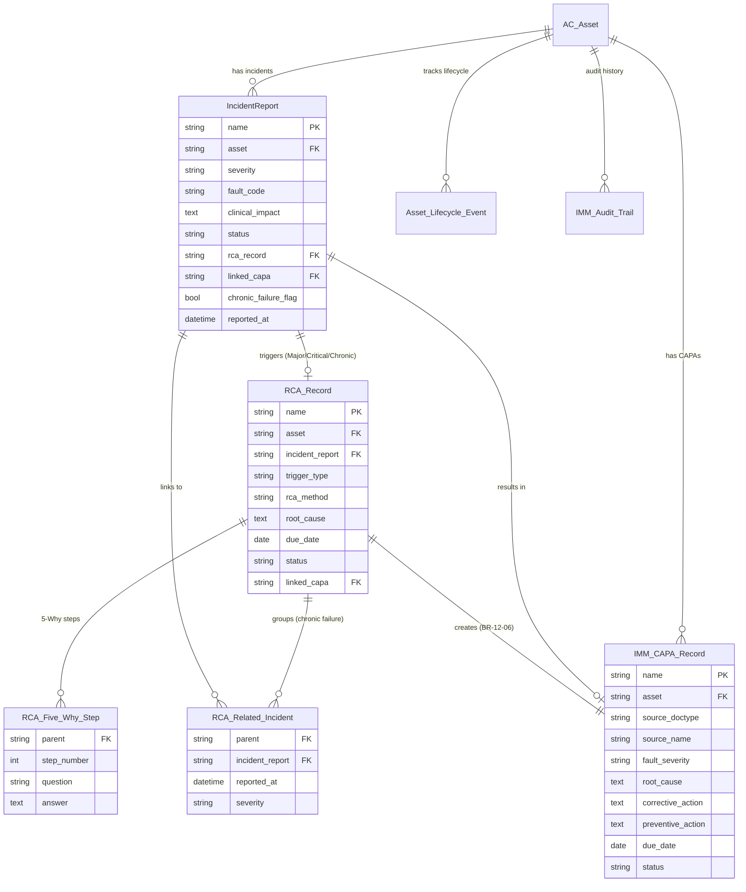
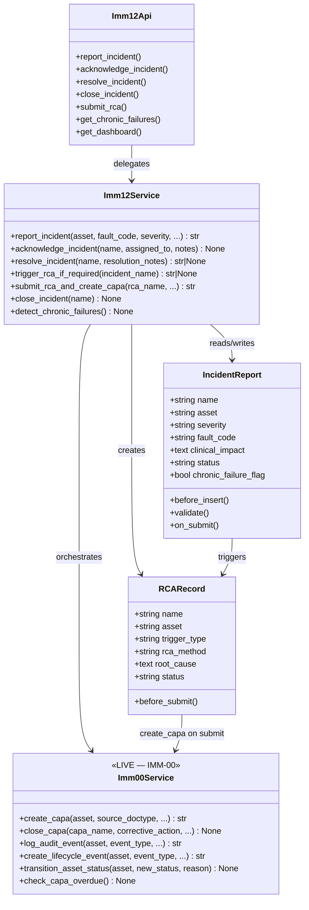
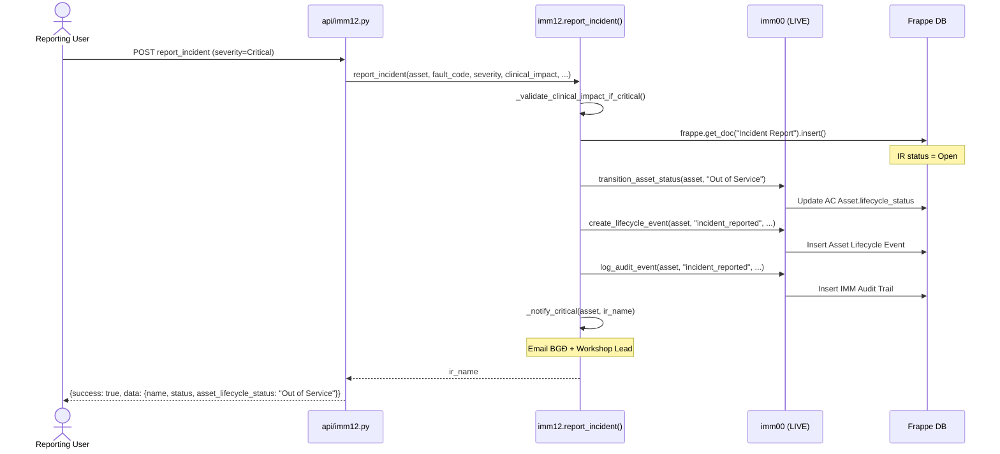
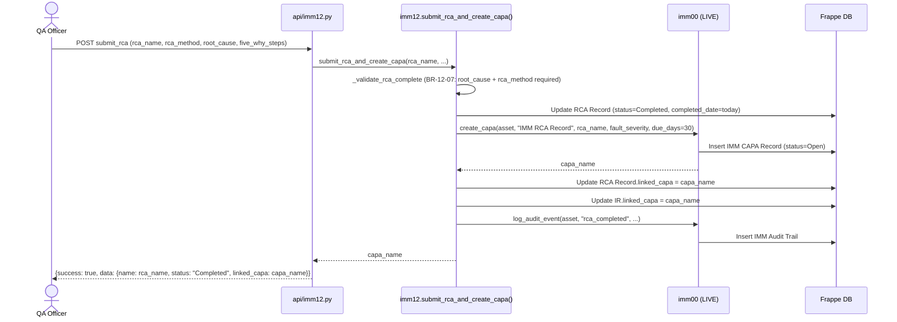
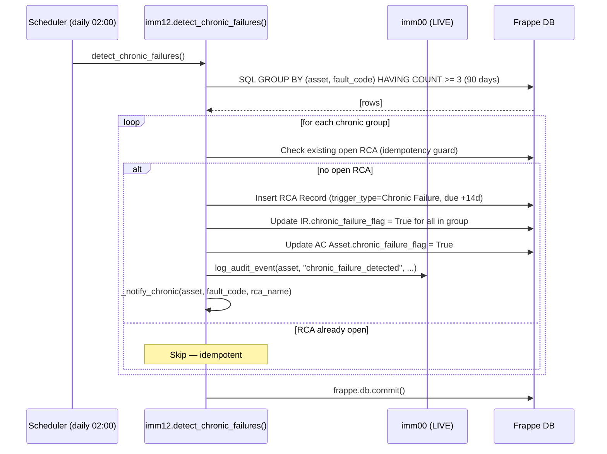
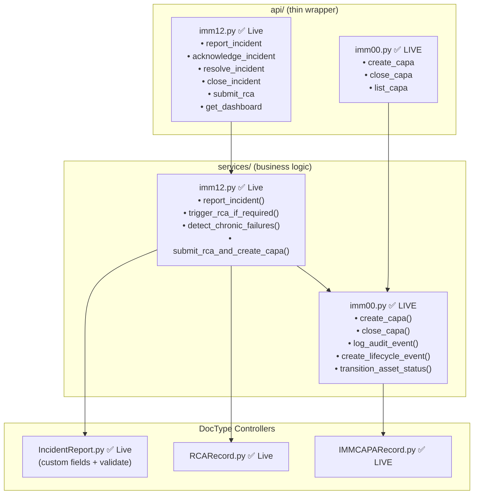
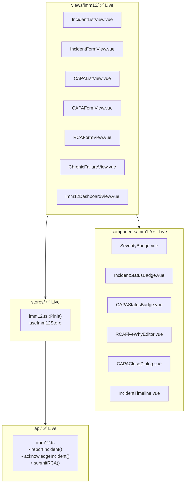

# 03 — Diagrams

| Mục | Giá trị |
|---|---|
| Module | IMM-12 — Incident & CAPA Management |
| Phạm vi | Per-module |
| Owner | BA + Architect |
| Cập nhật | 2026-05-18 |
| Trạng thái | ✅ Live — ERD / class / sequence diagrams khớp DocType + `services/imm12.py` hiện hành |

---

## 1. ERD

---

## 2. Entity Catalog

| Entity | DocType | Trạng thái | Owner |
|---|---|---|---|
| AC Asset | AC Asset | ✅ LIVE (IMM-00) | IMM-00 |
| Incident Report | Incident Report | ✅ LIVE (IMM-00 base) + ⚠️ Custom fields (IMM-12) | IMM-12 |
| IMM CAPA Record | IMM CAPA Record | ✅ LIVE (IMM-00) | IMM-00 |
| Asset Lifecycle Event | Asset Lifecycle Event | ✅ LIVE (IMM-00) | IMM-00 |
| IMM Audit Trail | IMM Audit Trail | ✅ LIVE (IMM-00) | IMM-00 |
| IMM RCA Record | IMM RCA Record (folder `imm_rca_record`) | ✅ Live (IMM-12) | IMM-12 |
| RCA Related Incident | RCA Related Incident | ✅ Live — Child table | IMM-12 |
| RCA Five Why Step | RCA Five Why Step | ✅ Live — Child table | IMM-12 |

---

## 3. Data Dictionary

### 3.1 Incident Report — Custom Fields (✅ Live IMM-12)

> Base fields LIVE từ IMM-00: `asset`, `reported_by`, `reported_at`, `fault_description`, `status`, `resolution_notes`.

| Field | Type | Ràng buộc | Notes |
|---|---|---|---|
| `severity` | Select | Required | Minor / Major / Critical |
| `fault_code` | Data | Optional | Catalog dictionary |
| `clinical_impact` | Text | Required if Critical (BR-12-01) | Tác động lâm sàng |
| `acknowledged_by` | Link User | Set khi Acknowledge | — |
| `acknowledged_at` | Datetime | Auto | — |
| `resolved_by` | Link User | Set khi Resolve | — |
| `resolved_at` | Datetime | Auto | — |
| `closed_by` | Link User | Set khi Close | — |
| `closed_at` | Datetime | Auto | — |
| `repair_wo` | Link Repair Work Order | Optional | IMM-09 link |
| `rca_record` | Link RCA Record | Auto when trigger | — |
| `rca_required` | Check | True if Major/Critical/Chronic | — |
| `linked_capa` | Link IMM CAPA Record | Set after RCA Submit | — |
| `chronic_failure_flag` | Check | True if chronic group | Set by scheduler |
| `assigned_to` | Link User | Technician in charge | — |

### 3.2 RCA Record (✅ Live)

Naming: `RCA-YYYY-NNNNN` · Submittable

| Field | Type | Ràng buộc | Notes |
|---|---|---|---|
| `asset` | Link AC Asset | Required | — |
| `incident_report` | Link Incident Report | Required | Primary source IR |
| `related_incidents` | Table | Optional | Child: RCA Related Incident |
| `fault_code` | Data | Optional | — |
| `trigger_type` | Select | Required | Major Incident / Critical Incident / Chronic Failure / Manual |
| `incident_count` | Int | Optional | Số IR liên quan (90 ngày, Chronic) |
| `rca_method` | Select | Required before Submit (BR-12-07) | 5Why / Fishbone / Other |
| `root_cause` | Text | Required before Submit (BR-12-07) | — |
| `contributing_factors` | Text | Optional | — |
| `five_why_steps` | Table | Optional | Child: RCA Five Why Step |
| `corrective_action_plan` | Text | Optional | Proposed CAPA content |
| `preventive_action_plan` | Text | Optional | Proposed CAPA content |
| `due_date` | Date | Required | +7d (Major/Critical) · +14d (Chronic) |
| `status` | Select | Required | RCA Required / RCA In Progress / Completed / Cancelled |
| `assigned_to` | Link User | Required | — |
| `completed_by` | Link User | Set on Submit | — |
| `completed_date` | Date | Auto | — |
| `linked_capa` | Link IMM CAPA Record | Auto after Submit | BR-12-06 |

### 3.3 IMM CAPA Record — Key Fields (✅ LIVE, IMM-00)

| Field | Type | Notes |
|---|---|---|
| `asset` | Link AC Asset | Required |
| `source_doctype` | Data | "Incident Report" / "RCA Record" |
| `source_name` | Dynamic Link | Reference |
| `fault_severity` | Select | Minor / Major / Critical |
| `root_cause` | Text | Required before Submit (BR-00-08) |
| `corrective_action` | Text | Required before Submit |
| `preventive_action` | Text | Required before Submit |
| `due_date` | Date | `due_days` from create |
| `status` | Select | Open / In Progress / Pending Verification / Closed / Overdue |

---

## 4. Class Diagram

---

## 5. Sequence Diagram — report_incident Critical

---

## 6. Sequence Diagram — submit_rca → CAPA

---

## 7. Sequence Diagram — detect_chronic_failures (Scheduler)

---

## 8. Backend Package Diagram

---

## 9. Frontend Package Diagram

---

## DoD — File 03 hoàn chỉnh

- [x] ERD Mermaid với 8 entities (LIVE + Pending phân biệt rõ)
- [x] Entity catalog (owner + status)
- [x] Data dictionary: IR custom fields + RCA Record + CAPA key fields
- [x] Class diagram (Controller · Service · API layer)
- [x] Sequence diagram: `report_incident` Critical path
- [x] Sequence diagram: `submit_rca` → CAPA creation
- [x] Sequence diagram: `detect_chronic_failures` Scheduler
- [x] Backend package diagram
- [x] Frontend package diagram
- [ ] ⚠️ Reviewed bởi Architect + BA (Pending)
- [ ] ⚠️ Diagrams verified vs code after implementation
