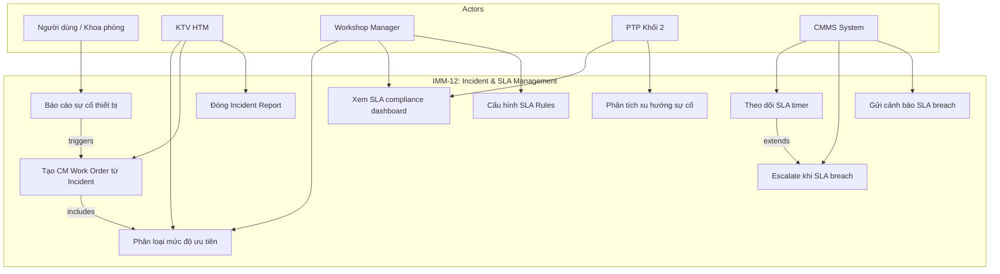
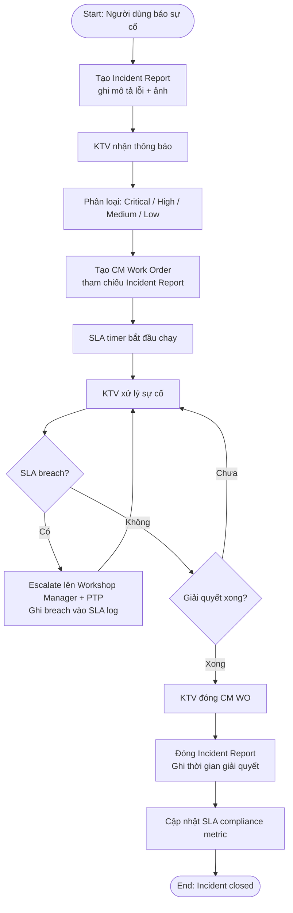
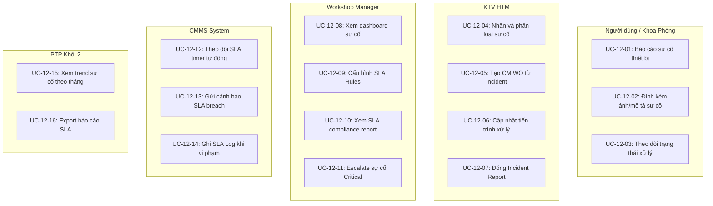
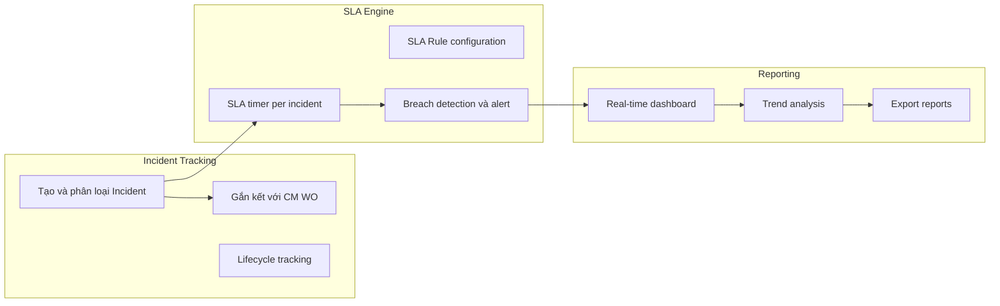

# IMM-12 — Corrective Maintenance & SLA Management
## Functional Specification

**Module:** IMM-12
**Version:** 1.0
**Ngày:** 2026-04-17
**Trạng thái:** Draft — Chờ phê duyệt
**Tác giả:** AssetCore Team

---

## 1. Vị trí trong Asset Lifecycle

```
IMM-04 (Lắp đặt) → IMM-05 (Hồ sơ) → [Asset "Active"]
                                              │
                         ┌────────────────────┼──────────────────────┐
                         │                    │                      │
               IMM-08 (PM)         IMM-11 (Calibration)   IMM-12 (Incident/SLA)
               Phát hiện lỗi?              Lỗi lớn?        Báo cáo sự cố
                    │                         │                      │
                    └──────────────┬──────────┘                      │
                                   ▼                                  │
                         IMM-09 (Asset Repair)  ◄────────────────────┘
                         Corrective WO                Linked Repair WO
                                   │
                    ┌──────────────┴──────────────┐
                    │                             │
               Giải quyết                    Thất bại lặp lại
               thành công                   (chronic failure)
                    │                             │
              [Resolved]                  IMM-12 RCA Record
               Close Incident             (Root Cause Analysis)
```

**Quan hệ ngang:**
- **IMM-08** → PM phát hiện lỗi major → IMM-12 nhận Incident Report để theo dõi SLA
- **IMM-09** → IMM-12 mở Corrective WO (`Asset Repair`) và liên kết `repair_wo` vào Incident Report
- **IMM-11** → Calibration failure có thể khởi tạo Incident P2/P3 nếu thiết bị mất chuẩn đột ngột
- **IMM-05** → cung cấp thông tin hồ sơ thiết bị (risk_class, location, department) để phân loại ưu tiên
- **IMM-12 → RCA Record** → P1/P2 bắt buộc RCA sau khi Resolved; chronic failure tự động kích hoạt RCA

---

## 2. Workflow Chính (BPMN)

```
START: Sự cố thiết bị y tế
  │
  ▼ [Trigger — bất kỳ kênh nào]
  Báo cáo sự cố (form hệ thống / hotline / điện thoại)
  Actor: Reporting User (Nhân viên khoa)
  Output: Incident Report IR-YYYY-##### (status = New)
  │
  ├─── SLA TIMER BẮT ĐẦU (created_at) ─────────────────────────────────────────┐
  │                                                                             │
  ▼ [Step 1]                                                             [SLA TRACK]
  Phân loại ưu tiên & Acknowledge                                         │
  Actor: Workshop Manager / Dispatcher                                    │
  Action: Chọn Priority (P1→P4), xác nhận tiếp nhận                     │
  Deadline: P1=30min / P2=2h / P3=4h / P4=8h từ created_at             │
  Output: IR status = "Acknowledged", response_at = now()               │
  │                                                                      │
  ▼ [Step 2]                                                        SLA State:
  Mở Corrective WO & phân công KTV                                "On Track" / "At Risk"
  Actor: Workshop Manager / Dispatcher                                   │
  Action: Tạo Asset Repair WO (IMM-09), link to IR                     │
  Output: IR status = "In Progress", repair_wo linked                  │
  │                                                                      │
  ▼ [Step 3]                                                             │
  KTV thực hiện sửa chữa (xem IMM-09)                                  │
  Actor: KTV HTM                                                        │
  Action: Thực hiện theo Asset Repair WO                               │
  │                                                                      │
  ▼ [Gateway: Sửa chữa thành công?]                                    │
  │                                                                      │
  ├─── Không ──── Vật tư / chờ dịch vụ ──── [IR vẫn In Progress]     │
  │               KTV cập nhật ghi chú, Workshop escalate nếu cần      │
  │                                                                      │
  └─── Có ──────► [Step 4]                                             │
                  Xác nhận kết quả & Resolved                         │
                  Actor: KTV HTM + Workshop Manager                    │
                  Action: Đóng Asset Repair WO, set IR = Resolved      │
                  Output: resolved_at = now()                    SLA Timer DỪNG
                  │
                  ▼ [Gateway: Yêu cầu RCA?]
                  │
                  ├─── P1 / P2 → BẮT BUỘC RCA
                  │    │
                  │    ▼ [Step 5a]
                  │    Mở RCA Record
                  │    Actor: Workshop Manager / PTP Khối 2
                  │    Deadline: RCA hoàn thành trong 7 ngày
                  │    Status: IR = "RCA Required"
                  │    │
                  │    ▼ [Step 5b]
                  │    Hoàn thành RCA
                  │    Actor: KTV Senior / Workshop Manager
                  │    Action: Điền root cause, corrective action plan
                  │    Status: RCA Record = "Completed"
                  │
                  ├─── P3 / P4 + Chronic (≥3 incidents) → RCA tự động
                  │    (tương tự Step 5a/5b)
                  │
                  └─── P3 / P4 không chronic → [Step 6] trực tiếp
                       │
                       ▼ [Step 6]
                       Close Incident
                       Actor: Workshop Manager / PTP Khối 2
                       Điều kiện: RCA Completed (nếu required) AND
                                  repair_wo.status = "Completed"
                       Output: IR status = "Closed"
  │
  ▼
  END: Incident đóng, audit trail đầy đủ, SLA recorded

═══════════════════════════════════════════════════════════════════
SLA PARALLEL TRACK (chạy song song với workflow chính)
═══════════════════════════════════════════════════════════════════

  created_at ──── 50% SLA time ──── 80% SLA time ──── SLA deadline
      │                │                  │                  │
  On Track          On Track           At Risk           BREACHED
                                       │                     │
                                  Alert KTV/WM          Escalate theo
                                                         Priority Matrix
                                                         + ghi Breach Log

Breach action matrix:
  P1 Breached → BGĐ + BYT notify (immediate)
  P2 Breached → PTP Khối 2 notify
  P3 Breached → Workshop Manager notify
  P4 Breached → KTV HTM notify
```

---

## 3. Actors & Roles

| Actor | Vai trò | Quyền hệ thống | Trách nhiệm chính |
|---|---|---|---|
| Reporting User (Nhân viên khoa) | Người báo cáo | Create Incident Report | Báo cáo sự cố, mô tả triệu chứng, chụp ảnh thiết bị |
| Workshop Manager / Dispatcher | Tiếp nhận & phân loại | Acknowledge IR, Create Repair WO, Close IR | Phân loại ưu tiên trong SLA response, mở WO, theo dõi tiến độ |
| KTV HTM | Thực hiện sửa chữa | Execute Repair WO, Update IR | Thực hiện sửa chữa, cập nhật tiến độ, báo cáo hoàn thành |
| PTP Khối 2 | Giám sát SLA | View SLA Dashboard, Receive Escalation, Close IR | Theo dõi SLA compliance, nhận leo thang P2, duyệt đóng IR |
| BGĐ (Board of Directors) | Nhận thông báo P1 | View P1 Incidents (read-only) | Nhận alert P1 không được Acknowledge trong 30 phút |
| CMMS Scheduler | Tự động hóa | System Process | Kiểm tra SLA 30 phút/lần, phát hiện chronic failure, gửi escalation |
| KTV Senior / QA | Viết RCA | Create, Write RCA Record | Phân tích nguyên nhân gốc, lập kế hoạch hành động khắc phục |

---

## 4. Input / Output

### INPUT

| Đầu vào | Nguồn | Bắt buộc |
|---|---|---|
| Thông tin thiết bị (asset, location, department) | `Asset` DocType / IMM-05 | Bắt buộc |
| Mô tả sự cố (symptom, fault_code) | Reporting User qua form | Bắt buộc |
| Phân loại ưu tiên (P1→P4) | Workshop Manager | Bắt buộc khi Acknowledge |
| Ảnh / video thiết bị | Reporting User | Tuỳ chọn (bắt buộc P1) |
| Thông tin hợp đồng bảo hành (nếu có) | `Contract` DocType | Tuỳ chọn |
| Lịch sử sự cố trước (cùng fault_code trên asset) | `Incident Report` history | Auto (chronic check) |

### OUTPUT

| Đầu ra | DocType / Artifact | Ghi chú |
|---|---|---|
| Incident Report | `Incident Report` (IR-YYYY-#####) | Record chính |
| SLA Breach Log | `SLA Compliance Log` | Immutable, ghi mỗi khi SLA bị vi phạm |
| Asset Repair WO (IMM-09) | `Asset Repair` | Link từ IR |
| RCA Record (nếu P1/P2 hoặc chronic) | `RCA Record` | Tạo auto hoặc thủ công |
| Asset Lifecycle Event | `Asset Lifecycle Event` | Mỗi state transition |
| Notification (email + in-app) | Frappe Notification | Escalation alerts |
| SLA Compliance Report (daily) | Report artifact | PDF/dashboard |

---

## 5. SLA Matrix

| Priority | Điều kiện kích hoạt | Ngưỡng Response | Ngưỡng Resolution | Kênh escalation | Đối tượng escalation |
|---|---|---|---|---|---|
| **P1 Critical** | Thiết bị hỗ trợ sự sống (máy thở, monitor ICU, máy lọc máu, máy mê) bị hỏng hoặc báo alarm quan trọng | **30 phút** | **4 giờ** | Email + SMS + In-app | BGĐ + BYT notify |
| **P2 High** | Thiết bị chẩn đoán quan trọng (siêu âm, nội soi, X-quang, ECG) — không có thiết bị thay thế | **2 giờ** | **8 giờ** | Email + In-app | PTP Khối 2 |
| **P3 Medium** | Thiết bị không quan trọng tức thì — có thể dùng thiết bị khác hoặc hoãn | **4 giờ** | **24 giờ** | Email | Workshop Manager |
| **P4 Low** | Lỗi nhỏ, có workaround, không ảnh hưởng trực tiếp đến chăm sóc bệnh nhân | **8 giờ** | **72 giờ** | In-app | KTV HTM |

**Ghi chú SLA:**
- SLA timer chạy **24/7** cho P1/P2 — không pause theo giờ làm việc
- SLA timer chạy **24/7** cho P3/P4 (thực tế bệnh viện hoạt động liên tục)
- `response_at` = thời điểm IR chuyển sang status "Acknowledged"
- `resolved_at` = thời điểm IR chuyển sang status "Resolved"
- SLA breach không thể bị xóa hoặc sửa sau khi ghi — immutable audit

**Ngưỡng cảnh báo sớm:**
- 80% SLA time → status SLA chuyển "At Risk" → cảnh báo nội bộ
- 100% SLA time → status SLA chuyển "Breached" → ghi breach log + escalate

---

## 6. Business Rules

| Mã | Nội dung Rule | Điều kiện kích hoạt | Hậu quả vi phạm | Kiểm soát kỹ thuật |
|---|---|---|---|---|
| **BR-12-01** | P1 incident phải được Acknowledged trong 30 phút. Nếu không, hệ thống auto-escalate BGĐ + PTP Khối 2 ngay lập tức | IR.priority = P1 AND (now - created_at) > 30 min AND status = "New" | BGĐ nhận alert; Workshop Manager bị ghi lỗi SLA response | Scheduler 30-min check; sla_response_breached = True |
| **BR-12-02** | SLA timer tính từ `created_at`, dừng khi `resolved_at` được set. Không pause theo giờ hành chính — SLA P1/P2 là 24/7 tuyệt đối | Mọi IR khi tạo | Tính sai SLA → báo cáo compliance sai | `sla_response_breached` và `sla_resolution_breached` tính bằng giờ thực tuyệt đối |
| **BR-12-03** | ≥3 incidents cùng `fault_code` trên cùng `asset` trong 90 ngày → tự động mở RCA Record bắt buộc (chronic failure) | Khi IR mới được tạo hoặc Resolved | Mẫu hỏng hóc tái diễn không được phân tích → rủi ro bệnh nhân | Scheduler daily: `detect_chronic_failures()` |
| **BR-12-04** | P1/P2 incidents bắt buộc có RCA sau khi Resolved. Không thể Close IR P1/P2 nếu RCA Record chưa "Completed" | Khi user cố gắng Close IR với priority P1/P2 | IR bị block Close — buộc hoàn thành RCA | `validate` on_status_change: kiểm tra RCA status |
| **BR-12-05** | Mỗi SLA breach phải được ghi vào `SLA Compliance Log` — không thể xóa hoặc sửa sau khi ghi | Khi `sla_response_breached` hoặc `sla_resolution_breached` = True | Mất audit trail → không tuân thủ quy định | Log created with `is_immutable = True`; no delete permission |

---

## 7. Chronic Failure Detection

### 7.1 Định nghĩa Chronic Failure

Một asset được xem là có **chronic failure** khi:

```
COUNT(Incident Report)
  WHERE asset = X
    AND fault_code = Y
    AND created_at >= (today - 90 ngày)
    AND status != "Cancelled"
  >= 3
```

### 7.2 Quy trình phát hiện

```
Daily scheduler (02:00 AM) chạy detect_chronic_failures():

1. Lấy tất cả assets có IR trong 90 ngày qua
2. Group by (asset, fault_code)
3. COUNT incidents cho mỗi nhóm
4. IF count >= 3:
   a. Kiểm tra xem đã có RCA Record open cho (asset, fault_code) chưa
   b. Nếu chưa → auto-create RCA Record với trigger = "Chronic Failure"
   c. Notify Workshop Manager + PTP Khối 2
   d. Gắn cờ `is_chronic = True` trên IR liên quan
5. Nếu count == 3 (vừa đạt ngưỡng lần đầu):
   → Gửi alert đặc biệt "Chronic Failure Detected" kèm danh sách 3 IR
```

### 7.3 RCA tự động cho Chronic Failure

```python
# Khi detect_chronic_failures() xác nhận chronic:
rca = frappe.get_doc({
    "doctype": "RCA Record",
    "asset": asset_name,
    "fault_code": fault_code,
    "trigger_type": "Chronic Failure",
    "incident_count": count,
    "related_incidents": [ir1, ir2, ir3, ...],
    "status": "RCA Required",
    "due_date": add_days(today, 14),  # 14 ngày cho chronic (vs 7 ngày cho P1/P2)
    "assigned_to": workshop_manager,
})
rca.insert(ignore_permissions=True)
```

### 7.4 Ngưỡng leo thang Chronic Failure

| Số incidents / 90 ngày | Hành động |
|---|---|
| 3 | Auto-open RCA Required, notify Workshop Manager + PTP |
| 5 | Escalate PTP Khối 2, xem xét tạm ngừng thiết bị |
| 7+ | Escalate BGĐ, xem xét thay thế thiết bị, ghi vào Risk Register |

---

## 8. Exception Handling

| Tình huống | Điều kiện kích hoạt | Xử lý hệ thống | Xử lý nghiệp vụ |
|---|---|---|---|
| P1 không có KTV sẵn sàng | Không có KTV online khi IR P1 tạo | Alert tất cả KTV, alert PTP + BGĐ ngay lập tức | PTP kích hoạt quy trình on-call, liên hệ nhà thầu khẩn |
| Thiết bị P1 cần linh kiện ngoài kho | Repair WO có spare parts không có sẵn | IR vẫn "In Progress", SLA timer chạy, cảnh báo SLA At Risk | Workshop kích hoạt mua khẩn cấp (emergency procurement) |
| IR được báo sai (false alarm) | Workshop Manager xác nhận không có sự cố thực | IR status = "Cancelled" với lý do; SLA log ghi cancel | Ghi lý do hủy, notify reporting user |
| Asset đã Out of Service trước khi IR tạo | Asset.status = "Out of Service" khi IR mới tạo | Hệ thống warn nhưng cho phép tạo IR (để tracking) | Workshop kiểm tra IR liên quan trước đó |
| RCA deadline quá hạn | RCA Record.due_date < today AND status != Completed | Alert PTP Khối 2 daily cho đến khi complete | PTP escalate, có thể assign người khác viết RCA |
| Incident đúng lúc thiết bị đang PM | IR tạo khi WO PM đang In Progress | IR được link với PM WO, ưu tiên khẩn thay đổi | Workshop đánh giá: PM cần dừng lại để giải quyết IR? |
| Sự cố liên quan đến nhiều assets | Ví dụ mất điện ảnh hưởng nhiều thiết bị | Tạo IR riêng cho từng asset; group bằng incident_group_id | Workshop xử lý theo priority của từng asset |

---

## 9. User Stories (INVEST)

| ID | Story | SP |
|---|---|---|
| US-12-01 | Với tư cách là **Nhân viên khoa phòng**, tôi muốn báo cáo sự cố thiết bị trực tiếp từ điện thoại bằng form đơn giản với ảnh đính kèm, để Workshop nhận được thông tin đầy đủ và phản hồi nhanh nhất có thể. | 5 |
| US-12-02 | Với tư cách là **Workshop Manager**, tôi muốn nhìn thấy tất cả Incident Reports đang mở với countdown SLA màu theo độ cấp thiết (đỏ/cam/vàng/xanh), để ưu tiên xử lý đúng thứ tự và không bỏ sót SLA vi phạm. | 8 |
| US-12-03 | Với tư cách là **PTP Khối 2**, tôi muốn nhận thông báo tự động khi có P2 incident hoặc bất kỳ SLA breach nào, và xem được dashboard SLA compliance theo tháng, để báo cáo BGĐ và đề xuất cải tiến quy trình. | 5 |
| US-12-04 | Với tư cách là **BGĐ Bệnh viện**, tôi muốn nhận thông báo ngay lập tức qua email và SMS khi có P1 incident chưa được Acknowledged sau 30 phút, để đảm bảo bệnh nhân không bị ảnh hưởng bởi sự chậm trễ nghiêm trọng. | 3 |
| US-12-05 | Với tư cách là **KTV Senior**, tôi muốn hoàn thành form RCA đúng chuẩn (5-Why, Fishbone) trực tiếp trong hệ thống với link đến các IR liên quan, để phân tích nguyên nhân gốc đầy đủ và đề xuất hành động khắc phục có truy xuất. | 8 |
| US-12-06 | Với tư cách là **Workshop Manager**, tôi muốn hệ thống tự động phát hiện và cảnh báo khi một thiết bị có ≥3 sự cố cùng loại trong 90 ngày, để chủ động mở RCA thay vì chờ thiết bị hỏng hoàn toàn. | 8 |
| US-12-07 | Với tư cách là **KTV HTM**, tôi muốn xem toàn bộ lịch sử sự cố và kết quả RCA của một thiết bị ngay trong Asset profile, để hiểu lịch sử hỏng hóc trước khi thực hiện sửa chữa. | 3 |

---

## 10. Acceptance Criteria (Gherkin)

```gherkin
Feature: IMM-12 — Incident Reporting và SLA Management

# ─────────────────────────────────────────────────────────────────
Scenario: P1 Incident không được Acknowledge trong 30 phút → Auto-escalate
  Given Có một Asset Repair P1 "Máy thở Drager Evita 800" đang hoạt động
    And Nhân viên khoa ICU báo cáo máy thở báo alarm và ngừng hoạt động lúc 08:00
    And IR-2026-00001 được tạo với priority = P1, status = "New"
  When Scheduler 30-minute check chạy lúc 08:30
    And IR-2026-00001.status vẫn là "New" (chưa Acknowledged)
  Then sla_response_breached = True được set trên IR
    And SLA Compliance Log entry được tạo với breach_type = "Response", priority = P1
    And Email + SMS được gửi đến BGĐ và PTP Khối 2 trong vòng 2 phút
    And Nội dung thông báo có: Tên thiết bị, Khoa phòng, Thời gian báo cáo, Link IR
    And IR.sla_status = "Breached"

# ─────────────────────────────────────────────────────────────────
Scenario: SLA P2 bị vi phạm tại Resolution deadline
  Given IR-2026-00002 với priority = P2, created_at = 06:00
    And IR được Acknowledged lúc 06:45 (trong 2h response SLA — OK)
    And Asset Repair WO được mở, KTV đang làm việc
  When Đồng hồ đạt 14:05 (8h5min sau created_at)
    And IR.status vẫn là "In Progress" (chưa Resolved)
  When Scheduler 30-minute check chạy
  Then sla_resolution_breached = True
    And SLA Compliance Log entry mới được tạo với breach_type = "Resolution", priority = P2
    And Escalation notification gửi PTP Khối 2
    And IR.sla_status = "Breached"
    And Breach log không thể bị xóa hoặc edit bởi bất kỳ user nào

# ─────────────────────────────────────────────────────────────────
Scenario: Chronic Failure Detection → Auto-open RCA
  Given Asset ACC-ASS-2026-00042 "Máy siêu âm GE Vivid" có:
    - IR-2026-00010: fault_code = "PROBE_DISCONNECT", ngày 2026-02-15
    - IR-2026-00031: fault_code = "PROBE_DISCONNECT", ngày 2026-03-20
  When Nhân viên khoa tạo IR-2026-00055: fault_code = "PROBE_DISCONNECT" ngày 2026-04-17
    And Daily scheduler detect_chronic_failures() chạy lúc 02:00
  Then COUNT = 3 incidents cùng fault_code trong 90 ngày → chronic flag
    And RCA Record được tạo tự động với:
      trigger_type = "Chronic Failure"
      asset = ACC-ASS-2026-00042
      fault_code = "PROBE_DISCONNECT"
      status = "RCA Required"
      due_date = 2026-05-01 (14 ngày từ hôm nay)
    And IR-2026-00010, IR-2026-00031, IR-2026-00055 được đánh is_chronic = True
    And Workshop Manager nhận notification "Chronic Failure Detected"

# ─────────────────────────────────────────────────────────────────
Scenario: Block Close P1 Incident khi RCA chưa hoàn thành (BR-12-04)
  Given IR-2026-00001 priority = P1, status = "Resolved"
    And RCA Record liên kết có status = "RCA In Progress" (chưa Completed)
  When Workshop Manager cố gắng chuyển IR sang status "Closed"
  Then Hệ thống throw validation error: "Không thể đóng sự cố P1/P2 khi RCA chưa hoàn thành"
    And IR.status vẫn là "Resolved"
    And RCA Record link được hiển thị rõ trên IR form với trạng thái hiện tại

# ─────────────────────────────────────────────────────────────────
Scenario: SLA P3 hoàn thành đúng hạn — không breach
  Given IR-2026-00060 với priority = P3, created_at = 08:00 ngày 2026-04-17
  When Workshop Manager Acknowledge lúc 10:00 (2h — trong 4h response SLA)
    And KTV sửa xong, Resolved lúc 22:00 cùng ngày (14h — trong 24h resolution SLA)
  Then sla_response_breached = False
    And sla_resolution_breached = False
    And IR.sla_status = "On Track"
    And SLA Compliance Log KHÔNG tạo breach entry
    And Incident được phép Close sau khi đủ điều kiện

# ─────────────────────────────────────────────────────────────────
Scenario: P4 Incident full lifecycle — low priority, workaround exists
  Given Nhân viên báo cáo đèn LED màn hình monitor bị tắt (thiết bị vẫn hoạt động)
    And Workshop Manager phân loại P4
  When KTV được assign trong queue thông thường
    And KTV resolve sau 2 ngày (48h — trong 72h SLA)
  Then IR Closed thành công không cần RCA (P4, không chronic)
    And SLA compliance = True cho IR này
    And Asset Lifecycle Event ghi "incident_resolved" với actor = KTV
```

---

## 11. WHO HTM & QMS Mapping

| Yêu cầu IMM-12 | WHO HTM Reference | ISO 9001:2015 | NĐ98/2021 | Ghi chú |
|---|---|---|---|---|
| Incident reporting system | WHO HTM 2025 §5.3.4 | §8.7 — Control of nonconforming outputs | Điều 38 | Báo cáo sự cố thiết bị y tế bắt buộc |
| SLA tracking & compliance | WHO HTM 2025 §6.2 | §9.1.1 — Monitoring and measurement | Điều 36 | KPI response/resolution time |
| Root Cause Analysis (RCA) bắt buộc P1/P2 | WHO HTM §5.3.4 | §10.2 — Nonconformity and corrective action | Điều 38 | CAPA linked to RCA Record |
| Chronic failure detection | WHO HTM §5.4 | §10.2.1(b) — Eliminate causes | — | Proactive quality management |
| SLA breach immutable log | WHO HTM 2025 §6.4 | §7.5.3 — Control of documented information | Điều 7 | Audit trail không xóa được |
| Escalation governance | WHO HTM §4.2 | §5.3 — Organizational roles | — | Rõ ràng trách nhiệm theo cấp bậc |
| Lifecycle Event cho mỗi action | WHO HTM 2025 §6.4 | §7.5.1 — General documented information | Điều 7 | Traceability đầy đủ |
| RCA completion tracking | WHO HTM §5.4 | §10.2.2 — Retain documented information | — | RCA completion rate là KPI |

---

## Use Case Diagram



---

## Activity Diagram — Incident to CM Resolution



---

## Non-Functional Requirements

| ID | Yêu cầu | Chỉ tiêu | Phương pháp kiểm tra |
|---|---|---|---|
| NFR-12-01 | Incident submission | < 30s từ khi báo đến khi WO tạo | E2E test |
| NFR-12-02 | SLA alert latency | Cảnh báo trong 5 phút khi breach | Timer test |
| NFR-12-03 | Dashboard refresh | Real-time hoặc < 30s delay | Performance test |
| NFR-12-04 | Report export | PDF SLA report trong < 5s | Performance test |
| NFR-12-05 | Mobile reporting | Người dùng báo sự cố trên mobile | Mobile test |

---

## Biểu Đồ Use Case Phân Rã — IMM-12

### Phân rã theo Actor



### Phân rã theo Subsystem



---

## Đặc Tả Use Case — IMM-12

### UC-12-01: Báo cáo sự cố thiết bị

| Thuộc tính | Nội dung |
|---|---|
| **UC ID** | UC-12-01 |
| **Tên** | Người dùng báo cáo sự cố hỏng hóc thiết bị y tế |
| **Actor chính** | Người dùng / Trưởng Khoa Phòng |
| **Actor phụ** | KTV HTM (nhận notification) |
| **Tiền điều kiện** | Người dùng có tài khoản hệ thống; thiết bị đang ở trạng thái Active |
| **Hậu điều kiện** | Incident Report tạo; SLA timer bắt đầu; KTV HTM nhận notification |
| **Luồng chính** | 1. Người dùng vào form Báo cáo sự cố<br>2. Chọn Asset từ danh sách hoặc quét QR/Barcode<br>3. Mô tả triệu chứng lỗi<br>4. Chọn mức độ: Critical / High / Medium / Low<br>5. Đính kèm ảnh (optional)<br>6. Submit → Incident Report tạo<br>7. SLA timer bắt đầu dựa trên priority + SLA Rule<br>8. Notification gửi KTV HTM và Workshop Manager |
| **Luồng thay thế** | 2a. Quét QR không nhận dạng được → nhập manual<br>4a. Priority = Critical → immediate alert Workshop Manager + PTP |
| **Luồng ngoại lệ** | 6a. Asset không có SLA Rule → dùng default SLA |
| **Business Rule** | BR-12-01: SLA timer bắt đầu ngay sau Submit; BR-12-02: Critical incident → notify trong 15 phút |

---

### UC-12-05: Tạo CM WO từ Incident

| Thuộc tính | Nội dung |
|---|---|
| **UC ID** | UC-12-05 |
| **Tên** | Tạo Corrective Maintenance Work Order từ Incident Report |
| **Actor chính** | KTV HTM |
| **Actor phụ** | CMMS System |
| **Tiền điều kiện** | Incident Report ở trạng thái Open; KTV đã nhận và review incident |
| **Hậu điều kiện** | CM WO tạo với incident_report reference; Asset.status = Out of Service (nếu Critical) |
| **Luồng chính** | 1. KTV xem Incident Report<br>2. Đánh giá mức độ ảnh hưởng<br>3. Nhấn "Tạo CM Work Order"<br>4. Hệ thống tạo CM WO với incident_report = Incident này<br>5. Nếu Critical/High: Asset.status = Out of Service<br>6. Gửi notification cho khoa phòng về tình trạng thiết bị<br>7. Incident.status = In Progress |
| **Luồng thay thế** | 2a. Lỗi nhỏ không cần WO → KTV đóng Incident trực tiếp |
| **Luồng ngoại lệ** | 4a. CM WO creation fail → giữ Incident Open, alert Admin |
| **Business Rule** | BR-12-03: CM WO phải reference Incident Report; BR-12-04: Critical → Out of Service bắt buộc |

---

### UC-12-12: Theo dõi SLA timer

| Thuộc tính | Nội dung |
|---|---|
| **UC ID** | UC-12-12 |
| **Tên** | Tự động theo dõi và cảnh báo vi phạm SLA |
| **Actor chính** | CMMS System (Scheduler) |
| **Actor phụ** | Workshop Manager, PTP Khối 2 (nhận alert) |
| **Tiền điều kiện** | Incident Report ở trạng thái Open hoặc In Progress; SLA Rule đã được cấu hình cho priority |
| **Hậu điều kiện** | Nếu breach: SLA Log entry tạo; notification gửi; Incident đánh dấu sla_breached = True |
| **Luồng chính** | 1. Scheduler chạy check_sla_breach() mỗi 15 phút<br>2. Query Incidents Open/In Progress<br>3. Tính elapsed_time = now - reported_at<br>4. So sánh với SLA Rule (response_time / resolution_time)<br>5. Nếu breach: set sla_breached = True<br>6. Tạo SLA Log entry<br>7. Gửi escalation notification theo escalation_role của SLA Rule |
| **Luồng thay thế** | 4a. Incident đã resolved → skip |
| **Luồng ngoại lệ** | 7a. Không có escalation_role → gửi cho Workshop Manager |
| **Business Rule** | BR-12-05: SLA Log immutable; BR-12-06: Breach notification trong 5 phút sau phát hiện |
