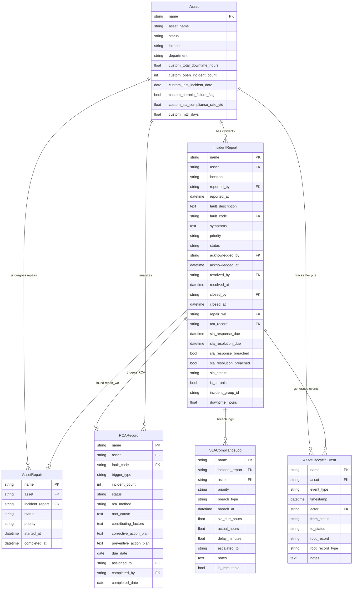
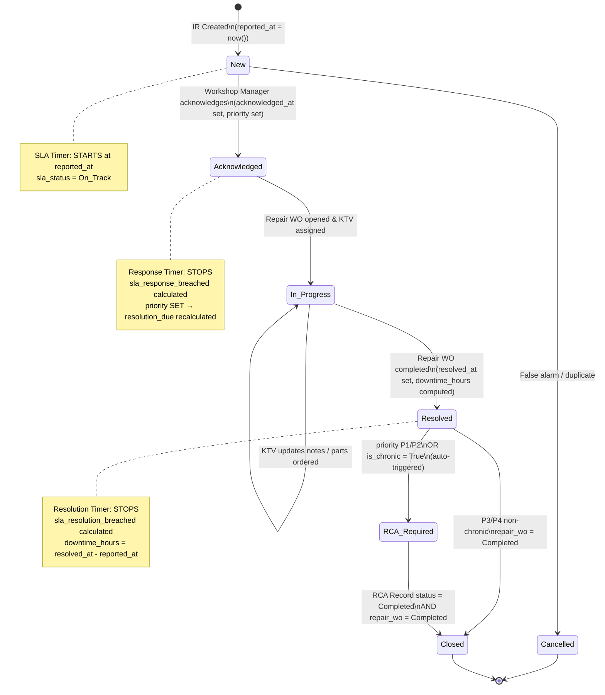
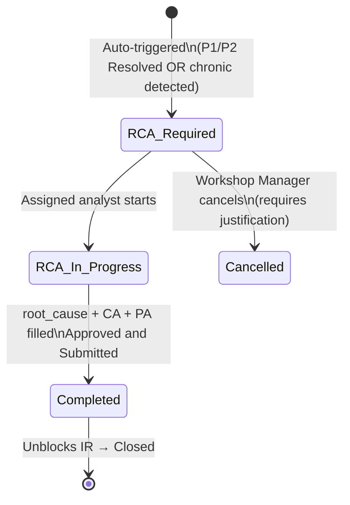

# IMM-12 — Technical Design

## Incident Reporting & SLA Management

**Module:** IMM-12
**Version:** 2.0
**Ngày:** 2026-04-17
**Trạng thái:** Draft — Chưa triển khai (NOT CODED)
**Tác giả:** AssetCore Team

---

## 1. ERD (Entity Relationship Diagram)



---

## 2. Data Dictionary

### 2.1 `Incident Report`

**Mục đích:** Record chính cho mọi sự cố thiết bị — tracking SLA, link sửa chữa, trigger RCA.
**Naming Series:** `IR-YYYY-#####`
**DocType type:** Submittable

| Field | Label | Type | Options / Notes | Bắt buộc |
|---|---|---|---|---|
| `asset` | Thiết bị | Link | Asset | Bắt buộc |
| `asset_name` | Tên thiết bị | Data | Read-only, pull from Asset | Auto |
| `location` | Vị trí | Link | Location (auto-filled from Asset) | Auto |
| `department` | Khoa phòng | Data | Pull from Asset.department | Auto |
| `reported_by` | Người báo cáo | Link | User | Bắt buộc |
| `reported_at` | Thời gian tạo | Datetime | `now()` on creation, read-only | Auto |
| `fault_description` | Mô tả triệu chứng | Text | Nhân viên mô tả chi tiết | Bắt buộc |
| `fault_code` | Mã lỗi | Data | Dùng cho chronic detection | Bắt buộc |
| `symptoms` | Biểu hiện bổ sung | Text | Chi tiết thêm từ người báo | Tuỳ chọn |
| `photo_attachments` | Ảnh / tài liệu | Attach Multiple | Ảnh thiết bị, video lỗi | Tuỳ chọn |
| `priority` | Ưu tiên | Select | P1_Critical / P2_High / P3_Medium / P4_Low | Set khi Acknowledge |
| `status` | Trạng thái | Select | New / Acknowledged / In_Progress / Resolved / Closed / Cancelled | Bắt buộc |
| `acknowledged_by` | Người tiếp nhận | Link | User | Set khi Acknowledge |
| `acknowledged_at` | Thời gian tiếp nhận | Datetime | Set khi status → Acknowledged | Auto |
| `resolved_by` | Người xác nhận giải quyết | Link | User | Set khi Resolved |
| `resolved_at` | Thời gian giải quyết | Datetime | Set khi status → Resolved | Auto |
| `closed_by` | Người đóng | Link | User | Set khi Closed |
| `closed_at` | Thời gian đóng | Datetime | Set khi status → Closed | Auto |
| `repair_wo` | Work Order sửa chữa | Link | Asset Repair (IMM-09) | Tuỳ chọn |
| `rca_record` | RCA Record | Link | RCA Record | Auto khi triggered |
| `rca_required` | Yêu cầu RCA | Check | True nếu P1/P2 hoặc is_chronic | Auto |
| `sla_response_due` | Hạn Response SLA | Datetime | Auto-calculated on create (based on default P3 until priority set) | Auto |
| `sla_resolution_due` | Hạn Resolution SLA | Datetime | Auto-calculated khi priority set | Auto |
| `sla_response_breached` | Response SLA vi phạm | Check | True nếu Acknowledged sau sla_response_due | Computed |
| `sla_resolution_breached` | Resolution SLA vi phạm | Check | True nếu Resolved sau sla_resolution_due | Computed |
| `sla_status` | SLA Status | Select | On_Track / At_Risk / Breached | Computed |
| `is_chronic` | Lỗi mãn tính | Check | True nếu ≥3 cùng fault_code trong 90 ngày | Computed |
| `incident_group_id` | Nhóm sự cố | Data | Dùng khi nhiều assets cùng sự cố (mất điện...) | Tuỳ chọn |
| `downtime_hours` | Thời gian ngừng hoạt động (giờ) | Float | Computed: (resolved_at - reported_at) in hours, 24/7 | Auto |
| `clinical_impact` | Tác động lâm sàng | Text | Bắt buộc với P1 | Bắt buộc khi P1 |
| `resolution_notes` | Ghi chú giải quyết | Text | KTV điền khi Resolved | Khi Resolved |

---

### 2.2 `SLA Compliance Log`

**Mục đích:** Audit trail bất biến cho mọi SLA breach. Không thể xóa hoặc sửa sau khi tạo.
**Naming:** Auto (system-generated)
**DocType type:** Non-submittable, Non-deletable. IS IMMUTABLE.

| Field | Label | Type | Notes |
|---|---|---|---|
| `incident_report` | Incident Report | Link | IR liên quan |
| `asset` | Thiết bị | Link | Asset |
| `priority` | Ưu tiên | Select | P1_Critical / P2_High / P3_Medium / P4_Low |
| `breach_type` | Loại vi phạm | Select | Response / Resolution |
| `breach_at` | Phát hiện vi phạm lúc | Datetime | Thời điểm scheduler phát hiện |
| `sla_due_hours` | Giới hạn SLA (giờ) | Float | Theo priority |
| `actual_hours` | Thực tế (giờ) | Float | Thời gian thực từ reported_at |
| `delay_minutes` | Vượt quá (phút) | Float | (actual_hours - sla_due_hours) * 60 |
| `escalated_to` | Gửi leo thang đến | Data | Danh sách người nhận (comma-separated) |
| `notes` | Ghi chú | Text | Context thêm |
| `is_immutable` | Bất biến | Check | Always True — không cho phép sửa/xóa |

---

### 2.3 `RCA Record`

**Mục đích:** Phân tích nguyên nhân gốc — bắt buộc P1/P2 và chronic failures.
**Naming Series:** `RCA-YYYY-#####`
**DocType type:** Submittable

| Field | Label | Type | Options / Notes | Bắt buộc |
|---|---|---|---|---|
| `asset` | Thiết bị | Link | Asset | Bắt buộc |
| `fault_code` | Mã lỗi | Data | Mã lỗi liên quan | Bắt buộc |
| `trigger_type` | Loại kích hoạt | Select | P1_Incident / P2_Incident / Chronic_Failure | Auto |
| `incident_count` | Số sự cố liên quan | Int | Trong 90 ngày (dùng cho chronic) | Auto |
| `related_incidents` | IR liên quan | Table | Child table: RCA Related Incident | Tuỳ chọn |
| `rca_method` | Phương pháp RCA | Select | 5Why / Fishbone / Other | Bắt buộc khi Submit |
| `root_cause` | Nguyên nhân gốc | Text | Kết luận phân tích | Bắt buộc khi Submit |
| `contributing_factors` | Các yếu tố đóng góp | Text | Fishbone / 5Why steps | Tuỳ chọn |
| `corrective_action_plan` | Kế hoạch khắc phục | Text | Immediate actions đã thực hiện | Bắt buộc khi Submit |
| `preventive_action_plan` | Kế hoạch phòng ngừa | Text | Ngăn tái diễn | Bắt buộc khi Submit |
| `due_date` | Hạn hoàn thành RCA | Date | P1/P2: +7 ngày; Chronic: +14 ngày từ trigger | Auto |
| `status` | Trạng thái | Select | RCA_Required / RCA_In_Progress / Completed / Cancelled | Bắt buộc |
| `assigned_to` | Người phụ trách | Link | User | Bắt buộc |
| `completed_by` | Người hoàn thành | Link | User | Set khi Completed |
| `completed_date` | Ngày hoàn thành | Date | Set khi Submit | Auto |
| `capa_ref` | CAPA Reference | Data | Link đến CAPA nếu có trong QMS | Tuỳ chọn |

---

## 3. SLA Engine Design

### 3.1 SLA Matrix

```python
SLA_MATRIX: dict[str, dict] = {
    "P1_Critical": {
        "response_minutes": 30,
        "resolution_hours": 4,
        "escalation": ["BGD", "PTP"],
        "schedule": "24/7",
    },
    "P2_High": {
        "response_minutes": 120,
        "resolution_hours": 8,
        "escalation": ["PTP"],
        "schedule": "24/7",
    },
    "P3_Medium": {
        "response_minutes": 240,
        "resolution_hours": 24,
        "escalation": ["Workshop_Manager"],
        "schedule": "24/7",
    },
    "P4_Low": {
        "response_minutes": 480,
        "resolution_hours": 72,
        "escalation": ["KTV_HTM"],
        "schedule": "24/7",
    },
}
```

**Ghi chú quan trọng:**

- Tất cả SLA tính theo **24/7 — không pause** theo giờ hành chính (BR-12-02)
- `response_due` = `reported_at` + response_minutes (tính từ lúc tạo IR, không phải lúc priority set)
- `resolution_due` = `reported_at` + resolution_hours
- Ngưỡng cảnh báo sớm: **80% SLA time** → sla_status = "At_Risk"

### 3.2 Deadline Calculation

```python
def calculate_sla_deadlines(priority: str, reported_at: datetime) -> dict:
    """
    Tính toán SLA deadlines dựa trên priority và reported_at.
    Áp dụng 24/7 — không có business hours adjustment.

    Args:
        priority: "P1_Critical" | "P2_High" | "P3_Medium" | "P4_Low"
        reported_at: datetime khi IR được tạo

    Returns:
        dict với sla_response_due và sla_resolution_due
    """
    config = SLA_MATRIX.get(priority)
    if not config:
        frappe.throw(_("Mức độ ưu tiên không hợp lệ: {0}").format(priority))

    response_due = reported_at + timedelta(minutes=config["response_minutes"])
    resolution_due = reported_at + timedelta(hours=config["resolution_hours"])

    return {
        "sla_response_due": response_due,
        "sla_resolution_due": resolution_due,
    }
```

---

## 4. State Machine

### 4.1 Incident Report — Workflow States



### 4.2 SLA Parallel Track

```
IR Timeline (24/7 — không pause):
────────────────────────────────────────────────────────────►
│           │                │              │
reported_at  50% SLA time   80% SLA time   SLA deadline
│           │                │              │
[On_Track]──[On_Track]──────[At_Risk]──────[BREACHED]
                              │              │
                        Alert KTV/WM    Escalation sent
                                        per priority matrix
                                        + SLA Compliance Log created
```

### 4.3 RCA Record — States



---

## 5. Backend Implementation

### 5.1 Service Layer — `services/imm12.py`

```python
def check_sla_breaches() -> None:
    """
    Kiểm tra SLA timer cho tất cả IR đang mở.
    Cập nhật sla_status, ghi SLA Compliance Log khi breach, gửi escalation.
    Chạy mỗi 30 phút — idempotent (không tạo duplicate breach log).

    Actors: System (Scheduler)
    """
    ...


def detect_chronic_failures() -> None:
    """
    Phát hiện chronic failure: ≥3 incidents cùng fault_code trên cùng asset
    trong 90 ngày → auto-open RCA Record.
    BR-12-03: tự động, không cần can thiệp thủ công.
    Chạy hàng ngày lúc 02:00.

    Actors: System (Scheduler)
    """
    ...


def auto_escalate_p1_unacknowledged() -> None:
    """
    Tìm IR P1 chưa Acknowledged sau 30 phút và gửi escalation BGD + PTP.
    Chạy mỗi 30 phút cùng check_sla_breaches.

    Actors: System (Scheduler)
    """
    ...


def create_rca_for_chronic(
    asset_name: str,
    fault_code: str,
    incident_count: int,
    related_ir_names: list[str],
) -> str:
    """
    Tạo RCA Record tự động cho chronic failure.
    due_date = today + 14 ngày.
    Gắn is_chronic = True trên tất cả IR liên quan.

    Returns: tên RCA Record mới tạo
    """
    ...


def calculate_sla_deadlines(priority: str, reported_at: datetime) -> dict:
    """
    Tính sla_response_due và sla_resolution_due theo SLA_MATRIX.
    Áp dụng 24/7 — không pause theo giờ hành chính (BR-12-02).

    Returns: {"sla_response_due": datetime, "sla_resolution_due": datetime}
    """
    ...


def trigger_rca_if_required(incident_report: str) -> str | None:
    """
    Gọi khi IR chuyển sang Resolved.
    Kiểm tra P1/P2 hoặc is_chronic → tạo RCA Record nếu cần.

    Returns: tên RCA Record nếu tạo mới, None nếu không cần.
    """
    ...


def update_asset_downtime(incident_report: str) -> None:
    """
    Cập nhật Asset.custom_total_downtime_hours += downtime_hours.
    Gọi khi IR chuyển sang Resolved.
    """
    ...
```

### 5.2 Controller Hooks — `doctype/incident_report/incident_report.py`

```python
class IncidentReport(Document):
    def before_insert(self) -> None:
        """
        Set reported_at = now() nếu chưa có.
        Pull location và department từ Asset.
        """
        ...

    def validate(self) -> None:
        """
        BR-12-04: Block Close nếu P1/P2 và RCA chưa Completed.
        BR-12-01: Block Close nếu repair_wo chưa Completed.
        Validate P1 bắt buộc có clinical_impact.
        Validate timestamp thứ tự hợp lệ: reported_at < acknowledged_at < resolved_at.
        """
        ...

    def on_update(self) -> None:
        """
        Khi priority được set: gọi calculate_sla_deadlines(), cập nhật sla_response_due và sla_resolution_due.
        Khi status thay đổi:
          → Acknowledged: set acknowledged_at = now(), tính sla_response_breached
          → Resolved: set resolved_at = now(), tính downtime_hours, tính sla_resolution_breached,
                      gọi trigger_rca_if_required(), gọi update_asset_downtime()
          → Closed: set closed_at = now()
        Mọi state change: gọi create_ir_lifecycle_event()
        """
        ...

    def on_submit(self) -> None:
        """
        Tạo Asset Lifecycle Event "incident_reported".
        """
        ...
```

### 5.3 Frappe Hooks — `hooks.py`

```python
scheduler_events = {
    "cron": {
        "*/30 * * * *": [
            "assetcore.services.imm12.check_sla_breaches",
            "assetcore.services.imm12.auto_escalate_p1_unacknowledged",
        ],
        "0 2 * * *": [
            "assetcore.services.imm12.detect_chronic_failures",
        ],
        "0 7 * * *": [
            "assetcore.services.imm12.generate_sla_daily_report",
        ],
    }
}
```

---

## 6. Chronic Failure Detection Algorithm

```python
def detect_chronic_failures() -> None:
    """
    Daily scheduler lúc 02:00. Phát hiện mẫu hỏng hóc tái diễn.
    Ngưỡng: ≥3 incidents cùng fault_code trên cùng asset trong 90 ngày.
    """
    cutoff = frappe.utils.add_days(frappe.utils.nowdate(), -90)

    # Nhóm theo (asset, fault_code) — chỉ tính IR chưa bị huỷ
    results = frappe.db.sql("""
        SELECT
            asset,
            fault_code,
            COUNT(*) AS incident_count,
            GROUP_CONCAT(name ORDER BY reported_at) AS ir_names
        FROM `tabIncident Report`
        WHERE
            reported_at >= %(cutoff)s
            AND status NOT IN ('Cancelled', 'Closed')
            AND fault_code IS NOT NULL
        GROUP BY asset, fault_code
        HAVING COUNT(*) >= 3
    """, {"cutoff": cutoff}, as_dict=True)

    for row in results:
        # Idempotent: không tạo RCA thứ hai nếu đã có RCA open
        existing = frappe.db.exists("RCA Record", {
            "asset": row.asset,
            "fault_code": row.fault_code,
            "status": ("in", ["RCA_Required", "RCA_In_Progress"]),
        })
        if existing:
            continue

        ir_list = [ir.strip() for ir in (row.ir_names or "").split(",")]
        rca_name = create_rca_for_chronic(
            asset_name=row.asset,
            fault_code=row.fault_code,
            incident_count=row.incident_count,
            related_ir_names=ir_list,
        )

        # Thang leo thang bổ sung theo số lần tái diễn
        if row.incident_count >= 7:
            _notify_chronic_escalate_bgd(row.asset, row.fault_code, rca_name)
        elif row.incident_count >= 5:
            _notify_chronic_escalate_ptp(row.asset, row.fault_code, rca_name)

    frappe.db.commit()
```

**Ngưỡng leo thang chronic failure:**

| Số incidents / 90 ngày | Hành động |
|---|---|
| 3 | Auto-open RCA Required, notify Workshop Manager + PTP |
| 5 | Escalate PTP Khối 2, cân nhắc tạm ngừng thiết bị |
| 7+ | Escalate BGĐ, xem xét thay thế thiết bị, ghi vào Risk Register |

---

## 7. Downtime Tracking

### 7.1 Quy tắc tính downtime

```text
downtime_hours = (resolved_at - reported_at).total_seconds() / 3600
```

- Tính theo **24/7 thực tế** — không trừ giờ ngoài hành chính
- Set khi IR chuyển sang **Resolved**
- Bao gồm cả thời gian chờ linh kiện, chờ KTV

### 7.2 Cập nhật lên Asset

```python
def update_asset_downtime(incident_report: str) -> None:
    """
    Cộng dồn downtime vào Asset.custom_total_downtime_hours.
    Cập nhật custom_last_incident_date.
    Gọi sau khi downtime_hours đã được tính trên IR.
    """
    ir = frappe.get_doc("Incident Report", incident_report)
    if not ir.downtime_hours:
        return

    current = frappe.db.get_value(
        "Asset", ir.asset, "custom_total_downtime_hours"
    ) or 0.0

    frappe.db.set_value("Asset", ir.asset, {
        "custom_total_downtime_hours": round(current + ir.downtime_hours, 2),
        "custom_last_incident_date": frappe.utils.nowdate(),
    })
```

---

## 8. Validation Rules

| Code | Rule | Điều kiện | Thông báo lỗi (VI) | Khi nào kiểm tra |
|---|---|---|---|---|
| VR-12-01 | Asset tồn tại và đang Active | `asset` không tồn tại hoặc status = "Scrapped" | "Thiết bị không tồn tại hoặc đã thanh lý" | before_insert |
| VR-12-02 | P1 bắt buộc clinical_impact | priority = P1_Critical AND clinical_impact trống | "Sự cố P1 bắt buộc mô tả tác động lâm sàng đến bệnh nhân" | validate |
| VR-12-03 | Block Close nếu RCA chưa hoàn thành | status → Closed AND rca_required = True AND rca_record.status != Completed | "Không thể đóng sự cố P1/P2 khi RCA chưa hoàn thành. Vui lòng hoàn thành RCA trước" | validate |
| VR-12-04 | Block Close nếu repair_wo chưa xong | status → Closed AND repair_wo AND repair_wo.status != Completed | "Không thể đóng sự cố khi Work Order sửa chữa chưa hoàn thành" | validate |
| VR-12-05 | Thứ tự timestamp hợp lệ | acknowledged_at < resolved_at < closed_at | "Thời gian giải quyết không thể trước thời gian tiếp nhận" | validate |
| VR-12-06 | Priority bắt buộc khi Acknowledge | status → Acknowledged AND priority trống | "Phải chọn mức độ ưu tiên trước khi tiếp nhận sự cố" | on_update |

---

## 9. Integration Points

### 9.1 IMM-12 → IMM-09 (Asset Repair / CM)

- Khi IR chuyển sang **Acknowledged**: Workshop Manager tạo Corrective Maintenance WO (Asset Repair)
- `Asset Repair.incident_report` = tên IR
- IR.repair_wo = tên WO
- Khi WO Completed: IR.status → Resolved (hoặc Workshop Manager manual)
- P1/P2: Asset.status → "Out_of_Service" khi WO opened

### 9.2 IMM-08 → IMM-12

- PM Work Order phát hiện lỗi major → tự động tạo IR P2
- PM WO link vào IR.incident_group_id nếu cùng sự cố

### 9.3 IMM-11 → IMM-12

- Calibration failure với clinical impact → tạo IR P2 tự động
- IR gắn link calibration session vào `incident_group_id`

### 9.4 IMM-12 → Asset (trực tiếp)

| Hành động | Field Asset được cập nhật |
|---|---|
| IR P1/P2 Acknowledged | `status` → Out_of_Service |
| IR Resolved | `custom_total_downtime_hours` += downtime_hours; `custom_last_incident_date` = today |
| IR Closed | `custom_open_incident_count` -= 1 |
| Chronic detected | `custom_chronic_failure_flag` = True |

---

## 10. Exception Catalog

| Code | Exception | Khi nào xảy ra | HTTP Status | Message (VI) |
|---|---|---|---|---|
| `IR-001` | `IncidentAssetNotFound` | asset không tồn tại khi tạo IR | 400 | "Thiết bị không tồn tại trong hệ thống" |
| `IR-002` | `InvalidPriority` | priority không thuộc P1-P4 | 400 | "Mức độ ưu tiên không hợp lệ. Chọn P1, P2, P3 hoặc P4" |
| `IR-003` | `AlreadyAcknowledged` | Acknowledge IR đã Acknowledged | 409 | "Sự cố này đã được tiếp nhận trước đó" |
| `IR-004` | `CannotCloseWithoutRCA` | Close P1/P2 IR khi RCA chưa Completed | 422 | "Không thể đóng sự cố P1/P2 khi RCA chưa hoàn thành. Vui lòng hoàn thành RCA trước" |
| `IR-005` | `RepairWONotCompleted` | Close IR khi repair_wo chưa Completed | 422 | "Không thể đóng sự cố khi Work Order sửa chữa chưa hoàn thành" |
| `IR-006` | `P1ClinicalImpactMissing` | Tạo hoặc Submit IR P1 không có clinical_impact | 400 | "Sự cố P1 bắt buộc phải mô tả tác động lâm sàng đến bệnh nhân" |
| `IR-007` | `PriorityMissingOnAcknowledge` | Acknowledge IR mà không chọn priority | 400 | "Phải chọn mức độ ưu tiên trước khi tiếp nhận sự cố" |
| `IR-008` | `InvalidTimestampOrder` | resolved_at < acknowledged_at | 422 | "Thời gian giải quyết không thể trước thời gian tiếp nhận" |
| `RCA-001` | `RCAAlreadyExists` | Tạo RCA cho IR đã có RCA đang mở | 409 | "Đã có RCA đang mở cho sự cố này" |
| `RCA-002` | `RCAIncompleteSubmit` | Submit RCA thiếu root_cause hoặc corrective_action_plan | 400 | "Phân tích RCA chưa đầy đủ. Cần điền nguyên nhân gốc và kế hoạch khắc phục" |
| `SLA-001` | `SLALogImmutable` | Cố gắng xóa hoặc sửa SLA Compliance Log | 403 | "Nhật ký SLA là bất biến và không thể thay đổi theo quy định audit trail" |
| `SLA-002` | `InvalidResolutionBeforeAcknowledge` | resolved_at < acknowledged_at | 422 | "Thời gian giải quyết không thể trước thời gian tiếp nhận" |
| `SLA-003` | `FutureTimestamp` | reported_at hoặc acknowledged_at trong tương lai | 400 | "Thời gian không hợp lệ — không thể đặt thời gian trong tương lai" |
