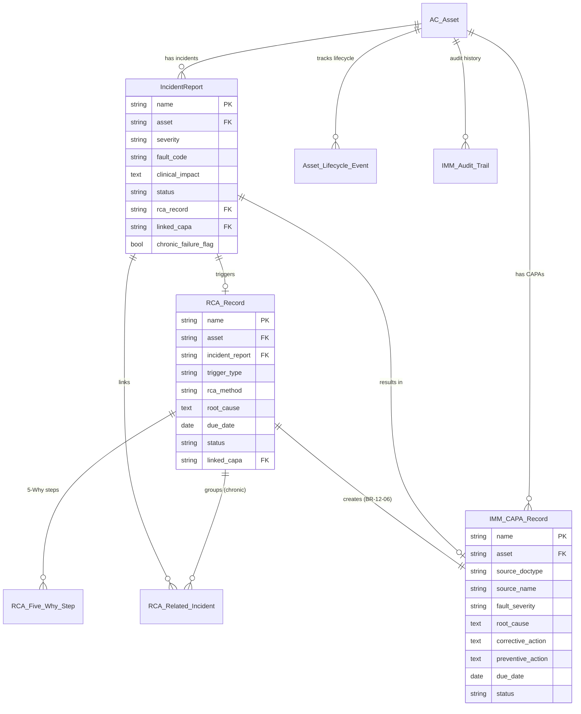
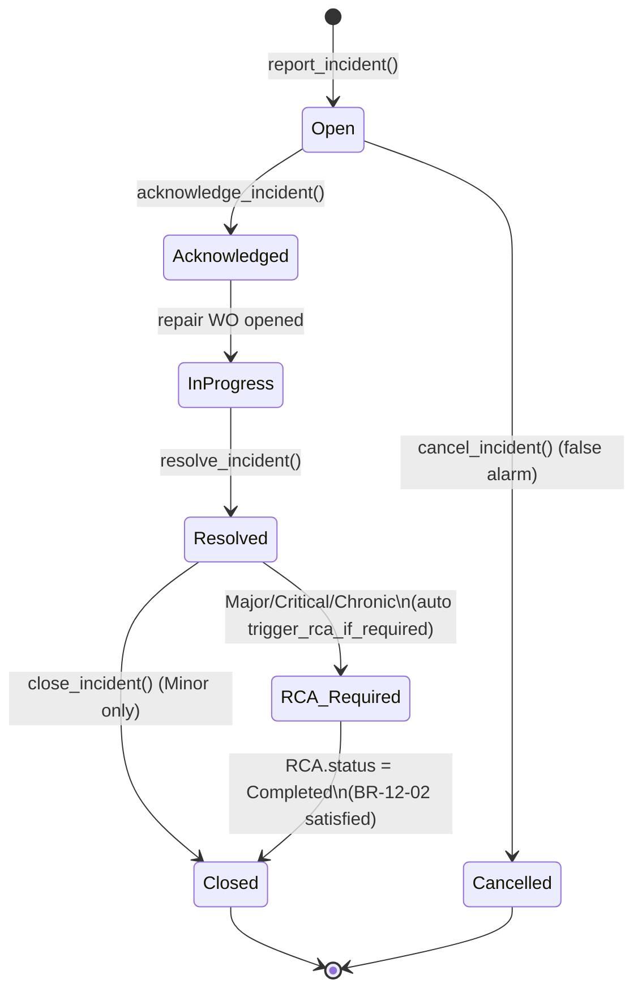
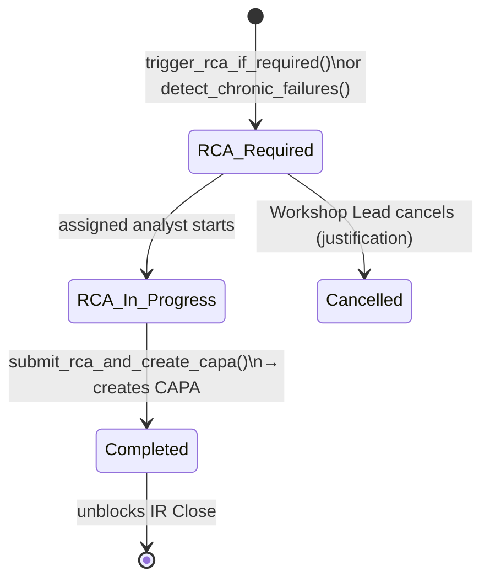
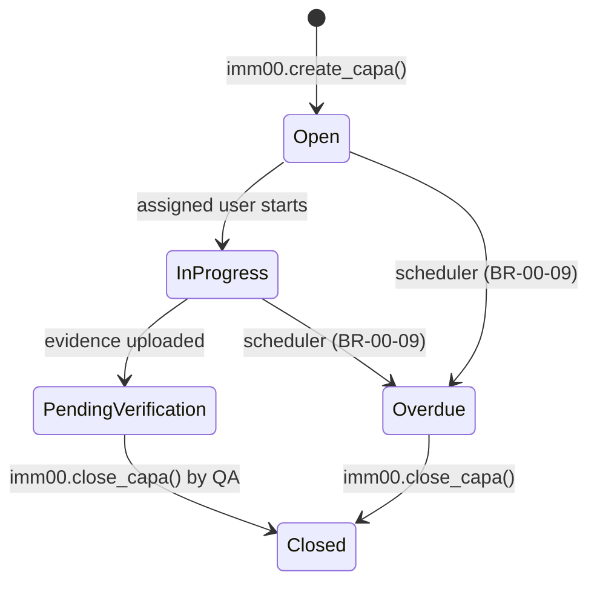

# IMM-12 — Technical Design

| Thuộc tính | Giá trị |
|---|---|
| Module | IMM-12 — Incident & CAPA Management |
| Phiên bản | 1.0.0 |
| Ngày cập nhật | 2026-04-18 |
| Trạng thái | **DRAFT** — chỉ có CAPA DocType từ IMM-00, code IMM-12 chưa implement |
| Tác giả | AssetCore Team |

---

## 1. Kiến trúc tổng thể

```text
┌─────────────────────────────────────────────────────────────────┐
│                       Frontend (Vue 3)                          │
│   IncidentList · IncidentForm · CAPAList · CAPAForm · RCAForm   │
│   Dashboard          (⚠️ Mockup only — chưa build)              │
└──────────────────────────────┬──────────────────────────────────┘
                               │ REST (whitelisted)
                               ▼
┌─────────────────────────────────────────────────────────────────┐
│              api/imm12.py (⚠️ Pending)                          │
│   report_incident · acknowledge_incident · resolve_incident     │
│   close_incident · cancel_incident                              │
│   create_rca · submit_rca · get_chronic_failures                │
└──────────────────────────────┬──────────────────────────────────┘
                               │ thin wrapper (no logic)
                               ▼
┌─────────────────────────────────────────────────────────────────┐
│              services/imm12.py (⚠️ Pending)                     │
│   report_incident()       — orchestrate IMM-00 services         │
│   trigger_rca_if_required()                                     │
│   detect_chronic_failures() — scheduler daily                   │
│   submit_rca_and_create_capa()                                  │
└──────────────────────────────┬──────────────────────────────────┘
                               │ delegate ALL CAPA + audit + lifecycle
                               ▼
┌─────────────────────────────────────────────────────────────────┐
│              services/imm00.py (✅ LIVE)                         │
│   create_capa() · close_capa() · log_audit_event()              │
│   create_lifecycle_event() · transition_asset_status()    │
│   transition_asset_status() · check_capa_overdue() (sched)      │
└─────────────────────────────────────────────────────────────────┘
                               │
                               ▼
┌─────────────────────────────────────────────────────────────────┐
│                   Frappe Framework v15                          │
│   IMM CAPA Record · Incident Report · Asset Lifecycle Event     │
│   IMM Audit Trail · AC Asset                  (✅ all LIVE)      │
└─────────────────────────────────────────────────────────────────┘
```

---

## 2. Data Dictionary

### 2.1 IMM CAPA Record (✅ LIVE — IMM-00)

Naming: `CAPA-.YYYY.-.#####` · Submittable

| Field | Label | Type | Notes |
|---|---|---|---|
| `name` | Tên | autoname | `CAPA-YYYY-NNNNN` |
| `asset` | Thiết bị | Link AC Asset | Bắt buộc |
| `source_doctype` | Source DocType | Data | "Incident Report" / "RCA Record" / "Repair Work Order" |
| `source_name` | Source Record | Dynamic Link | Reference vào source |
| `fault_severity` | Mức độ | Select | Minor / Major / Critical |
| `root_cause` | Nguyên nhân gốc | Text | Bắt buộc trước Submit (BR-00-08) |
| `corrective_action` | Hành động khắc phục | Text | Bắt buộc trước Submit (BR-00-08) |
| `preventive_action` | Hành động phòng ngừa | Text | Bắt buộc trước Submit (BR-00-08) |
| `responsible` | Người phụ trách | Link User | Set khi create |
| `due_date` | Hạn hoàn thành | Date | due_days từ create |
| `status` | Trạng thái | Select | Open / In Progress / Pending Verification / Closed / Overdue |
| `closed_date` | Ngày đóng | Date | Set khi close_capa() |
| `evidence_attachments` | Bằng chứng | Attach Multiple | PDF, ảnh |
| `assigned_to` | Người được giao | Link User | — |

### 2.2 Incident Report (✅ LIVE — IMM-00) + Custom Fields (⚠️ Pending IMM-12)

Naming: `IR-.YYYY.-.####` · Submittable

| Field (LIVE) | Type | Notes |
|---|---|---|
| `asset` | Link AC Asset | Bắt buộc |
| `reported_by` | Link User | Auto = session.user |
| `reported_at` | Datetime | now() on insert |
| `fault_description` | Text | Bắt buộc |
| `status` | Select | Open / Acknowledged / In Progress / Resolved / Closed / Cancelled |
| `resolution_notes` | Text | Khi Resolved |

| Field bổ sung (⚠️ Pending — IMM-12 extension) | Type | Notes |
|---|---|---|
| `severity` | Select | Minor / Major / Critical |
| `fault_code` | Data | Catalog dictionary |
| `clinical_impact` | Text | Bắt buộc khi Critical (BR-12-01) |
| `acknowledged_by` | Link User | Set khi Acknowledge |
| `acknowledged_at` | Datetime | Auto |
| `resolved_by` | Link User | Set khi Resolve |
| `resolved_at` | Datetime | Auto |
| `closed_by` | Link User | Set khi Close |
| `closed_at` | Datetime | Auto |
| `repair_wo` | Link Repair Work Order | IMM-09 link |
| `rca_record` | Link RCA Record | Auto khi trigger |
| `rca_required` | Check | True nếu Major/Critical/Chronic |
| `linked_capa` | Link IMM CAPA Record | Set sau RCA Submit |
| `chronic_failure_flag` | Check | True nếu thuộc chronic group |
| `assigned_to` | Link User | KTV phụ trách |

### 2.3 RCA Record (⚠️ Pending — IMM-12)

Naming: `RCA-.YYYY.-.#####` · Submittable

| Field | Type | Notes |
|---|---|---|
| `asset` | Link AC Asset | Bắt buộc |
| `incident_report` | Link Incident Report | Source IR (single) |
| `related_incidents` | Table | Child: RCA Related Incident (multi for chronic) |
| `fault_code` | Data | — |
| `trigger_type` | Select | Major Incident / Critical Incident / Chronic Failure / Manual |
| `incident_count` | Int | Số IR liên quan (90 ngày) |
| `rca_method` | Select | 5Why / Fishbone / Other (BR-12-07) |
| `root_cause` | Text | Bắt buộc trước Submit (BR-12-07) |
| `contributing_factors` | Text | Tuỳ chọn |
| `five_why_steps` | Table | Child: RCA Five Why Step (when method = 5Why) |
| `corrective_action_plan` | Text | Đề xuất CAPA |
| `preventive_action_plan` | Text | Đề xuất CAPA |
| `due_date` | Date | Major: +7d / Critical: +7d / Chronic: +14d |
| `status` | Select | RCA Required / RCA In Progress / Completed / Cancelled |
| `assigned_to` | Link User | Bắt buộc |
| `completed_by` | Link User | Set khi Submit |
| `completed_date` | Date | Auto |
| `linked_capa` | Link IMM CAPA Record | Auto sau Submit (BR-12-06) |

### 2.4 RCA Related Incident (⚠️ Pending — Child)

| Field | Type | Notes |
|---|---|---|
| `incident_report` | Link Incident Report | — |
| `reported_at` | Datetime | Read-only fetch |
| `severity` | Data | Read-only fetch |

### 2.5 RCA Five Why Step (⚠️ Pending — Child)

| Field | Type | Notes |
|---|---|---|
| `step_number` | Int | 1..5 |
| `question` | Data | "Tại sao..." |
| `answer` | Text | Trả lời |

---

## 3. Service Layer Design

### 3.1 services/imm00.py functions sử dụng (✅ LIVE)

```python
# Already implemented in IMM-00 — IMM-12 calls these
def create_capa(asset: str, source_doctype: str, source_name: str,
                fault_severity: str, due_days: int = 30,
                responsible: str | None = None) -> str: ...

def close_capa(capa_name: str, corrective_action: str,
               preventive_action: str, evidence: list[str] | None = None) -> None: ...

def log_audit_event(asset: str, event_type: str, actor: str,
                    ref_doctype: str, ref_name: str,
                    change_summary: str, from_status: str | None = None,
                    to_status: str | None = None) -> str: ...

def create_lifecycle_event(asset: str, event_type: str, actor: str,
                           from_status: str | None, to_status: str | None,
                           root_doctype: str, root_record: str,
                           notes: str = "") -> str: ...

def transition_asset_status(asset: str, new_status: str,
                                  reason: str) -> None: ...

def check_capa_overdue() -> None:  # scheduler daily
    """BR-00-09: CAPA quá due_date → Overdue + email QA."""
```

### 3.2 services/imm12.py — wrapper / orchestration (⚠️ Pending)

```python
# File: assetcore/services/imm12.py

from assetcore.services import imm00


def report_incident(
    asset: str,
    fault_code: str,
    fault_description: str,
    severity: str,                  # "Minor" | "Major" | "Critical"
    clinical_impact: str = "",
    workaround_applied: bool = False,
    attachments: list[str] | None = None,
) -> str:
    """
    Tạo Incident Report mới và orchestrate side-effects qua IMM-00:
      - Validate (BR-12-01: Critical → clinical_impact bắt buộc)
      - Insert Incident Report (status = Open)
      - Nếu severity = Critical → imm00.transition_asset_status(asset, "Out of Service")
      - imm00.create_lifecycle_event(asset, "incident_reported", ...)
      - imm00.log_audit_event(asset, "incident_reported", ...)
      - Notification email (Critical → BGĐ + Workshop Lead)

    Returns:
        Tên Incident Report mới (vd "IR-2026-0042").
    Raises:
        frappe.ValidationError: nếu BR-12-01 vi phạm.
    """
    ...


def acknowledge_incident(name: str, assigned_to: str, notes: str = "") -> None:
    """Set status = Acknowledged, acknowledged_by/at, log audit."""
    ...


def resolve_incident(name: str, resolution_notes: str) -> str | None:
    """
    Set status = Resolved.
    Gọi trigger_rca_if_required() → return RCA name nếu tạo mới, None nếu không.
    Log audit + lifecycle event.
    """
    ...


def trigger_rca_if_required(incident_name: str) -> str | None:
    """
    Major/Critical/chronic → tạo RCA Record (status = "RCA Required").
    due_date = today + 7 (Major/Critical) hoặc + 14 (Chronic).
    Set IR.rca_record + IR.rca_required = True + IR.status = "RCA Required".

    Returns: tên RCA Record mới hoặc None.
    """
    ...


def submit_rca_and_create_capa(
    rca_name: str,
    rca_method: str,
    root_cause: str,
    contributing_factors: str = "",
    five_why_steps: list[dict] | None = None,
    corrective_action_plan: str = "",
    preventive_action_plan: str = "",
) -> str:
    """
    Submit RCA Record → orchestrate:
      - Validate BR-12-07 (root_cause + rca_method bắt buộc)
      - Set RCA.status = "Completed", completed_date = today
      - Gọi imm00.create_capa(
            asset = rca.asset,
            source_doctype = "RCA Record",
            source_name = rca_name,
            fault_severity = _map_severity(rca.trigger_type),
            due_days = 30
        ) — CAPA inherits root_cause/CA/PA từ RCA
      - Update IR.linked_capa
      - imm00.log_audit_event(...)

    Returns: tên CAPA mới tạo.
    """
    ...


def close_incident(name: str) -> None:
    """
    Validate BR-12-02: Major/Critical → RCA.status = Completed bắt buộc.
    Validate VR-12-04: Critical → linked_capa.status = Closed bắt buộc.
    Set status = Closed, closed_by/at.
    Log audit.
    """
    ...


def detect_chronic_failures() -> None:
    """
    Scheduler daily 02:00.
    BR-12-03: GROUP BY (asset, fault_code) trong 90 ngày, HAVING COUNT >= 3
    → tạo RCA Record (trigger_type = "Chronic Failure", due_date = today + 14)
    → set IR.chronic_failure_flag = True cho mọi IR liên quan
    → set Asset.chronic_failure_flag = True
    → email Workshop Lead + QA Officer
    Idempotent: skip nếu đã có RCA Open cho (asset, fault_code).
    """
    ...
```

### 3.3 Hook scheduler — `hooks.py`

```python
scheduler_events = {
    # ... (existing IMM-00 jobs preserved)
    "cron": {
        "0 2 * * *": [
            # IMM-00 daily jobs (LIVE)
            "assetcore.services.imm00.check_capa_overdue",
            # IMM-12 daily job (Pending)
            "assetcore.services.imm12.detect_chronic_failures",
        ],
    },
}
```

---

## 4. ERD



---

## 5. State Machines

### 5.1 Incident Report



### 5.2 RCA Record



### 5.3 CAPA (kế thừa IMM-00)



---

## 6. API Layer Design

### 6.1 Map endpoint → service

| API Endpoint | File | Service Function | Logic owner |
|---|---|---|---|
| `imm12.report_incident` | `api/imm12.py` (Pending) | `imm12.report_incident()` → calls `imm00.transition_asset_status` + `imm00.log_audit_event` | IMM-12 + IMM-00 |
| `imm12.acknowledge_incident` | `api/imm12.py` (Pending) | `imm12.acknowledge_incident()` → `imm00.log_audit_event` | IMM-12 |
| `imm12.resolve_incident` | `api/imm12.py` (Pending) | `imm12.resolve_incident()` → calls `imm12.trigger_rca_if_required` | IMM-12 |
| `imm12.close_incident` | `api/imm12.py` (Pending) | `imm12.close_incident()` (validate BR-12-02) | IMM-12 |
| `imm12.create_rca` | `api/imm12.py` (Pending) | Direct insert RCA Record | IMM-12 |
| `imm12.submit_rca` | `api/imm12.py` (Pending) | `imm12.submit_rca_and_create_capa()` → `imm00.create_capa` | IMM-12 + IMM-00 |
| `imm00.create_capa` | `api/imm00.py` (✅ LIVE) | `imm00.create_capa()` | IMM-00 |
| `imm00.close_capa` | `api/imm00.py` (✅ LIVE) | `imm00.close_capa()` (validate BR-00-08) | IMM-00 |
| `imm00.list_capa` / `get_capa` | `api/imm00.py` (✅ LIVE) | `imm00.list_capa()` / `imm00.get_capa()` | IMM-00 |

### 6.2 Endpoint pattern (whitelisted)

```python
# api/imm12.py
import frappe
from frappe import _
from assetcore.services import imm12 as svc
from assetcore.utils.response import _ok, _err


@frappe.whitelist()
def report_incident(asset, fault_code, fault_description, severity,
                    clinical_impact="", workaround_applied=False, attachments=None):
    try:
        ir_name = svc.report_incident(
            asset=asset, fault_code=fault_code,
            fault_description=fault_description, severity=severity,
            clinical_impact=clinical_impact,
            workaround_applied=bool(workaround_applied),
            attachments=attachments or [],
        )
        return _ok({"name": ir_name, "message": _("Sự cố đã được ghi nhận.")})
    except frappe.ValidationError as e:
        return _err(str(e), 422)
```

---

## 7. Validation Rules — Implementation

| Code | Layer | Implementation |
|---|---|---|
| VR-12-01 | `IncidentReport.before_insert()` | Check `frappe.db.exists("AC Asset", asset)` and `lifecycle_status != "Decommissioned"` |
| VR-12-02 | `IncidentReport.validate()` | If `severity == "Critical"` and not `clinical_impact`: `frappe.throw(_("Sự cố Critical bắt buộc..."))` |
| VR-12-03 | `IncidentReport.validate()` (status → Closed) | Check `severity in ["Major","Critical"]` and `rca_record.status != "Completed"` |
| VR-12-04 | `IncidentReport.validate()` (status → Closed) | Check `severity == "Critical"` and `linked_capa.status != "Closed"` |
| VR-12-05 | `IncidentReport.validate()` | Compare timestamps in order |
| VR-12-06 | `RCARecord.before_submit()` | Check `root_cause` non-empty and `rca_method in {"5Why","Fishbone","Other"}` |
| VR-12-07 (BR-00-08) | `IMMCAPARecord.before_submit()` (✅ LIVE in IMM-00) | Already enforced by IMM-00 |

---

## 8. Chronic Failure Detection Algorithm

```python
def detect_chronic_failures() -> None:
    """
    Daily scheduler (02:00). BR-12-03.
    Ngưỡng: ≥3 incidents cùng fault_code/asset trong 90 ngày.
    """
    from frappe.utils import add_days, nowdate
    cutoff = add_days(nowdate(), -90)

    rows = frappe.db.sql("""
        SELECT
            asset,
            fault_code,
            COUNT(*) AS incident_count,
            GROUP_CONCAT(name ORDER BY reported_at) AS ir_names
        FROM `tabIncident Report`
        WHERE
            reported_at >= %(cutoff)s
            AND status NOT IN ('Cancelled')
            AND fault_code IS NOT NULL
        GROUP BY asset, fault_code
        HAVING COUNT(*) >= 3
    """, {"cutoff": cutoff}, as_dict=True)

    for row in rows:
        # Idempotent guard
        if frappe.db.exists("RCA Record", {
            "asset": row.asset,
            "fault_code": row.fault_code,
            "status": ("in", ["RCA Required", "RCA In Progress"]),
        }):
            continue

        ir_list = [n.strip() for n in (row.ir_names or "").split(",")]

        # Create RCA via direct insert (no separate service for chronic)
        rca = frappe.get_doc({
            "doctype": "RCA Record",
            "asset": row.asset,
            "fault_code": row.fault_code,
            "trigger_type": "Chronic Failure",
            "incident_count": row.incident_count,
            "due_date": add_days(nowdate(), 14),
            "status": "RCA Required",
            "related_incidents": [{"incident_report": n} for n in ir_list],
        }).insert(ignore_permissions=True)

        # Set chronic flag on each IR
        for ir_name in ir_list:
            frappe.db.set_value("Incident Report", ir_name, {
                "chronic_failure_flag": 1,
                "rca_record": rca.name,
            })

        # Set asset chronic flag
        frappe.db.set_value("AC Asset", row.asset, "chronic_failure_flag", 1)

        # Audit log via IMM-00
        from assetcore.services import imm00
        imm00.log_audit_event(
            asset=row.asset,
            event_type="chronic_failure_detected",
            actor="Administrator",
            ref_doctype="RCA Record",
            ref_name=rca.name,
            change_summary=f"{row.incident_count} incidents same fault_code in 90 days",
        )

        # Notification (Workshop Lead + QA Officer)
        _notify_chronic(row.asset, row.fault_code, rca.name)

    frappe.db.commit()
```

---

## 9. Database Indexes (đề xuất)

| Table | Index | Mục đích |
|---|---|---|
| `tabIncident Report` | `(asset, fault_code, reported_at)` | Chronic detection query |
| `tabIncident Report` | `(severity, status)` | Dashboard filter |
| `tabIncident Report` | `(reported_at)` | Trend reports |
| `tabRCA Record` | `(asset, fault_code, status)` | Idempotency check chronic |
| `tabIMM CAPA Record` | already indexed by IMM-00 | — |

---

## 10. Exception Codes

(Đồng bộ với `IMM-12_API_Interface.md` §4.)

| Code | Exception | Trigger | HTTP | Source |
|---|---|---|---|---|
| `IR-001..009` | Incident validation errors | API/service | 400/404/409/422 | `services/imm12.py` |
| `RCA-001..003` | RCA validation errors | API/service | 400/404/409 | `services/imm12.py` |
| `CAPA-001..002` | CAPA validation errors | `IMMCAPARecord.before_submit()` | 422/403 | IMM-00 (BR-00-08) |
| `AUD-001` | Audit immutable violation | Controller | 403 | IMM-00 (BR-00-03) |

---

## 11. Testing Strategy

| Layer | Test Type | Coverage Target | Trạng thái |
|---|---|---|---|
| `services/imm12.py` | Unit (pytest) | ≥ 70% | ⚠️ Pending |
| `api/imm12.py` | Integration (Frappe test runner) | All endpoints happy + 1 sad path | ⚠️ Pending |
| Scheduler `detect_chronic_failures` | Unit + idempotency test | 100% | ⚠️ Pending |
| BR-12-01 → BR-12-07 | UAT (TC-12-01 → TC-12-NN) | Pass all | ⚠️ Pending |
| BR-00-08, BR-00-09 (CAPA) | Already covered IMM-00 tests | — | ✅ Covered |
| FE Vue components | Vitest + Playwright | TBD | ⚠️ Pending |

Test command:

```bash
bench --site uat.assetcore run-tests --module assetcore.tests.test_imm12
```
